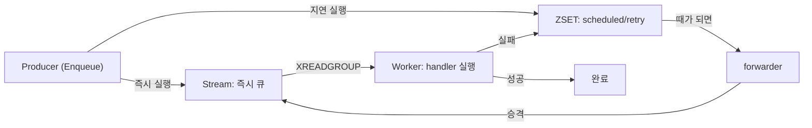
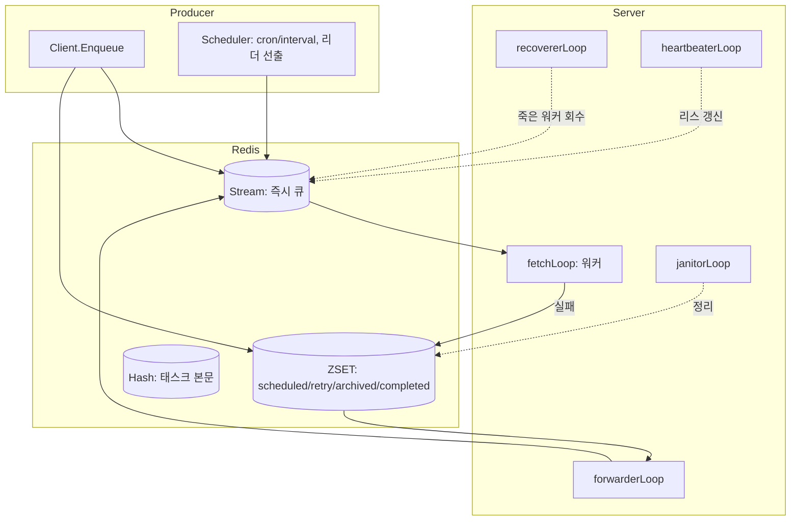
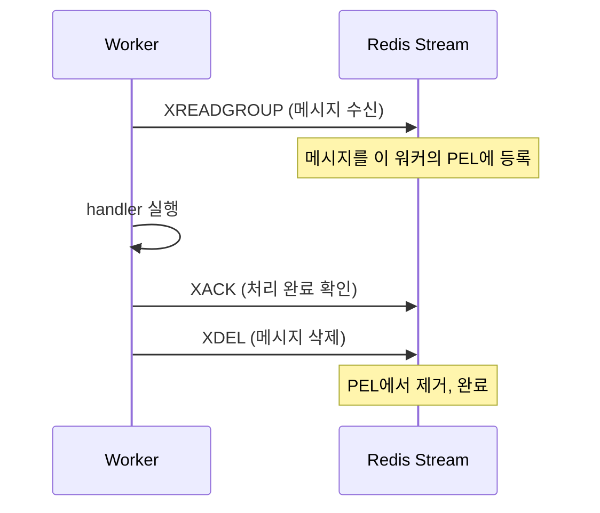

웹 서비스를 만들다 보면 "지금 당장 응답은 돌려주되, 무거운 일은 나중에 처리하고 싶다"는 요구가 반드시 생긴다. 회원가입 후 환영 메일 발송, 결제 후 정산 집계, 이미지 리사이징 같은 작업이다. 이런 일을 요청-응답 흐름에서 떼어내 백그라운드로 넘기는 장치가 **태스크 큐(task queue)** 다.

이 시리즈는 필자가 직접 만든 Redis 기반 분산 태스크 큐 [chronos-go](https://github.com/kenshin579/chronos-go)의 내부 구현을 한 편씩 뜯어보며, "분산 태스크 큐를 제대로 만들려면 어떤 문제를 풀어야 하는가"를 스터디한다. 첫 편에서는 세부 구현에 들어가기 전에 **전체 아키텍처 지도**를 그린다.

# 1. 태스크 큐, 직접 만들면 무엇이 필요할까

가장 소박한 태스크 큐를 상상해 보자. Redis 리스트에 작업을 `LPUSH`로 밀어 넣고, 워커가 `BRPOP`으로 하나씩 꺼내 처리한다. 이 정도면 "나중에 처리하기"는 된다. 하지만 실제 서비스에 올리는 순간 질문이 쏟아진다.

- 워커가 작업을 꺼낸 직후 **죽으면** 그 작업은 어떻게 되나? `BRPOP`은 이미 리스트에서 제거했으니 유실된다.
- "10분 뒤에 실행"처럼 **지연 실행**은 어떻게 하나? 리스트에는 시간 개념이 없다.
- 실패한 작업을 **재시도**하려면? 몇 번까지, 얼마 간격으로?
- 여러 큐에 **우선순위**를 두고 싶다면?
- cron처럼 **주기 실행**을 하는데, 인스턴스가 여러 대면 중복 실행되지 않을까?

즉 태스크 큐의 본질적인 난이도는 "작업을 넣고 빼기"가 아니라, **작업이 유실·중복되지 않도록 상태를 관리하는 것**에 있다. chronos-go는 이 문제들을 Redis의 여러 자료구조에 상태를 나눠 담는 방식으로 푼다.

# 2. 핵심 아이디어: Stream과 ZSET의 분리

chronos-go의 전체 설계를 관통하는 한 문장은 이것이다.

> **즉시 실행할 일은 Redis Stream에 태우고, 시간이 얽힌 일은 전부 ZSET(sorted set)에 담아 두었다가, forwarder가 때가 된 항목을 Stream으로 밀어 올린다.**

## 2.1 Redis Stream은 어떻게 동작하나

Stream은 Redis 5.0에서 도입된 **append-only 로그** 자료구조다. 이름 그대로 로그 파일처럼, 항목(entry)이 뒤에 계속 쌓인다. 각 항목은 두 가지로 이루어진다.

- **항목 ID** — 추가될 때 자동으로 부여되는 `<밀리초시각>-<시퀀스>` 형태의 값이다(예: `1721289600123-0`). 시간순으로 단조 증가하므로, ID만 봐도 항목의 선후 관계를 알 수 있다.
- **field-value 쌍** — 항목이 담는 실제 데이터. chronos-go의 Stream 항목에는 처리할 태스크를 가리키는 정보(태스크 ID 등)가 들어가고, 태스크 본문 자체는 별도의 Hash(`chronos:{q}:t:<id>`)에 저장한다.

기본 조작은 다음과 같다. `XADD`로 항목을 추가하고, `XLEN`으로 개수를 세고, `XRANGE`로 범위를 조회한다.

```bash
# 항목 추가 → Redis가 항목 ID를 돌려준다
> XADD chronos:{default}:stream '*' task_id 1a2b3c
"1721289600123-0"

# 현재 쌓인 항목 수
> XLEN chronos:{default}:stream
(integer) 1
```

Stream을 다루는 명령은 크게 두 갈래다. 하나는 **스트림(로그) 자체**를 조작하는 명령(항목을 추가·삭제·조회)이고, 다른 하나는 그 위에 얹은 **consumer group**을 다루는 명령(누가 어디까지 읽었는지, 무엇이 미확인 상태인지 관리)이다. chronos-go가 실제로 쓰는 명령을 "사용" 열에 표시했다.

| 명령 | 분류 | 설명 | chronos-go 사용 |
| ---- | ---- | ---- | :---: |
| `XADD` | 스트림 | 항목을 추가하고 항목 ID를 반환 | ✅ (enqueue) |
| `XLEN` | 스트림 | 항목 개수 조회 | ✅ (큐 통계) |
| `XRANGE` / `XREVRANGE` | 스트림 | ID 범위로 항목 조회 | — |
| `XDEL` | 스트림 | 특정 항목 삭제 | ✅ (ack 후 삭제) |
| `XTRIM` | 스트림 | 오래된 항목을 길이·나이 기준으로 잘라냄 | — |
| `XREAD` | 스트림 | consumer group 없이 항목을 읽음 | — |
| `XGROUP CREATE` | 컨슈머 그룹 | consumer group을 생성(`MKSTREAM`으로 Stream도 함께) | ✅ (큐 초기화) |
| `XREADGROUP` | 컨슈머 그룹 | 그룹으로 항목을 받아 PEL에 등록 | ✅ (워커) |
| `XACK` | 컨슈머 그룹 | 항목 처리 완료를 확인해 PEL에서 제거 | ✅ (성공 시) |
| `XPENDING` | 컨슈머 그룹 | PEL(미확인 항목) 현황 조회 | ✅ (inspector) |
| `XCLAIM` | 컨슈머 그룹 | 특정 항목의 소유권을 다른 consumer로 이전 | ✅ (heartbeat: `JUSTID`) |
| `XAUTOCLAIM` | 컨슈머 그룹 | 오래 방치된 항목을 한 번에 회수 | ✅ (recoverer) |
| `XINFO` | 조회 | Stream·그룹·consumer의 메타 정보 조회 | — |

chronos-go는 Stream의 consumer group 기능을 폭넓게 쓴다. `XREADGROUP`으로 받아 `XACK`+`XDEL`로 마무리하는 정상 흐름(2편), `XAUTOCLAIM`으로 죽은 워커의 항목을 회수하는 복구 흐름(5편), `XCLAIM ... JUSTID`로 리스를 갱신하는 heartbeat(5편)가 모두 이 명령들 위에 세워져 있다.

Stream이 태스크 큐에 적합한 이유는 **리스트·pub/sub과 다른 두 가지 성질** 때문이다.

- **리스트와 달리, 읽어도 사라지지 않는다.** 리스트의 `BRPOP`은 값을 꺼내는 즉시 리스트에서 제거한다. 반면 Stream 항목은 명시적으로 지우기 전까지(`XDEL`/`XTRIM`) 로그에 남아 있어, "누가 어디까지 읽었고, 무엇이 아직 처리되지 않았는가"를 Redis가 추적할 수 있다.
- **pub/sub과 달리, 나중에 읽어도 된다.** pub/sub은 발행하는 순간 구독 중이 아니면 메시지를 놓친다(fire-and-forget). Stream은 로그에 남으므로, 워커가 잠깐 죽었다 살아나도 밀린 항목을 이어서 읽는다.

여기에 **consumer group**을 얹으면 여러 워커가 하나의 Stream을 나눠 읽으면서, 각 항목이 처리 완료(ack)됐는지까지 추적된다. 이 부분이 "메시지를 잃지 않는 분배"의 핵심인데, 자세한 동작은 아래 FAQ 7.1과 2편에서 다룬다.

## 2.2 왜 Stream과 ZSET을 나누는가

왜 이렇게 상태를 두 자료구조로 나누는가?

- **Stream**은 "지금 처리할 작업의 대기열"에 어울린다. consumer group을 붙이면 여러 워커가 나눠 소비하면서도, 아직 처리 완료(ack)되지 않은 작업을 Redis가 추적해 준다. 워커가 죽어도 미처리 작업이 사라지지 않는다는 뜻이다. 리스트의 `BRPOP`에는 없는 성질이다.
- **ZSET**은 "언제 실행할지"라는 시간 축을 자연스럽게 표현한다. score에 실행 예정 시각(unix time)을 넣으면, "지금 이전에 실행돼야 할 작업"을 `ZRANGEBYSCORE`로 한 번에 조회할 수 있다. 지연 실행, 재시도 대기, 완료 후 보존 같은 "시간이 지나면 상태가 바뀌는" 작업이 전부 여기 들어간다.

이 두 세계를 잇는 다리가 **forwarder**다. forwarder는 주기적으로 ZSET을 훑어 "실행 시각이 도래한" 작업을 Stream으로 옮긴다. 그러면 워커가 Stream에서 그 작업을 집어 처리한다. 태스크의 일생은 이 흐름을 따라 흐른다.



# 3. Redis 자료구조 지도

chronos-go가 사용하는 Redis 키는 모두 `internal/base/keys.go` 한 곳에서 정의된다. 태스크가 거쳐 가는 상태별로 어떤 자료구조를 쓰는지 정리하면 다음과 같다.

| 상태 | Redis 타입 | 키 형태 | score / 의미 |
| ---- | ---------- | ------- | ------------ |
| 즉시 실행 대기 | Stream | `chronos:{q}:stream` | consumer group으로 소비 |
| 태스크 본문·상태 | Hash | `chronos:{q}:t:<id>` | 본문 + 상태 + 재시도 횟수 |
| 지연 실행 대기 | ZSET | `chronos:{q}:scheduled` | `process_at` |
| 재시도 대기 | ZSET | `chronos:{q}:retry` | `retry_at` |
| 죽은 작업(DLQ) | ZSET | `chronos:{q}:archived` | `died_at` |
| 완료 후 보존 | ZSET | `chronos:{q}:completed` | `expire_at` |

키 이름에서 눈에 띄는 것이 `{q}`, 즉 큐 이름을 중괄호로 감싼 부분이다. 이것은 **Redis Cluster의 hash tag** 로, 한 큐의 모든 키가 같은 슬롯(slot)에 배치되도록 강제한다. 덕분에 여러 키를 한꺼번에 건드리는 Lua 스크립트가 클러스터에서도 원자적으로 동작한다. 이 설계 제약은 시리즈 내내 반복해서 등장한다. 마지막 9편에서 자세히 다룬다.

실제 코드를 보면 키 조립이 문자열 연결 한 줄로 끝난다.

```go
// QueueKeyPrefix returns the common prefix for all keys of a queue. The queue
// name is wrapped in a Redis Cluster hash tag ({...}) so that every key of a
// single queue hashes to the same slot, allowing multi-key Lua scripts to run
// on a cluster.
func QueueKeyPrefix(qname string) string {
	return "chronos:{" + qname + "}:"
}

// StreamKey returns the Stream key holding task IDs ready for immediate
// execution (consumed via a consumer group).
func StreamKey(qname string) string {
	return QueueKeyPrefix(qname) + "stream"
}

// ScheduledKey returns the ZSET key holding delayed tasks (score = process_at).
func ScheduledKey(qname string) string {
	return QueueKeyPrefix(qname) + "scheduled"
}
```

한편 큐에 묶이지 않는 **글로벌 키**도 있다. 이들은 hash tag 없이(`chronos:queues`, `chronos:paused`, `chronos:leader`, `chronos:schedules`) 단일 키 명령으로만 접근한다. 여러 키를 묶는 스크립트가 이들을 건드리지 않기 때문에 클러스터에서도 안전하다.

```go
// QueuesKey returns the SET key listing all known queue names. It has no hash
// tag on purpose: it is a global index touched by a standalone command, never
// inside a per-queue multi-key script.
func QueuesKey() string {
	return "chronos:queues"
}

// LeaderKey is the STRING key holding the current scheduler leader's instance ID.
func LeaderKey() string { return "chronos:leader" }
```

정리하면 chronos-go의 상태는 **"큐별 상태(hash tag O) + 글로벌 인덱스(hash tag X)"** 두 갈래로 나뉜다. 어떤 키가 어느 쪽에 속하는지가 곧 그 키를 어떻게 다뤄야 하는지를 결정한다.

# 4. 컴포넌트 지도: 서버는 무엇을 돌리는가

상태를 담는 자료구조를 봤으니, 이제 그 상태를 실제로 움직이는 **일꾼들**을 보자. `Server.Start()`는 서버를 띄울 때 백그라운드 고루틴 다섯 개를 한꺼번에 기동한다.

```go
func (s *Server) Start(ctx context.Context, mux *Mux) error {
	// ...
	go s.fetchLoop(runCtx)
	go s.forwarderLoop(runCtx)
	go s.recovererLoop(runCtx)
	go s.heartbeaterLoop(runCtx)
	go s.janitorLoop(runCtx)
	// ...
}
```

이 다섯 루프가 사실상 chronos-go의 뼈대이며, 이 시리즈의 이후 편들이 각각을 하나씩 파고든다.

| 루프 | 하는 일 | 다루는 편 |
| ---- | ------- | --------- |
| `fetchLoop` | Stream을 `XREADGROUP`으로 소비해 핸들러 실행, 성공 시 `XACK`+`XDEL` | 2편 |
| `forwarderLoop` | scheduled/retry ZSET에서 때가 된 작업을 Stream으로 승격 | 3편 |
| `recovererLoop` | 죽은 워커가 붙잡고 있던 작업을 `XAUTOCLAIM`으로 회수 | 5편 |
| `heartbeaterLoop` | 실행 중인 작업의 리스(lease)와 unique 락 TTL 갱신 | 5편 |
| `janitorLoop` | archived/completed를 나이·개수 기준으로 정리해 메모리 바운딩 | 4편 |

그리고 이 다섯 루프와 별개로, 두 개의 주체가 더 있다.

- **Client (`Enqueue`)** — 작업을 큐에 밀어 넣는 생산자 측이다. `WithProcessAt`(지연 실행), `WithMaxRetry`(재시도 횟수), `WithUnique`(중복 방지) 같은 옵션으로 작업의 성격을 지정한다. 작업이 즉시 실행이면 Stream으로, 지연 실행이면 scheduled ZSET으로 들어간다.
- **Scheduler (`NewScheduler`)** — cron·interval 기반 주기 실행을 담당한다. 인스턴스가 여러 대여도 **리더 선출**을 통해 오직 하나만 트리거를 발화하므로, 같은 주기 작업이 중복 실행되지 않는다. 7편의 주제다.

전체를 하나의 그림으로 합치면 이렇게 된다.



# 5. 전달 보장: at-least-once

마지막으로 아키텍처를 이해할 때 반드시 짚어야 할 성질이 하나 있다. chronos-go의 전달 보장은 **at-least-once(적어도 한 번)** 다.

```go
// # Delivery semantics
//
// Delivery is at-least-once: a handler may run more than once (redelivery after
// a crash, or a recoverer reclaiming a stalled task), so handlers must be
// idempotent.
```

즉 하나의 작업에 대해 핸들러가 **두 번 이상 실행될 수 있다**. 워커가 핸들러를 다 실행하고 나서 `XACK`을 보내기 직전에 죽으면, Redis 입장에서는 그 작업이 아직 미처리 상태다. recoverer가 이를 회수해 다시 Stream에 넣으면 핸들러가 한 번 더 돈다. 이 "왜 두 번 실행될 수 있는가"의 구체적인 메커니즘은 5편에서 다룬다.

여기서 얻을 결론은 실용적이다. **핸들러 로직은 멱등(idempotent)하게 작성해야 한다.** "메일을 두 번 보내도 괜찮은가?", "정산을 두 번 집계해도 결과가 같은가?"를 항상 자문해야 한다. 이것은 chronos-go만의 특성이 아니라, 유실을 막는 분산 큐가 필연적으로 지불하는 대가다. (유실도 없고 중복도 없는 exactly-once는 분산 환경에서 매우 비싸거나 불가능하다.)

# 6. 정리

이번 편에서 그린 지도를 요약하면 이렇다.

- 태스크 큐의 본질적 난이도는 "넣고 빼기"가 아니라 **작업이 유실·중복되지 않게 상태를 관리하는 것**이다.
- chronos-go는 **즉시 실행 = Stream, 시간이 얽힌 것 = ZSET**으로 상태를 나누고, **forwarder**가 둘을 잇는다.
- 서버는 `fetchLoop`·`forwarderLoop`·`recovererLoop`·`heartbeaterLoop`·`janitorLoop` 다섯 고루틴으로 돌아가고, 여기에 생산자 측 **Client**와 주기 실행을 담당하는 **Scheduler**가 더해진다.
- 모든 큐별 키는 `{queue}` hash tag로 묶여 클러스터에서도 원자적 스크립트를 쓸 수 있다.
- 전달 보장은 **at-least-once**이며, 따라서 핸들러는 멱등해야 한다.

다음 2편에서는 이 지도의 출발점인 **즉시 큐**를 파고든다. 왜 리스트가 아니라 Redis Stream인지, `XREADGROUP`·`XACK`·`XDEL`이 어떻게 "메시지를 잃지 않는 분배"를 만들어 내는지 살펴본다.

# 7. FAQ

## 7.1 `XREADGROUP`이 정확히 무엇인가요?

`XREADGROUP`은 Redis Stream을 **consumer group** 단위로 읽는 명령이다. 왜 그냥 읽기(`XREAD`)가 아니라 그룹 읽기가 필요한지 이해하면 chronos-go가 Stream을 고른 이유가 함께 풀린다.

- **consumer group**은 하나의 Stream을 여러 워커(consumer)가 나눠 읽도록 해 주는 장치다. 같은 그룹에 속한 워커들은 각자 다른 메시지를 받으므로, 워커를 늘리면 처리량이 늘어난다. chronos-go는 큐마다 Stream 하나에 consumer group 하나를 붙인다.
- `XREADGROUP`으로 메시지를 받으면 Redis는 그 메시지를 그 워커의 **PEL(Pending Entries List, 미확인 목록)** 에 올려 둔다. 즉 "이 워커가 이 메시지를 받아갔지만 아직 처리 완료를 확인(ack)하지 않았다"는 상태를 Redis가 기억한다.
- 워커가 핸들러를 성공적으로 끝내면 `XACK`으로 "처리 완료"를 알리고, chronos-go는 이어서 `XDEL`로 메시지 자체를 지운다. 그러면 PEL에서도 빠진다.

바로 이 PEL 덕분에 Stream이 리스트보다 강하다. 리스트에서 `BRPOP`으로 꺼낸 값은 즉시 리스트에서 사라지므로, 꺼낸 직후 워커가 죽으면 그 작업은 유실된다. 반면 Stream에서 `XREADGROUP`으로 받은 메시지는 `XACK` 전까지 PEL에 남아 있어, 워커가 죽어도 "미확인 상태로" 보존된다. chronos-go의 recoverer는 이 PEL을 뒤져 오래 방치된 메시지를 회수한다(5편).

간단한 명령 흐름은 다음과 같다.



## 7.2 이 글에 나온 다른 `X...` 명령들은 뭔가요?

이번 편은 지도를 그리는 편이라 이름만 등장했다. 각각은 해당 편에서 자세히 다룬다.

| 명령 | 한 줄 설명 | 다루는 편 |
| ---- | ---------- | --------- |
| `XREADGROUP` | consumer group으로 메시지를 받아 PEL에 등록 | 2편 |
| `XACK` / `XDEL` | 처리 완료를 확인하고 메시지를 삭제 | 2편 |
| `XAUTOCLAIM` | 오래 방치된(죽은 워커의) 메시지를 회수 | 5편 |
| `XCLAIM ... JUSTID` | 실행 중인 작업의 리스를 갱신해 회수를 방지 | 5편 |

---

> 이 글의 코드는 chronos-go [`88fe6d1`](https://github.com/kenshin579/chronos-go) 기준이다. 이후 구현이 바뀌면 세부는 달라질 수 있다.
