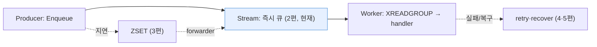
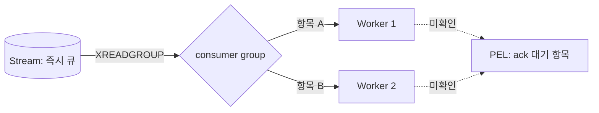
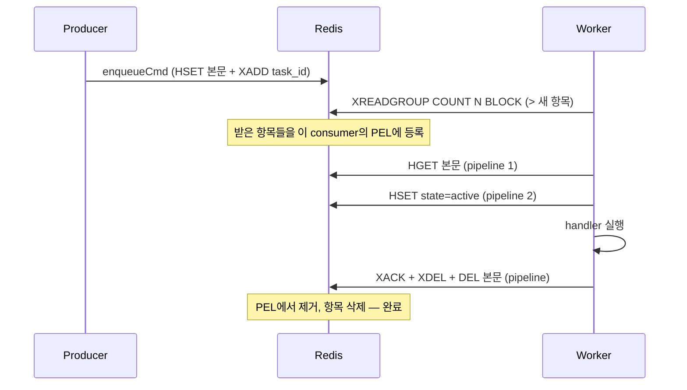

[1편](https://github.com/kenshin579/chronos-go)에서 chronos-go의 전체 지도를 그렸다. 핵심 문장은 "즉시 실행할 일은 Redis Stream에, 시간이 얽힌 일은 ZSET에 담는다"였다. 이번 편은 그중 **즉시 큐**, 즉 "지금 처리할 작업을 어떻게 워커에게 나눠주는가"를 파고든다.

문제의 본질은 하나다. 프로듀서가 밀어 넣은 작업이 **한 워커에게 전달되되, 그 워커가 처리 도중 죽어도 사라지면 안 된다.** 이 편에서는 왜 가장 소박한 선택지인 리스트(`LPUSH`/`BRPOP`)로는 이걸 못 하는지, 그리고 chronos-go가 Redis Stream의 consumer group으로 어떻게 푸는지를 실제 코드로 확인한다. (워커가 실제로 죽었을 때의 복구는 5편 소관이고, 여기서는 정상 경로 위주로 본다.)

이 시리즈에서 지금 어디에 있는지 표시하면 다음과 같다.



# 1. 리스트로는 왜 부족한가

가장 먼저 떠오르는 구현은 리스트다. 프로듀서가 `LPUSH`로 작업을 밀어 넣고, 워커가 `BRPOP`으로 하나씩 꺼내 처리한다. 코드는 짧고 직관적이다. 하지만 여기엔 치명적인 구멍이 있다.

`BRPOP`은 값을 꺼내는 **즉시 리스트에서 제거**한다. 워커가 작업을 꺼낸 직후, 아직 핸들러를 다 돌리지도 못한 채 죽으면 그 작업은 어디에도 남아 있지 않는다. Redis 입장에서는 "누가 이 작업을 가져갔고, 처리를 끝냈는지"를 추적할 방법이 없다. 꺼낸 순간 그 작업은 워커의 메모리 안에만 존재하고, 워커와 함께 사라진다.

pub/sub은 더 나쁘다. 발행 순간 구독 중이 아니면 메시지를 아예 놓친다(fire-and-forget). 워커가 잠깐 재시작하는 사이 들어온 작업은 그냥 증발한다.

정리하면 리스트·pub/sub에는 **"전달했지만 아직 처리 완료를 확인받지 못한 작업"** 이라는 중간 상태를 표현할 자리가 없다. 유실 없는 큐를 만들려면 바로 이 중간 상태를 서버 측(Redis)이 기억해 줘야 한다. 그게 Redis Stream의 consumer group이 제공하는 것이다.

# 2. Redis Stream + consumer group의 동작 원리

## 2.1 consumer group과 PEL

Stream은 append-only 로그이고, 그 위에 **consumer group**을 얹으면 여러 워커(consumer)가 하나의 Stream을 나눠 읽을 수 있다. 이때 두 가지 성질이 핵심이다.

- **분배**: 같은 그룹에 속한 워커들은 `XREADGROUP`으로 각자 **서로 다른** 항목을 받는다. 한 항목은 그룹 안에서 오직 한 워커에게만 전달된다. 그래서 워커를 늘리면 처리량이 늘어난다.
- **미확인 추적(PEL)**: `XREADGROUP`으로 항목을 받으면 Redis는 그 항목을 그 워커의 **PEL(Pending Entries List, 미확인 목록)** 에 올려 둔다. "이 워커가 이 항목을 받아갔지만, 아직 처리 완료(ack)를 확인하지 않았다"는 상태를 Redis가 대신 기억해 주는 것이다.

바로 이 PEL이 리스트에 없던 "중간 상태"다. 워커가 `XACK`을 보내기 전까지 항목은 PEL에 남아 있으므로, 워커가 처리 도중 죽어도 그 항목은 "미확인 상태로" 보존된다. 나중에 다른 워커가 이 PEL을 뒤져 방치된 항목을 회수할 수 있다(이 복구가 recoverer, 5편 주제다).



## 2.2 XREADGROUP의 `>` 가 뜻하는 것

`XREADGROUP`을 호출할 때는 어디서부터 읽을지를 ID로 지정한다. chronos-go는 항상 특수 ID `>`를 쓴다. `>`는 **"이 그룹의 어떤 consumer에게도 아직 전달된 적 없는 새 항목"** 을 뜻한다. 즉 `>`로 읽으면 Redis가 새 항목을 하나 떼어 이 워커의 PEL에 등록하고 돌려준다. (반대로 구체적인 ID를 주면 이미 내 PEL에 있는 항목을 다시 조회하는 것이 되는데, 정상 경로에서는 쓰지 않는다.)

# 3. Enqueue: 태스크를 Stream에 태우기

프로듀서 쪽부터 보자. `chronos.Enqueue`는 옵션을 해석해, 지연 실행이 아니면 `rdb.Enqueue`로 내려간다(`chronos.go`의 `dispatchMessage`). 그 실제 구현은 `internal/rdb/rdb.go`의 `Enqueue`다.

```go
// Enqueue stores a task and makes it immediately available for processing.
func (r *RDB) Enqueue(ctx context.Context, msg *base.TaskMessage) error {
	msg.State = base.StatePending
	encoded, err := base.EncodeMessage(msg)
	if err != nil {
		return err
	}
	// Register the queue name in the global index (cached — one round trip per
	// queue per process). ...
	if err := r.registerQueue(ctx, msg.Queue); err != nil {
		return err
	}
	keys := []string{
		base.TaskKey(msg.Queue, msg.ID),
		base.StreamKey(msg.Queue),
		base.CompletedKey(msg.Queue),
		base.ArchivedKey(msg.Queue),
	}
	argv := []interface{}{encoded, int(base.StatePending), msg.ID}
	return enqueueCmd.Run(ctx, r.client, keys, argv...).Err()
}
```

여기서 두 가지가 눈에 띈다. 첫째, 태스크 본문 자체는 Stream에 넣지 않는다. 본문은 JSON으로 직렬화(`base.EncodeMessage`)해 별도의 Hash(`chronos:{q}:t:<id>`)에 저장하고, Stream에는 **태스크 ID만** 태운다. 둘째, 실제 쓰기는 Lua 스크립트 `enqueueCmd` 한 방으로 원자적으로 처리된다.

```lua
redis.call("HSET", KEYS[1], "msg", ARGV[1], "state", ARGV[2])
redis.call("XADD", KEYS[2], "*", "task_id", ARGV[3])
redis.call("ZREM", KEYS[3], ARGV[3])
redis.call("ZREM", KEYS[4], ARGV[3])
return 1
```

- `HSET`(KEYS[1] = task hash): 태스크 본문(`msg`)과 상태(`state` = pending)를 저장한다. 상태 값은 `int(base.StatePending)`, 즉 `1`이다(`internal/base/task.go`의 `StatePending = iota + 1`).
- `XADD`(KEYS[2] = stream): Stream에 `task_id` 필드 하나짜리 항목을 추가한다. `*`는 항목 ID를 Redis가 자동 부여하라는 뜻이다.
- 뒤의 두 `ZREM`은 같은 ID로 예전에 처리됐던 태스크가 completed/archived ZSET에 남긴 흔적을 지운다. 안 지우면 나중에 janitor(4편)가 그 오래된 항목을 정리하다가 방금 넣은 새 태스크의 Hash까지 지워 버릴 수 있어서다.

이 네 키는 모두 `chronos:{q}:` 접두사를 공유한다(`internal/base/keys.go`). `{q}` hash tag 덕분에 한 큐의 키가 같은 클러스터 슬롯에 모여, 이 멀티 키 Lua 스크립트가 Redis Cluster에서도 원자적으로 돈다(9편 주제).

한편 큐 이름을 전역 인덱스에 등록하는 `registerQueue`는 이 스크립트 **밖**에 있다. 등록 대상인 `chronos:queues`에는 hash tag가 없어(다른 슬롯) 멀티 키 스크립트에 섞을 수 없기 때문이다. 대신 `sync.Map`으로 프로세스당 큐마다 한 번만 `SADD`하도록 캐싱해, 매 enqueue마다 왕복이 늘지 않게 한다.

## 3.1 consumer group은 언제 만들어지나

Stream에 항목을 넣어도 그것을 읽을 consumer group이 없으면 소용없다. 그룹 생성은 서버가 뜰 때 `EnsureGroup`이 담당한다.

```go
func (r *RDB) EnsureGroup(ctx context.Context, qname string) error {
	err := r.client.XGroupCreateMkStream(ctx, base.StreamKey(qname), ConsumerGroup, "0").Err()
	if err != nil && !strings.HasPrefix(err.Error(), "BUSYGROUP") {
		return err
	}
	return nil
}
```

세 가지를 짚어 둔다. (1) `MkStream` 덕분에 아직 태스크가 하나도 없어 Stream이 없어도 그룹 생성과 함께 Stream이 만들어진다. (2) 그룹 시작 위치가 `"0"`(스트림 처음)이지 `"$"`(지금 이후)가 아니다. `"$"`로 만들면 서버가 뜨기 **전에** 이미 enqueue된 태스크가 `XREADGROUP`에 영영 안 잡힌다. 처리 끝난 항목은 아래에서 보듯 `XDEL`로 지우므로, `"0"`에서 시작해도 옛 작업을 다시 실행하는 일은 없다. (3) 이미 그룹이 있으면 Redis가 `BUSYGROUP` 에러를 주는데, 이건 정상이라 무시한다. 그룹 이름은 큐마다 하나, 상수 `ConsumerGroup = "chronos"`다.

# 4. 워커의 소비 흐름

이제 소비 측이다. 서버는 `fetchLoop`(`server.go`) 고루틴에서 반복적으로 큐를 훑어 태스크를 꺼내고, 핸들러로 넘긴다. 여러 큐 사이의 우선순위·공정성(WRR)은 6편 주제이니 여기서는 한 큐에서 태스크를 꺼내 처리하는 핵심 경로에 집중한다. 그 핵심이 `DequeueBatch`다.

## 4.1 XREADGROUP 배칭 + 파이프라이닝

가장 소박하게 짜면 "태스크 하나 읽고, 본문 하나 불러오고, 상태 하나 바꾸고"를 태스크마다 반복한다. 태스크 한 개당 왕복(round trip) 3번이다. chronos-go는 이를 **한 번에 여러 개**로 묶는다.

```go
res, err := r.client.XReadGroup(ctx, &redis.XReadGroupArgs{
	Group:    ConsumerGroup,
	Consumer: consumer,
	Streams:  []string{streamKey, ">"},
	Count:    int64(count),
	Block:    blockArg,
}).Result()
```

- `Count`(= `COUNT`): 한 번의 `XREADGROUP`으로 최대 `count`개 항목을 받는다. `fetchLoop`은 지금 놀고 있는 워커 슬롯 수에 맞춰 배치 크기를 정하고(최대 `maxFetchBatch = 128`), `count < 1`이면 1로 보정한다(go-redis는 `COUNT`가 0이면 아예 생략해 무한정 읽어 버리기 때문).
- `Block`: 블로킹 대기 시간이다. 여기엔 함정이 있다. Redis에서 `BLOCK 0`은 "무한 대기"라서, chronos-go는 "즉시 반환"을 원할 때 `block <= 0`을 `-1`로 바꿔 go-redis가 `BLOCK` 옵션 자체를 빼도록 한다. `fetchLoop`은 먼저 여러 큐를 논블로킹(`-1`)으로 훑고, 다 비었을 때만 첫 큐에 `pollBlock`(= 1초)만큼 블로킹해 응답성을 유지한다.
- `Streams: {streamKey, ">"}`: 앞서 본 `>`로, 아직 아무에게도 안 준 새 항목을 받는다. 스트림을 하나만 지정하는 것도 의도적이다. 여러 스트림을 한 번에 주면 Redis가 여러 스트림의 항목을 섞어 돌려줄 수 있는데, 그중 첫 번째만 처리하면 나머지가 이미 PEL에 박힌 채 방치된다. 큐는 한 번에 하나씩만 읽는다.

항목들을 받은 뒤에는 본문 로딩과 상태 변경을 각각 **파이프라인 한 번**으로 묶는다. 파이프라인은 여러 명령을 한 번의 왕복으로 몰아 보내는 기법이다.

```go
// Pipeline 1: load every task body in one round trip.
getPipe := r.client.Pipeline()
getCmds := make([]*redis.StringCmd, len(entries))
for i, entry := range entries {
	taskIDs[i], _ = entry.Values["task_id"].(string)
	getCmds[i] = getPipe.HGet(ctx, base.TaskKey(qname, taskIDs[i]), "msg")
}
```

정리하면 배치 하나를 처리하는 왕복은 **태스크 개수와 무관하게 3번**이다. `XREADGROUP` 1번 + 본문 `HGET` 파이프라인 1번 + 상태 `HSET` 파이프라인 1번. "태스크당 3번"이 "배치당 3번"으로 줄어든다.

이 과정에서 두 가지 예외를 조용히 걸러낸다. Stream 항목은 있는데 본문 Hash가 이미 사라진 **고아(orphan)** 항목은 `XACK` + `XDEL`로 정리하고 건너뛴다. 본문이 깨져 디코딩에 실패한 항목은 배치 전체를 오염시키지 않도록 건너뛰되, PEL에 남겨 recoverer(5편)가 나중에 처리하게 둔다.

## 4.2 정상 완료: XACK + XDEL

본문을 얻은 태스크는 상태를 active로 바꾼 뒤 워커 고루틴으로 넘어가 핸들러가 실행된다(`process` → `dispatchSafely`, 핸들러 panic은 에러로 회수된다). 핸들러가 성공하면 `Done`이 마무리한다.

```go
// Done ... With no retention it acks the stream entry, deletes the task body,
// and releases the unique lock (if any).
func (r *RDB) Done(ctx context.Context, qname, streamID string, msg *base.TaskMessage) error {
	// ... (Retention > 0 이면 completed ZSET으로 이동)
	pipe := r.client.TxPipeline()
	pipe.XAck(ctx, base.StreamKey(qname), ConsumerGroup, streamID)
	pipe.XDel(ctx, base.StreamKey(qname), streamID)
	pipe.Del(ctx, base.TaskKey(qname, msg.ID))
	if _, err := pipe.Exec(ctx); err != nil {
		return err
	}
	return r.releaseUnique(ctx, msg)
}
```

- `XACK`: 이 항목을 처리 완료로 확인해 consumer의 **PEL에서 뺀다.** 이제 이 항목은 복구 대상이 아니다.
- `XDEL`: Stream에서 항목 자체를 지운다. `XACK`은 PEL에서만 빼고 항목은 로그에 남기므로, 로그가 무한정 커지지 않게 명시적으로 삭제한다.
- `Del`: 별도 Hash에 있던 태스크 본문을 지운다(보존 옵션 `WithRetention`을 쓰면 대신 completed ZSET으로 옮겨 일정 기간 남긴다).

전체 정상 흐름을 한 그림으로 요약하면 이렇다.



# 5. 정리

이번 편의 결론을 요약하면 이렇다.

- 리스트(`BRPOP`)·pub/sub에는 "전달했지만 아직 확인 안 된 작업"이라는 중간 상태를 담을 자리가 없어, 워커가 죽으면 작업이 유실된다.
- Redis Stream + consumer group은 `XREADGROUP`으로 받은 항목을 **PEL(미확인 목록)** 에 담아 이 문제를 푼다. `XACK` 전까지 항목이 보존되므로 유실되지 않는다.
- enqueue는 Lua 스크립트로 **본문은 Hash에, ID는 Stream에** 원자적으로 넣는다. 그룹은 서버 시작 시 `EnsureGroup`이 `"0"`부터 만들어, 서버보다 먼저 들어온 작업도 잡는다.
- 워커는 `XREADGROUP`의 `COUNT` 배칭과 파이프라이닝으로 **배치당 왕복 3번**에 여러 태스크를 소비하고, 성공하면 `XACK` + `XDEL`로 마무리한다.

여기서 다룬 것은 어디까지나 정상 경로다. `XREADGROUP`으로 받았지만 `XACK` 전에 워커가 죽어 PEL에 남은 항목을 누가 어떻게 회수하는지, 즉 at-least-once의 실체는 5편에서 다룬다. 다음 3편에서는 방향을 바꿔, "10분 뒤 실행" 같은 **지연 작업**이 ZSET에 저장됐다가 forwarder를 통해 이 Stream으로 승격되는 과정을 본다.

# 6. FAQ

## 6.1 consumer, consumer group, PEL을 다시 정확히 구분하면?

세 개념이 헷갈리기 쉬워 계층으로 정리한다.

- **consumer group**은 하나의 Stream에 붙는 논리적 소비 단위다. chronos-go는 큐(=Stream)마다 정확히 **하나**의 그룹(`"chronos"`)을 만든다. 그룹은 "이 Stream을 어디까지 소비했는가"를 대표한다.
- **consumer**는 그 그룹 안의 개별 소비자다. chronos-go에서는 서버 인스턴스마다 `uuid.NewString()`으로 하나씩 만들어진다(`NewServer`의 `consumer` 필드). 서버를 여러 대 띄우면 같은 그룹 안에 consumer가 여러 개 생기고, 새 항목이 이들에게 나뉘어 전달된다.
- **PEL**은 그룹이 관리하는, **consumer별 "미확인 항목" 목록**이다. 워커 A가 `XREADGROUP`으로 받은 항목은 A의 PEL에 들어가고, `XACK`을 받으면 빠진다. "누가 무엇을 받아갔고 아직 안 끝냈나"의 진실 원천이 바로 이 PEL이다.

즉 한 항목의 여정은 `Stream(대기) → XREADGROUP → 특정 consumer의 PEL(처리 중) → XACK/XDEL(완료·삭제)`이다.

## 6.2 `COUNT` 배칭과 파이프라이닝은 뭐가 다른가요?

둘 다 "왕복을 줄인다"는 목적은 같지만 층위가 다르다.

- **`COUNT` 배칭**은 `XREADGROUP` **한 명령**에 "최대 N개까지 한꺼번에 달라"고 요청하는 것이다. 명령 하나가 여러 항목을 돌려준다. chronos-go는 지금 비어 있는 워커 슬롯 수에 맞춰 N을 정한다(최대 128).
- **파이프라이닝**은 **서로 다른 여러 명령**(예: 항목 5개의 `HGET` 5번)을 한 번의 네트워크 왕복에 몰아 보내고 응답을 한꺼번에 받는 것이다. 명령 자체는 여러 개지만 왕복은 한 번이다.

chronos-go의 `DequeueBatch`는 이 둘을 겹쳐 쓴다. `COUNT`로 항목 여러 개를 한 번에 받고(`XREADGROUP` 1왕복), 그 항목들의 본문을 파이프라인으로 한 번에 불러오고(`HGET` 파이프라인 1왕복), 상태 변경도 파이프라인으로 한 번에 처리한다(`HSET` 파이프라인 1왕복). 그래서 배치에 태스크가 몇 개든 왕복은 3번으로 고정된다.

## 6.3 `XACK`을 했는데 왜 `XDEL`도 하나요?

`XACK`과 `XDEL`은 지우는 대상이 다르다. `XACK`은 항목을 **PEL(미확인 목록)에서** 뺄 뿐, 항목 자체는 Stream 로그에 그대로 남긴다. Stream은 append-only 로그라서 확인만으로는 줄어들지 않는다. chronos-go는 처리 끝난 항목을 로그에 쌓아 둘 이유가 없으므로 `XDEL`로 항목까지 지워 Stream 길이를 바운딩한다. 이 "확인 후 즉시 삭제" 정책 덕분에, `EnsureGroup`이 그룹을 `"0"`(스트림 맨 앞)부터 시작해도 이미 끝난 옛 작업을 다시 실행할 위험이 없다.

---

> 이 글의 코드는 chronos-go [`88fe6d1`](https://github.com/kenshin579/chronos-go) 기준이다. 이후 구현이 바뀌면 세부는 달라질 수 있다.
