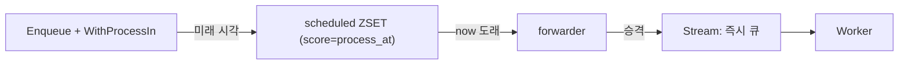
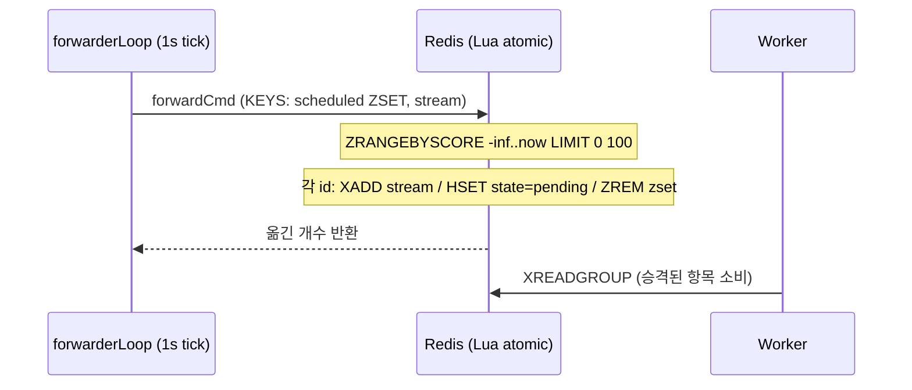

"회원가입 10분 뒤에 온보딩 메일을 보내라", "결제 3일 뒤에 리뷰 요청 알림을 띄워라". 태스크 큐에 반드시 따라붙는 요구가 **지연 실행**이다. 그런데 Redis Stream은 append-only 로그라서 "미래의 어느 시각"이라는 개념이 없다. `XADD`로 넣는 순간 워커가 바로 집어 간다. 그렇다면 "지금이 아니라 나중"은 어디에 어떻게 저장해 두었다가, 누가 그 시각을 감시하고 있다가 실행시키는 걸까?

[1편](https://github.com/kenshin579/chronos-go)에서 그린 지도의 한 문장을 다시 꺼내 보자. **즉시 실행할 일은 Stream, 시간이 얽힌 일은 ZSET, 그리고 forwarder가 둘을 잇는다.** 이번 편은 그 forwarder를 정면으로 뜯어본다. 지연 작업이 `scheduled` ZSET에 어떻게 담기고, forwarder가 `internal/rdb/forward.go`의 Lua 스크립트로 어떻게 "때가 된" 작업만 골라 Stream으로 원자적으로 밀어 올리는지, 그리고 그 감시 주기를 얼마로 잡아야 하는지가 주제다.



# 1. 왜 Stream만으로는 안 되는가

가장 단순한 발상은 "그냥 지연 시간만큼 재워 두었다가 넣자"다. Go라면 `time.AfterFunc(10*time.Minute, enqueue)` 한 줄이면 된다. 하지만 이건 분산 큐에서 곧바로 무너진다.

- 프로세스가 죽으면 타이머도 죽는다. 인메모리 타이머는 재시작을 견디지 못한다. 10분을 기다리던 작업이 서버 배포 한 번에 증발한다.
- 여러 인스턴스가 각자 타이머를 돌린다. 어느 인스턴스가 그 지연 작업을 책임질지 조율이 없으면 중복 실행되거나 아무도 안 한다.

그래서 지연 작업은 **Redis 안에 영속적으로** 적어 두어야 한다. 그리고 Redis Stream은 이 용도에 맞지 않는다. Stream 항목은 넣는 즉시 consumer group이 소비 대상으로 삼기 때문에, "지금 넣되 나중에 꺼내라"를 표현할 방법이 없다.

여기서 필요한 자료구조가 **ZSET(sorted set)** 이다. ZSET은 각 멤버에 실수 score를 매달아 정렬 상태로 보관한다. 이 score에 **"실행 예정 시각(process_at)"의 Unix 타임스탬프**를 넣으면, "지금 이전(score ≤ now)에 실행돼야 할 작업"을 `ZRANGEBYSCORE` 한 번으로 한꺼번에 뽑아낼 수 있다. 시간 축을 Redis가 대신 정렬해 주는 셈이다.

# 2. scheduled ZSET: 시간 축을 score에 담기

chronos-go는 지연 작업을 큐별 `scheduled` ZSET에 담는다. 키 형태와 score의 의미는 `internal/base`에 못 박혀 있다.

| 상태 | Redis 타입 | 키 형태 | score |
| ---- | ---------- | ------- | ----- |
| 지연 실행 대기 | ZSET | `chronos:{q}:scheduled` | `process_at` |
| 재시도 대기 | ZSET | `chronos:{q}:retry` | `retry_at` |

두 ZSET 모두 큐 이름을 `{q}` hash tag로 감싼다. 덕분에 뒤에 나올 forwarder의 Lua 스크립트가 `scheduled` ZSET과 `stream`, 그리고 태스크 Hash를 한 스크립트에서 동시에 건드려도 Redis Cluster에서 같은 슬롯에 놓여 원자적으로 실행된다(hash tag 이야기는 9편에서 정면으로 다룬다).

## 2.1 WithProcessAt과 WithProcessIn

생산자가 지연을 지정하는 문은 두 개다. 절대 시각을 주는 `WithProcessAt`과, 상대 지연을 주는 `WithProcessIn`이다.

```go
// WithProcessAt schedules the task to first become available at t. A non-future
// time enqueues immediately.
func WithProcessAt(t time.Time) Option {
	return optionFunc(func(o *enqueueOptions) {
		o.processAt = t
		o.processAtAbsolute = true
	})
}

// WithProcessIn schedules the task to first become available after d. A
// non-positive d enqueues immediately.
func WithProcessIn(d time.Duration) Option {
	return optionFunc(func(o *enqueueOptions) { o.processAt = time.Now().Add(d) })
}
```

주목할 점은 `WithProcessIn`이 결국 `time.Now().Add(d)`로 **절대 시각을 계산해 같은 `processAt` 필드에 넣는다**는 것이다. 즉 내부적으로는 둘 다 "언제(절대 시각)"로 환원되고, 이후 경로는 하나로 합쳐진다. (`processAtAbsolute` 플래그는 chain의 꼬리 링크 등에서 상대/절대 의미가 달라지는 지점을 구분하기 위한 것으로, 이 편의 범위 밖이다.)

## 2.2 즉시냐 지연이냐: 분기 지점

옵션이 정해지면 `dispatchMessage`가 이 작업을 어느 경로로 보낼지 딱 한 줄로 판정한다.

```go
func dispatchMessage(ctx context.Context, c *Client, msg *base.TaskMessage, options enqueueOptions) error {
	scheduled := !options.processAt.IsZero() && options.processAt.After(time.Now())
	// ...
	switch {
	// ...
	case scheduled:
		return c.rdb.Schedule(ctx, msg, options.processAt)
	default:
		return c.rdb.Enqueue(ctx, msg)
	}
}
```

핵심은 `scheduled` 판정 조건이다. `processAt`이 설정돼 있고(`!IsZero()`) **그것이 미래일 때만**(`After(time.Now())`) 지연 경로로 간다. 옵션 주석에도 명시돼 있듯 "과거 시각이나 음수 지연"은 지연으로 치지 않고 곧장 `Enqueue`(즉시 Stream)로 흘려보낸다. 이미 지나 버린 시각을 굳이 ZSET에 넣었다가 다음 forwarder 틱을 기다릴 이유가 없기 때문이다.

## 2.3 저장: scheduleCmd와 sub-second 정밀도

지연으로 판정되면 `RDB.Schedule`이 `scheduleCmd` Lua를 실행한다. 이 스크립트가 하는 일은 태스크 본문 저장, `scheduled` ZSET 등록, 과거 잔재 청소 세 가지다.

```lua
redis.call("HSET", KEYS[1], "msg", ARGV[1], "state", ARGV[2])
redis.call("ZADD", KEYS[2], ARGV[3], ARGV[4])
redis.call("ZREM", KEYS[3], ARGV[4])
redis.call("ZREM", KEYS[4], ARGV[4])
return 1
```

`KEYS[1]`은 태스크 Hash, `KEYS[2]`가 `scheduled` ZSET이다. 본문을 Hash에 넣고 상태를 `scheduled`로 찍은 뒤(`HSET`), score를 `process_at`으로 하여 ZSET에 올린다(`ZADD`). 뒤의 두 `ZREM`은 같은 ID의 태스크가 예전에 `completed`/`archived`에 남긴 잔재를 지우는 방어 로직으로, 이걸 안 지우면 janitor가 나중에 그 낡은 항목을 정리하면서 새 태스크의 Hash까지 지워 버릴 수 있다(janitor는 4편).

여기서 score를 만드는 함수가 미묘하다.

```go
func scheduleScore(t time.Time) float64 {
	return float64(t.Unix()) + float64(t.Nanosecond())/1e9
}
```

`t.Unix()`(정수 초)만 쓰지 않고 나노초를 소수부로 더한다. 왜일까? 만약 초 단위로 잘라 버리면(`t.Unix()`), 예컨대 "300밀리초 뒤 실행"이 현재 초의 경계값으로 내림돼 버려서, forwarder가 **때보다 이르게** 승격시킬 수 있다. 소수부를 살려 두면 1초보다 짧은 지연도 정확한 시점까지 ZSET에 머문다.

# 3. forwarder: ZSET에서 Stream으로 승격

이제 저장된 작업을 실제로 깨우는 쪽이다. 서버는 시작할 때 `forwarderLoop` 고루틴을 하나 띄우고, 이 루프가 일정 주기마다 모든 큐의 `retry`·`scheduled` ZSET을 훑는다.

```go
func (s *Server) forwarderLoop(ctx context.Context) {
	defer s.wg.Done()
	ticker := time.NewTicker(s.cfg.ForwardInterval)
	defer ticker.Stop()
	queues := s.queueNames()
	for {
		select {
		case <-ctx.Done():
			return
		case <-ticker.C:
			for _, q := range queues {
				if _, err := s.rdb.ForwardRetry(ctx, q, time.Now(), forwardBatchSize); err != nil {
					// ... 로깅
				}
				if _, err := s.rdb.ForwardScheduled(ctx, q, time.Now(), forwardBatchSize); err != nil {
					// ... 로깅
				}
			}
		}
	}
}
```

`ForwardInterval`(기본 1초)마다 틱이 돌고, 각 큐에 대해 `ForwardRetry`(재시도 대기)와 `ForwardScheduled`(지연 대기)를 차례로 호출한다. 한 틱에 옮기는 개수는 `forwardBatchSize = 100`으로 제한해, 한 번의 Redis 호출이 지나치게 길어지지 않게 한다. 밀린 작업이 100개를 넘어도 다음 틱들이 이어서 처리한다.

## 3.1 forwardCmd Lua 해부

승격의 실체는 `internal/rdb/forward.go`의 Lua 스크립트 하나다. 지연 작업과 재시도 작업이 **똑같은 스크립트**를 공유한다.

```lua
local ids = redis.call("ZRANGEBYSCORE", KEYS[1], "-inf", ARGV[1], "LIMIT", 0, tonumber(ARGV[2]))
for _, id in ipairs(ids) do
  redis.call("XADD", KEYS[2], "*", "task_id", id)
  redis.call("HSET", ARGV[3] .. id, "state", ARGV[4])
  redis.call("ZREM", KEYS[1], id)
end
return #ids
```

- `KEYS[1]`은 소스 ZSET(`scheduled` 또는 `retry`), `KEYS[2]`는 목적지 Stream이다.
- `ARGV[1]`이 컷오프 시각 `now`, `ARGV[2]`가 최대 개수(100), `ARGV[3]`이 태스크 키 접두사, `ARGV[4]`가 `pending` 상태값이다.

동작을 한 줄씩 따라가 보자.

1. `ZRANGEBYSCORE KEYS[1] -inf ARGV[1] LIMIT 0 max` — score가 **`-inf`부터 `now`까지**, 즉 실행 시각이 이미 도래한 작업 ID를 최대 `max`개 뽑는다. ZSET이 score로 정렬돼 있으니 due 항목이 앞쪽에 모여 있어 효율적이다.
2. 뽑힌 각 ID에 대해:
   - `XADD KEYS[2] * task_id id` — Stream에 `task_id` 필드로 항목을 추가한다. 이 순간부터 워커가 소비 대상으로 본다.
   - `HSET ARGV[3]..id state pending` — 태스크 Hash의 최상위 `state` 필드를 `pending`으로 바꾼다. (본문을 다시 쓰지 않고 상태 필드만 갱신한다. 소스 주석에 따르면 이 최상위 `state`가 권위 있는 상태값이고, 직렬화된 `msg` 안의 State가 아니다.)
   - `ZREM KEYS[1] id` — 소스 ZSET에서 그 ID를 제거한다.
3. `return #ids` — 옮긴 개수를 반환한다.

즉 "찾기(ZRANGEBYSCORE) → 태우기(XADD) → 상태 갱신(HSET) → 지우기(ZREM)"가 한 태스크의 승격 사이클이다.

## 3.2 왜 Lua 한 덩어리인가 — 원자적 이동

이 세 명령(`XADD`/`HSET`/`ZREM`)을 애플리케이션에서 순차 호출하면 중간에 끼어들 틈이 생긴다. `XADD`로 Stream에 넣은 직후 `ZREM` 전에 프로세스가 죽으면, 그 작업은 **Stream에도 있고 ZSET에도 남아** 다음 틱에서 또 `XADD`된다. 반대로 `ZREM`을 먼저 하면 그사이 크래시 시 작업이 통째로 증발한다. 어느 순서든 원자성이 깨지면 중복 아니면 유실이다.

Lua 스크립트는 Redis에서 **단일 원자 단위로** 실행된다. 스크립트가 도는 동안 다른 명령이 끼어들지 못하므로, 한 태스크의 `XADD`+`HSET`+`ZREM`은 전부 성립하거나 전부 성립하지 않는다. 게다가 소스 ZSET·Stream·태스크 Hash 키가 모두 같은 `{q}` hash tag를 공유하기 때문에, 이 다중 키 스크립트는 Redis Cluster에서도 안전하다.



다만 승격 자체는 원자적이어도, 승격된 뒤 워커가 처리하다 죽는 경우가 있다. 그래서 전체 전달 보장은 여전히 **at-least-once**이며, 이 "왜 두 번 실행될 수 있나"의 실체는 5편(recoverer)에서 다룬다.

## 3.3 retry ZSET도 같은 forwarder가 처리한다

앞서 봤듯 `forwardCmd`는 `ForwardScheduled`와 `ForwardRetry`가 공유한다. 둘의 차이는 넘기는 인자뿐이다.

```go
func (r *RDB) ForwardScheduled(ctx context.Context, qname string, now time.Time, max int) (int, error) {
	keys := []string{base.ScheduledKey(qname), base.StreamKey(qname)}
	argv := []interface{}{scheduleScore(now), max, base.TaskKeyPrefix(qname), int(base.StatePending)}
	// ... forwardCmd.Run
}

func (r *RDB) ForwardRetry(ctx context.Context, qname string, now time.Time, max int) (int, error) {
	keys := []string{base.RetryKey(qname), base.StreamKey(qname)}
	argv := []interface{}{now.Unix(), max, base.TaskKeyPrefix(qname), int(base.StatePending)}
	// ... forwardCmd.Run
}
```

`ForwardScheduled`는 소스로 `ScheduledKey`를, 컷오프로 `scheduleScore(now)`(소수부 포함)를 쓰고, `ForwardRetry`는 `RetryKey`와 `now.Unix()`(정수 초)를 쓴다. 지연 작업과 재시도 작업은 "미래의 어느 시각에 Stream으로 돌아온다"는 구조가 완전히 같아서, 한 forwarder가 ZSET 두 개를 같은 방식으로 비운다. **다만 재시도가 왜·언제 그 ZSET에 담기는지(backoff 정책)는 4편의 소관**이고, 이번 편은 "이미 담긴 것을 때가 되면 승격시킨다"는 공통 메커니즘까지만 본다.

# 4. 폴링 주기 트레이드오프

forwarder는 **폴링(polling)** 방식이다. 이벤트가 밀어 주는 게 아니라, 주기적으로 ZSET을 "지금 due인 게 있나?" 하고 훑는다. 그래서 `ForwardInterval`을 얼마로 잡느냐가 곧 지연 정확도와 부하 사이의 저울질이 된다.

- 주기가 너무 짧으면(예: 10ms) 승격 지연 오차는 작아지지만, due 항목이 하나도 없어도 매 틱마다 모든 큐에 대해 `ZRANGEBYSCORE`를 날린다. 큐 수가 많을수록 빈 조회가 Redis에 부담을 준다.
- 주기가 너무 길면(예: 30s) 부하는 줄지만, 정각에 실행돼야 할 작업이 최대 그 주기만큼 늦어질 수 있다. `process_at`이 지난 직후 틱이 막 지나갔다면 다음 틱까지 기다린다.

chronos-go의 기본값은 **1초**다. 대부분의 백그라운드 작업에서 "±1초"의 승격 오차는 무시할 만하고, 빈 폴링 비용도 크지 않은 지점이다. forwarder의 폴링 주기는 지연의 정확도 상한이지, 지연 그 자체가 아니다. "10분 뒤"라고 넣었으면 10분 언저리(+최대 1틱)에 승격되지, 1초마다 실행되는 게 아니다. 초 단위보다 정밀한 실행 시각이 필요한 워크로드라면 `ForwardInterval`을 줄이되, 큐 개수 × 조회 빈도가 Redis에 주는 부하를 함께 따져야 한다.

# 5. 정리

이번 편에서 본 지연 실행의 뼈대는 이렇다.

- Redis Stream에는 시간 개념이 없어서, 지연 작업은 **score에 `process_at`을 담은 `scheduled` ZSET**에 영속적으로 저장한다.
- `WithProcessAt`/`WithProcessIn`은 결국 하나의 절대 시각(`processAt`)으로 환원되고, `dispatchMessage`가 그것이 **미래일 때만** 지연 경로(`Schedule`)로, 아니면 즉시 `Enqueue`로 보낸다.
- 저장 시 score는 나노초 소수부까지 담아(`scheduleScore`), 1초 미만 지연이 조기 승격되는 것을 막는다.
- `forwarderLoop`가 `ForwardInterval`(기본 1초)마다 `forwardCmd` Lua를 돌려, `ZRANGEBYSCORE -inf..now`로 due 항목을 찾아 `XADD`+`HSET`+`ZREM`으로 Stream에 **원자적으로 승격**시킨다.
- 지연 ZSET과 재시도 ZSET은 같은 forwarder·같은 Lua를 공유한다. 폴링 주기는 지연 정확도와 Redis 부하의 트레이드오프다.

다음 4편에서는 이 승격 흐름의 반대편, **실패한 작업이 어디로 가는가**를 다룬다. 실패한 작업이 backoff와 함께 `retry` ZSET에 담기는 과정(그래서 이 forwarder가 다시 깨우는 그 항목들), 재시도가 소진된 작업이 archived(DLQ)로 격리되는 방식, 그리고 그것들을 나이·개수로 정리하는 janitor를 살펴본다.

# 6. FAQ

## 6.1 지연 시각이 정확히 그 시각에 실행되나요?

정확히 그 시각은 아니고, **최대 한 폴링 주기(`ForwardInterval`, 기본 1초)만큼 늦게** 실행될 수 있다. forwarder는 이벤트 알림이 아니라 주기 폴링이라, `process_at`이 지난 뒤 다음 틱이 올 때 승격된다. 조기 실행은 없다(`ZRANGEBYSCORE`의 컷오프가 `now`이고, score에 소수부까지 담아 초 경계 내림도 막는다). 즉 "정시 또는 약간 늦게"이지 "정시보다 이르게"는 아니다. 밀리초 정밀도가 필요하면 `ForwardInterval`을 줄이되 빈 폴링 부하를 감안하라.

## 6.2 지연 작업이 100개보다 많이 due 상태면 어떻게 되나요?

한 틱에서는 큐당 최대 `forwardBatchSize`(100)개만 승격된다. `ZRANGEBYSCORE ... LIMIT 0 100`으로 개수를 끊기 때문이다. 남은 항목은 여전히 `scheduled` ZSET에 그대로 있으므로 다음 틱에서 이어서 승격된다. 한 번의 Redis 호출(및 Lua 실행)을 짧게 유지해, 대량의 지연 작업이 한꺼번에 due가 되더라도 Redis를 오래 붙잡지 않으려는 설계다. 밀린 작업은 유실되지 않고 여러 틱에 걸쳐 흘러나간다.

## 6.3 승격 도중 서버가 죽으면 지연 작업이 유실되나요?

승격 단위(`XADD`+`HSET`+`ZREM`)가 하나의 Lua 스크립트라 원자적으로 실행되므로, "Stream에는 들어갔는데 ZSET에서 안 지워진" 어중간한 상태는 생기지 않는다. 스크립트가 끝나기 전에 죽으면 ZSET에 그대로 남아 다음 틱에 다시 승격되고, 끝난 뒤면 이미 Stream에 안전히 올라가 있다. 다만 Stream으로 넘어간 뒤 워커 처리 단계에서의 크래시는 별개 문제이며, 그 복구(at-least-once)는 5편에서 다룬다.

---

> 이 글의 코드는 chronos-go [`88fe6d1`](https://github.com/kenshin579/chronos-go) 기준이다. 이후 구현이 바뀌면 세부는 달라질 수 있다.
