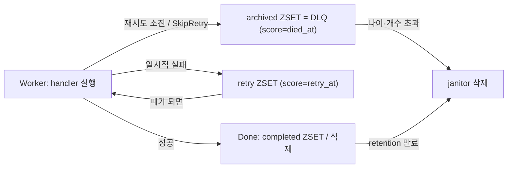

핸들러가 하는 일은 대부분 바깥 세계와 얽혀 있다. 메일을 보내고, 결제 API를 호출하고, 파일을 업로드한다. 그리고 바깥 세계는 언제든 실패한다. SMTP 서버가 잠깐 죽고, 외부 API가 429를 뱉고, 네트워크가 끊긴다. 이때 태스크 큐가 던지는 질문은 명확하다. **핸들러가 error를 반환하면 그 작업은 어디로 가는가?**

3편까지는 워커가 작업을 집어 처리하는 "정상 흐름"을 봤다. 이번 4편은 그 반대편, **실패 경로**를 본다. 재시도를 몇 번·얼마 간격으로 할지, 소진되면 어디에 격리하는지, 그렇게 쌓인 기록이 Redis 메모리를 무한정 먹지 않도록 어떻게 정리하는지를 chronos-go의 실제 코드로 확인한다.

> 이번 편이 다루는 건 "핸들러가 명시적으로 error를 반환한" 실패다. 워커가 크래시해서 작업이 붕 뜨는 경우(재실행·recoverer)는 성격이 달라 5편에서 따로 다룬다.

# 1. 실패한 작업, 그냥 버릴 순 없다

핸들러가 실패했을 때 로그 한 줄 남기고 작업을 버리면 곧 데이터 유실이다. "환영 메일이 한 번 실패했다고 영영 안 보내도 되는가?"에 답하지 못한다. 그래서 제대로 된 태스크 큐는 실패를 세 갈래로 나눠 다룬다.

- **재시도(retry)** — 일시적 실패로 보고, 잠시 뒤 다시 실행한다. 단 무한 반복은 금물이라 횟수와 간격에 정책이 필요하다.
- **데드레터(dead-letter)** — 재시도를 다 써도 실패하면, 유실하지 않고 별도 저장소(DLQ)에 격리해 사람이 나중에 들여다볼 수 있게 한다.
- **정리(retention)** — 격리된 실패와 보존된 완료 기록이 영원히 쌓이면 Redis가 터진다. 나이·개수 기준으로 청소하는 주체가 있어야 한다.

chronos-go에서 이 세 갈래는 각각 retry ZSET, archived ZSET, 그리고 janitor 루프가 담당한다. 태스크의 일생 지도에서 이번 편의 위치는 다음과 같다.



# 2. 핸들러의 세 갈래 결말

## 2.1 outcome는 성공·재시도·데드레터 셋뿐

먼저 코드가 실패를 어떻게 분류하는지부터 보자. 처리 결과는 `metrics.go`에 세 가지 outcome로 정의돼 있고, 태스크 하나가 처리될 때마다 그중 하나로 관측된다.

```go
const (
	// OutcomeSuccess: the handler returned nil; the task was acked and removed.
	OutcomeSuccess TaskOutcome = "success"
	// OutcomeRetry: the handler failed and the task was scheduled for retry.
	OutcomeRetry TaskOutcome = "retry"
	// OutcomeDeadLetter: the task exhausted retries (or returned SkipRetry) and
	// ...
	OutcomeDeadLetter TaskOutcome = "dead_letter"
)
```

"실패"라는 하나의 사건이 outcome 레벨에서는 재시도(retry)와 데드레터(dead_letter) 둘로 갈린다. 같은 error라도 어느 쪽으로 갈지는 재시도 예산이 남았는지, 그리고 그 error가 재시도할 만한 것인지에 따라 결정된다.

## 2.2 결말을 가르는 분기

그 결정이 실제로 일어나는 곳이 `server.go`의 `process` 함수다. 핸들러 실행 후 error를 받아 라우팅하는 부분(성공 처리는 생략)만 추리면 이렇다.

```go
// Dead-letter when the error is non-retryable or the budget is exhausted.
if asSkipRetry(err) || msg.Retried >= msg.MaxRetry {
	s.deadLetter(opCtx, qname, streamID, msg, err)
	s.observe(msg, OutcomeDeadLetter, dur)
	return
}

msg.Retried++
msg.LastErr = err.Error()
msg.CompletedAt = 0 // a re-run task that fails must not show a stale completion time
retryAt := time.Now().Add(s.cfg.RetryDelayFunc(msg.Retried, err))
if rerr := s.rdb.Retry(opCtx, qname, streamID, msg, retryAt); rerr != nil {
	s.logger.Error("chronos: retry scheduling failed", "id", msg.ID, "error", rerr)
}
s.observe(msg, OutcomeRetry, dur)
```

분기 조건 `asSkipRetry(err) || msg.Retried >= msg.MaxRetry` 하나가 재시도와 데드레터를 나눈다.

- 예산이 남아 있고(`msg.Retried < msg.MaxRetry`) 재시도 가능한 error면 → **재시도 경로**. `Retried`를 올리고, 마지막 에러 메시지를 `LastErr`에 기록하고, backoff만큼 뒤 시각(`retryAt`)을 계산해 retry ZSET에 넣는다.
- error가 `SkipRetry`로 감싸졌거나(3.3절) 예산을 다 썼으면 → **데드레터 경로**(4장).

`msg.Retried`는 "이미 수행한 재시도 횟수", `msg.MaxRetry`는 예산이다. `MaxRetry` 기본값은 `WithMaxRetry`를 주지 않으면 `DefaultMaxRetry`, 즉 **25**다(`chronos.go`). 참고로 핸들러가 panic을 내도 `dispatchSafely`가 이를 잡아 error로 변환하므로, panic도 위 분기에서 "재시도 가능한 실패"로 취급된다.

# 3. 재시도: 언제 다시 실행하나

## 3.1 backoff — 지수 백오프에 full jitter

재시도를 "즉시" 하면 안 된다. 방금 실패한 외부 서비스에 곧바로 다시 들이받으면 실패가 반복될 뿐이고, 워커가 여러 대면 동시에 재시도가 몰려 **thundering herd**(떼거리 재시도)가 된다. 그래서 재시도까지 얼마를 기다릴지 계산하는 함수가 `RetryDelayFunc`이고, 기본 구현은 root `retry.go`의 `DefaultRetryDelay`다.

```go
// retryBaseDelay and retryMaxDelay bound the default exponential backoff.
const (
	retryBaseDelay = 5 * time.Second
	retryMaxDelay  = 15 * time.Minute
)

// DefaultRetryDelay is the default backoff: an exponential cap (base * 2^retried,
// clamped to retryMaxDelay) with full jitter — the actual delay is uniformly
// random in [0, cap]. Full jitter spreads retries to avoid thundering herds.
func DefaultRetryDelay(retried int, _ error) time.Duration {
	ceiling := float64(retryBaseDelay) * math.Pow(2, float64(retried))
	if ceiling > float64(retryMaxDelay) {
		ceiling = float64(retryMaxDelay)
	}
	return time.Duration(rand.Int63n(int64(ceiling) + 1))
}
```

동작은 두 단계다. **(1) 지수 상한** — `5초 × 2^retried`를 계산하되 `15분`을 넘으면 자른다(clamp). **(2) full jitter** — 그 상한을 그대로 쓰지 않고 `[0, ceiling]`에서 **균일 난수**를 뽑아 실제 대기 시간으로 삼는다. 여러 워커의 재시도 시각을 흩뿌려 한 순간에 몰리지 않게 한다.

2.2절에서 봤듯 delay는 `RetryDelayFunc(msg.Retried, err)`로 호출되고, 이때 `msg.Retried`는 이미 `++`로 증가한 값이다. 따라서 첫 재시도는 `retried=1` → 상한 `10초` → 대기 `[0, 10초]`, 두 번째는 상한 `20초` → 대기 `[0, 20초]` 식으로 벌어지다가 `15분`에서 멈춘다.

## 3.2 retry ZSET에 park하기

대기 시각이 정해졌으면 태스크를 그 시각까지 "재워 둬야" 한다. chronos-go의 시간 축은 전부 ZSET이 담당한다(1편). 재시도 대기는 retry ZSET에 **score = retry_at(unix)**으로 넣는 것으로 표현된다. 이 이동은 `internal/rdb/retry.go`의 Lua 스크립트 한 방으로 원자적으로 처리된다.

```go
// moveToZSetCmd acks a stream entry and moves the task into a target ZSET
// (retry or archived), updating the stored message and state atomically.
// KEYS[1] stream, KEYS[2] task hash, KEYS[3] target zset.
var moveToZSetCmd = redis.NewScript(`
redis.call("XACK", KEYS[1], ARGV[1], ARGV[2])
redis.call("XDEL", KEYS[1], ARGV[2])
redis.call("HSET", KEYS[2], "msg", ARGV[3], "state", ARGV[4])
redis.call("ZADD", KEYS[3], ARGV[5], ARGV[6])
return 1
`)

// Retry acks the active stream entry and moves the task to the retry ZSET with
// score = retryAt.
func (r *RDB) Retry(ctx context.Context, qname, streamID string, msg *base.TaskMessage, retryAt time.Time) error {
	return r.moveToZSet(ctx, qname, streamID, msg, base.RetryKey(qname), base.StateRetry, retryAt.Unix())
}
```

스크립트는 네 연산을 한 덩어리로 묶는다. `XACK` + `XDEL`로 Stream의 현재 항목을 처리 완료 확인 후 삭제하고(재시도로 넘어간 이상 워커가 붙잡고 있으면 안 된다), `HSET`으로 태스크 Hash에 방금 올린 `Retried`·기록한 `LastErr`·상태(`StateRetry`)를 반영하고, `ZADD`로 retry ZSET에 `score = retry_at`으로 ID를 넣는다.

이 키들(stream, task hash, retry zset)은 모두 같은 `{queue}` 해시 태그를 공유하므로, 멀티 키 Lua 스크립트가 Redis Cluster에서도 원자적으로 돈다(9편 주제). 이제 태스크는 retry ZSET에서 때를 기다리고, `retry_at`이 도래하면 **forwarder**가 다시 Stream으로 승격시킨다(3편의 `forwarderLoop`가 `ForwardRetry`를 주기 호출). 승격된 태스크는 워커에게 다시 잡혀 핸들러가 재실행된다. 재시도 루프가 닫히는 지점이다.

## 3.3 SkipRetry — 재시도할 가치가 없는 실패

모든 실패가 재시도할 만한 건 아니다. payload가 애초에 파싱이 안 되거나, 존재하지 않는 리소스를 가리키는 작업은 100번 다시 돌려도 똑같이 실패한다. 예산만 낭비하는 셈이다. 이런 "결정적(deterministic) 실패"를 위해 chronos-go는 `SkipRetry`를 제공한다.

```go
// SkipRetry wraps err so that returning it from a handler dead-letters the task
// immediately, bypassing the remaining retry budget.
func SkipRetry(err error) error {
	return &skipRetryError{err: err}
}

// asSkipRetry reports whether err is (or wraps) a SkipRetry error.
func asSkipRetry(err error) bool {
	var se *skipRetryError
	return errors.As(err, &se)
}
```

핸들러가 `return chronos.SkipRetry(err)`로 반환하면, 2.2절 분기의 `asSkipRetry(err)`가 참이 되어 재시도 예산이 남았든 말든 곧바로 데드레터로 간다. chronos-go 내부도 이걸 쓴다. 예컨대 핸들러 결과가 `MaxResultSize`를 넘으면(`handler.go`) "같은 값이 또 나올 테니 재시도는 무의미"하다는 이유로 `SkipRetry`로 감싸 즉시 격리한다.

# 4. 데드레터: 재시도가 소진되면

## 4.1 archived ZSET, 즉 DLQ

재시도 예산을 다 썼거나 `SkipRetry`가 나오면 `deadLetter`가 호출된다(`server.go`).

```go
// deadLetter archives the task (or discards it when NoArchive is set) and fires
// the OnDeadLetter hook.
func (s *Server) deadLetter(ctx context.Context, qname, streamID string, msg *base.TaskMessage, cause error) {
	msg.LastErr = cause.Error()
	msg.CompletedAt = 0 // a re-run task that fails must not show a stale completion time
	if msg.NoArchive {
		msg.Retention = 0 // a discarded failure is not a success — never retain as completed
		s.rdb.Done(ctx, qname, streamID, msg)          // 에러 처리 생략
	} else {
		s.rdb.Archive(ctx, qname, streamID, msg, time.Now()) // 에러 처리 생략
	}
	if s.cfg.OnDeadLetter != nil {
		s.cfg.OnDeadLetter(ctx, &TaskInfo{ID: msg.ID, Kind: msg.Kind, Queue: msg.Queue}, cause)
	}
}
```

기본 경로는 `Archive`다. **DLQ(Dead-Letter Queue, 죽은 편지 큐)** 란 이렇게 최종 실패한 작업을 유실하지 않고 격리해 두는 저장소를 말하는데, chronos-go에서는 그게 archived ZSET이다. 그 구현은 3.2절과 같은 `moveToZSetCmd`를 재활용한다.

```go
// Archive acks the active stream entry and moves the task to the archived ZSET
// (dead-letter) with score = diedAt. Archiving is terminal, so the task's
// unique lock (if any) is released.
func (r *RDB) Archive(ctx context.Context, qname, streamID string, msg *base.TaskMessage, diedAt time.Time) error {
	if err := r.moveToZSet(ctx, qname, streamID, msg, base.ArchivedKey(qname), base.StateArchived, diedAt.Unix()); err != nil {
		return err
	}
	return r.releaseUnique(ctx, msg)
}
```

retry ZSET과 딱 두 가지가 다르다. 첫째, retry ZSET이 아니라 archived ZSET에 **`score = died_at`(죽은 시각)**으로 넣는다. retry의 score가 "언제 다시 살릴지"였다면 archived의 score는 "언제 죽었는지"이고, 이 값이 뒤에서 janitor의 나이 판정 기준이 된다. 둘째, 데드레터는 태스크의 종착지(terminal)이므로 중복 방지용 unique lock을 걸어 뒀다면(`WithUnique`) 여기서 풀어 준다. 같은 작업을 다시 넣을 수 있어야 하기 때문이다.

격리된 뒤에도 `LastErr`(마지막 실패 사유)는 태스크 Hash에 남는다. Inspector나 Web UI가 "이 작업이 왜 죽었는지"를 보여줄 수 있는 건 이 필드 덕분이다.

## 4.2 NoArchive — 보관 대신 폐기

죽어도 들여다볼 일이 없는 작업이라면 DLQ에 쌓아 봐야 메모리만 먹는다. `WithNoArchive`를 준 태스크는 위 코드의 `msg.NoArchive` 분기를 타서 `Archive` 대신 `Done`으로 그냥 삭제(discard)된다. 이때 `Retention`을 0으로 강제하는데, 주석대로 **"폐기된 실패는 성공이 아니므로 completed로 보존해선 안 되기"** 때문이다.

## 4.3 OnDeadLetter 훅

archive든 discard든, 마지막으로 `OnDeadLetter` 훅이 있으면 실패 원인(`cause`)과 함께 호출된다. 알림·집계·수동 재처리 큐 투입 같은 후속 조치를 여기 건다. 단 이 훅은 드문 경우 두 번 이상 불릴 수 있어(리스가 만료돼 recoverer가 다시 격리하는 병리적 상황) **멱등하게** 짜야 한다. archived ZSET 항목 자체는 태스크 ID로 중복 제거되지만 훅 호출은 아니다.

# 5. 청소부(janitor): 무한히 쌓이지 않게

## 5.1 왜 정리가 필요한가

archived ZSET(DLQ)와 completed ZSET(`WithRetention`으로 보존된 성공 작업)은 **계속 쌓이기만 한다.** 아무도 지우지 않으면 Redis 메모리가 우상향한다. 이 둘을 나이(retention)와 개수(cap) 기준으로 잘라 **메모리를 바운딩**하는 청소부가 janitor다. `janitorLoop`는 `JanitorInterval`(기본 1분)마다 큐별로 `TrimArchived`와 `TrimCompleted`를 호출한다.

## 5.2 janitor Lua — 나이 + 개수 두 패스

정리 로직은 `internal/rdb/janitor.go`의 `trimArchivedCmd` 하나로 끝난다. 이름은 archived지만 completed에도 그대로 재사용된다.

```lua
local removed = 0
local batch = tonumber(ARGV[2])

-- (1) age-based: score <= cutoff (bounded by batch)
local expired = redis.call("ZRANGEBYSCORE", KEYS[1], "-inf", ARGV[1], "LIMIT", 0, batch)
for _, id in ipairs(expired) do
  redis.call("DEL", ARGV[3] .. id)
  redis.call("ZREM", KEYS[1], id)
  removed = removed + 1
end

-- (2) size cap: delete oldest beyond maxSize, bounded by batch (converges over
-- ticks). Negative maxSize disables the cap.
local maxSize = tonumber(ARGV[4])
if maxSize >= 0 then
  local over = redis.call("ZCARD", KEYS[1]) - maxSize
  if over > 0 then
    if over > batch then over = batch end
    local excess = redis.call("ZRANGE", KEYS[1], 0, over - 1)
    for _, id in ipairs(excess) do
      redis.call("DEL", ARGV[3] .. id)
      redis.call("ZREM", KEYS[1], id)
      removed = removed + 1
    end
  end
end

return removed
```

정리는 두 패스로 나뉜다.

- **(1) 나이 기준** — `ZRANGEBYSCORE`로 score가 cutoff 이하인 항목을 골라, 태스크 Hash(`DEL`)와 ZSET 멤버(`ZREM`)를 함께 지운다. archived에선 cutoff가 `now - ArchivedRetention`이라 "너무 오래된 죽은 작업"이 걸리고, completed에선 score 자체가 이미 만료 시각(완료 시각 + retention)이라 cutoff가 그냥 `now`다.
- **(2) 개수 기준** — 나이로 지우고도 ZSET 크기가 `maxSize`를 넘으면, 초과분만큼 **가장 오래된 것부터**(`ZRANGE 0 ..`) 지운다. retention 창 안이라도 개수 상한을 넘으면 잘라 내 상한을 강제한다. `maxSize`가 음수면 이 개수 제한은 꺼진다.

두 패스 모두 한 번에 `batch`(기본 100)개까지만 지운다. 밀린 게 아무리 많아도 스크립트 하나는 짧게 끝나고, 나머지는 다음 tick에서 이어서 처리해 **점진적으로 수렴**한다. 거대한 백로그를 한 스크립트로 지우려다 Redis를 오래 붙잡는 사태를 막는 설계다.

## 5.3 기본값과 재사용

`TrimArchived`와 `TrimCompleted`는 이 스크립트를 각각 다른 cutoff로 호출한다. archived는 `ArchivedKey` + `cutoff = now - ArchivedRetention`(오래된 죽은 작업), completed는 `CompletedKey` + `cutoff = now`(score가 이미 만료 시각이므로)다. 나머지 인자(batch·maxSize·태스크 키 prefix)는 같다.

서버 기본값(`NewServer`)은 다음과 같다.

| 설정 | 기본값 | 의미 |
| ---- | ------ | ---- |
| `ArchivedRetention` | 7일(168h) | DLQ 작업을 얼마나 오래 보관하는가(나이 기준) |
| `MaxArchived` | 10000 | 큐당 DLQ 최대 개수(음수면 개수 제한 해제) |
| `MaxCompleted` | 10000 | 큐당 보존 완료 작업 최대 개수(음수면 해제) |
| `JanitorInterval` | 1분 | janitor 실행 주기 |

정리 연산은 원자적·배치·멱등이라, 서버 인스턴스가 여러 대여도 모든 인스턴스에서 동시에 돌려도 안전하다. 같은 항목을 두 인스턴스가 동시에 지우려 해도 `ZREM`/`DEL`이 멱등하기 때문이다. 리더 선출 같은 조율 없이 그냥 각자 돌리면 된다.

# 6. 정리

이번 편에서 따라간 실패 경로를 요약하면 이렇다.

- 핸들러가 error를 반환하면 결과는 **재시도**나 **데드레터** 둘로 갈린다. 분기 조건은 `asSkipRetry(err) || msg.Retried >= msg.MaxRetry` 하나다(`MaxRetry` 기본 25).
- **재시도**는 `DefaultRetryDelay`로 대기 시간을 정한다 — `5초 × 2^retried`를 `15분`으로 클램프한 상한에 **full jitter**를 씌운다. 그 시각을 score로 retry ZSET에 park하고, forwarder가 때가 되면 Stream으로 되돌린다.
- **데드레터**는 태스크를 archived ZSET(DLQ)에 `score = died_at`으로 격리하고 unique lock을 푼다. `LastErr`가 실패 사유로 남고, `NoArchive`면 보관 대신 폐기, 마지막에 `OnDeadLetter` 훅이 발화한다.
- **janitor**는 archived/completed를 나이(retention)와 개수(cap) 두 패스로 잘라 메모리를 바운딩한다. 배치로 나눠 수렴하며, 멱등해서 모든 인스턴스에서 동시에 돌려도 안전하다.

여기까지는 "핸들러가 스스로 error를 반환한" 실패였다. 하지만 워커가 error를 반환할 새도 없이 **크래시로 통째로 사라지면** 그 작업은 어떻게 될까? 다음 5편에서는 recoverer가 `XAUTOCLAIM`으로 죽은 워커의 작업을 회수하는 크래시 복구와, 그로부터 나오는 at-least-once의 실체를 파고든다.

# 7. FAQ

## 7.1 backoff 계산식이 정확히 어떻게 되나요?

기본 함수 `DefaultRetryDelay(retried, err)`는 상한을 `5초 × 2^retried`로 계산하되 `15분`을 넘으면 잘라 내고(clamp), 그 상한을 그대로 쓰지 않고 `[0, 상한]`에서 균일 난수를 뽑아 실제 대기 시간으로 삼는다(**full jitter**). `retried`는 실패 후 증가한 값이라 첫 재시도는 상한 10초, 다음은 20초... 식으로 벌어진다. 상한만 지수적으로 키우고 실제 값은 흩뿌리는 이유는, 여러 워커의 재시도가 한 순간에 몰려 실패한 서비스를 다시 덮치는 thundering herd를 피하기 위해서다. `ServerConfig.RetryDelayFunc`로 이 정책을 통째로 교체할 수 있다.

## 7.2 DLQ(archived)가 정확히 뭔가요? 그냥 지우면 안 되나요?

DLQ(Dead-Letter Queue)는 **최종 실패한 작업을 유실하지 않고 격리해 두는 저장소**로, chronos-go에서는 archived ZSET이 그 역할을 한다. 실패한 작업을 그냥 지우면 "왜 실패했는지", "무엇이 처리되지 않았는지"를 영영 알 수 없다. archived에 남겨 두면 `LastErr`로 원인을 확인하고 고친 뒤 수동 재처리할 수 있다. 대신 무한정 쌓이지 않도록 janitor가 정리하고, 보관이 무의미한 작업은 `WithNoArchive`로 격리를 건너뛴다.

## 7.3 retention은 무슨 뜻이고 재시도와 어떤 관계인가요?

retention은 재시도가 아니라 **"완료된 작업을 얼마나 오래 보존하느냐"**의 개념이다. `WithRetention`을 주면 성공한 작업이 곧바로 지워지지 않고 completed ZSET에 그 기간만큼 남아 Inspector로 결과를 조회할 수 있다(기본 0이면 완료 즉시 삭제). archived에도 보관 기간이 있지만 그건 `ArchivedRetention`(기본 7일)으로 별개 설정이다. 정리하면 completed는 `MaxCompleted` 개수 + 각자의 retention 만료로, archived는 `MaxArchived` 개수 + `ArchivedRetention` 나이로 각각 janitor가 청소한다.

---

> 이 글의 코드는 chronos-go [`88fe6d1`](https://github.com/kenshin579/chronos-go) 기준이다. 이후 구현이 바뀌면 세부는 달라질 수 있다.
