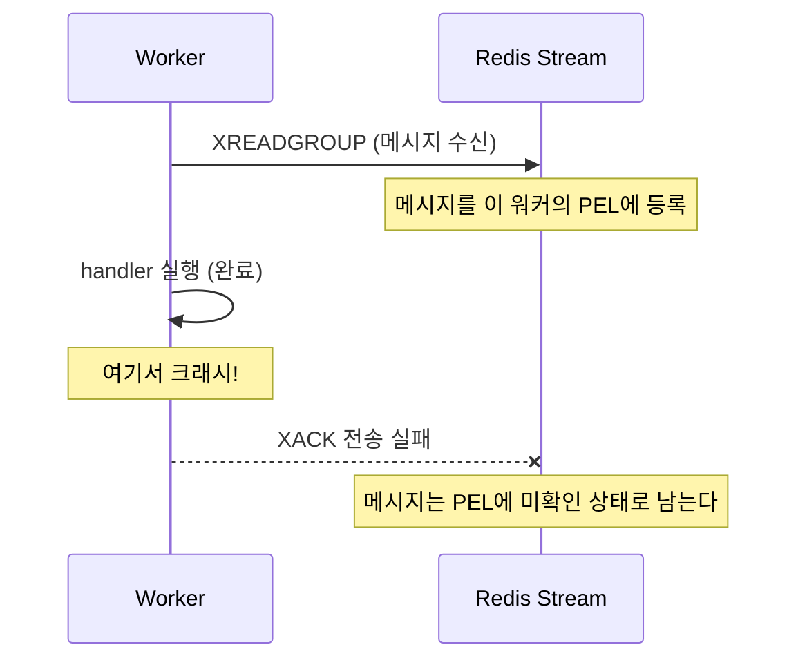

분산 태스크 큐에서 가장 답하기 어려운 질문은 이것이다. **"작업을 처리하던 워커가 중간에 죽으면, 그 작업은 어떻게 되나?"** 프로세스는 배포로 재시작되고, OOM으로 강제 종료되고, 노드가 통째로 사라진다. 이때 붙잡고 있던 작업이 조용히 유실된다면 그 큐는 신뢰할 수 없다.

1편에서 chronos-go의 전달 보장이 **at-least-once**라고 못 박았고(5장), 그 안전망이 Redis Stream의 **PEL(Pending Entries List)**이라는 것도 예고했다(FAQ 7.1). 이번 편은 그 약속의 실체를 코드로 확인한다. 죽은 워커의 작업을 회수하는 **recoverer**, 오래 걸리는 정상 작업이 회수당하지 않게 지키는 **heartbeat**, 그리고 왜 이 구조가 exactly-once가 아니라 at-least-once일 수밖에 없는지를 차례로 본다.

# 1. 워커는 언제, 어디서 죽는가

## 1.1 정상 흐름과 크래시 지점

2편에서 봤듯 워커의 정상 흐름은 이렇다. `XREADGROUP`으로 Stream에서 메시지를 받고 → 핸들러를 실행하고 → 성공하면 `XACK`으로 확인하고 `XDEL`로 지운다. chronos-go에서 이 마무리는 `process`가 성공 경로에서 호출하는 `Done`(`XACK`+`XDEL`)이 담당한다.

문제는 이 세 단계 사이 어디서든 프로세스가 죽을 수 있다는 것이다. 특히 위험한 지점이 **핸들러를 다 끝냈지만 `XACK`을 보내기 직전**이다. 메일은 이미 나갔는데, Redis 입장에서는 아직 "이 워커가 받아가서 처리 중"인 미확인 상태다.



리스트 기반 큐(`BRPOP`)였다면 값을 꺼내는 순간 리스트에서 사라지므로 이 작업은 그대로 유실된다. Stream이 이 상황을 견디는 이유가 바로 PEL이다.

## 1.2 PEL이 안전망이 되는 이유

`XREADGROUP`으로 받은 메시지는 그 워커의 **PEL**에 올라가고, `XACK` 전까지 거기 남는다. "이 워커가 받아갔지만 아직 확인하지 않았다"는 사실을 Redis가 기억하므로, 워커가 죽어도 미확인 상태로 보존된다.

PEL의 각 항목은 마지막으로 배달된 뒤 흐른 시간, 즉 **idle time**을 갖는다. 워커가 살아 처리 중이면 idle이 갱신되지만, 죽으면 그 항목의 idle은 계속 늘어난다. idle이 충분히 늘어난 항목은 주인이 죽었을 가능성이 높다. 이 판정이 크래시 복구의 기준이고, recoverer가 하는 일이다.

# 2. recoverer: 방치된 PEL 항목을 회수한다

## 2.1 XAUTOCLAIM으로 idle 초과분 긁어오기

recoverer의 진입점은 `internal/rdb/recover.go`의 `Recover`다. 핵심은 `XAUTOCLAIM` 한 번으로, "idle이 `minIdle`을 넘긴 PEL 항목"을 자기 자신(consumer)에게 한꺼번에 옮겨오는 것이다.

```go
func (r *RDB) Recover(ctx context.Context, qname, consumer string, minIdle time.Duration, max int) (recovered int, archived []*base.TaskMessage, err error) {
	streamKey := base.StreamKey(qname)

	msgs, _, err := r.client.XAutoClaim(ctx, &redis.XAutoClaimArgs{
		Stream:   streamKey,
		Group:    ConsumerGroup,
		Consumer: consumer,
		MinIdle:  minIdle,
		Start:    "0",
		Count:    int64(max),
	}).Result()
	if err != nil {
		return 0, nil, err
	}
	// ... 회수된 msgs를 하나씩 처리 ...
}
```

`XAUTOCLAIM`은 `Start: "0"`부터 스캔하며 `MinIdle`을 넘긴 항목을 최대 `Count`(`recoverBatchSize = 100`)개까지 소유권 이전한다. 소유권이 죽은 워커에서 recoverer를 돌리는 이 서버의 consumer로 넘어오므로, 이후 이 항목들을 확인(ack)하거나 옮길 권한이 생긴다.

## 2.2 회수 후: 재큐 또는 dead-letter

회수한 항목은 아직 PEL에서 내 것이 됐을 뿐, 재처리되려면 다시 큐로 흘러야 한다. `Recover`는 회수한 각 항목을 이렇게 정리한다.

```go
for _, m := range msgs {
	taskID, _ := m.Values["task_id"].(string)

	raw, err := r.client.HGet(ctx, base.TaskKey(qname, taskID), "msg").Result()
	if err == redis.Nil {
		// Body already gone: drop the orphan entry (ack + delete) so it does
		// not linger in the stream and inflate the pending count.
		pipe := r.client.TxPipeline()
		pipe.XAck(ctx, streamKey, ConsumerGroup, m.ID)
		pipe.XDel(ctx, streamKey, m.ID)
		_, _ = pipe.Exec(ctx)
		continue
	}
	// ... 디코드 ...

	// This reclaim counts as one failed attempt.
	if msg.Retried >= msg.MaxRetry {
		if aerr := r.Archive(ctx, qname, m.ID, msg, now); aerr != nil {
			lastErr = aerr
			continue
		}
		archived = append(archived, msg)
		continue
	}
	msg.Retried++
	// Re-run promptly: schedule the retry for "now" so the forwarder
	// picks it up on its next tick.
	if rerr := r.Retry(ctx, qname, m.ID, msg, now); rerr != nil {
		lastErr = rerr
		continue
	}
	recovered++
}
```

읽어야 할 규칙이 세 가지다.

- **고아 항목 정리** — 태스크 본문 HASH(`chronos:{q}:t:<id>`의 `msg` 필드)가 이미 사라졌으면(`redis.Nil`), 회수해봐야 재구성할 본문이 없다. `XACK`+`XDEL`로 Stream에서 지워 PEL을 부풀리지 않게 한다.
- **회수 = 실패 1회** — 회수당했다는 것은 워커가 그 작업을 끝까지 확인하지 못했다는 뜻이므로, chronos-go는 이를 **실패 시도 한 번**으로 센다. 예산이 남았으면 `msg.Retried`를 1 올리고 `retryAt`을 `now`로 해서 retry ZSET에 넣어, forwarder(3편)가 다음 tick에 Stream으로 다시 승격하게 한다.
- **예산 소진 시 dead-letter** — `msg.Retried >= msg.MaxRetry`면 더 재시도하지 않고 `Archive`로 archived ZSET(DLQ, 4편)에 넣는다. 이렇게 archived된 메시지들은 `Recover`가 `archived` 슬라이스로 돌려주고, `recovererLoop`가 각각에 대해 `OnDeadLetter` 훅을 발화한다.

여기서 **attempt 카운트가 어디 사는지**가 중요하다. Stream 항목에는 재시도 횟수가 없다. 재시도 횟수는 태스크 메시지의 `Retried` 필드에 있고, 이 메시지는 태스크 **HASH**에 통째로 직렬화된다. `Retry`/`Archive`가 쓰는 Lua는 `XACK`+`XDEL`로 Stream을 정리하는 동시에 갱신된 메시지를 HASH에 다시 `HSET`한다.

```lua
redis.call("XACK", KEYS[1], ARGV[1], ARGV[2])
redis.call("XDEL", KEYS[1], ARGV[2])
redis.call("HSET", KEYS[2], "msg", ARGV[3], "state", ARGV[4])
redis.call("ZADD", KEYS[3], ARGV[5], ARGV[6])
return 1
```

덕분에 워커가 여러 번 죽어 여러 번 회수돼도, 재시도 횟수는 HASH에 누적되어 결국 `MaxRetry`에서 dead-letter로 수렴한다. 크래시가 무한 재처리 루프가 되지 않는 이유다.

## 2.3 recovererLoop와 두 개의 시간 설정

`Recover`를 주기적으로 돌리는 것이 `recovererLoop`다. `RecoverInterval`마다 각 큐에 대해 `s.rdb.Recover(ctx, q, s.consumer, s.cfg.RecoverMinIdle, recoverBatchSize)`를 호출하고, 돌려받은 `archived` 메시지마다 `OnDeadLetter` 훅을 발화한다. 여기 두 개의 시간 설정이 등장한다. 둘을 헷갈리면 안 된다.

- **`RecoverInterval`** (기본 15초) — recoverer가 **얼마나 자주** PEL을 훑는가. 회수가 얼마나 빨리 시작되는지를 정한다.
- **`RecoverMinIdle`** (기본 30초) — PEL 항목이 **얼마나 오래 방치돼야** 버려진 것으로 판정하는가. `XAUTOCLAIM`의 `MinIdle` 인자로 그대로 들어간다.

즉 워커가 죽으면 그 작업은 "idle이 `RecoverMinIdle`(30초)을 넘긴 뒤, 다음 `RecoverInterval`(15초) tick"에 회수된다. `RecoverMinIdle`을 너무 짧게 잡으면 아직 살아서 처리 중인 작업까지 죽은 것으로 오인해 회수해버린다. 그런데 정상 작업이 30초보다 오래 걸리는 것은 흔한 일이다. 이 모순을 푸는 것이 heartbeat다.

# 3. heartbeat: 오래 걸리는 정상 작업을 지키기

## 3.1 문제 — 정상인데 회수당한다

`RecoverMinIdle`이 30초인데 핸들러가 2분 걸리는 정상 작업이 있다고 하자. 아무 장치가 없다면 이 작업의 PEL idle은 처리 도중 30초를 넘기고, recoverer가 "죽었네" 하고 회수해 **같은 작업을 다른 곳에서 동시에 재처리**하게 된다. `Recover`의 주석도 이 위험을 명시한다("a handler that runs longer than minIdle can be reclaimed and reprocessed concurrently").

해법은 단순하다. 실제로 처리 중인 작업은 그 idle을 주기적으로 0으로 되돌려 recoverer의 `MinIdle` 문턱을 넘지 못하게 하면 된다. 이 "나 아직 살아서 이거 붙잡고 있어"라는 신호가 heartbeat이고, 그 갱신되는 임대차 계약이 **리스(lease)**다.

## 3.2 XCLAIM ... JUSTID로 리스 갱신

리스 갱신의 실체는 `internal/rdb/heartbeat.go`의 `ExtendLease`다.

```go
// ExtendLease resets the idle time of in-flight PEL entries by re-claiming them
// to the same consumer with min-idle 0 (XCLAIM ... JUSTID). This keeps a task
// that is genuinely being processed from being reclaimed by the recoverer while
// it runs. JUSTID means the delivery count is NOT incremented.
func (r *RDB) ExtendLease(ctx context.Context, qname, consumer string, streamIDs []string) error {
	if len(streamIDs) == 0 {
		return nil
	}
	return r.client.XClaimJustID(ctx, &redis.XClaimArgs{
		Stream:   base.StreamKey(qname),
		Group:    ConsumerGroup,
		Consumer: consumer,
		MinIdle:  0,
		Messages: streamIDs,
	}).Err()
}
```

이미 자기 소유인 PEL 항목을 **자기 자신에게 다시** `XCLAIM`한다. `MinIdle: 0`이라 idle 조건 없이 무조건 성공하고, 그 부수 효과로 항목의 idle이 0으로 리셋된다. `XClaimJustID`가 보내는 `JUSTID` 옵션이 붙으면 배달 카운트(delivery count)를 **올리지 않으므로**, 정상 처리 중인 작업이 heartbeat 때문에 "재배달됨"으로 오해되지 않는다. recoverer의 `XAUTOCLAIM`이 idle 큰 항목을 *남에게서 뺏어오는* 것이라면, heartbeat의 `XCLAIM ... JUSTID`는 idle을 *0으로 눌러 계속 내 것으로 유지하는* 것이다. 같은 소유권 이전 명령을 정반대 목적으로 쓴다.

## 3.3 unique 락 TTL도 함께 갱신

heartbeat가 지켜야 하는 것이 하나 더 있다. `WithUnique`로 만든 작업은 중복 실행을 막는 unique 락 키를 잡고 있는데, 이 락에는 TTL이 있다. 처리가 오래 걸려 락이 먼저 만료되면 같은 작업이 중복 enqueue될 수 있다. 그래서 리스와 함께 `RenewUnique`(각 락 키에 `PEXPIRE ttl`)로 락 TTL도 갱신한다. 이미 사라진 키는 `PEXPIRE`가 0을 반환하며 되살리지 않으므로, 방금 해제된 락을 갱신해도 안전하다.

두 갱신을 한 tick에 묶는 것이 `beat`다. 서버는 처리 중인 작업을 `inflight` 맵에 추적해 두었다가(워커가 `process`를 돌리기 직전 `trackInflight`, 끝나면 `untrackInflight`), heartbeat tick마다 그 스트림 ID들을 큐별로 모아 리스를 갱신하고, unique 락 키들의 TTL도 함께 늘린다.

```go
func (s *Server) beat(ctx context.Context, renewTTL time.Duration) {
	s.inflightMu.Lock()
	byQueue := make(map[string][]string)
	var uniqueKeys []string
	for _, e := range s.inflight {
		byQueue[e.queue] = append(byQueue[e.queue], e.streamID)
		if e.uniqueKey != "" {
			uniqueKeys = append(uniqueKeys, e.uniqueKey)
		}
	}
	s.inflightMu.Unlock()

	for q, ids := range byQueue {
		if err := s.rdb.ExtendLease(ctx, q, s.consumer, ids); err != nil && ctx.Err() == nil {
			s.logger.Error("chronos: extend lease failed", "queue", q, "error", err)
		}
	}
	if len(uniqueKeys) > 0 {
		if err := s.rdb.RenewUnique(ctx, uniqueKeys, renewTTL); err != nil && ctx.Err() == nil {
			s.logger.Error("chronos: renew unique failed", "error", err)
		}
	}
}
```

`heartbeaterLoop`는 `HeartbeatInterval`마다 `beat`를 호출하며, `renewTTL`로 `2 * RecoverMinIdle`을 넘긴다. 락을 recover 창보다 넉넉히 늘려두어야, 워커가 죽어(heartbeat가 멈춰) recoverer가 작업을 넘겨받는 동안에도 락이 먼저 풀려버리지 않는다.

## 3.4 RecoverMinIdle vs HeartbeatInterval

heartbeat가 제 역할을 하려면 recover 창이 닫히기 전에 여러 번 뛰어야 한다. chronos-go는 이 관계를 설정 기본값으로 강제한다. **`HeartbeatInterval`**(리스 갱신 주기)은 `RecoverMinIdle`보다 **반드시 짧아야** 하며, 설정하지 않았거나 `RecoverMinIdle` 이상으로 잘못 준 값은 `RecoverMinIdle/3`(기본값 조합에서 10초)으로 클램프된다.

```go
// HeartbeatInterval must run several times within the recover window, or an
// actively-processing task could be reclaimed before its lease is refreshed.
if cfg.HeartbeatInterval <= 0 || cfg.HeartbeatInterval >= cfg.RecoverMinIdle {
	cfg.HeartbeatInterval = cfg.RecoverMinIdle / 3
}
```

정리하면 시간 관계는 이렇다. **`HeartbeatInterval`(10s) < `RecoverMinIdle`(30s) ≤ `renewTTL`(60s)**. 살아있는 서버는 10초마다 idle을 0으로 되돌리므로 30초 문턱을 절대 넘지 못하고, 워커가 실제로 죽으면 heartbeat가 멈춰 idle이 30초를 넘기고 recoverer가 회수한다. **`RecoverMinIdle`은 "핸들러가 얼마나 오래 걸리는가"가 아니라, 워커가 진짜로 죽은 뒤 그 작업이 회수되기까지의 지연 시간**을 뜻한다는 것이 핵심이다.

# 4. 왜 exactly-once가 아니라 at-least-once인가

이제 1편 5장의 결론을 코드로 되짚을 수 있다. 다시 1.1의 크래시 지점을 보자. 핸들러는 이미 끝났지만 `XACK` 직전에 죽었다. Redis가 아는 것은 "이 항목이 아직 미확인이고 idle이 늘고 있다"뿐이므로, recoverer는 이 항목을 회수해 재처리하고 **이미 한 번 성공한 핸들러가 다시 실행된다.**

이 중복은 버그가 아니라 at-least-once의 필연적 대가다. "핸들러가 끝난 것"과 "확인이 도착한 것"을 한 번의 원자적 연산으로 묶을 수 없어, 그 사이엔 크래시가 끼어들 틈이 항상 남는다. 유실을 막으려면 "확인 못 받은 것은 다시 돌린다"가 유일하게 안전한 선택이고, 그래서 exactly-once는 분산 환경에서 매우 비싸거나 불가능하다. chronos-go의 CLAUDE.md도 이를 불변식으로 못 박는다.

> **At-least-once delivery.** A task can run more than once (crash after finishing but before ack; recoverer reclaiming an idle task). Handler logic added anywhere must stay idempotent-friendly.

**핸들러는 멱등(idempotent)하게 작성해야 한다.** "같은 메일을 두 번 보내도 괜찮은가?", "정산을 두 번 집계해도 결과가 같은가?"를 늘 자문해야 한다. 멱등성이 어려우면 처리 결과를 별도 키에 기록해 두고 재실행 시 건너뛰는 식의 중복 제거를 핸들러 안에서 직접 해야 한다. 큐가 "적어도 한 번"을 보장하는 대신, "정확히 한 번의 효과"는 핸들러의 몫이다.

# 5. 정리

이번 편을 요약하면 이렇다.

- 워커는 **핸들러 완료와 `XACK` 사이**에서 죽을 수 있고, 이때 작업은 Stream의 **PEL**에 미확인 상태로 남아 유실되지 않는다.
- **recoverer**는 `XAUTOCLAIM`으로 idle이 `RecoverMinIdle`을 넘긴 PEL 항목을 회수해, 예산이 남으면 retry ZSET으로(재큐), 소진됐으면 archived로(dead-letter) 보낸다. **회수 한 번 = 실패 한 번**이며, attempt 카운트는 태스크 **HASH**에 누적된다.
- **heartbeat**는 처리 중인 작업의 PEL idle을 `XCLAIM ... JUSTID`로 0으로 되돌리고 unique 락 TTL도 갱신해, 오래 걸리는 정상 작업이 뺏기지 않게 한다(`HeartbeatInterval < RecoverMinIdle`).
- 이 구조는 exactly-once가 아니라 **at-least-once**이므로, 핸들러는 멱등해야 한다.

다음 6편에서는 제어 계층으로 올라가, 여러 큐를 우선순위대로 그러나 기아 없이 소비하는 **smooth weighted round-robin**을 다룬다.

# 6. FAQ

## 6.1 PEL의 idle time이 정확히 뭔가요?

PEL(Pending Entries List)의 각 항목은 consumer group으로 배달됐지만 아직 `XACK`되지 않은 메시지다. idle time은 그 항목이 **마지막으로 배달(또는 claim)된 뒤 흐른 밀리초**다. 워커가 정상 처리 중이면 heartbeat(`XCLAIM ... JUSTID`)가 idle을 주기적으로 0으로 되돌리고, 죽으면 아무도 건드리지 않아 idle이 계속 늘어난다. recoverer의 `XAUTOCLAIM MinIdle`은 이 idle을 문턱으로 삼아 "버려진 항목"을 골라낸다(`XPENDING`으로 현재 idle을 조회할 수 있다).

## 6.2 XAUTOCLAIM과 XCLAIM은 어떻게 다른가요?

둘 다 PEL 항목의 소유권을 다른 consumer로 옮기는 명령이지만, 쓰임이 정반대다. `XAUTOCLAIM`은 `MinIdle`을 넘긴 항목들을 **자동으로 스캔해 한 번에 여러 개** 회수한다. chronos-go의 recoverer가 죽은 워커의 작업을 걷어올 때 쓴다. `XCLAIM`은 **명시한 스트림 ID들만** 대상으로 하며, chronos-go는 이를 `JUSTID` 옵션과 함께 heartbeat에 쓴다: 이미 자기 소유인 항목을 `MinIdle: 0`으로 자기 자신에게 다시 claim해 idle만 리셋하고, `JUSTID` 덕분에 배달 카운트는 올리지 않는다. 요약하면 `XAUTOCLAIM`은 "뺏어오기(회수)", `XCLAIM ... JUSTID`는 "붙잡아두기(리스 갱신)"다.

## 6.3 그냥 exactly-once로 만들 수는 없나요?

핸들러의 부수 효과(메일 발송, 외부 API 호출, DB 커밋)는 Redis 밖에서 일어나므로 Redis의 `XACK`과 원자적으로 커밋할 방법이 없다. "핸들러가 끝난 순간"과 "확인이 기록된 순간" 사이에는 늘 크래시가 끼어들 틈이 남는다. 그래서 실무에서는 exactly-once를 큐 계층에서 얻으려 하기보다, at-least-once 큐 위에 **멱등한 핸들러**를 올려 "정확히 한 번의 효과"를 만드는 편이 훨씬 싸고 견고하다.

---

> 이 글의 코드는 chronos-go [`88fe6d1`](https://github.com/kenshin579/chronos-go) 기준이다. 이후 구현이 바뀌면 세부는 달라질 수 있다.
