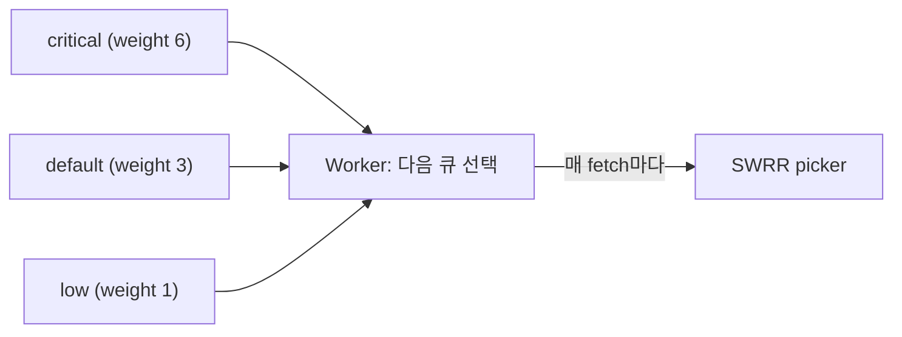
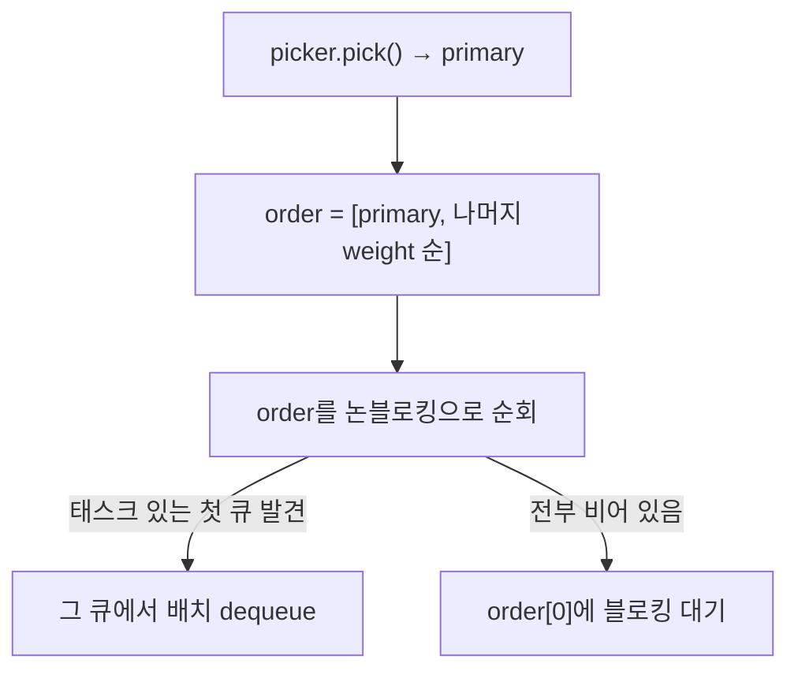

태스크 큐를 실제로 운영하다 보면 큐를 여러 개로 나누고 싶어진다. 결제 정산처럼 급한 일은 `critical` 큐에, 통계 집계처럼 느긋한 일은 `low` 큐에 넣고, 워커가 급한 큐를 더 자주 처리하게 만들고 싶다. 즉 큐마다 **우선순위(weight)** 를 주고 싶다.

문제는 여기서 시작된다. 우선순위를 "높은 큐부터 처리"로 순진하게 구현하면, 높은 큐에 일이 끊이지 않는 한 낮은 큐는 **영원히 처리되지 않는다**. 이것을 **기아(starvation)** 라고 부른다. 이번 편은 chronos-go가 이 문제를 **smooth weighted round-robin(SWRR)** 으로 어떻게 푸는지 실제 코드 `wrr.go`로 해부한다. 시리즈에서 6편은 태스크의 일생(2~5편) 위에 얹히는 제어 계층의 첫 편이다.



# 1. 여러 큐에 우선순위를 주면 생기는 문제

워커가 매번 "어느 큐에서 다음 태스크를 꺼낼까"를 정해야 한다. 큐가 `critical`(weight 6), `default`(3), `low`(1) 셋이고 전부 일이 쌓여 있다고 하자. 어떤 규칙으로 고르느냐에 따라 결과가 완전히 달라진다.

## 1.1 순진한 방법 1: strict priority

가장 단순한 규칙은 "weight가 높은 큐를 먼저, 비었을 때만 다음 큐"다. `critical`을 다 비우고, 그 다음 `default`, 마지막에 `low`.

이건 명확하지만 위험하다. `critical`에 일이 **끊이지 않고** 들어오면 워커는 영원히 `critical`만 처리하고 `default`·`low`는 한 번도 손대지 못한다. 급한 일이 바쁜 서비스일수록 낮은 큐가 통째로 굶는다. 이게 바로 기아다.

## 1.2 순진한 방법 2: weighted random

다른 방법은 확률이다. 매번 weight에 비례한 확률로 큐를 뽑는다(`critical:default:low = 6:3:1`이면 6/10 확률로 `critical`). 기아는 막지만(모든 큐가 언젠가는 뽑힌다) **분포가 뭉친다**. 난수는 짧은 구간에서 편향돼, `low`가 운 나쁘게 수십 번 연속 안 뽑히거나 `critical`이 연달아 몰릴 수 있다. 평균은 6:3:1이어도 짧은 시간 창에서는 비율이 깨져 지연이 들쭉날쭉해진다.

정리하면 우리가 원하는 건 두 가지를 동시에 만족하는 규칙이다.

- **비율**: 오래 돌리면 각 큐가 weight 비율대로 선택된다.
- **부드러움(smooth)**: 그 비율이 짧은 창에서도 지켜져, 어떤 큐도 한참 굶지 않는다.

# 2. smooth weighted round-robin 원리

SWRR은 nginx의 로드밸런서가 쓰는 알고리즘으로, 위 두 조건을 결정적(deterministic)으로 만족시킨다. 난수를 전혀 쓰지 않는다.

## 2.1 알고리즘: 누적하고, 이긴 큐에서 총합을 뺀다

각 큐는 러닝 카운터 `current`를 하나씩 갖는다. 한 번 고를 때마다 이렇게 한다.

1. 모든 큐의 `current`에 자기 `weight`를 더한다.
2. `current`가 가장 큰 큐를 이번 라운드의 승자로 뽑는다.
3. 승자의 `current`에서 **전체 weight 합(`total`)** 을 뺀다.

핵심은 3번이다. 이긴 큐는 매번 `total`만큼 깎이므로 잠시 뒤로 밀려나고, 그 사이 못 뽑힌 큐들의 `current`가 계속 누적돼 결국 자기 차례를 얻는다. weight가 큰 큐는 매 라운드 많이 더해지니 자주 이기지만, 이길 때마다 크게 깎여 독점하지 못한다. 누구도 굶지 않으면서 비율이 지켜지는 이유다.

## 2.2 `{a:3, b:1}` 라운드별 전개

`a`의 weight 3, `b`의 weight 1이면 `total = 4`다. `current`가 `[a, b]` 순서로 어떻게 움직이는지 라운드마다 따라가 보자.

| 라운드 | `current` 시작 | `+weight` 후 | 선택 | `-total` 후 |
| :---: | :---: | :---: | :---: | :---: |
| 1 | `[0, 0]` | `[3, 1]` | **a** | `[-1, 1]` |
| 2 | `[-1, 1]` | `[2, 2]` | **a** | `[-2, 2]` |
| 3 | `[-2, 2]` | `[1, 3]` | **b** | `[1, -1]` |
| 4 | `[1, -1]` | `[4, 0]` | **a** | `[0, 0]` |

결과 시퀀스는 `a, a, b, a`다. 4라운드마다 `a`가 정확히 3번, `b`가 1번 나온다. 그리고 4라운드가 끝나면 `current`가 시작과 같은 `[0, 0]`으로 돌아와 이 패턴이 무한 반복된다. 비율(3:1)이 정확할 뿐 아니라, `a`가 3번 연속 몰리지 않고 `a, a, b, a`처럼 **고르게 섞여** 나온다는 점이 "smooth"의 의미다.

> 2라운드에서 `[2, 2]`로 동점인데 `a`가 이긴 이유는, 구현이 인덱스 순서대로 훑으며 **엄격히 큰 값(`>`)** 일 때만 승자를 갱신하기 때문이다. 먼저 온 `a`가 자리를 지킨다. 이 규칙이 뒤에서 볼 결정성의 근거다.

## 2.3 weighted random과의 차이

같은 `{a:3, b:1}`을 weighted random으로 뽑으면 `a a a a b a ...`처럼 `a`가 몰리거나 `b`가 한동안 안 나오는 구간이 생긴다. SWRR은 난수 없이 `current` 누적만으로 순서를 정하므로, **모든 4라운드 창에서 예외 없이** `a` 3번 · `b` 1번이 보장된다. chronos-go 테스트 `TestWRRPicker_WeightedRatioIsSmooth`가 바로 이 "창(window)마다의 불변"을 검증한다.

# 3. chronos-go 구현 해부

원리를 봤으니 코드로 내려가자. SWRR은 `wrr.go` 한 파일, 40여 줄이 전부다.

## 3.1 `wrrPicker` 구조체와 `pick()`

picker는 정렬된 큐 이름·각 weight·러닝 카운터 `current`·전체 합 `total` 넷을 든다.

```go
type wrrPicker struct {
	names   []string // sorted, so tie-breaks (and the sequence) are deterministic
	weights []int
	current []int
	total   int
}
```

`pick()`이 2.1의 세 단계를 그대로 옮긴 것이다.

```go
// pick returns the next queue in the sequence, or "" if the picker is empty.
func (p *wrrPicker) pick() string {
	if len(p.names) == 0 {
		return ""
	}
	best := 0
	for i := range p.names {
		p.current[i] += p.weights[i]
		if p.current[i] > p.current[best] {
			best = i
		}
	}
	p.current[best] -= p.total
	return p.names[best]
}
```

`for` 루프 한 번으로 "모든 큐에 weight 누적"과 "최대값 찾기"를 동시에 처리하고, 루프 뒤 한 줄로 승자에서 `total`을 뺀다. 딱 2.2 표의 세 열이다. 참고로 nginx 원본 알고리즘에는 백엔드 장애 시 조정되는 `effectiveWeight`가 따로 있지만, chronos-go는 큐 weight가 고정이라 `effectiveWeight = weight`로 두고 `current` 하나만 러닝 상태로 둔다.

## 3.2 weight 정규화: `normalizeWeight`

picker를 만들기 전에 모든 weight를 `[1, maxWeight]`로 정규화한다. 0 이하는 1로 관대하게 처리하고, 터무니없이 큰 값은 `1<<20`으로 자른다.

```go
const maxWeight = 1 << 20

func normalizeWeight(w int) int {
	if w <= 0 {
		return 1
	}
	if w > maxWeight {
		return maxWeight
	}
	return w
}
```

상한이 필요한 이유는 오버플로 방지다. weight들은 `total`로 합산되고 매 pick마다 `current`에 더해지는데, 상한이 없으면 합이 `int`를 넘어 `total`이 음수로 뒤집히면서 알고리즘이 깨진다. 이 함수는 picker와 아래 서버의 weight 정렬 양쪽에서 함께 써서 둘의 판단이 항상 일치하도록 한다.

## 3.3 결정성: 정렬된 이름과 tie-break

`newWRRPicker`는 큐 이름을 `sort.Strings`로 정렬해 담는다.

```go
func newWRRPicker(queues map[string]int) *wrrPicker {
	names := make([]string, 0, len(queues))
	for q := range queues {
		names = append(names, q)
	}
	sort.Strings(names)
	// ... weights/current 채우고 total 합산
}
```

Go의 맵 순회 순서는 무작위다. 정렬하지 않으면 서버를 재시작할 때마다 큐 순서가 바뀌어, 동점(`current`가 같을 때) 상황에서 매번 다른 큐가 이길 수 있다. 이름을 정렬해 두면 `pick()`의 엄격한 `>` 비교(3.1)와 맞물려 tie-break가 항상 같은 방향으로 풀리고, 시퀀스 전체가 **결정적**이 된다. 같은 설정의 picker 둘은 언제나 같은 순서를 내놓는다(테스트 `TestWRRPicker_Deterministic`이 이를 보장).

# 4. 워커는 매 fetch마다 어떻게 큐를 고르나

picker는 "다음 큐 하나"를 줄 뿐이다. 실제로 이걸 쓰는 곳은 워커 루프 `fetchLoop`(`server.go`)다. 서버는 시작할 때 picker와, weight 내림차순으로 정렬된 큐 목록을 미리 만들어 둔다.

```go
func (s *Server) queuesByWeight() []string {
	names := s.queueNames()
	weight := func(q string) int {
		return normalizeWeight(s.cfg.Queues[q])
	}
	sort.Slice(names, func(i, j int) bool {
		wi, wj := weight(names[i]), weight(names[j])
		if wi != wj {
			return wi > wj
		}
		return names[i] < names[j] // 동점은 이름 오름차순
	})
	return names
}
```

## 4.1 라운드 순서 결정: WRR primary + weight fallback

매 라운드 `fetchLoop`는 이번에 훑을 큐 순서(`order`)를 정한다. 기본(weighted) 모드에서는 picker가 뽑은 큐를 **맨 앞(primary)** 에 두고, 나머지 큐를 weight 내림차순으로 뒤에 붙인다.

```go
if s.cfg.StrictPriority {
	order = append(order, byWeight...)
} else {
	primary := picker.pick()
	order = append(order, primary)
	for _, q := range byWeight {
		if q != primary {
			order = append(order, q)
		}
	}
}
```

그리고 이 `order` 순서대로 **논블로킹**으로 큐를 훑어, 태스크가 있는 첫 큐에서 한 배치를 가져온다. 모든 큐가 비었으면 `order[0]`(= primary)에 **블로킹** 대기한다.



이 설계에는 두 가지 포인트가 있다.

- **primary는 "선호"이지 "독점"이 아니다.** primary 큐가 비어 있으면 그 라운드는 fallback 목록(weight 순)으로 흘러가, 워커는 일이 있는 아무 큐나 처리한다. 즉 높은 큐가 놀고 있다고 낮은 큐가 막히지 않는다.
- **블로킹 대상도 weight대로 분산된다.** 전부 비었을 때 대기하는 큐가 primary(= SWRR가 라운드마다 다르게 뽑는 큐)이므로, 한가할 때의 블로킹 감시조차 weight 비율로 나뉜다.

## 4.2 StrictPriority 모드

`StrictPriority`를 켜면 SWRR을 아예 쓰지 않고, 매 라운드 `order`를 통째로 weight 내림차순(`byWeight`)으로 채운다. 논블로킹 순회가 항상 가장 높은 큐부터 시작하므로, **낮은 큐는 자기보다 높은 모든 큐가 빌 때만** 처리된다. 1.1의 strict priority를 의도적으로 택하는 모드다. 동점은 이름으로 깨서 결정성을 유지한다.

## 4.3 왜 가중치는 "부하가 있을 때만" 성립하나

주의할 점은, weight 비율이 정확히 지켜지는 건 **모든 큐에 일이 꾸준히 있을 때**라는 것이다. SWRR은 primary만 정하고 그 큐가 비면 fallback으로 넘어가므로, `critical`이 텅 비어 있는 동안에는 picker가 `critical`을 primary로 뽑아도 그 라운드는 `default`·`low`가 처리된다. 즉 weight는 "경합할 때의 우선권"이지, 큐가 놀 때 워커를 붙잡아 두는 예약이 아니다.

# 5. 큐 pause: 일시 정지

운영 중에 특정 큐를 잠시 **소비만 멈추고** 싶을 때가 있다. 다운스트림 장애로 `email` 큐 처리를 잠깐 세우되, 들어오는 태스크는 계속 쌓아 두고 싶은 경우다. chronos-go의 pause가 정확히 이 동작이다.

## 5.1 paused 키와 SET 연산

pause 상태는 글로벌 SET 키 `chronos:paused`에 큐 이름을 넣고 빼는 것으로 관리된다. 키 정의부터 보면, 이 키는 큐 hash tag가 없는 **글로벌 키**다(단일 키 명령만 건드리므로 클러스터에서 안전하다. 1편·9편 참고).

```go
// PausedKey is the SET key listing paused queue names. Global (no hash tag):
// only single-key commands touch it, so it is cluster-safe.
func PausedKey() string { return "chronos:paused" }
```

조작은 SET 명령 세 개로 끝난다. 전부 멱등이다.

```go
func (r *RDB) PauseQueue(ctx context.Context, qname string) error {
	return r.client.SAdd(ctx, base.PausedKey(), qname).Err()
}

func (r *RDB) ResumeQueue(ctx context.Context, qname string) error {
	return r.client.SRem(ctx, base.PausedKey(), qname).Err()
}

func (r *RDB) PausedQueues(ctx context.Context) ([]string, error) {
	return r.client.SMembers(ctx, base.PausedKey()).Result()
}
```

여기서 pause의 의미가 정확히 드러난다. 함수 주석 그대로 **"서버가 소비를 멈출 뿐, enqueue·forwarding·recovery는 계속"** 된다. 그래서 pause된 큐에는 일이 pending 상태로 쌓이고, resume하면 그대로 이어서 처리된다.

## 5.2 fetchLoop에서 paused 큐 제외

`fetchLoop`는 `pauseCheckInterval`(1초)마다 `PausedQueues`로 paused 집합을 갱신하고, 이번 라운드의 `order`에서 paused 큐를 걸러 낸다.

```go
if len(paused) > 0 {
	kept := order[:0]
	for _, q := range order {
		if !paused[q] {
			kept = append(kept, q)
		}
	}
	order = kept
	// order가 비면(전 큐 paused) 슬롯을 반납하고 잠깐 쉬었다 재확인
}
```

만약 SWRR picker가 하필 paused 큐를 primary로 뽑았다면 그 pick은 버려지지만 무해하다. 논블로킹 순회가 남은 큐를 모두 훑기 때문이다. 그리고 resume되는 순간 SWRR의 `current` 카운터는 건드린 적이 없으니 weight 비율이 그대로 복귀한다. 모든 큐가 paused면 워커는 잡았던 동시성 슬롯을 반납하고 잠깐 쉬었다가 다시 확인한다. 바쁜 대기(busy-loop)를 피하기 위해서다.

# 6. 정리

이번 편의 요점은 이렇다.

- 큐에 우선순위(weight)를 주면 **strict priority는 낮은 큐를 굶기고(starvation)**, **weighted random은 분포가 뭉친다**.
- **smooth weighted round-robin**은 난수 없이 `current += weight → 최대 선택 → 승자 -= total`만 반복해, 비율을 정확히 지키면서도 선택을 고르게 섞는다. `{a:3, b:1}`은 매 4라운드 창에서 예외 없이 `a`3·`b`1이 된다.
- chronos-go 구현(`wrr.go`)은 큐 이름을 정렬하고 엄격한 `>` 비교로 tie-break해 **결정적**이며, weight를 `[1, 1<<20]`으로 정규화해 오버플로를 막는다.
- 워커 `fetchLoop`는 picker가 뽑은 primary를 맨 앞에 두되 나머지 큐로 fallback하므로, 비율은 "부하가 있을 때"만 성립하고 워커는 절대 놀지 않는다. `StrictPriority`는 SWRR을 끄고 항상 높은 큐부터 훑는다.
- 큐 **pause**는 글로벌 SET `chronos:paused`로 관리되며, 소비만 멈출 뿐 enqueue·forwarding·recovery는 계속돼 일이 pending으로 쌓인다.

다음 7편에서는 제어 계층의 두 번째 주제, **분산 환경에서 cron을 딱 한 번만 실행하기**를 다룬다. 인스턴스가 여러 대여도 리더 선출(`SET NX PX` 락 + pub/sub)로 같은 주기 작업이 중복 실행되지 않게 하는 메커니즘이다.

# 7. FAQ

## 7.1 smooth WRR가 일반 weighted round-robin과 뭐가 다른가요?

일반 weighted round-robin은 weight만큼 연속으로 뽑는 경향이 있다. `{a:3, b:1}`이면 흔히 `a a a b`처럼 `a`를 몰아 준 뒤 `b`를 한 번 준다. 비율(3:1)은 맞지만 `a`가 뭉쳐 나와 그 사이 `b`의 지연이 커진다. smooth WRR은 같은 비율을 `a a b a`처럼 **고르게 분산**시킨다(`current` 누적·차감이 이긴 큐를 매번 뒤로 밀어내기 때문). 어느 짧은 구간을 봐도 비율이 지켜지는 것이 "smooth"의 뜻이다.

## 7.2 starvation(기아)이 뭔가요?

특정 자원(여기서는 워커의 처리 시간)이 우선순위 낮은 대상에게 **영원히 돌아가지 않는** 상태다. 높은 큐를 무조건 먼저 처리하는 strict priority에서, 높은 큐에 일이 끊이지 않으면 낮은 큐는 한 번도 처리되지 못하고 무한정 밀린다. smooth WRR은 못 뽑힌 큐의 `current`가 계속 누적돼 언젠가 반드시 승자가 되므로 기아가 구조적으로 발생하지 않는다.

## 7.3 StrictPriority는 언제 쓰나요?

낮은 큐의 지연을 감수하고서라도 **높은 큐를 무조건 먼저** 비워야 할 때다. 예를 들어 `critical`에 장애 알림·긴급 취소처럼 "무엇보다 먼저 처리돼야 하는" 태스크만 넣는 경우, SWRR로 낮은 큐에 순번을 조금 내주는 것조차 원치 않을 수 있다. 다만 높은 큐가 항상 바쁘면 낮은 큐가 굶는다는 점(1.1)을 받아들여야 하므로, 낮은 큐가 지연에 관대하거나 높은 큐가 간헐적일 때 적합하다. 대부분의 일반적인 우선순위 요구에는 기본 모드(SWRR)가 안전하다.

---

> 이 글의 코드는 chronos-go [`88fe6d1`](https://github.com/kenshin579/chronos-go) 기준이다. 이후 구현이 바뀌면 세부는 달라질 수 있다.
