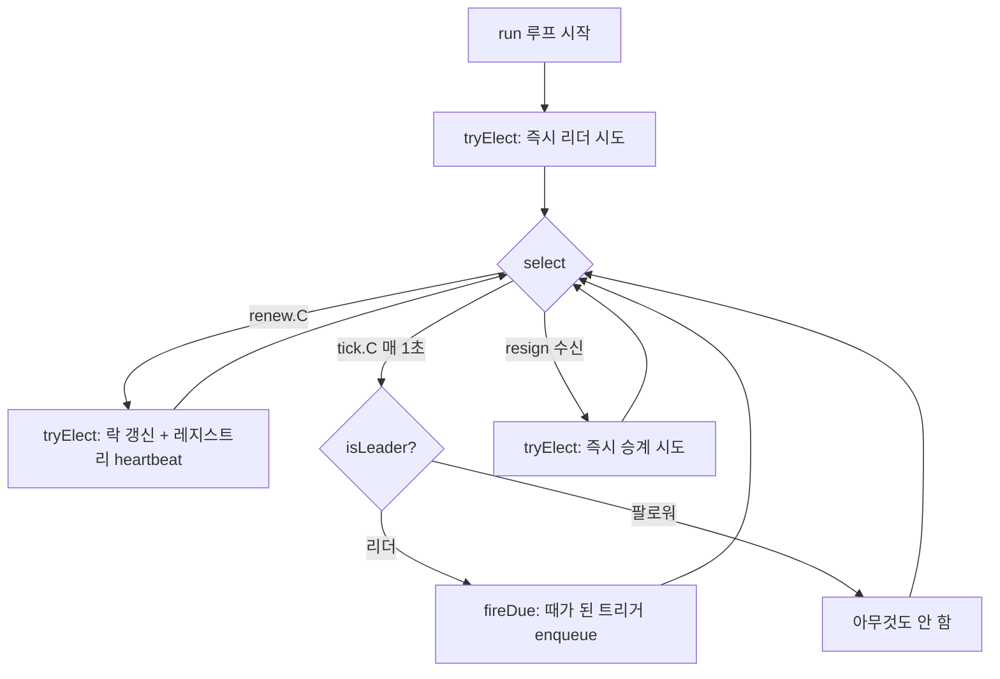
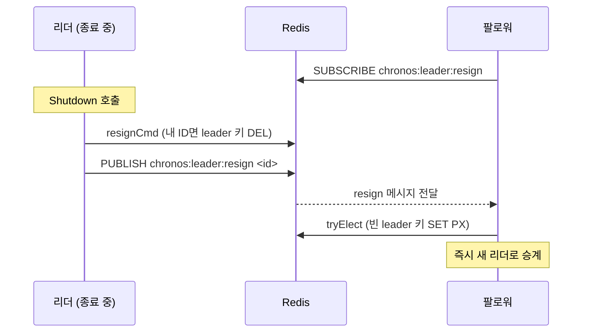

"매일 새벽 3시에 정산 배치를 돌린다"거나 "30초마다 헬스체크를 큐에 넣는다" 같은 주기 실행은 어느 서비스에나 있다. 인스턴스가 한 대라면 `cron`에 등록하면 끝이다. 그런데 무중단 배포와 고가용성을 위해 스케줄러를 **여러 대** 띄우는 순간 골치 아픈 질문이 생긴다. 세 대가 모두 "새벽 3시"를 알고 있으면, 정산 배치가 **세 번** 돌지 않을까?

이번 7편은 chronos-go의 `Scheduler`가 이 문제를 어떻게 푸는지 뜯어본다. 핵심은 두 겹의 방어선이다. 하나는 **리더 선출**(오직 한 인스턴스만 트리거를 발화), 다른 하나는 **결정적 dedup 키**(두 인스턴스가 동시에 리더라고 착각해도 같은 트리거는 한 번만 enqueue)다. 이 편은 6편의 큐 소비(WRR) 위에 얹히는 주기 실행 제어 계층을 다룬다.

# 1. 여러 대가 같은 cron을 돌리면 생기는 일

chronos-go에서 주기 작업은 `RegisterCron` / `RegisterInterval`로 등록한다. 두 함수 모두 내부적으로 `register`를 호출해 `scheduleEntry` 하나를 만들고, 나중에 `Start`가 tick loop를 돌리며 "때가 된" 트리거를 큐에 넣는다. `RegisterInterval`은 최소 1초 이상만 허용하는데, 그 에러 메시지가 이미 문제의 성격을 드러낸다.

```go
if interval < time.Second {
	return errors.New("chronos: interval must be >= 1s (sub-second schedules cannot survive leader failover)")
}
```

"1초 미만 스케줄은 leader failover를 견딜 수 없다." 즉 chronos-go는 애초에 **리더가 바뀔 수 있다**는 전제로 스케줄러를 설계한다.

## 1.1 왜 중복 실행이 문제인가

5편에서 봤듯 chronos-go의 전달 보장은 at-least-once다. 핸들러는 어차피 멱등해야 한다. 그렇다면 주기 작업이 몇 번 더 큐에 들어간들 무슨 상관일까?

문제는 규모가 다르다는 데 있다. 크래시로 인한 재실행은 "가끔 한 번 더"지만, 리더 선출 없이 N대가 각자 tick을 돌리면 **매 트리거마다 항상 N배**로 큐가 부풀어 오른다. 멱등 핸들러가 결과를 보정해 준다 해도 큐와 워커 자원은 그대로 낭비되므로, 주기 작업만큼은 **소스에서** 중복을 잘라내야 한다.

# 2. 리더 선출: 오직 한 인스턴스만 tick

chronos-go의 첫 번째 방어선은 "여러 스케줄러 인스턴스 중 딱 하나만 tick loop를 실행한다"는 것이다. 그 하나를 정하는 게 **리더 선출**이고, 선출은 Redis의 단일 키 하나로 이뤄진다.

```go
// LeaderKey is the STRING key holding the current scheduler leader's instance ID.
func LeaderKey() string { return "chronos:leader" }
```

`chronos:leader`는 큐 hash tag가 없는 **글로벌 키**다(1편에서 본 그 구분이다). 값에는 현재 리더 인스턴스의 ID(UUID)가 들어간다. 이 키를 "선점"한 인스턴스가 리더다.

## 2.1 SET으로 만드는 분산 락

리더 획득/갱신은 `internal/rdb/leader.go`의 Lua 스크립트 하나로 원자적으로 처리된다.

```lua
local cur = redis.call("GET", KEYS[1])
if cur == false then
  redis.call("SET", KEYS[1], ARGV[1], "PX", tonumber(ARGV[2]))
  return 1
elseif cur == ARGV[1] then
  redis.call("PEXPIRE", KEYS[1], tonumber(ARGV[2]))
  return 1
else
  return 0
end
```

논리는 세 갈래다.

- **키가 비어 있으면**(`cur == false`) 내 인스턴스 ID를 값으로, `PX`(밀리초 TTL)를 붙여 `SET`한다 → 내가 리더가 됐다(`1`).
- **키 값이 이미 내 ID면** 내가 이미 리더이므로 `PEXPIRE`로 TTL만 연장한다(임기 갱신) → 여전히 리더(`1`).
- **키 값이 남의 ID면** 다른 인스턴스가 리더다 → 나는 팔로워(`0`).

흔히 분산 락으로 쓰는 `SET key val NX PX` 패턴을 GET + SET로 풀어 쓴 형태다. Lua 스크립트 전체가 원자적으로 실행되므로, 여러 인스턴스가 동시에 이 스크립트를 돌려도 "빈 키를 본 순간 SET"까지가 쪼개지지 않는다. 이 원자성이 두 인스턴스가 동시에 `1`을 받는 경합을 막는 첫 방어다.

## 2.2 TTL과 갱신 주기

리더 락에 TTL이 붙어 있다는 점이 중요하다. TTL이 없으면 리더가 죽었을 때 락이 영원히 남아 아무도 리더가 되지 못한다. TTL이 있으므로, 리더가 갑자기 죽어도 `LeaderTTL`이 지나면 키가 만료되고 다른 인스턴스가 빈 키를 보고 승계한다.

```go
// LeaderTTL is how long a leadership term lasts before it must be renewed.
// Defaults to 5s. Failover happens within ~LeaderTTL of a leader dying.
LeaderTTL time.Duration
```

기본값은 5초다. 리더는 임기가 만료되기 전에 계속 갱신해야 하므로 `run` 루프는 `LeaderTTL/2` 주기(단, 최대 20초로 clamp)로 재선출을 시도하고, tick loop는 그와 별개로 1초 간격으로 돈다. 전체 루프를 그림으로 보면 이렇다. 모든 인스턴스가 같은 루프를 돌지만, `fireDue`(트리거 발화)에 도달하는 것은 `isLeader`가 참인 리더뿐이다.



`tryElect`는 위 Lua의 결과를 받아 `isLeader` 플래그를 갱신한다. 획득에 성공하면 `isLeader.Swap(true)`로 참을, 실패하면 `isLeader.Store(false)`로 거짓을 쓴다. 오직 이 플래그가 참인 리더만 tick에서 `fireDue`로 진입한다.

## 2.3 pub/sub resignation: 리더가 물러날 때

TTL 만료만으로 승계를 기다리면 최악의 경우 `LeaderTTL`(기본 5초)만큼 아무도 트리거를 발화하지 않는 공백이 생긴다. 리더가 **정상 종료**하는 경우라면 이 공백을 없앨 수 있다. 스스로 락을 풀고, 팔로워에게 "나 물러난다"고 알려 주면 된다. 이것이 pub/sub resignation이다.

```go
// ResignLeadership releases leadership if instanceID holds it, then notifies
// followers via pub/sub so they can re-elect immediately.
func (r *RDB) ResignLeadership(ctx context.Context, instanceID string) error {
	if err := resignCmd.Run(ctx, r.client, []string{base.LeaderKey()}, instanceID).Err(); err != nil {
		return err
	}
	return r.client.Publish(ctx, base.LeaderResignChannel(), instanceID).Err()
}
```

`resignCmd` 역시 원자적 Lua다. **내가 여전히 리더일 때만** 락을 지운다. 남이 이미 리더가 됐다면(내 임기가 이미 넘어갔다면) 건드리지 않는다.

```lua
if redis.call("GET", KEYS[1]) == ARGV[1] then
  redis.call("DEL", KEYS[1])
  return 1
end
return 0
```

락을 지운 뒤 `chronos:leader:resign` 채널에 인스턴스 ID를 발행한다(`SubscribeResign`으로 구독). 이 채널을 구독 중인 모든 팔로워는 메시지를 받는 즉시 `tryElect`를 호출해 곧바로 빈 락을 낚아챈다. `run` 루프의 `select`에 이 채널이 하나의 case로 들어가 있는 이유다.



이 흐름은 `Shutdown`에서 트리거된다. 이 인스턴스가 리더였다면(`isLeader.Load()`) `ResignLeadership`을 호출하고 물러난다. 한 가지 미묘한 안전장치가 `tryElect` 앞에 있다. 종료가 시작되면(`ctx.Err() != nil`) `tryElect`는 곧바로 no-op으로 빠져나간다. 그렇지 않으면 방금 자기가 내려놓은 락을 renew 틱에서 **다시 집어** 죽어 가는 인스턴스에 리더십이 묶여 버릴 수 있기 때문이다.

# 3. 리더만으로는 부족하다: 결정적 dedup 키

리더 선출은 "정상 상황에서 딱 하나만 tick"을 보장한다. 하지만 분산 시스템의 함정은 **비정상 상황**이다. 네트워크 지연으로 리더가 자기 TTL이 만료된 줄 모르고 계속 트리거를 발화하는 동안, 다른 인스턴스가 빈 락을 보고 새 리더가 될 수 있다. 잠깐이지만 **두 인스턴스가 동시에 자신을 리더로 믿는** 상태 — split-brain이다.

그래서 chronos-go는 리더 선출을 "최적화"로만 쓰고, **정확성은 dedup 키로 보장**한다. 리더가 둘이어도 같은 트리거가 두 번 큐에 들어가지 못하게 하는 것이다.

## 3.1 트리거 ID와 dedup 키 포맷

핵심은 dedup 키가 **결정적(deterministic)**이라는 데 있다. 어느 인스턴스가 계산하든, 같은 스케줄의 같은 트리거 시각이면 **똑같은 키**가 나와야 한다. `enqueueTrigger`가 그 키를 만든다.

```go
func (s *Scheduler) enqueueTrigger(ctx context.Context, e *scheduleEntry, trigger time.Time) error {
	triggerID := fmt.Sprintf("%s:%d", e.id, trigger.Unix())
	// ...
	dedupKey := base.PeriodicDedupKey(e.queue, triggerID)
	// Dedup key lives well beyond a leader-handover window but not forever.
	return s.rdb.EnqueuePeriodic(ctx, msg, dedupKey, 10*s.cfg.LeaderTTL)
}
```

`triggerID`는 `<scheduleID>:<trigger_unix>` 꼴이다. 스케줄 ID에 트리거 시각의 unix 초를 붙인 것으로, 랜덤이나 타임스탬프-of-now가 아니라 **트리거가 발화되어야 하는 논리적 순간**에서 유도된다. 여기에 큐 hash tag를 씌우면 최종 dedup 키(`base.PeriodicDedupKey` → `chronos:{queue}:pdedup:<scheduleID>:<trigger_unix>`)가 된다.

스케줄 ID 자체도 충돌을 피하도록 신중하게 만들어진다. `<kind>:<spec>`에 더해 큐와 payload를 sha256으로 요약한 값을 붙인다. kind와 spec은 같지만 큐나 payload가 다른 두 잡이 같은 dedup 키를 공유해 하나가 조용히 사라지는 사고를 막기 위해서다.

```go
sum := sha256.Sum256(append([]byte(o.queue+"\x00"), payload...))
id := fmt.Sprintf("%s:%s#%x", kind, spec, sum[:8])
```

## 3.2 EnqueuePeriodic: SET NX PX로 트리거를 잠근다

dedup 키가 실제로 중복을 막는 곳은 `internal/rdb/periodic.go`의 Lua다. 여기서 진짜 `SET NX PX`가 등장한다.

```lua
if redis.call("SET", KEYS[1], "1", "NX", "PX", tonumber(ARGV[2])) == false then
  return -1
end
redis.call("HSET", KEYS[2], "msg", ARGV[3], "state", ARGV[4])
redis.call("XADD", KEYS[3], "*", "task_id", ARGV[1])
redis.call("ZREM", KEYS[4], ARGV[1])
redis.call("ZREM", KEYS[5], ARGV[1])
return 1
```

동작을 따라가면 이렇다.

- `SET dedupKey "1" NX PX <ttl>` — `NX`이므로 그 트리거 키가 **아직 없을 때만** 성공한다. 이미 누군가 이 트리거를 잡았다면 `SET`은 `false`를 반환하고, 스크립트는 `-1`로 빠져나간다.
- 잠금에 성공한 경우에만 태스크 본문을 HASH에 쓰고(`HSET`), Stream에 태스크 ID를 append하고(`XADD`), 혹시 같은 ID로 남아 있던 completed/archived ZSET 잔재를 지운다(`ZREM`).

`-1`이 돌아오면 Go 쪽은 이를 `ErrDuplicateTask`로 변환한다. 그리고 `fireDue`는 이 에러를 **정상 상황으로 취급**한다. 이미 enqueue됐다는 뜻이니 오류가 아니다.

```go
err := s.enqueueTrigger(ctx, e, trigger)
if err == nil || errors.Is(err, rdb.ErrDuplicateTask) {
	continue
}
```

한 가지 중요한 성질이 주석에 못박혀 있다. 이 dedup 키는 unique 락과 달리 **태스크에 기록되지 않아 조기 해제되지 않는다.** 오직 TTL로만 만료된다. 그래서 뒤늦게 깨어난 옛 리더가 같은 트리거를 다시 넣으려 해도 키가 아직 살아 있어 막힌다. TTL을 `10*LeaderTTL`(기본 50초)로 잡은 것도 리더 핸드오버 창보다 충분히 길게 살아남아 이 방어를 유지하기 위해서다.

## 3.3 split-brain에서도 중복 enqueue가 불가능한 이유

이제 두 방어선이 어떻게 맞물리는지 정리된다. 두 인스턴스 A, B가 잠시 동시에 자신을 리더로 믿으며 같은 스케줄의 새벽 3시 트리거를 발화하려 한다고 하자. A와 B가 계산한 `triggerID`는 `<scheduleID>:<3시의 unix 초>`로 **완전히 동일**하므로(결정적 키), `SET NX PX` 대상 키도 같다. 그런데 단일 키 `SET NX`는 원자적이라, **먼저 도착한 쪽만** 성공해 실제로 enqueue하고 나중 쪽은 `-1`(=`ErrDuplicateTask`)을 받고 조용히 지나간다.

리더 선출이 실패한 그 짧은 순간에도 dedup 키가 최종 관문으로 남아 중복을 잘라낸다. 리더 선출은 평소에 낭비를 줄이는 최적화이고, dedup 키는 어떤 경우에도 깨지지 않는 정확성 보장이다.

# 4. missed trigger: 리더가 바뀌어도 흐름을 잇는다

리더가 교체되는 순간에는 잠깐 아무도 tick을 돌리지 않는 공백이 있을 수 있다. 그 사이 지나가 버린 트리거를 어떻게 처리할까? chronos-go는 각 스케줄의 **마지막 발화 시각(lastFired)**을 글로벌 STRING 키(`chronos:sched:<scheduleID>:last`)에 unix 초로 저장해, 새 리더가 그 지점부터 이어서 계산하게 한다.

## 4.1 lastFired 베이스라인

이 값이 있으므로 tick loop는 매번 "지난번 이후로 지나간 트리거가 무엇인가"를 물을 수 있다. 처음 보는 스케줄은 `lastFiredOrInit`이 `now`로 베이스라인을 잡고 **즉시 저장**한다. 저장하지 않으면 매 tick마다 `now`로 재초기화되어 다음 트리거가 영원히 미래가 되고, 그 잡은 영영 발화되지 않는다.

## 4.2 computeFires와 MisfirePolicy

지나간 트리거를 실제로 계산하는 것은 `computeFires`다. `lastFired` 이후 `now`까지의 트리거를 스캔해 (발화할 트리거 목록, 새 lastFired)를 돌려준다. 핵심 결정은 **공백이 생겼을 때** 어떻게 할지이고, 이를 `MisfirePolicy`가 정한다.

```go
const (
	// MisfireSkip (default) discards missed triggers and resumes on schedule.
	MisfireSkip MisfirePolicy = iota
	// MisfireFireOnce fires exactly one catch-up trigger if any were missed.
	MisfireFireOnce
)
```

`computeFires`의 분기는 세 가지다. 첫째, **아직 때가 안 됨**(다음 트리거가 `now`보다 미래)이면 아무것도 발화하지 않고 lastFired를 유지한다. 나머지 둘은 공백 여부(`gap := latest.After(next)`)로 갈린다.

```go
switch {
case !gap:
	return []time.Time{next}, next // 정상 단일 tick: 그 트리거 하나 발화
case policy == MisfireFireOnce:
	return []time.Time{latest}, latest // 공백: 가장 최근 것 하나만 catch-up
default: // MisfireSkip
	return nil, latest // 공백: 놓친 것 버리고 최신으로 fast-forward
}
```

주목할 점은 **한 번에 하나를 넘게 발화하지 않는다**는 것이다. 몇 시간 밀린 스케줄을 밀린 만큼 전부 재생하면 큐가 폭발하기 때문에, chronos-go는 의도적으로 `MisfireRunAll`을 지원하지 않는다. 또한 발화가 실패하면 `fireDue`는 `lastFired`를 **전진시키지 않아**, 다음 tick이 같은 트리거를 재시도한다. 반대로 `ErrDuplicateTask`는 이미 들어갔다는 뜻이므로 그 지점을 넘어 전진하는 게 옳다.

# 5. 정리

이번 편의 요점은 이렇다.

- 스케줄러를 여러 대 띄우면 같은 cron/interval이 인스턴스 수만큼 중복 발화될 위험이 있다. 리더 선출로 이를 막는다.
- 리더 선출은 `chronos:leader` 단일 STRING 키를 원자적 Lua(GET + SET PX / PEXPIRE)로 선점·갱신하는 방식이다. TTL(기본 5초)이 있어 리더가 죽으면 자동 승계되고, **정상 종료 시에는 pub/sub resignation**(`chronos:leader:resign`)으로 즉시 승계된다.
- 리더 선출만으로는 split-brain을 못 막으므로, 각 트리거를 `<scheduleID>:<trigger_unix>`에서 유도한 **결정적 dedup 키**로 `SET NX PX` 잠근다. 두 인스턴스가 동시에 리더여도 먼저 잠근 쪽만 enqueue하고 나머지는 `ErrDuplicateTask`로 빠진다.
- 리더 교체 공백은 `lastFired`와 `computeFires` + `MisfirePolicy`로 메운다. 기본은 밀린 트리거를 건너뛰고(`MisfireSkip`), `MisfireFireOnce`는 한 번만 catch-up한다. 어떤 경우에도 한 tick에 둘 이상은 발화하지 않는다.

다음 8편에서는 여러 태스크를 조합하는 **chain과 group**을 다룬다. 순차 실행과 병렬 실행의 완료를 어떻게 원자적으로 판정하고, 결과를 다음 단계로 어떻게 전달하는지 살펴본다.

# 6. FAQ

## 6.1 `SET key val NX PX`가 정확히 무엇인가요?

Redis `SET`의 두 옵션을 합친 것이다. `NX`(Not eXists)는 "키가 아직 없을 때만 쓰라", `PX <ms>`는 "밀리초 단위 TTL을 붙이라"는 옵션이다. 둘을 합치면 "키가 없으면 값을 쓰면서 만료 시간까지 한 번에 건다"가 되어 **원자적 분산 락**의 표준 관용구가 된다. chronos-go의 트리거 dedup 락(`enqueuePeriodicCmd`)이 바로 이 형태다. 한편 리더 락(`acquireOrRenewCmd`)은 갱신 로직(내 락이면 TTL만 연장)이 필요해 `NX` 대신 GET + SET을 Lua로 감싼 형태를 쓰지만, "없을 때만 선점 + TTL"이라는 본질은 같다.

## 6.2 split-brain이 무엇이고, 왜 리더 선출만으로는 부족한가요?

split-brain은 분산 시스템에서 **둘 이상의 노드가 동시에 자신을 리더/주인으로 믿는** 상태다. chronos-go에서는 네트워크 지연이나 프로세스 정지(GC 등)로 옛 리더가 자기 TTL이 만료된 줄 모른 채 계속 트리거를 발화하는 동안, 다른 인스턴스가 만료된 빈 락을 보고 새 리더가 되면 발생한다. Redis 락은 순간의 소유권만 보장할 뿐, "락을 쥔 줄 알았던 프로세스"의 시간 감각까지 통제하진 못한다. 그래서 리더 선출은 정확성의 **최종 근거가 될 수 없고**, chronos-go는 결정적 dedup 키(6.3)를 정확성의 바닥으로 깐다.

## 6.3 dedup 키는 왜 하필 "결정적"이어야 하나요?

중복을 막으려면 서로 다른 인스턴스가 같은 트리거에 대해 **정확히 같은 키**를 계산해야, 그 키 하나를 두고 경합해 한쪽만 이기게 만들 수 있다. 만약 키에 랜덤 값이나 "지금 시각"을 섞으면, 두 인스턴스가 서로 다른 키를 만들어 `SET NX`가 둘 다 성공해 버리고, 중복 방어가 무너진다. 그래서 chronos-go는 키를 `<scheduleID>:<trigger_unix>`, 즉 **트리거가 발화되어야 하는 논리적 시각**에서만 유도한다. 다만 이 결정성은 전제가 있다. 모든 인스턴스가 같은 스케줄을 같은 타임존(`SchedulerConfig.Location`)으로 등록하고, 시계가 크게 어긋나지 않아야 한다. 그래야 같은 논리적 트리거가 같은 unix 초로 계산된다.

---

> 이 글의 코드는 chronos-go [`88fe6d1`](https://github.com/kenshin579/chronos-go) 기준이다. 이후 구현이 바뀌면 세부는 달라질 수 있다.
