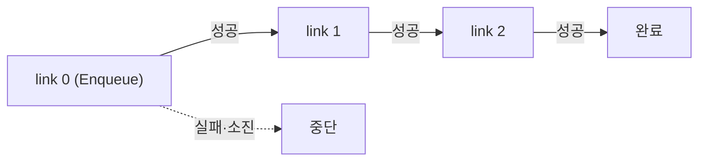
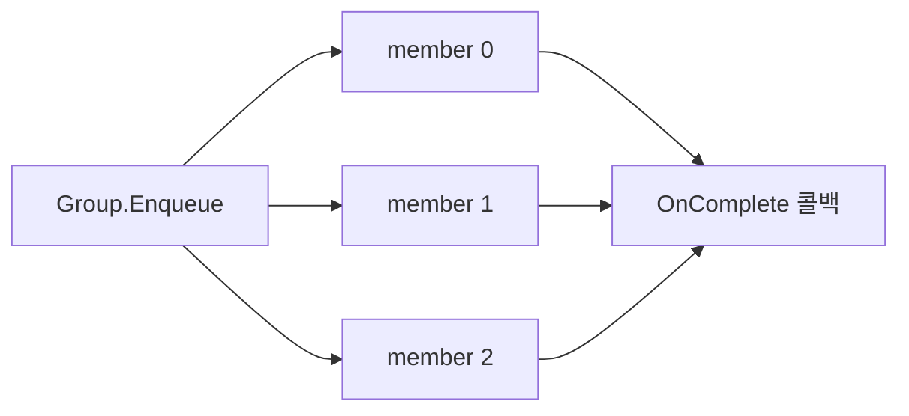

지금까지의 편들은 태스크 하나의 일생을 다뤘다. 큐에 넣고(2편), 미뤘다 실행하고(3편), 실패하면 재시도·격리하고(4편), 워커가 죽으면 복구하는(5편) 이야기였다. 하지만 실제 파이프라인은 태스크 하나로 끝나지 않는다. "썸네일을 만들고 → 그게 끝나면 알림을 보낸다", "10개 파일을 병렬로 처리하고 → 전부 끝나면 결과를 집계한다" 같은 **조합**이 필요하다.

여기서 어려운 문제는 하나로 압축된다. **"여러 태스크가 모두 끝났다"를 어떻게 판정해서, 콜백을 딱 한 번만 실행할 것인가?** 분산 환경에서 워커는 여러 대고, at-least-once라 같은 태스크가 두 번 돌 수도 있다. 이 편은 chronos-go가 chain(순차)과 group(병렬)의 완료를 어떻게 판정하는지, 그 핵심인 Redis Lua 스크립트를 실제 코드로 뜯어본다.

# 1. 조합의 두 가지 모양: chain과 group

chronos-go는 태스크를 조합하는 두 가지 빌더를 제공한다. `NewChain()`으로 만드는 **순차 실행**과 `NewGroup()`으로 만드는 **병렬 실행**이다.

## 1.1 chain — 이전이 성공하면 다음

chain은 링크(link)들을 줄줄이 엮는다. **각 링크는 바로 앞 링크가 성공한 뒤에야** 큐에 들어간다. 앞 링크가 재시도를 모두 소진해 죽으면(dead-letter) chain은 그 자리에서 멈춘다.

```go
// Chain builds a sequence of tasks in which each link is enqueued only after
// the previous one succeeds. A link that exhausts its retries stops the chain;
```

빌더 API는 `Then`으로 링크를 추가하고 `Enqueue`로 첫 링크만 큐에 올린다. 나머지 링크는 앞 링크가 끝날 때마다 하나씩 따라 들어간다.



## 1.2 group — fan-out 후 fan-in

group은 멤버 여러 개를 **한 번에 전부** 큐에 뿌리고(fan-out), 그들이 **모두 성공하면** `OnComplete` 콜백을 딱 한 번 실행한다(fan-in). 하나라도 아직 안 끝났으면 콜백은 뜨지 않는다.

```go
// Group builds a parallel fan-out: every member is enqueued at once, and when
// ALL members have succeeded, the callback task is enqueued exactly once while
// its record exists.
```

여기서 "fan-out"은 작업이 여러 갈래로 퍼지는 것, "fan-in"은 그 갈래가 다시 하나의 완료 지점으로 모이는 것이다(FAQ 7.1). group에서 어려운 부분은 이 fan-in 시점을 정확히 잡아내는 것이다.



두 빌더 모두 **핸들러는 멱등해야 한다**는 시리즈 공통 원칙 위에 서 있다. at-least-once라 링크나 멤버가 재전달되어 핸들러가 두 번 돌 수 있기 때문이다. 완료 판정 로직은 이 재실행 아래에서도 콜백을 정확히 한 번만 fire하도록 설계됐다.

# 2. chain의 완료 판정: ack 직전, 딱 한 번의 승계

chain은 겉보기엔 단순하다. "링크가 성공하면 다음 링크를 넣는다." 하지만 분산 환경에서 이 한 문장을 정확히 지키려면 두 가지를 풀어야 한다. **언제** 다음을 넣는가, 그리고 재전달로 **두 번** 넣지 않는가.

## 2.1 tail 스냅샷과 결정적 ID

`Enqueue`는 첫 링크만 큐에 올린다. 이때 나머지 링크 전체(`stages[1:]`)를 `ChainLink` 슬라이스로 얼려(snapshot) 첫 링크 메시지의 `Chain` 필드에 실어 보낸다. 즉 **각 링크는 자기 뒤에 남은 tail을 통째로 들고 다닌다.** 링크의 ID는 `<chainID>:<index>` 꼴로 **결정적**이다(`chainID + ":0"`, 다음은 `:1`, `:2`...). 이 결정성이 중복 방지의 열쇠다. 승계자(successor)의 ID가 언제나 같으므로, 앞 링크가 재전달되어 승계 로직이 다시 돌아도 **같은 ID를 만들려 시도**하게 되고, 아래 Lua의 존재 검사에 걸려 no-op이 된다.

승계는 워커의 `process`에서 일어나는데, 순서가 중요하다. **핸들러 성공 → 승계자 enqueue → 그다음 ack**다.

```go
// A chained task must enqueue its successor BEFORE acking: if we acked
// first and crashed, the chain would be lost. The reverse order is safe
// because successor creation is idempotent (deterministic ID +
// create-if-absent), so a redelivery cannot duplicate it.
hadSuccessor := len(msg.Chain) > 0
if hadSuccessor {
	if cerr := s.enqueueNextWithRetry(opCtx, msg); cerr != nil {
		// ...
```

ack을 먼저 하고 승계 직전에 크래시하면 chain이 끊긴다. 그래서 승계를 먼저 확정하고 ack을 뒤로 미룬다. 반대 순서(승계 먼저)가 안전한 이유는 승계 생성이 멱등이기 때문이다. 이게 바로 다음 절의 Lua다.

## 2.2 create-if-absent를 강제하는 Lua

승계자를 큐에 올리는 실제 연산은 `internal/rdb/chain.go`의 `chainEnqueueCmd` Lua다. 핵심은 첫 줄의 `EXISTS` 가드다.

```lua
if redis.call("EXISTS", KEYS[1]) == 1 then
  return 0
end
redis.call("HSET", KEYS[1], "msg", ARGV[1], "state", ARGV[2])
redis.call("XADD", KEYS[2], "*", "task_id", ARGV[3])
return 1
```

`KEYS[1]`은 승계자의 태스크 HASH, `KEYS[2]`는 스트림이다. 승계자의 HASH가 **이미 있으면 아무것도 하지 않고 0을 반환**한다. 없을 때만 HASH를 쓰고 스트림에 태스크 ID를 `XADD`한다. 결정적 ID + 이 존재 검사가 합쳐져, 재전달된 앞 링크가 승계자를 두 번 만드는 일을 원천 차단한다. 두 키가 같은 큐 hash tag 아래 있어 클러스터에서도 이 스크립트가 원자적으로 돈다(9편).

지연 링크(`WithProcessIn`)는 변형인 `chainScheduleCmd`가 처리한다. 로직은 같고 마지막만 `XADD`(스트림) 대신 `ZADD`(scheduled ZSET)로 바뀐다.

한 가지 미묘한 주석이 있다. 이 스크립트는 일반 enqueue와 달리 **낡은 completed/archived 항목을 일부러 지우지 않는다.** 승계자가 이미 실행되어 보존(retention)된 상태라면, 그걸 지우고 다시 넣는 것이야말로 이 가드가 막으려는 중복이기 때문이다.

## 2.3 결과 릴레이: PrevResult

chain의 각 링크는 앞 링크의 결과를 받아 쓸 수 있다. 핸들러를 `AddHandlerR`로 등록하면 반환값이 JSON으로 마샬링되어 메시지의 `Result`에 담긴다. 승계자를 만들 때 이 `Result`가 다음 링크의 `PrevResult`로 복사된다.

```go
next := &base.TaskMessage{
	// ...
	PrevResult: msg.Result, // 이번 링크의 결과를 후속에 릴레이
}
```

다음 링크의 핸들러는 제네릭 헬퍼 `PrevResult[R]`로 그 값을 원래 타입으로 복원한다. 첫 링크이거나 앞 핸들러가 `AddHandler`(결과 없음)로 등록됐으면 `ErrNoResult`가 나온다.

```go
func PrevResult[R any, T TaskArgs](t *Task[T]) (R, error) {
	var out R
	if len(t.prevResult) == 0 {
		return out, ErrNoResult
	}
	if err := json.Unmarshal(t.prevResult, &out); err != nil {
		return out, fmt.Errorf("chronos: decode prev result: %w", err)
	}
	return out, nil
}
```

# 3. group의 완료 판정: pending SET을 비우면 콜백

group의 완료 판정은 chain보다 까다롭다. "모두 끝났나?"를 판정하는 자료구조는 **pending SET** — 아직 안 끝난 멤버 ID들을 담은 Redis SET이다. 멤버가 하나 끝날 때마다 자기 ID를 SET에서 빼고(`SREM`), **SET이 비면 그때 콜백을 만든다.**

## 3.1 멤버보다 먼저 등록되는 pending SET

`Group.Enqueue`는 멤버를 뿌리기 **전에** pending SET을 먼저 만든다. 순서가 반대라면, 첫 멤버가 순식간에 끝나 완료를 보고했을 때 SET이 아직 없어 콜백이 조기에 뜨거나 상태가 꼬일 수 있다.

```go
// 1) Register the pending-member SET before any member can possibly finish.
if err := c.rdb.CreateGroup(ctx, cbLink.Queue, groupID, memberIDs); err != nil {
	return nil, err
}

// 2) Enqueue the members (sequential, non-atomic ...)
for i, p := range pending {
	if err := dispatchMessage(ctx, c, p.msg, p.options); err != nil {
```

SET이 사는 위치가 중요하다. `GroupKey(cbQueue, groupID)`는 **콜백 큐의 hash slot**에 놓인다. 그래야 "멤버 제거 + SET이 비면 콜백 생성"이 콜백의 키들과 한 슬롯에서 원자적으로 돌아간다. 각 멤버 메시지는 콜백 스냅샷(`GroupCallback`)과 자기 인덱스(`GroupIndex`), 그룹 크기(`GroupSize`)를 지니고 다녀서, 어느 멤버가 끝나든 "어디에 어떻게 보고할지"를 스스로 안다.

또한 이 SET에는 안전망 TTL(`GroupTTL = 7 * 24 * time.Hour`)이 붙는다. 멤버 하나가 삭제되거나 dead-letter 후 영영 재실행되지 않아 **버려진 그룹**이 되면, 이 TTL이 만료되며 pending SET이 사라지고 콜백은 더 이상 뜨지 않는다. 진행 중인 그룹은 만료되지 않는다. 아래 Lua가 멤버가 남아 있는 한 TTL을 매번 갱신하기 때문이다.

## 3.2 groupCompleteCmd Lua 해부

완료 판정의 핵심은 `internal/rdb/group.go`의 `groupCompleteCmd`다. 멤버가 성공할 때마다 `CompleteGroupMember`가 이 스크립트를 호출한다. 전문을 보자.

```lua
if redis.call("EXISTS", KEYS[1]) == 0 then
  return 0
end
redis.call("SREM", KEYS[1], ARGV[1])
if ARGV[8] ~= "" then
  redis.call("HSET", KEYS[4], ARGV[9], ARGV[8])
  redis.call("EXPIRE", KEYS[4], ARGV[7])
end
if redis.call("SCARD", KEYS[1]) > 0 then
  redis.call("EXPIRE", KEYS[1], ARGV[7])
  if redis.call("EXISTS", KEYS[4]) == 1 then
    redis.call("EXPIRE", KEYS[4], ARGV[7])
  end
  return 0
end
local cb = ARGV[2]
if redis.call("EXISTS", KEYS[4]) == 1 and tonumber(ARGV[10]) > 0 then
  local msg = cjson.decode(cb)
  local results = {}
  local n = tonumber(ARGV[10])
  for i = 0, n - 1 do
    local v = redis.call("HGET", KEYS[4], tostring(i))
    if v then
      results[i + 1] = v
    else
      results[i + 1] = cjson.null
    end
  end
  msg["group_results"] = results
  cb = cjson.encode(msg)
end
redis.call("DEL", KEYS[1], KEYS[4])
if redis.call("EXISTS", KEYS[2]) == 1 then
  return 0
end
redis.call("HSET", KEYS[2], "msg", cb, "state", ARGV[3])
if ARGV[5] == "stream" then
  redis.call("XADD", KEYS[3], "*", "task_id", ARGV[4])
else
  redis.call("ZADD", KEYS[3], ARGV[6], ARGV[4])
end
return 1
```

`KEYS[1]`이 pending SET, `KEYS[2]`가 콜백 태스크 HASH, `KEYS[3]`이 콜백의 목적지(스트림 또는 scheduled ZSET), `KEYS[4]`가 결과 HASH다. 흐름을 단계로 끊어 읽으면 이렇다.

1. **SET이 없으면 return 0.** 그룹이 이미 완료됐거나 만료됐다는 뜻이다. 재전달된 멤버 보고가 여기서 안전하게 no-op이 된다.
2. **`SREM`으로 자기 멤버 제거.** 이번에 끝난 멤버를 pending에서 뺀다.
3. **결과 저장.** 멤버가 결과를 냈으면(`ARGV[8]`) base64 문자열을 결과 HASH에 자기 인덱스(`ARGV[9]`)로 넣는다.
4. **아직 남았으면(`SCARD > 0`) TTL만 갱신하고 return 0.** SET과 결과 HASH의 TTL을 함께 밀어 진행 중인 그룹이 만료되지 않게 한다. **콜백은 만들지 않는다.**
5. **비었으면 콜백 조립.** 결과 HASH에서 0..n-1 인덱스를 순서대로 읽어 `group_results` 배열을 만들고 콜백 메시지에 심는다(`cjson`). 그다음 SET과 결과 HASH를 `DEL`한다.
6. **콜백 create-if-absent.** 콜백 HASH가 이미 있으면 return 0, 없을 때만 HASH를 쓰고 스트림(`XADD`) 또는 ZSET(`ZADD`)에 올린 뒤 **return 1** — 이 1이 "콜백을 방금 fire했다"는 신호다.

즉 완료 판정은 **pending SET을 원자적으로 하나씩 줄이고(decrement), 비는 순간에만 콜백을 create-if-absent로 fire**하는 것으로 요약된다. `SREM`부터 콜백 생성까지가 단일 Lua라 여러 멤버가 동시에 끝나도 "마지막 하나"만 SET을 비우고 return 1을 받는다.

## 3.3 결과 팬인: GroupResults

group의 결과 전달은 chain보다 한 겹 복잡하다. 멤버들이 **동시에** 끝나므로, 각자 결과를 결과 HASH에 자기 인덱스로 흩뿌려 두고(`HSET KEYS[4] index value`), 마지막 멤버가 SET을 비울 때 위 Lua가 그것들을 인덱스 순서대로 모아 콜백의 `group_results`에 담는다. Go 쪽에서 결과는 base64로 인코딩되어 넘어간다.

```go
resultB64 := ""
if len(member.Result) > 0 {
	resultB64 = base64.StdEncoding.EncodeToString(member.Result)
}
```

base64를 쓰는 이유는 결과가 임의의 `[]byte`(JSON)이고, Lua의 `cjson`으로 콜백 메시지에 다시 끼워 넣을 때 문자열이어야 안전하기 때문이다(Go의 `[]byte` JSON 인코딩과도 모양이 맞는다). 콜백 핸들러는 `GroupResults[R]`로 멤버 결과들을 Add 순서대로 복원한다. 시그니처는 chain의 `PrevResult[R]`와 짝을 이룬다.

```go
func GroupResults[R any, T TaskArgs](t *Task[T]) ([]R, error) {
	if t.groupResults == nil {
		return nil, ErrNoResult
	}
	out := make([]R, len(t.groupResults))
	for i, raw := range t.groupResults {
		if len(raw) == 0 {
			return nil, fmt.Errorf("chronos: group member %d: %w", i, ErrNoResult)
		}
		if err := json.Unmarshal(raw, &out[i]); err != nil {
			return nil, fmt.Errorf("chronos: decode group member %d result: %w", i, err)
		}
	}
	return out, nil
}
```

멤버마다 타입이 다르거나 일부만 결과를 냈다면 `RawGroupResults()`로 원시 바이트 슬라이스를 직접 다룬다.

# 4. 왜 콜백이 딱 한 번만 뜨는가

콜백이 정확히 한 번 fire되는 것은 세 가지 성질이 겹친 결과다.

- **원자성.** 완료 판정(SET decrement)과 콜백 생성이 하나의 Lua 안에 있어, 여러 워커가 멤버를 동시에 끝내도 SET을 마지막으로 비운 호출 하나만 return 1을 받는다.
- **멱등성.** 승계자(chain)와 콜백(group) 모두 결정적 ID + create-if-absent(`EXISTS` 가드)로 만들어진다. 재전달된 링크·멤버가 로직을 다시 돌려도 이미 존재하는 대상을 다시 만들지 못한다. SET이 없거나 멤버가 이미 빠진 상태의 보고는 조용한 no-op이다.
- **ack보다 먼저 보고.** chain 승계와 group 완료 보고는 모두 태스크를 ack하기 **전에** 확정된다. 보고 직후·ack 직전에 크래시하면 recoverer(5편)가 그 태스크를 재전달하고, 멱등한 보고가 다시 시도되어 진행 상황이 유실되지 않는다.

# 5. 중첩은 정확히 1단계

chain과 group은 서로를 품을 수 있지만 **딱 한 단계까지만** 이다.

- **group 멤버가 chain일 수 있다** — `Group.AddChain(ch)`. 그 chain의 링크들이 순차로 돌고, **마지막 링크**가 그룹에 완료를 보고한다(결과는 그 멤버의 `GroupResults` 자리로 들어간다).
- **chain 스테이지가 병렬 group일 수 있다** — `Chain.ThenGroup(g)`. 그 스테이지의 멤버들이 병렬로 돌고, group의 `OnComplete` 콜백이 fan-in한 뒤 chain이 콜백의 결과를 들고 이어진다.

하지만 그 이상은 막혀 있다. 코드가 명시적으로 거부한다. group 멤버로 쓰인 chain이 다시 `ThenGroup`을 품으면 스냅샷 단계에서 에러다.

```go
if ch.hasGroupStage() {
	return nil, enqueueOptions{}, errors.New("chronos: a group member chain cannot contain a parallel stage (ThenGroup) — recursive nesting beyond one level is not supported")
}
```

반대로 chain 스테이지로 쓰인 group의 멤버가 다시 chain이면(`AddChain`) 역시 거부된다.

```go
if m.isChain {
	return base.ChainLink{}, fmt.Errorf("chain stage %d member %d: a group used as a chain stage cannot have chain members yet", i, j)
}
```

왜 이 제약을 뒀을까? 완료 판정 상태(pending SET, 결과 HASH, 결정적 ID 체계)는 "한 겹의 fan-out/fan-in"을 원자적으로 다루도록 설계됐다. 중첩이 깊어지면 콜백 큐의 hash slot 안에서 모든 상태를 원자적으로 유지한다는 보장(9편의 클러스터 안전성)과 결정적 ID 네이밍이 지수적으로 복잡해진다. 1단계로 못 박음으로써 완료 판정 Lua를 단순하고 검증 가능한 상태로 유지한다.

# 6. 정리

이번 편에서 본 것을 요약하면 이렇다.

- 오케스트레이션의 본질적 난이도는 "여러 태스크가 모두 끝났다"를 판정해 **콜백을 딱 한 번 fire**하는 데 있다.
- **chain**은 각 링크가 tail을 들고 다니며, 성공 시 ack 직전에 결정적 ID + create-if-absent Lua(`chainEnqueueCmd`)로 다음 링크를 승계한다.
- **group**은 pending SET에 안 끝난 멤버를 담고, `groupCompleteCmd` Lua가 멤버마다 `SREM`으로 SET을 줄이다 **비는 순간에만** 콜백을 create-if-absent로 만든다.
- 결과는 chain에서 `PrevResult`, group에서 `GroupResults`로 릴레이되며, group 결과는 결과 HASH에 base64로 모였다가 콜백에 팬인된다.
- 콜백이 정확히 한 번 뜨는 것은 **원자성 + 멱등성 + ack 전 보고**가 겹친 결과다.
- 중첩은 정확히 **1단계** — group 멤버 chain, chain 스테이지 group까지만 허용된다.

다음 9편에서는 이 시리즈 내내 "왜 이 키에 `{queue}` 해시 태그가 붙지?"라고 남겨둔 궁금증을 정면으로 회수한다. 멀티 키 Lua를 Redis Cluster에서 안전하게 돌리는 해시 태그와 원자성이 주제다.

# 7. FAQ

## 7.1 fan-out / fan-in이 정확히 뭔가요?

**fan-out**은 하나의 지점에서 작업이 여러 갈래로 퍼지는 것, **fan-in**은 그 여러 갈래가 다시 하나의 완료 지점으로 모이는 것이다. chronos-go의 group이 정확히 이 패턴이다. `Group.Enqueue`가 멤버들을 한꺼번에 뿌리는 게 fan-out이고, 멤버들이 각자 끝나며 pending SET을 비우다 마지막 하나가 `OnComplete` 콜백을 트리거하는 게 fan-in이다. 어려운 부분은 fan-in 시점을 정확히 잡는 것인데, chronos-go는 그것을 "pending SET이 빌 때"라는 단일 원자 조건으로 환원했다.

## 7.2 결과는 어떻게 다음 단계로 전달되나요?

핸들러를 `AddHandler`가 아니라 `AddHandlerR`로 등록하면 반환값이 JSON으로 마샬링되어 태스크 메시지의 `Result`에 담긴다. chain에서는 이 값이 다음 링크의 `PrevResult`로 복사되고, 다음 핸들러가 `PrevResult[R](task)`로 원래 타입을 복원한다. group에서는 각 멤버 결과가 결과 HASH(`chronos:{cbQueue}:groupresult:<id>`)에 멤버 인덱스별 base64로 저장됐다가, 마지막 멤버가 완료될 때 Lua가 인덱스 순서대로 모아 콜백의 `group_results`에 담는다. 콜백은 `GroupResults[R](task)`로 Add 순서의 결과 슬라이스를 얻는다.

## 7.3 왜 중첩을 1단계로만 제한하나요?

완료 판정에 쓰는 상태(pending SET, 결과 HASH, `<chainID>:<index>`·`<groupID>:m<i>` 결정적 ID)는 한 겹의 fan-out/fan-in을 콜백 큐의 단일 hash slot 안에서 원자적으로 다루도록 설계됐다. 중첩이 깊어지면 이 상태 관리와 ID 네이밍, 클러스터 원자성 보장이 급격히 복잡해진다. 그래서 group 멤버 chain(`AddChain`)·chain 스테이지 group(`ThenGroup`)까지만 허용하고, 그 이상은 스냅샷 단계에서 에러로 거부한다. 완료 판정 Lua를 검증 가능한 상태로 유지하려는 의도적 제약이다.

---

> 이 글의 코드는 chronos-go [`88fe6d1`](https://github.com/kenshin579/chronos-go) 기준이다. 이후 구현이 바뀌면 세부는 달라질 수 있다.
