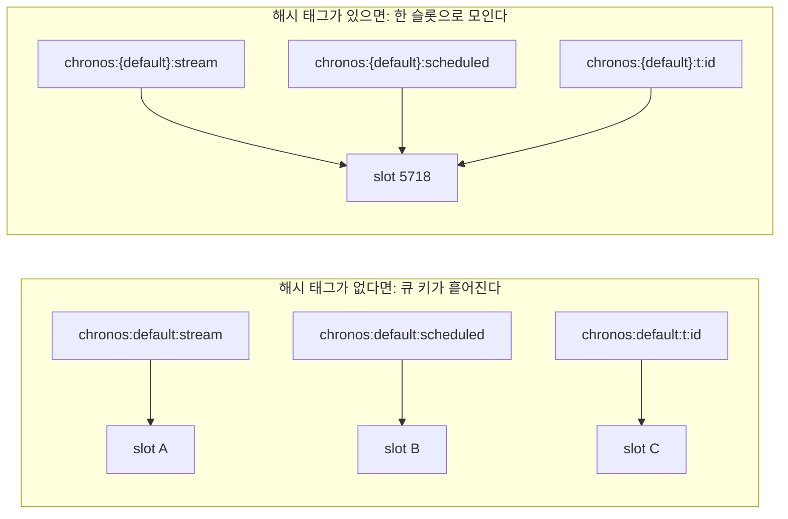

시리즈 내내 chronos-go의 키에는 이상한 중괄호가 붙어 있었다. `chronos:{default}:stream`, `chronos:{default}:scheduled`처럼 큐 이름만 `{}`로 감싼 형태다. 1편에서 이것을 **Redis Cluster의 해시 태그(hash tag)** 라고만 소개하고 "마지막 9편에서 정면으로 다룬다"고 미뤄 두었다.

마지막 편에서 그 약속을 지킨다. 왜 하필 큐 이름만 중괄호로 묶었는지, 반대로 `chronos:queues`·`chronos:leader` 같은 글로벌 키에는 왜 중괄호가 **없는지**를 코드로 확인한다. 이 한 가지 규칙이 chronos-go가 많은 Lua 스크립트를 쓰는 이유이자, Redis Cluster에서도 안전하게 도는 이유다.

# 1. Redis Cluster는 키를 어떻게 나누나

단일 Redis라면 모든 키가 한 인스턴스에 있으니 여러 키를 한 번에 만지는 명령이나 스크립트에 아무 제약이 없다. 문제는 데이터가 여러 노드에 흩어지는 **Redis Cluster**에서 시작된다.

## 1.1 16384개의 슬롯과 CRC16

Redis Cluster는 전체 키 공간을 **16384개의 해시 슬롯(hash slot)** 으로 나누고, 이 슬롯들을 클러스터의 마스터 노드들에게 나눠 맡긴다. 예를 들어 노드 3대라면 A가 0~5460, B가 5461~10922, C가 10923~16383 슬롯을 담당하는 식이다.

어떤 키가 어느 슬롯에 속하는지는 순수하게 키 이름으로 결정된다.

```
slot = CRC16(key) mod 16384
```

`redis-cli`의 `CLUSTER KEYSLOT` 명령으로 직접 확인할 수 있다.

```bash
> CLUSTER KEYSLOT chronos:{default}:stream
(integer) 5718
> CLUSTER KEYSLOT chronos:{default}:scheduled
(integer) 5718
```

두 키의 이름이 다른데 슬롯이 같다. 해시 태그의 효과인데, 그 얘기는 2장에서 한다. 먼저 슬롯이 다르면 무슨 일이 생기는지부터 봐야 한다.

## 1.2 멀티 키 연산의 벽: CROSSSLOT

Redis Cluster에는 절대 규칙이 하나 있다. **하나의 명령(또는 Lua 스크립트)이 건드리는 모든 키는 같은 슬롯에 있어야 한다.** 서로 다른 슬롯의 키를 한 명령에 섞으면 Redis는 실행을 거부하고 에러를 던진다.

```bash
> MSET chronos:queues 1 chronos:leader 2
(error) CROSSSLOT Keys in request don't hash to the same slot
```

이유는 명확하다. 슬롯이 다르면 두 키가 아예 **다른 노드**에 있을 수 있고, 서로 다른 노드에 걸친 연산을 하나의 원자적 단위로 실행하는 것은 분산 트랜잭션이 되어 버린다. Redis Cluster는 그 복잡함을 떠안지 않는 대신 "멀티 키 연산은 한 슬롯 안에서만"이라는 제약을 개발자에게 넘긴다.

이 제약이 chronos-go에 직격탄이 되는 지점은 **Lua 스크립트**다. 시리즈에서 봤듯 chronos-go의 핵심 로직은 거의 다 Lua로 되어 있다. forwarder는 ZSET에서 항목을 빼서 Stream에 넣고 Hash의 상태를 바꾼다. enqueue는 락을 잡고 Hash를 쓰고 Stream에 추가한다. 하나같이 **여러 키를 한 스크립트 안에서** 만진다. 이 키들이 서로 다른 슬롯에 떨어지면 스크립트 자체가 클러스터에서 돌지 못한다.

# 2. 해시 태그로 한 큐를 한 슬롯에 묶기

그래서 필요한 것이 **여러 키를 의도적으로 같은 슬롯에 몰아넣는 방법**이다. Redis Cluster는 이를 위해 해시 태그라는 예외 규칙을 둔다.

## 2.1 해시 태그 규칙

슬롯을 계산할 때, 키 이름에 `{...}` 패턴이 있으면 Redis는 **키 전체가 아니라 중괄호 안의 문자열만** CRC16에 넣는다. 정확히는 첫 번째 `{`와 그 뒤 첫 번째 `}` 사이의 비어 있지 않은 부분이다.

- `chronos:{default}:stream` → 해시 대상은 `default`
- `chronos:{default}:scheduled` → 해시 대상은 `default`
- `chronos:{default}:t:1a2b3c` → 해시 대상은 `default`

세 키의 이름은 전부 다르지만 해시 계산에 들어가는 부분은 똑같이 `default`다. 따라서 **같은 슬롯에 배치된다.** 1.1절에서 본 두 키의 슬롯이 5718로 같았던 것이 바로 이 규칙 때문이다.

## 2.2 chronos-go의 키 조립

chronos-go의 모든 큐별 키는 `internal/base/keys.go` 한 곳에서 조립되며, 출발점은 딱 한 줄짜리 프리픽스 함수다.

```go
// QueueKeyPrefix returns the common prefix for all keys of a queue. The queue
// name is wrapped in a Redis Cluster hash tag ({...}) so that every key of a
// single queue hashes to the same slot, allowing multi-key Lua scripts to run
// on a cluster.
func QueueKeyPrefix(qname string) string {
	return "chronos:{" + qname + "}:"
}
```

큐 이름만 `{}`로 감싼다는 것이 핵심이다. Stream·scheduled·retry·archived·completed·태스크 Hash·unique 락까지, 한 큐에 속한 모든 키가 이 프리픽스를 공유하므로 전부 같은 슬롯에 모인다.

```go
func StreamKey(qname string) string    { return QueueKeyPrefix(qname) + "stream" }
func ScheduledKey(qname string) string { return QueueKeyPrefix(qname) + "scheduled" }
func RetryKey(qname string) string     { return QueueKeyPrefix(qname) + "retry" }
func TaskKey(qname, id string) string  { return QueueKeyPrefix(qname) + "t:" + id }
```

그림으로 보면, 해시 태그가 없을 때와 있을 때 같은 큐의 키들이 어떻게 흩어지고 모이는지가 분명해진다.



# 3. 멀티 키 Lua가 클러스터에서도 원자적인 이유

키를 같은 슬롯에 모으고 나면, 그 키들을 한꺼번에 만지는 Lua 스크립트가 클러스터에서도 문제없이 원자적으로 실행된다. 실제 스크립트로 확인해 보자.

## 3.1 forwarder: ZSET에서 Stream으로

3편에서 다룬 forwarder의 Lua다. 지연·재시도 ZSET에서 실행 시각이 도래한 항목을 Stream으로 승격한다.

```lua
local ids = redis.call("ZRANGEBYSCORE", KEYS[1], "-inf", ARGV[1], "LIMIT", 0, tonumber(ARGV[2]))
for _, id in ipairs(ids) do
  redis.call("XADD", KEYS[2], "*", "task_id", id)
  redis.call("HSET", ARGV[3] .. id, "state", ARGV[4])
  redis.call("ZREM", KEYS[1], id)
end
return #ids
```

이 스크립트는 한 실행 안에서 세 종류의 키를 만진다. 소스 ZSET(`KEYS[1]`), Stream(`KEYS[2]`), 그리고 태스크 Hash다. 특히 태스크 Hash 키는 `KEYS`로 넘어오지 않고 스크립트 안에서 `ARGV[3] .. id`, 즉 **프리픽스와 태스크 ID를 이어 붙여 만든다.** 여기서 그 프리픽스가 `base.TaskKeyPrefix(qname)`, 곧 `chronos:{qname}:t:`다.

```go
func (r *RDB) ForwardScheduled(ctx context.Context, qname string, now time.Time, max int) (int, error) {
	keys := []string{base.ScheduledKey(qname), base.StreamKey(qname)}
	argv := []interface{}{scheduleScore(now), max, base.TaskKeyPrefix(qname), int(base.StatePending)}
	n, err := forwardCmd.Run(ctx, r.client, keys, argv...).Int()
	// ...
}
```

ZSET·Stream·Hash 프리픽스가 전부 같은 `{qname}` 해시 태그를 달고 있으니, 스크립트가 실행 중에 만드는 태스크 Hash 키까지 포함해 **모든 키가 동일한 슬롯**에 있음이 보장된다. `forward.go`의 주석이 이를 한 문장으로 정리한다. "The computed task-hash keys share the queue's hash tag, so the multi-key script is cluster-safe."

Lua 스크립트가 보장하는 것은 여러 키에 걸친 조작을 다른 클라이언트가 중간 상태를 보지 못하게 한 덩어리로 실행한다는 점이다. Redis는 스크립트 한 개를 단일 스레드에서 끝까지 돌리므로, forwarder가 항목을 ZSET에서 빼는 순간과 Stream에 넣는 순간 사이에 워커가 끼어들어 "ZSET에도 없고 Stream에도 없는" 유실 창을 볼 일이 없다.

## 3.2 chain·group도 같은 원리

8편의 chain·group 완료 판정 역시 정확히 이 규칙 위에 서 있다. chain 후속 태스크 enqueue는 태스크 Hash와 Stream 두 키를 원자적으로 만지고, group 완료 스크립트는 한술 더 떠서 pending SET, 콜백 태스크 Hash, 콜백 Stream/ZSET, 결과 Hash까지 **네 개의 키**를 한 스크립트에서 만진다. `group.go`가 이를 위해 못 박아 둔 불변식이 있다. 그룹의 상태 키(`GroupKey`)와 콜백의 키가 반드시 **같은 콜백 큐의 해시 슬롯**에 있어야 한다는 것이다. 그래서 `CompleteGroupMember`는 실행 전에 이렇게 방어한다.

```go
// The group SET and the callback's keys must share one hash slot, or the
// atomic script would be cross-slot on a cluster. The builder guarantees
// this (GroupQueue == callback queue); guard against corrupted messages.
if member.GroupQueue != link.Queue {
	return false, errors.New("chronos: group state and callback must live on the callback queue")
}
```

`GroupKey(cbQueue, groupID)`와 `GroupResultKey(cbQueue, groupID)`가 모두 콜백 큐 이름을 해시 태그로 쓰기 때문에, "멤버 하나를 SET에서 빼고, 비면 콜백을 발화한다"는 판정이 클러스터에서도 한 슬롯 안의 원자적 스크립트로 성립한다.

# 4. 글로벌 키: 해시 태그 없이 단일 키로만

여기까지는 "묶어야 하는" 키 얘기였다. 그런데 chronos-go에는 일부러 해시 태그를 **붙이지 않은** 키가 따로 있다.

## 4.1 왜 일부러 해시 태그를 뺐나

`chronos:queues`(전체 큐 목록), `chronos:paused`(일시정지된 큐), `chronos:leader`(스케줄러 리더), `chronos:schedules`(등록된 스케줄) 같은 키다. 이들은 특정 큐에 속하지 않는 **클러스터 전역 인덱스**다. 어느 한 큐의 슬롯에 묶어 둘 이유가 없고, 묶어서도 안 된다.

```go
// QueuesKey returns the SET key listing all known queue names. It has no hash
// tag on purpose: it is a global index touched by a standalone command, never
// inside a per-queue multi-key script.
func QueuesKey() string { return "chronos:queues" }

func PausedKey() string    { return "chronos:paused" }
func LeaderKey() string    { return "chronos:leader" }
func SchedulesKey() string { return "chronos:schedules" }
```

핵심은 "on purpose(의도적으로)"와 "touched by a standalone command"다. 이 키들은 **오직 단일 키 명령으로만** 접근하고 큐별 멀티 키 스크립트가 절대 끌어들이지 않는다. 그래서 이 키가 어느 슬롯·어느 노드에 떨어지든 상관이 없다. 단일 키 연산은 그 키 하나의 슬롯 안에서 끝나므로 CROSSSLOT이 발생할 여지 자체가 없다.

실제로 chain·group의 enqueue 경로를 보면, 큐를 전역 인덱스에 등록하는 `registerQueue`(→ `chronos:queues`)를 **멀티 키 스크립트 밖에서 별도 명령으로** 호출한다. `chain.go`의 주석이 그 이유를 밝힌다. "cached, separate command because QueuesKey has no hash tag." 이 글로벌 키를 큐별 스크립트 안으로 끌고 들어왔다면 서로 다른 슬롯의 키를 섞게 되어 클러스터에서 깨졌을 것이다.

## 4.2 리더 선출 Lua는 단일 키 스크립트

한 가지 오해를 짚고 넘어가자. "Lua 스크립트 = 멀티 키 = 해시 태그 필요"는 아니다. 7편의 리더 선출 스크립트를 보자.

```lua
local cur = redis.call("GET", KEYS[1])
if cur == false then
  redis.call("SET", KEYS[1], ARGV[1], "PX", tonumber(ARGV[2]))
  return 1
elseif cur == ARGV[1] then
  redis.call("PEXPIRE", KEYS[1], tonumber(ARGV[2]))
  return 1
else
  return 0
end
```

Lua 스크립트지만 만지는 키는 `KEYS[1]`(=`chronos:leader`) **하나뿐**이다. 단일 키만 다루는 스크립트는 어느 슬롯에 있든 그 슬롯 안에서 완결되므로 해시 태그가 필요 없다. 리더 키에 중괄호가 없는 것이 바로 이 때문이다. 원자성(GET 후 조건부 SET을 한 덩어리로)은 Lua로 확보하되, 슬롯 제약은 애초에 걸리지 않는다.

정리하면 chronos-go의 클러스터 안전성 규칙은 딱 두 갈래다. **멀티 키 스크립트가 만지는 키는 같은 `{queue}` 해시 태그로 묶고, 그 밖의 글로벌 키는 단일 키 명령으로만 접근한다.** `CLAUDE.md`가 이를 불변식으로 명시해 둔 것도 같은 맥락이다.

# 5. unique lock: 이 원리 위에 세운 중복 방지

Client의 `WithUnique` 옵션으로 켜는 **중복 방지 락**도 이 해시 태그 위에서 동작한다. 마지막으로 이것을 보면 지금까지의 규칙이 실전에서 어떻게 쓰이는지 드러난다.

## 5.1 같은 작업 = 같은 락 키

먼저 "같은 작업"을 어떻게 정의하는가. chronos-go는 태스크의 종류(kind)와 페이로드로 안정적인 접미사를 만든다.

```go
// UniqueSuffix derives a stable deduplication suffix from a task's kind and
// payload: "<kind>:<sha256(payload) hex>".
func UniqueSuffix(kind string, payload []byte) string {
	sum := sha256.Sum256(payload)
	return kind + ":" + hex.EncodeToString(sum[:])
}
```

같은 kind에 같은 payload면 같은 접미사가 나오고, 이 접미사로 만든 락 키를 놓고 두 enqueue가 경쟁한다. 그리고 그 락 키는 당연히 큐의 해시 태그를 단다.

```go
// UniqueKey ... The queue hash tag keeps it in the same slot as the task's
// other keys.
func UniqueKey(qname, suffix string) string {
	return QueueKeyPrefix(qname) + "unique:" + suffix
}
```

## 5.2 다섯 개 키를 한 번에 잠그는 Lua

왜 락 키까지 같은 슬롯에 두어야 하는가. enqueue가 "락을 잡는 것"과 "태스크를 실제로 넣는 것"을 **한 스크립트 안에서** 하기 때문이다.

```lua
if redis.call("SET", KEYS[1], ARGV[1], "NX", "PX", tonumber(ARGV[2])) == false then
  return -1
end
redis.call("HSET", KEYS[2], "msg", ARGV[3], "state", ARGV[4])
redis.call("XADD", KEYS[3], "*", "task_id", ARGV[1])
redis.call("ZREM", KEYS[4], ARGV[1])
redis.call("ZREM", KEYS[5], ARGV[1])
return 1
```

`SET NX PX`로 락을 잡는 데 성공했을 때(락이 없었을 때)만 태스크 Hash·Stream에 넣고, 같은 ID의 낡은 completed/archived 흔적을 지운다. 락 획득에 실패하면 `-1`을 반환하고 아무것도 하지 않는다. Go 쪽은 이 `-1`을 `ErrDuplicateTask`로 번역한다.

```go
keys := []string{
	msg.UniqueKey, base.TaskKey(msg.Queue, msg.ID), base.StreamKey(msg.Queue),
	base.CompletedKey(msg.Queue), base.ArchivedKey(msg.Queue),
}
// ...
if res == -1 {
	return ErrDuplicateTask
}
```

락 키, 태스크 Hash, Stream, completed ZSET, archived ZSET, 이 **다섯 개의 키**가 전부 같은 `{queue}` 슬롯에 있어야 이 스크립트가 클러스터에서 돈다. 만약 락 키만 해시 태그 없이 만들었다면, 이 다섯 키가 뿔뿔이 흩어져 스크립트가 CROSSSLOT으로 깨졌을 것이다. "락을 확인하고, 성공하면 넣는" 두 동작을 원자적으로 붙이는 것이 중복 방지의 전부인데, 그 원자성이 곧 해시 태그에 기대어 있다.

락 해제는 반대로 단일 키(`KEYS[1]` 락 키)만 만지므로 슬롯 걱정이 없다. "여전히 이 태스크가 주인일 때만(`GET`이 자기 ID일 때만) `DEL`"이라는 조건부 삭제를 작은 Lua로 원자화하되, 4.2의 리더 키처럼 단일 키라 해시 태그는 필요 없다.

# 6. 왜 라운드트립 대신 단일 원자 Lua인가

여기까지 오면 chronos-go가 왜 그렇게 Lua에 집착하는지가 분명해진다. 5장의 unique enqueue를 Lua 없이 짠다고 상상해 보자. `SET NX`로 락을 잡고(1차 왕복), 성공을 확인한 뒤 `HSET`으로 태스크를 쓰고(2차), `XADD`로 Stream에 넣는다(3차). 이 세 왕복 사이에는 틈이 있다.

- 락은 잡았는데 `HSET` 직전에 프로세스가 죽으면? 락만 남고 태스크는 없는 유령 상태가 된다.
- 락을 잡은 직후 다른 요청이 끼어들면? 중간 상태를 관찰당한다.

`MULTI`/`EXEC` 트랜잭션으로 묶는 방법도 있지만, 트랜잭션 안에서는 **앞선 명령의 결과를 보고 분기할 수 없다.** "SET NX가 성공했으면 넣고, 실패했으면 넣지 마라"는 조건 분기는 트랜잭션으로 표현이 안 된다. 반면 Lua는 서버에서 결과를 읽어 `if`로 분기하면서 전체를 단일 원자 단위로 실행한다. `CLAUDE.md`가 이를 원칙으로 못 박아 둔다. "Prefer a single atomic Lua script over multiple round-trips when an operation must be all-or-nothing across keys."

즉 chronos-go의 설계 원칙은 이렇게 요약된다. **여러 키에 걸쳐 전부-아니면-전무여야 하는 연산은, 여러 번의 왕복이 아니라 한 번의 원자적 Lua로 짠다.** 그리고 그 Lua가 클러스터에서도 살아남게 하는 것이 `{queue}` 해시 태그다.

# 7. 정리

마지막 편의 요점을 정리하면 이렇다.

- Redis Cluster는 키를 `CRC16(key) mod 16384`으로 **16384개 슬롯**에 나눠 담고, 하나의 명령·스크립트가 만지는 키는 **모두 같은 슬롯**에 있어야 한다(아니면 `CROSSSLOT` 에러).
- **해시 태그** `{...}`는 슬롯 계산에 중괄호 안 문자열만 쓰게 하는 예외 규칙이다. chronos-go는 큐 이름을 `{queue}`로 감싸 한 큐의 모든 키를 같은 슬롯으로 모은다.
- 덕분에 forwarder·chain·group·unique enqueue 같은 **멀티 키 Lua 스크립트가 클러스터에서도 원자적**으로 돈다.
- `chronos:queues`·`chronos:leader` 같은 **글로벌 키는 일부러 해시 태그를 빼고** 단일 키 명령으로만 접근해 안전을 확보한다. 리더 선출처럼 Lua여도 단일 키면 슬롯 제약이 없다.
- "전부-아니면-전무" 연산은 여러 왕복이 아니라 **단일 원자 Lua**로 짜는 것이 chronos-go의 관통 원칙이며, 해시 태그는 그 원칙이 클러스터로 확장되게 하는 받침대다.

아홉 편을 돌아보면, 1편에서 그린 "즉시 실행은 Stream, 시간이 얽힌 것은 ZSET, forwarder가 잇는다"는 지도 위에 2~5편이 태스크의 일생(투입·지연·실패·복구)을, 6~8편이 그 위의 제어 계층(우선순위·리더 선출·오케스트레이션)을 한 겹씩 쌓아 올렸다. 그리고 그 모든 편에서 조용히 반복되던 `{queue}` 중괄호가 사실은 이 시리즈 전체를 떠받치던 클러스터 안전성의 표식이었음을, 마지막 편에서야 회수했다. 분산 태스크 큐를 제대로 만든다는 것은 결국 "유실·중복·경쟁을 어떻게 원자적으로 막는가"라는 한 질문을 자료구조마다 다시 푸는 일이었다.

# 8. FAQ

## 8.1 해시 슬롯(hash slot)이 정확히 뭔가요?

Redis Cluster가 키 공간을 나누는 **논리적 칸**이다. 총 16384개가 있고, 각 마스터 노드가 그중 일부 구간을 맡는다. 어떤 키가 어느 슬롯에 속하는지는 `CRC16(key) mod 16384`로 정해진다. 노드를 추가·제거하면 슬롯 단위로 데이터가 재배치되므로, 클러스터는 "키 하나하나"가 아니라 "슬롯 덩어리"를 옮기는 방식으로 확장·축소한다. `CLUSTER KEYSLOT <key>`로 특정 키의 슬롯 번호를 직접 확인할 수 있다.

## 8.2 `CROSSSLOT` 에러는 왜 나나요?

하나의 명령이나 Lua 스크립트가 **서로 다른 슬롯의 키**를 함께 건드릴 때 난다. 슬롯이 다르면 두 키가 물리적으로 다른 노드에 있을 수 있고, Redis Cluster는 노드에 걸친 원자적 연산을 지원하지 않기 때문이다. 해결책이 해시 태그다. 함께 만져야 하는 키들을 같은 `{...}` 태그로 감싸 한 슬롯에 모으면 된다. chronos-go가 한 큐의 모든 키에 `{queue}`를 붙이는 이유가 바로 이 에러를 원천 차단하기 위해서다.

## 8.3 Lua 스크립트가 `MULTI`/`EXEC` 트랜잭션보다 나은 점은?

가장 큰 차이는 **분기 능력**이다. `MULTI`/`EXEC`는 명령을 큐에 쌓았다가 한꺼번에 실행할 뿐, 중간에 어떤 명령의 결과를 읽어 "그 값에 따라 다음을 할지 말지" 결정할 수 없다. 반면 Lua는 서버에서 `redis.call`의 반환값을 변수에 담아 `if`로 분기하면서 전체를 단일 원자 단위로 실행한다. chronos-go의 "`SET NX`가 성공했을 때만 태스크를 넣는다" 같은 조건부 원자 연산은 Lua라야 표현된다. 덤으로 스크립트는 서버에서 한 번에 실행되므로 왕복 횟수도 줄어든다.

---

> 이 글의 코드는 chronos-go [`88fe6d1`](https://github.com/kenshin579/chronos-go) 기준이다. 이후 구현이 바뀌면 세부는 달라질 수 있다.
