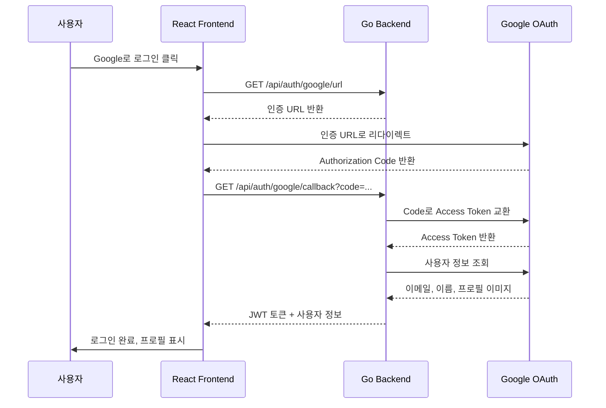
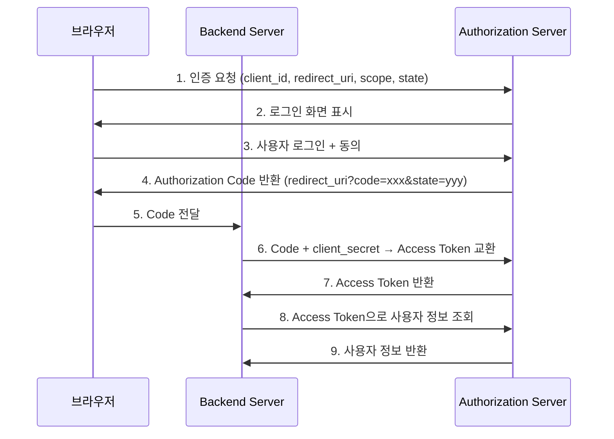

# 1. 들어가며

웹 서비스를 만들 때 회원가입/로그인 기능은 거의 필수이다. 하지만 직접 비밀번호를 관리하려면 해싱, 솔팅, 비밀번호 재설정 등 신경 쓸 것이 많다. 사용자 입장에서도 서비스마다 새 계정을 만드는 것은 번거롭다.

**SNS 로그인(소셜 로그인)** 을 도입하면 이런 문제를 한 번에 해결할 수 있다:

- **보안 위임**: 비밀번호를 직접 저장하지 않고 Google, GitHub 같은 검증된 서비스에 인증을 맡긴다
- **UX 개선**: 클릭 한 번으로 로그인 완료
- **개발 부담 감소**: 비밀번호 관리 로직이 필요 없다

이 글에서는 **Go(Echo) 백엔드 + React 프론트엔드** 조합으로 Google OAuth 2.0 로그인을 처음부터 구현한다. 완성된 프로젝트는 아래와 같은 구조로 동작한다.



> 전체 소스 코드는 [GitHub 저장소](https://github.com/kenshin579/tutorials-go/tree/master/web/sns-login)에서 확인할 수 있다.

# 2. OAuth 2.0 핵심 개념

## 2.1 OAuth 2.0이란?

OAuth 2.0은 **제3자 애플리케이션이 사용자의 리소스에 접근할 수 있도록 권한을 위임하는 표준 프로토콜**이다. 여기서 두 가지 개념을 구분해야 한다:

| 개념 | 설명 | 예시 |
|------|------|------|
| **인증(Authentication)** | "너는 누구인가?" — 신원 확인 | 로그인 |
| **인가(Authorization)** | "너는 무엇을 할 수 있는가?" — 권한 확인 | API 접근 허가 |

OAuth 2.0은 원래 **인가** 프로토콜이지만, OpenID Connect(OIDC)를 함께 사용하면 **인증**까지 처리할 수 있다. Google OAuth는 OIDC를 기본으로 지원한다.

### OAuth 2.0의 4가지 역할

| 역할 | 설명 | 이 프로젝트에서 |
|------|------|----------------|
| **Resource Owner** | 리소스 소유자 (사용자) | Google 계정을 가진 사용자 |
| **Client** | 리소스에 접근하려는 애플리케이션 | Go Backend |
| **Authorization Server** | 인증/인가를 처리하는 서버 | Google OAuth 서버 |
| **Resource Server** | 보호된 리소스를 제공하는 서버 | Google UserInfo API |

## 2.2 Authorization Code Flow

OAuth 2.0에는 여러 인증 방식(Grant Type)이 있다. 웹 애플리케이션에서는 **Authorization Code Flow**를 사용한다.

| Grant Type | 사용 환경 | 보안 수준 |
|-----------|----------|----------|
| **Authorization Code** | 서버 사이드 웹 앱 | 높음 (서버에서 Code → Token 교환) |
| Implicit | SPA (더 이상 권장하지 않음) | 낮음 (Token이 URL에 노출) |
| Client Credentials | 서버 간 통신 (사용자 없음) | 높음 |
| Resource Owner Password | 신뢰할 수 있는 자체 앱 | 낮음 (비밀번호 직접 전달) |

Authorization Code Flow의 핵심은 **Authorization Code를 중간 매개체로 사용**한다는 것이다. 브라우저에는 일회성 Code만 노출되고, 실제 Access Token은 백엔드 서버에서 안전하게 교환한다.



## 2.3 주요 보안 요소

### state 파라미터 (CSRF 방지)

`state`는 인증 요청 시 생성하는 **랜덤 문자열**이다. 콜백으로 돌아올 때 동일한 `state` 값이 반환되는지 확인하여 **CSRF(Cross-Site Request Forgery)** 공격을 방지한다.

```
인증 요청: state=abc123 → Google → 콜백: state=abc123 ✅ (일치하므로 정상)
공격자 요청: state=없음 → 콜백: state=없음 ❌ (검증 실패)
```

### PKCE (Proof Key for Code Exchange)

Authorization Code를 가로채는 공격에 대비하여, 클라이언트가 `code_verifier`와 `code_challenge` 쌍을 생성한다. Code 교환 시 `code_verifier`를 함께 보내서 원래 요청자인지 검증한다. 모바일 앱이나 SPA에서 특히 중요하다.

### Redirect URI 검증

Google Cloud Console에 등록된 Redirect URI만 허용된다. 공격자가 임의의 URI로 Code를 탈취하는 것을 방지한다.

# 3. Google Cloud Console 설정

실제 구현에 앞서 Google Cloud Console에서 OAuth 클라이언트를 생성해야 한다.

## 3.1 프로젝트 생성

1. [Google Cloud Console](https://console.cloud.google.com/)에 접속한다
2. 상단의 프로젝트 선택기에서 **새 프로젝트**를 클릭한다
3. 프로젝트 이름을 입력하고 **만들기**를 클릭한다

<!-- TODO: 스크린샷 삽입 - 프로젝트 생성 -->

## 3.2 OAuth 동의 화면 구성

1. 왼쪽 메뉴에서 **API 및 서비스 > OAuth 동의 화면**을 선택한다
2. User Type: **외부**를 선택한다
3. 앱 이름, 사용자 지원 이메일을 입력한다
4. 범위(Scope)에서 `openid`, `email`, `profile`을 추가한다

<!-- TODO: 스크린샷 삽입 - OAuth 동의 화면 -->

## 3.3 OAuth 2.0 클라이언트 ID 생성

1. **API 및 서비스 > 사용자 인증 정보**에서 **사용자 인증 정보 만들기 > OAuth 클라이언트 ID**를 선택한다
2. 애플리케이션 유형: **웹 애플리케이션**
3. 승인된 리다이렉션 URI에 아래 주소를 추가한다:
   - `http://localhost:8080/api/auth/google/callback`
4. **만들기**를 클릭하면 **Client ID**와 **Client Secret**이 발급된다

<!-- TODO: 스크린샷 삽입 - 클라이언트 ID 생성 -->

> Client Secret은 절대 클라이언트(브라우저)에 노출하면 안 된다. 반드시 백엔드 환경변수로 관리한다.

# 4. Go Backend 구현

## 4.1 프로젝트 구조

```
backend/
├── main.go                  # 서버 엔트리포인트
├── config/
│   └── config.go            # 환경변수 로드
├── provider/
│   ├── oauth_provider.go    # Provider 인터페이스
│   └── google.go            # Google OAuth 구현
├── handler/
│   ├── auth_handler.go      # 인증 API 핸들러
│   └── user_handler.go      # 사용자 API 핸들러
├── middleware/
│   └── auth_middleware.go   # JWT 인증 미들웨어
├── model/
│   └── user.go              # User 모델 (GORM)
├── repository/
│   └── user_repository.go   # DB 접근 계층
├── service/
│   ├── auth_service.go      # 인증 비즈니스 로직
│   └── token_service.go     # JWT 토큰 관리
└── data/
    └── app.db               # SQLite 파일 (자동 생성)
```

Echo v4를 HTTP 프레임워크로, GORM + SQLite를 데이터 저장소로 사용한다.

## 4.2 Provider Interface 설계

다른 SNS(GitHub, Kakao 등)를 쉽게 추가할 수 있도록 **Provider 인터페이스**를 정의한다.

```go
// provider/oauth_provider.go
type OAuthProvider interface {
    GetAuthURL(state string) string
    ExchangeCode(ctx context.Context, code string) (*UserInfo, error)
    Name() string
}

type UserInfo struct {
    Email      string
    Name       string
    AvatarURL  string
    Provider   string
    ProviderID string
}
```

새로운 SNS를 추가하려면 이 인터페이스를 구현하기만 하면 된다.

## 4.3 Google OAuth Provider 구현

`golang.org/x/oauth2` 패키지를 사용하여 Google OAuth를 구현한다.

```go
// provider/google.go
func NewGoogleProvider(clientID, clientSecret, redirectURL string) *GoogleProvider {
    return &GoogleProvider{
        config: &oauth2.Config{
            ClientID:     clientID,
            ClientSecret: clientSecret,
            RedirectURL:  redirectURL,
            Scopes:       []string{"openid", "email", "profile"},
            Endpoint:     google.Endpoint,
        },
    }
}

func (g *GoogleProvider) ExchangeCode(ctx context.Context, code string) (*UserInfo, error) {
    // 1. Authorization Code → Access Token 교환
    token, err := g.config.Exchange(ctx, code)
    if err != nil {
        return nil, fmt.Errorf("code 교환 실패: %w", err)
    }

    // 2. Access Token으로 사용자 정보 조회
    client := g.config.Client(ctx, token)
    resp, err := client.Get("https://www.googleapis.com/oauth2/v2/userinfo")
    if err != nil {
        return nil, fmt.Errorf("사용자 정보 조회 실패: %w", err)
    }
    defer resp.Body.Close()

    // 3. JSON 파싱
    var googleUser struct {
        ID      string `json:"id"`
        Email   string `json:"email"`
        Name    string `json:"name"`
        Picture string `json:"picture"`
    }
    json.NewDecoder(resp.Body).Decode(&googleUser)

    return &UserInfo{
        Email:      googleUser.Email,
        Name:       googleUser.Name,
        AvatarURL:  googleUser.Picture,
        Provider:   "google",
        ProviderID: googleUser.ID,
    }, nil
}
```

핵심 포인트:

- `oauth2.Config.Exchange()`: Authorization Code를 Access Token으로 교환한다
- `config.Client()`: Access Token이 자동으로 포함된 HTTP 클라이언트를 반환한다
- Google UserInfo API(`/oauth2/v2/userinfo`)에서 이메일, 이름, 프로필 이미지를 가져온다

## 4.4 JWT 토큰 관리

사용자 인증 후 **Access Token**(15분)과 **Refresh Token**(7일)을 발급한다.

```go
// service/token_service.go
func (s *TokenService) GenerateTokenPair(userID uint) (*TokenPair, error) {
    accessToken, err := s.generateToken(userID, 15*time.Minute)
    if err != nil {
        return nil, err
    }

    refreshToken, err := s.generateToken(userID, 7*24*time.Hour)
    if err != nil {
        return nil, err
    }

    return &TokenPair{
        AccessToken:  accessToken,
        RefreshToken: refreshToken,
    }, nil
}
```

| 토큰 | 만료 시간 | 용도 |
|------|----------|------|
| Access Token | 15분 | API 요청 인증 |
| Refresh Token | 7일 | Access Token 갱신 |

## 4.5 인증 미들웨어

보호된 API에 접근할 때 JWT를 검증하는 Echo 미들웨어이다.

```go
// middleware/auth_middleware.go
func JWTAuth(tokenService *service.TokenService) echo.MiddlewareFunc {
    return func(next echo.HandlerFunc) echo.HandlerFunc {
        return func(c echo.Context) error {
            // Authorization: Bearer <token> 헤더 파싱
            authHeader := c.Request().Header.Get("Authorization")
            parts := strings.SplitN(authHeader, " ", 2)
            if len(parts) != 2 || parts[0] != "Bearer" {
                return echo.NewHTTPError(http.StatusUnauthorized, "잘못된 Authorization 형식")
            }

            // 토큰 검증
            claims, err := tokenService.ValidateToken(parts[1])
            if err != nil {
                return echo.NewHTTPError(http.StatusUnauthorized, "유효하지 않은 토큰")
            }

            // Context에 사용자 ID 저장
            c.Set("user_id", claims.UserID)
            return next(c)
        }
    }
}
```

## 4.6 API 핸들러 구현

| Method | Path | 설명 | 인증 |
|--------|------|------|------|
| GET | `/api/auth/:provider/url` | OAuth 인증 URL 반환 | 불필요 |
| GET | `/api/auth/:provider/callback` | Authorization Code로 로그인/가입 | 불필요 |
| POST | `/api/auth/refresh` | Access Token 갱신 | 불필요 |
| POST | `/api/auth/logout` | 로그아웃 | 불필요 |
| GET | `/api/user/me` | 현재 사용자 정보 | 필요 |

`auth_handler.go`의 콜백 핸들러는 다음 순서로 동작한다:

1. `state` 파라미터 검증 (CSRF 방지)
2. Authorization Code로 사용자 정보 교환 (Provider에 위임)
3. DB에서 사용자 조회 또는 신규 생성
4. JWT 토큰 쌍 발급 후 응답

```go
// handler/auth_handler.go - HandleCallback
func (h *AuthHandler) HandleCallback(c echo.Context) error {
    providerName := c.Param("provider")
    code := c.QueryParam("code")
    state := c.QueryParam("state")

    tokens, user, err := h.authService.HandleCallback(
        c.Request().Context(), providerName, code, state,
    )
    if err != nil {
        return echo.NewHTTPError(http.StatusInternalServerError, err.Error())
    }

    return c.JSON(http.StatusOK, map[string]interface{}{
        "tokens": tokens,
        "user":   user,
    })
}
```

## 4.7 SQLite + GORM 연동

GORM의 `AutoMigrate`를 사용하면 테이블을 자동으로 생성할 수 있다.

```go
// main.go
db, err := gorm.Open(sqlite.Open("data/app.db"), &gorm.Config{})
if err != nil {
    log.Fatal("DB 연결 실패:", err)
}

// 테이블 자동 생성
db.AutoMigrate(&model.User{})
```

User 모델:

```go
// model/user.go
type User struct {
    ID         uint           `gorm:"primarykey" json:"id"`
    Email      string         `gorm:"uniqueIndex;not null" json:"email"`
    Name       string         `json:"name"`
    AvatarURL  string         `json:"avatar_url"`
    Provider   string         `gorm:"not null" json:"provider"`
    ProviderID string         `gorm:"not null;index" json:"provider_id"`
    CreatedAt  time.Time      `json:"created_at"`
    UpdatedAt  time.Time      `json:"updated_at"`
    DeletedAt  gorm.DeletedAt `gorm:"index" json:"-"`
}
```

# 5. React Frontend 연동

## 5.1 인증 서비스 및 API 클라이언트

Axios 인터셉터를 사용하여 **모든 API 요청에 JWT를 자동으로 첨부**한다. 401 응답 시 Refresh Token으로 갱신을 시도한다.

```typescript
// services/authService.ts
const api = axios.create({ baseURL: API_URL });

// 요청 인터셉터: JWT 자동 첨부
api.interceptors.request.use((config) => {
  const token = localStorage.getItem('access_token');
  if (token) {
    config.headers.Authorization = `Bearer ${token}`;
  }
  return config;
});

// 응답 인터셉터: 401 시 토큰 갱신
api.interceptors.response.use(
  (response) => response,
  async (error) => {
    if (error.response?.status === 401 && !error.config._retry) {
      error.config._retry = true;
      const tokens = await refreshToken();
      localStorage.setItem('access_token', tokens.access_token);
      return api(error.config); // 원래 요청 재시도
    }
    return Promise.reject(error);
  }
);
```

## 5.2 로그인 UI 구현

### LoginButton

Google 로그인 버튼을 클릭하면 백엔드에서 인증 URL을 받아 리다이렉트한다.

```tsx
// components/LoginButton.tsx
export function LoginButton() {
  const handleGoogleLogin = async () => {
    const url = await getGoogleAuthURL();
    window.location.href = url; // Google 인증 페이지로 이동
  };

  return (
    <button onClick={handleGoogleLogin}>
      
      Google로 로그인
    </button>
  );
}
```

### OAuth 콜백 페이지

Google 인증 완료 후 돌아오면 URL의 `code`와 `state`를 백엔드로 전달한다.

```tsx
// components/OAuthCallback.tsx
export function OAuthCallback({ onLogin }: Props) {
  const [searchParams] = useSearchParams();
  const navigate = useNavigate();

  useEffect(() => {
    const code = searchParams.get('code');
    const state = searchParams.get('state');

    handleCallback(code!, state!)
      .then((res) => {
        onLogin(res.user, res.tokens.access_token, res.tokens.refresh_token);
        navigate('/');
      });
  }, [searchParams, onLogin, navigate]);

  return <p>로그인 처리 중...</p>;
}
```

### UserProfile

로그인 후 사용자 정보를 표시하고 로그아웃 기능을 제공한다.

```tsx
// components/UserProfile.tsx
export function UserProfile({ user, onLogout }: Props) {
  return (
    <div>
      
      <h2>{user.name}</h2>
      <p>{user.email}</p>
      <button onClick={onLogout}>로그아웃</button>
    </div>
  );
}
```

## 5.3 인증 상태 관리

`useAuth` 훅으로 인증 상태를 중앙에서 관리한다. 앱이 로드될 때 저장된 토큰으로 사용자 정보를 자동 복원한다.

```typescript
// hooks/useAuth.ts
export function useAuth() {
  const [user, setUser] = useState<User | null>(null);
  const [loading, setLoading] = useState(true);

  useEffect(() => {
    const token = localStorage.getItem('access_token');
    if (token) {
      getMe()
        .then(setUser)
        .catch(() => {
          localStorage.removeItem('access_token');
          localStorage.removeItem('refresh_token');
        })
        .finally(() => setLoading(false));
    } else {
      setLoading(false);
    }
  }, []);

  return { user, loading, isAuthenticated: !!user, login, logout };
}
```

`ProtectedRoute` 컴포넌트로 미인증 사용자의 접근을 차단한다:

```tsx
// components/ProtectedRoute.tsx
export function ProtectedRoute({ isAuthenticated, children }: Props) {
  if (!isAuthenticated) {
    return <Navigate to="/login" replace />;
  }
  return <>{children}</>;
}
```

# 6. 전체 플로우 시연

## 6.1 docker-compose로 실행

```yaml
# docker-compose.yml
services:
  backend:
    build: ./backend
    ports:
      - "8080:8080"
    environment:
      - GOOGLE_CLIENT_ID=${GOOGLE_CLIENT_ID}
      - GOOGLE_CLIENT_SECRET=${GOOGLE_CLIENT_SECRET}
      - JWT_SECRET=${JWT_SECRET:-my-secret-key}
      - FRONTEND_URL=http://localhost:3000

  frontend:
    build: ./frontend
    ports:
      - "3000:80"
    depends_on:
      - backend
```

실행 방법:

```bash
# .env 파일에 Google OAuth 정보 설정
> cp .env.example .env
> vi .env

# 서비스 시작
> docker compose up -d

# 접속 확인
> curl http://localhost:8080/health
{"status":"ok"}
```

| 서비스 | URL |
|--------|-----|
| Frontend | http://localhost:3000 |
| Backend API | http://localhost:8080 |
| Health Check | http://localhost:8080/health |

## 6.2 회원가입 / 로그인 / 로그아웃 시연

1. http://localhost:3000 에 접속하면 로그인 페이지로 리다이렉트된다
2. **Google로 로그인** 버튼을 클릭한다
3. Google 계정을 선택하고 동의한다
4. 자동으로 콜백이 처리되고 프로필 페이지가 표시된다
5. **로그아웃** 버튼을 클릭하면 토큰이 삭제되고 로그인 페이지로 돌아간다

<!-- TODO: 스크린샷 삽입 - 로그인 플로우 -->

SQLite에 저장된 사용자 데이터를 확인할 수 있다:

```bash
> sqlite3 backend/data/app.db "SELECT id, email, name, provider FROM users;"
1|user@gmail.com|홍길동|google
```

## 6.3 CORS 설정

Backend와 Frontend가 다른 포트에서 실행되므로 CORS 설정이 필요하다.

```go
// main.go
e.Use(echoMiddleware.CORSWithConfig(echoMiddleware.CORSConfig{
    AllowOrigins:     []string{cfg.FrontendURL}, // http://localhost:3000
    AllowMethods:     []string{"GET", "POST", "PUT", "DELETE"},
    AllowHeaders:     []string{"Authorization", "Content-Type"},
    AllowCredentials: true,
}))
```

- `AllowOrigins`: Frontend 주소만 허용한다 (와일드카드 `*` 사용 금지)
- `AllowCredentials`: 쿠키/인증 헤더 전송을 허용한다

# 7. 마무리

이 글에서는 OAuth 2.0 Authorization Code Flow를 활용하여 Google 소셜 로그인을 구현했다. 핵심 포인트를 정리하면:

- **Authorization Code Flow**: 브라우저에는 일회성 Code만 노출, Access Token은 서버에서 안전하게 교환
- **Provider 패턴**: 인터페이스를 정의하여 새로운 SNS 추가가 용이한 구조
- **JWT 이중 토큰**: Access Token(단기) + Refresh Token(장기)으로 보안과 UX를 동시에 확보
- **state 파라미터**: CSRF 공격 방지를 위한 필수 보안 요소

### 프로덕션 환경에서 추가로 고려할 사항

| 항목 | 설명 |
|------|------|
| **PKCE** | Authorization Code 가로채기 방지. `code_verifier`/`code_challenge` 쌍으로 Code 교환 시 검증 |
| **Refresh Token Rotation** | Refresh Token 사용 시마다 새 토큰 발급. 탈취된 토큰의 재사용 감지/차단 |
| **Rate Limiting** | 로그인/토큰 갱신 API에 요청 횟수 제한. 브루트포스 방지 |
| **Secure Cookie** | JWT를 localStorage 대신 HttpOnly + Secure + SameSite 쿠키에 저장하여 XSS 방지 |
| **HTTPS** | OAuth 리다이렉트 및 토큰 전송 시 중간자 공격(MITM) 방지 |

# 8. 참고

- [Google OAuth 2.0 공식 문서](https://developers.google.com/identity/protocols/oauth2)
- [OAuth 2.0 RFC 6749](https://datatracker.ietf.org/doc/html/rfc6749)
- [golang.org/x/oauth2 패키지](https://pkg.go.dev/golang.org/x/oauth2)
- [golang-jwt/jwt 패키지](https://github.com/golang-jwt/jwt)
- [Echo 프레임워크 공식 문서](https://echo.labstack.com/)
- [JWT.io](https://jwt.io/)
