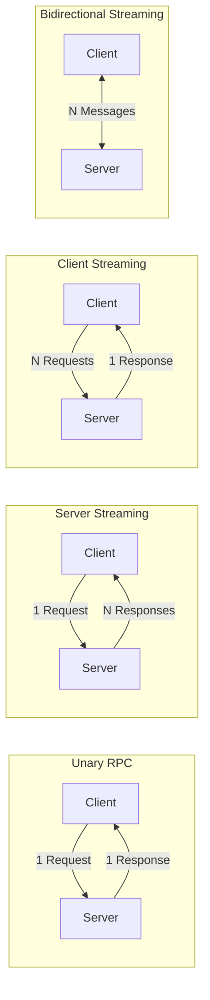

gRPC Unary RPC는 요청 하나에 응답 하나를 반환한다. 대부분의 API는 이것으로 충분하지만, 대량 데이터 전송이나 실시간 양방향 통신이 필요한 경우에는 한계가 있다. 1000개의 항목을 조회하려면 Unary를 1000번 호출하거나, 한 번에 거대한 응답을 받아야 한다.

gRPC는 HTTP/2의 멀티플렉싱을 활용하여 **Streaming RPC**를 지원한다. 단일 연결에서 여러 메시지를 순차적으로 주고받을 수 있어, 네트워크 오버헤드를 줄이고 실시간 통신을 구현할 수 있다.

이 글에서는 이전 글에서 구현한 TodoList 서비스를 확장하여 3가지 Streaming 패턴을 구현한다. Bidirectional Streaming에서의 고루틴 동시성 패턴과 Unary 대비 Streaming의 성능 차이도 벤치마크로 비교한다.

> 전체 예제 코드는 GitHub에서 확인할 수 있다: [todolist-streaming](https://github.com/kenshin579/tutorials-go/tree/master/grpc/todolist-streaming)

## 1. Streaming RPC 개요

gRPC는 4가지 RPC 패턴을 지원한다. Unary를 제외한 나머지 3가지가 Streaming이다.



| 패턴 | 클라이언트 | 서버 | 활용 사례 |
|---|---|---|---|
| **Unary** | 1 요청 | 1 응답 | 일반 CRUD |
| **Server Streaming** | 1 요청 | N 응답 | 대량 조회, 실시간 피드, 로그 테일링 |
| **Client Streaming** | N 요청 | 1 응답 | 파일 업로드, 배치 전송, 센서 데이터 |
| **Bidirectional** | N 요청 | N 응답 | 채팅, 실시간 협업, 주식 시세 |

## 2. Proto 정의

기존 TodoList 서비스를 확장하여 3가지 Streaming RPC를 정의한다. `stream` 키워드가 핵심이다.

```protobuf
service TodoStreamingService {
  // Server Streaming: 필터 조건으로 Todo 목록 스트림
  rpc ListTodos(ListTodosRequest) returns (stream Todo);

  // Client Streaming: 여러 Todo를 배치로 생성
  rpc BatchCreateTodos(stream CreateTodoRequest) returns (BatchCreateResponse);

  // Bidirectional Streaming: 실시간 Todo 작업 & 이벤트
  rpc TodoUpdates(stream TodoAction) returns (stream TodoEvent);
}
```

- `returns (stream Todo)` — 서버가 여러 `Todo`를 순차 전송
- `stream CreateTodoRequest` — 클라이언트가 여러 요청을 순차 전송
- 양쪽 모두 `stream`이면 Bidirectional

Bidirectional Streaming에서 사용하는 메시지 타입도 정의한다.

```protobuf
enum ActionType {
  ACTION_TYPE_UNSPECIFIED = 0;
  ACTION_TYPE_CREATE = 1;
  ACTION_TYPE_COMPLETE = 2;
  ACTION_TYPE_DELETE = 3;
}

message TodoAction {
  ActionType action = 1;
  string todo_id = 2;
  string title = 3;
}

enum EventType {
  EVENT_TYPE_UNSPECIFIED = 0;
  EVENT_TYPE_CREATED = 1;
  EVENT_TYPE_COMPLETED = 2;
  EVENT_TYPE_DELETED = 3;
  EVENT_TYPE_ERROR = 4;
}

message TodoEvent {
  EventType event = 1;
  string todo_id = 2;
  string message = 3;
}
```

## 3. 3가지 Streaming 패턴 구현

### 3.1 Server Streaming

클라이언트가 하나의 요청을 보내면, 서버가 여러 응답을 `Send()`로 순차 전송한다. 서버 메서드가 `return nil`하면 스트림이 종료된다.

**서버 구현:**

```go
func (s *TodoStreamingService) ListTodos(req *todopb.ListTodosRequest, stream todopb.TodoStreamingService_ListTodosServer) error {
    s.mu.Lock()
    defer s.mu.Unlock()

    for _, todo := range s.todos {
        if req.GetCompletedOnly() && !todo.GetCompleted() {
            continue
        }
        if err := stream.Send(todo); err != nil {
            return status.Errorf(codes.Internal, "failed to send todo: %v", err)
        }
    }
    return nil
}
```

Unary RPC와 다른 점은 `context.Context` 대신 **stream 객체**가 두 번째 파라미터로 전달된다는 것이다. `stream.Send()`를 여러 번 호출하여 데이터를 하나씩 보낸다.

**클라이언트 구현:**

```go
stream, err := client.ListTodos(ctx, &todopb.ListTodosRequest{})
if err != nil {
    log.Fatalf("ListTodos failed: %v", err)
}

for {
    todo, err := stream.Recv()
    if err == io.EOF {
        break // 스트림 종료
    }
    if err != nil {
        log.Fatalf("Recv failed: %v", err)
    }
    log.Printf("Received: %s", todo.GetTitle())
}
```

클라이언트는 `Recv()` 루프로 데이터를 수신하고, `io.EOF`가 반환되면 서버가 스트림을 닫은 것이다.

### 3.2 Client Streaming

클라이언트가 여러 요청을 `Send()`로 보내고, 서버가 모든 데이터를 받은 후 하나의 응답을 반환한다.

**서버 구현:**

```go
func (s *TodoStreamingService) BatchCreateTodos(stream todopb.TodoStreamingService_BatchCreateTodosServer) error {
    var ids []string

    for {
        req, err := stream.Recv()
        if err == io.EOF {
            // 클라이언트가 스트림을 닫음 → 집계 결과 응답
            return stream.SendAndClose(&todopb.BatchCreateResponse{
                CreatedCount: int32(len(ids)),
                Ids:          ids,
            })
        }
        if err != nil {
            return status.Errorf(codes.Internal, "failed to receive: %v", err)
        }

        todo := &todopb.Todo{
            Id:    uuid.New().String(),
            Title: req.GetTitle(),
        }

        s.mu.Lock()
        s.todos[todo.Id] = todo
        s.mu.Unlock()

        ids = append(ids, todo.Id)
    }
}
```

핵심 패턴은 `Recv()` 루프 + `io.EOF` 시 `SendAndClose()`다. 서버는 클라이언트가 스트림을 닫을 때까지 데이터를 수신하고, 마지막에 한 번에 응답한다.

**클라이언트 구현:**

```go
stream, err := client.BatchCreateTodos(ctx)
if err != nil {
    log.Fatalf("BatchCreateTodos failed: %v", err)
}

titles := []string{"Learn gRPC", "Write tests", "Deploy service"}
for _, title := range titles {
    if err := stream.Send(&todopb.CreateTodoRequest{Title: title}); err != nil {
        log.Fatalf("Send failed: %v", err)
    }
}

resp, err := stream.CloseAndRecv()
if err != nil {
    log.Fatalf("CloseAndRecv failed: %v", err)
}
log.Printf("Created %d todos", resp.GetCreatedCount())
```

클라이언트는 `Send()`로 데이터를 보내고, `CloseAndRecv()`로 스트림을 닫은 뒤 서버 응답을 받는다.

### 3.3 Bidirectional Streaming

클라이언트와 서버가 동시에 메시지를 주고받는다. 양쪽의 스트림은 독립적이다.

**서버 구현:**

```go
func (s *TodoStreamingService) TodoUpdates(stream todopb.TodoStreamingService_TodoUpdatesServer) error {
    for {
        action, err := stream.Recv()
        if err == io.EOF {
            return nil
        }
        if err != nil {
            return status.Errorf(codes.Internal, "failed to receive: %v", err)
        }

        event := s.processAction(action)
        if err := stream.Send(event); err != nil {
            return status.Errorf(codes.Internal, "failed to send event: %v", err)
        }
    }
}
```

서버는 `Recv()` → 처리 → `Send()` 루프로 동작한다. 이 예제에서는 동기적으로 처리하지만, 필요에 따라 비동기 파이프라인으로 확장할 수 있다.

`processAction()`은 액션 타입에 따라 Todo를 생성/완료/삭제하고, 결과 이벤트를 반환한다.

```go
func (s *TodoStreamingService) processAction(action *todopb.TodoAction) *todopb.TodoEvent {
    switch action.GetAction() {
    case todopb.ActionType_ACTION_TYPE_CREATE:
        todo := &todopb.Todo{
            Id:    uuid.New().String(),
            Title: action.GetTitle(),
        }
        s.mu.Lock()
        s.todos[todo.Id] = todo
        s.mu.Unlock()

        return &todopb.TodoEvent{
            Event:   todopb.EventType_EVENT_TYPE_CREATED,
            TodoId:  todo.Id,
            Message: "created: " + todo.Title,
        }

    case todopb.ActionType_ACTION_TYPE_COMPLETE:
        s.mu.Lock()
        todo, ok := s.todos[action.GetTodoId()]
        if !ok {
            s.mu.Unlock()
            return &todopb.TodoEvent{
                Event:   todopb.EventType_EVENT_TYPE_ERROR,
                TodoId:  action.GetTodoId(),
                Message: "todo not found",
            }
        }
        todo.Completed = true
        s.mu.Unlock()

        return &todopb.TodoEvent{
            Event:   todopb.EventType_EVENT_TYPE_COMPLETED,
            TodoId:  todo.Id,
            Message: "completed: " + todo.Title,
        }

    case todopb.ActionType_ACTION_TYPE_DELETE:
        // ... 삭제 처리 (생략)
    }
}
```

## 4. Bidirectional Streaming 고루틴 패턴

Bidirectional Streaming에서 클라이언트는 Send와 Recv를 동시에 해야 한다. 단일 고루틴에서 순차 처리도 가능하지만, 실전에서는 **Send/Recv를 별도 고루틴으로 분리**하는 것이 일반적이다.

### 4.1 Directional Channel 패턴

`chan<-`(송신 전용)과 `<-chan`(수신 전용) directional channel을 활용하여 send/recv 간 데이터 흐름을 명확히 제어한다.

```go
stream, err := client.TodoUpdates(ctx)
if err != nil {
    return err
}

eventCh := make(chan *todopb.TodoEvent, 10)
errCh := make(chan error, 1)

// recv 고루틴: 서버 이벤트를 channel로 전달
go func() {
    defer close(eventCh)
    for {
        event, err := stream.Recv()
        if err == io.EOF {
            return
        }
        if err != nil {
            errCh <- err
            return
        }
        eventCh <- event // chan<- 방향으로만 전달
    }
}()

// send 고루틴: 작업을 서버로 전송
go func() {
    for _, action := range actions {
        if err := stream.Send(action); err != nil {
            errCh <- err
            return
        }
    }
    stream.CloseSend()
}()

// 메인 고루틴: 이벤트 소비 (<-chan 방향으로 수신)
for event := range eventCh {
    log.Printf("event: %s - %s", event.GetEvent(), event.GetMessage())
}
```

이 패턴의 장점:
- Send와 Recv가 서로 블로킹하지 않음
- Directional channel로 데이터 흐름 방향이 명확
- `close(eventCh)`로 자연스러운 종료 전파

### 4.2 errgroup 패턴

`golang.org/x/sync/errgroup`을 사용하면 고루틴 종료 관리가 더 깔끔해진다. 하나의 고루틴이 에러를 반환하면 context가 취소되어 다른 고루틴도 종료된다.

```go
g, ctx := errgroup.WithContext(ctx)

// recv 고루틴
g.Go(func() error {
    for {
        event, err := stream.Recv()
        if err == io.EOF {
            return nil
        }
        if err != nil {
            return fmt.Errorf("recv error: %w", err)
        }
        log.Printf("Event: %s", event.GetMessage())
    }
})

// send 고루틴
g.Go(func() error {
    for _, action := range actions {
        select {
        case <-ctx.Done():
            return ctx.Err()
        default:
            if err := stream.Send(action); err != nil {
                return fmt.Errorf("send error: %w", err)
            }
        }
    }
    return stream.CloseSend()
})

if err := g.Wait(); err != nil {
    log.Fatalf("streaming error: %v", err)
}
```

`errgroup` 패턴의 장점:
- `g.Wait()`으로 모든 고루틴 완료 대기
- 한쪽 에러 시 context 취소로 다른 쪽도 정리
- `select { case <-ctx.Done() }`으로 취소 전파 수신

## 5. 에러 처리와 Stream 인터셉터

### 5.1 에러 처리 패턴

Streaming RPC에서 에러 처리의 핵심은 `io.EOF`와 gRPC 에러를 구분하는 것이다.

| 상황 | `Recv()` 반환값 | 의미 |
|---|---|---|
| 정상 종료 | `io.EOF` | 상대방이 스트림을 닫음 |
| 서버 에러 | `status.Error` | gRPC 상태 코드와 에러 메시지 |
| 네트워크 단절 | `transport` 에러 | 연결 끊김 |
| 타임아웃 | `context.DeadlineExceeded` | 시간 초과 |

Context 타임아웃을 적용하면 스트림이 무한히 열려있는 것을 방지할 수 있다:

```go
ctx, cancel := context.WithTimeout(context.Background(), 30*time.Second)
defer cancel()
stream, err := client.TodoUpdates(ctx)
```

### 5.2 Stream 인터셉터

Unary RPC에서 `UnaryServerInterceptor`를 사용했다면, Streaming에서는 `StreamServerInterceptor`를 사용한다. 핵심 차이는 **wrappedStream 패턴**으로 `Send/Recv`를 가로채야 한다는 것이다.

```go
func StreamLogging() grpc.StreamServerInterceptor {
    return func(
        srv interface{},
        ss grpc.ServerStream,
        info *grpc.StreamServerInfo,
        handler grpc.StreamHandler,
    ) error {
        start := time.Now()
        log.Printf("[STREAM START] method=%s", info.FullMethod)

        wrapped := &wrappedStream{ServerStream: ss, method: info.FullMethod}
        err := handler(srv, wrapped)

        st, _ := status.FromError(err)
        log.Printf("[STREAM END] method=%s duration=%s code=%s send=%d recv=%d",
            info.FullMethod, time.Since(start), st.Code(),
            wrapped.sendCount, wrapped.recvCount)
        return err
    }
}
```

`wrappedStream`은 `grpc.ServerStream`을 임베딩하고, `SendMsg`와 `RecvMsg`를 오버라이드한다:

```go
type wrappedStream struct {
    grpc.ServerStream
    method    string
    sendCount int
    recvCount int
}

func (w *wrappedStream) SendMsg(m interface{}) error {
    w.sendCount++
    return w.ServerStream.SendMsg(m)
}

func (w *wrappedStream) RecvMsg(m interface{}) error {
    err := w.ServerStream.RecvMsg(m)
    if err == nil {
        w.recvCount++
    }
    return err
}
```

서버 생성 시 `grpc.ChainStreamInterceptor`로 등록한다:

```go
s := grpc.NewServer(
    grpc.ChainUnaryInterceptor(interceptor.UnaryLogging()),
    grpc.ChainStreamInterceptor(interceptor.StreamLogging()),
)
```

## 6. 성능 비교: Unary vs Streaming

같은 데이터를 Unary 반복 호출과 Streaming으로 처리할 때 성능 차이가 얼마나 나는지 벤치마크로 비교한다.

### 6.1 벤치마크 구성

- **Create**: 100개 Todo 생성 — Unary 100회 호출 vs Client Streaming 배치
- **Get**: 100개 Todo 조회 — Unary 전체 조회 vs Server Streaming

`bufconn`으로 네트워크 없이 gRPC 통신을 테스트한다.

```go
func BenchmarkUnaryCreateTodos(b *testing.B) {
    l, _, _ := setupBenchServer(b)
    _, unaryClient := newBenchClients(b, l)
    ctx := context.Background()

    b.ResetTimer()
    for i := 0; i < b.N; i++ {
        for j := 0; j < 100; j++ {
            unaryClient.CreateTodo(ctx, &todopb.CreateTodoRequest{
                Title: fmt.Sprintf("bench-%d-%d", i, j),
            })
        }
    }
}

func BenchmarkStreamingCreateTodos(b *testing.B) {
    l, _, _ := setupBenchServer(b)
    streamingClient, _ := newBenchClients(b, l)
    ctx := context.Background()

    b.ResetTimer()
    for i := 0; i < b.N; i++ {
        stream, _ := streamingClient.BatchCreateTodos(ctx)
        for j := 0; j < 100; j++ {
            stream.Send(&todopb.CreateTodoRequest{
                Title: fmt.Sprintf("bench-%d-%d", i, j),
            })
        }
        stream.CloseAndRecv()
    }
}
```

### 6.2 벤치마크 결과

`go test -bench=. -benchmem`으로 측정한 결과 (Apple M4 Pro):

| 벤치마크 | ns/op | B/op | allocs/op |
|---|---|---|---|
| **UnaryCreate** (100회 반복) | 1,664,046 | 919,366 | 15,468 |
| **StreamingCreate** (배치) | 139,772 | 121,734 | 2,269 |
| **UnaryGet** (전체 조회) | 39,672 | 30,683 | 547 |
| **StreamingGet** (스트림) | 85,644 | 64,582 | 1,543 |

### 6.3 분석

**Create (쓰기)**: Streaming이 **~12배 빠르다**. Unary는 요청마다 HTTP/2 프레임 헤더, gRPC 메타데이터, 인터셉터 실행 등의 오버헤드가 반복된다. Client Streaming은 한 번의 연결로 100개를 연속 전송하므로 이 오버헤드가 없다.

**Get (읽기)**: Unary가 **~2배 빠르다**. 100개 수준의 소량 데이터는 한 번에 직렬화하여 보내는 것이 효율적이다. Server Streaming은 메시지마다 개별 직렬화/역직렬화와 Send/Recv 호출 오버헤드가 있다.

### 6.4 가이드라인

| 상황 | 추천 |
|---|---|
| 소량 데이터 (수십~수백 건) 조회 | **Unary** — 단순하고 빠름 |
| 대량 데이터 (수천 건 이상) 조회 | **Server Streaming** — 메모리 효율적, 첫 응답 빠름 |
| 대량 데이터 쓰기/업로드 | **Client Streaming** — 압도적 성능 차이 |
| 실시간 양방향 통신 | **Bidirectional** — 유일한 선택지 |
| 응답 크기가 4MB 초과 가능 | **Server Streaming** — gRPC 메시지 크기 제한 회피 |

## 7. 마무리

gRPC Streaming의 3가지 패턴을 정리하면:

- **Server Streaming**: 서버가 `Send()` 반복, 클라이언트가 `Recv()` + `io.EOF`
- **Client Streaming**: 클라이언트가 `Send()` 반복, 서버가 `Recv()` + `SendAndClose()`
- **Bidirectional Streaming**: 양쪽 모두 `Send()`/`Recv()`, 고루틴으로 동시 처리

Bidirectional Streaming에서는 directional channel이나 errgroup으로 send/recv 고루틴을 관리하는 것이 실전 패턴이다. 성능 면에서는 쓰기 작업에서 Streaming이 압도적이지만, 소량 읽기에서는 Unary가 더 효율적이다. 데이터 크기와 통신 패턴에 따라 적절한 방식을 선택하면 된다.

## 참고

- [gRPC Basics - Go Tutorial](https://grpc.io/docs/languages/go/basics/)
- [Protocol Buffers Language Guide (proto3)](https://protobuf.dev/programming-guides/proto3/)
- [gRPC Go - Streaming](https://pkg.go.dev/google.golang.org/grpc#section-readme)
- [golang.org/x/sync/errgroup](https://pkg.go.dev/golang.org/x/sync/errgroup)
