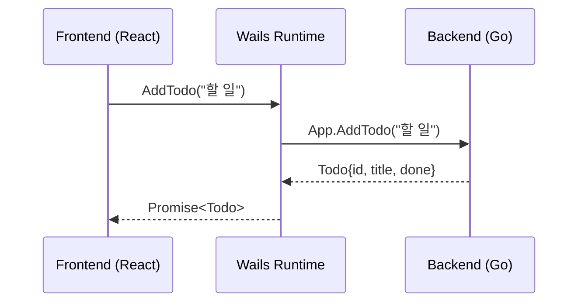

Go로 웹 서버나 CLI 도구를 만드는 것은 익숙하지만, **데스크톱 앱**은 어떨까? [Wails](https://wails.io/)는 Go 백엔드와 웹 프론트엔드(React, Vue, Svelte 등)를 결합하여 크로스 플랫폼 데스크톱 애플리케이션을 만들 수 있는 프레임워크다.

Electron처럼 Chromium을 번들링하지 않고 **OS의 네이티브 WebView**를 사용하기 때문에, 바이너리 크기가 작고 메모리 사용량이 낮다. Go 개발자가 이미 알고 있는 웹 기술을 활용하면서도 네이티브 수준의 데스크톱 앱을 만들 수 있다는 점이 매력적이다.

이 글에서는 Wails v2로 **Todo 앱**을 만들면서, 프로젝트 생성부터 Go-JavaScript 바인딩, 네이티브 기능 활용, 빌드까지 전체 과정을 다룬다.

> 전체 예제 코드는 [GitHub](https://github.com/kenshin579/tutorials-go/tree/master/desktop/wails-todo)에서 확인할 수 있다.

## 1. 들어가며

### Wails란?

Wails는 Go로 데스크톱 앱을 만들 수 있는 프레임워크다. 핵심 아이디어는 단순하다:

- **백엔드**: Go로 비즈니스 로직 작성
- **프론트엔드**: React, Vue, Svelte 등 웹 기술로 UI 작성
- **바인딩**: Go 메서드를 JavaScript에서 직접 호출

Go 코드와 웹 프론트엔드가 하나의 **단일 바이너리**로 컴파일되며, 프론트엔드 에셋은 `go:embed`로 바이너리에 포함된다.

### Electron, Tauri와의 비교

데스크톱 앱 프레임워크를 선택할 때 Wails, Electron, Tauri를 자주 비교하게 된다.

| 항목 | Wails | Electron | Tauri |
|---|---|---|---|
| 백엔드 언어 | Go | Node.js | Rust |
| 렌더링 | OS WebView | Chromium 내장 | OS WebView |
| 바이너리 크기 | ~10MB | ~150MB+ | ~5MB |
| 메모리 사용량 | 낮음 | 높음 (100-200MB) | 낮음 |
| 학습 곡선 | 낮음 (Go + Web) | 낮음 (JS) | 높음 (Rust) |
| 생태계 | 작음 | 매우 큼 | 보통 |

Electron은 Chromium을 통째로 포함하므로 바이너리 크기와 메모리 사용량이 크다. Tauri는 Rust 기반으로 바이너리가 가장 작지만, Rust 학습 곡선이 높다. Wails는 Go를 이미 쓰고 있다면 가장 진입장벽이 낮은 선택이다.

### Wails v2 vs v3

현재 Wails는 **v2(안정 버전)**와 **v3(Alpha)** 두 가지 버전이 존재한다.

| 항목 | v2 (안정) | v3 (Alpha) |
|---|---|---|
| 상태 | 프로덕션 사용 가능 | 개발 중 |
| 멀티 윈도우 | 미지원 | 지원 |
| 시스템 트레이 | 미지원 | 지원 |
| 프론트엔드 | React, Vue, Svelte 등 | 동일 + 개선 |

이 글에서는 **v2**를 사용한다. v3는 아직 API가 변경될 수 있어 안정성이 필요한 경우 v2를 권장한다.

## 2. 환경 설정

### 사전 요구사항

Wails를 사용하려면 다음이 필요하다:

- **Go** 1.20 이상
- **Node.js** 15 이상 + npm
- **플랫폼별 의존성**:
  - macOS: Xcode Command Line Tools
  - Linux: `gtk3`, `webkit2gtk` 패키지
  - Windows: WebView2 Runtime (Windows 11은 기본 포함)

### Wails CLI 설치

```bash
go install github.com/wailsapp/wails/v2/cmd/wails@latest
```

설치 후 `wails doctor`로 환경을 점검한다:

```bash
$ wails doctor

# System
┌──────────────────────────────────────────────────────────────────┐
| OS           | Darwin                                           |
| Version      | 15.5.0                                           |
| ID           | macOS Sequoia                                    |
| Go Version   | go1.24.0                                         |
| Platform     | darwin                                           |
| Architecture | arm64                                            |
├──────────────────────────────────────────────────────────────────┤
| Wails CLI    | v2.11.0                                          |
└──────────────────────────────────────────────────────────────────┘
# Dependencies
┌──────────────────────────────────────────────────────────────────┐
| Dependency | Package Name | Status    | Version                 |
| Xcode CLI  | N/A          | Installed | 2508                    |
| npm        | N/A          | Installed | 11.4.1                  |
| node       | N/A          | Installed | 24.1.0                  |
└──────────────────────────────────────────────────────────────────┘
```

### 프로젝트 생성

`wails init` 명령으로 새 프로젝트를 생성한다. `-t` 옵션으로 프론트엔드 템플릿을 지정할 수 있다.

```bash
wails init -n wails-todo -t react-ts
```

사용 가능한 템플릿: `react`, `react-ts`, `vue`, `vue-ts`, `svelte`, `svelte-ts`, `vanilla` 등

생성된 프로젝트를 바로 실행해 볼 수 있다:

```bash
cd wails-todo
wails dev
```

`wails dev`는 프론트엔드 HMR(Hot Module Replacement)과 Go 자동 재빌드를 동시에 지원하는 개발 모드다.

## 3. 프로젝트 구조

### 디렉토리 레이아웃

이 글의 Todo 앱은 다음과 같은 구조를 갖는다:

```
wails-todo/
├── build/                  # 빌드 설정 (아이콘, 앱 정보)
│   ├── appicon.png
│   └── darwin/             # macOS 전용 설정
├── backend/                # Go 백엔드 로직
│   ├── app.go              # App 구조체, Wails 바인딩 메서드
│   ├── todo.go             # Todo 구조체, JSON 파일 저장
│   └── menu.go             # 시스템 메뉴 설정
├── frontend/               # 웹 프론트엔드 (React + TypeScript)
│   ├── src/
│   │   ├── App.tsx         # 메인 컴포넌트
│   │   ├── components/     # UI 컴포넌트
│   │   └── App.css         # 스타일
│   ├── index.html
│   ├── package.json
│   └── wailsjs/            # 자동 생성된 Go 바인딩
│       ├── go/backend/     # Go 메서드 호출용 JS/TS
│       └── runtime/        # Wails 런타임 API
├── main.go                 # 앱 진입점
├── wails.json              # Wails 프로젝트 설정
└── go.mod
```

### go:embed로 프론트엔드 임베드

Wails의 핵심 메커니즘 중 하나는 `go:embed`를 활용한 프론트엔드 에셋 임베딩이다. `main.go`에서 다음과 같이 선언한다:

```go
//go:embed all:frontend/dist
var assets embed.FS
```

빌드 시 `frontend/dist/`에 생성된 프론트엔드 빌드 결과물이 Go 바이너리에 포함된다. 따라서 배포할 때 별도의 정적 파일이 필요 없이 **단일 실행 파일**로 배포할 수 있다.

### wails.json 설정

```json
{
  "$schema": "https://wails.io/schemas/config.v2.json",
  "name": "wails-todo",
  "outputfilename": "wails-todo",
  "frontend:install": "npm install",
  "frontend:build": "npm run build",
  "frontend:dev:watcher": "npm run dev",
  "frontend:dev:serverUrl": "auto",
  "author": {
    "name": "Frank Oh",
    "email": "kenshin579@hotmail.com"
  }
}
```

주요 설정:
- `frontend:install`: 프론트엔드 의존성 설치 명령
- `frontend:build`: 프론트엔드 빌드 명령
- `frontend:dev:watcher`: 개발 모드에서 프론트엔드 dev server 실행 명령
- `frontend:dev:serverUrl`: `auto`로 설정하면 Wails가 dev server URL을 자동 감지

## 4. Go-JavaScript 바인딩

Wails의 핵심 기능은 **Go 메서드를 JavaScript에서 직접 호출**할 수 있다는 점이다.

### 동작 원리



1. `main.go`의 `Bind` 옵션에 Go 구조체를 등록한다
2. Wails가 해당 구조체의 **public 메서드**를 분석하여 `frontend/wailsjs/go/` 에 JS/TS 바인딩을 자동 생성한다
3. 프론트엔드에서 생성된 함수를 import하여 Go 메서드를 호출한다

### 백엔드 메서드 정의

Go에서 바인딩할 메서드를 정의한다. public 메서드(대문자로 시작)만 프론트엔드에 노출된다.

```go
// backend/app.go
type App struct {
    ctx   context.Context
    store *TodoStore
}

func (a *App) GetTodos() []Todo {
    return a.store.Todos
}

func (a *App) AddTodo(title string) Todo {
    todo := Todo{
        ID:        fmt.Sprintf("%d", time.Now().UnixNano()),
        Title:     title,
        Done:      false,
        CreatedAt: time.Now(),
    }
    a.store.Todos = append(a.store.Todos, todo)
    a.store.Save()
    return todo
}
```

### 프론트엔드에서 호출

자동 생성된 바인딩을 import하여 호출한다. 모든 바인딩 함수는 **Promise를 반환**한다.

```tsx
// 자동 생성된 바인딩 import
import { GetTodos, AddTodo, ToggleTodo, DeleteTodo } from "../wailsjs/go/backend/App";

// Go 메서드 호출 (async/await)
const handleAdd = async (title: string) => {
    await AddTodo(title);
    loadTodos();
};
```

### 이벤트 시스템

Go에서 프론트엔드로 이벤트를 보내거나, 프론트엔드에서 이벤트를 수신할 수 있다.

**Go → JavaScript 이벤트 발행:**

```go
// Go에서 이벤트 발행
runtime.EventsEmit(a.ctx, "todos:reload")
```

**JavaScript에서 이벤트 수신:**

```tsx
import { EventsOn } from "../wailsjs/runtime/runtime";

useEffect(() => {
    // Go에서 보낸 이벤트 수신
    EventsOn("todos:reload", loadTodos);
}, []);
```

이벤트 시스템은 바인딩 호출로는 처리하기 어려운 **단방향 알림**(예: 메뉴에서 파일을 불러온 후 UI 갱신)에 유용하다.

## 5. 실전 예제: Todo 앱

### 백엔드 구현 (Go)

#### Todo 구조체와 저장소

Todo 데이터를 JSON 파일로 저장하고 로드하는 `TodoStore`를 구현한다.

```go
// backend/todo.go
type Todo struct {
    ID        string    `json:"id"`
    Title     string    `json:"title"`
    Done      bool      `json:"done"`
    CreatedAt time.Time `json:"createdAt"`
}

type TodoStore struct {
    filePath string
    Todos    []Todo `json:"todos"`
}

func NewTodoStore(filePath string) *TodoStore {
    store := &TodoStore{filePath: filePath}
    store.Load()
    return store
}

func (s *TodoStore) Load() {
    data, err := os.ReadFile(s.filePath)
    if err != nil {
        s.Todos = []Todo{}
        return
    }
    if err := json.Unmarshal(data, &s.Todos); err != nil {
        s.Todos = []Todo{}
    }
}

func (s *TodoStore) Save() error {
    data, err := json.MarshalIndent(s.Todos, "", "  ")
    if err != nil {
        return err
    }
    return os.WriteFile(s.filePath, data, 0644)
}
```

#### CRUD 메서드

`App` 구조체에 CRUD 메서드를 구현한다. 이 메서드들이 Wails 바인딩을 통해 프론트엔드에 노출된다.

```go
// backend/app.go
type App struct {
    ctx   context.Context
    store *TodoStore
}

func NewApp() *App {
    return &App{}
}

func (a *App) Startup(ctx context.Context) {
    a.ctx = ctx
    a.store = NewTodoStore("todos.json")
}

func (a *App) GetTodos() []Todo {
    return a.store.Todos
}

func (a *App) AddTodo(title string) Todo {
    todo := Todo{
        ID:        fmt.Sprintf("%d", time.Now().UnixNano()),
        Title:     title,
        Done:      false,
        CreatedAt: time.Now(),
    }
    a.store.Todos = append(a.store.Todos, todo)
    a.store.Save()
    return todo
}

func (a *App) ToggleTodo(id string) []Todo {
    for i, t := range a.store.Todos {
        if t.ID == id {
            a.store.Todos[i].Done = !a.store.Todos[i].Done
            break
        }
    }
    a.store.Save()
    return a.store.Todos
}

func (a *App) DeleteTodo(id string) []Todo {
    for i, t := range a.store.Todos {
        if t.ID == id {
            result, err := runtime.MessageDialog(a.ctx, runtime.MessageDialogOptions{
                Type:          runtime.QuestionDialog,
                Title:         "삭제 확인",
                Message:       fmt.Sprintf("'%s'을(를) 삭제하시겠습니까?", t.Title),
                DefaultButton: "No",
            })
            if err == nil && result == "Yes" {
                a.store.Todos = append(a.store.Todos[:i], a.store.Todos[i+1:]...)
                a.store.Save()
            }
            break
        }
    }
    return a.store.Todos
}
```

`DeleteTodo`에서 `runtime.MessageDialog`를 사용하여 삭제 전 **확인 다이얼로그**를 표시하는 것이 포인트다. 이처럼 Go 코드에서 네이티브 다이얼로그를 직접 호출할 수 있다.

### 프론트엔드 구현 (React + TypeScript)

#### App.tsx

메인 컴포넌트에서 Go 바인딩을 호출하여 Todo CRUD를 처리한다.

```tsx
// frontend/src/App.tsx
import { useState, useEffect } from "react";
import { GetTodos, AddTodo, ToggleTodo, DeleteTodo } from "../wailsjs/go/backend/App";
import { EventsOn } from "../wailsjs/runtime/runtime";
import TodoInput from "./components/TodoInput";
import TodoList from "./components/TodoList";

interface Todo {
    id: string;
    title: string;
    done: boolean;
    createdAt: string;
}

function App() {
    const [todos, setTodos] = useState<Todo[]>([]);

    const loadTodos = async () => {
        const result = await GetTodos();
        setTodos(result || []);
    };

    useEffect(() => {
        loadTodos();
        EventsOn("todos:reload", loadTodos);
    }, []);

    const handleAdd = async (title: string) => {
        await AddTodo(title);
        loadTodos();
    };

    const handleToggle = async (id: string) => {
        const updated = await ToggleTodo(id);
        setTodos(updated || []);
    };

    const handleDelete = async (id: string) => {
        const updated = await DeleteTodo(id);
        setTodos(updated || []);
    };

    const doneCount = todos.filter((t) => t.done).length;

    return (
        <div id="App">
            <h1>Wails Todo</h1>
            <p className="status">
                {todos.length}개 중 {doneCount}개 완료
            </p>
            <TodoInput onAdd={handleAdd} />
            <TodoList todos={todos} onToggle={handleToggle} onDelete={handleDelete} />
        </div>
    );
}

export default App;
```

#### TodoInput.tsx

할 일 입력 컴포넌트다. Enter 키 또는 버튼 클릭으로 추가한다.

```tsx
// frontend/src/components/TodoInput.tsx
import { useState } from "react";

interface TodoInputProps {
    onAdd: (title: string) => void;
}

function TodoInput({ onAdd }: TodoInputProps) {
    const [title, setTitle] = useState("");

    const handleSubmit = (e: React.FormEvent) => {
        e.preventDefault();
        if (title.trim()) {
            onAdd(title.trim());
            setTitle("");
        }
    };

    return (
        <form className="todo-input" onSubmit={handleSubmit}>
            <input
                type="text"
                value={title}
                onChange={(e) => setTitle(e.target.value)}
                placeholder="할 일을 입력하세요..."
                autoFocus
            />
            <button type="submit">추가</button>
        </form>
    );
}

export default TodoInput;
```

#### TodoItem.tsx

개별 Todo 항목 컴포넌트다. 체크박스, 제목, 삭제 버튼으로 구성된다.

```tsx
// frontend/src/components/TodoItem.tsx
interface Todo {
    id: string;
    title: string;
    done: boolean;
    createdAt: string;
}

interface TodoItemProps {
    todo: Todo;
    onToggle: (id: string) => void;
    onDelete: (id: string) => void;
}

function TodoItem({ todo, onToggle, onDelete }: TodoItemProps) {
    return (
        <div className={`todo-item ${todo.done ? "done" : ""}`}>
            <input
                type="checkbox"
                checked={todo.done}
                onChange={() => onToggle(todo.id)}
            />
            <span className="todo-title">{todo.title}</span>
            <button className="delete-btn" onClick={() => onDelete(todo.id)}>
                X
            </button>
        </div>
    );
}

export default TodoItem;
```

### 앱 진입점

`main.go`에서 Wails 앱을 설정하고 실행한다.

```go
// main.go
package main

import (
    "embed"

    "wails-todo/backend"

    "github.com/wailsapp/wails/v2"
    "github.com/wailsapp/wails/v2/pkg/options"
    "github.com/wailsapp/wails/v2/pkg/options/assetserver"
)

//go:embed all:frontend/dist
var assets embed.FS

func main() {
    app := backend.NewApp()

    err := wails.Run(&options.App{
        Title:  "Wails Todo",
        Width:  800,
        Height: 600,
        AssetServer: &assetserver.Options{
            Assets: assets,
        },
        BackgroundColour: &options.RGBA{R: 27, G: 38, B: 54, A: 1},
        OnStartup:        app.Startup,
        Menu:              app.CreateMenu(),
        Bind: []interface{}{
            app,
        },
    })
    if err != nil {
        println("Error:", err.Error())
    }
}
```

주요 옵션:
- `Title`, `Width`, `Height`: 윈도우 제목과 크기
- `AssetServer`: 프론트엔드 에셋 (go:embed된 파일)
- `OnStartup`: 앱 시작 시 호출되는 콜백 (context 전달)
- `Menu`: 시스템 메뉴 설정
- `Bind`: 프론트엔드에 노출할 Go 구조체 목록

### 개발 모드와 핫 리로드

```bash
wails dev
```

`wails dev`는 다음 두 가지를 동시에 실행한다:
- **프론트엔드**: Vite dev server (HMR 지원)
- **백엔드**: Go 소스 변경 감지 시 자동 재빌드

프론트엔드 코드를 수정하면 브라우저 새로고침 없이 즉시 반영되고, Go 코드를 수정하면 앱이 자동으로 재시작된다.

## 6. 네이티브 기능 활용

Wails는 `runtime` 패키지를 통해 다양한 네이티브 기능을 제공한다.

### 파일 다이얼로그

OS의 네이티브 파일 다이얼로그를 사용하여 파일을 열거나 저장할 수 있다.

```go
// backend/app.go

// 내보내기: 저장 다이얼로그
func (a *App) ExportTodos() error {
    path, err := runtime.SaveFileDialog(a.ctx, runtime.SaveDialogOptions{
        Title:           "Todo 목록 내보내기",
        DefaultFilename: "todos.json",
        Filters: []runtime.FileFilter{
            {DisplayName: "JSON Files", Pattern: "*.json"},
        },
    })
    if err != nil || path == "" {
        return err
    }
    return a.store.ExportToFile(path)
}

// 불러오기: 열기 다이얼로그
func (a *App) ImportTodos() ([]Todo, error) {
    path, err := runtime.OpenFileDialog(a.ctx, runtime.OpenDialogOptions{
        Title: "Todo 목록 불러오기",
        Filters: []runtime.FileFilter{
            {DisplayName: "JSON Files", Pattern: "*.json"},
        },
    })
    if err != nil || path == "" {
        return a.store.Todos, err
    }
    if err := a.store.LoadFromFile(path); err != nil {
        return a.store.Todos, err
    }
    return a.store.Todos, nil
}
```

`SaveDialogOptions`와 `OpenDialogOptions`로 제목, 기본 파일명, 파일 필터 등을 설정할 수 있다.

### 시스템 메뉴

앱 상단에 표시되는 시스템 메뉴를 Go 코드로 정의한다.

```go
// backend/menu.go
func (a *App) CreateMenu() *menu.Menu {
    appMenu := menu.NewMenu()

    fileMenu := appMenu.AddSubmenu("파일")
    fileMenu.AddText("불러오기...", keys.CmdOrCtrl("o"), func(_ *menu.CallbackData) {
        a.ImportTodos()
        runtime.EventsEmit(a.ctx, "todos:reload")
    })
    fileMenu.AddText("내보내기...", keys.CmdOrCtrl("s"), func(_ *menu.CallbackData) {
        a.ExportTodos()
    })
    fileMenu.AddSeparator()
    fileMenu.AddText("종료", keys.CmdOrCtrl("q"), func(_ *menu.CallbackData) {
        runtime.Quit(a.ctx)
    })

    return appMenu
}
```

- `keys.CmdOrCtrl("o")`: macOS에서는 Cmd+O, Windows/Linux에서는 Ctrl+O
- `AddSeparator()`: 메뉴 항목 사이 구분선
- 불러오기 후 `EventsEmit`으로 프론트엔드에 리로드 이벤트를 발행한다

### 다이얼로그

`runtime.MessageDialog`로 네이티브 다이얼로그를 표시할 수 있다.

```go
result, err := runtime.MessageDialog(a.ctx, runtime.MessageDialogOptions{
    Type:          runtime.QuestionDialog,
    Title:         "삭제 확인",
    Message:       fmt.Sprintf("'%s'을(를) 삭제하시겠습니까?", t.Title),
    DefaultButton: "No",
})
if err == nil && result == "Yes" {
    // 삭제 처리
}
```

다이얼로그 종류:
- `runtime.InfoDialog`: 정보 알림
- `runtime.WarningDialog`: 경고
- `runtime.ErrorDialog`: 에러
- `runtime.QuestionDialog`: 예/아니오 확인

### 윈도우 제어

`runtime` 패키지로 윈도우 속성을 동적으로 제어할 수 있다.

```go
// 윈도우 제목 변경
runtime.WindowSetTitle(a.ctx, "새 제목")

// 윈도우 크기 변경
runtime.WindowSetSize(a.ctx, 1024, 768)

// 윈도우 최소화/최대화
runtime.WindowMinimise(a.ctx)
runtime.WindowMaximise(a.ctx)

// 전체 화면
runtime.WindowFullscreen(a.ctx)
```

## 7. 빌드 및 배포

### 프로덕션 빌드

```bash
wails build
```

빌드가 완료되면 `build/bin/` 디렉토리에 실행 파일이 생성된다:
- **macOS**: `wails-todo.app` (앱 번들)
- **Windows**: `wails-todo.exe`
- **Linux**: `wails-todo` (바이너리)

```bash
$ ls -lh build/bin/wails-todo.app
total 15256
-rwxr-xr-x  1 user  staff   7.5M  ...  wails-todo
```

실제 바이너리 크기는 약 **7.5MB**로, Electron 앱(~150MB+)에 비해 매우 작다.

### 플랫폼별 빌드

Wails는 기본적으로 현재 OS용으로 빌드한다. 크로스 컴파일이 필요한 경우:

```bash
# macOS에서 Windows용 빌드
GOOS=windows wails build

# 디버그 빌드 (개발자 도구 활성화)
wails build -debug
```

단, 크로스 컴파일 시 대상 플랫폼의 C 컴파일러가 필요할 수 있다. macOS에서 Windows 빌드 시 `mingw-w64`가 필요하다.

### 바이너리 크기 최적화

```bash
# UPX 압축 (선택)
wails build -upx

# 빌드 플래그로 디버그 정보 제거
wails build -ldflags "-s -w"
```

## 8. 마무리

이 글에서는 Wails v2를 사용하여 Go + React 기반 Todo 데스크톱 앱을 만드는 과정을 살펴보았다. 정리하면:

| 항목 | 내용 |
|---|---|
| Go-JS 바인딩 | Go public 메서드 → JS Promise 함수로 자동 변환 |
| 이벤트 시스템 | `EventsEmit` / `EventsOn`으로 양방향 통신 |
| 네이티브 기능 | 파일 다이얼로그, 시스템 메뉴, 확인 다이얼로그 |
| 에셋 임베딩 | `go:embed`로 프론트엔드를 단일 바이너리에 포함 |
| 바이너리 크기 | ~7.5MB (Electron 대비 1/20) |
| 개발 경험 | `wails dev`로 HMR + Go 자동 재빌드 |

Wails는 Go 개발자가 웹 기술을 활용하여 가볍고 빠른 데스크톱 앱을 만들 수 있는 좋은 선택지다. Electron의 무거운 바이너리가 부담스럽고, Rust를 새로 배우기 부담스럽다면 Wails를 고려해 볼 만하다.

## 참고

- [Wails 공식 문서](https://wails.io/ko/docs/introduction)
- [Wails v2 API Reference](https://wails.io/ko/docs/reference/runtime/intro)
- [Wails GitHub](https://github.com/wailsapp/wails)
- [Go embed 패키지](https://pkg.go.dev/embed)
- [전체 예제 코드 - GitHub](https://github.com/kenshin579/tutorials-go/tree/master/desktop/wails-todo)
