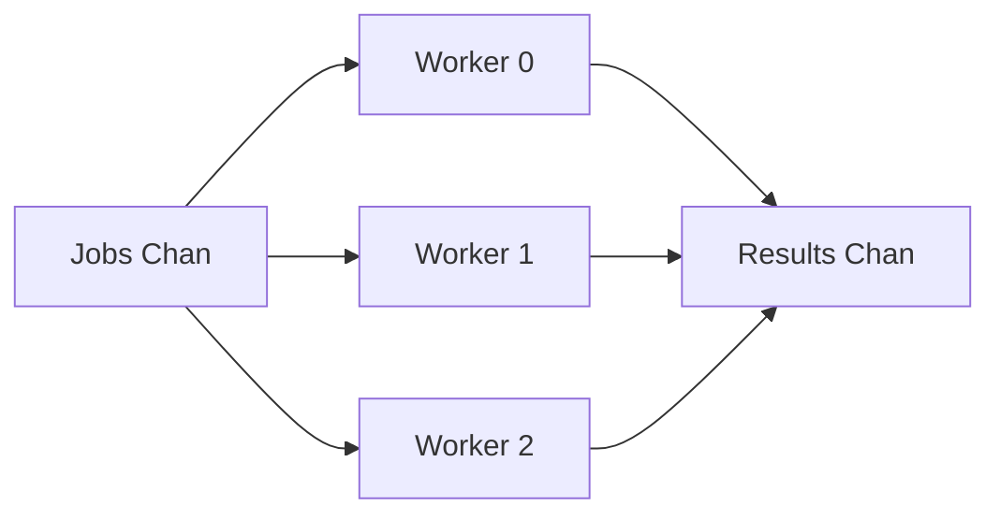
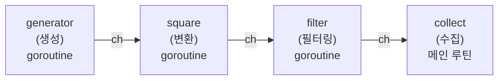
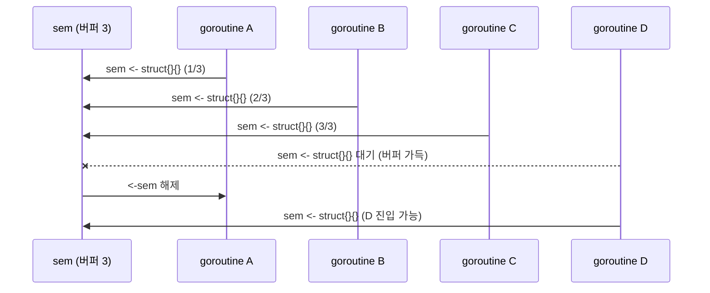
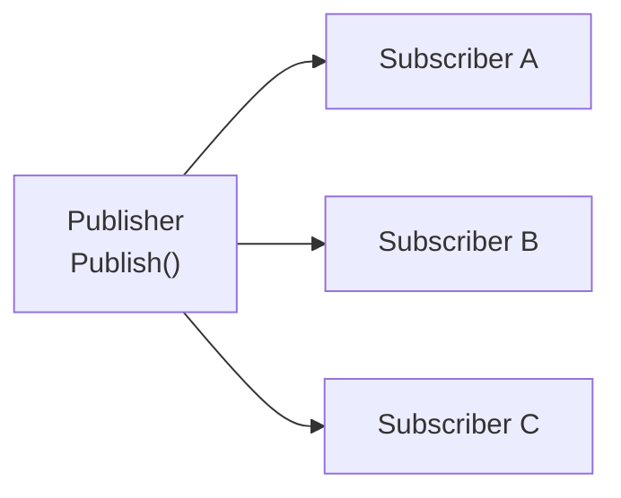

이전 편까지 goroutine, channel, select, sync, context 등 Go 동시성의 기본 도구를 다뤘다. 이번 편에서는 이 도구들을 **조합**하여 실무에서 반복적으로 등장하는 동시성 패턴을 구현한다. 각 패턴이 어떤 문제를 해결하는지, 그리고 언제 사용해야 하는지를 예제와 함께 살펴보자.

> 이 글의 전체 예제 코드는 GitHub에서 확인할 수 있다.
> [https://github.com/kenshin579/tutorials-go/tree/master/golang/concurrency/patterns](https://github.com/kenshin579/tutorials-go/tree/master/golang/concurrency/patterns)

# 1. 개요 - 동시성 패턴이 중요한 이유


Go의 goroutine과 channel은 강력하지만, 잘못 사용하면 goroutine 누수, deadlock, race condition 같은 문제가 발생한다. 동시성 패턴은 이런 문제를 **반복 검증된 구조**로 해결한다.

실무에서 자주 마주치는 상황을 생각해보자.

- 수천 개의 HTTP 요청을 동시에 보내야 하지만 서버를 과부하시키면 안 된다 → **Worker Pool**
- 데이터를 단계별로 변환하되, 각 단계가 독립적으로 동작해야 한다 → **Pipeline**
- 동시에 열 수 있는 DB 커넥션 수를 제한해야 한다 → **Semaphore**
- 외부 API 호출을 초당 N회로 제한해야 한다 → **Rate Limiting**
- 이벤트를 여러 구독자에게 동시에 전달해야 한다 → **Pub/Sub**

# 2. Worker Pool 패턴

Worker Pool은 **고정된 수의 goroutine(worker)** 이 공유 작업 큐에서 job을 꺼내 처리하는 패턴이다. goroutine을 무제한으로 생성하는 대신, 제한된 수의 worker가 작업을 분배받아 처리한다.



## 2.1 Job/Result 구조체 기반 Worker Pool

가장 전형적인 형태다. `Job`과 `Result` 구조체를 정의하고, channel을 통해 주고받는다.

```go
func TestWorkerPool(t *testing.T) {
	type Job struct {
		ID    int
		Input int
	}
	type Result struct {
		JobID  int
		Output int
	}

	const numWorkers = 3
	const numJobs = 10

	// buffered channel: producer가 worker 속도에 묶이지 않고 미리 작업을 쌓아둘 수 있다
	jobs := make(chan Job, numJobs)
	results := make(chan Result, numJobs)

	// 실제 작업 단위. 예제라서 제곱 연산이지만, 실무에선 이 함수 안에
	// HTTP 요청 / 이미지 리사이징 / 로그 파싱 같은 진짜 처리 로직이 들어간다.
	process := func(input int) int {
		return input * input
	}

	var wg sync.WaitGroup
	for w := range numWorkers {
		wg.Add(1)
		go func() {
			defer wg.Done()
			// jobs가 비면 블로킹 대기, close되면 자연스럽게 루프 종료
			for job := range jobs {
				results <- Result{
					JobID:  job.ID,
					Output: process(job.Input), // ← Output은 "작업 함수가 만들어내는 값"
				}
				t.Logf("worker %d processed job %d", w, job.ID)
			}
		}()
	}

	for i := range numJobs {
		jobs <- Job{ID: i, Input: i + 1}
	}
	// 종료 신호: close하지 않으면 worker들이 빈 channel에서 영원히 대기 → goroutine leak
	close(jobs)

	// results close는 별도 goroutine에서: 메인에서 wg.Wait()을 직접 부르면
	// 결과 수집 루프가 멈춰있어 deadlock 발생 (아래 본문 참고)
	go func() {
		wg.Wait()
		close(results)
	}()

	var collected []Result
	for r := range results {
		collected = append(collected, r)
	}

	assert.Len(t, collected, numJobs)
}
```

이 예제의 핵심 흐름을 단계별로 살펴보자.

1. **Worker 미리 생성**: `numWorkers(3)`개의 goroutine을 먼저 띄워둔다. 각 worker는 `for job := range jobs`로 대기 상태에 진입한다.
2. **Job 투입**: 메인 goroutine이 `jobs` channel에 작업 10개를 넣는다. buffered channel(크기 10)이라 한 번에 다 넣어도 블로킹되지 않는다.
3. **Worker 처리**: jobs에 값이 들어오는 즉시 대기 중이던 worker가 깨어나 `process(job.Input)`로 처리한다. 여기서 `process`가 **실제 일하는 함수**다. 예제는 제곱 연산이지만, 실무에선 이 함수를 `fetch(url)`, `resize(path)`처럼 교체하면 channel·WaitGroup 골격은 그대로 두고도 worker pool을 그대로 재사용할 수 있다. 3개 worker가 경쟁적으로 꺼내 가므로 어느 worker가 어떤 job을 처리할지는 비결정적이다.
4. **`close(jobs)`로 종료 신호**: 모든 job을 투입한 후 channel을 close한다. 이후 worker들의 `range`가 자연스럽게 종료된다.
5. **`results` close는 별도 goroutine에서**: `wg.Wait()`은 모든 worker가 끝나기를 기다려야 하는데, 메인 goroutine이 결과를 수집하는 중이므로 별도 goroutine에서 처리한다.

**주의: 왜 `results` close를 별도 goroutine에서 해야 할까?**

만약 메인 goroutine에서 `wg.Wait()` → `close(results)` → `for r := range results` 순서로 호출하면 **deadlock**이 발생한다.

- `wg.Wait()`은 worker들이 끝나기를 기다린다.
- worker들은 `results <- Result{...}`로 결과를 보내야 끝난다.
- 그런데 results 버퍼가 가득 차면 worker가 블로킹된다.
- 메인 goroutine은 아직 결과를 받지 않고 있으므로(`wg.Wait()`에 멈춰 있음) 영원히 멈춘다.

별도 goroutine으로 `wg.Wait()`을 분리하면, 메인은 즉시 수집 루프로 진입하여 worker의 송신을 받아주고, 모두 끝나면 close가 호출되어 수집 루프도 종료된다.

**buffered vs unbuffered channel 선택 기준**

| 종류 | 동작 | 이 예제에서의 효과 |
|------|------|------------------|
| `make(chan Job)` (unbuffered) | sender와 receiver가 동시에 만나야 진행 | producer가 worker 속도에 묶임 (rendezvous) |
| `make(chan Job, N)` (buffered) | 버퍼가 빌 때까지 sender 블로킹 안 함 | producer가 미리 작업을 쌓아두고 끝날 수 있음 |

## 2.2 Worker Pool 활용 사례

| 사례 | Job | Result |
|------|-----|--------|
| 대량 HTTP 요청 | URL | HTTP Response |
| 이미지 리사이징 | 원본 경로 | 변환 결과 |
| 로그 파싱 | 로그 라인 | 파싱된 구조체 |
| 파일 처리 | 파일 경로 | 처리 상태 |

# 3. Pipeline 패턴

Pipeline은 데이터를 **여러 단계(stage)** 를 통해 순차적으로 변환하는 패턴이다. 각 stage는 독립된 goroutine으로 동작하며, channel로 연결된다. Unix의 파이프(`|`)와 같은 개념이다.



## 3.1 generator - 값을 생성하는 첫 번째 stage

```go
func generator(nums ...int) <-chan int {
	out := make(chan int)
	go func() {
		defer close(out) // 입력을 모두 보낸 후 자동 close → 다음 stage에 종료 신호 전파
		for _, n := range nums {
			out <- n
		}
	}()
	return out // 반환 타입 <-chan int (수신 전용): 호출자가 실수로 송신하는 것 방지
}
```

`generator`는 입력값을 channel로 내보내는 **소스(source)** 역할을 한다. 반환 타입이 `<-chan int`(수신 전용 channel)인 점에 주목하자. 호출자가 실수로 channel에 값을 보내는 것을 방지한다.

## 3.2 square - 값을 변환하는 중간 stage

```go
func square(in <-chan int) <-chan int {
	out := make(chan int)
	go func() {
		defer close(out) // 입력 close → range 종료 → 본인도 close → 다음 stage로 전파
		for n := range in {
			out <- n * n
		}
	}()
	return out
}
```

입력 channel에서 값을 읽어 변환한 뒤 출력 channel로 보낸다. **입력 channel이 close되면 `range` 루프가 자동 종료**되어, 이전 stage의 종료가 다음 stage로 전파된다.

## 3.3 filter - 조건부 통과 stage

```go
func filter(in <-chan int, predicate func(int) bool) <-chan int {
	out := make(chan int)
	go func() {
		defer close(out)
		for n := range in {
			if predicate(n) {
				out <- n
			}
		}
	}()
	return out
}
```

## 3.4 collect - 결과를 수집하는 마지막 stage

```go
func collect(in <-chan int) []int {
	var result []int
	for v := range in {
		result = append(result, v)
	}
	return result
}
```

## 3.5 Pipeline 조합

이제 각 stage를 조합하여 파이프라인을 구성한다.

```go
// 기본 파이프라인: generator → square → collect
func TestPipeline(t *testing.T) {
	result := collect(square(generator(1, 2, 3, 4, 5)))
	assert.Equal(t, []int{1, 4, 9, 16, 25}, result)
}

// 필터 추가: generator → square → filter → collect
func TestPipelineWithFilter(t *testing.T) {
	result := collect(
		filter(
			square(generator(1, 2, 3, 4, 5)),
			func(n int) bool { return n >= 10 },
		),
	)
	assert.Equal(t, []int{16, 25}, result)
}
```

Pipeline 패턴의 핵심 장점은 다음과 같다.

- **각 stage가 독립 goroutine**: 데이터가 흐르는 동안 모든 stage가 동시에 동작한다
- **조합 가능**: stage를 레고 블록처럼 자유롭게 연결할 수 있다
- **종료 전파**: 앞 stage가 channel을 close하면 뒷 stage도 자연스럽게 종료된다

# 4. Semaphore 패턴

Semaphore는 **동시에 실행할 수 있는 goroutine 수를 제한**하는 패턴이다. Go에서는 **buffered channel**을 세마포어로 활용할 수 있다.



```go
func TestSemaphore(t *testing.T) {
	const maxConcurrency = 3
	// struct{}는 메모리 0바이트 → 값 자체는 의미 없고 슬롯 개수만 의미를 가짐
	sem := make(chan struct{}, maxConcurrency)

	var maxConcurrent atomic.Int64
	var currentConcurrent atomic.Int64
	var wg sync.WaitGroup

	for range 10 {
		wg.Add(1)
		go func() {
			defer wg.Done()

			sem <- struct{}{}        // 세마포어 획득: 버퍼가 가득 차면 여기서 블로킹
			defer func() { <-sem }() // 세마포어 해제: 슬롯 반환 → 대기 중인 goroutine 진입 가능

			// CAS 루프로 lock 없이 maxConcurrent의 최댓값 갱신
			cur := currentConcurrent.Add(1)
			for {
				old := maxConcurrent.Load()
				if cur <= old || maxConcurrent.CompareAndSwap(old, cur) {
					break
				}
			}

			time.Sleep(20 * time.Millisecond) // 작업 시뮬레이션
			currentConcurrent.Add(-1)
		}()
	}

	wg.Wait()

	t.Logf("최대 동시 실행 수: %d", maxConcurrent.Load())
	assert.LessOrEqual(t, maxConcurrent.Load(), int64(maxConcurrency))
}
```

동작 원리를 단계별로 살펴보자.

1. `sem <- struct{}{}`: buffered channel에 빈 구조체를 보낸다. 버퍼가 가득 차면 **블로킹**된다.
2. 작업을 수행한다.
3. `<-sem`: channel에서 값을 꺼내 슬롯을 반환한다. 대기 중인 goroutine이 진입할 수 있게 된다.

테스트에서는 `atomic.Int64`로 동시 실행 수를 추적하여, 실제로 `maxConcurrency`를 초과하지 않음을 검증한다. `CompareAndSwap`(CAS)은 lock 없이 최댓값을 안전하게 갱신하는 기법이다.

## 4.1 Semaphore vs Worker Pool

두 패턴은 모두 동시성을 제한하지만 접근 방식이 다르다.

| 비교 | Worker Pool | Semaphore |
|------|-------------|-----------|
| goroutine 수 | 고정 (미리 생성) | 유동적 (필요 시 생성) |
| 작업 분배 | channel 기반 큐 | 각 goroutine이 독립 실행 |
| 적합한 상황 | 동종 작업의 대량 처리 | 다양한 작업의 동시성 제한 |

# 5. Rate Limiting

Rate Limiting은 **시간 기반으로 처리량을 제한**하는 패턴이다. 외부 API 호출, 네트워크 요청 등에서 서버 과부하를 방지하는 데 필수적이다.

## 5.1 time.Ticker 기반 Rate Limiter

`time.Ticker`는 일정 간격으로 값을 보내는 channel이다. 작업 전에 tick을 기다리면 자연스럽게 속도가 제한된다.

```mermaid
gantt
    title Rate Limiting (20ms 간격)
    dateFormat X
    axisFormat %L ms
    section 작업
        작업 0 : 0, 1
        작업 1 : 20, 21
        작업 2 : 40, 41
        작업 3 : 60, 61
        작업 4 : 80, 81
```



```go
func TestRateLimitWithTicker(t *testing.T) {
	rate := time.NewTicker(20 * time.Millisecond) // 50 req/sec
	defer rate.Stop()                             // 내부 goroutine leak 방지

	start := time.Now()
	for i := range 5 {
		<-rate.C // tick을 기다림: 각 작업 사이 최소 20ms 간격 보장
		_ = i    // 작업 수행
	}

	elapsed := time.Since(start)
	t.Logf("5개 작업 소요 시간: %v", elapsed)
	assert.GreaterOrEqual(t, elapsed, 80*time.Millisecond) // 최소 4 tick 대기
}
```

`<-rate.C`가 작업 실행 전에 호출되므로, 각 작업 사이에 최소 20ms 간격이 보장된다. 5개 작업에 최소 4번의 대기(80ms)가 필요하다.

## 5.2 Burst Rate Limiter

실전에서는 처음 몇 개 요청은 즉시 처리하고, 이후부터 속도를 제한하고 싶은 경우가 많다. 이것이 **Burst Rate Limiting**이다.

```mermaid
gantt
    title Burst Rate Limiting (burst 3 + 20ms 간격)
    dateFormat X
    axisFormat %L ms
    section Burst
        작업 0 : 0, 1
        작업 1 : 0, 1
        작업 2 : 0, 1
    section Rate Limited
        작업 3 : 20, 21
        작업 4 : 40, 41
```



```go
func TestBurstRateLimit(t *testing.T) {
	// 버스트 크기 3, 이후 20ms 간격
	burstLimit := make(chan time.Time, 3)

	// 초기 토큰 채우기: 처음 3개 요청은 대기 없이 즉시 처리됨
	for range 3 {
		burstLimit <- time.Now()
	}

	// 토큰 보충 goroutine: 20ms마다 토큰 1개 추가
	go func() {
		ticker := time.NewTicker(20 * time.Millisecond)
		defer ticker.Stop()
		for t := range ticker.C {
			select {
			case burstLimit <- t:
			default: // 버퍼 가득 시 토큰 버림 → 토큰 무한 누적 방지
			}
		}
	}()

	// 처음 3개는 즉시, 이후는 rate limit 적용
	start := time.Now()
	for range 5 {
		<-burstLimit
	}

	elapsed := time.Since(start)
	t.Logf("5개 작업 (burst 3) 소요 시간: %v", elapsed)
	assert.GreaterOrEqual(t, elapsed, 30*time.Millisecond)
}
```

Burst Rate Limiter의 동작 원리는 다음과 같다.

1. **buffered channel** `burstLimit`을 버스트 크기(3)만큼의 버퍼로 생성한다
2. **초기 토큰 채우기**: 버퍼를 가득 채워 처음 3개 요청이 즉시 처리되도록 한다
3. **토큰 보충**: 별도 goroutine이 20ms마다 토큰을 추가한다. 버퍼가 가득 차면 `default`로 빠져나와 토큰을 버린다
4. **토큰 소비**: `<-burstLimit`으로 토큰을 꺼낸다. 처음 3개는 즉시 사용 가능하고, 이후에는 ticker 속도로 제한된다

이 패턴은 Token Bucket 알고리즘의 Go 구현이다.

# 6. Pub/Sub 패턴

Pub/Sub(Publish/Subscribe)는 **발행자가 메시지를 보내면 모든 구독자가 받는** 1:N 메시지 전달 패턴이다. Go의 제네릭을 활용하면 타입 안전한 Pub/Sub 브로커를 구현할 수 있다.



## 6.1 Generic Broker 구현

```go
type Broker[T any] struct {
	mu          sync.RWMutex      // RWMutex: 다중 Publish는 RLock으로 동시 진행, 구조 변경 시만 Lock
	subscribers map[string]chan T // id → 구독자 channel 맵
}

func NewBroker[T any]() *Broker[T] {
	return &Broker[T]{
		subscribers: make(map[string]chan T),
	}
}
```

`Broker[T any]`는 제네릭 타입 파라미터 `T`를 사용하여 어떤 타입의 메시지든 처리할 수 있다. `sync.RWMutex`로 구독자 맵의 동시 접근을 보호한다.

## 6.2 Subscribe - 구독 등록

```go
func (b *Broker[T]) Subscribe(id string, bufSize int) <-chan T {
	b.mu.Lock() // 맵 변경(쓰기)이므로 Lock 필요
	defer b.mu.Unlock()
	ch := make(chan T, bufSize) // bufSize: 느린 구독자가 메시지를 버퍼링할 양
	b.subscribers[id] = ch
	return ch // 수신 전용 반환: 구독자는 받기만, 직접 송신/close 금지
}
```

구독자마다 **buffered channel**을 생성한다. `bufSize`는 구독자가 느릴 때 메시지를 얼마나 버퍼링할지 결정한다. 반환 타입이 `<-chan T`(수신 전용)이므로 구독자는 메시지를 받기만 할 수 있다.

## 6.3 Publish - 메시지 발행

```go
func (b *Broker[T]) Publish(msg T) {
	b.mu.RLock() // 읽기 잠금: 여러 publisher가 동시 발행 가능
	defer b.mu.RUnlock()
	for _, ch := range b.subscribers {
		select {
		case ch <- msg: // 정상 발행
		default:        // 구독자 channel 가득 시 메시지 드롭 → 느린 구독자가 전체를 멈추지 않게 함
		}
	}
}
```

`Publish`는 `RLock`(읽기 잠금)을 사용한다. 여러 publisher가 동시에 발행할 수 있다. `select`-`default` 패턴으로 구독자의 channel이 가득 찬 경우 블로킹 대신 **메시지를 드롭**한다. 이는 느린 구독자가 전체 시스템을 멈추지 않도록 하는 중요한 설계 결정이다.

## 6.4 Unsubscribe - 구독 해제

```go
func (b *Broker[T]) Unsubscribe(id string) {
	b.mu.Lock()
	defer b.mu.Unlock()
	if ch, ok := b.subscribers[id]; ok {
		close(ch)                  // 구독자에게 종료 신호 (수신 측 range 종료)
		delete(b.subscribers, id)  // 맵에서 제거
	}
}
```

channel을 close하여 구독자에게 종료를 알리고, map에서 제거한다.

## 6.5 Pub/Sub 사용 예제

```go
func TestPubSub(t *testing.T) {
	broker := NewBroker[string]()

	sub1 := broker.Subscribe("sub1", 10)
	sub2 := broker.Subscribe("sub2", 10)

	broker.Publish("hello")
	broker.Publish("world")

	assert.Equal(t, "hello", <-sub1)
	assert.Equal(t, "world", <-sub1)
	assert.Equal(t, "hello", <-sub2)
	assert.Equal(t, "world", <-sub2)

	broker.Unsubscribe("sub1")
	broker.Publish("after unsub")

	// sub2만 받음
	assert.Equal(t, "after unsub", <-sub2)

	// sub1은 닫힘
	_, ok := <-sub1
	assert.False(t, ok)

	broker.Unsubscribe("sub2")
}
```

`Broker[string]`으로 문자열 타입 메시지를 다루는 브로커를 생성했다. `sub1`을 구독 해제한 후에는 `sub2`만 메시지를 수신하며, `sub1`에서 수신 시도하면 `ok`가 `false`로 channel이 닫혔음을 확인할 수 있다.

## 6.6 Concurrent Pub/Sub

여러 goroutine에서 동시에 발행하고 구독하는 예제다.

```go
func TestPubSubConcurrent(t *testing.T) {
	broker := NewBroker[int]()
	var wg sync.WaitGroup

	// 3개의 subscriber
	subs := make([]<-chan int, 3)
	for i := range 3 {
		subs[i] = broker.Subscribe(string(rune('a'+i)), 100)
	}

	// publisher
	wg.Add(1)
	go func() {
		defer wg.Done()
		for i := range 10 {
			broker.Publish(i)
			time.Sleep(5 * time.Millisecond)
		}
	}()

	wg.Wait()
	time.Sleep(20 * time.Millisecond)

	for i, sub := range subs {
		count := len(sub)
		t.Logf("subscriber %d received %d messages", i, count)
		assert.Greater(t, count, 0)
	}
}
```

`Broker[int]`로 정수 타입 메시지를 다루며, publisher가 별도 goroutine에서 10개의 메시지를 발행한다. 3개의 구독자 모두 메시지를 수신하는 것을 검증한다. `sync.RWMutex`가 concurrent 접근을 안전하게 보호한다.

# 7. 패턴 선택 가이드

어떤 상황에서 어떤 패턴을 사용해야 할까? 다음 표를 참고하자.

| 상황 | 추천 패턴 | 이유 |
|------|----------|------|
| 대량의 동일 작업 처리 | Worker Pool | 고정 worker 수로 리소스 제어 |
| 데이터 변환 파이프라인 | Pipeline | 단계별 처리, 각 stage 독립 동작 |
| 리소스 접근 수 제한 (DB, 파일) | Semaphore | 간단한 동시성 제한 |
| 외부 API 호출 빈도 제한 | Rate Limiting | 시간 기반 처리량 제어 |
| 이벤트 브로드캐스트 | Pub/Sub | 1:N 메시지 전달 |
| 초기 버스트 후 제한 | Burst Rate Limit | Token Bucket 패턴 |
| 동종 작업 + 결과 수집 | Worker Pool | Job/Result channel 패턴 |
| 다양한 작업 + 동시성 제한 | Semaphore | goroutine별 독립 로직 가능 |

## 7.1 패턴 조합

실전에서는 패턴을 **조합**하여 사용하는 경우가 많다.

- **Worker Pool + Rate Limiting**: 각 worker 내부에서 rate limiter를 적용하여 외부 API 호출 빈도를 제한
- **Pipeline + Worker Pool**: Pipeline의 특정 stage를 Worker Pool로 구현하여 병렬 처리 성능 향상
- **Semaphore + Pub/Sub**: 이벤트 처리 시 동시 처리 수를 제한

# 8. 마무리

이번 편에서 다룬 동시성 패턴을 요약한다.

| 패턴 | 핵심 구조 | Go 구현 |
|------|----------|---------|
| Worker Pool | N개 worker + job queue | goroutine + channel + WaitGroup |
| Pipeline | stage 체인 | channel 연결 + goroutine per stage |
| Semaphore | 동시성 카운터 | buffered channel |
| Rate Limiting | 시간 기반 제한 | time.Ticker |
| Burst Rate Limit | 토큰 버킷 | buffered channel + Ticker |
| Pub/Sub | 메시지 브로커 | Generic struct + RWMutex + channel map |

Go의 동시성 도구(goroutine, channel, sync)는 각각이 단순하지만, 이들을 조합하면 강력한 패턴을 만들 수 있다. 이 글에서 소개한 패턴들은 실무에서 반복적으로 사용되므로, 각 패턴의 **구조와 적용 시점**을 잘 익혀두면 Go 프로그래밍에 큰 도움이 될 것이다.

# 9. 참고

- [Go Blog - Pipelines and cancellation](https://go.dev/blog/pipelines)
- [Go Concurrency Patterns](https://go.dev/talks/2012/concurrency.slide)
- [Go by Example - Worker Pools](https://gobyexample.com/worker-pools)
- [Go by Example - Rate Limiting](https://gobyexample.com/rate-limiting)
- [예제 소스 코드](https://github.com/kenshin579/tutorials-go/tree/master/golang/concurrency/patterns)
