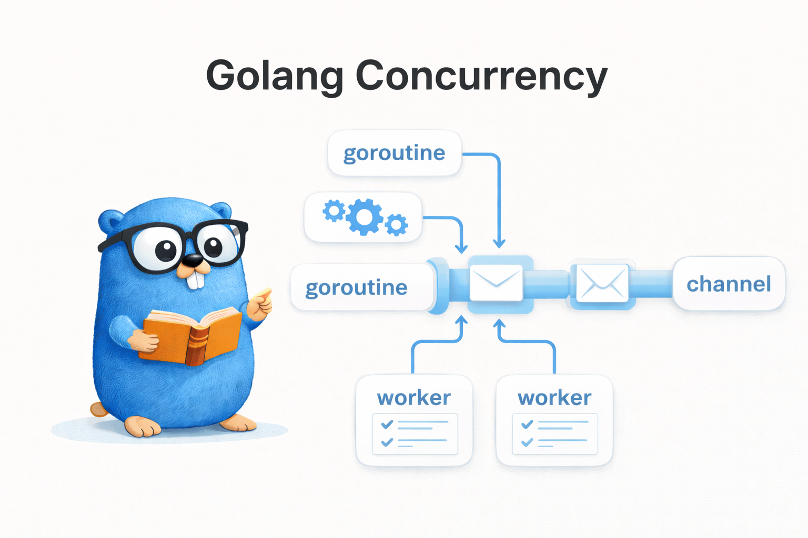

동시성 버그는 소프트웨어 개발에서 가장 찾기 어려운 버그 유형 중 하나다. 순차 코드의 버그는 같은 입력에 같은 결과가 나오므로 재현이 쉽지만, 동시성 버그는 실행할 때마다 다른 결과가 나올 수 있다. 이 글에서는 Go가 제공하는 강력한 동시성 디버깅 도구들을 실전 예제와 함께 알아본다.

## 1. 서론 - 동시성 버그가 찾기 어려운 이유



### 1.1 비결정적 실행 순서

goroutine의 실행 순서는 Go 런타임 스케줄러에 의해 결정되며, 실행할 때마다 달라질 수 있다. 이 때문에 같은 코드를 100번 실행해도 99번은 정상이지만 1번은 실패하는 상황이 발생한다. 개발 환경에서는 문제가 없다가 운영 환경에서만 발생하는 경우도 많다.

```go
// goroutine 스케줄링은 런타임에 결정되므로 출력 순서를 보장할 수 없다
for i := range 3 {
    go func() {
        fmt.Println(i)
    }()
}
// 출력: 0, 1, 2 또는 2, 0, 1 또는 1, 2, 0 또는 ...
```

### 1.2 Heisenbug: 관찰하면 사라지는 버그

동시성 버그에는 **Heisenbug**(하이젠버그)라는 별명이 있다. 양자역학의 불확정성 원리처럼, 버그를 관찰하려고 로그를 추가하거나 디버거를 붙이면 실행 타이밍이 바뀌면서 버그가 사라지는 현상이다.

예를 들어, race condition이 발생하는 코드에 `fmt.Println`을 추가하면 출력 과정에서 내부적으로 동기화가 일어나 타이밍이 바뀌고, 버그가 재현되지 않을 수 있다. 이런 특성 때문에 동시성 버그는 로그 기반 디버깅보다는 **전용 도구**를 사용해야 한다.

Go는 이러한 동시성 버그를 잡기 위한 강력한 도구들을 기본으로 제공한다. 대표적으로 Race Detector, 런타임 deadlock 탐지, goroutine dump가 있다.

## 2. Race Condition 탐지와 수정

Race condition은 여러 goroutine이 공유 데이터에 동시에 접근하면서, 그중 하나 이상이 쓰기 작업을 할 때 발생한다. Go의 Race Detector는 이를 자동으로 탐지해 준다.

### 2.1 `go test -race` 플래그 사용법

Go는 `-race` 플래그 하나로 Race Detector를 활성화할 수 있다. 컴파일 시 메모리 접근을 추적하는 코드가 삽입되어, 실행 중 race condition이 발생하면 상세한 리포트를 출력한다.

```bash
# 테스트에서 race condition 탐지
go test -race ./...

# 특정 패키지만 검사
go test -race ./golang/concurrency/debugging/

# 빌드 시에도 사용 가능
go build -race -o myapp

# 실행 시에도 사용 가능
go run -race main.go
```

Race Detector가 문제를 발견하면 다음과 같은 출력이 나온다:

```
==================
WARNING: DATA RACE
Read at 0x00c0000b4010 by goroutine 8:
  main.main.func1()
      /path/to/main.go:12 +0x3c

Previous write at 0x00c0000b4010 by goroutine 7:
  main.main.func1()
      /path/to/main.go:12 +0x52

Goroutine 8 (running) created at:
  main.main()
      /path/to/main.go:11 +0x84
==================
```

리포트에는 **어떤 goroutine이**, **어떤 메모리 주소에**, **어떤 코드 라인에서** 동시에 접근했는지 명확하게 표시된다.

> `-race` 플래그는 CPU와 메모리 오버헤드가 있으므로(일반적으로 실행 시간 2~10배, 메모리 5~10배 증가), 운영 환경보다는 테스트와 CI 환경에서 사용하는 것이 좋다.

### 2.2 race condition 예시: 여러 goroutine에서 counter++ 동시 실행

가장 흔한 race condition 예시는 여러 goroutine에서 공유 변수를 동시에 증가시키는 것이다.

```go
// race condition 시연용 코드 - 실제 코드에서는 절대 사용 금지
counter := 0
var wg sync.WaitGroup

wg.Add(1000)
for range 1000 {
    go func() {
        defer wg.Done()
        // counter++는 read-modify-write 3단계로 분리되어 원자적이지 않음
        // 여러 goroutine이 같은 값을 읽고 각자 +1 하면 증가분이 덮어써짐
        counter++
    }()
}

wg.Wait()
// counter가 1000이 아닐 수 있다!
```

`counter++`는 단순한 한 줄이지만, 내부적으로는 **읽기 -> 증가 -> 쓰기** 세 단계로 수행된다. 여러 goroutine이 동시에 같은 값을 읽어서 각각 1을 더한 뒤 다시 쓰면, 일부 증가분이 덮어써져서 사라진다.

### 2.3 수정 방법 1: sync.Mutex

가장 직관적인 방법은 `sync.Mutex`로 임계영역을 보호하는 것이다.

```go
func TestRaceConditionFixed(t *testing.T) {
    var mu sync.Mutex
    counter := 0
    var wg sync.WaitGroup

    wg.Add(1000)
    for range 1000 {
        go func() {
            defer wg.Done()
            // critical section은 최소화해야 경합으로 인한 대기 시간을 줄일 수 있다
            mu.Lock()
            counter++
            mu.Unlock()
        }()
    }

    wg.Wait()
    assert.Equal(t, 1000, counter)
}
```

`mu.Lock()`과 `mu.Unlock()` 사이의 코드는 한 번에 하나의 goroutine만 실행할 수 있다. 다른 goroutine은 lock이 해제될 때까지 대기한다.

### 2.4 수정 방법 2: atomic 연산

단순한 정수 연산이라면 `sync/atomic` 패키지가 더 효율적이다. mutex보다 오버헤드가 적고, lock 경합 문제도 없다.

```go
func TestRaceConditionAtomicFix(t *testing.T) {
    var counter atomic.Int64
    var wg sync.WaitGroup

    wg.Add(1000)
    for range 1000 {
        go func() {
            defer wg.Done()
            // CPU atomic instruction을 사용 → lock 경합 없이 단순 증가에 최적
            counter.Add(1)
        }()
    }

    wg.Wait()
    assert.Equal(t, int64(1000), counter.Load())
}
```

`atomic.Int64`는 Go 1.19에서 도입된 타입으로, `Add`, `Load`, `Store` 등의 메서드를 통해 원자적 연산을 수행한다. 내부적으로 CPU의 atomic instruction을 사용하므로 lock 없이도 안전하다.

### 2.5 map concurrent access: sync.Map으로 수정

Go의 일반 `map`은 concurrent access에 안전하지 않다. 여러 goroutine에서 동시에 읽기/쓰기를 하면 `fatal error: concurrent map writes`가 발생하며 프로그램이 즉시 종료된다.

```go
func TestMapRaceFixed(t *testing.T) {
    // sync.Map: 읽기 빈번 + 쓰기 드문 워크로드에 최적
    // 일반 map은 concurrent write 시 fatal error로 즉시 종료됨
    var m sync.Map
    var wg sync.WaitGroup

    // 동시에 쓰기
    wg.Add(100)
    for i := range 100 {
        go func() {
            defer wg.Done()
            m.Store(i, i*10)
        }()
    }

    // 동시에 읽기
    wg.Add(100)
    for i := range 100 {
        go func() {
            defer wg.Done()
            m.Load(i)
        }()
    }

    wg.Wait()
    t.Log("sync.Map으로 안전한 concurrent access 완료")
}
```

`sync.Map`은 내부적으로 읽기 최적화된 구조를 사용하여, 읽기가 많고 쓰기가 적은 워크로드에서 `mutex + map` 조합보다 성능이 좋다. 다만 타입 안전성이 없으므로(`interface{}` 사용), 타입이 중요한 경우에는 `sync.Mutex + map`을 사용하고 Race Detector로 검증하는 것도 좋은 선택이다.

### 2.6 slice concurrent access: 인덱스별 독립 접근

slice에서도 여러 goroutine이 동시에 `append`하면 race condition이 발생한다. 하지만 각 goroutine이 **고유한 인덱스**에만 접근한다면 race condition이 아니다.

```go
func TestSliceRaceFixed(t *testing.T) {
    // 미리 길이를 할당한 slice → 각 요소는 독립 메모리 주소
    results := make([]int, 100)
    var wg sync.WaitGroup

    wg.Add(100)
    for i := range 100 {
        go func() {
            defer wg.Done()
            // 각 goroutine이 서로 다른 인덱스에만 쓰므로 race가 아님
            // 단, append처럼 slice 구조 자체를 수정하는 연산은 race 발생
            results[i] = i * 2
        }()
    }

    wg.Wait()
    assert.Equal(t, 0, results[0])
    assert.Equal(t, 198, results[99])
}
```

이 패턴이 안전한 이유는 각 goroutine이 서로 다른 메모리 위치에 쓰기 때문이다. slice 자체의 길이는 변하지 않고, 각 요소는 독립적인 메모리 주소를 가진다. 단, `append`처럼 slice 자체를 수정하는 연산은 여전히 race condition을 일으키므로 주의해야 한다.

## 3. Deadlock 탐지와 방지

Deadlock은 두 개 이상의 goroutine이 서로 상대방이 가진 리소스를 기다리면서 영원히 진행하지 못하는 상태다. Go 런타임은 **모든 goroutine이 block된 상태**를 감지하면 `fatal error: all goroutines are asleep - deadlock!`을 출력하지만, 일부 goroutine만 deadlock에 빠진 경우는 감지하지 못한다.

### 3.1 circular wait deadlock: 두 goroutine이 서로의 lock 대기

가장 전형적인 deadlock 패턴은 두 goroutine이 서로 다른 순서로 lock을 획득하는 것이다.

```go
// deadlock 시연용 코드 - 실제 코드에서는 절대 사용 금지
// 두 goroutine이 서로 다른 순서로 lock을 잡으면 circular wait가 발생한다
var muA, muB sync.Mutex

// goroutine 1: muA -> muB 순서로 lock
go func() {
    muA.Lock()
    time.Sleep(1 * time.Millisecond)
    muB.Lock() // goroutine 2가 muB를 가지고 있으면 여기서 대기
    muB.Unlock()
    muA.Unlock()
}()

// goroutine 2: muB -> muA 순서로 lock (역순!)
go func() {
    muB.Lock()
    time.Sleep(1 * time.Millisecond)
    muA.Lock() // goroutine 1이 muA를 가지고 있으면 여기서 대기
    muA.Unlock()
    muB.Unlock()
}()
```

goroutine 1이 muA를 잡고 muB를 기다리는 동시에, goroutine 2가 muB를 잡고 muA를 기다리면 **circular wait**가 되어 영원히 진행하지 못한다.

### 3.2 수정: lock 순서 통일

해결 방법은 간단하다. **모든 goroutine에서 lock을 획득하는 순서를 동일하게** 맞추면 된다.

```go
func TestDeadlockFixed(t *testing.T) {
    var muA, muB sync.Mutex
    var wg sync.WaitGroup

    wg.Add(2)

    // 핵심: 모든 goroutine이 동일한 순서(muA → muB)로 lock을 잡는다
    // circular wait가 형성되지 않으므로 deadlock 자체가 불가능
    go func() {
        defer wg.Done()
        muA.Lock()
        time.Sleep(1 * time.Millisecond)
        muB.Lock()
        // 작업 수행
        muB.Unlock()
        muA.Unlock()
    }()

    go func() {
        defer wg.Done()
        muA.Lock()
        time.Sleep(1 * time.Millisecond)
        muB.Lock()
        // 작업 수행
        muB.Unlock()
        muA.Unlock()
    }()

    wg.Wait()
    t.Log("deadlock 없이 완료 (lock 순서 통일)")
}
```

두 goroutine 모두 항상 muA를 먼저 잡고 muB를 나중에 잡으므로, goroutine 2는 muA가 해제될 때까지 기다렸다가 순차적으로 진행한다. circular wait가 발생하지 않는다.

### 3.3 channel deadlock: 같은 goroutine에서 unbuffered send

channel에서도 deadlock이 자주 발생한다. unbuffered channel에 같은 goroutine에서 send하면, 받아줄 goroutine이 없으므로 영원히 block된다.

```go
// deadlock 시연용 코드 - 실제 코드에서는 절대 사용 금지
// unbuffered channel은 send와 receive가 동시에 일어나야 진행된다
ch := make(chan int)     // unbuffered
ch <- 42                 // 같은 goroutine에 receive가 없으므로 영원히 block
val := <-ch              // 여기에 도달하지 못함
```

### 3.4 수정: buffered channel 또는 별도 goroutine

```go
func TestChannelDeadlockFixed(t *testing.T) {
    // 방법 1: buffered channel - 버퍼에 즉시 저장되므로 receive 없이도 진행 가능
    ch := make(chan int, 1)
    ch <- 42
    val := <-ch
    assert.Equal(t, 42, val)

    // 방법 2: send와 receive를 서로 다른 goroutine으로 분리 → rendezvous 성립
    ch2 := make(chan int) // unbuffered
    go func() {
        ch2 <- 100
    }()
    val2 := <-ch2
    assert.Equal(t, 100, val2)
}
```

방법 1은 buffer 크기가 1이므로 send 시점에 즉시 buffer에 저장되어 block되지 않는다. 방법 2는 별도 goroutine에서 send하므로 메인 goroutine이 receive로 대기하는 동안 다른 goroutine이 send를 수행할 수 있다.

### 3.5 timeout으로 잠재적 deadlock 방지

실무에서는 모든 deadlock 가능성을 코드 리뷰로 잡아내기 어렵다. `select`와 `time.After`를 조합하면 잠재적 deadlock 상황에서 무한 대기 대신 timeout으로 빠져나올 수 있다.

```go
func TestTimeoutPreventDeadlock(t *testing.T) {
    ch := make(chan int)

    // select + time.After: 두 channel 중 먼저 준비된 쪽이 실행됨
    // sender가 없어도 timeout이 발동하여 무한 대기를 방지
    select {
    case val := <-ch:
        t.Fatalf("예상하지 않은 값 수신: %d", val)
    case <-time.After(50 * time.Millisecond):
        t.Log("timeout으로 deadlock 방지")
    }
}
```

`select`문에서 `time.After`는 지정된 시간이 지나면 값을 보내는 channel을 반환한다. channel 수신과 timeout 중 먼저 발생하는 쪽이 실행되므로, 무한 대기를 방지할 수 있다.

### 3.6 mutex timeout 패턴 (channel 기반)

Go의 `sync.Mutex`에는 timeout 기능이 없다. `Lock()`을 호출하면 획득할 때까지 무한 대기한다. channel을 mutex처럼 활용하면 timeout을 적용할 수 있다.

```go
func TestMutexTimeoutPattern(t *testing.T) {
    // 버퍼 크기 1 channel을 mutex로 활용 → sync.Mutex와 달리 timeout 적용 가능
    mu := make(chan struct{}, 1)

    // lock 획득 (버퍼에 값 넣기)
    mu <- struct{}{}

    // 다른 goroutine에서 lock 시도 (timeout 포함)
    acquired := make(chan bool, 1)
    go func() {
        select {
        case mu <- struct{}{}:
            acquired <- true
        case <-time.After(50 * time.Millisecond):
            acquired <- false
        }
    }()

    result := <-acquired
    assert.False(t, result, "lock을 획득하지 못해야 함 (timeout)")

    // lock 해제 (버퍼에서 값 빼기)
    <-mu
}
```

buffered channel(크기 1)에 값을 넣으면 lock 획득, 빼면 lock 해제와 동일한 효과다. `select`와 `time.After`를 조합하면 lock 획득 시도에 timeout을 걸 수 있어, mutex로는 불가능한 **lock 대기 시간 제한**이 가능해진다.

## 4. Goroutine Dump와 모니터링

프로그램이 hang 상태에 빠지거나, goroutine이 누수되고 있다면 goroutine의 현재 상태를 확인해야 한다. Go의 `runtime` 패키지는 이를 위한 여러 함수를 제공한다.

### 4.1 runtime.Stack()으로 모든 goroutine 스택 덤프

`runtime.Stack()`은 현재 실행 중인 goroutine들의 스택 트레이스를 바이트 슬라이스에 기록한다. 두 번째 인자를 `true`로 설정하면 **모든 goroutine**의 스택을 덤프한다.

```go
func TestGoroutineDump(t *testing.T) {
    // 블로킹된 goroutine을 일부러 만들어 덤프에 노출시킴
    done := make(chan struct{})
    for range 3 {
        go func() {
            <-done // block 상태로 유지
        }()
    }

    time.Sleep(10 * time.Millisecond)

    buf := make([]byte, 1<<16)
    // 두 번째 인자 true → 프로세스 내 모든 goroutine의 스택을 덤프
    // hang 상태에서 어떤 goroutine이 어디서 멈췄는지 진단하는 핵심 도구
    n := runtime.Stack(buf, true)
    stackDump := string(buf[:n])

    t.Logf("=== Goroutine Dump ===\n%s", stackDump[:min(len(stackDump), 2000)])

    // 덤프에 goroutine 정보가 포함되어 있는지 확인
    assert.Contains(t, stackDump, "goroutine")

    close(done) // goroutine 정리
    time.Sleep(10 * time.Millisecond)
}
```

출력 예시는 다음과 같다:

```
goroutine 1 [running]:
  runtime.Stack(...)
      /usr/local/go/src/runtime/mprof.go:1234

goroutine 18 [chan receive]:
  debugging.TestGoroutineDump.func1()
      /path/to/goroutine_dump_test.go:18

goroutine 19 [chan receive]:
  ...
```

각 goroutine의 상태(`running`, `chan receive`, `sleep` 등)와 현재 실행 중인 코드 위치가 표시된다. 프로그램이 hang 상태일 때 어떤 goroutine이 어디서 block되었는지 파악하는 데 유용하다.

현재 goroutine의 스택만 보려면 두 번째 인자를 `false`로 설정한다.

```go
func TestGoroutineStackInfo(t *testing.T) {
    buf := make([]byte, 4096)
    // 두 번째 인자 false → 현재 goroutine 스택만 덤프 (성능 부담 적음)
    n := runtime.Stack(buf, false)
    stack := string(buf[:n])

    t.Logf("현재 goroutine 스택:\n%s", stack)

    // 현재 테스트 함수가 스택에 포함되어 있는지 확인
    assert.True(t, strings.Contains(stack, "TestGoroutineStackInfo"))
}
```

### 4.2 runtime.NumGoroutine()으로 goroutine 수 모니터링

`runtime.NumGoroutine()`은 현재 존재하는 goroutine의 수를 반환한다. goroutine이 제대로 정리되고 있는지 확인하는 데 가장 간단한 방법이다.

```go
func TestNumGoroutine(t *testing.T) {
    // baseline → during → after 3시점 비교가 leak 탐지의 기본 패턴
    baseline := runtime.NumGoroutine()
    t.Logf("baseline goroutines: %d", baseline)

    done := make(chan struct{})
    for range 10 {
        go func() {
            <-done
        }()
    }

    time.Sleep(10 * time.Millisecond)
    during := runtime.NumGoroutine()
    t.Logf("during goroutines: %d (10개 추가)", during)
    assert.GreaterOrEqual(t, during, baseline+10)

    close(done)
    time.Sleep(50 * time.Millisecond)

    // after가 baseline 수준으로 돌아오지 않으면 leak 의심
    after := runtime.NumGoroutine()
    t.Logf("after goroutines: %d (정리 완료)", after)
    assert.Less(t, after, during)
}
```

이 패턴은 **baseline -> 작업 중 -> 정리 후** 세 시점의 goroutine 수를 비교한다. 정리 후 goroutine 수가 baseline 수준으로 돌아오지 않으면 **goroutine leak**이 의심된다.

### 4.3 goroutine leak 탐지 패턴 (baseline 비교)

goroutine leak은 goroutine이 생성된 후 종료되지 않고 계속 남아있는 현상이다. 메모리와 CPU를 소비하며, 장시간 실행되는 서버에서는 심각한 문제가 된다.

```go
func TestGoroutineLeakDetection(t *testing.T) {
    baseline := runtime.NumGoroutine()

    runWithCleanup := func() {
        done := make(chan struct{})
        go func() {
            <-done
        }()
        // 종료 신호를 반드시 보낸다 → 함수가 끝나도 goroutine이 남지 않음
        close(done)
    }

    runWithCleanup()
    time.Sleep(50 * time.Millisecond)

    current := runtime.NumGoroutine()
    // baseline과 비교하여 leak이 없는지 확인 (스케줄러 노이즈 허용으로 +1)
    assert.LessOrEqual(t, current, baseline+1,
        "goroutine leak 발생: baseline=%d, current=%d", baseline, current)
}
```

goroutine leak의 대표적인 원인은 다음과 같다:
- channel에서 receive 대기 중인데, sender가 channel을 닫지 않는 경우
- context가 취소되지 않아 goroutine이 무한 대기하는 경우
- 무한 루프 안에서 종료 조건을 확인하지 않는 경우

### 4.4 runtime.MemStats로 메모리 통계

goroutine과 함께 메모리 사용량도 모니터링하면 전체적인 리소스 상태를 파악할 수 있다.

```go
func TestRuntimeMemStats(t *testing.T) {
    var m runtime.MemStats
    // ReadMemStats는 GC를 강제 호출하므로 hot path에서는 주의
    runtime.ReadMemStats(&m)

    t.Logf("Alloc = %d KB", m.Alloc/1024)
    t.Logf("TotalAlloc = %d KB", m.TotalAlloc/1024)
    t.Logf("Sys = %d KB", m.Sys/1024)
    t.Logf("NumGC = %d", m.NumGC)
    t.Logf("NumGoroutine = %d", runtime.NumGoroutine())

    assert.Greater(t, m.Alloc, uint64(0))
}
```

| 필드 | 설명 |
|------|------|
| `Alloc` | 현재 힙에 할당된 바이트 수 |
| `TotalAlloc` | 프로그램 시작 이후 누적 할당된 바이트 수 |
| `Sys` | OS로부터 확보한 총 메모리 바이트 수 |
| `NumGC` | 가비지 컬렉션 실행 횟수 |

`Alloc`이 지속적으로 증가하면 메모리 누수가 의심되며, goroutine 수와 함께 확인하면 goroutine leak으로 인한 메모리 누수를 진단할 수 있다.

## 5. 디버깅 도구 모음

Go는 동시성 디버깅을 위한 여러 도구를 제공한다. 상황에 따라 적절한 도구를 선택하자.

### 5.1 go test -race: race condition 탐지

가장 중요한 도구다. CI/CD 파이프라인에 `-race` 플래그를 포함하면 코드 리뷰에서 놓친 race condition을 자동으로 잡아낼 수 있다.

```bash
# CI에서 반드시 실행
go test -race ./...

# 특정 테스트만
go test -race -run TestMyFunction ./pkg/...
```

> Race Detector는 **실행된 코드 경로**에서만 race를 탐지한다. 테스트 커버리지가 낮으면 탐지되지 않는 race가 있을 수 있으므로, 충분한 테스트 작성이 전제 조건이다.

### 5.2 go vet: 정적 분석

`go vet`은 코드를 실행하지 않고 정적으로 분석하여 잠재적 문제를 찾아낸다. 동시성과 관련해서는 다음과 같은 문제를 잡아낸다:

```bash
go vet ./...
```

- **mutex 복사 감지**: `sync.Mutex`를 값으로 복사하면 lock 상태가 복사되어 문제가 발생할 수 있다. `go vet`은 이를 감지한다.
- **atomic 값 복사 감지**: `atomic.Value` 등의 atomic 타입이 복사되는 것도 감지한다.

```go
// go vet이 경고하는 코드
var mu sync.Mutex
mu2 := mu  // vet: copying value of sync.Mutex
```

### 5.3 GODEBUG=asyncpreemptoff=1: 동기 선점 비활성화

Go 1.14부터 goroutine은 비동기적으로 선점(preempt)될 수 있다. 디버깅 시 선점으로 인한 복잡성을 줄이고 싶다면 이 환경 변수를 설정한다.

```bash
GODEBUG=asyncpreemptoff=1 go test -race ./...
```

이 설정은 goroutine이 함수 호출 시점에서만 스케줄링 전환이 일어나도록 만든다. 동시성 버그의 재현성을 높이거나, 특정 타이밍 문제를 격리할 때 유용하다.

### 5.4 pprof: goroutine 프로파일링

`net/http/pprof` 패키지를 사용하면 실행 중인 프로그램의 goroutine 상태를 웹으로 확인할 수 있다.

```go
import _ "net/http/pprof"

func main() {
    go func() {
        log.Println(http.ListenAndServe("localhost:6060", nil))
    }()
    // ... 메인 로직
}
```

```bash
# goroutine 프로파일 확인
go tool pprof http://localhost:6060/debug/pprof/goroutine

# 웹 브라우저에서 직접 확인
# http://localhost:6060/debug/pprof/goroutine?debug=1

# 30초간 CPU 프로파일링
go tool pprof http://localhost:6060/debug/pprof/profile?seconds=30
```

pprof의 goroutine 프로파일은 현재 존재하는 모든 goroutine을 같은 스택 트레이스끼리 그룹화하여 보여준다. 특정 위치에서 대기 중인 goroutine이 비정상적으로 많다면 leak이나 병목을 의심할 수 있다.

## 6. 정리

| 도구/기법 | 핵심 | 사용 시점 |
|-----------|------|----------|
| `go test -race` | 실행 중 race condition 자동 탐지 | CI/CD에서 항상 실행 |
| `go vet` | 정적 분석으로 mutex 복사 등 감지 | 코드 커밋 전 |
| `sync.Mutex` | 임계영역 보호 | 공유 데이터 읽기/쓰기 보호 |
| `atomic` 패키지 | lock 없는 원자적 연산 | 단순 카운터, 플래그 |
| `sync.Map` | concurrent map access | 읽기 빈번, 쓰기 드문 map |
| lock 순서 통일 | circular wait 방지 | 여러 mutex를 사용하는 경우 |
| `select` + `time.After` | timeout으로 deadlock 방지 | channel 대기에 시간 제한 |
| `runtime.Stack()` | goroutine 스택 덤프 | hang 상태 진단 |
| `runtime.NumGoroutine()` | goroutine 수 모니터링 | leak 탐지 |
| `runtime.MemStats` | 메모리 통계 | 리소스 모니터링 |
| pprof | 런타임 프로파일링 | 운영 환경 진단 |

동시성 버그는 발생 빈도가 낮고 재현이 어렵기 때문에, **사후 대응보다는 사전 예방**이 중요하다. `-race` 플래그를 CI에 반드시 포함하고, 공유 데이터에는 항상 동기화 메커니즘을 적용하자. goroutine을 생성할 때는 반드시 종료 경로를 설계하고, `runtime.NumGoroutine()`으로 정기적으로 goroutine 수를 확인하는 습관을 들이자.

> 예제 코드는 [GitHub](https://github.com/kenshin579/tutorials-go/tree/master/golang/concurrency/debugging)에서 확인할 수 있다.

## 7. 참고

- [Go Race Detector](https://go.dev/doc/articles/race_detector)
- [Go Runtime 패키지 문서](https://pkg.go.dev/runtime)
- [Go sync/atomic 패키지 문서](https://pkg.go.dev/sync/atomic)
- [Go Blog - Introducing the Go Race Detector](https://go.dev/blog/race-detector)
- [Debugging Go Programs with Delve](https://github.com/go-delve/delve)
