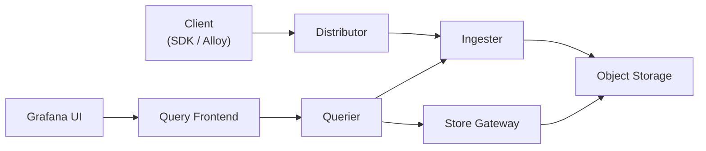
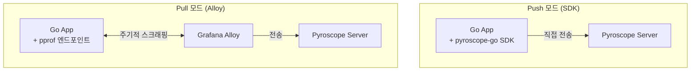

# 1. 들어가며

Go에서 성능 분석을 할 때 `net/http/pprof`나 `runtime/pprof`를 주로 사용한다. 개발 환경에서 특정 시점의 CPU 사용량이나 메모리 할당을 스냅샷으로 확인하기에는 충분하지만, 프로덕션 환경에서는 몇 가지 한계가 있다.

- 문제가 발생한 **시점에 수동으로** 프로파일을 수집해야 한다
- 수집한 프로파일은 **로컬 파일**로만 남아 시간 경과에 따른 비교가 어렵다
- 여러 인스턴스에서 분산된 프로파일 데이터를 **중앙에서 관리**할 수 없다

**Continuous Profiling**은 이러한 한계를 해결한다. 프로덕션에서 상시 낮은 오버헤드로 프로파일 데이터를 수집하고, 중앙 저장소에 보관하여 언제든 과거 데이터를 조회할 수 있다.

이 글에서는 Continuous Profiling 플랫폼인 **Grafana Pyroscope**를 Go 애플리케이션에 연동하는 방법을 실습한다. Docker Compose로 로컬 환경을 구축하고, Pyroscope Go SDK로 프로파일 데이터를 수집한 후, Flame Graph로 성능 병목을 분석하는 과정을 다룬다.

> 이 글에서 사용한 전체 코드는 [GitHub](https://github.com/kenshin579/tutorials-go/tree/master/golang/profiling/pyroscope)에서 확인할 수 있다.

# 2. Continuous Profiling이란?

## 2.1 전통적 프로파일링 vs Continuous Profiling

| 구분 | 전통적 프로파일링 | Continuous Profiling |
|------|-------------------|---------------------|
| 수집 시점 | 개발/디버깅 시 수동 실행 | 프로덕션에서 상시 자동 수집 |
| 오버헤드 | 높음 (개발 환경에서만 사용) | 낮음 (~2-5% CPU) |
| 데이터 범위 | 특정 시점 스냅샷 | 시간 경과에 따른 연속 데이터 |
| 분석 방식 | 사후 분석 (reactive) | 사전 예방적 분석 (proactive) |
| 저장 | 로컬 파일 | 중앙 집중 DB (장기 보관) |

전통적 프로파일링은 문제가 발생한 후 수동으로 데이터를 수집하는 반면, Continuous Profiling은 항상 데이터를 수집하므로 문제 발생 시점의 프로파일을 즉시 확인할 수 있다.

## 2.2 프로파일 유형 (Go 기준)

Go에서 수집할 수 있는 주요 프로파일 유형은 다음과 같다.

| 프로파일 유형 | 설명 | 활성화 방법 |
|--------------|------|------------|
| CPU | 함수별 CPU 사용 시간 | 기본 활성화 |
| Alloc (Objects/Space) | 메모리 할당 횟수/크기 | 기본 활성화 |
| Inuse (Objects/Space) | 현재 사용 중인 메모리 | 기본 활성화 |
| Goroutine | 활성 고루틴 수 및 스택 | 선택 활성화 |
| Mutex (Count/Duration) | 뮤텍스 경합 횟수/시간 | `runtime.SetMutexProfileFraction()` |
| Block (Count/Duration) | 블로킹 대기 횟수/시간 | `runtime.SetBlockProfileRate()` |

> Mutex와 Block 프로파일은 기본 비활성화이므로, Pyroscope SDK 초기화 전에 명시적으로 활성화해야 한다.

# 3. Grafana Pyroscope 아키텍처

## 3.1 핵심 컴포넌트

Pyroscope는 다음과 같은 마이크로서비스 컴포넌트로 구성되며, Monolithic 모드에서는 단일 프로세스로 실행된다.



| 컴포넌트 | 역할 |
|----------|------|
| **Distributor** | 클라이언트로부터 프로파일 데이터 수신 및 라우팅 |
| **Ingester** | 메모리에 임시 저장 후 Object Storage에 쓰기 |
| **Querier** | 프로파일 데이터 조회 및 병합 |
| **Query Frontend** | 쿼리 캐싱 및 최적화 |
| **Store Gateway** | 장기 저장소(Object Storage) 접근 |

## 3.2 데이터 수집 방식: Push vs Pull

Pyroscope는 두 가지 방식으로 프로파일 데이터를 수집할 수 있다.



| 방식 | 장점 | 단점 |
|------|------|------|
| **Push (SDK)** | 설정이 간단, 코드에 직접 통합 | 애플리케이션 코드 변경 필요 |
| **Pull (Alloy)** | 코드 변경 없음, 기존 pprof 활용 | Alloy 인프라 추가 필요 |

이 글에서는 **Push 모드(SDK)**를 중심으로 다룬다.

# 4. 로컬 환경 구축

## 4.1 Docker Compose로 Pyroscope + Grafana 실행

Docker Compose로 Pyroscope 서버, Grafana, 샘플 애플리케이션을 한 번에 실행할 수 있다.

```yaml
services:
  pyroscope:
    image: grafana/pyroscope:latest
    ports:
      - "4040:4040"
    networks:
      - pyroscope-net

  grafana:
    image: grafana/grafana:latest
    ports:
      - "3000:3000"
    environment:
      - GF_AUTH_ANONYMOUS_ENABLED=true
      - GF_AUTH_ANONYMOUS_ORG_ROLE=Admin
    volumes:
      - ./grafana/provisioning:/etc/grafana/provisioning
    depends_on:
      - pyroscope
    networks:
      - pyroscope-net

  app-basic:
    build:
      context: .
      dockerfile: basic/Dockerfile
    depends_on:
      - pyroscope
    environment:
      - PYROSCOPE_SERVER=http://pyroscope:4040
    networks:
      - pyroscope-net

  app-http:
    build:
      context: .
      dockerfile: http-server/Dockerfile
    ports:
      - "8080:8080"
    depends_on:
      - pyroscope
    environment:
      - PYROSCOPE_SERVER=http://pyroscope:4040
      - PORT=8080
    networks:
      - pyroscope-net

networks:
  pyroscope-net:
    driver: bridge
```

```bash
> docker compose up -d
> docker compose logs -f app-basic
```

## 4.2 Grafana에서 Pyroscope 데이터소스 연결

Grafana 프로비저닝 설정으로 Pyroscope 데이터소스를 자동 등록할 수 있다.

```yaml
# grafana/provisioning/datasources/pyroscope.yml
apiVersion: 1

datasources:
  - name: Pyroscope
    type: grafana-pyroscope-datasource
    url: http://pyroscope:4040
    isDefault: true
    editable: true
```

환경 실행 후 접속 URL은 다음과 같다.

| 서비스 | URL | 설명 |
|--------|-----|------|
| Pyroscope | http://localhost:4040 | Pyroscope UI |
| Grafana | http://localhost:3000 | Grafana 대시보드 (익명 접속) |

Grafana에서 **Explore** 메뉴 → Pyroscope 데이터소스를 선택하면 수집된 프로파일 데이터를 Flame Graph로 확인할 수 있다.

# 5. Go SDK 연동

## 5.1 SDK 설치 및 기본 설정

```bash
> go get github.com/grafana/pyroscope-go
```

`pyroscope.Start()`로 프로파일러를 초기화하면, 애플리케이션이 실행되는 동안 설정된 프로파일 유형의 데이터를 Pyroscope 서버로 지속 전송한다.

```go
package main

import (
	"log"
	"os"
	"runtime"

	"github.com/grafana/pyroscope-go"
)

func main() {
	// 뮤텍스/블로킹 프로파일은 기본 비활성화이므로 명시적으로 활성화
	runtime.SetMutexProfileFraction(5)
	runtime.SetBlockProfileRate(5)

	profiler, err := pyroscope.Start(pyroscope.Config{
		ApplicationName: "simple.golang.app",       // Pyroscope UI에서 표시되는 이름
		ServerAddress:   "http://localhost:4040",    // Pyroscope 서버 주소
		Logger:          pyroscope.StandardLogger,
		Tags:            map[string]string{"hostname": os.Getenv("HOSTNAME")},
		ProfileTypes: []pyroscope.ProfileType{
			pyroscope.ProfileCPU,           // CPU 프로파일
			pyroscope.ProfileAllocObjects,  // 메모리 할당 횟수
			pyroscope.ProfileAllocSpace,    // 메모리 할당 크기
			pyroscope.ProfileInuseObjects,  // 현재 사용 중인 객체 수
			pyroscope.ProfileInuseSpace,    // 현재 사용 중인 메모리 크기
			pyroscope.ProfileGoroutines,    // 고루틴
			pyroscope.ProfileMutexCount,    // 뮤텍스 경합 횟수
			pyroscope.ProfileMutexDuration, // 뮤텍스 경합 시간
			pyroscope.ProfileBlockCount,    // 블로킹 횟수
			pyroscope.ProfileBlockDuration, // 블로킹 시간
		},
	})
	if err != nil {
		log.Fatalf("pyroscope 시작 실패: %v", err)
	}
	defer profiler.Stop() // 종료 시 마지막 프로파일 데이터 전송
}
```

## 5.2 주요 설정 항목

| 필드 | 설명 | 기본값 |
|------|------|--------|
| `ApplicationName` | Pyroscope UI에서 표시되는 애플리케이션 이름 | (필수) |
| `ServerAddress` | Pyroscope 서버 URL | (필수) |
| `Tags` | 프로파일 데이터에 추가할 메타데이터 태그 | `nil` |
| `ProfileTypes` | 수집할 프로파일 유형 목록 | CPU + Alloc + Inuse |
| `Logger` | 로깅 인터페이스 | `nil` |
| `DisableGCRuns` | GC 실행 비활성화 (CPU 오버헤드 감소) | `false` |

# 6. Profiling Labels로 세밀한 분석

## 6.1 TagWrapper 사용법

Pyroscope의 `TagWrapper`를 사용하면 특정 코드 경로에 label을 태깅할 수 있다. 태깅된 프로파일 데이터는 Flame Graph에서 label 기준으로 필터링할 수 있어서, "어떤 엔드포인트가 CPU를 많이 쓰는가?"와 같은 질문에 답할 수 있다.

```go
pyroscope.TagWrapper(ctx,
	pyroscope.Labels("workload", "cpu"),
	func(c context.Context) {
		cpuWork() // 이 블록의 프로파일 데이터에 workload=cpu label 태깅
	})
```

## 6.2 HTTP 서버에서 엔드포인트별 프로파일링

Echo HTTP 서버에서 각 핸들러를 `TagWrapper`로 감싸면 엔드포인트별 성능을 개별적으로 분석할 수 있다.

```go
func handleSlow(c echo.Context) error {
	start := time.Now()

	pyroscope.TagWrapper(c.Request().Context(),
		pyroscope.Labels("endpoint", "/slow"),
		func(ctx context.Context) {
			fibonacci(38) // CPU 집약적 연산
		})

	return c.JSON(http.StatusOK, response{
		Message: "slow response (CPU intensive)",
		Elapsed: time.Since(start).String(),
	})
}

func handleMemory(c echo.Context) error {
	start := time.Now()

	pyroscope.TagWrapper(c.Request().Context(),
		pyroscope.Labels("endpoint", "/memory"),
		func(ctx context.Context) {
			allocateMemory() // 대량 메모리 할당
		})

	return c.JSON(http.StatusOK, response{
		Message: "memory response (heap allocation)",
		Elapsed: time.Since(start).String(),
	})
}
```

부하를 생성하여 프로파일 데이터를 수집할 수 있다.

```bash
# 빠른 응답 (기준선)
> curl http://localhost:8080/fast

# CPU 부하 생성
> curl http://localhost:8080/slow

# 메모리 부하 생성
> curl http://localhost:8080/memory
```

Grafana에서 Pyroscope 데이터소스를 조회하면 `endpoint` label로 `/slow`와 `/memory` 요청의 프로파일을 각각 필터링할 수 있다.

# 7. Flame Graph 분석

## 7.1 Flame Graph 읽는 법

Flame Graph는 프로파일링 데이터를 스택 트레이스 기반으로 시각화한 그래프다.

- **가로축**: 전체 시간 대비 해당 함수가 차지하는 비율 (넓을수록 많은 리소스 사용)
- **세로축**: 함수 호출 계층 (위에서 아래로 호출이 깊어짐)
- **루트 노드**: 전체 애플리케이션 시간의 100%

```
[              root (100%)                ]
[     funcA (60%)      ][   funcB (40%)   ]
[  funcC (30%) ][ funcD (30%) ]
```

Flame Graph를 분석할 때 주의할 점은 다음과 같다.

- **넓은 블록** = 성능 병목 후보 (해당 함수에서 많은 시간 소비)
- **깊은 스택** = 호출 체인이 깊음 (반드시 문제를 의미하지는 않음)
- **Self time vs Total time**: 자기 자신의 실행 시간 vs 하위 함수를 포함한 전체 시간

## 7.2 Pyroscope에서 Flame Graph 활용

Grafana에서 Pyroscope 데이터소스를 통해 다양한 분석이 가능하다.

- **시간 범위 선택**: 특정 시간 구간의 프로파일만 분석
- **함수 클릭**: 해당 함수 중심으로 필터링하여 상세 확인
- **Labels 필터링**: `endpoint=/slow` 등으로 특정 코드 경로만 분석
- **비교(Comparison) 모드**: 두 시점의 프로파일을 나란히 비교
- **Diff 뷰**: 변경 전후의 성능 차이를 색상으로 시각화 (빨간색=증가, 초록색=감소)

# 8. 실전 팁

## 8.1 프로덕션 적용 시 주의사항

- **오버헤드 관리**: Pyroscope SDK의 CPU 오버헤드는 약 2-5%이다. `DisableGCRuns: true` 옵션으로 GC 관련 오버헤드를 줄일 수 있다
- **프로파일 유형 선택**: 모든 프로파일을 활성화하면 오버헤드가 늘어나므로, CPU와 메모리 프로파일만 기본 활성화하고 필요 시 Mutex/Block을 추가하는 것을 권장한다
- **`SetMutexProfileFraction`과 `SetBlockProfileRate` 값**: 값이 작을수록 더 많은 이벤트를 기록한다. 프로덕션에서는 `5` 이상의 값으로 오버헤드를 조절한다

## 8.2 기존 pprof 코드와의 공존

Pyroscope Go SDK는 내부적으로 `runtime/pprof`를 사용한다. 기존에 `net/http/pprof`를 사용하고 있다면 Pyroscope SDK와 함께 사용할 수 있다.

```go
import _ "net/http/pprof" // 기존 pprof HTTP 엔드포인트 유지

// Pyroscope SDK 추가 - 동일한 프로파일 데이터를 Pyroscope 서버로도 전송
profiler, _ := pyroscope.Start(pyroscope.Config{...})
defer profiler.Stop()
```

기존 pprof 엔드포인트는 즉석 디버깅용으로 유지하면서, Pyroscope로 상시 프로파일링 데이터를 수집하는 하이브리드 구성이 가능하다.

# 9. 마무리

이 글에서는 Grafana Pyroscope를 활용한 Go 애플리케이션 Continuous Profiling을 다루었다.

- **Continuous Profiling**은 프로덕션에서 상시 프로파일을 수집하여, 전통적 pprof의 "문제 발생 후 수동 수집" 한계를 해결한다
- **Pyroscope Go SDK**는 `pyroscope.Start()` 한 줄로 연동할 수 있으며, CPU/메모리/뮤텍스/블로킹 등 다양한 프로파일을 지원한다
- **Profiling Labels**(TagWrapper)로 엔드포인트별, 워크로드별 프로파일 데이터를 구분하여 세밀한 분석이 가능하다
- **Flame Graph**를 통해 성능 병목을 시각적으로 빠르게 파악하고, 비교/Diff 뷰로 변경 전후의 성능 차이를 확인할 수 있다

전체 코드는 [GitHub](https://github.com/kenshin579/tutorials-go/tree/master/golang/profiling/pyroscope)에서 확인할 수 있다.

# 10. 참고

- [Grafana Pyroscope 공식 문서](https://grafana.com/docs/pyroscope/latest/)
- [Pyroscope Go SDK (Push 모드)](https://grafana.com/docs/pyroscope/latest/configure-client/language-sdks/go_push/)
- [Pyroscope GitHub 저장소](https://github.com/grafana/pyroscope)
- [pyroscope-go Go 클라이언트](https://github.com/grafana/pyroscope-go)
- [Continuous Profiling이란?](https://grafana.com/docs/pyroscope/latest/introduction/continuous-profiling/)
- [Flame Graph 가이드](https://grafana.com/docs/pyroscope/latest/introduction/flamegraphs/)
- [Grafana Alloy (Pull 모드)](https://grafana.com/docs/pyroscope/latest/configure-client/grafana-alloy/)
