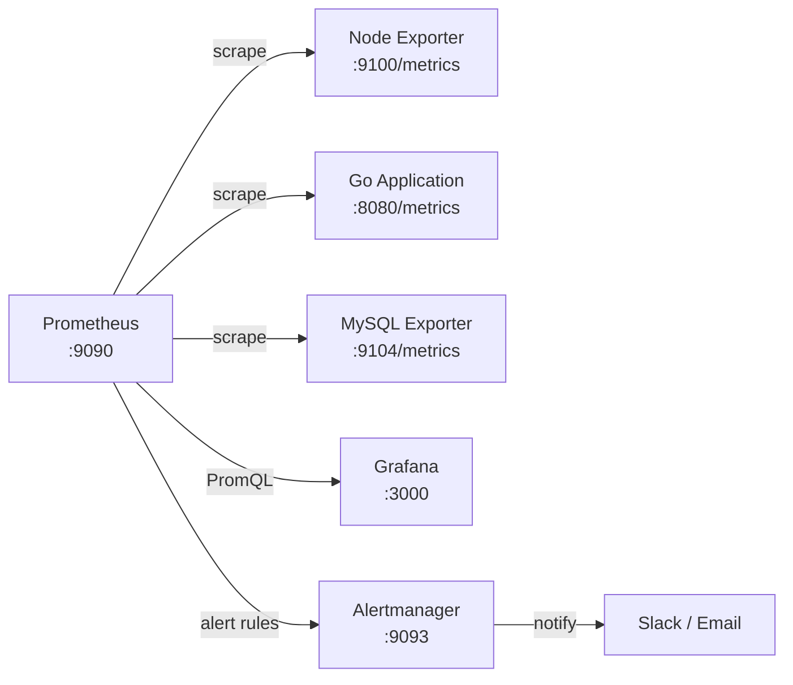
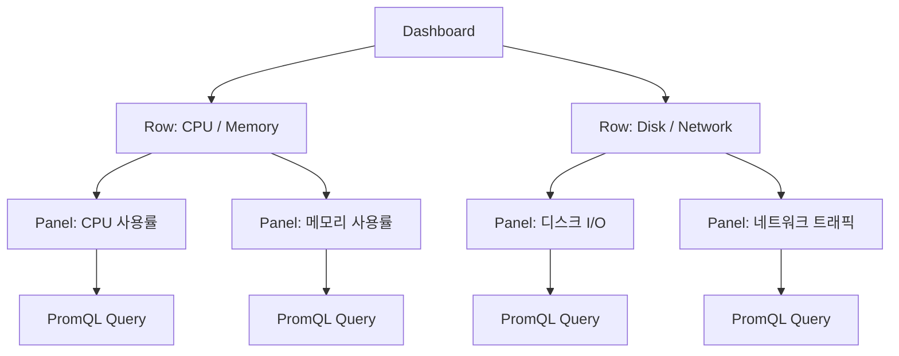

# 1. 들어가며

운영 환경에서 서비스가 갑자기 느려지거나 장애가 발생했을 때, 원인을 파악할 수 있는 수단이 없다면 어떻게 될까? 로그를 하나씩 뒤지고, 서버에 직접 접속해서 `top` 명령어를 치며 상태를 확인하는 것은 한계가 분명하다. **모니터링 시스템**은 이런 상황에서 시스템의 상태를 실시간으로 파악하고, 문제를 빠르게 진단할 수 있게 해준다.

현대적인 모니터링은 **Observability(관측 가능성)** 라는 개념으로 확장되었다. Observability의 3가지 핵심 요소는 다음과 같다.

| 요소 | 설명 | 대표 도구 |
|------|------|-----------|
| **Metrics** | 시간에 따른 수치 데이터 (CPU, 메모리, 요청 수 등) | Prometheus, Datadog |
| **Logs** | 이벤트 기록 (에러 메시지, 요청 로그 등) | Loki, ELK Stack |
| **Traces** | 요청의 흐름 추적 (서비스 간 호출 경로) | Tempo, Jaeger |

이 글은 **Grafana 완벽 가이드 시리즈**의 첫 번째 편으로, Observability의 첫 번째 요소인 **Metrics**에 집중한다. Prometheus로 메트릭을 수집하고, Grafana로 시각화하는 기초를 다룬다.

**시리즈 구성:**

| 편 | 제목 | 다루는 영역 |
|----|------|-------------|
| **편 1 (이 글)** | Prometheus와 Grafana 기초 | Metrics 기초 |
| 편 2 | Go 애플리케이션 커스텀 메트릭 | Metrics 심화 |
| 편 3 | Grafana Tempo 분산 트레이싱 | Traces |
| 편 4 | Grafana Pyroscope Continuous Profiling | Profiles |

이 글에서는 다음 내용을 다룬다.

- Prometheus의 아키텍처와 메트릭 타입 4가지
- PromQL 기본 문법과 실전 쿼리
- Grafana의 핵심 개념 (Data Source, Dashboard, Panel, Variables)
- docker-compose로 Prometheus + Grafana + node-exporter 환경 구축
- 시스템 모니터링 대시보드 만들기

> 이 글에서 사용한 전체 코드는 [GitHub](https://github.com/kenshin579/tutorials-go/tree/master/monitoring/grafana-metrics)에서 확인할 수 있다.

# 2. Prometheus 핵심 개념

## 2.1 아키텍처 — Pull 기반 메트릭 수집

Prometheus는 **Pull 방식**으로 메트릭을 수집한다. 모니터링 대상(Target)이 HTTP 엔드포인트(`/metrics`)를 노출하면, Prometheus가 주기적으로 해당 엔드포인트를 호출(scrape)해서 메트릭을 가져온다.



핵심 구성 요소는 다음과 같다.

| 구성 요소 | 역할 |
|-----------|------|
| **Prometheus Server** | 메트릭 수집(scrape), 저장(TSDB), PromQL 쿼리 엔진 |
| **Exporter** | 대상 시스템의 메트릭을 `/metrics` 엔드포인트로 노출 |
| **Alertmanager** | 알림 규칙에 따라 Slack, Email 등으로 알림 전송 |
| **Grafana** | PromQL로 Prometheus를 조회해 대시보드 시각화 |

Pull 방식과 Push 방식의 차이를 비교해보자.

| 비교 항목 | Pull 방식 (Prometheus) | Push 방식 (Datadog, InfluxDB) |
|-----------|------------------------|-------------------------------|
| 데이터 흐름 | 서버가 타겟에서 가져감 | 타겟이 서버에 보냄 |
| 서비스 디스커버리 | 필요 (어디를 scrape할지 알아야 함) | 불필요 (타겟이 직접 전송) |
| 네트워크 요구사항 | 서버 → 타겟 접근 필요 | 타겟 → 서버 접근 필요 |
| 장점 | 타겟 상태 확인 가능 (scrape 실패 = 장애) | 방화벽 뒤 환경에서 유리 |
| 단점 | 방화벽 뒤 타겟 수집 어려움 | 타겟 장애 시 데이터 유실 감지 어려움 |

## 2.2 메트릭 타입 4가지

Prometheus는 4가지 메트릭 타입을 지원한다.

| 타입 | 특징 | 사용 예시 | 주요 함수 |
|------|------|-----------|-----------|
| **Counter** | 단조 증가(monotonically increasing, 값이 감소 없이 증가만 함)만 가능 (리셋 시 0부터 재시작) | HTTP 요청 수, 에러 수 | `rate()`, `increase()` |
| **Gauge** | 증가/감소 모두 가능 | CPU 사용률, 메모리 사용량, 활성 연결 수 | 직접 조회, `avg_over_time()` |
| **Histogram** | 값의 분포를 버킷(bucket)으로 측정 | 응답 시간, 요청 크기 | `histogram_quantile()` |
| **Summary** | 값의 분포를 분위수(quantile)로 측정 | 응답 시간 (클라이언트 측 계산) | 직접 조회 |

### 2.2.1 Counter — 단조 증가 값

Counter는 누적 값만 증가하는 메트릭이다. 서버가 재시작되면 0부터 다시 시작한다. 절대값 자체보다는 `rate()` 함수로 **초당 변화량**을 계산하는 것이 일반적이다.

```promql
# HTTP 요청의 초당 증가율 (5분 평균)
rate(http_requests_total[5m])

# 최근 1시간 동안 총 증가량
increase(http_requests_total[1h])
```

### 2.2.2 Gauge — 증감 가능한 현재 값

Gauge는 현재 상태 값을 나타내며 증가와 감소 모두 가능하다. CPU 사용률, 메모리 사용량, 현재 활성 연결 수 등이 대표적이다.

```promql
# 현재 활성 요청 수
http_requests_in_flight

# 5분 평균 CPU 사용률
avg_over_time(node_cpu_seconds_total{mode="idle"}[5m])
```

### 2.2.3 Histogram — 값의 분포 (버킷 기반)

Histogram은 값을 미리 정의된 버킷(bucket)에 분류해서 분포를 측정한다. 서버 측에서 버킷별 카운트만 저장하므로, 쿼리 시점에 `histogram_quantile()` 함수로 백분위수를 계산한다.

```promql
# P99 응답 시간 (상위 1%가 경험하는 최대 응답 시간)
histogram_quantile(0.99, rate(http_request_duration_seconds_bucket[5m]))

# P50 / P90 / P99 비교
histogram_quantile(0.50, rate(http_request_duration_seconds_bucket[5m]))
histogram_quantile(0.90, rate(http_request_duration_seconds_bucket[5m]))
histogram_quantile(0.99, rate(http_request_duration_seconds_bucket[5m]))
```

### 2.2.4 Summary — 값의 분포 (분위수 기반)

Summary는 Histogram과 유사하지만, 분위수를 **클라이언트 측에서 미리 계산**해서 저장한다. 서버에서 집계할 수 없으므로 여러 인스턴스의 Summary를 합산할 수 없다는 단점이 있다.

| 비교 항목 | Histogram | Summary |
|-----------|-----------|---------|
| 분위수 계산 위치 | 서버 (쿼리 시점) | 클라이언트 (수집 시점) |
| 여러 인스턴스 합산 | 가능 | 불가능 |
| 버킷/분위수 변경 | 설정 변경 후 재시작 | 코드 변경 필요 |
| 권장 사용 | 대부분의 경우 | 정확한 분위수가 필요한 특수한 경우 |

> 대부분의 경우 **Histogram** 사용을 권장한다. Summary는 여러 인스턴스의 데이터를 합산할 수 없어 분산 환경에서 제약이 크다.

## 2.3 Label과 Time Series

Prometheus에서 메트릭 이름과 Label 조합이 하나의 **Time Series**를 구성한다. Label을 사용하면 동일한 메트릭을 다양한 차원(dimension)으로 분류할 수 있다.

```
http_requests_total{method="GET", path="/api/users", status="200"}  → Time Series 1
http_requests_total{method="POST", path="/api/orders", status="201"} → Time Series 2
http_requests_total{method="GET", path="/api/users", status="500"}  → Time Series 3
```

Label은 강력하지만, 잘못 사용하면 **카디널리티(Cardinality) 폭발** 문제가 발생한다.

> **카디널리티 주의**: Label 값의 종류가 많을수록 Time Series 수가 급격히 증가한다. 예를 들어 `user_id`를 Label로 사용하면 사용자 수만큼 Time Series가 생성되어 Prometheus의 메모리와 디스크 사용량이 폭증한다. Label 값은 **유한하고 적은 수**로 유지해야 한다. `method`, `status`, `path` 같은 값이 적절하며, `user_id`, `session_id`, `request_id` 같은 고유 식별자는 사용하지 말아야 한다.

## 2.4 PromQL 기본 문법

PromQL(Prometheus Query Language)은 Prometheus에 저장된 메트릭을 조회하고 계산하는 쿼리 언어다. Grafana 대시보드에서 패널을 구성할 때 필수적으로 사용한다.

자주 사용하는 PromQL 함수 4가지를 알아보자.

| 함수 | 설명 | 입력 타입 | 사용 예시 |
|------|------|-----------|-----------|
| `rate()` | 초당 평균 변화율 계산 | Counter | `rate(http_requests_total[5m])` |
| `increase()` | 지정 기간 동안 총 증가량 | Counter | `increase(http_requests_total[1h])` |
| `histogram_quantile()` | 백분위수 계산 | Histogram | `histogram_quantile(0.99, rate(...[5m]))` |
| `avg_over_time()` | 지정 기간 동안 평균값 | Gauge | `avg_over_time(metric[5m])` |

실전에서 자주 사용하는 쿼리 패턴이다.

```promql
# 에러율 (%) — 5xx 응답 비율
rate(http_requests_total{status=~"5.."}[5m])
  / rate(http_requests_total[5m]) * 100

# CPU 사용률 (%) — idle을 제외한 비율
100 - (avg by(instance) (rate(node_cpu_seconds_total{mode="idle"}[5m])) * 100)

# 메모리 사용률 (%)
(1 - node_memory_MemAvailable_bytes / node_memory_MemTotal_bytes) * 100

# 디스크 사용률 (%)
(1 - node_filesystem_avail_bytes{mountpoint="/"} / node_filesystem_size_bytes{mountpoint="/"}) * 100
```

# 3. Grafana 핵심 개념

Grafana는 다양한 데이터 소스를 시각화하는 오픈소스 대시보드 도구다. Prometheus뿐만 아니라 Loki, Tempo, MySQL, Elasticsearch 등 다양한 데이터 소스를 지원한다.

## 3.1 Data Source 연동

Data Source는 Grafana가 데이터를 가져오는 출처를 의미한다. Grafana에서 대시보드를 만들려면 먼저 Data Source를 등록해야 한다.

Prometheus를 Data Source로 추가하는 방법은 두 가지가 있다.

**방법 1: UI에서 직접 추가**

1. Grafana 좌측 메뉴 → **Connections** → **Data sources** → **Add data source**
2. Prometheus 선택
3. URL에 `http://prometheus:9090` 입력
4. **Save & Test** 클릭

<!-- TODO: Data Source 설정 스크린샷 삽입 -->

**방법 2: Provisioning 파일로 자동 설정**

docker-compose 환경에서는 YAML 파일로 Data Source를 자동 등록할 수 있다. 4장에서 이 방법을 사용한다.

```yaml
# provisioning/datasources/datasource.yml
apiVersion: 1

datasources:
  - name: Prometheus
    type: prometheus
    access: proxy
    url: http://prometheus:9090
    isDefault: true
    editable: true
```

## 3.2 Dashboard 구조 이해

Grafana Dashboard는 계층적 구조로 구성된다.



| 구성 요소 | 설명 |
|-----------|------|
| **Dashboard** | 여러 Panel을 모아놓은 화면. JSON으로 내보내기/가져오기 가능 |
| **Row** | Panel을 논리적으로 그룹화하는 접이식 영역 |
| **Panel** | 하나의 시각화 단위. PromQL 쿼리로 데이터를 가져와 차트로 표시 |
| **Query** | Panel 내부에서 Data Source에 보내는 PromQL 쿼리 |

## 3.3 주요 Panel 타입

Grafana는 다양한 Panel 타입을 제공한다. 데이터 특성에 맞는 Panel을 선택하는 것이 중요하다.

| Panel 타입 | 용도 | 적합한 데이터 |
|------------|------|---------------|
| **Time series** | 시간에 따른 값 변화 | CPU 사용률, 요청 수, 응답 시간 |
| **Stat** | 단일 숫자 강조 표시 | 현재 가동 시간, 총 요청 수 |
| **Gauge** | 범위 내 현재 값 (게이지 형태) | 디스크 사용률, 메모리 사용률 |
| **Table** | 표 형태로 데이터 나열 | 인스턴스별 상태, Top N 목록 |
| **Bar chart** | 카테고리별 비교 | 서비스별 에러 수, 엔드포인트별 요청 수 |
| **Heatmap** | 2차원 분포 시각화 | 응답 시간 분포, Histogram 버킷 |

## 3.4 Variables(변수)와 템플릿

Variables를 사용하면 대시보드 상단에 드롭다운 메뉴를 추가해서, 하나의 대시보드로 여러 인스턴스나 서비스를 동적으로 조회할 수 있다.

**Variable 설정 예시:**

| 항목 | 값 |
|------|---|
| Name | `instance` |
| Type | Query |
| Data source | Prometheus |
| Query | `label_values(node_cpu_seconds_total, instance)` |
| Multi-value | 활성화 |

설정 후 Panel의 PromQL에서 `$instance` 변수를 사용할 수 있다.

```promql
# instance 변수를 활용한 CPU 사용률
100 - (avg by(instance) (rate(node_cpu_seconds_total{mode="idle", instance=~"$instance"}[5m])) * 100)
```

<!-- TODO: Variables 드롭다운 스크린샷 삽입 -->

대시보드 상단의 드롭다운에서 인스턴스를 선택하면, 해당 인스턴스의 메트릭만 필터링되어 표시된다.

# 4. 실전: 로컬 환경 구축 (docker-compose)

이 장에서는 docker-compose로 Prometheus, Grafana, node-exporter를 실행하고, 시스템 모니터링 대시보드를 만들어본다.

## 4.1 docker-compose로 Prometheus + Grafana 실행

3개의 서비스로 구성된 docker-compose 파일을 작성한다.

```yaml
# docker-compose.yml
services:
  prometheus:
    image: prom/prometheus:v2.51.0
    container_name: prometheus
    ports:
      - "9090:9090"
    volumes:
      - ./prometheus/prometheus.yml:/etc/prometheus/prometheus.yml
    command:
      - '--config.file=/etc/prometheus/prometheus.yml'
      - '--storage.tsdb.retention.time=7d'

  grafana:
    image: grafana/grafana:11.4.0
    container_name: grafana
    ports:
      - "3000:3000"
    environment:
      - GF_SECURITY_ADMIN_PASSWORD=admin
    volumes:
      - ./provisioning:/etc/grafana/provisioning

  node-exporter:
    image: prom/node-exporter:v1.8.1
    container_name: node-exporter
    ports:
      - "9100:9100"
```

Prometheus 설정 파일을 작성한다. `scrape_configs`에서 수집 대상을 정의한다.

```yaml
# prometheus/prometheus.yml
global:
  scrape_interval: 15s      # 메트릭 수집 주기
  evaluation_interval: 15s   # 알림 규칙 평가 주기

scrape_configs:
  # Prometheus 자체 메트릭
  - job_name: 'prometheus'
    static_configs:
      - targets: ['localhost:9090']

  # node-exporter 시스템 메트릭
  - job_name: 'node-exporter'
    static_configs:
      - targets: ['node-exporter:9100']
```

Grafana Data Source를 자동 등록하기 위한 provisioning 파일도 작성한다.

```yaml
# provisioning/datasources/datasource.yml
apiVersion: 1

datasources:
  - name: Prometheus
    type: prometheus
    access: proxy
    url: http://prometheus:9090
    isDefault: true
    editable: true
```

실행한다.

```bash
> docker compose up -d
```

정상 실행 확인 후 각 서비스에 접속해본다.

| 서비스 | URL | 설명 |
|--------|-----|------|
| Prometheus | http://localhost:9090 | Prometheus 웹 UI |
| Grafana | http://localhost:3000 | Grafana 대시보드 (admin/admin) |
| node-exporter | http://localhost:9100/metrics | 시스템 메트릭 확인 |

<!-- TODO: Prometheus Targets 화면 스크린샷 삽입 -->

Prometheus 웹 UI의 **Status → Targets** 메뉴에서 `node-exporter`와 `prometheus` 타겟이 `UP` 상태인지 확인한다.

## 4.2 node-exporter로 시스템 메트릭 수집

node-exporter는 Linux/macOS 시스템의 하드웨어 및 OS 수준 메트릭을 수집하는 Prometheus 공식 Exporter다. `http://localhost:9100/metrics`에 접속하면 수집되는 메트릭 목록을 확인할 수 있다.

주요 메트릭은 다음과 같다.

| 메트릭 | 타입 | 설명 |
|--------|------|------|
| `node_cpu_seconds_total` | Counter | CPU 모드별 사용 시간 (idle, user, system 등) |
| `node_memory_MemTotal_bytes` | Gauge | 전체 메모리 크기 |
| `node_memory_MemAvailable_bytes` | Gauge | 사용 가능한 메모리 크기 |
| `node_filesystem_size_bytes` | Gauge | 파일시스템 전체 크기 |
| `node_filesystem_avail_bytes` | Gauge | 파일시스템 사용 가능 크기 |
| `node_disk_read_bytes_total` | Counter | 디스크 읽기 바이트 수 |
| `node_disk_written_bytes_total` | Counter | 디스크 쓰기 바이트 수 |
| `node_network_receive_bytes_total` | Counter | 네트워크 수신 바이트 수 |
| `node_network_transmit_bytes_total` | Counter | 네트워크 송신 바이트 수 |

Prometheus 웹 UI에서 다음 쿼리를 실행해보자.

```promql
# CPU 사용률 확인
100 - (avg by(instance) (rate(node_cpu_seconds_total{mode="idle"}[5m])) * 100)
```

<!-- TODO: Prometheus 쿼리 실행 스크린샷 삽입 -->

## 4.3 첫 번째 대시보드 만들기

Grafana에서 시스템 모니터링 대시보드를 만들어보자. 4개의 패널을 구성한다.

**대시보드 생성 순서:**

1. Grafana 좌측 메뉴 → **Dashboards** → **New** → **New Dashboard**
2. **Add visualization** 클릭
3. Data source로 **Prometheus** 선택
4. PromQL 쿼리 입력 후 **Apply**

### 4.3.1 Panel 1: CPU 사용률

CPU가 idle 모드가 아닌 시간의 비율을 계산한다.

| 항목 | 값 |
|------|---|
| Panel 타입 | Time series |
| Title | CPU 사용률 (%) |
| PromQL | 아래 참조 |
| Unit | Percent (0-100) |

```promql
100 - (avg by(instance) (rate(node_cpu_seconds_total{mode="idle"}[5m])) * 100)
```

### 4.3.2 Panel 2: 메모리 사용률

전체 메모리 대비 사용 가능 메모리의 비율로 사용률을 계산한다.

| 항목 | 값 |
|------|---|
| Panel 타입 | Time series |
| Title | 메모리 사용률 (%) |
| PromQL | 아래 참조 |
| Unit | Percent (0-100) |

```promql
(1 - node_memory_MemAvailable_bytes / node_memory_MemTotal_bytes) * 100
```

### 4.3.3 Panel 3: 디스크 I/O

디스크의 초당 읽기/쓰기 바이트 수를 표시한다.

| 항목 | 값 |
|------|---|
| Panel 타입 | Time series |
| Title | 디스크 I/O |
| PromQL (Read) | 아래 참조 |
| PromQL (Write) | 아래 참조 |
| Unit | bytes/sec (Bytes/sec IEC) |

```promql
# 디스크 읽기 속도
rate(node_disk_read_bytes_total[5m])

# 디스크 쓰기 속도
rate(node_disk_written_bytes_total[5m])
```

### 4.3.4 Panel 4: 네트워크 트래픽

네트워크 인터페이스의 초당 수신/송신 바이트 수를 표시한다.

| 항목 | 값 |
|------|---|
| Panel 타입 | Time series |
| Title | 네트워크 트래픽 |
| PromQL (Receive) | 아래 참조 |
| PromQL (Transmit) | 아래 참조 |
| Unit | bytes/sec (Bytes/sec IEC) |

```promql
# 네트워크 수신 속도
rate(node_network_receive_bytes_total{device!="lo"}[5m])

# 네트워크 송신 속도
rate(node_network_transmit_bytes_total{device!="lo"}[5m])
```

> `device!="lo"` 조건으로 loopback 인터페이스를 제외한다.

<!-- TODO: 완성된 대시보드 전체 스크린샷 삽입 -->

4개의 패널을 모두 추가하면 시스템의 CPU, 메모리, 디스크, 네트워크 상태를 한눈에 파악할 수 있는 대시보드가 완성된다.

# 5. 마무리

이 글에서 다룬 핵심 내용을 정리하면 다음과 같다.

- **Prometheus**는 Pull 방식으로 메트릭을 수집하며, Exporter가 `/metrics` 엔드포인트를 노출한다
- 메트릭 타입은 **Counter, Gauge, Histogram, Summary** 4가지이며, 대부분의 경우 Counter와 Histogram을 많이 사용한다
- **PromQL**의 `rate()`, `increase()`, `histogram_quantile()`, `avg_over_time()` 4가지 함수가 가장 기본이 된다
- **Label**은 메트릭을 다차원으로 분류하지만, 카디널리티 폭발에 주의해야 한다
- **Grafana**는 Data Source → Dashboard → Row → Panel → Query 구조로 대시보드를 구성한다
- docker-compose로 **Prometheus + Grafana + node-exporter** 환경을 쉽게 구축할 수 있다

다음 편에서는 Go 애플리케이션에 커스텀 메트릭을 추가하고, Prometheus로 수집하여 Grafana에서 시각화하는 방법을 다룬다. HTTP 요청 수, 응답 시간, 비즈니스 메트릭 등 실전에서 꼭 필요한 메트릭 계측 방법을 알아보자.

> 이 글에서 사용한 전체 코드는 [GitHub](https://github.com/kenshin579/tutorials-go/tree/master/monitoring/grafana-metrics)에서 확인할 수 있다.

# 6. 참고

- [Prometheus 공식 문서](https://prometheus.io/docs/introduction/overview/)
- [Grafana 공식 문서](https://grafana.com/docs/grafana/latest/)
- [PromQL 쿼리 가이드](https://prometheus.io/docs/prometheus/latest/querying/basics/)
- [node-exporter GitHub](https://github.com/prometheus/node_exporter)
- [Prometheus 메트릭 타입](https://prometheus.io/docs/concepts/metric_types/)
- [Grafana Provisioning](https://grafana.com/docs/grafana/latest/administration/provisioning/)
- [Grafana Dashboard Best Practices](https://grafana.com/docs/grafana/latest/dashboards/build-dashboards/best-practices/)
