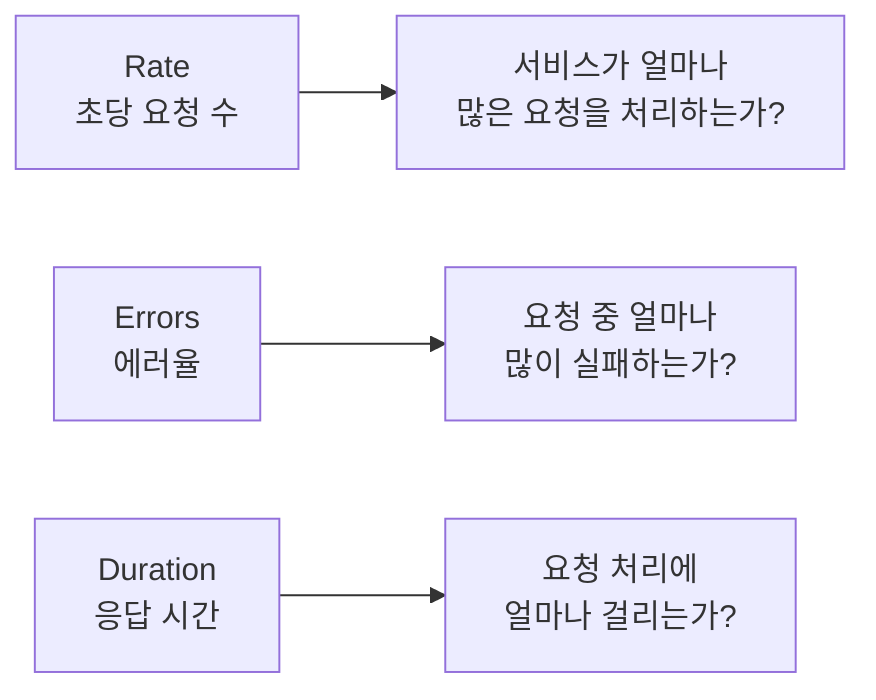

# 1. 들어가며

[편 1](/article/grafana-완벽-가이드-1-prometheus와-grafana-기초)에서는 Prometheus와 Grafana의 기초 개념을 다루고, node-exporter로 시스템 메트릭을 수집해 대시보드를 만들었다. CPU, 메모리, 디스크 같은 인프라 메트릭은 시스템의 건강 상태를 파악하는 데 유용하지만, **애플리케이션에서 실제로 무슨 일이 일어나고 있는지**는 알려주지 않는다.

예를 들어 CPU 사용률이 정상이어도, 특정 API의 응답 시간이 급격히 느려지거나 주문 실패율이 치솟고 있을 수 있다. 이런 문제를 감지하려면 **애플리케이션 레벨의 커스텀 메트릭**이 필요하다.

이 글에서는 다음 내용을 다룬다.

- Go 애플리케이션에 `prometheus/client_golang`으로 커스텀 메트릭 추가
- Echo 미들웨어로 모든 HTTP 요청 자동 계측
- 비즈니스 메트릭 (주문 성공/실패, 처리 시간) 추가
- RED 메서드 기반 Grafana 대시보드 구축
- Grafana Alerting으로 에러율/응답 시간 알림 설정

> 이 글에서 사용한 전체 코드는 [GitHub](https://github.com/kenshin579/tutorials-go/tree/master/monitoring/grafana-metrics)에서 확인할 수 있다.

# 2. Go 애플리케이션에 Prometheus 메트릭 추가

## 2.1 prometheus/client_golang 소개

`prometheus/client_golang`은 Go 애플리케이션에 Prometheus 메트릭을 추가하기 위한 공식 클라이언트 라이브러리다. 메트릭을 정의하고, 값을 업데이트하고, `/metrics` 엔드포인트로 노출하는 기능을 제공한다.

라이브러리를 설치한다.

```bash
> go get github.com/prometheus/client_golang/prometheus
> go get github.com/prometheus/client_golang/prometheus/promhttp
```

기본적인 사용 흐름은 다음과 같다.

1. 메트릭 변수를 정의한다 (`prometheus.NewCounterVec`, `prometheus.NewHistogramVec` 등)
2. `prometheus.MustRegister()`로 메트릭을 등록한다
3. 비즈니스 로직에서 메트릭 값을 업데이트한다 (`.Inc()`, `.Observe()` 등)
4. `promhttp.Handler()`를 `/metrics` 엔드포인트에 연결한다

```go
package main

import (
	"net/http"

	"github.com/prometheus/client_golang/prometheus/promhttp"
)

func main() {
	// /metrics 엔드포인트 노출
	http.Handle("/metrics", promhttp.Handler())
	http.ListenAndServe(":8080", nil)
}
```

`http://localhost:8080/metrics`에 접속하면 Go 런타임 메트릭(`go_goroutines`, `go_memstats_*` 등)이 자동으로 노출된다.

## 2.2 메트릭 타입별 구현

편 1에서 배운 Counter, Gauge, Histogram 3가지 타입을 실제 Go 코드로 구현해보자. 메트릭 정의는 별도 패키지(`metrics/metrics.go`)에 모아두는 것이 관리하기 좋다.

### 2.2.1 Counter — HTTP 요청 수, 에러 수

Counter는 누적 값만 증가하는 메트릭이다. HTTP 요청 수, 에러 수 등을 추적할 때 사용한다. `NewCounterVec`을 사용하면 Label별로 분류할 수 있다.

```go
// metrics/metrics.go
package metrics

import "github.com/prometheus/client_golang/prometheus"

// HTTP 요청 총 수 — method, path, status Label로 분류
var HttpRequestsTotal = prometheus.NewCounterVec(
	prometheus.CounterOpts{
		Name: "http_requests_total",
		Help: "Total number of HTTP requests",
	},
	[]string{"method", "path", "status"},
)

func init() {
	prometheus.MustRegister(HttpRequestsTotal)
}
```

사용 시 `WithLabelValues()`로 Label 값을 지정하고 `Inc()`로 1씩 증가시킨다.

```go
// 요청이 들어올 때마다 카운트
metrics.HttpRequestsTotal.WithLabelValues("GET", "/api/orders", "200").Inc()
```

### 2.2.2 Gauge — 활성 요청 수

Gauge는 현재 상태 값을 나타내며 증가와 감소가 모두 가능하다. 현재 처리 중인 요청 수를 추적하는 데 적합하다.

```go
// 활성 요청 수 — 현재 처리 중인 HTTP 요청
var HttpRequestsInFlight = prometheus.NewGauge(
	prometheus.GaugeOpts{
		Name: "http_requests_in_flight",
		Help: "Number of HTTP requests currently being processed",
	},
)

func init() {
	prometheus.MustRegister(HttpRequestsInFlight)
}
```

요청 시작 시 `Inc()`, 완료 시 `Dec()`를 호출한다.

```go
metrics.HttpRequestsInFlight.Inc()   // 요청 시작
defer metrics.HttpRequestsInFlight.Dec() // 요청 완료
```

### 2.2.3 Histogram — 요청 응답 시간 분포

Histogram은 값의 분포를 버킷(bucket)으로 측정한다. HTTP 응답 시간 분포를 추적하고, 나중에 `histogram_quantile()`로 P50/P90/P99를 계산할 수 있다.

```go
// HTTP 요청 응답 시간 — method, path Label로 분류
var HttpRequestDuration = prometheus.NewHistogramVec(
	prometheus.HistogramOpts{
		Name:    "http_request_duration_seconds",
		Help:    "HTTP request duration in seconds",
		Buckets: prometheus.DefBuckets, // 기본 버킷: 0.005, 0.01, 0.025, 0.05, 0.1, 0.25, 0.5, 1, 2.5, 5, 10
	},
	[]string{"method", "path"},
)

func init() {
	prometheus.MustRegister(HttpRequestDuration)
}
```

`Observe()`로 측정값을 기록한다. `time.Since()`로 경과 시간을 초 단위로 변환해서 전달한다.

```go
start := time.Now()
// ... 요청 처리 ...
duration := time.Since(start).Seconds()
metrics.HttpRequestDuration.WithLabelValues("GET", "/api/orders").Observe(duration)
```

> **Bucket 설정 팁**: `prometheus.DefBuckets`는 일반적인 HTTP 요청에 적합하다. 만약 응답 시간이 매우 짧은 서비스(마이크로초 단위)라면 커스텀 버킷을 설정해야 한다. 반대로 배치 작업처럼 수 초~수 분이 걸리는 경우에도 버킷을 조정해야 정확한 분포를 얻을 수 있다.

## 2.3 비즈니스 메트릭 추가

인프라 메트릭과 HTTP 메트릭 외에, **비즈니스 관점의 메트릭**을 추가하면 서비스 상태를 더 정확하게 파악할 수 있다. 주문 서비스를 예로 들면, 주문 성공/실패 수와 주문 처리 시간이 핵심 비즈니스 메트릭이다.

```go
// 주문 생성 수 — status Label (success, failed)
var OrdersCreatedTotal = prometheus.NewCounterVec(
	prometheus.CounterOpts{
		Name: "orders_created_total",
		Help: "Total number of orders created",
	},
	[]string{"status"},
)

// 주문 처리 시간
var OrderProcessingDuration = prometheus.NewHistogram(
	prometheus.HistogramOpts{
		Name:    "order_processing_duration_seconds",
		Help:    "Time spent processing an order",
		Buckets: []float64{0.01, 0.05, 0.1, 0.25, 0.5, 1, 2.5, 5},
	},
)

func init() {
	prometheus.MustRegister(OrdersCreatedTotal)
	prometheus.MustRegister(OrderProcessingDuration)
}
```

주문 핸들러에서 메트릭을 업데이트한다.

```go
func createOrder(c echo.Context) error {
	start := time.Now()

	// 주문 처리 로직
	order, err := processOrder(c)

	// 처리 시간 기록
	duration := time.Since(start).Seconds()
	metrics.OrderProcessingDuration.Observe(duration)

	if err != nil {
		metrics.OrdersCreatedTotal.WithLabelValues("failed").Inc()
		return c.JSON(http.StatusInternalServerError, map[string]string{"error": err.Error()})
	}

	metrics.OrdersCreatedTotal.WithLabelValues("success").Inc()
	return c.JSON(http.StatusCreated, order)
}
```

## 2.4 Echo 미들웨어로 자동 계측

모든 HTTP 핸들러에 일일이 메트릭 코드를 넣는 것은 번거롭고 누락되기 쉽다. Echo 미들웨어를 만들면 **모든 요청에 자동으로** 메트릭을 수집할 수 있다.

```go
// middleware/prometheus.go
package middleware

import (
	"strconv"
	"time"

	"github.com/labstack/echo/v4"
	"grafana-metrics/metrics"
)

// PrometheusMiddleware는 모든 HTTP 요청에 대해 메트릭을 자동 수집한다
func PrometheusMiddleware() echo.MiddlewareFunc {
	return func(next echo.HandlerFunc) echo.HandlerFunc {
		return func(c echo.Context) error {
			start := time.Now()

			// 활성 요청 수 증가
			metrics.HttpRequestsInFlight.Inc()
			defer metrics.HttpRequestsInFlight.Dec()

			// 다음 핸들러 실행
			err := next(c)

			// 응답 정보 수집
			status := c.Response().Status
			if err != nil {
				if he, ok := err.(*echo.HTTPError); ok {
					status = he.Code
				}
			}

			duration := time.Since(start).Seconds()
			method := c.Request().Method
			path := c.Path() // 패턴 경로 사용 (/api/orders/:id)

			// 메트릭 기록
			metrics.HttpRequestsTotal.WithLabelValues(method, path, strconv.Itoa(status)).Inc()
			metrics.HttpRequestDuration.WithLabelValues(method, path).Observe(duration)

			return err
		}
	}
}
```

> **`c.Path()` vs `c.Request().URL.Path`**: `c.Path()`는 라우트 패턴(`/api/orders/:id`)을 반환하고, `c.Request().URL.Path`는 실제 경로(`/api/orders/123`)를 반환한다. Label에는 반드시 `c.Path()`를 사용해야 한다. 실제 경로를 사용하면 주문 ID마다 별도의 Time Series가 생성되어 카디널리티가 폭발한다.

미들웨어를 Echo에 등록한다.

```go
func main() {
	e := echo.New()

	// Prometheus 미들웨어 등록
	e.Use(middleware.PrometheusMiddleware())

	// /metrics 엔드포인트
	e.GET("/metrics", echo.WrapHandler(promhttp.Handler()))

	// API 라우트
	e.POST("/api/orders", handler.CreateOrder)
	e.GET("/api/orders", handler.ListOrders)
	e.GET("/api/orders/:id", handler.GetOrder)

	e.Start(":8080")
}
```

# 3. 샘플 프로젝트: 주문 서비스

## 3.1 프로젝트 구조

간단한 주문 서비스를 시뮬레이션하는 Go 프로젝트를 구성한다. 실제 데이터베이스 없이 인메모리 저장소를 사용하며, 랜덤 지연과 에러를 발생시켜 의미 있는 메트릭을 만든다.

```
grafana-metrics/
├── main.go                    # 진입점
├── go.mod
├── Dockerfile
├── config/
│   └── config.go              # 서버 설정
├── handler/
│   ├── order_handler.go       # 주문 API 핸들러
│   └── health_handler.go      # 헬스체크
├── metrics/
│   └── metrics.go             # Prometheus 메트릭 정의
├── middleware/
│   └── prometheus.go          # HTTP 메트릭 자동 수집 미들웨어
├── dashboard/
│   └── go-app-dashboard.json  # Grafana 대시보드 JSON
├── docker-compose.yml
├── prometheus/
│   └── prometheus.yml
└── provisioning/
    └── datasources/
        └── datasource.yml
```

## 3.2 API 엔드포인트

주문 서비스는 3개의 API 엔드포인트를 제공한다.

| Method | Path | 설명 | 관련 메트릭 |
|--------|------|------|------------|
| POST | `/api/orders` | 주문 생성 (랜덤 지연/에러 포함) | 요청 수, 응답 시간, 주문 성공/실패 |
| GET | `/api/orders` | 주문 목록 조회 | 요청 수, 응답 시간 |
| GET | `/api/orders/:id` | 주문 상세 조회 | 요청 수, 응답 시간, 404 비율 |
| GET | `/health` | 헬스체크 | - |
| GET | `/metrics` | Prometheus 메트릭 | - |

주문 생성 핸들러는 랜덤으로 50~500ms 지연을 발생시키고, 약 10% 확률로 에러를 반환한다. 이를 통해 대시보드에서 의미 있는 응답 시간 분포와 에러율을 확인할 수 있다.

```go
// handler/order_handler.go
func CreateOrder(c echo.Context) error {
	start := time.Now()

	// 랜덤 지연 시뮬레이션 (50~500ms)
	delay := time.Duration(50+rand.Intn(450)) * time.Millisecond
	time.Sleep(delay)

	// 약 10% 확률로 에러 발생
	if rand.Float64() < 0.1 {
		metrics.OrdersCreatedTotal.WithLabelValues("failed").Inc()
		metrics.OrderProcessingDuration.Observe(time.Since(start).Seconds())
		return c.JSON(http.StatusInternalServerError, map[string]string{
			"error": "order processing failed",
		})
	}

	order := Order{
		ID:        uuid.New().String(),
		Product:   "sample-product",
		Amount:    rand.Intn(10000) + 1000,
		Status:    "created",
		CreatedAt: time.Now(),
	}

	metrics.OrdersCreatedTotal.WithLabelValues("success").Inc()
	metrics.OrderProcessingDuration.Observe(time.Since(start).Seconds())

	return c.JSON(http.StatusCreated, order)
}
```

## 3.3 docker-compose로 전체 스택 실행

편 1의 docker-compose에 Go 앱을 추가한다. Go 앱을 포함한 4개 서비스로 구성된다.

```yaml
# docker-compose.yml
services:
  app:
    build: .
    container_name: go-app
    ports:
      - "8080:8080"

  prometheus:
    image: prom/prometheus:v2.51.0
    container_name: prometheus
    ports:
      - "9090:9090"
    volumes:
      - ./prometheus/prometheus.yml:/etc/prometheus/prometheus.yml
    command:
      - '--config.file=/etc/prometheus/prometheus.yml'
      - '--storage.tsdb.retention.time=7d'

  grafana:
    image: grafana/grafana:11.4.0
    container_name: grafana
    ports:
      - "3000:3000"
    environment:
      - GF_SECURITY_ADMIN_PASSWORD=admin
    volumes:
      - ./provisioning:/etc/grafana/provisioning

  node-exporter:
    image: prom/node-exporter:v1.8.1
    container_name: node-exporter
    ports:
      - "9100:9100"
```

Go 앱의 Dockerfile이다.

```dockerfile
# Dockerfile
FROM golang:1.21-alpine AS builder
WORKDIR /app
COPY go.mod go.sum ./
RUN go mod download
COPY . .
RUN go build -o server .

FROM alpine:latest
WORKDIR /app
COPY --from=builder /app/server .
EXPOSE 8080
CMD ["./server"]
```

Prometheus 설정에 Go 앱 scrape 타겟을 추가한다.

```yaml
# prometheus/prometheus.yml
global:
  scrape_interval: 15s
  evaluation_interval: 15s

scrape_configs:
  - job_name: 'prometheus'
    static_configs:
      - targets: ['localhost:9090']

  - job_name: 'go-app'
    static_configs:
      - targets: ['app:8080']

  - job_name: 'node-exporter'
    static_configs:
      - targets: ['node-exporter:9100']
```

전체 스택을 실행한다.

```bash
> docker compose up -d --build
```

| 서비스 | URL | 설명 |
|--------|-----|------|
| Go 앱 | http://localhost:8080 | 주문 서비스 API |
| Go 앱 메트릭 | http://localhost:8080/metrics | Prometheus 메트릭 |
| Prometheus | http://localhost:9090 | Prometheus 웹 UI |
| Grafana | http://localhost:3000 | Grafana 대시보드 (admin/admin) |

테스트 요청을 보내서 메트릭을 생성한다.

```bash
# 주문 생성 요청 (여러 번 실행)
> curl -X POST http://localhost:8080/api/orders

# 주문 목록 조회
> curl http://localhost:8080/api/orders

# 주문 상세 조회
> curl http://localhost:8080/api/orders/some-id
```

<!-- TODO: Prometheus Targets에서 go-app UP 상태 스크린샷 삽입 -->

Prometheus 웹 UI에서 `http_requests_total`을 검색하면 Go 앱의 커스텀 메트릭이 수집되고 있는 것을 확인할 수 있다.

# 4. Grafana 대시보드 구축

## 4.1 RED 메서드란?

RED 메서드는 마이크로서비스 모니터링을 위한 방법론으로, 3가지 핵심 지표에 집중한다.



| 지표 | 설명 | 메트릭 예시 |
|------|------|-------------|
| **Rate** | 초당 요청 수 | `rate(http_requests_total[5m])` |
| **Errors** | 에러 비율 (%) | `sum(rate(http_requests_total{status=~"5.."}[5m])) / sum(rate(http_requests_total[5m])) * 100` |
| **Duration** | 응답 시간 분포 (P50/P90/P99) | `histogram_quantile(0.99, rate(http_request_duration_seconds_bucket[5m]))` |

> RED 메서드는 **사용자 관점**의 지표이다. 시스템 관점의 USE 메서드(Utilization, Saturation, Errors)와 함께 사용하면 인프라부터 애플리케이션까지 전체 스택을 모니터링할 수 있다.

## 4.2 HTTP 메트릭 대시보드

RED 메서드에 따라 4개의 패널을 구성한다.

### 4.2.1 Panel 1: 초당 요청 수 (Rate)

전체 요청과 상태 코드별 요청 수를 표시한다.

| 항목 | 값 |
|------|---|
| Panel 타입 | Time series |
| Title | 초당 요청 수 (RPS) |
| Unit | reqps (requests/sec) |

```promql
# 전체 초당 요청 수
sum(rate(http_requests_total[5m]))

# 상태 코드별 초당 요청 수
sum by(status) (rate(http_requests_total[5m]))
```

### 4.2.2 Panel 2: 에러율 (Errors)

5xx 응답의 비율을 백분율로 표시한다.

| 항목 | 값 |
|------|---|
| Panel 타입 | Stat + Time series |
| Title | 에러율 (%) |
| Unit | Percent (0-100) |
| Thresholds | 0=green, 1=yellow, 5=red |

```promql
# 에러율 (%)
sum(rate(http_requests_total{status=~"5.."}[5m]))
  / sum(rate(http_requests_total[5m])) * 100
```

### 4.2.3 Panel 3: 응답 시간 P50/P90/P99 (Duration)

응답 시간의 백분위수를 3개 라인으로 표시한다.

| 항목 | 값 |
|------|---|
| Panel 타입 | Time series |
| Title | 응답 시간 (P50 / P90 / P99) |
| Unit | seconds (s) |

```promql
# P50 (중앙값)
histogram_quantile(0.50, sum by(le) (rate(http_request_duration_seconds_bucket[5m])))

# P90
histogram_quantile(0.90, sum by(le) (rate(http_request_duration_seconds_bucket[5m])))

# P99
histogram_quantile(0.99, sum by(le) (rate(http_request_duration_seconds_bucket[5m])))
```

### 4.2.4 Panel 4: 활성 요청 수

현재 처리 중인 요청 수를 실시간으로 표시한다.

| 항목 | 값 |
|------|---|
| Panel 타입 | Gauge |
| Title | 활성 요청 수 |
| Unit | short |

```promql
http_requests_in_flight
```

## 4.3 비즈니스 메트릭 대시보드

HTTP 메트릭 외에 비즈니스 관점의 패널을 추가한다.

### 4.3.1 Panel 5: 주문 성공/실패 추이

주문 성공과 실패 수를 Stacked 영역 차트로 표시한다.

| 항목 | 값 |
|------|---|
| Panel 타입 | Time series (Stacked) |
| Title | 주문 생성 추이 |
| Unit | ops/sec |

```promql
# 주문 성공 수 (초당)
rate(orders_created_total{status="success"}[5m])

# 주문 실패 수 (초당)
rate(orders_created_total{status="failed"}[5m])
```

### 4.3.2 Panel 6: 주문 성공률

전체 주문 대비 성공 비율을 표시한다.

| 항목 | 값 |
|------|---|
| Panel 타입 | Stat |
| Title | 주문 성공률 (%) |
| Unit | Percent (0-100) |
| Thresholds | 95=green, 90=yellow, 0=red |

```promql
# 주문 성공률 (%)
sum(rate(orders_created_total{status="success"}[5m]))
  / sum(rate(orders_created_total[5m])) * 100
```

### 4.3.3 Panel 7: 주문 처리 시간 분포

주문 처리에 걸리는 시간의 P50/P95/P99를 표시한다.

| 항목 | 값 |
|------|---|
| Panel 타입 | Time series |
| Title | 주문 처리 시간 (P50 / P95 / P99) |
| Unit | seconds (s) |

```promql
# P50
histogram_quantile(0.50, rate(order_processing_duration_seconds_bucket[5m]))

# P95
histogram_quantile(0.95, rate(order_processing_duration_seconds_bucket[5m]))

# P99
histogram_quantile(0.99, rate(order_processing_duration_seconds_bucket[5m]))
```

<!-- TODO: 완성된 Go 앱 대시보드 스크린샷 삽입 -->

## 4.4 대시보드 JSON 내보내기/가져오기

Grafana 대시보드는 JSON 형식으로 내보내고 가져올 수 있다. 이를 통해 대시보드를 코드로 관리(Dashboard as Code)할 수 있다.

**내보내기:**

1. 대시보드 화면에서 **Share** 아이콘 클릭
2. **Export** 탭 선택
3. **Save to file** 클릭

**가져오기:**

1. Grafana 좌측 메뉴 → **Dashboards** → **New** → **Import**
2. JSON 파일 업로드 또는 붙여넣기
3. Data source 매핑 후 **Import** 클릭

> 대시보드 JSON을 Git 저장소에 포함시키면 팀원 간 대시보드를 공유하고 버전 관리할 수 있다. 이 프로젝트에서는 `dashboard/go-app-dashboard.json`에 저장한다.

# 5. Grafana Alerting 설정

Grafana Alerting을 사용하면 메트릭이 특정 조건을 초과했을 때 자동으로 알림을 받을 수 있다. 에러율 급증이나 응답 시간 초과 같은 상황을 즉시 감지하는 데 유용하다.

## 5.1 Alert Rule 생성

Grafana 좌측 메뉴 → **Alerting** → **Alert rules** → **New alert rule**에서 알림 규칙을 생성한다.

### 5.1.1 Alert 1: 에러율 급증 (HighErrorRate)

| 항목 | 값 |
|------|---|
| Rule name | HighErrorRate |
| Data source | Prometheus |
| 조건 | 5xx 에러율 > 5% (5분간 지속) |
| Evaluation interval | 1m |
| For | 5m |
| Severity | critical |

```promql
# Alert 조건 쿼리
sum(rate(http_requests_total{status=~"5.."}[5m]))
  / sum(rate(http_requests_total[5m])) * 100 > 5
```

### 5.1.2 Alert 2: 응답 시간 초과 (SlowResponseTime)

| 항목 | 값 |
|------|---|
| Rule name | SlowResponseTime |
| Data source | Prometheus |
| 조건 | P99 응답 시간 > 3초 (5분간 지속) |
| Evaluation interval | 1m |
| For | 5m |
| Severity | warning |

```promql
# Alert 조건 쿼리
histogram_quantile(0.99, sum by(le) (rate(http_request_duration_seconds_bucket[5m]))) > 3
```

### 5.1.3 Alert 3: 주문 실패율 급증 (OrderFailureSpike)

| 항목 | 값 |
|------|---|
| Rule name | OrderFailureSpike |
| Data source | Prometheus |
| 조건 | 주문 실패율 > 10% (5분간 지속) |
| Evaluation interval | 1m |
| For | 5m |
| Severity | critical |

```promql
# Alert 조건 쿼리
sum(rate(orders_created_total{status="failed"}[5m]))
  / sum(rate(orders_created_total[5m])) * 100 > 10
```

전체 Alert Rule을 정리하면 다음과 같다.

| Alert 이름 | 조건 | 심각도 |
|-----------|------|--------|
| HighErrorRate | 5xx 에러율 > 5% (5분간) | critical |
| SlowResponseTime | P99 > 3초 (5분간) | warning |
| OrderFailureSpike | 주문 실패율 > 10% (5분간) | critical |

## 5.2 Contact Point 설정

Alert이 발생하면 알림을 보낼 대상(Contact Point)을 설정해야 한다. Grafana는 Slack, Email, Telegram, PagerDuty 등 다양한 채널을 지원한다.

**Telegram 봇 연동 예시:**

1. Grafana 좌측 메뉴 → **Alerting** → **Contact points** → **New contact point**
2. Name: `Telegram`
3. Integration: **Telegram**
4. BOT API Token: Telegram @BotFather에서 발급받은 토큰 입력
5. Chat ID: 알림을 받을 채팅방 ID 입력
6. **Test** 클릭으로 테스트 알림 전송
7. **Save contact point**

<!-- TODO: Contact Point 설정 스크린샷 삽입 -->

## 5.3 Notification Policy 구성

Notification Policy는 어떤 Alert을 어떤 Contact Point로 보낼지 라우팅 규칙을 정의한다.

**심각도별 라우팅 설정:**

| 조건 | Contact Point | 설명 |
|------|---------------|------|
| severity = critical | Telegram | 즉시 알림 |
| severity = warning | Email | 이메일로 알림 |
| 기본 | Grafana default email | 기타 알림 |

1. Grafana 좌측 메뉴 → **Alerting** → **Notification policies**
2. Default policy에서 Contact point 설정
3. **New nested policy** 추가
4. Label matcher: `severity = critical` → Contact point: `Telegram`

<!-- TODO: Alert 발생 시 Telegram 알림 예시 스크린샷 삽입 -->

# 6. 실전 팁

## 6.1 메트릭 네이밍 Best Practice

Prometheus 공식 네이밍 규칙을 따르면 메트릭의 의미를 직관적으로 파악할 수 있다.

| 규칙 | 예시 | 설명 |
|------|------|------|
| `snake_case` 사용 | `http_requests_total` | camelCase, kebab-case 금지 |
| 단위를 접미사로 | `_seconds`, `_bytes`, `_total` | 단위가 명확해야 함 |
| Counter는 `_total` 접미사 | `http_requests_total` | Counter 타입임을 명시 |
| 기본 단위 사용 | `seconds` (not ms), `bytes` (not KB) | SI 기본 단위 권장 |
| 접두사로 도메인 구분 | `myapp_orders_total` | 다른 서비스 메트릭과 충돌 방지 |

**Label 카디널리티 관리:**

| 좋은 Label | 나쁜 Label | 이유 |
|------------|-----------|------|
| `method` (GET, POST, ...) | `user_id` | 값의 수가 무한 |
| `status` (200, 404, 500, ...) | `request_id` | 요청마다 고유 |
| `path` (라우트 패턴) | `url` (전체 URL) | 쿼리 파라미터 포함 시 무한 |
| `service` (order, payment, ...) | `ip_address` | IP마다 별도 Time Series |

## 6.2 프로덕션 적용 시 주의사항

**Histogram 버킷 튜닝:**

기본 버킷(`prometheus.DefBuckets`)은 0.005초~10초 범위를 다룬다. 서비스 특성에 맞게 버킷을 조정해야 정확한 백분위수를 얻을 수 있다.

```go
// 빠른 API (마이크로초~밀리초)
Buckets: []float64{0.0001, 0.0005, 0.001, 0.005, 0.01, 0.05, 0.1, 0.5}

// 일반 API (밀리초~초)
Buckets: prometheus.DefBuckets // 기본값 사용

// 배치 작업 (초~분)
Buckets: []float64{0.1, 0.5, 1, 5, 10, 30, 60, 120, 300}
```

**메트릭 수가 많아질 때의 성능 영향:**

- 메트릭 수(Time Series 수)가 증가하면 Prometheus의 메모리 사용량이 비례해서 증가한다
- Label 카디널리티를 관리하는 것이 가장 중요하다
- scrape 간격을 무리하게 짧게 설정하지 않는다 (15초가 기본이며 대부분 충분하다)
- 불필요한 메트릭은 `metric_relabel_configs`로 drop할 수 있다

**Grafana 대시보드 로딩 최적화:**

- 시간 범위가 넓을수록 쿼리가 느려진다 (기본 1시간~6시간 권장)
- `rate()` 범위를 scrape 간격의 4배 이상으로 설정한다 (15초 간격이면 `[1m]` 이상)
- 하나의 대시보드에 패널을 너무 많이 넣지 않는다 (10~15개 이내 권장)
- Row를 접어두면(collapsed) 해당 패널 쿼리가 실행되지 않아 로딩이 빨라진다

# 7. 마무리

이 글에서 다룬 핵심 내용을 정리하면 다음과 같다.

- `prometheus/client_golang`으로 **Counter, Gauge, Histogram** 커스텀 메트릭을 Go 애플리케이션에 추가했다
- Echo **미들웨어**로 모든 HTTP 요청에 자동으로 메트릭을 수집하도록 구현했다
- **비즈니스 메트릭**(주문 성공/실패, 처리 시간)을 추가해서 서비스 상태를 더 정확하게 파악할 수 있게 했다
- **RED 메서드**(Rate, Errors, Duration)에 따라 Grafana 대시보드를 구축했다
- Grafana **Alerting**으로 에러율 급증, 응답 시간 초과, 주문 실패율 급증을 자동으로 감지하도록 설정했다
- 메트릭 **네이밍 규칙**과 **Label 카디널리티 관리** 등 프로덕션 적용 시 주의사항을 알아보았다

다음 편에서는 Grafana Tempo를 사용해 Go 애플리케이션에 **분산 트레이싱**을 추가하는 방법을 다룬다. 메트릭으로 "문제가 있다"는 것을 감지했다면, 트레이스로 "어디서 문제가 발생했는지"를 추적할 수 있다.

> 이 글에서 사용한 전체 코드는 [GitHub](https://github.com/kenshin579/tutorials-go/tree/master/monitoring/grafana-metrics)에서 확인할 수 있다.

# 8. 참고

- [Prometheus Client Golang](https://pkg.go.dev/github.com/prometheus/client_golang)
- [Prometheus 메트릭 네이밍 규칙](https://prometheus.io/docs/practices/naming/)
- [RED Method - Tom Wilkie](https://grafana.com/blog/2018/08/02/the-red-method-how-to-instrument-your-services/)
- [Grafana Alerting 공식 문서](https://grafana.com/docs/grafana/latest/alerting/)
- [Echo Framework](https://echo.labstack.com/)
- [Grafana Dashboard Best Practices](https://grafana.com/docs/grafana/latest/dashboards/build-dashboards/best-practices/)
- [Histogram vs Summary](https://prometheus.io/docs/practices/histograms/)
