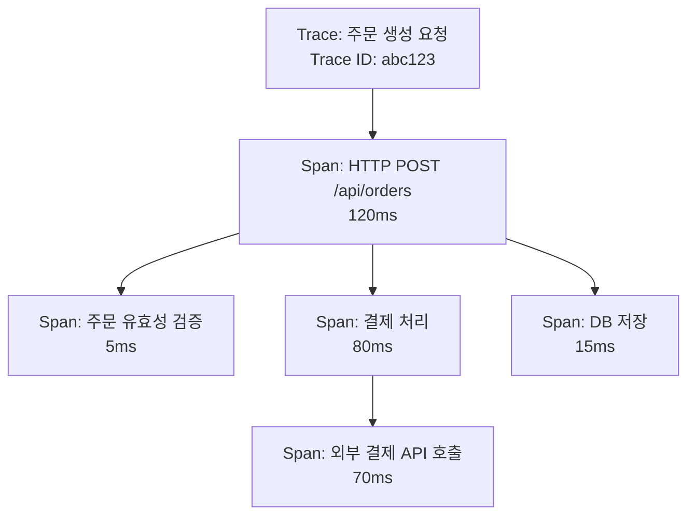
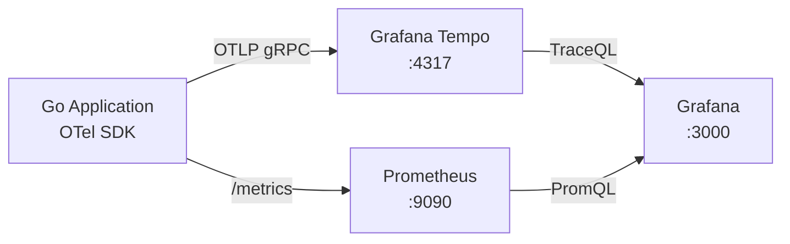
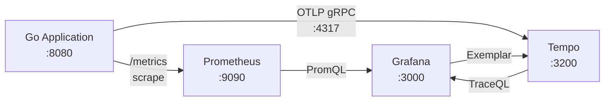

# 1. 들어가며

[편 1](/article/grafana-완벽-가이드-1-prometheus와-grafana-기초)에서 Prometheus와 Grafana의 기초를 다루고, [편 2](/article/grafana-완벽-가이드-2-go-애플리케이션-커스텀-메트릭)에서 Go 애플리케이션에 커스텀 메트릭을 추가해서 대시보드와 알림을 설정했다. 메트릭으로 "에러율이 급증했다", "응답 시간이 느려졌다"는 사실을 감지할 수 있지만, **"왜 느려졌는가?"**, **"어디서 시간이 소요되었는가?"** 라는 질문에는 답하기 어렵다.

이때 필요한 것이 **분산 트레이싱(Distributed Tracing)** 이다. 트레이싱은 하나의 요청이 여러 서비스와 컴포넌트를 거치는 전체 경로를 추적해서, 어디서 병목이 발생했는지 정확히 파악할 수 있게 해준다.

이 글에서는 다음 내용을 다룬다.

- 분산 트레이싱의 핵심 개념: Trace, Span, Context Propagation
- Grafana Tempo의 아키텍처와 특징
- OpenTelemetry SDK로 Go 애플리케이션에 트레이싱 추가
- Echo 미들웨어로 HTTP 요청 자동 트레이싱
- 비즈니스 로직에 커스텀 Span 추가
- Grafana에서 트레이스 조회 및 메트릭과 연결 (Exemplar)

> 이 글에서 사용한 전체 코드는 [GitHub](https://github.com/kenshin579/tutorials-go/tree/master/monitoring/grafana-tracing)에서 확인할 수 있다.

# 2. 분산 트레이싱 핵심 개념

## 2.1 Trace, Span, Context Propagation

분산 트레이싱의 3가지 핵심 개념을 알아보자.

**Trace**는 하나의 요청이 시스템을 통과하는 전체 경로를 나타낸다. 사용자가 주문을 생성하면, API Gateway → 주문 서비스 → 결제 서비스 → 데이터베이스로 이어지는 전체 호출 체인이 하나의 Trace가 된다.

**Span**은 Trace를 구성하는 개별 작업 단위다. 각 Span은 작업 이름, 시작/종료 시간, 속성(Attributes), 상태(Status) 정보를 포함한다. Span은 부모-자식 관계를 가지며, 이를 통해 호출 계층 구조를 표현한다.

**Context Propagation**은 서비스 간에 Trace ID와 Span ID를 전달하는 메커니즘이다. HTTP 헤더(`traceparent`)를 통해 전파되며, 이를 통해 여러 서비스의 Span이 하나의 Trace로 연결된다.



위 다이어그램에서 하나의 Trace는 5개의 Span으로 구성된다. Waterfall 뷰에서 각 Span의 시작 시점과 소요 시간을 시각적으로 확인할 수 있어, 결제 API 호출이 전체 응답 시간의 대부분을 차지한다는 것을 바로 파악할 수 있다.

| 개념 | 설명 | 비유 |
|------|------|------|
| **Trace** | 하나의 요청의 전체 경로 | 택배 추적 번호 |
| **Span** | Trace 내 개별 작업 단위 | 각 배송 구간 (물류센터 → 허브 → 배달) |
| **Context Propagation** | 서비스 간 추적 정보 전달 | 택배 송장이 구간마다 이어지는 것 |

## 2.2 Grafana Tempo란?

Grafana Tempo는 Grafana Labs에서 개발한 오픈소스 분산 트레이싱 백엔드다. 기존 트레이싱 시스템(Jaeger, Zipkin)과 달리, **인덱싱 없이** 트레이스를 Object Storage에 저장하는 것이 핵심 특징이다.

| 비교 항목 | Tempo | Jaeger |
|-----------|-------|--------|
| 인덱싱 | 없음 (Trace ID로만 조회) | Elasticsearch/Cassandra 인덱싱 |
| 저장소 | Object Storage (S3, GCS, 로컬) | Elasticsearch, Cassandra, Badger |
| 운영 비용 | 낮음 (인덱스 없음) | 높음 (인덱스 관리 필요) |
| 쿼리 방식 | TraceQL, Trace ID 검색 | 서비스/태그 기반 검색 |
| Grafana 통합 | 네이티브 (Data Source 내장) | 별도 설정 필요 |
| 프로토콜 호환 | OTLP, Jaeger, Zipkin | Jaeger 전용 |

Tempo의 주요 장점은 다음과 같다.

- **비용 효율적**: 인덱스가 없으므로 저장 비용이 트레이스 볼륨에 비례해서만 증가한다
- **간단한 운영**: Elasticsearch/Cassandra 같은 별도 인덱스 스토리지가 불필요하다
- **TraceQL**: SQL과 유사한 쿼리 언어로 트레이스를 검색할 수 있다
- **Grafana 네이티브 통합**: Grafana에서 메트릭 → 트레이스 연결이 자연스럽다

## 2.3 OpenTelemetry란?

OpenTelemetry(OTel)는 Traces, Metrics, Logs를 수집하기 위한 **벤더 중립 Observability 표준**이다. CNCF(Cloud Native Computing Foundation) 프로젝트로, 특정 벤더에 종속되지 않고 다양한 백엔드(Tempo, Jaeger, Datadog 등)로 데이터를 전송할 수 있다.



| OTel 구성 요소 | 역할 |
|----------------|------|
| **API** | 트레이싱/메트릭/로그를 위한 인터페이스 정의 |
| **SDK** | API의 구현체. TracerProvider, SpanProcessor 등 |
| **Exporter** | 수집한 데이터를 백엔드(Tempo)로 전송 |
| **Instrumentation** | 자동 계측 라이브러리 (otelecho, otelhttp 등) |

이 글에서 사용하는 OTel 관련 Go 라이브러리는 다음과 같다.

| 라이브러리 | 용도 |
|-----------|------|
| `go.opentelemetry.io/otel` | OTel API 핵심 패키지 |
| `go.opentelemetry.io/otel/sdk/trace` | TracerProvider, SpanProcessor |
| `go.opentelemetry.io/otel/exporters/otlp/otlptrace/otlptracegrpc` | OTLP gRPC Exporter (Tempo 전송) |
| `go.opentelemetry.io/contrib/instrumentation/github.com/labstack/echo/otelecho` | Echo 자동 트레이싱 미들웨어 |

# 3. 로컬 환경 구축 (docker-compose)

## 3.1 Tempo 추가 구성

편 2의 docker-compose에 Tempo 서비스를 추가한다. 전체 스택은 Go 앱 + Prometheus + Tempo + Grafana 4개 서비스로 구성된다.

```yaml
# docker-compose.yml
services:
  app:
    build: .
    container_name: go-app
    ports:
      - "8080:8080"
    environment:
      - OTEL_EXPORTER_OTLP_ENDPOINT=tempo:4317

  prometheus:
    image: prom/prometheus:v2.51.0
    container_name: prometheus
    ports:
      - "9090:9090"
    volumes:
      - ./prometheus/prometheus.yml:/etc/prometheus/prometheus.yml
    command:
      - '--config.file=/etc/prometheus/prometheus.yml'
      - '--storage.tsdb.retention.time=7d'

  tempo:
    image: grafana/tempo:2.6.1
    container_name: tempo
    ports:
      - "3200:3200"    # Tempo API
      - "4317:4317"    # OTLP gRPC (트레이스 수신)
    volumes:
      - ./tempo/tempo.yml:/etc/tempo/tempo.yml
    command: ["-config.file=/etc/tempo/tempo.yml"]

  grafana:
    image: grafana/grafana:11.4.0
    container_name: grafana
    ports:
      - "3000:3000"
    environment:
      - GF_SECURITY_ADMIN_PASSWORD=admin
    volumes:
      - ./provisioning:/etc/grafana/provisioning
```

Tempo 설정 파일을 작성한다.

```yaml
# tempo/tempo.yml
server:
  http_listen_port: 3200

distributor:
  receivers:
    otlp:
      protocols:
        grpc:
          endpoint: "0.0.0.0:4317"

storage:
  trace:
    backend: local
    local:
      path: /tmp/tempo/blocks
    wal:
      path: /tmp/tempo/wal

metrics_generator:
  storage:
    path: /tmp/tempo/generator/wal
```

Grafana provisioning에 Tempo Data Source를 추가한다.

```yaml
# provisioning/datasources/datasource.yml
apiVersion: 1

datasources:
  - name: Prometheus
    type: prometheus
    access: proxy
    url: http://prometheus:9090
    isDefault: true
    editable: true

  - name: Tempo
    type: tempo
    access: proxy
    url: http://tempo:3200
    editable: true
    jsonData:
      tracesToMetrics:
        datasourceUid: prometheus
      nodeGraph:
        enabled: true
```

> `tracesToMetrics` 설정은 트레이스에서 메트릭으로의 연결을 활성화한다. `nodeGraph`를 활성화하면 Grafana에서 서비스 간 호출 관계를 그래프로 시각화할 수 있다.

## 3.2 전체 스택 확인

전체 데이터 흐름을 정리하면 다음과 같다.



메트릭은 Prometheus가 Pull 방식으로 수집하고, 트레이스는 Go 앱이 OTLP gRPC로 Tempo에 직접 Push한다. Grafana는 두 데이터 소스를 모두 조회하며, Exemplar를 통해 메트릭에서 트레이스로 연결할 수 있다.

전체 스택을 실행한다.

```bash
> docker compose up -d --build
```

| 서비스 | URL | 설명 |
|--------|-----|------|
| Go 앱 | http://localhost:8080 | 주문 서비스 API |
| Prometheus | http://localhost:9090 | Prometheus 웹 UI |
| Tempo API | http://localhost:3200 | Tempo HTTP API |
| Grafana | http://localhost:3000 | Grafana 대시보드 (admin/admin) |

<!-- TODO: Grafana Data Sources에서 Tempo 연결 확인 스크린샷 삽입 -->

# 4. Go 애플리케이션에 OpenTelemetry 트레이싱 추가

## 4.1 OTel SDK 초기화

먼저 필요한 라이브러리를 설치한다.

```bash
> go get go.opentelemetry.io/otel
> go get go.opentelemetry.io/otel/sdk/trace
> go get go.opentelemetry.io/otel/exporters/otlp/otlptrace/otlptracegrpc
> go get go.opentelemetry.io/contrib/instrumentation/github.com/labstack/echo/otelecho
```

TracerProvider를 초기화하는 함수를 작성한다. 이 함수는 OTLP gRPC Exporter를 설정해서 Tempo로 트레이스를 전송한다.

```go
// tracing/tracer.go
package tracing

import (
	"context"
	"log"
	"os"

	"go.opentelemetry.io/otel"
	"go.opentelemetry.io/otel/exporters/otlp/otlptrace/otlptracegrpc"
	"go.opentelemetry.io/otel/propagation"
	"go.opentelemetry.io/otel/sdk/resource"
	sdktrace "go.opentelemetry.io/otel/sdk/trace"
	semconv "go.opentelemetry.io/otel/semconv/v1.24.0"
	"google.golang.org/grpc"
	"google.golang.org/grpc/credentials/insecure"
)

// InitTracer는 OpenTelemetry TracerProvider를 초기화한다
func InitTracer(ctx context.Context) (*sdktrace.TracerProvider, error) {
	// OTLP gRPC Exporter 생성
	endpoint := os.Getenv("OTEL_EXPORTER_OTLP_ENDPOINT")
	if endpoint == "" {
		endpoint = "localhost:4317"
	}

	conn, err := grpc.NewClient(endpoint,
		grpc.WithTransportCredentials(insecure.NewCredentials()),
	)
	if err != nil {
		return nil, err
	}

	exporter, err := otlptracegrpc.New(ctx, otlptracegrpc.WithGRPCConn(conn))
	if err != nil {
		return nil, err
	}

	// 서비스 정보를 Resource로 설정
	res, err := resource.New(ctx,
		resource.WithAttributes(
			semconv.ServiceName("order-service"),
			semconv.ServiceVersion("1.0.0"),
		),
	)
	if err != nil {
		return nil, err
	}

	// TracerProvider 생성
	tp := sdktrace.NewTracerProvider(
		sdktrace.WithBatcher(exporter),
		sdktrace.WithResource(res),
	)

	// 전역 TracerProvider 등록
	otel.SetTracerProvider(tp)

	// Context Propagation 설정 (W3C Trace Context)
	otel.SetTextMapPropagator(propagation.TraceContext{})

	log.Println("OpenTelemetry tracer initialized")
	return tp, nil
}
```

주요 설정 항목을 정리하면 다음과 같다.

| 항목 | 설명 | 기본값 |
|------|------|--------|
| `OTEL_EXPORTER_OTLP_ENDPOINT` | Tempo OTLP gRPC 엔드포인트 | `localhost:4317` |
| `ServiceName` | 서비스 이름 (Grafana에서 식별) | - |
| `WithBatcher` | Span을 배치로 모아서 전송 (성능 최적화) | 5초 간격, 512개 |
| `TraceContext` | W3C Trace Context 형식으로 전파 | - |

`main.go`에서 TracerProvider를 초기화하고, 종료 시 정리한다.

```go
// main.go
func main() {
	ctx := context.Background()

	// TracerProvider 초기화
	tp, err := tracing.InitTracer(ctx)
	if err != nil {
		log.Fatal(err)
	}
	defer func() {
		if err := tp.Shutdown(ctx); err != nil {
			log.Printf("Error shutting down tracer provider: %v", err)
		}
	}()

	e := echo.New()
	// ... 미들웨어, 라우트 설정 ...
	e.Start(":8080")
}
```

> `tp.Shutdown()`을 호출해야 버퍼에 남아 있는 Span이 Tempo로 전송된다. 이 호출을 누락하면 애플리케이션 종료 직전의 트레이스가 유실될 수 있다.

## 4.2 Echo 미들웨어로 HTTP 자동 트레이싱

`otelecho` 미들웨어를 적용하면 모든 HTTP 요청에 대해 자동으로 Span이 생성된다. 수동으로 Span을 만들 필요 없이, 요청 경로, 메서드, 상태 코드 등이 자동으로 Span 속성에 기록된다.

```go
import "go.opentelemetry.io/contrib/instrumentation/github.com/labstack/echo/otelecho"

func main() {
	// ... TracerProvider 초기화 ...

	e := echo.New()

	// OTel Echo 미들웨어 적용
	e.Use(otelecho.Middleware("order-service"))

	// API 라우트
	e.POST("/api/orders", handler.CreateOrder)
	e.GET("/api/orders", handler.ListOrders)
	e.GET("/api/orders/:id", handler.GetOrder)

	e.Start(":8080")
}
```

`otelecho.Middleware("order-service")`가 하나의 미들웨어 호출로 해주는 것은 다음과 같다.

| 자동 기록 항목 | Span 속성 | 예시 |
|----------------|-----------|------|
| HTTP 메서드 | `http.method` | `POST` |
| 요청 경로 | `http.route` | `/api/orders/:id` |
| 상태 코드 | `http.status_code` | `201` |
| URL | `http.url` | `http://localhost:8080/api/orders` |
| 에러 여부 | `otel.status_code` | `ERROR` |

## 4.3 커스텀 Span 추가

자동 트레이싱만으로는 HTTP 요청 내부에서 어떤 작업이 시간을 소요하는지 알 수 없다. 비즈니스 로직에 **커스텀 Span**을 추가하면 세밀한 분석이 가능해진다.

```go
// handler/order_handler.go
package handler

import (
	"context"
	"math/rand"
	"net/http"
	"time"

	"github.com/labstack/echo/v4"
	"go.opentelemetry.io/otel"
	"go.opentelemetry.io/otel/attribute"
	"go.opentelemetry.io/otel/codes"
	"go.opentelemetry.io/otel/trace"
)

var tracer = otel.Tracer("order-service")

func CreateOrder(c echo.Context) error {
	ctx := c.Request().Context()

	// 주문 유효성 검증 Span
	order, err := validateOrder(ctx, c)
	if err != nil {
		return c.JSON(http.StatusBadRequest, map[string]string{"error": err.Error()})
	}

	// 결제 처리 Span
	if err := processPayment(ctx, order); err != nil {
		return c.JSON(http.StatusInternalServerError, map[string]string{"error": "payment failed"})
	}

	// DB 저장 Span
	if err := saveOrder(ctx, order); err != nil {
		return c.JSON(http.StatusInternalServerError, map[string]string{"error": "save failed"})
	}

	return c.JSON(http.StatusCreated, order)
}

func validateOrder(ctx context.Context, c echo.Context) (*Order, error) {
	// 커스텀 Span 생성
	ctx, span := tracer.Start(ctx, "validate-order")
	defer span.End()

	// 유효성 검증 시뮬레이션
	time.Sleep(time.Duration(1+rand.Intn(5)) * time.Millisecond)

	order := &Order{
		ID:      generateID(),
		Product: "sample-product",
		Amount:  rand.Intn(10000) + 1000,
	}

	// Span에 속성 추가
	span.SetAttributes(
		attribute.String("order.id", order.ID),
		attribute.Int("order.amount", order.Amount),
		attribute.String("order.product", order.Product),
	)

	return order, nil
}

func processPayment(ctx context.Context, order *Order) error {
	ctx, span := tracer.Start(ctx, "process-payment")
	defer span.End()

	// 결제 처리 시뮬레이션 (50~200ms 소요)
	delay := time.Duration(50+rand.Intn(150)) * time.Millisecond
	time.Sleep(delay)

	span.SetAttributes(
		attribute.String("payment.order_id", order.ID),
		attribute.Int("payment.amount", order.Amount),
	)

	// 약 5% 확률로 결제 실패
	if rand.Float64() < 0.05 {
		span.SetStatus(codes.Error, "payment processing failed")
		span.RecordError(fmt.Errorf("payment gateway timeout"))

		// Span Event 기록
		span.AddEvent("payment-failed", trace.WithAttributes(
			attribute.String("reason", "gateway_timeout"),
		))
		return fmt.Errorf("payment failed")
	}

	span.AddEvent("payment-completed")
	return nil
}

func saveOrder(ctx context.Context, order *Order) error {
	_, span := tracer.Start(ctx, "save-order")
	defer span.End()

	// DB 저장 시뮬레이션 (5~20ms)
	time.Sleep(time.Duration(5+rand.Intn(15)) * time.Millisecond)

	span.SetAttributes(
		attribute.String("db.system", "memory"),
		attribute.String("db.operation", "INSERT"),
	)

	return nil
}
```

Span을 다룰 때 사용하는 주요 메서드를 정리한다.

| 메서드 | 용도 | 예시 |
|--------|------|------|
| `tracer.Start(ctx, name)` | 새 Span 생성 | `tracer.Start(ctx, "process-payment")` |
| `span.End()` | Span 종료 (defer로 호출) | `defer span.End()` |
| `span.SetAttributes()` | Span에 key-value 속성 추가 | `attribute.String("order.id", id)` |
| `span.SetStatus()` | Span 상태 설정 (OK, Error) | `span.SetStatus(codes.Error, "msg")` |
| `span.RecordError()` | 에러 정보 기록 | `span.RecordError(err)` |
| `span.AddEvent()` | 시점 이벤트 기록 | `span.AddEvent("payment-completed")` |

> **ctx 전달이 핵심이다**: `tracer.Start(ctx, name)`에서 부모 Span의 context를 전달해야 부모-자식 관계가 올바르게 형성된다. context를 전달하지 않으면 Span이 독립적으로 생성되어 Trace가 끊어진다.

## 4.4 서비스 간 Context Propagation

마이크로서비스 아키텍처에서 서비스 A가 서비스 B를 HTTP로 호출할 때, Trace Context를 전파해야 두 서비스의 Span이 하나의 Trace로 연결된다.

OTel의 `otelhttp` 라이브러리를 사용하면 HTTP 클라이언트에 자동으로 `traceparent` 헤더를 추가할 수 있다.

```bash
> go get go.opentelemetry.io/contrib/instrumentation/net/http/otelhttp
```

```go
import "go.opentelemetry.io/contrib/instrumentation/net/http/otelhttp"

// OTel이 적용된 HTTP 클라이언트 생성
var httpClient = &http.Client{
	Transport: otelhttp.NewTransport(http.DefaultTransport),
}

func callExternalAPI(ctx context.Context, orderID string) error {
	ctx, span := tracer.Start(ctx, "call-external-api")
	defer span.End()

	// ctx를 포함한 요청 생성 — traceparent 헤더가 자동 추가됨
	req, err := http.NewRequestWithContext(ctx, "POST", "http://payment-service:8081/pay", nil)
	if err != nil {
		return err
	}

	resp, err := httpClient.Do(req)
	if err != nil {
		span.RecordError(err)
		span.SetStatus(codes.Error, "external API call failed")
		return err
	}
	defer resp.Body.Close()

	span.SetAttributes(
		attribute.Int("http.response.status_code", resp.StatusCode),
	)

	return nil
}
```

전파되는 HTTP 헤더 예시:

```
traceparent: 00-abc123def456789-span123456-01
```

| 필드 | 값 | 설명 |
|------|---|------|
| version | `00` | W3C Trace Context 버전 |
| trace-id | `abc123def456789` | 전체 Trace의 고유 ID |
| parent-id | `span123456` | 부모 Span ID |
| trace-flags | `01` | 샘플링 플래그 (01 = 샘플링됨) |

# 5. Grafana에서 트레이스 분석

## 5.1 Explore에서 트레이스 조회

Grafana의 **Explore** 기능에서 Tempo Data Source를 선택하면 트레이스를 조회할 수 있다.

**Trace ID로 검색:**

1. Grafana 좌측 메뉴 → **Explore**
2. Data source에서 **Tempo** 선택
3. Query type: **TraceQL**
4. Trace ID를 직접 입력하거나 TraceQL 쿼리 실행

**TraceQL 기본 쿼리:**

```
# 특정 서비스의 트레이스 조회
{ resource.service.name = "order-service" }

# 에러가 발생한 Span 검색
{ status = error }

# 특정 HTTP 경로의 트레이스
{ span.http.route = "/api/orders" }

# 500ms 이상 걸린 Span
{ duration > 500ms }

# 조건 조합: 에러이면서 500ms 이상
{ status = error && duration > 500ms }
```

주요 TraceQL 필터를 정리한다.

| 필터 | 설명 | 예시 |
|------|------|------|
| `resource.service.name` | 서비스 이름 | `= "order-service"` |
| `span.http.route` | HTTP 라우트 경로 | `= "/api/orders"` |
| `span.http.status_code` | HTTP 상태 코드 | `>= 500` |
| `status` | Span 상태 | `= error` |
| `duration` | Span 소요 시간 | `> 500ms` |
| `name` | Span 이름 | `= "process-payment"` |

<!-- TODO: Grafana Explore에서 Trace 조회 결과 (Waterfall 뷰) 스크린샷 삽입 -->

Waterfall 뷰에서 각 Span의 소요 시간을 시각적으로 확인할 수 있다. 결제 처리(`process-payment`) Span이 전체 요청 시간의 대부분을 차지하는 것을 바로 파악할 수 있다.

테스트 요청을 보내서 트레이스를 생성한다.

```bash
# 주문 생성 요청 (여러 번 실행)
> curl -X POST http://localhost:8080/api/orders

# 주문 목록 조회
> curl http://localhost:8080/api/orders
```

## 5.2 메트릭 → 트레이스 연결 (Exemplar)

Exemplar는 메트릭 데이터 포인트에 Trace ID를 연결하는 기능이다. Grafana 대시보드에서 "응답 시간이 느린 시점"을 클릭하면 해당 시점의 트레이스로 바로 이동할 수 있다.

**Exemplar 동작 흐름:**

1. Go 앱에서 Histogram 메트릭 기록 시 현재 Span의 Trace ID를 Exemplar로 첨부
2. Prometheus가 Exemplar가 포함된 메트릭을 scrape
3. Grafana 대시보드에서 Exemplar 포인트(점)를 클릭하면 Tempo의 해당 Trace로 이동

Prometheus 미들웨어에서 Exemplar를 추가하는 코드다.

```go
// middleware/prometheus.go
import (
	"github.com/prometheus/client_golang/prometheus"
	"go.opentelemetry.io/otel/trace"
)

// Exemplar가 포함된 Histogram 기록
func observeWithExemplar(histogram *prometheus.HistogramVec, ctx context.Context, duration float64, labels ...string) {
	spanCtx := trace.SpanContextFromContext(ctx)
	if spanCtx.HasTraceID() {
		histogram.WithLabelValues(labels...).
			(prometheus.ExemplarObserver).
			ObserveWithExemplar(duration, prometheus.Labels{
				"traceID": spanCtx.TraceID().String(),
			})
	} else {
		histogram.WithLabelValues(labels...).Observe(duration)
	}
}
```

Prometheus 설정에서 Exemplar를 활성화한다.

```yaml
# prometheus/prometheus.yml
global:
  scrape_interval: 15s
  evaluation_interval: 15s

scrape_configs:
  - job_name: 'go-app'
    static_configs:
      - targets: ['app:8080']
    # Exemplar 수집을 위해 OpenMetrics 형식 활성화
    scrape_protocols:
      - OpenMetricsText1.0.0
      - PrometheusProto
```

<!-- TODO: Grafana 대시보드에서 Exemplar 포인트 클릭 → Trace 연결 스크린샷 삽입 -->

> Exemplar는 메트릭과 트레이스를 연결하는 **가장 강력한 기능** 중 하나다. "응답 시간이 갑자기 높아진 시점"에서 한 번의 클릭으로 해당 요청의 전체 호출 경로를 추적할 수 있다.

## 5.3 트레이스 기반 대시보드

트레이스 데이터를 활용해 대시보드 패널을 구성할 수 있다.

### 5.3.1 서비스 맵 (Node Graph)

Tempo Data Source의 Node Graph 기능을 활성화하면, 서비스 간 호출 관계를 자동으로 시각화한다.

1. Grafana 좌측 메뉴 → **Explore**
2. Data source: **Tempo**
3. Query type: **Service Graph**

<!-- TODO: Service Graph (Node Graph) 스크린샷 삽입 -->

### 5.3.2 에러 트레이스 필터링

에러가 발생한 트레이스만 필터링해서 패널을 구성할 수 있다.

```
# 에러 트레이스만 조회
{ resource.service.name = "order-service" && status = error }

# 결제 실패 트레이스
{ name = "process-payment" && status = error }
```

### 5.3.3 느린 요청 트레이스

응답 시간이 특정 임계값을 초과한 트레이스를 조회한다.

```
# 1초 이상 걸린 주문 요청
{ resource.service.name = "order-service" && span.http.route = "/api/orders" && duration > 1s }
```

# 6. 실전 팁

## 6.1 Sampling 전략

프로덕션 환경에서 모든 요청을 트레이싱하면 저장 비용과 네트워크 오버헤드가 급격히 증가한다. Sampling 전략으로 트레이스 수를 제한할 수 있다.

| Sampling 방식 | 설명 | 적합한 경우 |
|---------------|------|------------|
| **Always** | 모든 요청 트레이싱 | 개발/테스트 환경 |
| **Probability** | 일정 확률로 샘플링 (예: 10%) | 일반 프로덕션 |
| **Rate Limiting** | 초당 최대 N개만 샘플링 | 트래픽이 불규칙한 환경 |
| **Tail-based** | 완료 후 조건에 따라 결정 (에러, 느린 요청) | 중요한 트레이스만 보관 |

```go
// Probability Sampling (10%)
tp := sdktrace.NewTracerProvider(
	sdktrace.WithSampler(sdktrace.TraceIDRatioBased(0.1)),
	sdktrace.WithBatcher(exporter),
	sdktrace.WithResource(res),
)

// Rate Limiting 방식은 OTel Collector에서 설정
```

> **프로덕션 권장**: 트래픽이 많은 서비스는 **1~10% Probability Sampling**으로 시작하고, 에러나 느린 요청은 별도로 100% 수집하는 Tail-based Sampling을 함께 사용하는 것이 좋다.

## 6.2 트레이싱 오버헤드 관리

트레이싱은 각 요청에 추가적인 처리를 수반한다. 오버헤드를 최소화하기 위한 팁을 정리한다.

**성능 영향 최소화:**

| 항목 | 권장 사항 |
|------|----------|
| Exporter | gRPC 사용 (HTTP보다 효율적) |
| BatchSpanProcessor | 기본 설정 사용 (5초 간격 배치 전송) |
| Sampling | 프로덕션에서 반드시 적용 |
| Span 수 | 요청당 10~20개 이내로 제한 |

**불필요한 Span 줄이기:**

- 매우 빈번하게 호출되는 내부 함수에는 Span을 추가하지 않는다
- 루프 내부에서 매 반복마다 Span을 생성하지 않는다
- 캐시 히트처럼 즉시 완료되는 작업에는 Span 대신 Span Event를 사용한다

```go
// 나쁜 예: 루프마다 Span 생성
for _, item := range items {
	_, span := tracer.Start(ctx, "process-item") // 아이템이 1000개면 1000개의 Span
	processItem(item)
	span.End()
}

// 좋은 예: 전체 루프에 하나의 Span + Event로 기록
_, span := tracer.Start(ctx, "process-items")
span.SetAttributes(attribute.Int("items.count", len(items)))
for _, item := range items {
	processItem(item)
}
span.End()
```

# 7. 마무리

이 글에서 다룬 핵심 내용을 정리하면 다음과 같다.

- **분산 트레이싱**은 Trace → Span → Context Propagation 구조로, 요청의 전체 경로를 추적한다
- **Grafana Tempo**는 인덱싱 없이 트레이스를 저장하는 비용 효율적인 백엔드다
- **OpenTelemetry SDK**로 Go 애플리케이션에 트레이싱을 추가하고, OTLP gRPC로 Tempo에 전송했다
- `otelecho` 미들웨어로 HTTP 요청을 **자동 트레이싱**하고, 비즈니스 로직에 **커스텀 Span**을 추가했다
- **Exemplar**를 통해 Grafana에서 메트릭 → 트레이스로 한 번의 클릭으로 이동할 수 있다
- **TraceQL**로 에러 트레이스, 느린 요청을 필터링하고, Sampling 전략으로 프로덕션 오버헤드를 관리한다

편 1~3을 통해 Observability의 Metrics와 Traces를 모두 갖추었다. 다음 편에서는 **Grafana Pyroscope**를 사용해 Go 애플리케이션의 **Continuous Profiling**을 다룬다. "어디서 느려졌는가?"를 트레이스로 파악했다면, "왜 느린가?"를 프로파일링으로 분석할 수 있다.

> 이 글에서 사용한 전체 코드는 [GitHub](https://github.com/kenshin579/tutorials-go/tree/master/monitoring/grafana-tracing)에서 확인할 수 있다.

# 8. 참고

- [Grafana Tempo 공식 문서](https://grafana.com/docs/tempo/latest/)
- [OpenTelemetry Go SDK](https://opentelemetry.io/docs/languages/go/)
- [TraceQL 쿼리 언어](https://grafana.com/docs/tempo/latest/traceql/)
- [OpenTelemetry Specification](https://opentelemetry.io/docs/specs/otel/)
- [W3C Trace Context](https://www.w3.org/TR/trace-context/)
- [Grafana Exemplar 문서](https://grafana.com/docs/grafana/latest/fundamentals/exemplars/)
- [OTel Echo 미들웨어](https://pkg.go.dev/go.opentelemetry.io/contrib/instrumentation/github.com/labstack/echo/otelecho)
