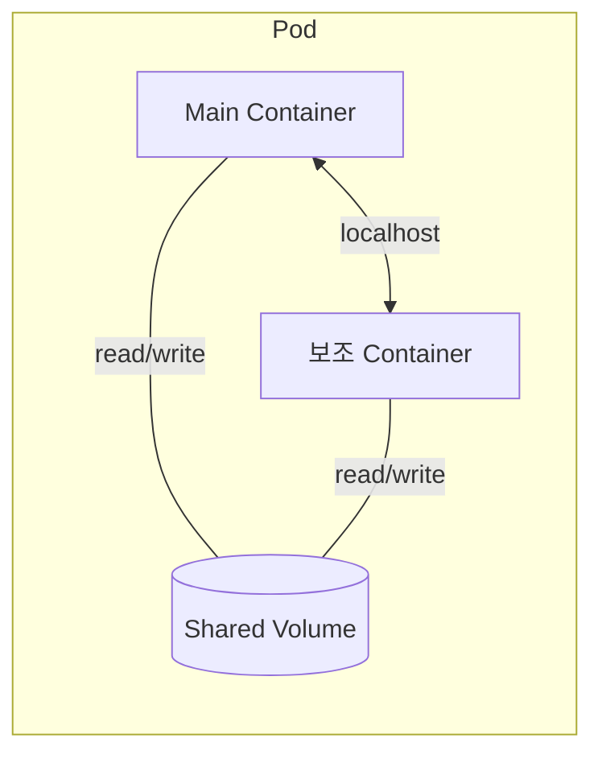
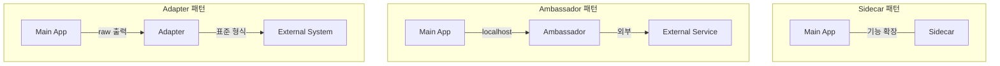
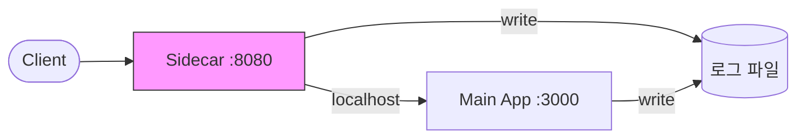
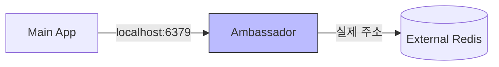
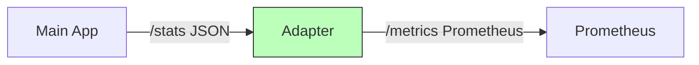
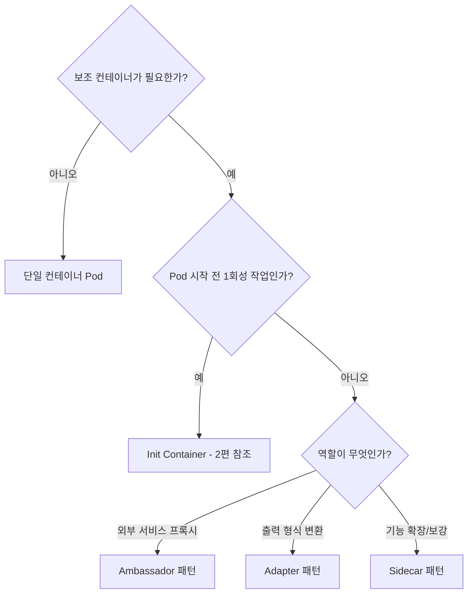

> **K8s Pod 디자인 패턴 시리즈**
> - **1편**: Sidecar, Ambassador, Adapter (현재 글)
> - **2편**: [Init Container 완벽 가이드](../k8s-pod-디자인-패턴-2-init-container-완벽-가이드)
> - **3편**: [Native Sidecar (KEP-753)](../k8s-pod-디자인-패턴-3-native-sidecar-kep-753)

Kubernetes에서 하나의 Pod에 여러 컨테이너를 넣는 이유는 뭘까? 이 글에서는 Multi-Container Pod의 3가지 런타임 패턴인 **Sidecar**, **Ambassador**, **Adapter**를 개념부터 실전 예제까지 다룬다. 직접 만든 Go 코드와 Kind 클러스터로 각 패턴을 실습하고, 언제 어떤 패턴을 써야 하는지 비교 정리한다.

> 전체 코드: [tutorials-go/kubernetes/pod-design-patterns/](https://github.com/kenshin579/tutorials-go/tree/master/kubernetes/pod-design-patterns)

## 1. 실습 환경 준비

### 1.1 사전 준비물

다음 도구가 설치되어 있어야 한다.

- [Docker](https://docs.docker.com/get-docker/)
- [kubectl](https://kubernetes.io/docs/tasks/tools/)
- [Kind](https://kind.sigs.k8s.io/docs/user/quick-start/#installation)

```bash
# 설치 확인
docker --version
kubectl version --client
kind --version
```

### 1.2 Kind 클러스터 생성

Kind(Kubernetes in Docker)를 사용하면 로컬에서 K8s 클러스터를 빠르게 만들 수 있다.

```yaml
# kind-config.yaml
kind: Cluster
apiVersion: kind.x-k8s.io/v1alpha4
nodes:
  - role: control-plane
  - role: worker
  - role: worker
```

```bash
# 클러스터 생성
kind create cluster --name pod-patterns --config kind-config.yaml

# 연결 확인
kubectl cluster-info --context kind-pod-patterns
kubectl get nodes
```

### 1.3 샘플 이미지 빌드 & 로드

이 글에서 사용할 Go 앱 이미지를 빌드하고 Kind 클러스터에 로드한다. Docker Hub 없이 로컬에서 모든 작업이 완결된다.

```bash
# 레포 클론
git clone https://github.com/kenshin579/tutorials-go.git
cd tutorials-go/kubernetes/pod-design-patterns

# 전체 빌드 + 클러스터 로드
make build load
```

빌드되는 이미지 목록:

| 이미지 | 설명 | 사용 패턴 |
|--------|------|-----------|
| `main-app:local` | 간단한 Go HTTP 서버 (포트 3000) | 전 패턴 공통 |
| `request-logger:local` | Reverse Proxy + 요청 로깅 Sidecar | Sidecar |
| `redis-proxy:local` | TCP 프록시 (Redis Ambassador) | Ambassador |
| `metrics-adapter:local` | JSON → Prometheus 형식 변환 | Adapter |

## 2. Multi-Container Pod이란?

### 2.1 왜 하나의 Pod에 여러 컨테이너를 넣는가?

Kubernetes의 기본 원칙은 **"하나의 프로세스 = 하나의 컨테이너"**다. 그런데 왜 하나의 Pod에 여러 컨테이너를 넣을까?

Pod 내 컨테이너들은 다음을 **공유**한다:

- **네트워크**: 같은 Pod의 컨테이너끼리 `localhost`로 통신
- **스토리지**: `emptyDir` 등 Volume을 공유
- **라이프사이클**: 같은 노드에서 함께 스케줄링, 함께 종료

이 특성을 활용하면 **메인 앱의 코드를 변경하지 않고** 로깅, 프록시, 모니터링 같은 부가 기능을 붙일 수 있다. 이것이 Multi-Container Pod 패턴의 핵심이다.



### 2.2 3가지 런타임 패턴 개요

Pod와 함께 실행되는 보조 컨테이너는 그 **역할**에 따라 3가지 패턴으로 나뉜다.



| 패턴 | 역할 | 통신 방향 | 대표 사례 |
|------|------|-----------|-----------|
| **Sidecar** | 메인 앱 기능 확장/보강 | 양방향 | 로그 수집, 서비스 메시 |
| **Ambassador** | 외부 서비스 접근을 프록시 | 앱 → Ambassador → 외부 | DB 프록시, API Gateway |
| **Adapter** | 출력을 표준 형식으로 변환 | 앱 → Adapter → 외부 시스템 | Prometheus exporter |

> Init Container는 Pod 시작 **전**에 실행되는 별도의 패턴이다. [2편](../k8s-pod-디자인-패턴-2-init-container-완벽-가이드)에서 다룬다.

## 3. Sidecar 패턴

### 3.1 개념

Sidecar 패턴은 **메인 컨테이너의 코드를 변경하지 않고 기능을 확장**하는 패턴이다. 오토바이에 달린 사이드카처럼, 메인 앱 옆에서 보조 역할을 수행한다.

핵심 원칙은 **관심사 분리(Separation of Concerns)**다. 메인 앱은 비즈니스 로직에만 집중하고, 로깅/모니터링/보안 같은 횡단 관심사(Cross-Cutting Concerns)는 Sidecar가 담당한다.



### 3.2 대표 사용 사례

**로그 수집 (Fluentd/Fluent Bit)**
메인 앱이 로그 파일을 쓰면, Sidecar가 이를 수집하여 Elasticsearch나 Loki로 전송한다. 공유 Volume을 통해 로그 파일을 주고받는다.

**서비스 메시 (Istio Envoy, Linkerd)**
모든 네트워크 트래픽이 Envoy Sidecar를 통과한다. 앱 코드 변경 없이 mTLS, 트래픽 관리, 분산 트레이싱을 제공한다.

**시크릿 관리 (Vault Agent)**
HashiCorp Vault에서 시크릿을 주기적으로 갱신하여 공유 Volume에 기록한다. 앱은 파일을 읽기만 하면 된다.

### 3.3 실전 예제: Go Request Logger Sidecar

직접 만든 Go Reverse Proxy Sidecar로 Sidecar 패턴을 실습한다. 이 Sidecar는 모든 요청을 메인 앱으로 프록시하면서, 요청 메서드/경로/응답 시간을 로그 파일에 기록한다.

**구조:**

```
Client → Sidecar(:8080, 프록시+로깅) → Main App(:3000)
                    ↓
           /var/log/app/access.log (공유 Volume)
```

**Sidecar Go 코드** (`sidecar/request-logger/main.go`):

```go
package main

import (
	"log"
	"net/http"
	"net/http/httputil"
	"net/url"
	"os"
	"time"
)

func main() {
	targetURL := os.Getenv("TARGET_URL")   // http://localhost:3000
	logFile := os.Getenv("LOG_FILE")       // /var/log/app/access.log

	target, _ := url.Parse(targetURL)
	proxy := httputil.NewSingleHostReverseProxy(target)

	f, _ := os.OpenFile(logFile, os.O_APPEND|os.O_CREATE|os.O_WRONLY, 0644)
	defer f.Close()
	fileLogger := log.New(f, "", 0)

	http.HandleFunc("/", func(w http.ResponseWriter, r *http.Request) {
		start := time.Now()
		proxy.ServeHTTP(w, r)
		duration := time.Since(start)
		fileLogger.Printf("%s %s %s %v",
			time.Now().Format(time.RFC3339), r.Method, r.URL.Path, duration)
	})

	log.Println("request-logger sidecar listening on :8080")
	log.Fatal(http.ListenAndServe(":8080", nil))
}
```

`httputil.ReverseProxy`를 사용해 모든 요청을 메인 앱(`localhost:3000`)으로 프록시한다. 프록시 전후로 시간을 측정해서 로그 파일에 기록한다.

**K8s manifest** (`sidecar/sidecar-pod.yaml`):

```yaml
apiVersion: v1
kind: Pod
metadata:
  name: sidecar-demo
spec:
  containers:
    - name: main-app
      image: main-app:local
      imagePullPolicy: Never
      ports:
        - containerPort: 3000
      volumeMounts:
        - name: shared-logs
          mountPath: /var/log/app

    - name: request-logger
      image: request-logger:local
      imagePullPolicy: Never
      env:
        - name: TARGET_URL
          value: "http://localhost:3000"
        - name: LOG_FILE
          value: "/var/log/app/access.log"
      ports:
        - containerPort: 8080
      volumeMounts:
        - name: shared-logs
          mountPath: /var/log/app

  volumes:
    - name: shared-logs
      emptyDir: {}
```

포인트:
- `main-app`과 `request-logger`가 **같은 Pod**에서 실행되므로 `localhost`로 통신
- `shared-logs` Volume을 양쪽 컨테이너가 공유하여 로그 파일을 주고받음
- `imagePullPolicy: Never`로 설정하여 Kind에 로드된 로컬 이미지 사용

**실습:**

```bash
# 배포
kubectl apply -f sidecar/sidecar-pod.yaml
kubectl wait --for=condition=Ready pod/sidecar-demo --timeout=60s

# Sidecar 포트로 요청 (프록시 → 메인앱)
kubectl exec sidecar-demo -c main-app -- wget -qO- http://localhost:8080/
# 출력: Hello from main-app! (request #1)

# 로그 파일 확인
kubectl exec sidecar-demo -c main-app -- cat /var/log/app/access.log
# 출력: 2026-03-16T09:02:28Z GET / 579.667µs
```

Sidecar가 요청을 프록시하면서 로그를 기록하는 것을 확인할 수 있다. 메인 앱의 코드는 전혀 수정하지 않았다.

## 4. Ambassador 패턴

### 4.1 개념

Ambassador 패턴은 **메인 컨테이너 대신 외부 서비스와 통신하는 프록시** 역할을 한다. "대사(Ambassador)"라는 이름처럼, 외부 세계와의 통신을 대리한다.

메인 앱은 `localhost`로만 접근하면 되고, Ambassador가 실제 외부 서비스로의 라우팅, 커넥션 풀링, 리트라이 등을 처리한다.



**Sidecar와의 차이:**
- **Sidecar**: 메인 앱의 기능을 **확장** (로깅, 모니터링 추가)
- **Ambassador**: 외부 서비스 접근을 **대리** (프록시, 라우팅)

### 4.2 대표 사용 사례

**DB 커넥션 풀링 (PgBouncer, ProxySQL)**
메인 앱은 `localhost:5432`로 접근하고, Ambassador(PgBouncer)가 커넥션 풀링과 실제 DB 라우팅을 처리한다.

**멀티 환경 라우팅**
개발/스테이징/프로덕션 환경별로 다른 DB를 사용할 때, 앱 코드 변경 없이 Ambassador 설정만 바꿔서 라우팅을 전환한다.

**Rate Limiting 프록시**
외부 API 호출에 rate limit을 적용하는 프록시를 Ambassador로 구현한다.

### 4.3 실전 예제: Redis Ambassador

메인 앱은 `localhost:6379`로 Redis에 접근하지만, 실제로는 Ambassador가 외부 Redis 서비스로 프록시하는 예제다.

**Ambassador Go 코드** (`ambassador/redis-proxy/main.go`):

```go
package main

import (
	"io"
	"log"
	"net"
	"os"
)

func main() {
	listenAddr := ":6379"
	redisAddr := os.Getenv("REDIS_ADDR") // redis-service:6379

	listener, _ := net.Listen("tcp", listenAddr)
	defer listener.Close()
	log.Printf("redis-proxy listening on %s -> %s", listenAddr, redisAddr)

	for {
		client, _ := listener.Accept()
		go func(c net.Conn) {
			defer c.Close()
			remote, err := net.Dial("tcp", redisAddr)
			if err != nil {
				log.Printf("failed to connect to redis: %v", err)
				return
			}
			defer remote.Close()
			go io.Copy(remote, c)
			io.Copy(c, remote)
		}(client)
	}
}
```

TCP 레벨에서 양방향 데이터를 복사하는 간단한 프록시다. 메인 앱은 `localhost:6379`로 접근하면 되고, 실제 Redis 주소는 Ambassador의 환경변수로 설정한다.

**K8s manifests:**

먼저 외부 Redis 서비스를 배포한다 (`ambassador/redis-deployment.yaml`):

```yaml
apiVersion: apps/v1
kind: Deployment
metadata:
  name: redis
spec:
  replicas: 1
  selector:
    matchLabels:
      app: redis
  template:
    metadata:
      labels:
        app: redis
    spec:
      containers:
        - name: redis
          image: redis:7-alpine
          ports:
            - containerPort: 6379
---
apiVersion: v1
kind: Service
metadata:
  name: redis-service
spec:
  selector:
    app: redis
  ports:
    - port: 6379
      targetPort: 6379
```

Ambassador Pod (`ambassador/ambassador-pod.yaml`):

```yaml
apiVersion: v1
kind: Pod
metadata:
  name: ambassador-demo
spec:
  containers:
    - name: main-app
      image: main-app:local
      imagePullPolicy: Never
      ports:
        - containerPort: 3000

    - name: redis-proxy
      image: redis-proxy:local
      imagePullPolicy: Never
      env:
        - name: REDIS_ADDR
          value: "redis-service:6379"
```

메인 앱은 `localhost:6379`로 접근하고, `redis-proxy` 컨테이너가 `redis-service:6379`로 프록시한다. 환경이 바뀌면 `REDIS_ADDR`만 변경하면 된다.

**실습:**

```bash
# Redis 서비스 배포
kubectl apply -f ambassador/redis-deployment.yaml
kubectl wait --for=condition=Available deployment/redis --timeout=60s

# Ambassador Pod 배포
kubectl apply -f ambassador/ambassador-pod.yaml
kubectl wait --for=condition=Ready pod/ambassador-demo --timeout=60s

# 메인 앱에서 localhost:6379로 Redis PING
kubectl exec ambassador-demo -c main-app -- \
  sh -c 'printf "PING\r\n" | nc -w 3 localhost 6379'
# 출력: +PONG
```

메인 앱은 `localhost:6379`로만 접근했지만, Ambassador를 통해 외부 Redis 서비스에 정상적으로 연결된 것을 확인할 수 있다.

## 5. Adapter 패턴

### 5.1 개념

Adapter 패턴은 **메인 컨테이너의 출력을 외부 시스템이 기대하는 형식으로 변환**하는 패턴이다. 디자인 패턴의 Adapter Pattern과 같은 개념으로, 호환되지 않는 인터페이스 사이의 "변환기" 역할을 한다.



**Sidecar와의 차이:**
- **Sidecar**: 기능을 **추가** (로깅, 프록시 등)
- **Adapter**: 출력 **형식을 변환** (JSON → Prometheus, 커스텀 로그 → 표준 포맷)

### 5.2 대표 사용 사례

**Prometheus Exporter**
앱이 자체 형식으로 메트릭을 제공하면, Adapter가 Prometheus가 스크래핑할 수 있는 형식으로 변환한다.

**로그 포맷 변환**
각 앱마다 다른 형식의 로그를 Adapter가 JSON 등 표준 형식으로 변환하여 중앙 로그 시스템으로 전송한다.

**프로토콜 변환**
내부적으로 gRPC를 사용하는 서비스의 응답을 REST API로 변환하여 외부에 제공한다.

### 5.3 실전 예제: Prometheus Exporter Adapter

메인 앱이 `/stats`에서 제공하는 커스텀 JSON 메트릭을 Adapter가 `/metrics`에서 Prometheus 형식으로 변환하는 예제다.

**메인 앱의 `/stats` 응답** (JSON):

```json
{
  "request_count": 42,
  "uptime_seconds": 120.5,
  "goroutines": 3
}
```

**Adapter Go 코드** (`adapter/metrics-adapter/main.go`):

```go
package main

import (
	"encoding/json"
	"fmt"
	"log"
	"net/http"
	"os"
)

type AppStats struct {
	RequestCount int64   `json:"request_count"`
	Uptime       float64 `json:"uptime_seconds"`
	GoRoutines   int     `json:"goroutines"`
}

func main() {
	appURL := os.Getenv("APP_STATS_URL") // http://localhost:3000/stats

	http.HandleFunc("/metrics", func(w http.ResponseWriter, r *http.Request) {
		resp, err := http.Get(appURL)
		if err != nil {
			http.Error(w, "failed to fetch stats", http.StatusBadGateway)
			return
		}
		defer resp.Body.Close()

		var stats AppStats
		json.NewDecoder(resp.Body).Decode(&stats)

		w.Header().Set("Content-Type", "text/plain; charset=utf-8")
		fmt.Fprintf(w, "# HELP app_request_count Total number of requests\n")
		fmt.Fprintf(w, "# TYPE app_request_count counter\n")
		fmt.Fprintf(w, "app_request_count %d\n\n", stats.RequestCount)
		fmt.Fprintf(w, "# HELP app_uptime_seconds Application uptime in seconds\n")
		fmt.Fprintf(w, "# TYPE app_uptime_seconds gauge\n")
		fmt.Fprintf(w, "app_uptime_seconds %.2f\n\n", stats.Uptime)
		fmt.Fprintf(w, "# HELP app_goroutines Number of goroutines\n")
		fmt.Fprintf(w, "# TYPE app_goroutines gauge\n")
		fmt.Fprintf(w, "app_goroutines %d\n", stats.GoRoutines)
	})

	log.Println("metrics-adapter listening on :9090")
	log.Fatal(http.ListenAndServe(":9090", nil))
}
```

메인 앱의 `/stats` JSON을 가져와서 Prometheus의 [exposition format](https://prometheus.io/docs/instrumenting/exposition_formats/)으로 변환한다.

**K8s manifest** (`adapter/adapter-pod.yaml`):

```yaml
apiVersion: v1
kind: Pod
metadata:
  name: adapter-demo
  annotations:
    prometheus.io/scrape: "true"
    prometheus.io/port: "9090"
    prometheus.io/path: "/metrics"
spec:
  containers:
    - name: main-app
      image: main-app:local
      imagePullPolicy: Never
      ports:
        - containerPort: 3000

    - name: metrics-adapter
      image: metrics-adapter:local
      imagePullPolicy: Never
      env:
        - name: APP_STATS_URL
          value: "http://localhost:3000/stats"
      ports:
        - containerPort: 9090
```

`prometheus.io/*` annotation을 추가하면 Prometheus가 자동으로 이 Pod의 `/metrics`를 스크래핑한다.

**실습:**

```bash
# 배포
kubectl apply -f adapter/adapter-pod.yaml
kubectl wait --for=condition=Ready pod/adapter-demo --timeout=60s

# 메인 앱에 요청 보내기
kubectl exec adapter-demo -c main-app -- wget -qO- http://localhost:3000/
kubectl exec adapter-demo -c main-app -- wget -qO- http://localhost:3000/

# Prometheus 형식 메트릭 확인
kubectl exec adapter-demo -c main-app -- wget -qO- http://localhost:9090/metrics
```

출력:

```
# HELP app_request_count Total number of requests
# TYPE app_request_count counter
app_request_count 2

# HELP app_uptime_seconds Application uptime in seconds
# TYPE app_uptime_seconds gauge
app_uptime_seconds 15.30

# HELP app_goroutines Number of goroutines
# TYPE app_goroutines gauge
app_goroutines 3
```

메인 앱의 커스텀 JSON이 Prometheus가 이해할 수 있는 표준 형식으로 변환된 것을 확인할 수 있다.

## 6. 패턴 비교 & 선택 가이드

### 6.1 한눈에 비교

| 항목 | Sidecar | Ambassador | Adapter |
|------|---------|------------|---------|
| **목적** | 기능 확장/보강 | 외부 서비스 프록시 | 출력 형식 변환 |
| **통신 방향** | 양방향 | 앱 → 외부 | 앱 → 외부 시스템 |
| **메인 앱 변경** | 불필요 | 불필요 | 불필요 |
| **공유 자원** | Volume, Network | Network | Volume, Network |
| **대표 사례** | Fluentd, Envoy, Vault Agent | PgBouncer, CloudSQL Proxy | Prometheus exporter |
| **핵심 키워드** | 확장 | 대리 | 변환 |

### 6.2 의사결정 플로우차트



### 6.3 실무 팁

**Sidecar 남용 주의**
Sidecar를 추가할 때마다 Pod의 리소스 사용량과 복잡도가 증가한다. 로깅 하나를 위해 Sidecar를 추가하기보다, DaemonSet 기반 로그 수집(Fluentd DaemonSet)이 더 효율적일 수 있다.

**실무에서는 기존 도구 활용**
이 글에서는 학습 목적으로 Go 코드를 직접 작성했지만, 실무에서는 검증된 도구를 사용하는 것이 좋다:
- 로그 수집 → Fluentd/Fluent Bit
- 서비스 메시 → Istio/Linkerd
- DB 프록시 → PgBouncer/ProxySQL
- 시크릿 → Vault Agent

**패턴 경계는 유연하다**
3가지 패턴의 경계가 항상 명확한 것은 아니다. Envoy는 Sidecar이면서 Ambassador(프록시) 역할도 한다. 패턴 이름에 얽매이기보다, **"이 보조 컨테이너가 어떤 문제를 해결하는가"**에 집중하자.

## 7. 정리

### 7.1 실습 환경 정리

```bash
# Pod 정리
kubectl delete pod sidecar-demo ambassador-demo adapter-demo
kubectl delete deployment redis
kubectl delete service redis-service

# Kind 클러스터 삭제
kind delete cluster --name pod-patterns
```

### 7.2 3가지 패턴 핵심 요약

- **Sidecar**: 메인 앱의 기능을 변경 없이 **확장** (로깅, 모니터링, 프록시)
- **Ambassador**: 외부 서비스 접근을 **대리** (DB 프록시, 환경별 라우팅)
- **Adapter**: 출력을 표준 형식으로 **변환** (Prometheus exporter, 로그 포맷 변환)

세 패턴 모두 **관심사 분리** 원칙에 기반한다. 메인 앱은 비즈니스 로직에만 집중하고, 인프라 관심사는 보조 컨테이너에 위임한다.

### 7.3 다음 편 예고

다음 편에서는 **Init Container**를 다룬다. Pod 시작 전에 실행되는 초기화 전용 컨테이너로, 의존성 대기, DB 마이그레이션, 설정 파일 다운로드 등에 사용된다.

## 참고

- [Kubernetes 공식 문서 - Sidecar Containers](https://kubernetes.io/docs/concepts/workloads/pods/sidecar-containers/)
- [The Distributed System ToolKit: Patterns for Composite Containers (Brendan Burns)](https://kubernetes.io/blog/2015/06/the-distributed-system-toolkit-patterns/)
- Kubernetes Patterns (O'Reilly, Bilgin Ibryam & Roland Huß)
- [Multi-Container Pod Design Patterns in Kubernetes](https://matthewpalmer.net/kubernetes-app-developer/articles/multi-container-pod-design-patterns.html)
