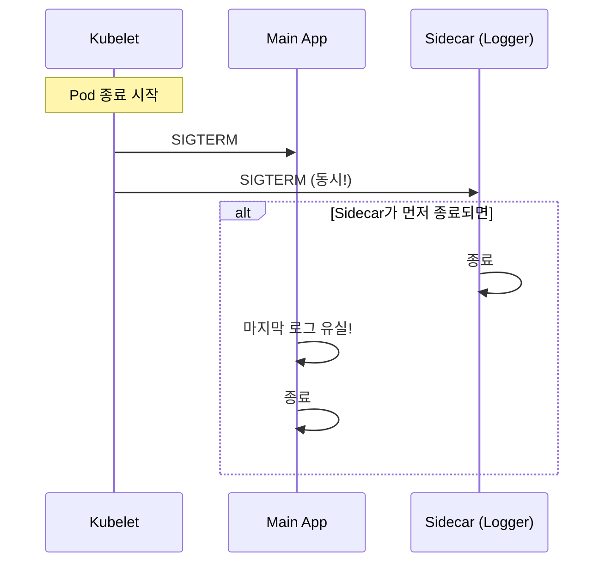
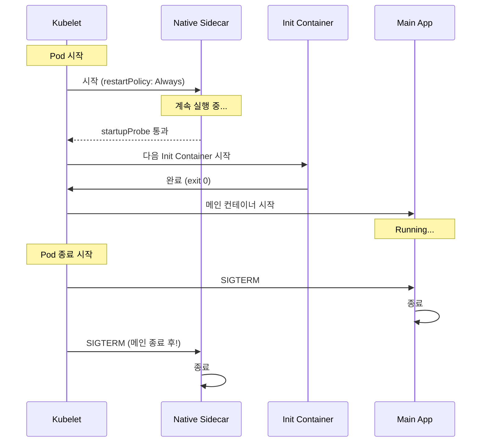
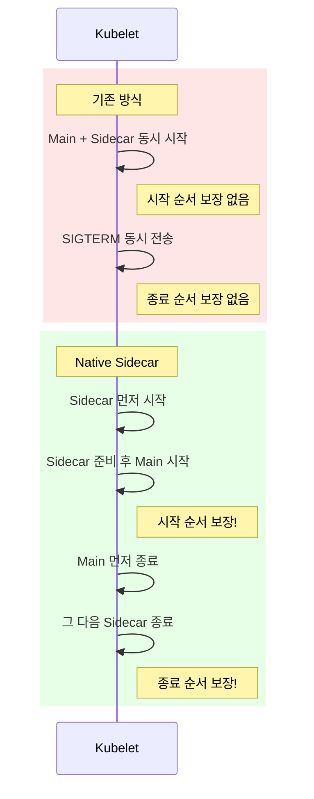

> **K8s Pod 디자인 패턴 시리즈**
> - **1편**: [Sidecar, Ambassador, Adapter](../k8s-pod-디자인-패턴-1-sidecar-ambassador-adapter)
> - **2편**: [Init Container 완벽 가이드](../k8s-pod-디자인-패턴-2-init-container-완벽-가이드)
> - **3편**: Native Sidecar (KEP-753)와 Pod 라이프사이클 (현재 글)

[1편](../k8s-pod-디자인-패턴-1-sidecar-ambassador-adapter)에서 Sidecar 패턴을 다뤘다. 메인 컨테이너의 기능을 변경 없이 확장하는 강력한 패턴이지만, 기존 방식에는 **시작/종료 순서를 보장할 수 없다**는 근본적인 한계가 있었다. 이번 편에서는 K8s 1.28+에서 도입된 **Native Sidecar Container (KEP-753)**가 이 문제를 어떻게 해결하는지 다룬다.

> 전체 코드: [tutorials-go/kubernetes/pod-design-patterns/native-sidecar/](https://github.com/kenshin579/tutorials-go/tree/master/kubernetes/pod-design-patterns/native-sidecar)

## 1. 기존 Sidecar의 문제점

### 1.1 종료 순서 문제

기존 방식에서 Sidecar는 `containers[]`에 정의된 일반 컨테이너다. Pod 종료 시 **모든 컨테이너에 동시에 SIGTERM이 전송**된다. 종료 순서를 제어할 수 없다.



이로 인한 문제:
- **로그 유실**: Sidecar(로그 수집기)가 메인 앱보다 먼저 종료되면, 메인 앱의 마지막 로그가 수집되지 않음
- **네트워크 끊김**: Envoy Sidecar가 먼저 종료되면, 메인 앱이 네트워크를 잃어 graceful shutdown 중인 요청이 실패

### 1.2 시작 순서 문제

Pod 생성 시에도 `containers[]`의 컨테이너들은 거의 동시에 시작된다. Sidecar가 준비되기 전에 메인 앱이 요청을 보내면 실패한다.

실무에서의 우회 방법:
- `preStop` hook에 `sleep` 추가 → 불안정하고 종료 시간 증가
- 메인 앱에 재시도 로직 추가 → 앱 코드 변경 필요

이 우회 방법들은 근본적인 해결책이 아니다.

### 1.3 Job/CronJob에서의 문제

가장 심각한 문제다. Job의 메인 컨테이너가 완료되어도, Sidecar는 종료되지 않는다. Pod의 모든 컨테이너가 종료되어야 Job이 완료되므로, **Job이 영원히 완료되지 않는** 상황이 발생한다.

```
$ kubectl get job
NAME      STATUS    COMPLETIONS   DURATION
my-job    Running   0/1           10m      # 영원히 Running...
```

## 2. Native Sidecar Container (KEP-753)

### 2.1 개념

KEP-753은 `initContainers`에 `restartPolicy: Always`를 지정하여 **Sidecar처럼 동작하는 Init Container**를 정의하는 방식이다.

```yaml
initContainers:
  - name: my-sidecar
    image: my-sidecar:latest
    restartPolicy: Always    # 이 한 줄이 핵심!
```

`restartPolicy: Always`가 지정된 Init Container는:
- Init 단계에서 시작되지만 **종료되지 않고 계속 실행**
- 다음 Init Container나 메인 컨테이너의 시작을 **차단하지 않음**
- Pod 종료 시 메인 컨테이너 **이후에** 종료

**버전 히스토리:**

| K8s 버전 | 상태 | 비고 |
|----------|------|------|
| 1.28 | Alpha | `SidecarContainers` 피처게이트 수동 활성화 필요 |
| 1.29 | Beta | 기본 활성화 |
| 1.33 | Stable (GA) | 피처게이트 제거, 정식 기능 |

### 2.2 동작 방식

Native Sidecar의 라이프사이클은 기존 방식과 근본적으로 다르다.



**시작 순서**: Native Sidecar 시작 → (startupProbe 통과) → 다음 Init → 메인 컨테이너
**종료 순서**: 메인 컨테이너 종료 → Native Sidecar 종료 (역순 보장!)

### 2.3 YAML 문법

**기존 방식 vs Native Sidecar 비교:**

```yaml
# 기존 방식: containers[]에 Sidecar 정의
spec:
  containers:
    - name: main-app
      image: main-app:local
    - name: request-logger        # 일반 컨테이너
      image: request-logger:local
```

```yaml
# Native Sidecar: initContainers[]에 restartPolicy: Always
spec:
  initContainers:
    - name: request-logger        # Native Sidecar
      image: request-logger:local
      restartPolicy: Always       # 핵심!
      startupProbe:               # Sidecar 준비 확인용
        tcpSocket:
          port: 8080
        initialDelaySeconds: 1
        periodSeconds: 1
  containers:
    - name: main-app
      image: main-app:local
```

핵심 변경점:
- `containers[]` → `initContainers[]`로 이동
- `restartPolicy: Always` 추가
- `startupProbe` 추가 (Sidecar 준비 확인 후 다음 단계 진행)

## 3. 기존 방식 vs Native Sidecar 비교

### 3.1 라이프사이클 비교



| 항목 | 기존 방식 | Native Sidecar |
|------|----------|----------------|
| 시작 순서 | 보장 없음 (동시 시작) | Sidecar → Main (순서 보장) |
| 종료 순서 | 보장 없음 (동시 SIGTERM) | Main → Sidecar (역순 보장) |
| Job 호환 | 불가 (Sidecar가 종료 안 됨) | 가능 (Main 종료 시 Sidecar 자동 종료) |
| Probe 지원 | 지원 | startupProbe, livenessProbe 지원 |
| YAML 위치 | `containers[]` | `initContainers[]` |
| 최소 K8s 버전 | 제한 없음 | 1.29+ (Beta, 기본 활성화) |

### 3.2 어떤 경우에 Native Sidecar를 써야 하나?

**반드시 써야 하는 경우:**
- Job/CronJob에 Sidecar가 필요할 때
- 종료 순서가 중요할 때 (로그 수집기가 마지막까지 동작해야 할 때)
- Sidecar가 메인 앱보다 먼저 준비되어야 할 때

**기존 방식도 괜찮은 경우:**
- K8s 1.28 미만을 사용해야 할 때
- 시작/종료 순서가 중요하지 않은 단순한 보조 작업

### 3.3 K8s 버전별 지원 현황

| 클라우드 프로바이더 | Native Sidecar 지원 시점 |
|---|---|
| **Kind** | K8s 1.29+ 이미지 사용 시 기본 지원 |
| **GKE** | 1.29+ 클러스터에서 기본 활성화 |
| **EKS** | 1.29+ 클러스터에서 기본 활성화 |
| **AKS** | 1.29+ 클러스터에서 기본 활성화 |

## 4. 실전 예제

### 4.1 Request Logger를 Native Sidecar로 전환

[1편](../k8s-pod-디자인-패턴-1-sidecar-ambassador-adapter)의 Go Request Logger Sidecar를 Native Sidecar로 전환한다.

```yaml
# native-sidecar/native-logger-pod.yaml
apiVersion: v1
kind: Pod
metadata:
  name: native-sidecar-demo
spec:
  initContainers:
    - name: request-logger
      image: request-logger:local
      imagePullPolicy: Never
      restartPolicy: Always
      env:
        - name: TARGET_URL
          value: "http://localhost:3000"
        - name: LOG_FILE
          value: "/var/log/app/access.log"
      ports:
        - containerPort: 8080
      startupProbe:
        tcpSocket:
          port: 8080
        initialDelaySeconds: 1
        periodSeconds: 1
      volumeMounts:
        - name: shared-logs
          mountPath: /var/log/app

  containers:
    - name: main-app
      image: main-app:local
      imagePullPolicy: Never
      ports:
        - containerPort: 3000
      volumeMounts:
        - name: shared-logs
          mountPath: /var/log/app

  volumes:
    - name: shared-logs
      emptyDir: {}
```

포인트:
- `request-logger`가 `initContainers[]`로 이동 + `restartPolicy: Always`
- `startupProbe`로 Sidecar 포트(8080)가 열릴 때까지 대기 → 통과 후 메인 앱 시작
- TCP 체크를 사용: HTTP 체크 시 프록시 대상(메인앱)이 아직 없어 502 발생

**실습:**

```bash
kubectl apply -f native-sidecar/native-logger-pod.yaml
kubectl wait --for=condition=Ready pod/native-sidecar-demo --timeout=60s

# 프록시를 통해 요청
kubectl exec native-sidecar-demo -c main-app -- wget -qO- http://localhost:8080/
# 출력: Hello from main-app! (request #1)

# 로그 확인
kubectl exec native-sidecar-demo -c main-app -- cat /var/log/app/access.log
# 출력: 2026-03-16T10:34:06Z GET / 537.417µs
```

기능적으로는 1편의 기존 방식과 동일하지만, **시작/종료 순서가 보장**된다.

### 4.2 Job + Native Sidecar

기존 방식의 가장 큰 문제였던 "Job이 완료되지 않는 문제"를 Native Sidecar로 해결한다.

```yaml
# native-sidecar/job-with-sidecar.yaml
apiVersion: batch/v1
kind: Job
metadata:
  name: job-native-sidecar
spec:
  template:
    spec:
      initContainers:
        - name: log-collector
          image: request-logger:local
          imagePullPolicy: Never
          restartPolicy: Always
          env:
            - name: TARGET_URL
              value: "http://localhost:3000"
            - name: LOG_FILE
              value: "/var/log/app/job.log"
          volumeMounts:
            - name: shared-logs
              mountPath: /var/log/app

      containers:
        - name: batch-job
          image: busybox:1.36
          command:
            - sh
            - -c
            - |
              echo "Job started"
              sleep 5
              echo "Job completed"
          volumeMounts:
            - name: shared-logs
              mountPath: /var/log/app

      restartPolicy: Never
      volumes:
        - name: shared-logs
          emptyDir: {}
  backoffLimit: 1
```

**실습:**

```bash
kubectl apply -f native-sidecar/job-with-sidecar.yaml

# Job 완료 대기 (약 15초)
kubectl wait --for=condition=Complete job/job-native-sidecar --timeout=60s

# Job 상태 확인
kubectl get job job-native-sidecar
# NAME                 STATUS     COMPLETIONS   DURATION   AGE
# job-native-sidecar   Complete   1/1           15s        21s

# Pod 상태 확인: Sidecar도 자동 종료!
kubectl get pod -l job-name=job-native-sidecar
# NAME                       READY   STATUS      RESTARTS   AGE
# job-native-sidecar-fnxp9   0/2     Completed   0          21s
```

`batch-job` 컨테이너가 완료되면 `log-collector` Native Sidecar도 **자동으로 종료**되어 Job이 정상 완료된다. 기존 방식에서는 불가능했던 동작이다.

## 5. 마이그레이션 가이드

### 5.1 기존 Sidecar → Native Sidecar 전환 방법

전환은 간단하다. 3단계만 변경하면 된다:

1. **위치 이동**: `containers[]` → `initContainers[]`
2. **restartPolicy 추가**: `restartPolicy: Always`
3. **startupProbe 추가**: Sidecar 준비 상태 확인용

```diff
 spec:
-  containers:
+  initContainers:
     - name: my-sidecar
       image: my-sidecar:latest
+      restartPolicy: Always
+      startupProbe:
+        tcpSocket:
+          port: 8080
+        initialDelaySeconds: 1
+        periodSeconds: 1
   containers:
     - name: main-app
       image: main-app:latest
```

### 5.2 호환성 체크리스트

전환 전 확인할 항목:

- [ ] **K8s 버전**: 1.29+ (Beta, 기본 활성화) 또는 1.28 (Alpha, 피처게이트 수동 활성화)
- [ ] **Helm 차트**: `initContainers` 필드를 지원하는지 확인
- [ ] **모니터링 도구**: Native Sidecar 컨테이너를 정상 인식하는지 확인 (일부 도구는 Init Container로 표시할 수 있음)
- [ ] **startupProbe 설계**: Sidecar 자체의 준비 상태를 확인하는 적절한 probe 설계
  - TCP 체크: 포트가 열리면 준비 완료
  - HTTP 체크: Sidecar 자체의 health endpoint 필요 (프록시 대상이 아직 없을 수 있음)
- [ ] **리소스 요청**: Init Container의 리소스 요청이 Pod 스케줄링에 영향을 주는 방식 확인 ([2편](../k8s-pod-디자인-패턴-2-init-container-완벽-가이드) 참조)

## 6. 마무리

### 시리즈 전체 회고

이 시리즈에서 K8s Multi-Container Pod의 핵심 패턴을 다뤘다.

| 편 | 패턴 | 핵심 |
|----|------|------|
| [1편](../k8s-pod-디자인-패턴-1-sidecar-ambassador-adapter) | Sidecar, Ambassador, Adapter | 런타임 보조 컨테이너 3가지 |
| [2편](../k8s-pod-디자인-패턴-2-init-container-완벽-가이드) | Init Container | Pod 시작 전 초기화 |
| 3편 (현재) | Native Sidecar (KEP-753) | 시작/종료 순서 보장, Job 호환 |

### Native Sidecar 도입 권장 시나리오

- **새로운 프로젝트**: K8s 1.29+를 사용한다면 처음부터 Native Sidecar 사용 권장
- **기존 프로젝트 마이그레이션**: Job/CronJob + Sidecar 조합이 있거나, 종료 순서 문제를 겪고 있다면 전환 권장
- **서비스 메시**: Istio 1.22+에서 Native Sidecar injection을 지원하므로, Istio 업그레이드 시 함께 전환 검토

## 참고

- [Kubernetes 공식 문서 - Sidecar Containers](https://kubernetes.io/docs/concepts/workloads/pods/sidecar-containers/)
- [KEP-753: Sidecar Containers](https://github.com/kubernetes/enhancements/tree/master/keps/sig-node/753-sidecar-containers)
- [Kubernetes 1.29: Sidecar Containers Are Now Beta](https://kubernetes.io/blog/2023/08/25/native-sidecar-containers/)
- [Kubernetes 공식 문서 - Pod Lifecycle](https://kubernetes.io/docs/concepts/workloads/pods/pod-lifecycle/)
