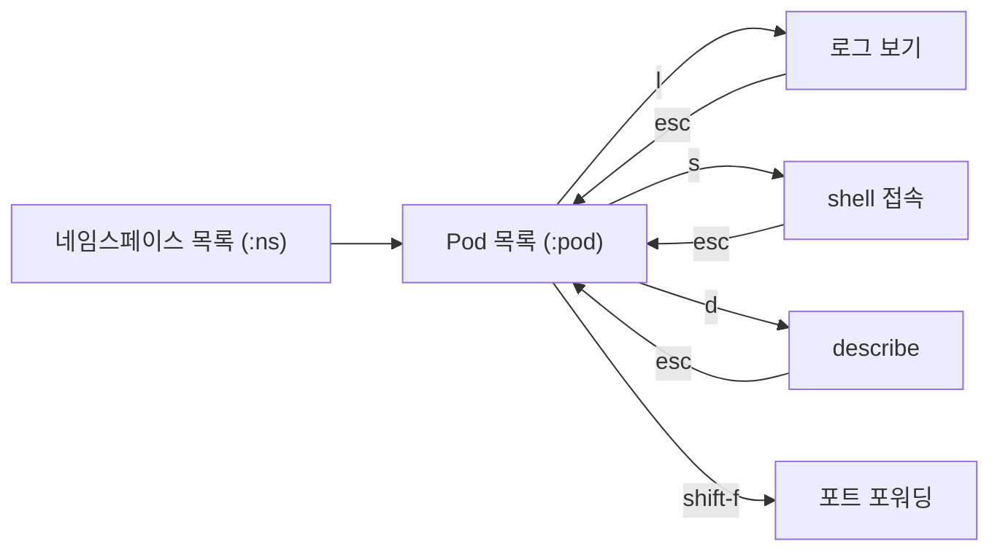
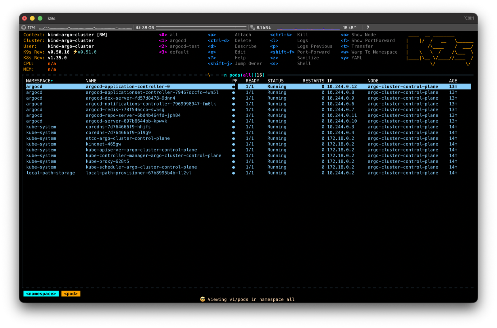
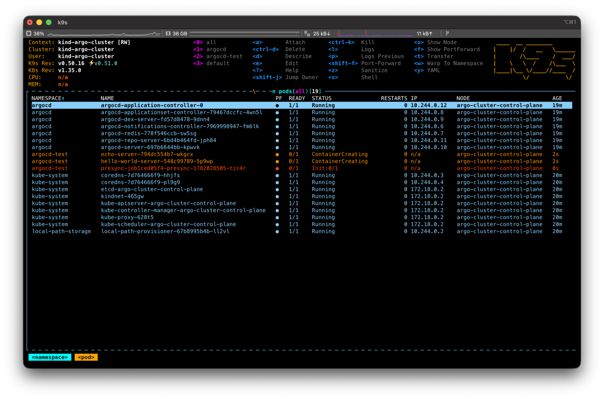
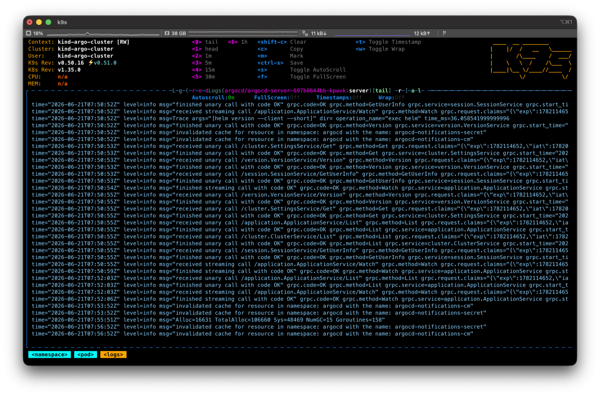
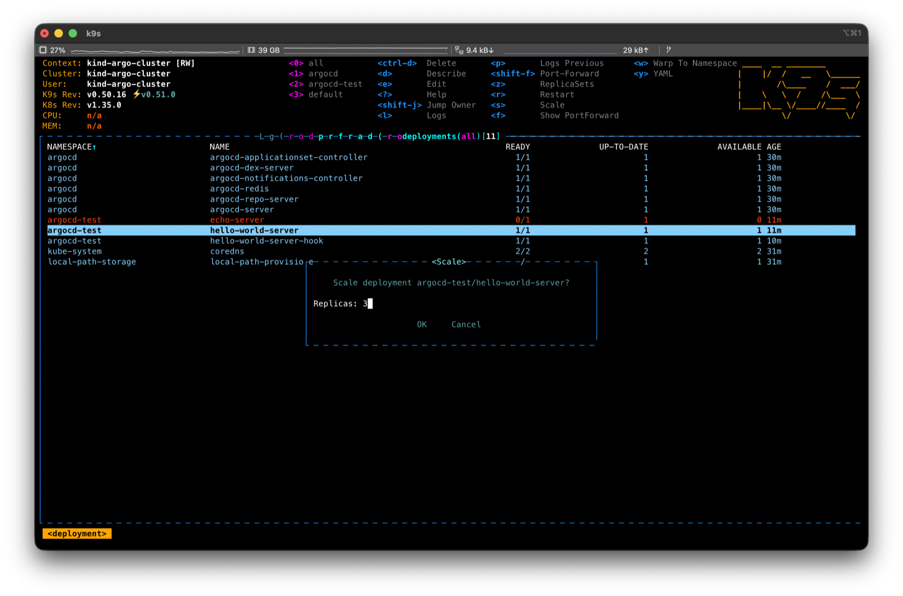

자기 컴포넌트를 Kubernetes에 배포하는 개발자라면 `kubectl`은 어느 정도 손에 익었을 것이다. 그런데 막상 운영 중에 "내 Pod가 왜 안 뜨지?", "방금 배포한 게 잘 떴나?"를 확인하려고 하면 `kubectl get` → `describe` → `logs` 명령을 외워서 반복 입력하는 과정이 은근히 번거롭다.

이 글은 `kubectl`은 쓸 줄 알지만 **k9s는 처음**인 개발자를 위한 입문 가이드다. 설치부터 매일 쓰는 작업(상태 확인, 로그, shell 접속, 포트 포워딩, 롤아웃)까지 단축키 중심으로 정리한다.

# 1. 들어가며 — kubectl만으로 충분할까?

`kubectl`로 Pod 하나의 로그를 확인하는 흐름을 떠올려 보자.

```bash
kubectl get pods -n my-namespace
# 이름을 눈으로 찾아서 복사
kubectl describe pod my-app-7d9f8b6c4-x2k9p -n my-namespace
kubectl logs my-app-7d9f8b6c4-x2k9p -n my-namespace -f
```

문제가 없을 때는 괜찮지만, 다음과 같은 순간이 반복되면 피로가 쌓인다.

- Pod 이름 해시(`7d9f8b6c4-x2k9p`)를 매번 복사해야 한다.
- 네임스페이스(`-n`)를 빼먹어서 "리소스가 없다"는 메시지를 본다.
- 상태가 실시간으로 안 바뀌어서 `get pods`를 계속 다시 친다.

`kubectl`은 **명령을 암기해서 입력하는** 도구다. 반면 k9s는 클러스터를 **화면에서 탐색하는** 도구다. 이 차이가 디버깅 속도를 꽤 바꾼다.

> 오해를 막기 위해 미리 말하면, k9s는 `kubectl`을 대체하는 도구가 아니다. 내부적으로 같은 kubeconfig와 API를 쓴다. 스크립트·CI에는 `kubectl`이 맞고, **사람이 직접 클러스터를 들여다보며 디버깅할 때** k9s가 빛난다.

# 2. k9s란?

k9s는 한 줄로 말하면 **Kubernetes 클러스터를 위한 터미널 UI(TUI)** 다. 실행하면 터미널 안에 리소스 목록이 표 형태로 뜨고, 키보드 단축키로 그 사이를 옮겨 다니며 로그를 보거나 shell에 접속할 수 있다. 목록은 실시간으로 자동 갱신되므로 `get pods`를 다시 칠 필요가 없다.

별도의 데몬이나 서버를 띄우지 않는다. 현재 `kubectl`이 보고 있는 것과 똑같은 kubeconfig(컨텍스트·네임스페이스 권한)를 그대로 사용한다. 즉 `kubectl`이 접근할 수 있는 클러스터라면 k9s도 그대로 접근한다.

## 2.1 kubectl vs k9s

| 구분 | kubectl | k9s |
|------|---------|-----|
| 조작 방식 | 명령어 암기·입력 | 화면 탐색 + 단축키 |
| 상태 갱신 | 명령 재실행 필요 | 실시간 자동 갱신 |
| Pod 지정 | 이름(해시) 직접 입력 | 목록에서 커서로 선택 |
| 강점 | 스크립트·CI·정밀 제어 | 빠른 탐색·디버깅 |
| 학습 비용 | 명령·플래그 암기 | 단축키 몇 개 |

탐색 흐름을 그림으로 보면 이렇다. 하나의 화면에서 키 몇 번으로 깊이 들어갔다 나온다.



# 3. 설치와 첫 실행

## 3.1 설치

macOS·Linux는 Homebrew가 가장 간단하다.

```bash
brew install k9s
# 버전 확인
k9s version
```

> Windows는 `scoop install k9s` 또는 `choco install k9s`, 그 외 환경은 [GitHub Releases](https://github.com/derailed/k9s/releases)에서 바이너리를 받으면 된다.

## 3.2 첫 실행과 화면 구성

터미널에서 그냥 입력하면 된다.

```bash
k9s
```

k9s는 `~/.kube/config`의 **현재 컨텍스트**를 자동으로 인식해 실행된다. 처음 뜨는 화면은 크게 세 영역으로 나뉜다.

- **상단(헤더)**: 현재 컨텍스트, 클러스터, 네임스페이스, k9s 버전 등 "내가 지금 어디를 보고 있는지" 정보. 디버깅 전에 **컨텍스트가 맞는지 여기부터 확인하는 습관**을 들이면 좋다.
- **중앙(리소스 목록)**: Pod, Deployment 같은 리소스가 표로 표시되는 메인 영역. 상태에 따라 색이 다르다.
- **하단/우상단(단축키 안내)**: 현재 화면에서 쓸 수 있는 단축키가 항상 표시된다. 외울 필요 없이 화면을 보면 된다.

<!-- 📸 스크린샷 자리: k9s 첫 실행 전체 화면 (헤더/리소스 목록/단축키 안내 세 영역이 보이도록). 추가 후 아래 주석을 풀 것 -->
<!--  -->

# 4. 기본 조작 익히기

k9s 조작의 핵심은 단 세 개의 키다: `:`(명령), `/`(필터), `?`(도움말). 이것만 알면 나머지는 화면 안내를 따라가면 된다.

## 4.1 명령 모드 (`:`)

`:`를 누르면 하단에 명령 입력창이 뜬다. 여기에 보고 싶은 리소스 종류를 입력하고 Enter를 치면 그 목록으로 이동한다. `kubectl get <리소스>`와 같은 개념이다.

```text
:pod      → Pod 목록
:deploy   → Deployment 목록
:svc      → Service 목록
:ns       → Namespace 목록
:ctx      → Context 목록(전환)
```

단수·복수·축약형·별칭을 모두 받는다. `:pod`, `:pods`, `:po` 모두 동작한다.

## 4.2 필터 (`/`)

목록이 길 때 `/`를 누르고 검색어를 입력하면 실시간으로 걸러진다. 예를 들어 `/my-app`을 입력하면 이름에 `my-app`이 들어간 항목만 남는다.

```text
/my-app        → 이름에 my-app 포함
/!Running      → Running이 '아닌' 것만 (역필터)
/-l app=web    → 레이블 셀렉터로 필터
```

문제 있는 Pod만 빠르게 추리고 싶을 때 역필터(`/!Running`)가 특히 유용하다.

## 4.3 네임스페이스와 컨텍스트 전환

`kubectl`에서 `-n` 플래그와 `kubectl config use-context`로 하던 일을 k9s에서는 화면 전환으로 한다.

- **네임스페이스 전환**: `:ns` → 목록에서 원하는 네임스페이스 선택. 이후 모든 화면이 그 네임스페이스 기준이 된다. (`0`은 전체 네임스페이스)
- **컨텍스트 전환**: `:ctx` → 클러스터(컨텍스트) 목록에서 선택. 운영/스테이징 클러스터를 오갈 때 이걸 쓴다.

## 4.4 도움말과 빠져나오기

- `?` : 현재 화면에서 쓸 수 있는 단축키 전체 보기
- `Esc` : 한 단계 뒤로 (필터 해제, 이전 화면으로)
- `:q` 또는 `Ctrl-c` : k9s 종료

길을 잃었다면 `Esc`를 몇 번 누르면 목록 화면으로 돌아온다. 막히면 `?`를 누르면 된다. 이 두 키만 기억하면 마음 놓고 이것저것 눌러볼 수 있다.

# 5. 실전: 매일 쓰는 작업

여기서부터가 실제로 가장 자주 쓰는 부분이다. 공통 전제: `:pod`로 Pod 목록에 들어간 뒤, **방향키나 `j`/`k`로 대상 Pod에 커서를 올린 상태**에서 아래 단축키를 누른다.

## 5.1 Pod 상태 확인하고 문제 Pod 찾기

Pod 목록에서는 상태가 **색으로** 구분된다. 한눈에 정상/비정상을 가를 수 있다.

- 초록색: 정상(Running, Completed)
- 노란색: 진행 중·대기(Pending, ContainerCreating 등)
- 빨간색: 문제(CrashLoopBackOff, Error, ImagePullBackOff 등)

`STATUS`와 `RESTARTS` 열을 보면 무엇이 문제인지 단서가 나온다. 재시작 횟수가 계속 올라간다면 CrashLoop을 의심한다. 자세한 이벤트를 보려면 해당 Pod에서 `d`(describe)를 누른다. `kubectl describe pod ...`와 같은 내용을 보여 준다.

<!-- 📸 스크린샷 자리: Pod 목록 화면 (정상=초록/대기=노랑/문제=빨강 상태 색이 잘 보이도록, RESTARTS 열 포함) -->
<!--  -->


## 5.2 로그 실시간으로 보기

대상 Pod에서 `l`을 누르면 로그 화면으로 들어간다. 기본으로 실시간 tail(자동 스크롤)이 켜져 있다. 로그 화면에서 쓰는 키는 다음과 같다.

| 키 | 동작 |
|----|------|
| `l` | 로그 보기(진입) |
| `p` | 이전(previous) 컨테이너 로그 — **크래시한 컨테이너 원인 추적에 필수** |
| `0` | 처음부터 전체 로그 |
| `1`~`5` | 최근 N분 로그만 |
| `f` | 전체 화면 토글 |
| `w` | 줄바꿈(wrap) 토글 |
| `c` | 화면 지우기 |
| `Esc` | 로그 화면 빠져나오기 |

CrashLoopBackOff처럼 컨테이너가 죽고 다시 뜨는 경우, 지금 컨테이너 로그에는 원인이 안 보일 수 있다. 이때 `p`(이전 컨테이너 로그)가 결정적인 단서를 준다.

<!-- 📸 스크린샷 자리: 로그 보기 화면 (실시간 tail 중인 로그 + 하단 단축키 안내가 보이도록) -->
<!--  -->


## 5.3 Pod 안으로 들어가기 (shell)

대상 Pod에서 `s`를 누르면 컨테이너 안으로 shell 접속한다. `kubectl exec -it ... -- sh`를 대신한다. 컨테이너 안에서 파일을 확인하거나 환경변수(`env`), 네트워크(`curl`)를 직접 점검할 때 쓴다. 나올 때는 `exit`을 입력한다.

> Pod 안에 컨테이너가 여러 개면, 먼저 Pod에서 Enter를 눌러 컨테이너 목록으로 들어간 뒤 대상 컨테이너를 선택하고 `s`를 누른다.

## 5.4 Pod 재시작·삭제

k9s에는 Pod를 직접 "재시작"하는 버튼은 없다. 대신 **Pod를 삭제하면 컨트롤러(Deployment/ReplicaSet)가 자동으로 새 Pod를 띄운다.** 이것이 사실상의 재시작이다.

- `Ctrl-d` : 삭제(확인 대화상자가 뜸 — `Tab`+`Enter`로 확정)
- `Ctrl-k` : 즉시 강제 삭제(확인 없음 — 주의)

특정 Pod 하나만 새로 띄우고 싶을 때 이 방법이 가장 빠르다. **여러 Pod를 한꺼번에** 무중단으로 재시작하고 싶다면 다음 절의 Deployment 롤아웃 재시작을 쓴다.

## 5.5 포트 포워딩

로컬에서 클러스터 안 서비스에 직접 붙어 보고 싶을 때 포트 포워딩을 쓴다. 대상 Pod(또는 컨테이너)에서 `Shift-f`를 누르면 포워딩 설정창이 뜬다. 로컬 포트와 컨테이너 포트를 지정하면 `localhost:<포트>`로 접속할 수 있다.

현재 활성화된 포트 포워딩 목록은 `:pf`(또는 `:portforward`)로 확인·해제할 수 있다. `kubectl port-forward`를 별도 터미널에 띄워 두던 것을 k9s 안에서 관리하는 셈이다.

<!-- 📸 스크린샷 자리: Shift-f 포트 포워딩 설정 대화상자 (로컬 포트/컨테이너 포트 입력 폼) -->
<!--  -->


## 5.6 Deployment 스케일·롤아웃

`:deploy`로 Deployment 목록에 들어가면 Pod 뷰와는 다른 단축키를 쓸 수 있다(화면 하단에서 항상 확인 가능).

- `s` : 스케일 조정(레플리카 수 변경). 트래픽 대응이나 일시 중지(0으로) 시 사용
- `r` : 롤아웃 재시작(`kubectl rollout restart`에 해당) — 설정/시크릿 변경 후 **전체 Pod를 무중단으로 새로 띄울 때**
- `d` : describe로 롤아웃 상태·이벤트 확인
- `Enter` : 이 Deployment가 관리하는 Pod 목록으로 드릴다운

방금 배포한 변경이 잘 반영됐는지 확인할 때는, Deployment에서 `Enter`로 Pod 목록에 들어가 새 Pod가 초록색으로 `Running` 되는지 실시간으로 지켜보면 된다.

<!-- 📸 스크린샷 자리: Deployment 목록 화면 (READY/UP-TO-DATE/AVAILABLE 열 + 하단 s/r 단축키 안내가 보이도록) -->
<!--  -->


## 5.7 리소스 사용량 확인

`:pod` 목록의 `CPU`·`MEM` 열에서 실제 사용량을 볼 수 있다(클러스터에 metrics-server가 설치돼 있어야 표시된다). 노드 단위로 보고 싶다면 `:node`로 들어가 노드별 CPU·메모리 점유율을 확인한다. 특정 Pod가 메모리를 과도하게 먹어 OOM으로 죽는지 의심될 때 이 화면이 유용하다.

# 6. 알아두면 좋은 팁

## 6.1 자주 쓰는 단축키 치트시트

처음엔 이 표만 옆에 두면 충분하다.

| 분류 | 키 | 동작 |
|------|----|------|
| 이동 | `:pod` `:deploy` `:svc` | 리소스 목록으로 이동 |
| 이동 | `:ns` `:ctx` | 네임스페이스 / 컨텍스트 전환 |
| 탐색 | `/` | 목록 필터 |
| 탐색 | `?` | 단축키 도움말 |
| 탐색 | `Esc` | 뒤로 / 필터 해제 |
| 작업 | `d` | describe |
| 작업 | `l` / `p` | 로그 / 이전 컨테이너 로그 |
| 작업 | `s` | shell 접속(Pod) / 스케일(Deployment) |
| 작업 | `y` / `e` | YAML 보기 / 편집 |
| 작업 | `Shift-f` | 포트 포워딩 |
| 작업 | `r` | 롤아웃 재시작(Deployment) |
| 위험 | `Ctrl-d` / `Ctrl-k` | 삭제 / 강제 삭제 |
| 종료 | `:q` | k9s 종료 |

## 6.2 읽기 전용 모드와 권한 주의

k9s는 화면에서 바로 삭제·편집·스케일이 되기 때문에, 익숙해지기 전 운영 클러스터에서는 실수가 위험할 수 있다. 두 가지를 기억하자.

- **읽기 전용 모드**: `k9s --readonly`로 실행하면 삭제·편집 같은 변경 작업이 비활성화된다. 운영 클러스터를 들여다보기만 할 때 안전하다.
- **권한은 kubeconfig를 따른다**: k9s가 할 수 있는 일은 결국 현재 컨텍스트의 RBAC 권한 범위 안이다. 권한이 없으면 k9s에서도 막힌다.

이 외에 `~/.config/k9s/`의 설정으로 스킨(테마), 기본 네임스페이스, 컬럼 등을 커스터마이즈할 수 있다. 처음엔 기본값으로 충분하니 익숙해진 뒤에 손대도 된다.

# 7. 마치며

k9s를 한 문장으로 정리하면 이렇다. **`kubectl`을 버리는 게 아니라, 사람이 클러스터를 들여다보고 디버깅하는 일을 빠르게 만들어 주는 도구다.**

처음엔 `:`(이동)·`/`(필터)·`?`(도움말)·`Esc`(뒤로), 그리고 `l`(로그)·`s`(shell)·`d`(describe) 정도만 익혀도 충분하다. 나머지 단축키는 화면 하단에 항상 떠 있으니 쓰면서 자연스럽게 손에 붙는다. 오늘 자기 컴포넌트가 떠 있는 네임스페이스에 `k9s`로 한번 들어가 보자.

# 8. 참고

- [k9s 공식 사이트](https://k9scli.io/)
- [k9s GitHub (derailed/k9s)](https://github.com/derailed/k9s)
- [k9s Commands 문서](https://k9scli.io/topics/commands/)
