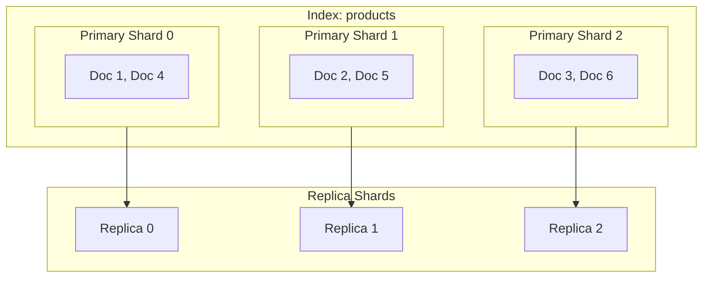
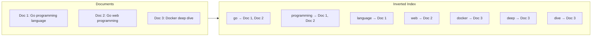
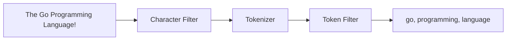
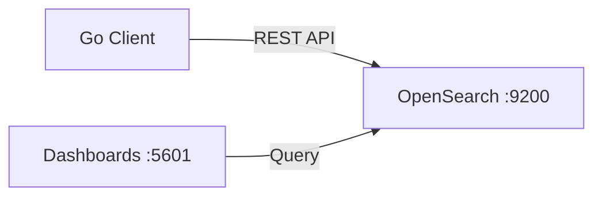

> OpenSearch 스터디를 진행하면서 학습한 내용을 정리한다.
> 이 글에서는 OpenSearch의 핵심 개념과 Go 클라이언트를 활용한 CRUD를 다루고, 이후 시리즈에서는 검색 쿼리, Aggregation, Dashboards 시각화를 다룰 예정이다.

# 1. OpenSearch란?

## 1.1 OpenSearch vs Elasticsearch

OpenSearch는 2021년 AWS가 Elasticsearch 7.10.2를 포크하여 시작한 오픈소스 검색 및 분석 엔진이다. Elastic이 Elasticsearch의 라이선스를 Apache 2.0에서 SSPL(Server Side Public License)로 변경하면서, AWS가 Apache 2.0 기반의 포크를 만들었다.

| 항목 | Elasticsearch | OpenSearch |
|------|---------------|------------|
| 라이선스 | SSPL / Elastic License | Apache 2.0 |
| 포크 시점 | - | Elasticsearch 7.10.2 |
| REST API | 호환 | 대부분 호환 |
| 쿼리 DSL | 동일 | 동일 |
| 클라이언트 | elastic-go | opensearch-go |
| Dashboards | Kibana | OpenSearch Dashboards |

대부분의 REST API와 쿼리 DSL이 호환되므로, Elasticsearch 경험이 있다면 OpenSearch로의 전환이 어렵지 않다.

## 1.2 핵심 개념

### Index, Document, Field

OpenSearch의 데이터 구조는 관계형 데이터베이스와 비교하면 이해하기 쉽다.

| RDBMS | OpenSearch |
|-------|------------|
| Database | Cluster |
| Table | Index |
| Row | Document |
| Column | Field |
| Schema | Mapping |

- **Index**: 비슷한 특성을 가진 Document의 모음. RDBMS의 테이블에 해당한다
- **Document**: JSON 형태의 데이터 단위. RDBMS의 Row에 해당한다
- **Field**: Document 내의 개별 데이터 항목. RDBMS의 Column에 해당한다
- **Mapping**: Document의 필드 타입과 분석 방법을 정의. RDBMS의 Schema에 해당한다

### Shard와 Replica



- **Primary Shard**: 데이터를 분산 저장하는 단위. 인덱스 생성 시 개수를 지정하며, 이후 변경할 수 없다
- **Replica Shard**: Primary Shard의 복제본. 고가용성과 읽기 성능 향상을 제공한다

### Inverted Index (역색인)

역색인은 OpenSearch의 핵심 자료구조로, "단어 → 문서" 매핑을 저장한다. 일반적인 인덱스가 "문서 → 단어" 매핑이라면, 역색인은 그 반대이다.



"programming"을 검색하면 역색인에서 해당 단어를 찾아 Doc 1, Doc 2를 빠르게 반환할 수 있다. RDBMS의 `LIKE '%programming%'`이 전체 행을 스캔해야 하는 것과 비교하면 훨씬 효율적이다.

### Analyzer: Tokenizer + Token Filter

Analyzer는 텍스트를 색인 가능한 토큰으로 변환하는 파이프라인이다.



1. **Character Filter**: 문자 단위 전처리 (HTML 태그 제거 등)
2. **Tokenizer**: 텍스트를 토큰으로 분리 (공백, 구두점 기준)
3. **Token Filter**: 토큰 변환 (소문자 변환, 불용어 제거 등)

Standard Analyzer는 공백과 구두점으로 토큰을 분리하고, 소문자로 변환한다.

## 1.3 언제 사용하는가?

- **전문 검색 (Full-text Search)**: 블로그 검색, 상품 검색 등
- **로그 분석**: ELK/EFK 스택 대체 (OpenSearch + Fluentd + Dashboards)
- **실시간 분석**: Aggregation을 활용한 실시간 통계
- **RDBMS LIKE 검색 한계 극복**: 역색인 기반 빠른 검색

# 2. 환경 구성

## 2.1 Docker Compose로 OpenSearch 실행



아래 `docker-compose.yml`로 OpenSearch와 Dashboards를 실행할 수 있다.

```yaml
version: '3.8'
services:
  opensearch:
    image: opensearchproject/opensearch:2.11.1
    container_name: opensearch
    environment:
      - discovery.type=single-node
      - DISABLE_SECURITY_PLUGIN=true
      - "OPENSEARCH_JAVA_OPTS=-Xms512m -Xmx512m"
    ports:
      - "9200:9200"
      - "9600:9600"

  opensearch-dashboards:
    image: opensearchproject/opensearch-dashboards:2.11.1
    container_name: opensearch-dashboards
    environment:
      - OPENSEARCH_HOSTS=["http://opensearch:9200"]
      - DISABLE_SECURITY_DASHBOARDS_PLUGIN=true
    ports:
      - "5601:5601"
    depends_on:
      - opensearch
```

```bash
docker-compose up -d
```

실행 후 확인:
- OpenSearch: `curl http://localhost:9200`
- Dashboards: 브라우저에서 `http://localhost:5601` 접속

## 2.2 OpenSearch Dashboards 둘러보기

Dashboards에 접속하면 왼쪽 메뉴에서 **Dev Tools**를 찾을 수 있다. Dev Tools 콘솔에서 REST API를 직접 실행할 수 있다.

클러스터 상태 확인:

```
GET /_cat/health?v
GET /_cat/indices?v
```

## 2.3 Go 클라이언트 설정

opensearch-go v4 클라이언트 라이브러리를 사용한다.

```bash
go get github.com/opensearch-project/opensearch-go/v4@latest
```

클라이언트 생성 코드:

```go
package opensearch

import (
    "github.com/opensearch-project/opensearch-go/v4"
    "github.com/opensearch-project/opensearch-go/v4/opensearchapi"
)

func NewOpenSearchClient(endpoint string) (*opensearchapi.Client, error) {
    client, err := opensearchapi.NewClient(opensearchapi.Config{
        Client: opensearch.Config{
            Addresses: []string{endpoint},
        },
    })
    if err != nil {
        return nil, fmt.Errorf("opensearch client 생성 실패: %w", err)
    }
    return client, nil
}
```

> 전체 코드: [client.go](https://github.com/kenshin579/tutorials-go/blob/master/database/opensearch/client.go)

# 3. 인덱스와 매핑 설계

## 3.1 인덱스 생성과 매핑

OpenSearch에서 매핑은 **동적 매핑**과 **명시적 매핑** 두 가지 방식이 있다.

- **동적 매핑**: 문서를 색인할 때 필드 타입을 자동으로 추론. 편리하지만 의도하지 않은 타입이 설정될 수 있다
- **명시적 매핑**: 인덱스 생성 시 필드 타입을 직접 지정. 프로덕션 환경에서 권장한다

주요 필드 타입:

| 타입 | 설명 | 예시 |
|------|------|------|
| `text` | 전문 검색용. Analyzer로 토큰화됨 | 상품 이름, 설명 |
| `keyword` | 정확한 값 매칭용. 분석 안 됨 | 카테고리, 태그 |
| `integer`, `float` | 숫자 | 가격, 수량 |
| `date` | 날짜 | 생성일, 수정일 |
| `boolean` | 참/거짓 | 재고 여부 |

**text vs keyword 차이**: `text`는 Analyzer가 적용되어 "Go Programming"이 "go", "programming" 두 토큰으로 분리된다. `keyword`는 "Go Programming" 전체가 하나의 값으로 저장된다.

상품 인덱스 매핑 예시:

```go
func ProductIndexMapping() string {
    return `{
  "settings": {
    "number_of_shards": 1,
    "number_of_replicas": 0
  },
  "mappings": {
    "properties": {
      "id":          { "type": "keyword" },
      "name":        { "type": "text", "analyzer": "standard" },
      "description": { "type": "text", "analyzer": "standard" },
      "category":    { "type": "keyword" },
      "price":       { "type": "float" },
      "in_stock":    { "type": "boolean" },
      "tags":        { "type": "keyword" },
      "created_at":  { "type": "date" }
    }
  }
}`
}
```

인덱스 생성/삭제/매핑 조회:

```go
func CreateIndex(ctx context.Context, client *opensearchapi.Client, indexName, mapping string) error {
    _, err := client.Indices.Create(ctx, opensearchapi.IndicesCreateReq{
        Index: indexName,
        Body:  strings.NewReader(mapping),
    })
    return err
}

func DeleteIndex(ctx context.Context, client *opensearchapi.Client, indexName string) error {
    _, err := client.Indices.Delete(ctx, opensearchapi.IndicesDeleteReq{
        Indices: []string{indexName},
    })
    return err
}

func GetMapping(ctx context.Context, client *opensearchapi.Client, indexName string) (*opensearchapi.MappingGetResp, error) {
    return client.Indices.Mapping.Get(ctx, &opensearchapi.MappingGetReq{
        Indices: []string{indexName},
    })
}
```

> 전체 코드: [index.go](https://github.com/kenshin579/tutorials-go/blob/master/database/opensearch/index.go)

## 3.2 Analyzer 이해

Standard Analyzer의 동작을 Analyze API로 확인할 수 있다.

```
POST /_analyze
{
  "analyzer": "standard",
  "text": "The Go Programming Language!"
}
```

결과: `["the", "go", "programming", "language"]`

Standard Analyzer는 공백과 구두점으로 토큰을 분리하고, 소문자로 변환한다. 특수 문자(`!`)는 제거된다.

# 4. 문서 CRUD (Go 코드)

이 장에서 사용할 도메인 모델:

```go
type Product struct {
    ID          string    `json:"id"`
    Name        string    `json:"name"`
    Description string    `json:"description"`
    Category    string    `json:"category"`
    Price       float64   `json:"price"`
    InStock     bool      `json:"in_stock"`
    Tags        []string  `json:"tags"`
    CreatedAt   time.Time `json:"created_at"`
}
```

> 전체 코드: [model.go](https://github.com/kenshin579/tutorials-go/blob/master/database/opensearch/model.go)

## 4.1 문서 색인 (Create)

### 단건 색인 (Index API)

```go
func IndexDocument(ctx context.Context, client *opensearchapi.Client, indexName, docID string, doc any) error {
    body, err := json.Marshal(doc)
    if err != nil {
        return fmt.Errorf("문서 직렬화 실패: %w", err)
    }
    _, err = client.Index(ctx, opensearchapi.IndexReq{
        Index:      indexName,
        DocumentID: docID,
        Body:       strings.NewReader(string(body)),
        Params:     opensearchapi.IndexParams{Refresh: "true"},
    })
    return err
}
```

테스트:

```go
func TestIndexDocument(t *testing.T) {
    product := Product{
        ID:          "test-1",
        Name:        "Test Product",
        Description: "A test product",
        Category:    "test",
        Price:       9.99,
        InStock:     true,
        Tags:        []string{"test"},
        CreatedAt:   time.Now(),
    }

    err := IndexDocument(ctx, client, productIndex, product.ID, product)
    assert.NoError(t, err)
}
```

### 벌크 색인 (Bulk API)

여러 문서를 한 번에 색인할 때는 Bulk API가 효율적이다. NDJSON(Newline Delimited JSON) 형식을 사용한다.

```go
func BulkIndex(ctx context.Context, client *opensearchapi.Client, indexName string, docs map[string]any) error {
    var sb strings.Builder
    for id, doc := range docs {
        meta := fmt.Sprintf(`{"index":{"_index":"%s","_id":"%s"}}`, indexName, id)
        sb.WriteString(meta)
        sb.WriteString("\n")
        body, _ := json.Marshal(doc)
        sb.Write(body)
        sb.WriteString("\n")
    }

    resp, err := client.Bulk(ctx, opensearchapi.BulkReq{
        Body:   strings.NewReader(sb.String()),
        Params: opensearchapi.BulkParams{Refresh: "true"},
    })
    if err != nil {
        return err
    }
    if resp.Errors {
        return fmt.Errorf("벌크 색인 중 에러 발생")
    }
    return nil
}
```

> 전체 코드: [document.go](https://github.com/kenshin579/tutorials-go/blob/master/database/opensearch/document.go)

## 4.2 문서 조회 (Read)

ID로 단건 조회:

```go
func GetDocument(ctx context.Context, client *opensearchapi.Client, indexName, docID string) (*opensearchapi.DocumentGetResp, error) {
    return client.Document.Get(ctx, opensearchapi.DocumentGetReq{
        Index:      indexName,
        DocumentID: docID,
    })
}
```

테스트에서 Source를 파싱하여 데이터 확인:

```go
func TestGetDocument(t *testing.T) {
    resp, err := GetDocument(ctx, client, productIndex, "1")
    require.NoError(t, err)
    assert.True(t, resp.Found)

    var p Product
    require.NoError(t, json.Unmarshal(resp.Source, &p))
    assert.Equal(t, "Go Programming Language", p.Name)
}
```

## 4.3 문서 수정 (Update)

부분 수정(Partial Update)은 `doc` 필드에 변경할 필드만 전달한다.

```go
func UpdateDocument(ctx context.Context, client *opensearchapi.Client, indexName, docID string, fields map[string]any) error {
    doc := map[string]any{"doc": fields}
    body, _ := json.Marshal(doc)
    _, err := client.Update(ctx, opensearchapi.UpdateReq{
        Index:      indexName,
        DocumentID: docID,
        Body:       strings.NewReader(string(body)),
        Params:     opensearchapi.UpdateParams{Refresh: "true"},
    })
    return err
}
```

테스트:

```go
func TestUpdateDocument(t *testing.T) {
    err := UpdateDocument(ctx, client, productIndex, "1", map[string]any{
        "price": 29.99,
    })
    assert.NoError(t, err)

    resp, _ := GetDocument(ctx, client, productIndex, "1")
    var p Product
    json.Unmarshal(resp.Source, &p)
    assert.Equal(t, 29.99, p.Price)
}
```

## 4.4 문서 삭제 (Delete)

### 단건 삭제

```go
func DeleteDocument(ctx context.Context, client *opensearchapi.Client, indexName, docID string) error {
    _, err := client.Document.Delete(ctx, opensearchapi.DocumentDeleteReq{
        Index:      indexName,
        DocumentID: docID,
    })
    return err
}
```

### 조건 삭제 (Delete by Query)

쿼리 조건에 맞는 문서를 일괄 삭제한다.

```go
func DeleteByQuery(ctx context.Context, client *opensearchapi.Client, indexName, query string) (*opensearchapi.DocumentDeleteByQueryResp, error) {
    return client.Document.DeleteByQuery(ctx, opensearchapi.DocumentDeleteByQueryReq{
        Indices: []string{indexName},
        Body:    strings.NewReader(query),
    })
}
```

테스트:

```go
func TestDeleteByQuery(t *testing.T) {
    query := `{"query":{"term":{"category":"books"}}}`
    resp, err := DeleteByQuery(ctx, client, productIndex, query)
    require.NoError(t, err)
    assert.Greater(t, resp.Deleted, 0)
}
```

# 5. 마무리

이번 글에서는 OpenSearch의 핵심 개념과 Go 클라이언트를 활용한 기본 CRUD를 다뤘다.

- **역색인**: 단어 → 문서 매핑으로 빠른 전문 검색 지원
- **Analyzer**: 텍스트를 토큰으로 분리하는 파이프라인
- **매핑**: 필드 타입(text, keyword 등)을 명시적으로 정의
- **CRUD**: opensearch-go v4로 문서 색인, 조회, 수정, 삭제

다음 편에서는 **검색 쿼리(match, bool, range)**와 **Aggregation**을 다룬다.

> 전체 샘플 코드: [tutorials-go/database/opensearch](https://github.com/kenshin579/tutorials-go/tree/master/database/opensearch)

# 참고

- [OpenSearch 공식 문서](https://opensearch.org/docs/latest/)
- [OpenSearch Go Client](https://github.com/opensearch-project/opensearch-go)
- [OpenSearch Go Client Guide](https://opensearch.org/docs/latest/clients/go/)
- [OpenSearch Query DSL](https://opensearch.org/docs/latest/query-dsl/)
- [OpenSearch vs Elasticsearch 비교](https://opensearch.org/faq/)
