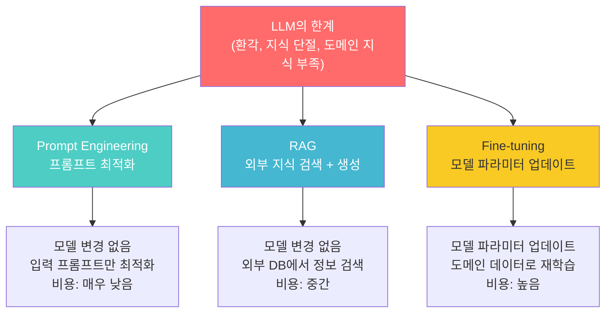
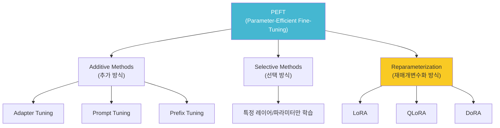
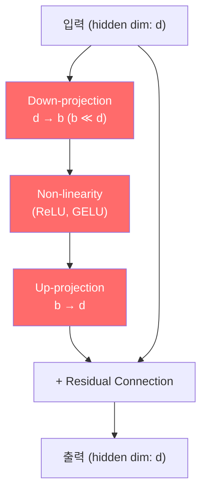
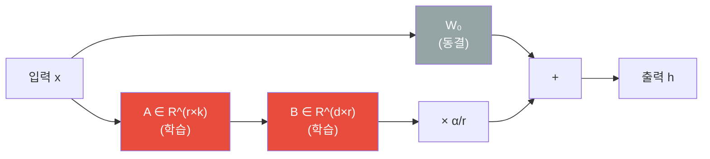
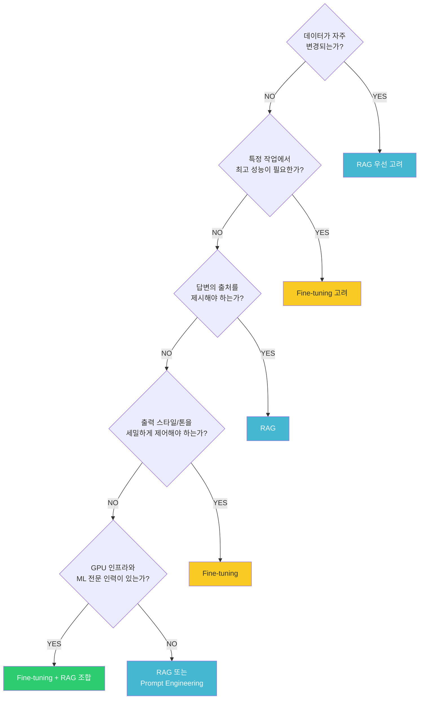
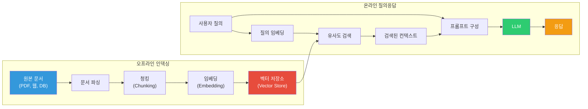
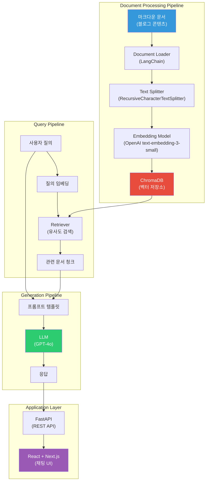

> 이 글은 **RAG 기반 블로그 Q&A 챗봇 만들기** 시리즈의 첫 번째 편이다. LLM의 한계를 이해하고, 이를 극복하기 위한 적응 기법들을 비교한 뒤, RAG 아키텍처의 개념과 설계를 알아본다.
> - **편 1** (이 글): LLM 적응 기법과 RAG 개념
> - **편 2**: [RAG 파이프라인과 기본 구현](../rag-기반-블로그-qa-챗봇-만들기-2-rag-파이프라인과-기본-구현)
> - **편 3**: [프롬프트 엔지니어링과 RAG 최적화](../../start/rag-기반-블로그-qa-챗봇-만들기-3-프롬프트-엔지니어링과-rag-최적화)
> - **편 4**: [토이 프로젝트: AI-Chat 구현기](../../start/rag-기반-블로그-qa-챗봇-만들기-4-토이-프로젝트-ai-chat-구현기)

# 1. LLM 적응 기법 개요

## 1.1 LLM의 한계

LLM(Large Language Model)은 대규모 텍스트 데이터로 사전학습되어 범용적인 언어 이해와 생성 능력을 갖추고 있다. 하지만 실무에서 LLM을 활용하려면 다음 세 가지 근본적인 한계를 이해해야 한다.

### 1.1.1 환각(Hallucination) 문제

환각이란 LLM이 **유창하고 그럴듯하게 들리지만, 사실과 다르거나 완전히 지어낸 정보를 생성하는 현상**이다. 모델이 "자신 있게 틀린 답을 말하는" 것이 핵심 문제다.

| 유형 | 정의 | 예시 |
|------|------|------|
| **Intrinsic Hallucination** | 입력 소스와 **모순되는** 출력 생성 | "아인슈타인은 독일 울름에서 태어났다" → "베를린에서 태어났다" |
| **Extrinsic Hallucination** | 소스에 없는 **검증 불가능한** 정보 생성 | 존재하지 않는 논문이나 판례를 인용 |
| **Fabrication** | 완전히 새로운 정보를 날조 | 실존하지 않는 URL, API 엔드포인트 생성 |

환각이 발생하는 주요 원인은 다음과 같다.

- **확률적 생성 메커니즘**: LLM은 "가장 사실적인 다음 토큰"이 아니라 "통계적으로 가장 가능성 높은 다음 토큰"을 선택한다
- **학습 데이터의 불완전성**: 인터넷에서 수집된 데이터 자체에 오류, 편향, 모순된 정보가 포함되어 있다
- **지식의 압축 손실**: 수조 개의 토큰에서 학습한 지식이 고정된 파라미터에 압축 저장되므로, 세부적인 사실이 왜곡되거나 혼합될 수 있다

실제로 Stanford 연구에 따르면, GPT-3.5는 법률 질의에 대해 69%, Meta의 Llama 2는 88%의 환각률을 보였다. 2023년에는 변호사가 ChatGPT가 생성한 6개의 가짜 판례를 연방법원에 제출하여 5,000달러 벌금을 부과받은 사건(Mata v. Avianca)도 있었다.

### 1.1.2 지식 단절(Knowledge Cutoff)

LLM의 학습 데이터는 **특정 시점까지의 정보만 포함**하기 때문에, 그 이후에 발생한 사건이나 업데이트된 정보에 대해 알지 못한다.

| 모델 | Knowledge Cutoff |
|------|-----------------|
| GPT-5.2 | 2025년 8월 |
| GPT-4.1 | 2024년 6월 |
| Claude Opus 4.6 | 2025년 8월 |
| Claude Sonnet 4.6 | 2025년 8월 |
| Gemini 2.5 Pro | 2025년 1월 |
| Llama 4 | 2024년 8월 |

이로 인해 "2026년 1월 주요 뉴스", "Next.js 16의 새로운 기능", "최근 개정된 법률" 같은 질의에 대해 부정확한 답변을 생성하거나 답변 자체가 불가능하다.

### 1.1.3 도메인 특화 지식 부족

LLM은 공개된 인터넷 데이터로 학습되므로, 비공개 또는 특수 도메인 지식이 부재하다.

| 카테고리 | 예시 |
|----------|------|
| 기업 내부 문서 | 사내 위키, 내부 API 문서, 운영 매뉴얼, HR 정책 |
| 최신 API/SDK 문서 | 최근 출시된 라이브러리의 변경된 인터페이스 |
| 산업 특화 용어 | 의료 진단 코드, 금융 규정, 법률 조항 해석 |
| 조직 고유 컨텍스트 | 사내 코딩 컨벤션, 아키텍처 결정 기록(ADR), 장애 대응 절차 |

## 1.2 적응 기법 비교: Fine-tuning vs Prompt Engineering vs RAG

LLM의 한계를 극복하기 위한 세 가지 주요 적응 기법이 있다.



### 각 접근법의 핵심 정의

**Prompt Engineering**은 모델의 파라미터를 변경하지 않고, **입력 프롬프트를 최적화**하여 원하는 출력을 유도하는 기법이다. Zero-shot, Few-shot, Chain-of-Thought(CoT), Role Prompting 등 다양한 기법이 있다.

**RAG(Retrieval-Augmented Generation)**는 LLM에 **외부 지식 베이스를 연결**하여, 질의 시점에 관련 문서를 검색하고 이를 컨텍스트로 제공하여 응답을 생성하는 기법이다.

**Fine-tuning**은 사전학습된 LLM을 **특정 도메인의 데이터셋으로 추가 학습**시켜, 모델의 내부 파라미터를 업데이트하는 기법이다.

### 비교표

| 비교 항목 | Prompt Engineering | RAG | Fine-tuning |
|-----------|-------------------|-----|-------------|
| **구현 시간** | 수 시간 ~ 수 일 | 수 일 ~ 수 주 | 수 주 ~ 수 개월 |
| **비용** | 매우 낮음 | 중간 (벡터DB 운영비) | 높음 (GPU + 추론 비용) |
| **기술적 난이도** | 낮음 | 중간 | 높음 (ML 전문 지식 필요) |
| **모델 변경** | 없음 | 없음 | 파라미터 업데이트 |
| **최신 정보 반영** | 수동 삽입 | DB 업데이트로 즉시 반영 | 재학습 필요 |
| **환각 감소** | 제한적 | 높음 (출처 기반 답변) | 중간 |
| **데이터 요구량** | 없음 ~ 소량 | 문서 코퍼스 | 대량의 라벨링 데이터 |
| **출력 스타일 제어** | 중간 | 낮음 | 높음 |

### 언제 어떤 기법을 선택할 것인가

**Prompt Engineering**: 빠른 프로토타이핑, 다양한 작업을 하나의 모델로 처리, 예산이 제한적일 때

**RAG**: 최신 정보가 중요한 경우, 사실 정확도가 핵심인 경우(법률, 의료, 금융), 데이터가 자주 변경되는 경우, 답변의 출처를 제시해야 할 때

**Fine-tuning**: 특정 작업에서 최고 성능이 필요한 경우, 일관된 출력 스타일 제어가 중요한 경우, 도메인 전문 용어 이해가 필수인 경우

> **실무 권장사항**: 시작은 항상 Prompt Engineering으로 기준점을 확보하고, 지식 보강이 필요하면 RAG를 도입하며, RAG로 부족할 때만 Fine-tuning을 추가하는 것이 비용 대비 효과적이다. 세 가지를 조합하여 사용하는 것이 실무의 정석이다.

---

# 2. Fine-tuning 기법

## 2.1 전통적 Fine-tuning

전통적 Fine-tuning은 사전학습된 모델의 **모든 파라미터를 특정 작업의 데이터로 업데이트**하는 방식이다.

| 문제 | 설명 |
|------|------|
| 막대한 계산 비용 | 7B 모델 기준 수십 GB GPU 메모리 필요, 70B 모델은 수백 GB |
| Catastrophic Forgetting | 새 데이터 학습 시 기존 일반 지식을 잊어버리는 현상 |
| 대량의 데이터 필요 | 과적합 방지를 위해 고품질 학습 데이터 대량 확보 필요 |
| 저장 공간 | 각 작업마다 전체 모델 복사본 저장 필요 (7B 모델 = 약 14GB/copy) |

## 2.2 Parameter-Efficient Fine-Tuning (PEFT)

PEFT는 **모델의 전체 파라미터 중 극히 일부만 학습**하거나, **소규모 외부 모듈을 추가**하여 효율적으로 적응시키는 방법론의 총칭이다. 원래 모델의 파라미터는 동결(freeze)하고, 새로 추가된 소수의 파라미터만 업데이트한다.



PEFT의 핵심 장점은 다음과 같다.

- **메모리 효율성**: 전체 Fine-tuning 대비 메모리 사용량 10~20배 감소
- **Catastrophic Forgetting 완화**: 원본 가중치를 보존하므로 기존 지식 유지
- **저장 효율성**: 작업별로 소규모 어댑터만 저장 (수 MB ~ 수십 MB)
- **품질 유지**: 전체 Fine-tuning 대비 90~95% 수준의 성능 달성

### Adapters

Houlsby et al. (2019)이 제안한 방법으로, Transformer 블록 내부에 **소규모 병목(bottleneck) 모듈을 삽입**하는 방식이다.



원본 모델의 파라미터는 완전히 동결하고, 새로 삽입된 어댑터 모듈만 학습한다. GLUE 벤치마크에서 전체 파라미터의 **약 3%만 학습**하면서도 Full Fine-tuning과 거의 동일한 성능을 달성했다.

단점은 추론 시 추가 레이어를 통과해야 하므로 **추론 지연(latency)이 증가**한다는 점이다.

### LoRA (Low-Rank Adaptation)

Hu et al. (2021)이 제안한 방법으로, 기존 가중치 행렬의 업데이트를 **저랭크(low-rank) 행렬 분해**로 근사하는 기법이다.

사전학습된 가중치 행렬 `W₀ ∈ R^(d×k)`에 대해, 가중치 업데이트 `ΔW`를 저랭크 행렬의 곱으로 표현한다.

```
W = W₀ + ΔW = W₀ + B × A

- W₀: 사전학습된 가중치 (동결)
- B ∈ R^(d×r): 저랭크 행렬 (학습 대상)
- A ∈ R^(r×k): 저랭크 행렬 (학습 대상)
- r: 랭크(rank), r ≪ min(d, k)
```

파라미터 효율성을 계산해 보면, d = k = 4096이고 r = 8일 때 전체 업데이트는 16,777,216개 파라미터가 필요하지만, LoRA는 65,536개(**약 0.39%**)만으로 가능하다.



LoRA가 작동하는 이유는 **내재적 랭크 가설(Intrinsic Rank Hypothesis)** 때문이다. 사전학습된 대규모 모델의 가중치 변화는 실제로 매우 낮은 내재적 차원을 가지며, 핵심적인 변화는 저차원 부분공간에서 포착될 수 있다.

| 장점 | 설명 |
|------|------|
| 추론 지연 없음 | 학습 후 `W₀ + BA`를 미리 합산하면 추가 연산 불필요 |
| 작업 전환 용이 | LoRA 가중치만 교체하면 다른 작업으로 전환 가능 |
| 파라미터 99% 감소 | 단일 GPU에서 대규모 모델 Fine-tuning 가능 |
| 원본 모델 보존 | W₀를 변경하지 않으므로 Catastrophic Forgetting 완화 |

주요 하이퍼파라미터로는 **Rank(r)** (보통 4, 8, 16, 32, 64), **Alpha(α)** (스케일링 팩터, ΔW에 α/r 곱함), **Target Modules** (보통 Q, V attention 행렬)이 있다.

### QLoRA (Quantized LoRA)

Dettmers et al. (2023)이 제안한 방법으로, **4비트 양자화된 기본 모델 위에 LoRA를 적용**하는 기법이다.

QLoRA의 3가지 핵심 혁신은 다음과 같다.

**1) 4-bit NormalFloat (NF4) 양자화**: 신경망 가중치가 정규분포를 따른다는 특성을 활용하여, 정규분포에 최적화된 4비트 데이터 타입으로 압축한다. 16비트 대비 메모리 75% 절감.

**2) Double Quantization (이중 양자화)**: 양자화 상수 자체도 다시 양자화하여 추가 메모리를 절약한다. 65B 모델 기준 약 3GB 추가 절감.

**3) Paged Optimizers**: 메모리 스파이크 발생 시 옵티마이저 상태를 GPU에서 CPU로 자동 페이징하여 OOM을 방지한다.

| 방법 | 65B 모델 Fine-tuning에 필요한 GPU 메모리 |
|------|----------------------------------------|
| Full Fine-tuning | ~780GB (A100 80GB x 10장 이상) |
| LoRA (FP16) | ~130GB (A100 80GB x 2장) |
| **QLoRA (NF4)** | **~48GB (A100 48GB 1장)** |

QLoRA의 실질적 의의는 **70B 파라미터 모델**을 24GB VRAM의 소비자용 GPU에서 Fine-tuning 가능하게 하여, 대규모 모델 커스터마이징의 **민주화**를 실현했다는 점이다.

## 2.3 Fine-tuning vs RAG 선택 가이드

| 비교 항목 | Fine-tuning | RAG |
|-----------|-------------|-----|
| 핵심 원리 | 모델 파라미터 업데이트 | 외부 지식 검색 + 컨텍스트 주입 |
| 최신 정보 반영 | 재학습 필요 (비용 높음) | DB 업데이트만으로 즉시 반영 |
| 환각 감소 | 도메인 내 정확도 향상 | 출처 기반 답변으로 크게 감소 |
| 출처 제시 | 불가능 (모델에 내재화) | 가능 (검색 문서 참조) |
| 데이터 프라이버시 | 학습 데이터가 모델에 영구 내재화 | 데이터가 외부 DB에 분리 보관 |
| 추론 속도 | 빠름 (추가 검색 없음) | 약간 느림 (검색 + 생성 2단계) |
| 출력 스타일 제어 | 우수 (톤, 형식 학습 가능) | 제한적 (프롬프트로만 제어) |
| 다중 도메인 지원 | 도메인별 별도 모델 필요 | 하나의 시스템으로 여러 도메인 커버 |



---

# 3. RAG 아키텍처 개요

## 3.1 RAG란 무엇인가?

**RAG(Retrieval-Augmented Generation)**는 LLM의 응답 품질을 **외부 데이터 검색**을 통해 향상시키는 기술이다. "권위 있는 외부 데이터를 사용하여 모델 출력의 정확성, 관련성, 유용성을 개선하는 기법"으로, 이름에 담긴 세 단계가 핵심이다.

**Retrieval(검색)**: 사용자 질의를 벡터화하여 외부 지식 소스에서 관련 문서를 검색한다.

**Augmented(증강)**: 검색된 문서와 사용자 질의를 결합하여 LLM에 전달할 프롬프트를 구성한다.

**Generation(생성)**: 증강된 프롬프트를 기반으로 LLM이 근거 있는 응답을 생성한다.



## 3.2 Naive RAG vs Advanced RAG vs Modular RAG

RAG 아키텍처는 Naive → Advanced → Modular 순으로 발전해 왔다.

| 구분 | Naive RAG | Advanced RAG | Modular RAG |
|------|-----------|-------------|-------------|
| **파이프라인** | 단순 선형 (검색 → 생성) | 최적화된 선형 (전처리 → 검색 → 후처리 → 생성) | 모듈 조합형 (유연한 파이프라인) |
| **검색 품질** | 기본 벡터 유사도 | Re-ranking, Query Rewriting 적용 | 다중 검색 전략 조합 |
| **장점** | 구현 간단, 빠른 프로토타이핑 | 정확도 향상, 환각 감소 | 최대 유연성, 확장성 |
| **단점** | 낮은 정밀도/재현율 | 구현 복잡도 증가 | 설계/유지보수 복잡 |
| **적합한 경우** | PoC, 간단한 QA | 프로덕션 시스템 | 대규모 엔터프라이즈 |

### Naive RAG

가장 기초적인 RAG 형태다. 사용자 질문을 받아 문서를 검색하고, 아무런 조정 없이 그대로 LLM에 전달한다.

주요 한계점은 **낮은 정밀도**(검색된 청크가 질문과 정렬되지 않음), **낮은 재현율**(관련 청크를 모두 찾지 못함), **환각**(부정확한 컨텍스트로 인한 잘못된 응답)이다.

### Advanced RAG

Naive RAG의 한계를 극복하기 위해 검색 전후에 다양한 최적화 기법을 적용한다.

- **Pre-Retrieval**: Query Rewriting (질의를 검색에 최적화된 형태로 변환), Query Expansion (유사 질의 생성으로 검색 범위 확대), Query Routing (질의 유형에 따라 검색 전략 선택)
- **Post-Retrieval**: Re-ranking (검색 결과 관련성 재평가), Compression (불필요한 정보 제거), Filtering (메타데이터 기반 필터링)

### Modular RAG

가장 유연하고 확장 가능한 패러다임이다. Search Module, Memory Module, Fusion Module, Routing Module, Predict Module 등을 자유롭게 조합하여 사용한다.

## 3.3 RAG 전체 설계 (Overall Design)

이 블로그 시리즈에서 구현하는 RAG 챗봇의 전체 아키텍처는 다음과 같다.



설계 시 고려사항은 다음과 같다.

- **Latency**: 검색 + 생성 2단계로 인한 응답 지연 최소화 (벡터 인덱싱 최적화, 스트리밍 응답)
- **정확도**: 청킹 전략과 임베딩 모델 선택이 검색 품질에 직접 영향
- **비용 트레이드오프**: 임베딩 모델 API 비용 vs 로컬 모델 운영 비용, LLM API 호출 비용 최적화

---

> 다음 편에서는 RAG 파이프라인의 각 단계(문서 파싱, 청킹, 인덱싱, 벡터 저장소, 검색, 생성)를 상세히 살펴보고, LangChain으로 기본 RAG 챗봇을 구현한다.

---

# 4. 참고

- [AWS - What is RAG?](https://aws.amazon.com/what-is/retrieval-augmented-generation/)
- [IBM - RAG vs Fine-tuning vs Prompt Engineering](https://www.ibm.com/think/topics/rag-vs-fine-tuning-vs-prompt-engineering)
- [LangChain RAG Documentation](https://docs.langchain.com/oss/python/langchain/rag)
- [NVIDIA - RAG 101](https://developer.nvidia.com/blog/rag-101-demystifying-retrieval-augmented-generation-pipelines/)
- [Pinecone - RAG Guide](https://www.pinecone.io/learn/retrieval-augmented-generation/)
- [LoRA 원본 논문 - Hu et al. (2021)](https://arxiv.org/pdf/2106.09685)
- [QLoRA 원본 논문 - Dettmers et al. (2023)](https://arxiv.org/abs/2305.14314)
- [Hugging Face PEFT](https://github.com/huggingface/peft)
- [Stanford HAI - Hallucinating Law](https://hai.stanford.edu/news/hallucinating-law-legal-mistakes-large-language-models-are-pervasive)
