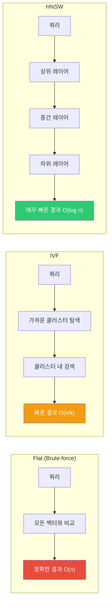
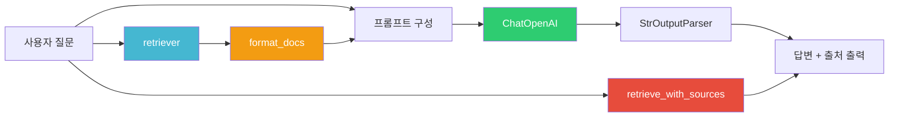

> 이 글은 **RAG 기반 블로그 Q&A 챗봇 만들기** 시리즈의 두 번째 편이다. 이전 편에서 LLM 적응 기법과 RAG 개념을 살펴보았다. 이번 편에서는 RAG 파이프라인의 각 단계를 상세히 알아보고, LangChain으로 기본 RAG 챗봇을 직접 구현한다.
> - **편 1**: [LLM 적응 기법과 RAG 개념](../rag-기반-블로그-qa-챗봇-만들기-1-llm-적응-기법과-rag-개념)
> - **편 2** (이 글): RAG 파이프라인과 기본 구현
> - **편 3**: [프롬프트 엔지니어링과 RAG 최적화](../../start/rag-기반-블로그-qa-챗봇-만들기-3-프롬프트-엔지니어링과-rag-최적화)
> - **편 4**: [토이 프로젝트: AI-Chat 구현기](../../start/rag-기반-블로그-qa-챗봇-만들기-4-토이-프로젝트-ai-chat-구현기)

# 1. RAG 파이프라인 - Retrieval

## 1.1 문서 파싱 (Document Parsing)

문서 파싱은 RAG 파이프라인의 첫 번째 단계로, 다양한 형식의 문서에서 텍스트와 구조 정보를 추출하는 과정이다.

### Rule-based 파싱

전통적인 방식으로, 미리 정의된 규칙에 따라 문서에서 정보를 추출한다.

- **정규식 기반 추출**: 이메일, 날짜, 전화번호 등 패턴 매칭
- **구조 기반 추출**: HTML/XML 파서(BeautifulSoup), PDF 파서(PyPDF2, pdfplumber), 테이블 추출(tabula-py)

장점은 속도가 매우 빠르고, 동일 입력에 대해 결정론적 출력을 보장하며, API 비용이 없다는 점이다. 단점은 형식이 조금만 변해도 깨지기 쉽고(brittle), 이미지나 스캔 PDF를 처리할 수 없다는 점이다.

### AI-based 파싱

AI 모델을 활용하여 문서의 레이아웃과 의미를 이해하고 정보를 추출하는 방식이다.

| 도구 | 개발사 | 특징 |
|------|--------|------|
| **Unstructured.io** | Unstructured | 오픈소스, 다양한 포맷 지원, 자동화 파이프라인에 강함 |
| **LlamaParse** | LlamaIndex | Vision-Language 모델 활용, 복잡한 PDF 표/그래프 파싱 |
| **Docling** | IBM Research | 오픈소스, PDF/DOCX/PPTX/XLSX/HTML/이미지 등 다양한 포맷, OCR 내장 |
| **Amazon Textract** | AWS | 대규모 스캔 문서 처리, 양식 인식 |

### LangChain Document Loaders 활용

LangChain Document Loaders는 다양한 파일 형식을 `Document` 객체로 변환하는 통합 인터페이스를 제공한다.

```python
# PDF 로더
from langchain_community.document_loaders import PyPDFLoader
loader = PyPDFLoader("document.pdf")
docs = loader.load()

# 웹 페이지 로더
from langchain_community.document_loaders import WebBaseLoader
loader = WebBaseLoader("https://example.com")
docs = loader.load()

# CSV 로더
from langchain_community.document_loaders import CSVLoader
loader = CSVLoader("data.csv")
docs = loader.load()
```

## 1.2 청킹 전략 (Chunking)

청킹은 긴 문서를 LLM이 처리할 수 있는 작은 단위로 분할하는 과정이다. 청킹 전략은 RAG 시스템의 **검색 품질에 직접적인 영향**을 미치는 핵심 단계다.

### Fixed-size Chunking (고정 크기 분할)

가장 단순한 방식으로, 정해진 문자/토큰 수에 따라 기계적으로 텍스트를 분할한다.

```python
from langchain_text_splitters import CharacterTextSplitter

text_splitter = CharacterTextSplitter(
    chunk_size=500,
    chunk_overlap=50,
    separator=""
)
chunks = text_splitter.split_text(text)
```

구현이 매우 간단하고 처리 속도가 빠르지만, 문맥 경계를 무시하여 문장 중간에서 잘릴 수 있다.

### Recursive Chunking (재귀적 분할)

계층적 구분자 목록(`['\n\n', '\n', ' ', '']`)을 사용하여 단계적으로 텍스트를 분할한다. 먼저 큰 구분자(단락)로 나누고, 청크가 너무 크면 다음 구분자(줄바꿈)로 재귀적으로 분할한다.

```python
from langchain_text_splitters import RecursiveCharacterTextSplitter

text_splitter = RecursiveCharacterTextSplitter(
    chunk_size=500,
    chunk_overlap=50,
    separators=["\n\n", "\n", " ", ""],
)
chunks = text_splitter.create_documents([text])
```

문서 구조(단락, 문장)를 보존하면서도 구현이 간단하여, **대부분의 RAG 애플리케이션에서 권장되는 기본 전략**이다. Chroma 테스트에서 400~512 토큰 설정으로 85~90% Recall을 달성했다.

### Semantic Chunking (의미 기반 분할)

임베딩 모델을 사용하여 문장 간 의미적 유사도를 계산하고, 유사도가 급격히 변하는 지점에서 청크를 분할한다.

```python
from langchain_experimental.text_splitter import SemanticChunker
from langchain_openai import OpenAIEmbeddings

text_splitter = SemanticChunker(
    OpenAIEmbeddings(),
    breakpoint_threshold_type="percentile",
    breakpoint_threshold_amount=95,
)
chunks = text_splitter.create_documents([text])
```

의미적으로 일관된 청크를 생성하여 단순 방법 대비 Recall 최대 9% 향상을 보이지만, 모든 문장에 대해 임베딩 계산이 필요하여 비용과 시간이 증가한다.

### chunk_size와 chunk_overlap 파라미터 가이드

| 파라미터 | 설명 | 권장값 |
|----------|------|--------|
| **chunk_size** | 하나의 청크에 포함될 최대 문자(토큰) 수 | 256~512 토큰 |
| **chunk_overlap** | 인접한 두 청크가 공유하는 문자(토큰) 수 | chunk_size의 10~20% |

- 작은 chunk_size(128~256): 정밀한 사실 기반 질의에 유리
- 큰 chunk_size(256~512): 복잡한 추론이 필요한 질의에 유리
- 겹침이 많을수록 문맥 보존은 좋지만 저장 비용과 처리 시간 증가

| 문서 유형 | chunk_size | chunk_overlap |
|-----------|-----------|--------------|
| 기술 문서 | 400~500 토큰 | 50~100 |
| 고객 지원 로그 | 150~250 토큰 | 15~50 |
| 법률 문서 | 300~500 토큰 | 50~100 |
| FAQ | 128~256 토큰 | 20~50 |

## 1.3 인덱싱 (Indexing)

인덱싱은 청킹된 문서를 효율적으로 검색할 수 있도록 구조화하는 단계다. 크게 네 가지 방식이 있다.

### 키워드 인덱싱 (BM25, TF-IDF)

**TF-IDF**는 단어 빈도(TF)와 역문서 빈도(IDF)를 곱하여, 특정 문서에서 중요한 단어를 식별한다. 흔한 단어는 IDF가 낮아 가중치가 감소하고, 특정 문서에만 나타나는 핵심 단어는 높은 점수를 받는다.

**BM25**는 TF-IDF의 개선 버전으로, 현재 키워드 검색의 사실상 표준이다. 문서 길이 정규화와 TF 포화(saturation) 기능이 추가되어 더 정확한 결과를 제공한다.

BM25는 순수 통계적 방법으로 벡터 임베딩 없이 정확한 키워드 매칭을 수행하며, 정확한 용어 매칭이 중요한 전문 용어 검색이나 코드 검색에 적합하다.

### Full-text 인덱싱 (Elasticsearch)

Elasticsearch는 분산형 검색/분석 엔진으로, 풀텍스트 검색 + 벡터 검색 + 하이브리드 검색을 모두 지원한다. 필터링, 집계, 보안 기능 등 엔터프라이즈 기능이 내장되어 있다.

### Knowledge-based 인덱싱 (지식 그래프)

**GraphRAG** 접근법으로, 데이터를 엔티티(Entity)와 관계(Relationship)로 구조화한다. 전통적 문서 기반 RAG의 한계(좁은 컨텍스트 윈도우, 단절된 데이터)를 극복하며, 엔티티 간 관계가 중요한 도메인(의료, 법률, 금융)에 적합하다.

### 벡터 인덱싱 (임베딩 모델)

텍스트를 고차원 벡터 공간에 매핑하여 **의미적 유사도**를 계산하는 방식이다. RAG 시스템에서 가장 핵심적인 인덱싱 방식이다.

#### 임베딩 모델 비교

| 모델 | 차원 | 비용 | 특징 |
|------|------|------|------|
| **OpenAI text-embedding-3-large** | 3072 | $0.13/1M 토큰 | Matryoshka 학습으로 유연한 차원 축소 가능 |
| **OpenAI text-embedding-3-small** | 1536 | $0.02/1M 토큰 | 비용 효율적, 소규모 프로젝트에 적합 |
| **Cohere embed-v4** | 1024 | 유료 | MTEB 1위급 성능, Reranker와 함께 사용 시 최적 |
| **Sentence Transformers (all-MiniLM-L6-v2)** | 384 | 무료 (로컬) | 경량, 빠른 추론 속도 |
| **BGE (BAAI)** | 1024 | 무료 (로컬) | 중국어/영어 우수, 오픈소스 |

#### 벡터 공간에서의 유사도 메트릭

| 메트릭 | 범위 | 특징 | 적합한 경우 |
|--------|------|------|------------|
| **Cosine Similarity** | -1 ~ 1 | 방향만 비교, 크기 무시 | NLP, 문서 유사도 (가장 일반적) |
| **Euclidean Distance** | 0 ~ ∞ | 절대적 거리 측정 | 클러스터링, 이상 탐지 |
| **Dot Product** | -∞ ~ ∞ | 방향 + 크기 반영 | 추천 시스템, 협업 필터링 |

대부분의 RAG 시스템에서는 **Cosine Similarity**가 표준이다. 임베딩 벡터가 정규화되어 있으면 Cosine Similarity와 Dot Product는 동일한 결과를 낸다.

## 1.4 벡터 저장소 (Vector Store)

벡터 저장소는 임베딩된 벡터를 저장하고 유사도 기반 검색을 수행하는 전문 데이터베이스다.

### 주요 벡터 저장소 비교

| 항목 | **ChromaDB** | **FAISS** | **Pinecone** | **Weaviate** |
|------|-------------|-----------|-------------|-------------|
| 유형 | 오픈소스 DB | 오픈소스 라이브러리 | 완전 관리형 SaaS | 오픈소스 DB |
| 개발사 | Chroma | Meta | Pinecone Systems | Weaviate B.V. |
| 검색 유형 | 벡터 + 메타데이터 | 벡터 (순수) | 벡터 + 하이브리드 | 벡터 + BM25 하이브리드 |
| 확장성 | 소~중규모 | 수십억 벡터 | 수십억 (자동 확장) | 수억 벡터 |
| 가격 | 무료 | 무료 | 무료 티어 + $50/월~ | 무료 (셀프호스팅) |
| 적합한 경우 | 프로토타이핑, 학습용 | 연구, 고성능, 커스텀 인덱싱 | 프로덕션, 엔터프라이즈 | 하이브리드 검색, 멀티모달 |

### 인덱싱 알고리즘: Flat vs IVF vs HNSW

| 항목 | Flat (Brute-force) | IVF | HNSW |
|------|-------------------|-----|------|
| **원리** | 모든 벡터와 거리 계산 | k-means 클러스터링 후 관련 클러스터만 검색 | 계층적 그래프 탐색 |
| **검색 정확도** | 100% (정확) | 높음 (nprobe에 따라) | 매우 높음 (ef에 따라) |
| **검색 속도** | 느림 O(n) | 빠름 | 매우 빠름 |
| **메모리** | 낮음 | 중간 | 높음 (그래프 연결 정보) |
| **업데이트** | 즉시 가능 | 재학습 필요할 수 있음 | 동적 추가/삭제 용이 |
| **적합한 규모** | < 10만 벡터 | 10만 ~ 수억 | 10만 ~ 수천만 |



---

# 2. RAG 파이프라인 - Generation

## 2.1 검색 방법 (Search Methods)

### Exact Nearest Neighbor (Brute-force)

쿼리 벡터와 데이터베이스의 **모든 벡터** 사이의 거리를 하나씩 계산하여 가장 가까운 벡터를 찾는 방식이다.

```python
import faiss

d = 128       # 벡터 차원
index = faiss.IndexFlatL2(d)
index.add(vectors)

# 검색 - 모든 벡터와 비교
D, I = index.search(query_vector, k=5)
```

100% 정확한 결과를 보장하지만, O(n*d) 시간 복잡도로 대규모 데이터셋에서는 실시간 검색이 불가능하다. 데이터셋이 10만 건 미만이거나, 벤치마크 Ground Truth 생성 시 사용한다.

### Approximate Nearest Neighbor (ANN)

정확도를 소량 희생하는 대신 검색 속도를 극적으로 향상시키는 방식이다.

**LSH (Locality Sensitive Hashing)**: 유사한 벡터가 같은 해시 버킷에 들어갈 확률이 높도록 설계된 특수 해시 함수를 사용한다. 메모리 효율적이지만 고차원 데이터에서 성능이 저하될 수 있다.

**HNSW (Hierarchical Navigable Small World)**: 다층 그래프 구조를 구축하여, 최상위 레이어에서 대략적 위치를 파악하고 하위 레이어로 내려가며 정밀 검색한다. ANN 방법 중 **최고 수준의 정확도와 검색 속도**를 제공한다.

**IVF (Inverted File Index)**: k-means 알고리즘으로 전체 벡터 공간을 여러 클러스터로 분할하고, 검색 시 쿼리와 가장 가까운 nprobe개의 클러스터만 탐색한다.

### Exact vs ANN 트레이드오프

| 항목 | Exact NN | ANN |
|------|----------|-----|
| 정확도 | 100% (완벽) | 95~99%+ |
| 검색 속도 | O(n*d), 느림 | O(log n) ~ O(1), 빠름 |
| 확장성 | 수만~수십만 한계 | 수억~수십억 가능 |
| 적합한 경우 | 소규모 데이터, Ground Truth | 프로덕션 시스템 |

## 2.2 검색된 컨텍스트 기반 답변 생성

검색 단계에서 가장 관련성 높은 문서 청크를 찾으면, 이를 LLM에 전달하여 최종 답변을 생성한다.

### 검색 결과를 LLM에 전달하는 방식

```python
from langchain_core.prompts import ChatPromptTemplate

template = """다음 컨텍스트를 기반으로 질문에 답변하세요.
컨텍스트에 답이 없으면 "해당 정보를 찾을 수 없습니다"라고 답변하세요.

컨텍스트:
{context}

질문: {question}

답변:"""

prompt = ChatPromptTemplate.from_template(template)
```

프롬프트 템플릿에 검색된 문서를 `{context}`로, 사용자 질문을 `{question}`으로 삽입한다. "답을 모를 때" 처리 지시를 포함하여 환각을 방지한다.

### 컨텍스트 윈도우와 top_k의 관계

**top_k**는 검색 결과에서 상위 몇 개의 문서를 LLM에 전달할지 결정하는 파라미터다.

- **top_k가 작을 때** (3~5): 가장 관련성 높은 문서만 전달하여 노이즈 최소화. 정밀한 답변에 유리
- **top_k가 클 때** (10~20): 더 많은 컨텍스트를 제공하여 종합적인 답변 가능. 단, 노이즈 증가 및 토큰 비용 증가

LLM의 컨텍스트 윈도우 크기에 따라 전달 가능한 문서 수가 제한된다. GPT-4o(128K 토큰)는 상당히 많은 문서를 포함할 수 있지만, 컨텍스트가 길어질수록 중간 부분의 정보를 놓치는 **"Lost in the Middle"** 문제가 발생할 수 있으므로, 적절한 top_k 값을 찾는 것이 중요하다.

---

# 3. 기본 RAG 챗봇 구현

이 섹션에서는 앞서 배운 RAG 개념을 **단일 파일 코드**로 직접 구현해본다. 복잡한 프로젝트 구조 없이 핵심 동작 원리에 집중하되, **유사도 점수와 출처 표시**, **대화형 루프**까지 포함하여 실용적인 수준으로 구현한다.

> 전체 소스 코드는 [tutorials-python/ai/rag/basic-rag](https://github.com/kenshin579/tutorials-python/tree/main/ai/rag/basic-rag)를 참조한다.

## 3.1 의존성 설치

```bash
pip install langchain langchain-openai langchain-chroma langchain-community
```

또는 `pyproject.toml`을 사용하는 경우:

```bash
pip install -e .
```

## 3.2 전체 코드

`main.py` 하나로 **문서 인덱싱**, **출처 포함 질의응답**, **대화형 모드**가 모두 동작한다.

```python
import os
import sys

from langchain_chroma import Chroma
from langchain_community.document_loaders import DirectoryLoader, TextLoader
from langchain_core.output_parsers import StrOutputParser
from langchain_core.prompts import ChatPromptTemplate
from langchain_core.runnables import RunnablePassthrough
from langchain_openai import ChatOpenAI, OpenAIEmbeddings
from langchain_text_splitters import RecursiveCharacterTextSplitter

CHROMA_DIR = "./chroma_db"
DOCS_DIR = "./docs"

embeddings = OpenAIEmbeddings(model="text-embedding-3-small")


# ── 1단계: 문서 인덱싱 ──────────────────────────────────
def index_documents():
    """문서를 로드 → 청킹 → 임베딩 → 벡터 저장소에 저장"""

    loader = DirectoryLoader(DOCS_DIR, glob="**/*.md", loader_cls=TextLoader)
    documents = loader.load()
    print(f"로드된 문서: {len(documents)}개")

    splitter = RecursiveCharacterTextSplitter(chunk_size=500, chunk_overlap=50)
    chunks = splitter.split_documents(documents)
    print(f"생성된 청크: {len(chunks)}개")

    Chroma.from_documents(chunks, embeddings, persist_directory=CHROMA_DIR)
    print("인덱싱 완료!")


# ── 2단계: 유사도 검색 + 출처 표시 ────────────────────────
def retrieve_with_sources(vector_store, question: str, k: int = 3):
    """유사도 점수와 함께 관련 문서를 검색하고 출처 정보를 반환"""
    results = vector_store.similarity_search_with_relevance_scores(question, k=k)

    sources = []
    for doc, score in results:
        source_file = os.path.basename(doc.metadata.get("source", "알 수 없음"))
        sources.append({
            "file": source_file,
            "score": score,
            "preview": doc.page_content[:80] + "...",
        })
    return results, sources


def format_docs_simple(docs):
    """retriever용 포맷 함수 (Document 리스트 → 텍스트)"""
    return "\n\n".join(doc.page_content for doc in docs)


def print_sources(sources):
    """출처 정보를 포맷팅하여 출력"""
    print("\n참조 문서:")
    for i, src in enumerate(sources, 1):
        print(f"  [{i}] {src['file']} (유사도: {src['score']:.3f})")
        print(f"      {src['preview']}")


# ── 3단계: RAG 체인 구성 ─────────────────────────────────
def build_chain(vector_store):
    """RAG 체인을 구성하여 반환"""

    prompt = ChatPromptTemplate.from_template(
        """다음 컨텍스트를 기반으로 질문에 답변하세요.
컨텍스트에 답이 없으면 "해당 정보를 찾을 수 없습니다"라고 답변하세요.

컨텍스트:
{context}

질문: {question}
답변:"""
    )

    retriever = vector_store.as_retriever(search_kwargs={"k": 3})

    chain = (
        {"context": retriever | format_docs_simple, "question": RunnablePassthrough()}
        | prompt
        | ChatOpenAI(model="gpt-4o", temperature=0)
        | StrOutputParser()
    )
    return chain


def query(question: str):
    """단일 질문에 대해 답변 생성 + 출처 표시"""

    vector_store = Chroma(persist_directory=CHROMA_DIR, embedding_function=embeddings)
    results, sources = retrieve_with_sources(vector_store, question)

    chain = build_chain(vector_store)
    answer = chain.invoke(question)

    print(f"\n질문: {question}")
    print(f"\n답변: {answer}")
    print_sources(sources)


# ── 4단계: 대화형 루프 ───────────────────────────────────
def chat():
    """대화형 모드 - 반복적으로 질문하고 답변을 받을 수 있다"""

    vector_store = Chroma(persist_directory=CHROMA_DIR, embedding_function=embeddings)
    chain = build_chain(vector_store)

    print("=" * 50)
    print("RAG 챗봇 대화 모드")
    print("종료: quit 또는 exit 입력")
    print("=" * 50)

    while True:
        try:
            question = input("\n질문: ").strip()
        except (EOFError, KeyboardInterrupt):
            print("\n대화를 종료합니다.")
            break

        if not question:
            continue
        if question.lower() in ("quit", "exit", "q"):
            print("대화를 종료합니다.")
            break

        results, sources = retrieve_with_sources(vector_store, question)
        answer = chain.invoke(question)

        print(f"\n답변: {answer}")
        print_sources(sources)


# ── 실행 ─────────────────────────────────────────────────
if __name__ == "__main__":
    if len(sys.argv) < 2:
        print("사용법: python main.py [index|query|chat]")
        print("  index         - docs/ 디렉토리의 문서를 인덱싱")
        print("  query <질문>  - 단일 질문에 답변")
        print("  chat          - 대화형 모드 시작")
        sys.exit(1)

    command = sys.argv[1]
    if command == "index":
        index_documents()
    elif command == "query":
        question = sys.argv[2] if len(sys.argv) > 2 else "청약철회 기간은?"
        query(question)
    elif command == "chat":
        chat()
    else:
        print(f"알 수 없는 명령: {command}")
```

## 3.3 코드 흐름 설명

전체 코드는 **인덱싱**, **출처 포함 검색**, **RAG 체인**, **대화형 루프** 네 부분으로 구성된다.

### 인덱싱 (`index_documents`)

앞서 배운 RAG 파이프라인의 오프라인 단계에 해당한다.

1. **문서 로드**: `DirectoryLoader`로 `docs/` 디렉토리의 마크다운 파일을 읽어 `Document` 객체로 변환
2. **청킹**: `RecursiveCharacterTextSplitter`로 500자 단위로 분할 (50자 겹침)
3. **임베딩 + 저장**: `OpenAIEmbeddings`로 벡터화 후 `ChromaDB`에 저장

### 출처 포함 검색 (`retrieve_with_sources`)

일반적인 `similarity_search`는 Document 객체만 반환하지만, `similarity_search_with_relevance_scores`를 사용하면 **유사도 점수**를 함께 받을 수 있다. 이를 통해 검색 결과의 품질을 확인하고, 어떤 문서에서 답변이 생성되었는지 **출처를 투명하게 제공**할 수 있다.

### RAG 체인 (`build_chain`)

LangChain의 LCEL(LangChain Expression Language)로 체인을 구성한다. 체인을 별도 함수로 분리하면 `query`와 `chat` 모드에서 재사용할 수 있다.

1. **검색기 생성**: 저장된 ChromaDB에서 상위 3개 유사 청크를 검색하는 retriever 설정
2. **문서 포맷팅**: `format_docs_simple`로 검색된 Document 객체들을 하나의 문자열로 결합
3. **프롬프트 구성**: 포맷팅된 컨텍스트와 사용자 질문을 템플릿에 삽입
4. **LLM 호출**: GPT-4o로 답변 생성
5. **출력 파싱**: `StrOutputParser`로 최종 답변 추출

### 대화형 루프 (`chat`)

`while` 루프로 사용자 입력을 반복적으로 받으며, 매 질문마다 **검색 → 답변 생성 → 출처 표시**를 수행한다. vector_store와 chain 객체를 루프 밖에서 한 번만 초기화하여 효율적으로 재사용한다.



## 3.4 실행 및 테스트

샘플 문서로 소비자기본법, 근로기준법, 주택임대차보호법 요약 마크다운 파일을 `docs/` 디렉토리에 넣어 테스트한다.

```bash
# 1. 환경 변수 설정
export OPENAI_API_KEY=your_api_key

# 2. 문서 인덱싱
python main.py index
# 로드된 문서: 3개
# 생성된 청크: 18개
# 인덱싱 완료!

# 3. 단일 질의 (출처 포함)
python main.py query "청약철회 기간은?"
# 질문: 청약철회 기간은?
# 답변: 소비자는 계약내용에 관한 서면을 받은 날부터 7일 이내에 ...
#
# 참조 문서:
#   [1] consumer-protection-act.md (유사도: 0.872)
#       ## 청약철회(전자상거래법) ### 청약철회 기간 소비자는 다음 기간 내에 청약의 철회를 할...
#   [2] consumer-protection-act.md (유사도: 0.814)
#       ### 환불 의무 사업자는 청약철회를 받은 날부터 3영업일 이내에 이미 지급받은 대금을 환...
#   [3] tenant-protection-act.md (유사도: 0.627)
#       # 주택임대차보호법 주요 내용 요약 ## 대항력 ### 대항력의 요건 임차인이 주택의 인...

# 4. 대화형 모드
python main.py chat
# ==================================================
# RAG 챗봇 대화 모드
# 종료: quit 또는 exit 입력
# ==================================================
# 질문: 연차휴가는 며칠인가요?
# 답변: 1년간 80% 이상 출근한 근로자에게 15일의 유급휴가가 ...
# 참조 문서:
#   [1] labor-standards-act.md (유사도: 0.891)
#       ...
```

---

# 4. 참고

- [AWS - What is RAG?](https://aws.amazon.com/what-is/retrieval-augmented-generation/)
- [LangChain RAG Documentation](https://docs.langchain.com/oss/python/langchain/rag)
- [Real Python - Build an LLM RAG Chatbot With LangChain](https://realpython.com/build-llm-rag-chatbot-with-langchain/)
- [Weaviate - Chunking Strategies for RAG](https://weaviate.io/blog/chunking-strategies-for-rag)
- [FAISS - Guidelines to choose an index](https://github.com/facebookresearch/faiss/wiki/Guidelines-to-choose-an-index)
- [ANN Benchmarks](https://ann-benchmarks.com/)
