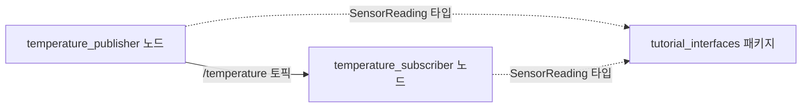

<!-- TODO(초안 메모, 발행 전 삭제): 명령어 출력은 Mac + Docker(ros:jazzy-ros-base, arm64)에서 캡처했다. 네이티브 Ubuntu 24.04에서 실습하며 검증하고, TODO(실습) 표시된 스크린샷을 채울 것. 1편 링크는 발행 후 실제 URL로 교체할 것. -->

[1편](https://blog.advenoh.pe.kr/)에서는 CLI로 turtlesim을 조작하면서 ROS2의 핵심 개념을 훑었다. 이번 편에서는 직접 코드를 쓴다. Python으로 노드 두 개를 만들어 메시지를 주고받고, 나만의 메시지 타입도 정의한다.

**이번 편에서 만드는 것**

가짜 온도 센서다. 발행 노드가 1초마다 온도를 측정해 보내고, 구독 노드가 받아서 임계값을 넘으면 경고를 남긴다. 실제 로봇에서 센서 드라이버 노드와 모니터링 노드가 하는 일과 구조가 같다.



**예제 코드**: [kenshin579/tutorials-python - ros2](https://github.com/kenshin579/tutorials-python/tree/master/ros2)

# 1. colcon 워크스페이스

## 1.1 워크스페이스란

ROS2에서는 코드를 **워크스페이스**라는 디렉토리 아래에 모아두고 한 번에 빌드한다. 여러 패키지를 한 저장소에서 관리하는 모노레포와 비슷하고, 빌드 도구가 패키지 사이의 의존 관계를 보고 순서를 정해준다는 점은 Gradle 멀티 프로젝트에 가깝다.

빌드 도구는 `colcon`이다. 1편에서 `ros-dev-tools`를 설치했다면 이미 들어 있다.

```bash
mkdir -p ~/ros2_ws/src
cd ~/ros2_ws
```

`src`만 직접 만들고 나머지는 빌드할 때 자동으로 생긴다.

| 디렉토리 | 내용 | 비유 |
|---|---|---|
| `src/` | 소스 코드. 내가 관리하는 유일한 디렉토리 | 프로젝트 소스 |
| `build/` | 빌드 중간 산출물 | `target/`, `.gradle/` |
| `install/` | 빌드 결과. 실행 파일과 환경 설정 스크립트 | 배포 산출물 |
| `log/` | 빌드 로그 | 빌드 로그 |

`build`, `install`, `log`는 git에 올리지 않는다.

## 1.2 패키지 만들기

워크스페이스 안에는 **패키지** 단위로 코드를 둔다. 패키지는 ROS2에서 빌드·배포·실행의 최소 단위로, npm 패키지나 Go 모듈과 비슷한 위치다.

```bash
cd ~/ros2_ws/src
ros2 pkg create --build-type ament_python --license Apache-2.0 py_pubsub
```

```text
going to create a new package
package name: py_pubsub
destination directory: /tmp/demo_ws/src
package format: 3
version: 0.0.0
description: TODO: Package description
maintainer: ['root <root@todo.todo>']
licenses: ['Apache-2.0']
build type: ament_python
dependencies: []
creating folder ./py_pubsub
creating ./py_pubsub/package.xml
creating source folder
creating folder ./py_pubsub/py_pubsub
creating ./py_pubsub/setup.py
creating ./py_pubsub/setup.cfg
creating folder ./py_pubsub/resource
creating ./py_pubsub/resource/py_pubsub
creating ./py_pubsub/py_pubsub/__init__.py
creating folder ./py_pubsub/test
```

만들어진 구조는 이렇다.

```text
py_pubsub
├── package.xml
├── py_pubsub
│   └── __init__.py
├── resource
│   └── py_pubsub
├── setup.cfg
├── setup.py
└── test

4 directories, 5 files
```

Python 패키지치고 파일이 좀 많다. 각각의 역할은 이렇다.

| 파일 | 역할 |
|---|---|
| `package.xml` | 패키지 이름, 버전, **의존성**을 적는 ROS2 공통 메타파일 |
| `setup.py` | Python 패키지 설정. **실행 파일 등록**을 여기서 한다 |
| `setup.cfg` | 실행 파일이 설치될 경로 지정 |
| `resource/py_pubsub` | 빈 파일. ROS2가 패키지를 찾을 때 쓰는 색인 표식 |
| `py_pubsub/` | 실제 Python 코드가 들어갈 디렉토리 |

`package.xml`과 `setup.py`에 의존성을 **양쪽 다** 적어야 한다는 점이 헷갈리는 부분이다. `package.xml`은 ROS2 패키지 매니저(rosdep)가 보고, `setup.py`는 Python 패키지 도구가 본다.

## 1.3 ament_python과 ament_cmake

빌드 타입은 두 가지다.

| 빌드 타입 | 언어 | 언제 |
|---|---|---|
| `ament_python` | Python | 순수 Python 노드 |
| `ament_cmake` | C++ | C++ 노드, **커스텀 메시지 정의** |

Python만 쓸 거라도 **커스텀 메시지를 정의하려면 `ament_cmake` 패키지가 하나 필요하다.** 메시지 정의를 각 언어의 코드로 변환하는 도구가 CMake 기반이라서다. 이 때문에 메시지 전용 패키지를 따로 만드는 게 ROS2의 일반적인 구조다. 인터페이스 정의만 모아둔 protobuf 저장소를 따로 두는 것과 같은 모양이다.

# 2. Publisher 노드 작성하기

`py_pubsub/py_pubsub/temperature_publisher.py`를 만든다.

```python
"""온도 센서 값을 주기적으로 발행하는 노드."""

import random

import rclpy
from rclpy.node import Node

from tutorial_interfaces.msg import SensorReading


class TemperaturePublisher(Node):
    """가짜 온도 센서 값을 /temperature 토픽으로 발행한다."""

    def __init__(self):
        super().__init__('temperature_publisher')

        # 파라미터 선언 (실행 중에도 바꿀 수 있는 설정값)
        self.declare_parameter('sensor_id', 'sensor-01')
        self.declare_parameter('publish_period', 1.0)
        self.declare_parameter('warning_threshold', 30.0)

        self.publisher_ = self.create_publisher(SensorReading, 'temperature', 10)

        period = self.get_parameter('publish_period').value
        self.timer = self.create_timer(period, self.publish_reading)

        self.get_logger().info(f'온도 센서 노드 시작 (주기 {period}초)')

    def publish_reading(self):
        celsius = round(random.uniform(20.0, 35.0), 2)
        threshold = self.get_parameter('warning_threshold').value

        msg = SensorReading()
        msg.sensor_id = self.get_parameter('sensor_id').value
        msg.celsius = celsius
        msg.is_warning = celsius > threshold

        self.publisher_.publish(msg)
        self.get_logger().info(f'발행: {msg.sensor_id} {msg.celsius}도 (경고: {msg.is_warning})')


def main(args=None):
    rclpy.init(args=args)
    node = TemperaturePublisher()
    try:
        rclpy.spin(node)
    except KeyboardInterrupt:
        pass
    finally:
        node.destroy_node()
        rclpy.shutdown()


if __name__ == '__main__':
    main()
```

처음 보면 낯설지만 뼈대는 단순하다.

**`rclpy.init()`과 `rclpy.shutdown()`**
ROS2 통신 계층을 초기화하고 정리한다. 모든 노드 프로그램은 이 사이에서 동작한다.

**`Node`를 상속한다**
`super().__init__('temperature_publisher')`에 넘긴 문자열이 노드 이름이다. `ros2 node list`에 뜨는 그 이름이다.

**`create_publisher(메시지타입, 토픽이름, 큐크기)`**
발행자를 만든다. 세 번째 인자 `10`은 큐 크기(QoS depth)로, 구독자가 느릴 때 몇 개까지 쌓아둘지를 뜻한다. Kafka 프로듀서의 버퍼와 비슷한 개념이다.

**`create_timer(주기, 콜백)`**
주기적으로 콜백을 호출한다. 별도 스레드를 만들지 않아도 되고, 스케줄러가 알아서 호출한다.

**`self.get_logger().info()`**
ROS2 로깅이다. `print()`와 달리 `/rosout` 토픽으로도 나가기 때문에 다른 노드에서 로그를 모아 볼 수 있다.

**`rclpy.spin(node)`**
여기가 핵심이다. **이 함수는 블로킹되면서 이벤트 루프를 돌린다.** 타이머 콜백이든 구독 콜백이든, spin이 돌아야 실행된다. asyncio의 `run_forever()`와 같은 역할이라고 보면 된다. 노드를 만들기만 하고 spin을 호출하지 않으면 아무 일도 일어나지 않는다.

# 3. Subscriber 노드 작성하기

`py_pubsub/py_pubsub/temperature_subscriber.py`를 만든다.

```python
"""온도 센서 값을 구독해서 경고를 출력하는 노드."""

import rclpy
from rclpy.node import Node

from tutorial_interfaces.msg import SensorReading


class TemperatureSubscriber(Node):
    """/temperature 토픽을 구독하고 경고 메시지를 남긴다."""

    def __init__(self):
        super().__init__('temperature_subscriber')

        self.subscription = self.create_subscription(
            SensorReading,
            'temperature',
            self.on_reading,
            10,
        )
        self.received_count = 0

        self.get_logger().info('온도 구독 노드 시작')

    def on_reading(self, msg):
        self.received_count += 1

        if msg.is_warning:
            self.get_logger().warning(
                f'[{self.received_count}] 경고! {msg.sensor_id} 온도 {msg.celsius}도'
            )
        else:
            self.get_logger().info(
                f'[{self.received_count}] 정상 {msg.sensor_id} 온도 {msg.celsius}도'
            )


def main(args=None):
    rclpy.init(args=args)
    node = TemperatureSubscriber()
    try:
        rclpy.spin(node)
    except KeyboardInterrupt:
        pass
    finally:
        node.destroy_node()
        rclpy.shutdown()


if __name__ == '__main__':
    main()
```

`create_subscription(메시지타입, 토픽이름, 콜백, 큐크기)`로 구독자를 만든다. 메시지가 도착할 때마다 콜백이 호출된다. MQTT 클라이언트의 `on_message` 핸들러와 같다.

**publisher와 subscriber는 서로를 전혀 모른다.** 상대방 주소도, 실행 여부도 모른 채 토픽 이름과 메시지 타입만 맞추면 연결된다. 한쪽만 띄워도 에러가 나지 않고, 나중에 다른 쪽이 뜨면 그때부터 통신한다.

# 4. 커스텀 메시지 정의하기

위 코드는 `SensorReading`이라는 타입을 쓰고 있다. 표준 메시지에는 없는 타입이니 직접 정의한다.

## 4.1 메시지 패키지 만들기

앞서 말한 대로 메시지 정의는 `ament_cmake` 패키지에 둔다.

```bash
cd ~/ros2_ws/src
ros2 pkg create --build-type ament_cmake --license Apache-2.0 tutorial_interfaces
mkdir tutorial_interfaces/msg
```

## 4.2 메시지 정의 파일

`tutorial_interfaces/msg/SensorReading.msg`를 만든다. **파일 이름은 대문자로 시작해야 한다.**

```text
# 온도 센서 한 번의 측정값
string sensor_id      # 센서 식별자
float64 celsius       # 측정 온도 (섭씨)
bool is_warning       # 임계값 초과 여부
```

한 줄에 `타입 이름` 형식으로 필드를 적는다. 쓸 수 있는 기본 타입은 이렇다.

| 분류 | 타입 |
|---|---|
| 정수 | `int8`, `int16`, `int32`, `int64`, `uint8` ~ `uint64` |
| 실수 | `float32`, `float64` |
| 기타 | `bool`, `string`, `byte` |
| 배열 | `int32[]`, `string[5]`, `float64[<=10]` (상한 지정) |

다른 메시지를 필드로 쓸 수도 있다. `geometry_msgs/Point position` 처럼 적으면 된다.

## 4.3 빌드 설정

`CMakeLists.txt`에서 메시지 생성기를 호출하도록 두 줄을 추가한다.

```cmake
find_package(rosidl_default_generators REQUIRED)

rosidl_generate_interfaces(${PROJECT_NAME}
  "msg/SensorReading.msg"
)
```

`package.xml`에도 의존성을 적는다. 마지막 `member_of_group` 줄을 빠뜨리면 빌드가 실패한다.

```xml
<build_depend>rosidl_default_generators</build_depend>
<exec_depend>rosidl_default_runtime</exec_depend>
<member_of_group>rosidl_interface_packages</member_of_group>
```

이 설정으로 빌드하면 `.msg` 파일 하나에서 Python 클래스와 C++ 헤더가 함께 생성된다. **C++로 쓴 노드와 Python으로 쓴 노드가 같은 메시지를 주고받을 수 있는 이유가 여기에 있다.** Protobuf에서 `.proto` 하나로 여러 언어 코드를 만드는 것과 같다.

# 5. 실행 파일 등록하기

노드 코드를 작성했다고 `ros2 run`으로 실행할 수 있는 건 아니다. `setup.py`의 `entry_points`에 등록해야 한다.

```python
entry_points={
    'console_scripts': [
        'talker = py_pubsub.temperature_publisher:main',
        'listener = py_pubsub.temperature_subscriber:main',
    ],
},
```

왼쪽이 실행할 때 쓸 이름, 오른쪽이 `모듈경로:함수`다. 여기 적은 `talker`가 나중에 `ros2 run py_pubsub talker`의 마지막 인자가 된다. Python 패키징의 콘솔 스크립트 기능을 그대로 쓰는 것이다.

`package.xml`에도 실행 의존성을 추가한다.

```xml
<exec_depend>rclpy</exec_depend>
<exec_depend>tutorial_interfaces</exec_depend>
```

여기까지 하면 워크스페이스 구조가 이렇게 된다.

```text
src
├── py_pubsub
│   ├── package.xml
│   ├── py_pubsub
│   │   ├── __init__.py
│   │   ├── temperature_publisher.py
│   │   └── temperature_subscriber.py
│   ├── resource
│   │   └── py_pubsub
│   ├── setup.cfg
│   ├── setup.py
│   └── test
└── tutorial_interfaces
    ├── CMakeLists.txt
    ├── msg
    │   └── SensorReading.msg
    └── package.xml

7 directories, 10 files
```

# 6. 빌드하고 실행하기

## 6.1 빌드

**워크스페이스 최상위**에서 빌드한다. `src` 안에서 실행하면 패키지를 못 찾는다.

```bash
cd ~/ros2_ws
colcon build
```

```text
Starting >>> tutorial_interfaces
Finished <<< tutorial_interfaces [1.92s]
Starting >>> py_pubsub
Finished <<< py_pubsub [0.35s]

Summary: 2 packages finished [2.32s]
```

`tutorial_interfaces`가 먼저 빌드된 것을 볼 수 있다. `py_pubsub`이 그 메시지에 의존한다는 것을 `package.xml`에서 읽고 순서를 잡아준 것이다.

빌드가 끝나면 디렉토리 세 개가 생겨 있다.

```text
build
install
log
src
```

> **팁**: `colcon build --symlink-install`로 빌드하면 Python 파일이 복사되는 대신 심볼릭 링크로 걸린다. 코드를 고칠 때마다 다시 빌드하지 않아도 되어 개발 중에는 이쪽이 편하다.

## 6.2 환경 설정

빌드 결과를 쓰려면 워크스페이스의 환경 설정을 불러와야 한다.

```bash
source install/setup.bash
```

1편에서 `source /opt/ros/jazzy/setup.bash`를 했는데, 이번엔 하나 더 필요하다. 두 개를 부르는 이유는 계층이 다르기 때문이다.

| 계층 | 스크립트 | 내용 |
|---|---|---|
| underlay | `/opt/ros/jazzy/setup.bash` | 시스템에 설치된 ROS2 |
| overlay | `~/ros2_ws/install/setup.bash` | 내가 빌드한 패키지 |

overlay가 underlay를 덮어쓴다. 시스템 패키지와 같은 이름으로 패키지를 만들면 내 것이 우선한다. Docker 이미지 레이어와 비슷한 구조다.

**새 터미널을 열 때마다 두 개 다 불러와야 한다.** `.bashrc`에 `/opt/ros/jazzy/setup.bash`만 넣어두었다면, 워크스페이스 것은 매번 직접 실행해야 한다.

잘 등록됐는지는 이렇게 확인한다.

```bash
ros2 pkg executables py_pubsub
```

```text
py_pubsub listener
py_pubsub talker
```

메시지 타입도 확인해 본다. 주석까지 그대로 보인다.

```bash
ros2 interface show tutorial_interfaces/msg/SensorReading
```

```text
# 온도 센서 한 번의 측정값
string sensor_id      # 센서 식별자
float64 celsius       # 측정 온도 (섭씨)
bool is_warning       # 임계값 초과 여부
```

## 6.3 실행

터미널 1에서 발행 노드를 띄운다.

```bash
ros2 run py_pubsub talker
```

```text
[INFO] [1789314878.917105508] [temperature_publisher]: 온도 센서 노드 시작 (주기 1.0초)
[INFO] [1789314879.916668634] [temperature_publisher]: 발행: sensor-01 22.67도 (경고: False)
[INFO] [1789314880.915543801] [temperature_publisher]: 발행: sensor-01 21.9도 (경고: False)
[INFO] [1789314881.915686426] [temperature_publisher]: 발행: sensor-01 29.98도 (경고: False)
[INFO] [1789314882.916336635] [temperature_publisher]: 발행: sensor-01 32.9도 (경고: True)
[INFO] [1789314883.919186636] [temperature_publisher]: 발행: sensor-01 30.21도 (경고: True)
```

터미널 2에서 구독 노드를 띄운다. **이 터미널에서도 `source install/setup.bash`를 먼저 해야 한다.**

```bash
ros2 run py_pubsub listener
```

```text
[INFO] [1789314886.918763554] [temperature_subscriber]: 온도 구독 노드 시작
[INFO] [1789314887.899039846] [temperature_subscriber]: [1] 정상 sensor-01 온도 25.35도
[INFO] [1789314888.899869221] [temperature_subscriber]: [2] 정상 sensor-01 온도 25.07도
[WARN] [1789314889.899994264] [temperature_subscriber]: [3] 경고! sensor-01 온도 32.06도
[INFO] [1789314890.901997500] [temperature_subscriber]: [4] 정상 sensor-01 온도 27.9도
[INFO] [1789314891.901735375] [temperature_subscriber]: [5] 정상 sensor-01 온도 21.2도
[WARN] [1789314892.903033084] [temperature_subscriber]: [6] 경고! sensor-01 온도 34.64도
[INFO] [1789314893.902426334] [temperature_subscriber]: [7] 정상 sensor-01 온도 23.78도
```

임계값 30도를 넘은 값에는 `[WARN]`이 붙는다. 같은 시각 발행 쪽 로그와 나란히 놓고 보면 값이 그대로 전달된 것을 확인할 수 있다.

```text
[INFO] [1789314884.901565386] [temperature_publisher]: 온도 센서 노드 시작 (주기 1.0초)
[INFO] [1789314885.901020220] [temperature_publisher]: 발행: sensor-01 27.44도 (경고: False)
[INFO] [1789314886.898821929] [temperature_publisher]: 발행: sensor-01 23.18도 (경고: False)
[INFO] [1789314887.898714471] [temperature_publisher]: 발행: sensor-01 25.35도 (경고: False)
[INFO] [1789314888.899447638] [temperature_publisher]: 발행: sensor-01 25.07도 (경고: False)
[INFO] [1789314889.899452389] [temperature_publisher]: 발행: sensor-01 32.06도 (경고: True)
```

<!-- TODO(실습): 터미널 두 개에 talker/listener 로그가 나란히 찍힌 화면 스크린샷 → two_terminals.png -->

## 6.4 CLI로 들여다보기

1편에서 쓴 CLI 명령들이 내가 만든 노드에도 그대로 통한다.

```bash
ros2 topic echo /temperature --once
```

```text
sensor_id: sensor-01
celsius: 31.26
is_warning: true
---
```

```bash
ros2 node info /temperature_publisher
```

```text
/temperature_publisher
  Subscribers:

  Publishers:
    /parameter_events: rcl_interfaces/msg/ParameterEvent
    /rosout: rcl_interfaces/msg/Log
    /temperature: tutorial_interfaces/msg/SensorReading
  Service Servers:
    /temperature_publisher/describe_parameters: rcl_interfaces/srv/DescribeParameters
    /temperature_publisher/get_parameter_types: rcl_interfaces/srv/GetParameterTypes
    /temperature_publisher/get_parameters: rcl_interfaces/srv/GetParameters
    /temperature_publisher/get_type_description: type_description_interfaces/srv/GetTypeDescription
    /temperature_publisher/list_parameters: rcl_interfaces/srv/ListParameters
    /temperature_publisher/set_parameters: rcl_interfaces/srv/SetParameters
    /temperature_publisher/set_parameters_atomically: rcl_interfaces/srv/SetParametersAtomically
  Service Clients:

  Action Servers:

  Action Clients:
```

Publishers에 `/temperature: tutorial_interfaces/msg/SensorReading`이 보인다. 내가 정의한 타입이 시스템에 제대로 등록됐다는 뜻이다.

# 7. 파라미터로 동작 바꾸기

발행 노드에는 파라미터 세 개를 선언해 뒀다.

```python
self.declare_parameter('sensor_id', 'sensor-01')
self.declare_parameter('publish_period', 1.0)
self.declare_parameter('warning_threshold', 30.0)
```

`declare_parameter(이름, 기본값)`으로 선언하고 `self.get_parameter(이름).value`로 읽는다. 선언하지 않은 파라미터를 읽으면 예외가 난다. 기본값의 타입이 곧 파라미터 타입이 되므로 `1.0`과 `1`은 다르게 취급된다.

실행할 때 `--ros-args -p 이름:=값`으로 덮어쓸 수 있다.

```bash
ros2 run py_pubsub talker --ros-args -p sensor_id:=sensor-99 -p warning_threshold:=25.0
```

```text
[INFO] [1789314905.244719132] [temperature_publisher]: 온도 센서 노드 시작 (주기 1.0초)
[INFO] [1789314906.241034965] [temperature_publisher]: 발행: sensor-99 31.36도 (경고: True)
[INFO] [1789314907.244957841] [temperature_publisher]: 발행: sensor-99 23.67도 (경고: False)
[INFO] [1789314908.242907716] [temperature_publisher]: 발행: sensor-99 29.45도 (경고: True)
[INFO] [1789314909.245521967] [temperature_publisher]: 발행: sensor-99 22.77도 (경고: False)
```

센서 이름이 바뀌었고, 임계값이 25도로 내려가면서 29.45도에도 경고가 붙었다. 코드는 그대로고 실행 인자만 바꾼 것이다.

실행 중인 노드의 파라미터는 CLI로도 확인할 수 있다.

```bash
ros2 param list /temperature_publisher
```

```text
  publish_period
  sensor_id
  start_type_description_service
  use_sim_time
  warning_threshold
```

```bash
ros2 param get /temperature_publisher warning_threshold
```

```text
Double value is: 25.0
```

파라미터가 서너 개면 명령줄로 충분하지만, 실제 로봇에서는 수십 개가 되고 노드도 여러 개다. 그래서 YAML 파일에 모아두고 launch 파일로 함께 넘기는 방식을 쓴다. 3편에서 다룬다.

# 8. 자주 막히는 지점

**`Package 'py_pubsub' not found`**
빌드 후 `source install/setup.bash`를 안 했거나, 새로 연 터미널에서 안 한 것이다. 터미널마다 필요하다.

**`No executable found`**
`setup.py`의 `entry_points`에 등록하지 않았거나 이름이 틀렸다. `ros2 pkg executables py_pubsub`로 실제 등록된 이름을 확인한다. 고친 뒤에는 다시 빌드해야 한다.

**코드를 고쳤는데 반영이 안 된다**
`colcon build`를 다시 돌려야 한다. 매번 빌드하기 싫다면 `--symlink-install`로 빌드한다. 단, `setup.py`나 메시지 정의를 고쳤을 때는 심볼릭 링크와 무관하게 다시 빌드해야 한다.

**메시지 필드를 추가했는데 `AttributeError`가 난다**
`tutorial_interfaces`를 다시 빌드하지 않은 것이다. `.msg` 파일은 빌드 시점에 Python 클래스로 변환된다.

**`colcon build`가 패키지를 못 찾는다**
워크스페이스 최상위가 아니라 `src` 안에서 실행했을 가능성이 높다. `ls`를 쳐서 `src` 디렉토리가 보이는 위치인지 확인한다.

**구독 노드가 아무것도 못 받는다**
토픽 이름과 메시지 타입이 양쪽에서 같은지 `ros2 topic info /temperature --verbose`로 확인한다. 타입이 다르면 조용히 연결되지 않는다.

# 9. 정리

- ROS2 코드는 **워크스페이스 > 패키지** 구조로 관리하고 `colcon build`로 빌드한다
- Python 노드는 `Node`를 상속하고 `rclpy.spin()`으로 이벤트 루프를 돌린다
- **커스텀 메시지는 `ament_cmake` 패키지에 정의**하고, 빌드하면 여러 언어의 코드가 함께 생성된다
- 실행 파일은 `setup.py`의 `entry_points`에 등록해야 `ros2 run`으로 실행된다
- 빌드 후에는 `source install/setup.bash`가 필요하다. 터미널마다 해야 한다
- 파라미터로 코드 수정 없이 노드 동작을 바꿀 수 있다

3편에서는 노드가 늘어나면 생기는 문제를 다룬다. 터미널을 여러 개 열어 하나씩 실행하는 대신 **launch 파일로 한 번에 띄우고**, 파라미터를 YAML로 묶어 관리한다.

# 10. 참고 자료

- [예제 코드 - kenshin579/tutorials-python](https://github.com/kenshin579/tutorials-python/tree/master/ros2)
- [ROS 2 Tutorials - Writing a simple publisher and subscriber (Python)](https://docs.ros.org/en/jazzy/Tutorials/Beginner-Client-Libraries/Writing-A-Simple-Py-Publisher-And-Subscriber.html)
- [ROS 2 Tutorials - Creating custom msg and srv files](https://docs.ros.org/en/jazzy/Tutorials/Beginner-Client-Libraries/Custom-ROS2-Interfaces.html)
- [rclpy API 문서](https://docs.ros.org/en/jazzy/p/rclpy/)
- [About ROS 2 interfaces](https://docs.ros.org/en/jazzy/Concepts/Basic/About-Interfaces.html)
