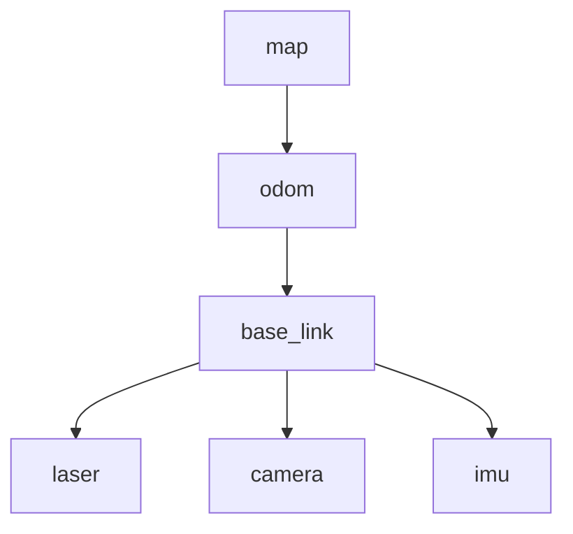

<!-- TODO(초안 메모, 발행 전 삭제): 명령어 출력은 Mac + Docker(ros:jazzy-ros-base, arm64)에서 캡처했다. RViz 스크린샷은 네이티브 환경에서 채울 것. 1~3편 링크도 발행 후 실제 URL로 교체. -->

3편까지로 ROS2 프로그램을 만드는 기본기는 갖췄다. 이번 편부터는 로봇다운 문제를 다룬다. 첫 주제는 **좌표 변환**이다.

# 1. 왜 좌표 변환이 필요한가

로봇 앞쪽에 달린 라이다가 "정면 3m 앞에 벽이 있다"고 알려준다고 하자. 이 정보를 쓰려면 몇 가지를 더 알아야 한다.

- 라이다는 로봇 중심에서 앞으로 20cm, 위로 30cm 지점에 달려 있다
- 로봇은 지금 지도상 (5, 2) 위치에서 45도 방향을 보고 있다

그래야 "지도상 어느 지점에 벽이 있다"는 결론이 나온다. 로봇에는 이런 기준점이 여러 개 있다.

| 기준점(프레임) | 원점 |
|---|---|
| `map` | 지도의 원점. 움직이지 않는다 |
| `odom` | 로봇이 처음 켜진 자리 |
| `base_link` | 로봇 몸체의 중심 |
| `laser`, `camera` | 각 센서의 렌즈 중심 |

센서 데이터는 센서 기준으로 들어오고, 경로 계획은 지도 기준으로 하며, 바퀴 제어는 로봇 몸체 기준으로 한다. **이 사이를 계속 변환해야 한다.** 값도 계속 변한다. 로봇이 움직이기 때문이다.

ROS2는 이 문제를 **TF2**라는 공통 체계로 푼다. 각 노드는 자기가 아는 관계만 발행하고, 필요한 쪽이 원하는 조합을 조회한다. 모든 노드가 자기 정보만 등록하고 필요한 쪽이 조합해서 쓰는 구조라, 서비스 레지스트리와 성격이 비슷하다.

# 2. TF2의 구조

## 2.1 프레임 트리

프레임끼리의 관계는 **트리**로 관리한다. 각 프레임은 부모를 하나만 가진다.



부모가 하나뿐이라 **두 프레임 사이의 경로가 언제나 하나로 정해진다.** `laser`에서 `map`까지 가는 길은 `laser → base_link → odom → map` 하나뿐이고, TF2는 이 경로의 변환을 차례로 곱해서 답을 만든다. 한 프레임에 부모가 둘이 되면 경로가 갈라져 트리가 깨진다. 실제로 흔한 버그다.

프레임 이름은 관례가 정해져 있다(REP-105). `map`, `odom`, `base_link`는 거의 모든 ROS2 로봇에서 같은 의미로 쓰인다. 그래서 남이 만든 SLAM 패키지와 내가 만든 노드가 맞물려 돌아간다.

## 2.2 두 개의 토픽

TF2도 결국 토픽이다. 두 개를 쓴다.

| 토픽 | 내용 | 발행 빈도 |
|---|---|---|
| `/tf` | 시간에 따라 변하는 변환 (로봇 위치 등) | 계속 (수십 Hz) |
| `/tf_static` | 변하지 않는 변환 (센서 장착 위치 등) | 한 번만 |

`/tf_static`은 한 번만 발행되는데도 나중에 실행된 노드가 값을 받는다. 1편에서 짚은 **QoS의 Durability가 `TRANSIENT_LOCAL`로 설정되어 있어서** 나중에 들어온 구독자에게도 마지막 값이 전달되기 때문이다. MQTT의 retained message와 같은 동작이다.

## 2.3 시간 축

TF2는 과거 변환을 일정 시간(기본 10초) 버퍼에 보관한다. 센서 데이터에는 측정 시각이 찍혀 있는데, 그 데이터를 처리하는 시점에는 로봇이 이미 움직였기 때문이다. **"3초 전 그 순간, 라이다는 어디에 있었나"**를 물을 수 있어야 한다. 그래서 변환을 조회할 때 시각을 함께 넘긴다.

# 3. 고정된 변환 발행하기

로봇 몸체와 라이다의 관계처럼 변하지 않는 값부터 만든다.

`py_tf_demo/laser_static_broadcaster.py`

```python
"""로봇 몸체에 고정된 라이다 위치를 static TF로 한 번만 발행하는 노드."""

import math

import rclpy
from geometry_msgs.msg import TransformStamped
from rclpy.node import Node
from tf2_ros import StaticTransformBroadcaster


class LaserStaticBroadcaster(Node):
    """base_link -> laser 변환을 발행한다. 값이 변하지 않으므로 static 이다."""

    def __init__(self):
        super().__init__('laser_static_broadcaster')

        self.broadcaster = StaticTransformBroadcaster(self)

        t = TransformStamped()
        t.header.stamp = self.get_clock().now().to_msg()
        t.header.frame_id = 'base_link'
        t.child_frame_id = 'laser'

        # 로봇 중심에서 앞으로 20cm, 위로 30cm 지점에 라이다가 달려 있다
        t.transform.translation.x = 0.2
        t.transform.translation.y = 0.0
        t.transform.translation.z = 0.3
        t.transform.rotation.x = 0.0
        t.transform.rotation.y = 0.0
        t.transform.rotation.z = 0.0
        t.transform.rotation.w = 1.0

        self.broadcaster.sendTransform(t)
        self.get_logger().info('base_link -> laser static 변환 발행 완료')


def main(args=None):
    rclpy.init(args=args)
    node = LaserStaticBroadcaster()
    try:
        rclpy.spin(node)
    except KeyboardInterrupt:
        pass
    finally:
        node.destroy_node()
        rclpy.shutdown()


if __name__ == '__main__':
    main()
```

`StaticTransformBroadcaster`는 생성자에서 한 번 발행하면 끝이다. 주기적으로 보낼 필요가 없다.

`TransformStamped` 메시지의 구조는 이렇다.

| 필드 | 의미 |
|---|---|
| `header.stamp` | 이 변환이 유효한 시각 |
| `header.frame_id` | 부모 프레임 |
| `child_frame_id` | 자식 프레임 |
| `transform.translation` | 부모 기준 자식의 위치 (m) |
| `transform.rotation` | 회전 (쿼터니언) |

> 코드를 쓰지 않고 명령 한 줄로도 같은 일을 할 수 있다. 값만 확인해 보고 싶을 때 편하다.
>
> ```bash
> ros2 run tf2_ros static_transform_publisher --x 0.2 --z 0.3 --frame-id base_link --child-frame-id laser
> ```

# 4. 움직이는 변환 발행하기

로봇이 반지름 2m 원을 도는 상황을 만든다.

`py_tf_demo/odom_broadcaster.py`

```python
"""로봇이 원을 그리며 도는 상황을 가정하고 odom -> base_link 변환을 발행하는 노드."""

import math

import rclpy
from geometry_msgs.msg import TransformStamped
from rclpy.node import Node
from tf2_ros import TransformBroadcaster


def yaw_to_quaternion(yaw):
    """평면 위 회전(yaw)만 있는 경우의 쿼터니언을 구한다."""
    return (0.0, 0.0, math.sin(yaw / 2.0), math.cos(yaw / 2.0))


class OdomBroadcaster(Node):
    """반지름 2m 원을 도는 로봇의 위치를 TF로 계속 알린다."""

    def __init__(self):
        super().__init__('odom_broadcaster')

        self.declare_parameter('radius', 2.0)
        self.declare_parameter('angular_speed', 0.5)  # rad/s

        self.broadcaster = TransformBroadcaster(self)
        self.angle = 0.0
        self.period = 0.05  # 20Hz
        self.timer = self.create_timer(self.period, self.broadcast_transform)

        self.get_logger().info('odom -> base_link 변환 발행 시작')

    def broadcast_transform(self):
        radius = self.get_parameter('radius').value
        speed = self.get_parameter('angular_speed').value
        self.angle += speed * self.period

        t = TransformStamped()
        t.header.stamp = self.get_clock().now().to_msg()
        t.header.frame_id = 'odom'        # 부모 프레임
        t.child_frame_id = 'base_link'    # 자식 프레임

        t.transform.translation.x = radius * math.cos(self.angle)
        t.transform.translation.y = radius * math.sin(self.angle)
        t.transform.translation.z = 0.0

        # 로봇은 진행 방향을 바라본다
        qx, qy, qz, qw = yaw_to_quaternion(self.angle + math.pi / 2.0)
        t.transform.rotation.x = qx
        t.transform.rotation.y = qy
        t.transform.rotation.z = qz
        t.transform.rotation.w = qw

        self.broadcaster.sendTransform(t)


def main(args=None):
    rclpy.init(args=args)
    node = OdomBroadcaster()
    try:
        rclpy.spin(node)
    except KeyboardInterrupt:
        pass
    finally:
        node.destroy_node()
        rclpy.shutdown()


if __name__ == '__main__':
    main()
```

`TransformBroadcaster`를 쓰고 타이머로 20Hz마다 발행한다. 실제 로봇에서는 바퀴 엔코더 값을 읽어 계산한 위치를 여기에 넣는다.

## 4.1 쿼터니언

회전을 나타내는 `rotation` 필드는 쿼터니언이다. 네 개의 실수 `(x, y, z, w)`로 3차원 회전을 표현하는 방식인데, 처음 보면 막막하다. 다행히 **바닥을 달리는 로봇은 평면 회전(yaw)만 있으면 되고, 그때는 공식이 간단하다.**

```python
def yaw_to_quaternion(yaw):
    return (0.0, 0.0, math.sin(yaw / 2.0), math.cos(yaw / 2.0))
```

회전이 없으면 `(0, 0, 0, 1)`이다. 오일러 각(roll, pitch, yaw)을 쓰지 않는 이유는 짐벌락 때문인데, 당장은 "3차원 회전을 안전하게 다루는 표준 표기"로 받아들이고 넘어가도 된다. 3차원 회전이 필요해지면 `tf_transformations` 패키지의 변환 함수를 쓰면 된다.

# 5. 변환 조회하기

발행된 변환을 조합해 원하는 값을 얻는 쪽이다.

`py_tf_demo/tf_listener.py`

```python
"""odom 기준으로 라이다가 지금 어디에 있는지 주기적으로 조회하는 노드."""

import math

import rclpy
from rclpy.node import Node
from tf2_ros import LookupException, ConnectivityException, ExtrapolationException
from tf2_ros.buffer import Buffer
from tf2_ros.transform_listener import TransformListener


class LaserPoseListener(Node):
    """odom -> laser 변환을 조회해서 라이다의 절대 위치를 출력한다."""

    def __init__(self):
        super().__init__('laser_pose_listener')

        # reference_frame: 어느 좌표계 기준으로 볼 것인가
        # child_frame: 위치를 알고 싶은 대상
        self.declare_parameter('reference_frame', 'odom')
        self.declare_parameter('child_frame', 'laser')

        self.buffer = Buffer()
        self.listener = TransformListener(self.buffer, self)
        self.timer = self.create_timer(1.0, self.lookup_pose)

    def lookup_pose(self):
        reference = self.get_parameter('reference_frame').value
        child = self.get_parameter('child_frame').value

        try:
            # 첫 인자가 기준 좌표계, 두 번째가 대상이다
            # rclpy.time.Time() 은 "가장 최근 값" 을 뜻한다
            tf = self.buffer.lookup_transform(reference, child, rclpy.time.Time())
        except (LookupException, ConnectivityException, ExtrapolationException) as e:
            self.get_logger().warning(f'{reference} -> {child} 변환을 아직 찾을 수 없다: {e}')
            return

        x = tf.transform.translation.x
        y = tf.transform.translation.y
        z = tf.transform.translation.z
        distance = math.sqrt(x * x + y * y)

        self.get_logger().info(
            f'{child} 위치: x={x:.2f} y={y:.2f} z={z:.2f} '
            f'({reference} 원점에서 {distance:.2f}m)'
        )


def main(args=None):
    rclpy.init(args=args)
    node = LaserPoseListener()
    try:
        rclpy.spin(node)
    except KeyboardInterrupt:
        pass
    finally:
        node.destroy_node()
        rclpy.shutdown()


if __name__ == '__main__':
    main()
```

**`Buffer`와 `TransformListener`**
리스너가 `/tf`와 `/tf_static`을 구독해 버퍼를 채운다. 버퍼는 과거 이력을 들고 있다가 조회에 답한다.

**`lookup_transform(reference, child, time)`**
인자 순서가 헷갈리기 쉽다. **첫 번째가 기준 좌표계, 두 번째가 위치를 알고 싶은 대상**이다. `lookup_transform('odom', 'laser', ...)`는 "odom 기준으로 laser가 어디 있는가"를 묻는다.

**`rclpy.time.Time()`**
빈 Time 객체는 "가장 최근 값"을 뜻한다. 특정 시각의 값을 원하면 그 시각을 넣는다.

**예외 처리는 선택이 아니다.** 노드가 막 떴을 때는 아직 변환이 도착하지 않아 조회가 실패한다. 정상적인 상황이므로 잡아서 넘어가야 한다.

| 예외 | 원인 |
|---|---|
| `LookupException` | 프레임이 아직 없다 (이름 오타 포함) |
| `ConnectivityException` | 두 프레임이 같은 트리에 없다 |
| `ExtrapolationException` | 요청한 시각의 데이터가 버퍼에 없다 |

# 6. 실행하고 확인하기

3편에서 배운 launch로 세 노드를 한 번에 띄운다.

```bash
cd ~/ros2_ws
colcon build
source install/setup.bash
ros2 launch py_tf_demo tf_demo_launch.py
```

```text
[INFO] [launch]: All log files can be found below /root/.ros/log/2026-09-13-16-16-55-807250-a2e5fcadce7f-765
[INFO] [launch]: Default logging verbosity is set to INFO
[INFO] [odom_broadcaster-1]: process started with pid [770]
[INFO] [laser_static_broadcaster-2]: process started with pid [771]
[INFO] [tf_listener-3]: process started with pid [772]
[odom_broadcaster-1] [INFO] [1789316216.030797835] [odom_broadcaster]: odom -> base_link 변환 발행 시작
[laser_static_broadcaster-2] [INFO] [1789316216.030809919] [laser_static_broadcaster]: base_link -> laser static 변환 발행 완료
[tf_listener-3] [INFO] [1789316217.040228169] [laser_pose_listener]: laser 위치: x=1.69 y=1.09 z=0.30 (odom 원점에서 2.01m)
[tf_listener-3] [INFO] [1789316218.027591170] [laser_pose_listener]: laser 위치: x=0.96 y=1.77 z=0.30 (odom 원점에서 2.01m)
[tf_listener-3] [INFO] [1789316219.027441420] [laser_pose_listener]: laser 위치: x=-0.01 y=2.01 z=0.30 (odom 원점에서 2.01m)
[tf_listener-3] [INFO] [1789316220.026922296] [laser_pose_listener]: laser 위치: x=-0.97 y=1.76 z=0.30 (odom 원점에서 2.01m)
[tf_listener-3] [INFO] [1789316221.027096046] [laser_pose_listener]: laser 위치: x=-1.70 y=1.08 z=0.30 (odom 원점에서 2.01m)
```

라이다의 위치가 1초마다 찍힌다. **`z`가 0.3인 것과 원점에서의 거리가 2.01m인 것에 주목할 만하다.** 로봇 몸체는 반지름 2m 원을 z=0 평면에서 돌고 있는데, 라이다는 몸체보다 30cm 위, 20cm 앞에 달려 있어서 값이 조금씩 다르다. **두 변환이 자동으로 합성된 결과다.**

실행 중에 조회 대상을 바꿔 보면 차이가 분명해진다.

```bash
ros2 param set /laser_pose_listener child_frame base_link
```

```text
[tf_listener-3] [INFO] [1789316235.914113595] [laser_pose_listener]: base_link 위치: x=-1.89 y=-0.65 z=0.00 (odom 원점에서 2.00m)
[tf_listener-3] [INFO] [1789316236.916755887] [laser_pose_listener]: base_link 위치: x=-1.34 y=-1.48 z=0.00 (odom 원점에서 2.00m)
[tf_listener-3] [INFO] [1789316237.915480554] [laser_pose_listener]: base_link 위치: x=-0.47 y=-1.94 z=0.00 (odom 원점에서 2.00m)
```

`z`가 0이 되고 거리도 정확히 2.00m가 된다.

## 6.1 tf2_echo - 두 프레임 사이 관계 보기

```bash
ros2 run tf2_ros tf2_echo odom laser
```

```text
[INFO] [1789316132.255340338] [tf2_echo]: Waiting for transform odom ->  laser: Invalid frame ID "odom" passed to canTransform argument target_frame - frame does not exist
At time 1789316133.235479880
- Translation: [-1.864, -0.751, 0.300]
- Rotation: in Quaternion (xyzw) [0.000, 0.000, -0.600, 0.800]
- Rotation: in RPY (radian) [0.000, 0.000, -1.287]
- Rotation: in RPY (degree) [0.000, 0.000, -73.762]
- Matrix:
  0.280  0.960  0.000 -1.864
 -0.960  0.280 -0.000 -0.751
 -0.000  0.000  1.000  0.300
  0.000  0.000  0.000  1.000
At time 1789316134.237509798
```

처음에 `frame does not exist`가 잠깐 나오는 것은 정상이다. discovery가 끝나기 전이라 그렇고, 곧 값이 나온다.

출력에는 같은 회전이 네 가지 표기로 나온다. 쿼터니언, 라디안 RPY, 도 단위 RPY, 그리고 4x4 동차 변환 행렬이다. **사람이 읽을 때는 도 단위 RPY가 제일 편하다.**

고정 변환도 같은 방법으로 볼 수 있다.

```bash
ros2 run tf2_ros tf2_echo base_link laser
```

```text
[INFO] [1789316135.347411340] [tf2_echo]: Waiting for transform base_link ->  laser: Invalid frame ID "base_link" passed to canTransform argument target_frame - frame does not exist
At time 0.0
- Translation: [0.200, 0.000, 0.300]
- Rotation: in Quaternion (xyzw) [0.000, 0.000, 0.000, 1.000]
- Rotation: in RPY (radian) [0.000, -0.000, 0.000]
- Rotation: in RPY (degree) [0.000, -0.000, 0.000]
- Matrix:
  1.000  0.000  0.000  0.200
  0.000  1.000  0.000  0.000
  0.000  0.000  1.000  0.300
```

값이 계속 `[0.200, 0.000, 0.300]`으로 같고, 시각이 `At time 0.0`이다. **static 변환은 "언제나 유효한 값"으로 취급되기 때문에 시각이 0이다.**

## 6.2 원본 토픽 들여다보기

TF도 토픽이라는 걸 직접 확인해 본다.

```bash
ros2 topic list
```

```text
/parameter_events
/rosout
/tf
/tf_static
```

```bash
ros2 topic echo /tf --once
```

```text
transforms:
- header:
    stamp:
      sec: 1789316141
      nanosec: 637393676
    frame_id: odom
  child_frame_id: base_link
  transform:
    translation:
      x: 0.45397171343085907
      y: 1.947796109300111
      z: 0.0
    rotation:
      x: 0.0
      y: 0.0
      z: -0.9934530825987847
      w: -0.11424085379133095
---
```

## 6.3 view_frames - 트리 그림으로 저장하기

현재 프레임 트리를 PDF로 뽑아준다. 남이 만든 로봇 패키지를 처음 볼 때 구조 파악용으로 유용하다.

```bash
ros2 run tf2_tools view_frames
```

```text
[INFO] [1789316141.968313510] [view_frames]: Listening to tf data for 5.0 seconds...
[INFO] [1789316146.984202970] [view_frames]: Generating graph...
[INFO] [1789316146.988426887] [view_frames]: Exporting graph in frames_2026-09-13_16.15.46.pdf file...
/tmp/frames_2026-09-13_16.15.46.gv
/tmp/frames_2026-09-13_16.15.46.pdf
```

5초 동안 TF를 듣고 그래프를 만든다. 같이 생성되는 `.gv` 파일을 열면 내용이 텍스트로 보인다.

```text
digraph G {
"odom" -> "base_link"[label=" Broadcaster: default_authority\nAverage rate: 20.203\nBuffer length: 4.999\nMost recent transform: 1789316146.982724\nOldest transform: 1789316141.983575\n"];
"base_link" -> "laser"[label=" Broadcaster: default_authority\nAverage rate: 10000.0\nBuffer length: 0.0\nMost recent transform: 0.0\nOldest transform: 0.0\n"];
```

`odom → base_link`는 20Hz로 발행되고 버퍼에 5초치가 쌓여 있는 반면, `base_link → laser`는 static이라 버퍼 길이가 0이다.

<!-- TODO(실습): view_frames로 생성된 frames.pdf 화면 → frames_pdf.png -->

# 7. RViz2로 보기

숫자만으로는 감이 잘 오지 않는다. RViz2는 ROS2의 3D 시각화 도구로, 좌표계와 센서 데이터를 눈으로 확인할 때 쓴다.

TF 노드들을 띄워 둔 채로 새 터미널에서 실행한다.

```bash
rviz2
```

설정은 두 가지만 하면 된다.

1. 왼쪽 **Global Options > Fixed Frame**을 `odom`으로 바꾼다. 화면을 그릴 기준 좌표계다.
2. 왼쪽 아래 **Add** 버튼을 누르고 **TF**를 추가한다.

빨강·초록·파랑 축(각각 x, y, z)이 나타나고, `base_link`와 `laser`가 원을 그리며 도는 모습이 보인다. 축 사이를 잇는 선이 부모-자식 관계다.

<!-- TODO(실습): RViz에서 TF 축이 원을 그리며 도는 화면 → rviz_tf.png -->
<!-- TODO(실습): Fixed Frame을 base_link로 바꿨을 때 화면 → rviz_fixed_frame.png -->

**Fixed Frame을 `base_link`로 바꿔 보면** 관점이 달라진다. 로봇이 화면 중앙에 고정되고 세상이 도는 것처럼 보인다. 로봇에 올라탄 시점이다. 실제 디버깅에서 이 전환은 자주 쓴다. 센서 데이터가 이상할 때 로봇 기준으로 보면 원인이 빨리 보인다.

> RViz는 상태를 저장할 수 있다. `File > Save Config As`로 설정을 `.rviz` 파일로 저장해 두면, 다음부터 `rviz2 -d my_config.rviz`로 같은 화면을 바로 띄울 수 있다. launch 파일에 넣어두는 것이 일반적이다.

# 8. 자주 막히는 지점

**`frame does not exist`**
프레임 이름 오타이거나, 그 변환을 발행하는 노드가 아직 안 떴다. `ros2 run tf2_tools view_frames`로 현재 트리에 어떤 프레임이 있는지 확인한다.

**`ExtrapolationException`**
요청한 시각의 데이터가 버퍼에 없을 때 난다. 노드를 막 띄웠을 때 흔하고, 잠시 후 사라진다. 최신 값이면 충분한 경우 `rclpy.time.Time()`으로 조회한다.

**트리가 두 갈래로 갈라진다**
서로 다른 두 노드가 같은 자식 프레임을 발행하면 생긴다. 예를 들어 SLAM 노드와 내 노드가 둘 다 `odom → base_link`를 발행하는 경우다. 값이 번갈아 덮여 로봇이 떨리는 것처럼 보인다. **한 프레임의 부모는 하나, 발행자도 하나여야 한다.**

**변환 방향을 반대로 조회한다**
`lookup_transform`의 첫 인자는 기준 좌표계다. 반대로 넣으면 부호가 뒤집힌 값이 나오는데 에러는 안 난다. 결과가 이상하면 이 순서부터 의심한다.

**시뮬레이션에서 시간이 안 맞는다**
Gazebo 같은 시뮬레이터를 쓰면 시계가 실제 시각과 다르게 흐른다. 이때는 노드에 `use_sim_time` 파라미터를 켜야 TF 조회가 제대로 동작한다. 5편에서 다룬다.

# 9. 정리

- **TF2는 프레임 사이의 관계를 트리로 관리한다.** 각 노드는 자기가 아는 관계만 발행하고, 필요한 쪽이 조합해 조회한다
- 변하지 않는 관계는 `/tf_static`에 한 번, 변하는 관계는 `/tf`에 계속 발행한다
- `lookup_transform(기준, 대상, 시각)`으로 조회하고, **예외 처리는 필수다**
- `tf2_echo`, `view_frames`, RViz2로 눈으로 확인하며 디버깅한다
- 프레임 이름은 REP-105 관례를 따른다. 그래야 남의 패키지와 맞물린다

5편에서는 드디어 시뮬레이터를 띄운다. Gazebo에서 TurtleBot3를 굴리고, 라이다 센서 데이터를 받아 본다. 지금까지 만든 개념들이 실제 로봇 모델에서 어떻게 쓰이는지 보게 된다.

# 10. 참고 자료

- [예제 코드 - kenshin579/tutorials-python](https://github.com/kenshin579/tutorials-python/tree/master/ros2)
- [ROS 2 Tutorials - tf2](https://docs.ros.org/en/jazzy/Tutorials/Intermediate/Tf2/Tf2-Main.html)
- [REP 105 - Coordinate Frames for Mobile Platforms](https://www.ros.org/reps/rep-0105.html)
- [REP 103 - Standard Units of Measure and Coordinate Conventions](https://www.ros.org/reps/rep-0103.html)
- [RViz2 User Guide](https://docs.ros.org/en/jazzy/Tutorials/Intermediate/RViz/RViz-User-Guide/RViz-User-Guide.html)
- [URDF를 이용한 로봇 모델링](https://blog.advenoh.pe.kr/)
