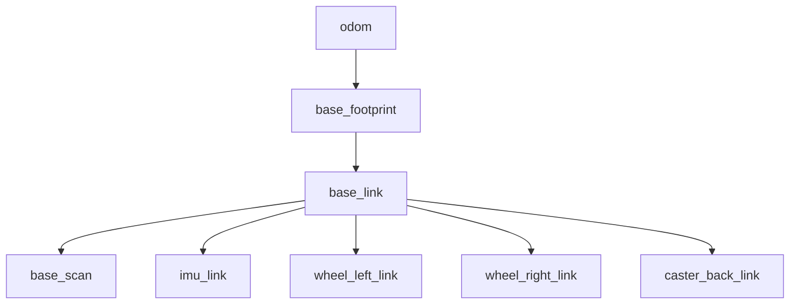

<!-- TODO(초안 메모, 발행 전 삭제): 출력은 Mac + Docker(ros:jazzy-ros-base + gazebo/tb3, arm64)의 헤드리스 실행에서 캡처했다. 주행(cmd_vel 후 odom 변화)은 헤드리스 환경에서 로봇이 움직이지 않아 검증하지 못했으므로, 실습하면서 출력을 채우고 문장도 확인할 것. Gazebo/RViz 스크린샷도 실습 때 채운다. 1~4편 링크도 발행 후 교체. -->

4편까지는 노드와 좌표계를 코드로 다뤘다. 이번 편에서는 **가상의 로봇을 실제로 굴린다.** 바퀴가 돌고 라이다가 벽을 스캔하는 데이터를 받아 본다.

# 1. 왜 시뮬레이터인가

로봇 소프트웨어 개발에서 시뮬레이터는 선택이 아니다.

- **하드웨어 없이 개발한다.** TurtleBot3 실물은 수십만 원에서 백만 원대다
- **부수지 않는다.** 경로 계획 코드가 잘못되면 로봇이 벽으로 돌진한다
- **반복한다.** 같은 상황을 똑같이 백 번 재현할 수 있다
- **빠르다.** 배터리 충전도, 실험실 예약도 필요 없다

로봇 회사에서도 대부분의 개발은 시뮬레이터에서 하고, 검증된 코드만 실물에 올린다.

# 2. Gazebo 세대 정리

여기서 한 번 짚고 가야 한다. 인터넷 자료를 찾다 보면 반드시 혼동하게 되는 부분이다.

| | Gazebo Classic | 새 Gazebo (gz) |
|---|---|---|
| 명령어 | `gazebo` | `gz sim` |
| 최신 버전 | Gazebo 11 (**2025년 1월 지원 종료**) | Harmonic, Ionic, Jetty |
| ROS 연동 패키지 | `gazebo_ros_pkgs` | `ros_gz` |
| Jazzy와 짝 | ✗ | **Harmonic** ✓ |

**Gazebo Classic은 지원이 끝났다.** 그런데 인터넷의 한국어 자료 상당수가 Classic 기준이다. `gazebo_ros_pkgs`, `gazebo_ros` 플러그인, `<gazebo>` 태그가 나오는 글은 Classic 자료라고 보면 된다. 이 글은 새 Gazebo(Harmonic) 기준이다.

Jazzy에서 설치되는 버전을 확인해 보면 이렇다.

```text
Gazebo Sim, version 8.15.0
Copyright (C) 2018 Open Source Robotics Foundation.
```

# 3. 설치

```bash
sudo apt install ros-jazzy-ros-gz ros-jazzy-turtlebot3 ros-jazzy-turtlebot3-gazebo ros-jazzy-turtlebot3-msgs
```

`ros-jazzy-ros-gz`가 ROS2와 Gazebo를 잇는 다리이고, `turtlebot3*`가 로봇 모델과 시뮬레이션 설정이다. 설치되는 패키지는 이렇다.

```text
turtlebot3
turtlebot3_bringup
turtlebot3_cartographer
turtlebot3_description
turtlebot3_example
turtlebot3_gazebo
turtlebot3_msgs
turtlebot3_navigation2
turtlebot3_node
turtlebot3_teleop
```

TurtleBot3는 **어떤 모델을 쓸지 환경 변수로 정한다.** 이걸 빼먹으면 실행이 안 된다.

```bash
export TURTLEBOT3_MODEL=burger
echo "export TURTLEBOT3_MODEL=burger" >> ~/.bashrc
```

| 모델 | 센서 | 특징 |
|---|---|---|
| **burger** | 360도 라이다, IMU | 가장 작고 가볍다. 이 글 기준 |
| waffle | 라이다, IMU, 카메라 | 카메라가 있어 무겁다 |
| waffle_pi | 라이다, IMU, Pi 카메라 | waffle의 라즈베리파이 카메라 버전 |

# 4. 실행하기

TurtleBot3 패키지에는 월드(가상 환경)가 여러 개 들어 있다.

```bash
ros2 launch turtlebot3_gazebo empty_world.launch.py      # 빈 공간
ros2 launch turtlebot3_gazebo turtlebot3_world.launch.py # 원통 장애물이 있는 공간
ros2 launch turtlebot3_gazebo turtlebot3_house.launch.py # 집 내부 (무겁다)
```

`turtlebot3_world`로 띄운다. Gazebo 창이 열리고 가운데에 작은 로봇이 놓여 있다.

```bash
ros2 launch turtlebot3_gazebo turtlebot3_world.launch.py
```

<!-- TODO(실습): Gazebo 창에 TurtleBot3와 원통 장애물이 보이는 화면 → gazebo_world.png -->

> **참고**: 처음 실행하면 모델을 내려받느라 시간이 걸릴 수 있다. 그래픽 카드 드라이버가 없거나 가상머신이면 Gazebo 창이 뜨지 않거나 매우 느릴 수 있다. GUI 없이 서버만 띄우는 방법은 8절에 정리했다.

## 4.1 무엇이 떴는지 보기

새 터미널에서 확인한다.

```bash
ros2 node list
```

```text
/robot_state_publisher
/ros_gz_bridge
```

```bash
ros2 topic list
```

```text
/clock
/cmd_vel
/imu
/joint_states
/odom
/parameter_events
/robot_description
/rosout
/scan
/tf
/tf_static
```

1편부터 봐 온 CLI가 그대로 통한다. 주요 토픽은 이렇다.

| 토픽 | 타입 | 내용 |
|---|---|---|
| `/scan` | `sensor_msgs/msg/LaserScan` | 360도 라이다 측정값 |
| `/odom` | `nav_msgs/msg/Odometry` | 바퀴 회전으로 추정한 위치 |
| `/imu` | `sensor_msgs/msg/Imu` | 자세와 각속도 |
| `/joint_states` | `sensor_msgs/msg/JointState` | 바퀴 관절 각도 |
| `/cmd_vel` | `geometry_msgs/msg/TwistStamped` | 속도 명령 (로봇에게 보내는 것) |
| `/clock` | `rosgraph_msgs/msg/Clock` | **시뮬레이션 시간** |
| `/tf`, `/tf_static` | `tf2_msgs/msg/TFMessage` | 4편에서 다룬 좌표 변환 |

**`/scan`을 빼면 실물 TurtleBot3에서도 똑같은 토픽이 나온다.** 그래서 시뮬레이터에서 만든 코드가 실물에서도 그대로 돈다. 시뮬레이션의 핵심 가치가 여기에 있다.

# 5. 라이다 데이터 읽기

라이다가 보내는 값을 직접 본다.

```bash
ros2 topic echo /scan --once
```

```text
header:
  stamp:
    sec: 28
    nanosec: 600000000
  frame_id: base_scan
angle_min: 0.0
angle_max: 6.28000020980835
angle_increment: 0.01749303564429283
time_increment: 0.0
scan_time: 0.0
range_min: 0.11999999731779099
range_max: 3.5
ranges:
- 1.000956654548645
- 0.9879506230354309
- 1.0008859634399414
- 0.994813084602356
- 1.0079118013381958
- ... (360개)
```

필드를 하나씩 보면 이렇다.

| 필드 | 값 | 의미 |
|---|---|---|
| `frame_id` | `base_scan` | 이 측정값의 기준 좌표계 (4편의 그 프레임이다) |
| `angle_min` / `angle_max` | 0 ~ 6.28 | 0도부터 360도까지 훑는다 |
| `angle_increment` | 0.0175 | 1도(0.0175 라디안)마다 한 번 측정 |
| `range_min` / `range_max` | 0.12 ~ 3.5 | 12cm보다 가깝거나 3.5m보다 먼 것은 못 본다 |
| `ranges` | 배열 | **360개의 거리값 (m)** |

`ranges[0]`이 로봇 정면이고, 인덱스가 커질수록 반시계 방향으로 돈다. 위 출력에서 앞쪽 값이 1.0m 근처인 것은 정면 1m 앞에 원통 장애물이 있다는 뜻이다.

빈 월드(`empty_world`)에서 같은 명령을 실행하면 값이 전부 `.inf`로 나온다. 측정 범위 안에 아무것도 없다는 뜻이다. **`.inf`와 `nan`이 섞여 들어온다는 점은 라이다 데이터를 다룰 때 꼭 기억해야 한다.** 평균을 내거나 최솟값을 찾을 때 그대로 계산하면 결과가 망가진다.

발행 주기도 확인해 본다.

```bash
ros2 topic hz /scan
```

```text
average rate: 4.996
	min: 0.195s max: 0.204s std dev: 0.00287s window: 6
average rate: 5.003
	min: 0.195s max: 0.204s std dev: 0.00259s window: 12
```

5Hz다. 실물 TurtleBot3의 라이다(HLS-LFCD2)와 같은 주기로 맞춰져 있다.

# 6. 로봇 움직이기

## 6.1 키보드로 조종하기

```bash
ros2 run turtlebot3_teleop teleop_keyboard
```

`w`, `a`, `s`, `d`, `x`로 조종하고 스페이스바로 멈춘다. 속도가 단계적으로 올라가는 방식이라 `w`를 여러 번 눌러야 빨라진다.

<!-- TODO(실습): teleop로 로봇을 움직이는 화면 → gazebo_teleop.png -->

## 6.2 명령으로 직접 보내기 - Jazzy에서 바뀐 부분

1편에서 turtlesim을 움직일 때는 `geometry_msgs/msg/Twist`를 발행했다. 그런데 **Jazzy의 TurtleBot3는 `/cmd_vel`을 `TwistStamped`로 받는다.**

```bash
ros2 topic info /cmd_vel --verbose
```

```text
Type: geometry_msgs/msg/TwistStamped

Publisher count: 0

Subscription count: 1

Node name: ros_gz_bridge
Node namespace: /
```

`Twist`로 보내면 **에러 없이 아무 일도 일어나지 않는다.** 타입이 다르면 연결 자체가 되지 않기 때문이다. 인터넷 예제 대부분이 `Twist` 기준이라 여기서 많이들 막힌다.

`TwistStamped`는 `Twist`에 헤더(시각과 좌표계)를 덧붙인 타입이다.

```text
# A twist with reference coordinate frame and timestamp

std_msgs/Header header
	builtin_interfaces/Time stamp
		int32 sec
		uint32 nanosec
	string frame_id
Twist twist
	Vector3  linear
		float64 x
		float64 y
		float64 z
	Vector3  angular
		float64 x
		float64 y
		float64 z
```

명령은 이렇게 보낸다.

```bash
ros2 topic pub -r 10 /cmd_vel geometry_msgs/msg/TwistStamped \
  "{header: {frame_id: base_link}, twist: {linear: {x: 0.2}, angular: {z: 0.3}}}"
```

`linear.x`는 전진 속도(m/s), `angular.z`는 회전 속도(rad/s)다. `Ctrl+C`로 멈춘다. **명령을 계속 보내야 계속 움직인다.** 안전을 위해 일정 시간 명령이 끊기면 로봇이 멈추도록 되어 있다.

움직인 결과는 `/odom`으로 확인한다.

```bash
ros2 topic echo /odom --once --field pose.pose.position
```

<!-- TODO(실습): 주행 전후 odom 좌표 출력 붙이기 -->

`/odom`은 바퀴 회전량으로 추정한 위치다. 오래 달리면 미끄러짐이 쌓여 실제 위치와 어긋나는데, 이 오차를 지도와 라이다로 잡아주는 것이 7편에서 다룰 SLAM이다.

# 7. 시뮬레이션 시간

4편 마지막에 예고한 `use_sim_time` 이야기다.

시뮬레이터는 자체 시계를 가진다. 컴퓨터가 느리면 시뮬레이션 시간은 실제 시간보다 천천히 흐르고, 반대로 빠르게 돌릴 수도 있다. 이 시계가 `/clock` 토픽으로 발행된다.

```bash
ros2 topic echo /clock --once
```

```text
clock:
  sec: 41
  nanosec: 594000000
---
```

`sec: 41`은 시뮬레이션이 시작된 지 41초가 지났다는 뜻이다. 컴퓨터의 벽시계(1970년 기준 초)와 전혀 다른 값이다.

그래서 시뮬레이션에 붙는 노드는 **`/clock`을 시계로 쓰도록 설정해야 한다.**

```bash
ros2 param get /robot_state_publisher use_sim_time
```

```text
Boolean value is: True
```

이 값이 `False`면 노드는 컴퓨터 시계를 쓰고, TF 조회에서 **시각이 맞지 않아 `ExtrapolationException`이 계속 난다.** 4편에서 본 그 예외다. 내가 만든 노드를 시뮬레이터에 붙일 때는 launch 파일에서 이렇게 넘긴다.

```python
Node(
    package='my_package',
    executable='my_node',
    parameters=[{'use_sim_time': True}],
)
```

**시뮬레이터를 쓸 때 가장 흔한 함정이다.** 노드는 정상인데 TF만 안 되면 이것부터 확인한다.

# 8. TF 트리 확인하기

4편에서 만든 트리와 비교해 본다.

```bash
ros2 run tf2_tools view_frames
```

```text
base_link -> wheel_left_link
base_footprint -> base_link
base_link -> wheel_right_link
odom -> base_footprint
base_link -> caster_back_link
base_link -> imu_link
base_link -> base_scan
```

실제 로봇의 프레임 구조다.



4편에서 직접 만든 `odom → base_link → laser`와 구조가 같다. 다른 점은 `base_footprint`가 하나 더 있다는 것인데, 로봇을 바닥에 투영한 지점이다. 바퀴 반지름만큼 높이 차이를 여기서 처리한다.

**이 트리를 만드는 주체는 두 곳이다.** 바퀴 관련 변환(`odom → base_footprint`)은 시뮬레이터의 diff_drive 플러그인이 발행하고, 몸체와 센서의 고정 관계는 `robot_state_publisher`가 로봇 모델(URDF)을 읽어 발행한다. 2024년에 쓴 [URDF 글](https://blog.advenoh.pe.kr/)에서 다룬 그 URDF가 여기서 쓰인다.

# 9. RViz로 라이다 보기

Gazebo는 "실제로 일어나는 일"을 그리고, RViz는 "로봇이 아는 것"을 그린다. 이 차이가 중요하다. 디버깅은 RViz에서 한다.

```bash
ros2 launch turtlebot3_bringup rviz2.launch.py
```

또는 직접 `rviz2`를 띄우고 설정해도 된다.

1. **Fixed Frame**을 `odom`으로 설정
2. **Add > LaserScan**을 추가하고 Topic을 `/scan`으로 지정
3. 필요하면 **Add > RobotModel**, **Add > TF**도 추가

빨간 점들이 나타난다. 이것이 라이다가 감지한 장애물의 위치다. Gazebo 화면의 원통 배치와 비교해 보면 점들이 원통 둘레를 따라 찍혀 있는 것을 볼 수 있다.

<!-- TODO(실습): RViz에 라이다 점군과 로봇 모델이 보이는 화면 → rviz_scan.png -->
<!-- TODO(실습): Gazebo와 RViz를 나란히 놓은 화면 → gazebo_rviz_side.png -->

teleop으로 로봇을 움직이면 점들도 따라 움직인다. **이 점들을 모아 지도로 만드는 것이 7편의 SLAM이다.**

# 10. 자주 막히는 지점

**`TURTLEBOT3_MODEL` 관련 에러**
환경 변수를 설정하지 않았다. `export TURTLEBOT3_MODEL=burger`를 실행하고, `.bashrc`에도 넣어둔다.

**인터넷 예제가 그대로 안 된다**
Gazebo Classic 자료일 가능성이 높다. `gazebo_ros`, `gazebo_ros_pkgs`, `spawn_entity.py`가 나오면 옛 자료다. 새 Gazebo는 `ros_gz`, `ros_gz_sim`, `create`를 쓴다.

**`/cmd_vel`에 발행해도 로봇이 안 움직인다**
메시지 타입을 확인한다. Jazzy TurtleBot3는 `TwistStamped`다. `ros2 topic info /cmd_vel`로 확인하는 습관을 들인다.

**Gazebo 창이 안 뜨거나 매우 느리다**
GPU 드라이버 문제이거나 가상머신·원격 접속 환경이다. GUI 없이 서버만 돌리려면 GUI를 띄우는 부분을 빼고 실행한다.

```bash
# 터미널 1 - 시뮬레이션 서버만 (GUI 없음)
export GZ_SIM_RESOURCE_PATH=/opt/ros/jazzy/share/turtlebot3_gazebo/models
ros2 launch ros_gz_sim gz_sim.launch.py \
  gz_args:="-r -s -v2 /opt/ros/jazzy/share/turtlebot3_gazebo/worlds/turtlebot3_world.world"

# 터미널 2 - 로봇 투입과 ROS 브리지
ros2 launch turtlebot3_gazebo spawn_turtlebot3.launch.py

# 터미널 3 - 로봇 모델 발행
ros2 launch turtlebot3_gazebo robot_state_publisher.launch.py use_sim_time:=true
```

`-s`가 서버만 실행하라는 뜻이다. 이렇게 하면 화면 없이도 `/scan`과 `/odom`이 정상적으로 나온다.

**TF 관련 예외가 계속 난다**
`use_sim_time`을 확인한다. 7절 참고.

# 11. 정리

- **Gazebo Classic은 끝났다.** Jazzy에서는 새 Gazebo(Harmonic)와 `ros_gz`를 쓴다
- TurtleBot3는 `TURTLEBOT3_MODEL` 환경 변수로 모델을 정한다
- 시뮬레이터가 내보내는 토픽은 **실물 로봇과 같다.** 그래서 코드를 그대로 옮길 수 있다
- 라이다는 `/scan`으로 360개 거리값을 5Hz로 보낸다. `.inf` 처리에 주의한다
- **Jazzy의 `/cmd_vel`은 `TwistStamped`다.** 인터넷 예제와 다르니 타입을 꼭 확인한다
- 시뮬레이션에 붙는 노드는 **`use_sim_time`을 켜야** 시계가 맞는다

6편에서는 지금 흐르는 이 데이터를 **파일로 기록하고 다시 재생한다.** rosbag2를 쓰면 로봇을 다시 돌리지 않고도 같은 데이터로 알고리즘을 반복 실험할 수 있다.

# 12. 참고 자료

- [ROBOTIS TurtleBot3 e-Manual](https://emanual.robotis.com/docs/en/platform/turtlebot3/simulation/)
- [Gazebo Harmonic 문서](https://gazebosim.org/docs/harmonic/)
- [ros_gz - ROS와 Gazebo 연동](https://github.com/gazebosim/ros_gz)
- [Gazebo Classic에서 마이그레이션하기](https://gazebosim.org/docs/latest/migrating_gazebo_classic_ros2_packages/)
- [sensor_msgs/msg/LaserScan 정의](https://docs.ros.org/en/jazzy/p/sensor_msgs/interfaces/msg/LaserScan.html)
