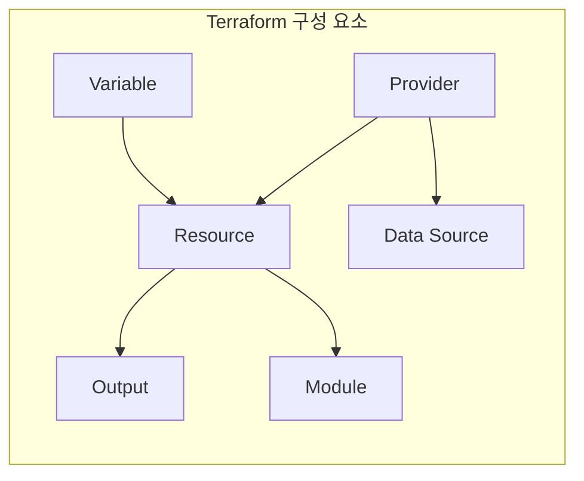
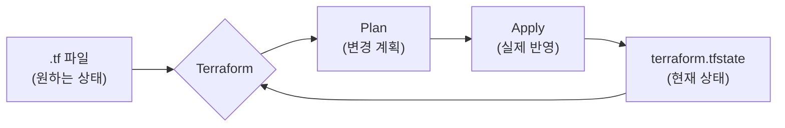
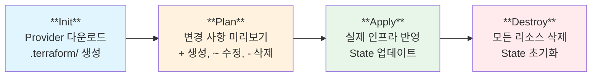
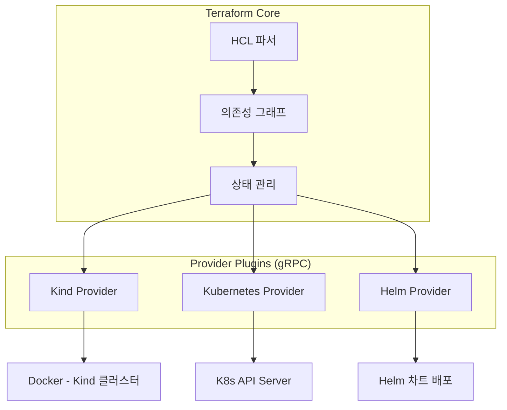
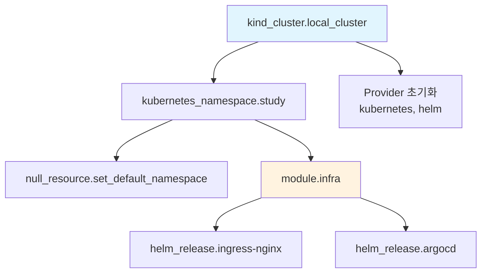
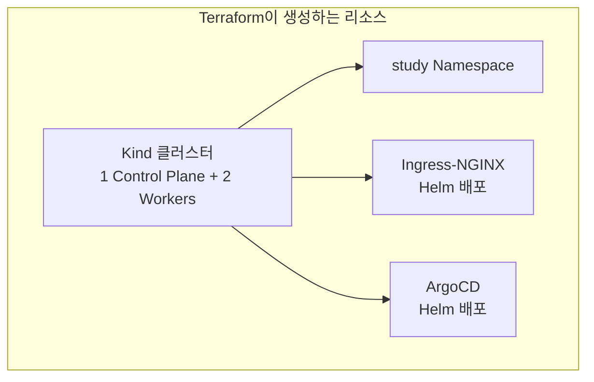
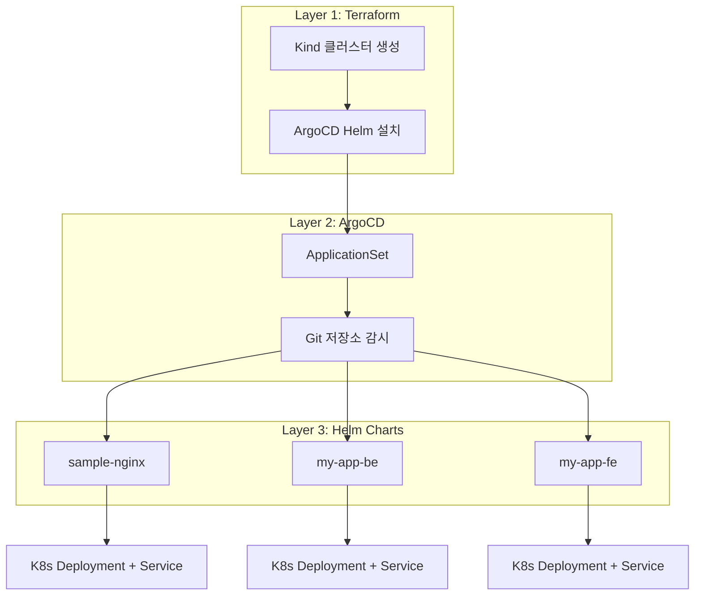
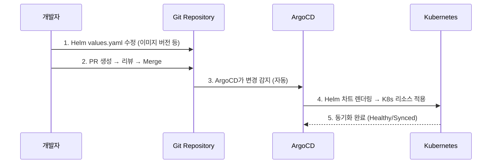

# 1. 들어가며

인프라를 관리하다 보면 "이 서버 설정을 누가, 언제, 왜 바꿨지?"라는 상황을 자주 겪게 된다. 수동으로 콘솔에서 클릭하고, CLI로 명령어를 입력하고, 그 과정을 문서로 남기려 하지만 결국 현재 상태와 문서 사이에 차이가 생긴다.

**IaC(Infrastructure as Code)**는 이 문제를 해결한다. 인프라를 코드로 정의하면:

- **버전 관리**: Git으로 변경 이력을 추적할 수 있다
- **재현성**: 같은 코드를 실행하면 동일한 환경이 만들어진다
- **코드 리뷰**: 인프라 변경도 PR로 리뷰할 수 있다
- **자동화**: CI/CD 파이프라인에 통합할 수 있다

## 1.1 왜 Terraform인가

IaC 도구는 여러 가지가 있다.

| 도구 | 특징 | 접근 방식 |
|------|------|-----------|
| **Terraform** | 멀티 클라우드, 선언적, 큰 생태계 | 선언적 |
| Pulumi | 범용 프로그래밍 언어 사용 (Go, Python 등) | 명령적 |
| CloudFormation | AWS 전용, 깊은 AWS 통합 | 선언적 |
| Ansible | 구성 관리 중심, 에이전트리스 | 명령적/선언적 |

Terraform을 선택한 이유는 다음과 같다:

- **선언적 접근**: "어떻게"가 아니라 "무엇을" 원하는지 정의한다. Terraform이 현재 상태와 원하는 상태의 차이를 계산해서 적용한다
- **Provider 생태계**: AWS, GCP, Azure는 물론 Kubernetes, Helm, Docker, GitHub 등 수천 개의 Provider가 있다
- **Plan 기능**: 실제 적용 전에 어떤 변경이 일어날지 미리 확인할 수 있다
- **커뮤니티**: 가장 널리 사용되는 IaC 도구로, 자료와 모듈이 풍부하다

> 이 글에서는 Terraform의 기본 개념을 이해한 뒤, Kind 클러스터에 ArgoCD를 배포하는 실습을 진행한다. 마지막으로 필자가 실제로 사용하는 Terraform + ArgoCD + Helm 조합을 소개한다.
>
> 전체 소스 코드는 [GitHub](https://github.com/kenshin579/tutorials-go/tree/main/cloud/terraform)에서 확인할 수 있다.

# 2. Terraform 기본 개념

## 2.1 HCL (HashiCorp Configuration Language)

Terraform은 **HCL**이라는 자체 설정 언어를 사용한다. JSON보다 읽기 쉽고, YAML보다 타입이 명확하다.

```hcl
# 기본 문법 구조
resource "리소스_타입" "이름" {
  속성1 = "값"
  속성2 = 123

  중첩_블록 {
    속성3 = true
  }
}
```

HCL의 주요 특징:

- **블록 기반**: `{}` 로 감싸는 블록 단위로 구성
- **속성 할당**: `=` 으로 값을 할당
- **주석**: `#` 또는 `//` 사용
- **문자열 보간**: `"${var.name}"` 처럼 변수 참조 가능 (단순 참조는 `var.name`으로 충분)

## 2.2 핵심 구성 요소

Terraform의 핵심 구성 요소를 정리하면 다음과 같다.



### Provider

**Provider**는 Terraform이 외부 서비스와 통신하기 위한 플러그인이다. AWS, Kubernetes, Helm 등 각 서비스마다 Provider가 있다.

```hcl
# Provider 선언
terraform {
  required_providers {
    kind = {
      source  = "tehcyx/kind"    # Provider 출처
      version = "0.8"            # 버전 제약
    }
    kubernetes = {
      source  = "hashicorp/kubernetes"
      version = "2.36"
    }
  }
}

# Provider 설정
provider "kubernetes" {
  config_path = kind_cluster.local_cluster.kubeconfig_path
}
```

### Resource

**Resource**는 Terraform이 생성하고 관리하는 실제 인프라 객체이다. `resource "타입" "이름"` 형태로 선언한다.

```hcl
# Kind 클러스터 리소스 선언
resource "kind_cluster" "local_cluster" {
  name           = var.kind_cluster_name
  wait_for_ready = true
  node_image     = "kindest/node:v1.28.15"
}

# Kubernetes Namespace 리소스 선언
resource "kubernetes_namespace" "study" {
  depends_on = [kind_cluster.local_cluster]
  metadata {
    name = var.study_namespace
  }
}
```

- `kind_cluster.local_cluster`: 리소스 타입과 이름을 조합한 고유 식별자
- `depends_on`: 리소스 간 명시적 의존성 선언 (이 경우 클러스터가 먼저 생성되어야 함)

### Variable과 Output

**Variable**은 설정값을 외부에서 주입할 수 있게 하고, **Output**은 생성된 결과를 출력한다.

```hcl
# Variable: 입력값 정의
variable "kind_cluster_name" {
  description = "Kind 클러스터 이름"
  type        = string
  default     = "terraform-study-cluster"
}

# Output: 결과값 출력
output "kubeconfig_path" {
  description = "Kind 클러스터의 kubeconfig 파일 경로"
  value       = kind_cluster.local_cluster.kubeconfig_path
}
```

Variable 값을 오버라이드하는 방법:

```bash
# CLI 인자
terraform apply -var="kind_cluster_name=my-cluster"

# 환경변수
export TF_VAR_kind_cluster_name="my-cluster"

# terraform.tfvars 파일
kind_cluster_name = "my-cluster"
```

### Data Source

**Data Source**는 Terraform 외부에서 이미 존재하는 리소스의 정보를 읽어온다. Resource가 "생성"이라면 Data Source는 "조회"이다.

```hcl
# 이미 존재하는 Namespace 정보를 조회
data "kubernetes_namespace" "default" {
  metadata {
    name = "default"
  }
}

# 조회한 정보 사용
resource "kubernetes_config_map" "example" {
  metadata {
    namespace = data.kubernetes_namespace.default.metadata[0].name
  }
}
```

### Module

**Module**은 관련 리소스들을 하나의 재사용 가능한 패키지로 묶은 것이다. 디렉토리 단위로 분리하여 코드의 구조화와 재사용성을 높인다.

```hcl
# 모듈 호출 (main.tf)
module "infra" {
  source          = "./modules/infra"            # 모듈 경로
  study_namespace = kubernetes_namespace.study.metadata[0].name  # 변수 전달

  depends_on = [kubernetes_namespace.study]
}
```

```hcl
# 모듈 내부 (modules/infra/infra.tf)
# - 전달받은 변수를 사용하여 리소스 생성
resource "helm_release" "argocd" {
  name       = "argocd"
  repository = "https://argoproj.github.io/argo-helm"
  chart      = "argo-cd"
  version    = "7.8.28"
  namespace  = kubernetes_namespace.argocd.metadata[0].name
  # ...
}
```

## 2.3 State (상태 관리)

Terraform은 **State 파일**(`terraform.tfstate`)에 현재 인프라의 상태를 기록한다. 이 파일이 Terraform의 핵심이다.



- **Plan 시**: `.tf` 파일(원하는 상태)과 State 파일(현재 상태)을 비교하여 차이를 계산한다
- **Apply 시**: 계산된 변경사항을 실제 인프라에 적용하고 State 파일을 업데이트한다

State 관리 방식:

| 방식 | 설명 | 적합한 환경 |
|------|------|-------------|
| **Local** | 로컬 파일로 저장 (기본값) | 개인 프로젝트, 학습 |
| **Remote** | S3, GCS 등 원격 저장소 | 팀 협업, 프로덕션 |

> **주의**: State 파일에는 비밀번호, API 키 등 민감한 정보가 포함될 수 있다. `.gitignore`에 반드시 추가하고, 팀 환경에서는 Remote Backend를 사용하자.

# 3. 아키텍처

## 3.1 Terraform 동작 원리

Terraform의 워크플로우는 4단계로 구성된다.



| 단계 | 명령어 | 설명 |
|------|--------|------|
| **Init** | `terraform init` | Provider 플러그인 다운로드, `.terraform/` 디렉토리 생성 |
| **Plan** | `terraform plan` | 현재 상태와 코드를 비교하여 변경 계획 출력 |
| **Apply** | `terraform apply` | Plan의 변경 사항을 실제 인프라에 적용 |
| **Destroy** | `terraform destroy` | Terraform으로 생성한 모든 리소스 삭제 |

## 3.2 Provider Plugin 아키텍처

Terraform Core는 HCL 파싱과 상태 관리를 담당하고, 실제 인프라 조작은 Provider Plugin이 수행한다.



- Provider는 별도의 바이너리로, gRPC를 통해 Terraform Core와 통신한다
- `terraform init` 시 필요한 Provider가 자동으로 다운로드된다
- Provider 버전을 고정하여 재현 가능한 빌드를 보장한다

## 3.3 의존성 그래프

Terraform은 리소스 간 의존 관계를 **DAG(Directed Acyclic Graph)**로 관리한다. 의존성이 없는 리소스는 병렬로 생성되어 속도가 빨라진다.



위 그래프에서 Kind 클러스터가 먼저 생성되고, 그 다음 Namespace와 Provider 초기화가 병렬로 진행된다. 이후 infra 모듈 내의 Ingress-NGINX와 ArgoCD도 병렬로 설치된다.

의존성 그래프는 다음 명령어로 확인할 수 있다:

```bash
terraform graph | dot -Tpng > graph.png
```

# 4. 설치 및 기본 사용법

## 4.1 설치

macOS에서 Homebrew로 설치하는 것이 가장 간편하다.

```bash
# Homebrew로 설치
brew install terraform

# 버전 확인
terraform version
```

여러 프로젝트에서 서로 다른 Terraform 버전을 사용해야 한다면 **tfenv**(버전 매니저)를 추천한다.

```bash
# tfenv 설치
brew install tfenv

# 특정 버전 설치 및 사용
tfenv install 1.10.0
tfenv use 1.10.0

# 현재 사용 중인 버전 확인
tfenv list
```

## 4.2 주요 CLI 명령어

자주 사용하는 명령어를 정리하면 다음과 같다.

```bash
# 초기화: Provider 다운로드 및 모듈 설치
terraform init
terraform init -upgrade    # Provider를 최신 허용 버전으로 업그레이드

# 코드 검증 및 포맷팅
terraform validate         # 설정 파일 문법 검증
terraform fmt              # 코드 자동 포맷팅 (표준 스타일로)
terraform fmt -check       # 포맷 변경 필요 여부만 확인

# 변경 계획 확인
terraform plan             # 어떤 리소스가 생성/수정/삭제될지 미리보기

# 적용
terraform apply            # 변경 사항 적용 (확인 프롬프트 표시)
terraform apply -auto-approve  # 확인 없이 바로 적용

# 상태 확인
terraform show             # 현재 State의 리소스 상세 정보
terraform output           # Output 값 출력
terraform state list       # 관리 중인 리소스 목록

# 삭제
terraform destroy          # 모든 리소스 삭제
terraform destroy -target=kind_cluster.local_cluster  # 특정 리소스만 삭제
```

## 4.3 파일 구조 컨벤션

Terraform 프로젝트는 보통 다음과 같이 파일을 분리한다.

```
project/
├── main.tf          # Provider 설정, 모듈 호출
├── variables.tf     # 변수 정의
├── outputs.tf       # 출력 정의
├── terraform.tfvars # 변수 값 (선택, .gitignore 대상)
├── modules/         # 재사용 모듈
│   └── infra/
│       ├── infra.tf
│       └── variables.tf
└── .gitignore       # State, Provider 캐시 제외
```

`.gitignore`에 포함해야 할 항목:

```
.terraform/          # Provider 바이너리 캐시
*.tfstate            # State 파일
*.tfstate.backup     # State 백업
*.tfvars             # 민감한 변수 값
```

# 5. 실습: Kind 클러스터 + ArgoCD 배포

실습 코드는 [tutorials-go/cloud/terraform](https://github.com/kenshin579/tutorials-go/tree/main/cloud/terraform)에서 확인할 수 있다. 이번 실습에서는 Terraform으로 로컬 Kubernetes 클러스터를 생성하고 ArgoCD를 설치하는 과정을 진행한다.

## 5.1 실습 목표 및 아키텍처



## 5.2 Step 1: Provider 설정 (main.tf)

먼저 사용할 Provider를 선언한다.

```hcl
terraform {
  required_providers {
    kind = {
      source  = "tehcyx/kind"
      version = "0.8"
    }
    kubernetes = {
      source  = "hashicorp/kubernetes"
      version = "2.36"
    }
    helm = {
      source  = "hashicorp/helm"
      version = "3.0.0-pre2"
    }
    null = {
      source = "hashicorp/null"
    }
  }
}
```

Kubernetes와 Helm Provider는 Kind 클러스터의 kubeconfig를 참조하여 연결한다.

```hcl
provider "kubernetes" {
  config_path = kind_cluster.local_cluster.kubeconfig_path
}

provider "helm" {
  kubernetes = {
    config_path = kind_cluster.local_cluster.kubeconfig_path
  }
}
```

## 5.3 Step 2: Kind 클러스터 생성 (kind.tf)

Kind 클러스터를 정의한다. Control Plane 1개와 Worker 노드 2개로 구성한다.

```hcl
resource "kind_cluster" "local_cluster" {
  name           = var.kind_cluster_name
  wait_for_ready = true
  node_image     = "kindest/node:v1.28.15"

  kind_config {
    kind        = "Cluster"
    api_version = "kind.x-k8s.io/v1alpha4"

    node {
      role = "control-plane"
      extra_port_mappings {
        container_port = 30080
        host_port      = 30080
        listen_address = "127.0.0.1"
      }
      extra_mounts {
        host_path      = "/tmp/kind-storage"
        container_path = "/opt/local-path-provisioner"
      }
    }

    node { role = "worker" }
    node { role = "worker" }
  }
}
```

- `extra_port_mappings`: NodePort 서비스를 호스트에서 접근 가능하도록 포트를 매핑한다
- `extra_mounts`: Persistent Volume 데이터를 호스트 디스크에 저장한다

## 5.4 Step 3: Module로 ArgoCD 배포 (modules/infra/)

인프라 설치를 모듈로 분리하여 관리한다. 모듈은 `main.tf`에서 호출한다.

```hcl
module "infra" {
  source          = "./modules/infra"
  study_namespace = kubernetes_namespace.study.metadata[0].name

  depends_on = [kubernetes_namespace.study]
}
```

모듈 내부에서는 Helm Provider를 사용하여 ArgoCD를 설치한다.

```hcl
# modules/infra/infra.tf
resource "helm_release" "argocd" {
  name       = "argocd"
  repository = "https://argoproj.github.io/argo-helm"
  chart      = "argo-cd"
  version    = "7.8.28"
  namespace  = kubernetes_namespace.argocd.metadata[0].name

  values = [
    <<-EOT
    configs:
      secret:
        argocdServerAdminPassword: ${var.argocd_password}
    server:
      service:
        type: "ClusterIP"
    EOT
  ]
}
```

`helm_release`는 `helm install`과 동일한 동작을 한다. `values` 블록에서 Helm values를 인라인으로 정의할 수 있다.

## 5.5 Step 4: 실행 및 확인

```bash
# 1. 초기화
make tf-init

# 2. Plan으로 변경 사항 미리 확인
terraform plan

# 3. 적용
make tf-install

# 4. 생성된 리소스 확인
kubectl get nodes
kubectl get pods -n argocd

# 5. ArgoCD UI 접속 (포트포워딩)
kubectl port-forward svc/argocd-server -n argocd 8080:443
# 브라우저에서 https://localhost:8080 접속
# ID: admin / PW: password
```

`terraform plan` 실행 시 다음과 같이 생성될 리소스가 표시된다:

```
Plan: 7 to add, 0 to change, 0 to destroy.
```

## 5.6 Step 5: ArgoCD로 애플리케이션 배포

Terraform으로 클러스터와 ArgoCD가 준비되었으니, 이제 ArgoCD에 애플리케이션을 등록하여 배포해보자. 샘플 코드에 포함된 `bootstrap/sample-apps.yaml`과 `charts/sample-nginx/`를 사용한다.

### Helm 차트 구조

먼저 배포할 샘플 NGINX 앱의 Helm 차트 구조를 살펴보자.

```
charts/sample-nginx/
├── Chart.yaml           # 차트 메타데이터
├── values.yaml          # 설정값 정의
└── templates/
    ├── deployment.yaml  # K8s Deployment 템플릿
    └── service.yaml     # K8s Service 템플릿
```

`values.yaml`에서 이미지, 레플리카 수, 리소스 등의 설정값을 정의한다.

```yaml
# charts/sample-nginx/values.yaml
replicaCount: 1

image:
  repository: nginx
  tag: "1.27.0"

service:
  type: ClusterIP
  port: 80

resources:
  requests:
    cpu: 50m
    memory: 64Mi
  limits:
    cpu: 100m
    memory: 128Mi
```

`templates/deployment.yaml`에서는 `{{ .Values.xxx }}`로 위 설정값을 참조한다.

```yaml
# charts/sample-nginx/templates/deployment.yaml
apiVersion: apps/v1
kind: Deployment
metadata:
  name: {{ .Chart.Name }}
spec:
  replicas: {{ .Values.replicaCount }}
  selector:
    matchLabels:
      app: {{ .Chart.Name }}
  template:
    metadata:
      labels:
        app: {{ .Chart.Name }}
    spec:
      containers:
        - name: nginx
          image: "{{ .Values.image.repository }}:{{ .Values.image.tag }}"
          ports:
            - containerPort: 80
          resources:
            requests:
              cpu: {{ .Values.resources.requests.cpu }}
              memory: {{ .Values.resources.requests.memory }}
            limits:
              cpu: {{ .Values.resources.limits.cpu }}
              memory: {{ .Values.resources.limits.memory }}
```

### ApplicationSet으로 ArgoCD에 앱 등록

ArgoCD에 앱을 등록할 때는 **ApplicationSet**을 사용한다. ApplicationSet은 템플릿 기반으로 여러 Application을 한 번에 정의할 수 있다.

```yaml
# bootstrap/sample-apps.yaml
apiVersion: argoproj.io/v1alpha1
kind: ApplicationSet
metadata:
  name: sample-apps
  namespace: argocd
spec:
  generators:
    - list:
        elements:
          - appName: sample-nginx      # 배포할 앱 목록
  template:
    metadata:
      name: "{{appName}}"
    spec:
      project: default
      source:
        repoURL: https://github.com/kenshin579/tutorials-go.git
        targetRevision: main
        path: "cloud/terraform/charts/{{appName}}"   # Helm 차트 경로
      destination:
        server: https://kubernetes.default.svc
        namespace: study
      syncPolicy:
        automated:
          prune: true       # Git에서 삭제된 리소스는 K8s에서도 삭제
          selfHeal: true    # 수동 변경 시 Git 상태로 자동 복원
        syncOptions:
          - CreateNamespace=true
```

- `generators.list.elements`: 배포할 앱 목록. 새 앱을 추가하려면 여기에 항목만 추가하면 된다
- `source.path`: Git 저장소 내 Helm 차트 경로. `{{appName}}`이 실제 앱 이름으로 치환된다
- `syncPolicy.automated`: Git에 변경이 감지되면 자동으로 K8s에 반영한다

### 배포 실행 및 확인

```bash
# 1. ApplicationSet 적용
kubectl apply -f bootstrap/sample-apps.yaml

# 2. ArgoCD Application 상태 확인
kubectl get applications -n argocd
# NAME           SYNC STATUS   HEALTH STATUS
# sample-nginx   Synced        Healthy

# 3. 배포된 Pod 확인
kubectl get pods -n study
# NAME                            READY   STATUS    RESTARTS   AGE
# sample-nginx-xxxxx-xxxxx        1/1     Running   0          30s

# 4. Service 확인
kubectl get svc -n study
# NAME           TYPE        CLUSTER-IP     EXTERNAL-IP   PORT(S)   AGE
# sample-nginx   ClusterIP   10.96.x.x      <none>        80/TCP    30s

# 5. NGINX 접속 테스트
kubectl port-forward svc/sample-nginx -n study 8081:80
# 브라우저에서 http://localhost:8081 접속
```

ArgoCD UI(`https://localhost:8080`)에서도 `sample-nginx` 앱이 Synced/Healthy 상태로 등록된 것을 확인할 수 있다.

### 설정 변경 테스트

ArgoCD의 자동 동기화를 확인해보자. `values.yaml`에서 replica 수를 변경하고 Git push하면 ArgoCD가 자동으로 반영한다.

```yaml
# charts/sample-nginx/values.yaml 수정
replicaCount: 2   # 1 → 2로 변경
```

```bash
# Git push 후 잠시 대기하면 ArgoCD가 자동 감지
kubectl get pods -n study
# NAME                            READY   STATUS    RESTARTS   AGE
# sample-nginx-xxxxx-aaaaa        1/1     Running   0          5m
# sample-nginx-xxxxx-bbbbb        1/1     Running   0          10s   ← 새로 생성됨
```

Terraform 코드는 전혀 건드리지 않고, Helm 차트의 `values.yaml`만 수정하여 배포가 완료되었다. 이것이 Terraform + ArgoCD + Helm 조합의 핵심 장점이다.

## 5.7 Step 6: 정리

```bash
# ArgoCD Application 삭제
kubectl delete -f bootstrap/sample-apps.yaml

# Terraform 리소스 전체 삭제 (Kind 클러스터 + ArgoCD)
make tf-destroy

# Terraform 캐시까지 정리
make tf-clean
```

# 6. 내가 사용하는 방식: Terraform + ArgoCD + Helm

## 6.1 왜 Terraform 범위를 최소화하는가

Terraform으로 모든 Kubernetes 리소스를 관리할 수도 있다. 하지만 실제로 사용해보면 다음과 같은 문제가 생긴다:

- **State 관리 복잡도 증가**: 앱이 늘어날수록 State 파일이 비대해지고, `terraform plan`이 느려진다
- **배포 속도**: 앱 하나의 설정을 변경해도 전체 State를 확인해야 한다
- **역할 분리 어려움**: 인프라 엔지니어와 앱 개발자가 같은 Terraform 코드를 관리해야 한다

그래서 필자는 **Terraform의 역할을 최소한으로 제한**한다.

| 역할 | 도구 | 관리 대상 |
|------|------|-----------|
| **클러스터 프로비저닝** | Terraform | Kind 클러스터, ArgoCD 설치 |
| **앱 배포 자동화** | ArgoCD | ApplicationSet으로 앱 등록/동기화 |
| **앱 설정 관리** | Helm Charts | Deployment, Service, ConfigMap 등 |

## 6.2 전체 구조



실제 필자가 사용하는 프로젝트의 디렉토리 구조는 다음과 같다.

```
charts/
├── main.tf                          # Provider 설정
├── k8s.tf                           # Kind 클러스터 정의 (1 CP + 3 Workers)
├── variables.tf
├── outputs.tf
├── modules/
│   └── infra/
│       └── infra.tf                 # Terraform이 관리: ArgoCD만 설치
├── bootstrap/                       # ArgoCD ApplicationSet 정의
│   ├── macmini-infra.yaml           #   → DB (MySQL, Redis)
│   ├── macmini-app.yaml             #   → 앱 (10개+)
│   └── macmini-gateway.yaml         #   → Gateway (NGINX, cert-manager)
├── charts/                          # Helm 차트 모음 (20개+)
│   ├── mysql/                       #   인프라
│   ├── redis/
│   ├── nginx-gateway/
│   ├── cert-manager/
│   ├── inspireme-be/                #   애플리케이션
│   ├── inspireme-fe/
│   ├── moneyflow-be/
│   ├── moneyflow-fe/
│   ├── ai-chatbot-be/
│   └── ...
└── Makefile
```

핵심은 `modules/infra/infra.tf`가 **ArgoCD 하나만** 설치한다는 점이다. MySQL, Redis 같은 인프라 DB와 모든 애플리케이션은 `bootstrap/`의 ApplicationSet으로 ArgoCD에 등록하고, 실제 K8s 리소스 정의는 `charts/` 아래 각각의 Helm 차트에서 관리한다.

이 구조의 핵심은 **관심사의 분리**이다:

- **Terraform**: "클러스터가 존재하고, ArgoCD가 설치되어 있어야 한다"만 담당
- **ArgoCD**: "어떤 앱들이 배포되어야 하는지"를 관리
- **Helm Charts**: "각 앱이 어떻게 구성되는지"를 정의

## 6.3 실전 워크플로우

실제 운영에서의 흐름은 다음과 같다.



앱 설정을 변경하려면 **Helm 차트의 `values.yaml`만 수정**하면 된다. Terraform 코드는 건드릴 필요가 없다.

### ApplicationSet 예제

ArgoCD에 앱을 등록할 때는 ApplicationSet을 사용한다. 아래는 샘플 코드에 포함된 예제이다.

```yaml
apiVersion: argoproj.io/v1alpha1
kind: ApplicationSet
metadata:
  name: sample-apps
  namespace: argocd
spec:
  generators:
    - list:
        elements:
          - appName: sample-nginx
  template:
    metadata:
      name: "{{appName}}"
    spec:
      project: default
      source:
        repoURL: https://github.com/kenshin579/tutorials-go.git
        targetRevision: main
        path: "cloud/terraform/charts/{{appName}}"
      destination:
        server: https://kubernetes.default.svc
        namespace: study
      syncPolicy:
        automated:
          prune: true       # Git에서 삭제된 리소스는 K8s에서도 삭제
          selfHeal: true    # 수동 변경 시 Git 상태로 자동 복원
```

- `generators.list`: 배포할 앱 목록. 새 앱을 추가하려면 여기에 항목만 추가하면 된다
- `syncPolicy.automated`: ArgoCD가 Git 변경을 감지하면 자동으로 K8s에 반영한다

### Helm 차트 예제

각 앱의 Kubernetes 리소스는 Helm 차트로 정의한다.

```yaml
# charts/sample-nginx/values.yaml
replicaCount: 1

image:
  repository: nginx
  tag: "1.27.0"

service:
  type: ClusterIP
  port: 80

resources:
  requests:
    cpu: 50m
    memory: 64Mi
  limits:
    cpu: 100m
    memory: 128Mi
```

replica 수를 변경하고 싶다면 `values.yaml`의 `replicaCount`만 수정하고 Git push하면 ArgoCD가 자동으로 반영한다.

## 6.4 이 구조의 장점

1. **변경의 범위가 명확하다**: 앱 설정은 Helm Chart만, 클러스터는 Terraform만 수정
2. **Terraform State가 간결하다**: 클러스터와 ArgoCD만 관리하므로 State가 작고 빠르다
3. **ArgoCD가 drift를 감지한다**: 누군가 수동으로 K8s 리소스를 변경해도 ArgoCD가 원래 상태로 복원한다
4. **앱 추가가 간단하다**: Helm 차트를 만들고 ApplicationSet에 이름만 추가하면 끝

# 7. 마무리

이 글에서는 Terraform의 기본 개념(Provider, Resource, Variable, Module, State)을 살펴보고, Kind 클러스터에 ArgoCD를 배포하는 실습을 진행했다.

핵심 정리:

- **Terraform**: 선언적 IaC 도구. `.tf` 파일로 인프라를 정의하고, `plan → apply`로 적용한다
- **State**: Terraform이 현재 인프라 상태를 추적하는 핵심 메커니즘
- **Module**: 리소스를 재사용 가능한 단위로 분리하여 코드를 구조화한다
- **실전 구조**: Terraform(클러스터) + ArgoCD(배포 자동화) + Helm(앱 설정) 조합으로 역할을 분리하면 관리가 훨씬 수월해진다

## 참고

- [Terraform 공식 문서](https://developer.hashicorp.com/terraform/docs)
- [Terraform Registry - Provider 목록](https://registry.terraform.io/browse/providers)
- [Kind Provider 문서](https://registry.terraform.io/providers/tehcyx/kind/latest/docs)
- [ArgoCD 공식 문서](https://argo-cd.readthedocs.io/)
- [전체 소스 코드 - GitHub](https://github.com/kenshin579/tutorials-go/tree/main/cloud/terraform)
