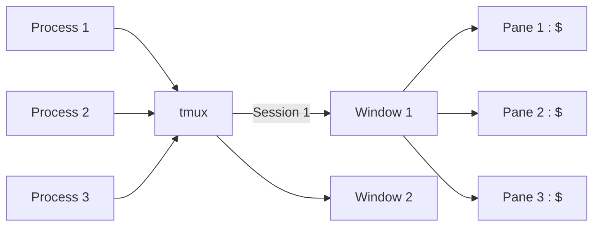
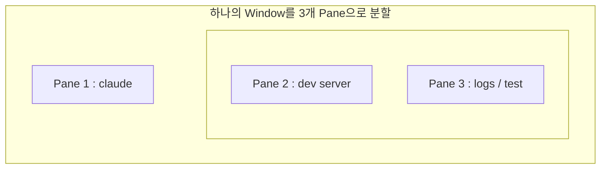

# 1. 들어가며

예전에 Linux 서버를 자주 다룰 때는 `tmux` 없이 일하는 게 상상이 안 됐다. 그러다 로컬 개발 위주로 일하면서 한동안 잊고 지냈는데, 요즘 Claude Code 같은 터미널 기반 AI 코딩 도구를 쓰면서 다시 손이 가기 시작했다. 이참에 입문자 관점에서 tmux를 처음부터 차근차근 정리해 둔다.

혹시 이런 경험이 있다면 tmux가 답이 될 수 있다.

- 터미널 탭이 10개씩 열려서 어디에 뭐가 있는지 모르겠다.
- 원격 서버에서 작업하다 SSH가 끊겨 돌아가던 빌드나 스크립트가 통째로 날아갔다.
- 한 화면에서 코드 편집과 로그를 같이 보고 싶은데 창을 계속 왔다 갔다 한다.

이 글은 설치를 macOS 기준으로 다루고, 개념부터 기본 사용법, 최소 설정까지 순서대로 짚은 뒤, 마지막에 Claude Code Session과 함께 쓰는 활용법을 소개한다. 위에서 아래로 그대로 따라 치면 된다.

# 2. tmux란?

tmux는 **t**erminal **mux**(multiplexer), 즉 "터미널 멀티플렉서"의 줄임말이다. 하나의 터미널 창 안에서 여러 작업 공간을 다루고, 그 작업 공간을 백그라운드에 띄워둘 수 있게 해주는 도구다.

입문자가 기억할 핵심 가치는 두 가지다.

**① Session 지속성(persistence)** — tmux Session은 터미널 창을 닫거나 SSH 연결이 끊겨도 백그라운드에 그대로 살아있다. 나중에 다시 붙기만(attach) 하면 하던 작업이 끊긴 적 없다는 듯 이어진다. 앞서 말한 "SSH가 끊겨 빌드가 날아갔다"는 문제가 바로 여기서 사라진다.

**② 화면 분할** — 하나의 화면을 여러 Window와 Pane으로 나눠 동시에 여러 작업을 볼 수 있다. 편집기, 로그, 개발 서버를 한눈에 두고 작업할 수 있다.

한 줄로 비유하면, tmux는 **닫아도 사라지지 않고, 칸막이를 자유롭게 나눌 수 있는 작업 공간**이다.

# 3. 설치 (macOS)

macOS에서는 Homebrew로 한 줄이면 끝난다.

```bash
brew install tmux
```

설치가 끝나면 버전을 확인해 본다.

```bash
tmux -V
# tmux 3.5a  (예시)
```

버전 문자열이 출력되면 준비 완료다. 이제 터미널에서 `tmux`라고 입력하면 첫 Session이 시작된다.

# 4. 핵심 개념: Session, Window, Pane

tmux를 쓰려면 세 가지 단위를 알아야 한다. 셋은 **Session > Window > Pane** 순서로 포함 관계를 이룬다.

- **Session**: tmux의 최상위 작업 공간 단위다. 보통 프로젝트나 작업 하나당 Session 하나를 쓴다. 앞서 말한 detach/attach의 대상이 바로 이 Session이다.
- **Window**: Session 안의 "탭"이라고 보면 된다. 화면 전체를 차지하며, 여러 Window를 번갈아 가며 본다.
- **Pane**: Window를 나눈 분할 화면이다. 한 Window 안에 여러 Pane이 동시에 보인다.

여러 프로세스가 tmux를 통해 하나의 Session으로 모이고, Session 하나 안에 Window 여러 개가, Window 하나 안에 Pane 여러 개가 들어가는 구조다. 그림으로 보면 이렇다.



# 5. 기본 사용법

## prefix 키부터

tmux의 거의 모든 단축키는 **prefix 키를 먼저 누른 뒤** 다음 키를 누르는 방식이다. 기본 prefix는 `Ctrl+b`다. 이 글에서는 이걸 `prefix`로 표기한다. 즉 `prefix c`는 "`Ctrl+b`를 누르고 손을 뗀 다음 `c`를 누른다"는 뜻이다. 동시에 누르는 게 아니라 순서대로 누른다는 점만 기억하면 된다.

## Session

- 새 Session 시작(이름 지정): `tmux new -s my-project`
- Session에서 빠져나오기(detach): `prefix d` (Session은 계속 살아있음)
- Session 목록 보기: `tmux ls`
- Session에 다시 붙기(attach): `tmux attach -t my-project`
- Session 종료: `tmux kill-session -t my-project`

여기서 핵심은 `prefix d`(detach)와 `tmux attach -t`(다시 붙기)다. detach해도 Session 안의 작업은 백그라운드에서 계속 돌아간다.

## Window

- 새 Window: `prefix c`
- 다음 / 이전 Window: `prefix n` / `prefix p`
- 번호로 이동: `prefix 0` ~ `prefix 9`
- Window 이름 변경: `prefix ,`

## Pane

- 좌우 분할: `prefix %`
- 상하 분할: `prefix "`
- Pane 간 이동: `prefix 방향키`
- Pane 크기 조절: `prefix Ctrl+방향키`
- 현재 Pane 닫기: `prefix x` (확인 후 y)

## 핵심 단축키 치트시트

자주 쓰는 명령만 한눈에 모았다. 이 표만 옆에 두고 시작해도 충분하다.

| 구분 | 동작 | 명령 / 단축키 |
|------|------|---------------|
| Session | 새 Session | `tmux new -s 이름` |
| Session | detach | `prefix d` |
| Session | attach | `tmux attach -t 이름` |
| Session | 목록 | `tmux ls` |
| Window | 새 Window | `prefix c` |
| Window | 이동 | `prefix n` / `prefix p` / `prefix 숫자` |
| Pane | 좌우 분할 | `prefix %` |
| Pane | 상하 분할 | `prefix "` |
| Pane | 이동 | `prefix 방향키` |
| Pane | 닫기 | `prefix x` |

# 6. .tmux.conf 최소 설정

처음부터 화려하게 꾸밀 필요는 없다. 입문자에게 체감이 큰 네 가지만 `~/.tmux.conf`에 넣어보자.

```bash
# 1) prefix를 Ctrl+a로 변경 (Ctrl+b가 손에 안 맞으면)
unbind C-b
set -g prefix C-a
bind C-a send-prefix

# 2) 마우스로 Pane 선택/크기 조절/스크롤 가능
set -g mouse on

# 3) 분할 단축키를 직관적으로 ( | 좌우, - 상하 )
bind | split-window -h
bind - split-window -v

# 4) 설정 리로드 단축키 (prefix r)
bind r source-file ~/.tmux.conf \; display "Reloaded!"
```

저장한 뒤 적용하려면 tmux 안에서 `prefix r`을 누르면 된다. `tmux kill-server`로 다시 시작하는 방법도 있지만, 이건 **실행 중인 모든 Session이 종료되니** 주의하자. 보통은 `prefix r` 리로드로 충분하다.

참고로 1번 설정에서 prefix를 `Ctrl+a`로 바꾸는 것은 어디까지나 취향에 따른 **선택**이다. 바꾸면 기본 prefix와 달라지므로 헷갈릴 수 있다. 이 글의 나머지 본문에서 쓰는 단축키는 모두 **기본 prefix인 `Ctrl+b`** 기준이라는 점만 기억하자.

# 7. Claude Code와 함께 쓰기

여기까지가 tmux 기본기다. 이제 처음에 말했던, 내가 tmux를 다시 자주 쓰게 된 이유로 돌아와 보자. Claude Code와 tmux는 궁합이 꽤 좋다. 이유는 두 가지다.

- **장시간 자율 작업이 detach로 살아남는다.** Claude Code에 긴 작업을 맡겨두고 `prefix d`로 빠져나오면, 터미널을 닫아도 작업은 계속 돌아간다.
- **한 화면에서 병렬로 일할 수 있다.** Claude Code와 dev server, 로그를 Pane으로 나눠 동시에 보면 작업 흐름이 끊기지 않는다.

## 패턴 A — 한 화면 레이아웃

Window 하나를 Pane으로 나눠, 왼쪽에는 Claude Code를, 오른쪽 위에는 개발 서버를, 오른쪽 아래에는 로그나 테스트를 띄우는 구성이다. 배치를 그림으로 보면 이렇다.



만드는 순서는 이렇다.

1. Session을 시작하고 왼쪽 Pane에서 `claude`를 실행한다.
2. `prefix %`로 좌우 분할 → 오른쪽 Pane이 생긴다.
3. 오른쪽 Pane에서 `prefix "`로 상하 분할 → 위/아래 Pane이 생긴다.
4. 오른쪽 위에서 `npm run dev`, 오른쪽 아래에서 로그나 테스트를 돌린다.

이렇게 하면 한 화면에서 Claude의 작업, 서버 출력, 로그를 동시에 지켜볼 수 있다.

## 패턴 B — 지속성 & 원격

detach의 진가가 발휘되는 패턴이다.

- `tmux new -s claude-feature`로 Session을 만들고 그 안에서 `claude`를 실행한다.
- 긴 작업을 시킨 뒤 `prefix d`로 detach한다. → 노트북을 닫거나 SSH가 끊겨도 작업은 계속된다.
- 나중에 `tmux attach -t claude-feature`로 다시 붙으면 대화 기록과 출력이 그대로 남아있다.
- 원격 서버(VPS)에 띄워두면 사무실, 집, 심지어 폰에서 SSH로 붙어 이어서 작업할 수 있다.

## 패턴 C — 멀티 프로젝트 헬퍼 스크립트

여러 프로젝트를 다룰 때는 Session을 프로젝트별로 미리 띄워두면 편하다. 아래 스크립트는 정의해 둔 프로젝트마다 tmux Session을 만들고(이미 있으면 재사용), 해당 디렉토리에서 시작한다. `PROJECTS` 목록만 본인 환경에 맞게 바꿔 쓰면 된다.

```bash
#!/usr/bin/env bash
# bin/claude_tmux_sessions.sh
# 미리 정의한 프로젝트마다 tmux Session을 만들고(이미 있으면 재사용) 해당 디렉토리에서 시작한다.
set -euo pipefail

# "Session이름:프로젝트경로" 목록 — 본인 환경에 맞게 수정
PROJECTS=(
  "blog:$HOME/src/blog-v2.advenoh.pe.kr"
  "chatbot:$HOME/src/ai-chatbot.advenoh.pe.kr"
  "inspireme:$HOME/src/inspireme.advenoh.pe.kr"
)

for entry in "${PROJECTS[@]}"; do
  name="${entry%%:*}"
  path="${entry#*:}"

  if tmux has-session -t "$name" 2>/dev/null; then
    echo "이미 있음, 재사용: $name"
  else
    echo "Session 생성: $name ($path)"
    tmux new-session -d -s "$name" -c "$path"
    # 필요하면 각 Session에서 바로 claude 실행:
    # tmux send-keys -t "$name" "claude" C-m
  fi
done

echo
tmux ls
echo
echo "붙으려면: tmux attach -t <Session이름>"
```

> 주의: 같은 repo에 Claude 인스턴스 두 개가 동시에 파일을 쓰면 충돌할 수 있다. 병렬 작업은 작업별로 디렉토리를 나누거나 `git worktree`로 분리하는 것이 안전하다.

## 참고 — 공식 Agent Teams

Claude Code에는 여러 Session을 띄워 협업시키는 공식 `Agent Teams` 기능도 있다. 아직 실험적 기능이라 기본은 꺼져 있고 `CLAUDE_CODE_EXPERIMENTAL_AGENT_TEAMS` 설정으로 켜야 한다. 이때 각 teammate를 **tmux 분할 Pane(split pane)** 으로 띄워 한눈에 볼 수 있는데(iTerm2에서는 `tmux -CC` 진입을 권장한다), 결국 여기서도 tmux가 바탕이 된다. 더 깊이 들어가고 싶다면 [공식 문서](https://code.claude.com/docs/en/agent-teams)를 참고하자.

# 8. 마치며

tmux의 진짜 가치는 한 줄로 정리된다. **닫아도 사라지지 않는 작업 공간.** 화면 분할도 편하지만, 결국 가장 큰 변화는 "작업이 날아갈까 봐 터미널을 못 닫던" 상태에서 벗어나는 것이다.

처음부터 모든 단축키를 외울 필요는 없다. 아래 다섯 개부터 손에 익히면 된다.

- 새 Session: `tmux new -s 이름`
- 빠져나오기: `prefix d`
- 다시 붙기: `tmux attach -t 이름`
- 새 Window: `prefix c`
- 좌우 분할: `prefix %`

특히 `prefix d`(detach)와 `tmux attach`(다시 붙기)부터 익혀보길 권한다. 이 두 개만 손에 붙어도 터미널을 대하는 방식이 달라진다. 그다음 Claude Code 같은 장시간 작업에 얹어 쓰면, 왜 다시 tmux를 찾게 되는지 금방 체감할 것이다.

## 참고

- [tmux + Claude Code: The Perfect Terminal Workflow](https://willness.dev/blog/tmux-claude-code-workflow)
- [Using tmux with Claude Code](https://hboon.com/using-tmux-with-claude-code/)
- [How to Run Claude Code with tmux on a VPS](https://codeongrass.com/blog/how-to-run-claude-code-with-tmux/)
- [Seamless Claude Code Handoff: SSH From Your Phone With tmux](https://elliotbonneville.com/phone-to-mac-persistent-terminal/)
- [Claude Code Multi-Agent tmux Setup](https://www.dariuszparys.com/claude-code-multi-agent-tmux-setup/)
- [Claude Code 공식 Agent Teams 문서](https://code.claude.com/docs/en/agent-teams)
