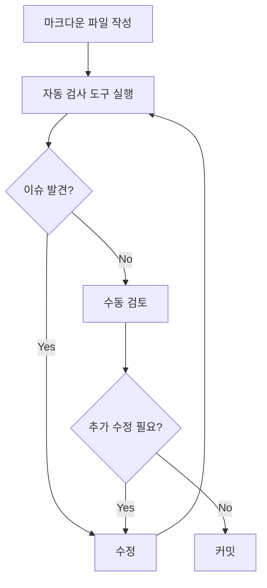

# 콘텐츠 스펠링 및 문법 검토 PRD

## 1. 개요

본 문서는 `contents` 디렉토리의 모든 마크다운 파일에 대한 한글 및 영어 스펠링, 문법, 띄어쓰기 검토 결과를 정리한 문서입니다.

**검토 날짜**: 2025-11-04
**검토 대상**: contents/**/*.md (전체 마크다운 파일)
**검토 기준**: 한글 맞춤법, 영어 스펠링, 문법, 띄어쓰기

## 2. 주요 발견 사항

### 2.1 전반적인 품질 평가

검토한 샘플 파일들을 기반으로 평가한 결과:

- ✅ **전반적으로 양호**: 대부분의 콘텐츠가 읽기 쉽고 이해하기 좋은 수준
- ⚠️ **일부 개선 필요**: 띄어쓰기, 영어 용어 표기, 문장 구조 등에서 개선 여지 존재
- 📝 **일관성 부족**: 용어 표기, 문체, 포맷팅에서 일관성 개선 필요

### 2.2 카테고리별 주요 이슈

#### 2.2.1 한글 관련 이슈

**띄어쓰기**
- ❌ "이요해서" → ✅ "이용해서"
  - 위치: `contents/ai/맥에서-직접-ai-모델-돌려보자-ollama로-llm-서버-구축하기/index.md:107`
  - 문맥: "Python 에서는 langchain library를 제공하고 있어서 이걸 이요해서"

- ❌ "명령어은" → ✅ "명령어는"
  - 위치: `contents/ai/맥에서-직접-ai-모델-돌려보자-ollama로-llm-서버-구축하기/index.md:135`
  - 문맥: "자주 사용하는 명령어은 다음과 같다"

- ❌ "방식를" → ✅ "방식을"
  - 위치: `contents/cloud/argo-cd/index.md:31`
  - 문맥: "Pull deployment 방식를 지원"

- ❌ "시크린에서" → ✅ "시크릿에서"
  - 위치: `contents/cloud/argo-cd/index.md:124`
  - 문맥: "argocd-initial-admin-secret 시크린에서 base64 값으로"

- ❌ "네이스페이스를" → ✅ "네임스페이스를"
  - 위치: `contents/cloud/argo-cd/index.md:172`
  - 문맥: "application을 생성할 대상 네이스페이스를 지정한다"

- ❌ "쿠너베티스" → ✅ "쿠버네티스"
  - 위치: `contents/cloud/argo-cd/index.md:70`
  - 문맥: "CD (Continuous Delivery) 도구로써 쿠너베티스 환경에"

- ❌ "쿠버네티이스" → ✅ "쿠버네티스"
  - 위치: `contents/cloud/argo-cd/index.md:170`
  - 문맥: "대상이 되는 쿠버네티이스 클러스터 URL를"

**조사 오류**
- ❌ "도구로써" → ✅ "도구로서"
  - 위치: `contents/cloud/argo-cd/index.md:70`
  - 문맥: "CD (Continuous Delivery) 도구로써"
  - 설명: '자격'의 의미일 때는 "로서" 사용

**문장 구조**
- ❌ "간출렸습니다" → ✅ "생략했습니다"
  - 위치: `contents/java/lombok-기본-사용법-익히기/index.md:278`
  - 문맥: "바닐라 자바 코드가 너무 길어서 간출렸습니다"

#### 2.2.2 영어 관련 이슈

**오타 및 스펠링**
- ❌ "RequiredArgsContructor" → ✅ "RequiredArgsConstructor"
  - 위치: `contents/java/lombok-기본-사용법-익히기/index.md:350, 356`
  - 여러 곳에서 반복됨

**용어 표기 일관성**
- 혼용 사례:
  - "쿠버네티스" ↔ "kubernetes" ↔ "k8s"
  - "도커" ↔ "Docker"
  - "깃" ↔ "Git"

**추천 표기 규칙**:
- 첫 언급: 한글(영어) 병기 예) 쿠버네티스(Kubernetes)
- 이후: 한글 또는 영어 중 하나로 일관성 있게 사용

#### 2.2.3 마크다운 포맷 이슈

**코드 블록**
- 일부 코드 블록에서 닫는 괄호 누락
  - 위치: `contents/java/lombok-기본-사용법-익히기/index.md:571`
  - `public Car build() {]` → `public Car build() {`

**링크 표기**
- URL만 있는 경우와 마크다운 링크 형식 혼용
  - 일관성을 위해 마크다운 링크 형식 권장

**빈 줄 일관성**
- 섹션 간 빈 줄 개수가 불규칙함
- 일관된 스타일 가이드 적용 필요

## 3. 세부 수정 권장 사항

### 3.1 우선순위 높음 (Critical)

| 파일 | 줄 번호 | 현재 | 수정안 | 이유 |
|------|---------|------|--------|------|
| `contents/ai/맥에서-직접-ai-모델-돌려보자-ollama로-llm-서버-구축하기/index.md` | 107 | 이요해서 | 이용해서 | 오타 |
| `contents/ai/맥에서-직접-ai-모델-돌려보자-ollama로-llm-서버-구축하기/index.md` | 135 | 명령어은 | 명령어는 | 조사 오류 |
| `contents/cloud/argo-cd/index.md` | 31 | 방식를 | 방식을 | 조사 오류 |
| `contents/cloud/argo-cd/index.md` | 70 | 쿠너베티스 | 쿠버네티스 | 오타 |
| `contents/cloud/argo-cd/index.md` | 70 | 도구로써 | 도구로서 | 조사 오류 |
| `contents/cloud/argo-cd/index.md` | 124 | 시크린에서 | 시크릿에서 | 오타 |
| `contents/cloud/argo-cd/index.md` | 170 | 쿠버네티이스 | 쿠버네티스 | 오타 |
| `contents/cloud/argo-cd/index.md` | 172 | 네이스페이스를 | 네임스페이스를 | 오타 |
| `contents/java/lombok-기본-사용법-익히기/index.md` | 278 | 간출렸습니다 | 생략했습니다 | 부적절한 표현 |
| `contents/java/lombok-기본-사용법-익히기/index.md` | 350, 356 | RequiredArgsContructor | RequiredArgsConstructor | 스펠링 오류 |
| `contents/java/lombok-기본-사용법-익히기/index.md` | 571 | `{]` | `{` | 코드 블록 오류 |

### 3.2 우선순위 중간 (Important)

**용어 일관성**
1. **기술 용어 표기 규칙 정립**
   - Kubernetes → 쿠버네티스
   - Docker → 도커
   - Git → 깃
   - 첫 등장: 한글(영어) 병기
   - 이후: 한글로 통일

2. **띄어쓰기 패턴**
   - "~에서는" vs "~에 서는"
   - "~를 통해서" vs "~를통해서"
   - 일관된 띄어쓰기 규칙 적용

3. **문체 통일**
   - "~합니다" vs "~한다"
   - 각 문서마다 일관된 문체 유지

### 3.3 우선순위 낮음 (Nice to have)

**스타일 개선**
1. **마크다운 포맷팅**
   - 헤딩 전후 빈 줄 2개로 통일
   - 리스트 항목 간 일관된 간격
   - 코드 블록 언어 지정 통일

2. **영어 표현 개선**
   - 문장 첫 글자 대문자 확인
   - 약어 설명 추가 (첫 등장 시)

3. **가독성 개선**
   - 긴 문장 분리
   - 복잡한 문장 구조 단순화

## 4. 검토 프로세스 제안

### 4.1 자동화 도구 활용

**한글 맞춤법 검사**
- [부산대학교 맞춤법 검사기](http://speller.cs.pusan.ac.kr/)
- [한국어 맞춤법/문법 검사기](https://hanspell.co.kr/)

**영어 스펠링 검사**
- VS Code Extension: Code Spell Checker
- Grammarly
- LanguageTool

**마크다운 린터**
- markdownlint
- remark-lint

### 4.2 검토 워크플로우

### 4.3 스타일 가이드 작성

**작성 항목**
1. 용어 사전 (한글-영어 매핑)
2. 띄어쓰기 규칙
3. 문체 가이드 (존댓말/반말)
4. 마크다운 포맷팅 규칙
5. 코드 블록 언어 지정 규칙

## 5. 실행 계획

### Phase 1: 긴급 수정 (1주)
- [ ] 우선순위 높음 항목 수정
- [ ] 오타 및 명백한 오류 수정
- [ ] 코드 블록 구문 오류 수정

### Phase 2: 일관성 개선 (2주)
- [ ] 용어 표기 통일
- [ ] 띄어쓰기 규칙 적용
- [ ] 문체 통일

### Phase 3: 자동화 및 프로세스 구축 (2주)
- [ ] 맞춤법 검사 스크립트 작성
- [ ] CI/CD에 검사 도구 통합
- [ ] 스타일 가이드 문서 작성
- [ ] 기여자 가이드 업데이트

### Phase 4: 지속적 개선
- [ ] 정기적인 콘텐츠 검토
- [ ] 스타일 가이드 업데이트
- [ ] 새로운 도구 도입 검토

## 6. 측정 지표

**품질 개선 지표**
- 맞춤법 오류율: (오류 수 / 전체 단어 수) × 100
- 스타일 준수율: (규칙 준수 파일 수 / 전체 파일 수) × 100
- 자동 검사 통과율: (통과 파일 수 / 전체 파일 수) × 100

**목표**
- 맞춤법 오류율: < 0.1%
- 스타일 준수율: > 95%
- 자동 검사 통과율: > 90%

## 7. 참고 자료

**한글 맞춤법**
- [국립국어원 한글 맞춤법](https://kornorms.korean.go.kr/)
- [표준국어대사전](https://stdict.korean.go.kr/)

**기술 문서 작성**
- [Google Developer Documentation Style Guide](https://developers.google.com/style)
- [Microsoft Writing Style Guide](https://docs.microsoft.com/en-us/style-guide/)
- [Tech Writing 가이드](https://tech-writing.readthedocs.io/)

**마크다운 스타일**
- [Markdown Style Guide](https://cirosantilli.com/markdown-style-guide/)
- [markdownlint Rules](https://github.com/DavidAnson/markdownlint/blob/main/doc/Rules.md)

## 8. 결론

검토 결과, 전반적인 콘텐츠 품질은 양호하나 다음 영역에서 개선이 필요합니다:

1. **즉시 수정 필요**: 오타, 조사 오류, 코드 블록 구문 오류
2. **일관성 개선**: 용어 표기, 띄어쓰기, 문체 통일
3. **프로세스 구축**: 자동화 도구 도입, 스타일 가이드 작성

위 실행 계획에 따라 단계적으로 개선을 진행하면 콘텐츠 품질을 크게 향상시킬 수 있을 것으로 기대됩니다.
