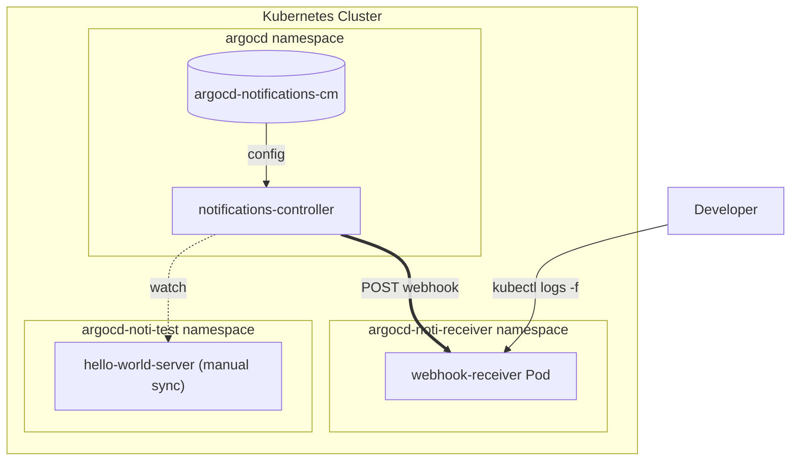

## 1. 개요

`ArgoCD`로 여러 애플리케이션을 GitOps로 관리하다 보면 어느 시점에 이런 요구가 생긴다.

> "git에 변경이 들어왔는데 sync가 안 됐거나, 누가 클러스터를 직접 바꿔서 drift가 생겼을 때 즉시 알림을 받고 싶다."

`ArgoCD`는 이런 알림을 위한 [`ArgoCD Notifications`](https://argo-cd.readthedocs.io/en/stable/operator-manual/notifications/) 기능을 제공한다. 공식 가이드는 보통 "argo-cd `Helm chart`의 `notifications` 섹션을 켜라"식으로 안내한다.

문제는, **이미 운영 중인 `ArgoCD`** 다. `Helm release`를 재배포하는 건 운영팀에게 부담이고, 알림 같은 부가 기능 때문에 controller가 잠깐이라도 재기동되는 건 피하고 싶다.

이 글에서는 `ArgoCD` 자체는 건드리지 않고, 알림 설정만 **별도의 `Helm chart`로 분리**해서 `ArgoCD Application`으로 sync하는 패턴을 다룬다. `OutOfSync`/`Sync Failed`/`Health Degraded` 세 가지 trigger를 webhook으로 받아 `kubectl logs`로 확인하는 로컬 테스트 환경을 구축한다.

전체 구성은 다음과 같다.

전체 코드는 [argocd-charts-sample](https://github.com/kenshin579/argocd-charts-sample) 레포의 [PR #13](https://github.com/kenshin579/argocd-charts-sample/pull/13)에서 확인할 수 있다.
