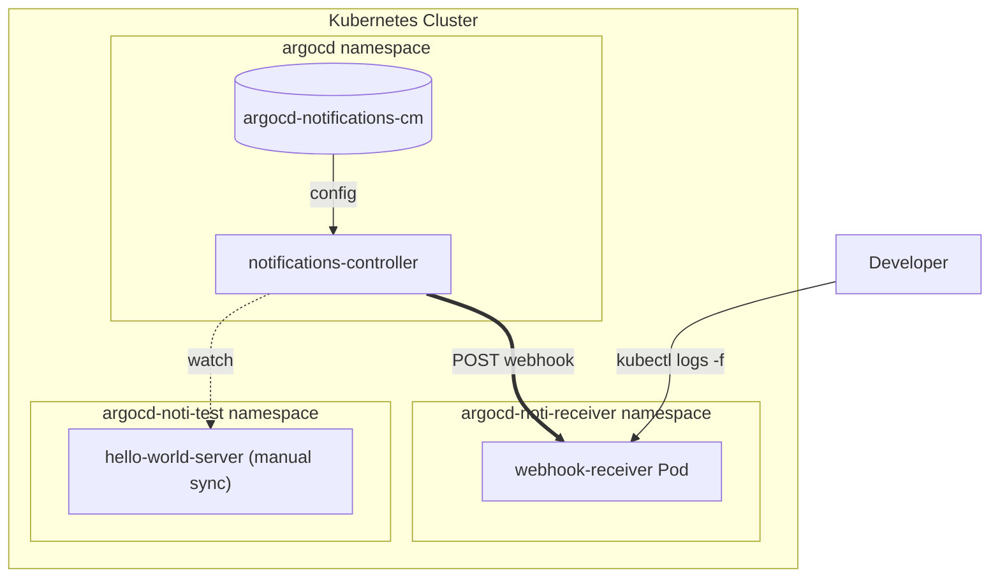
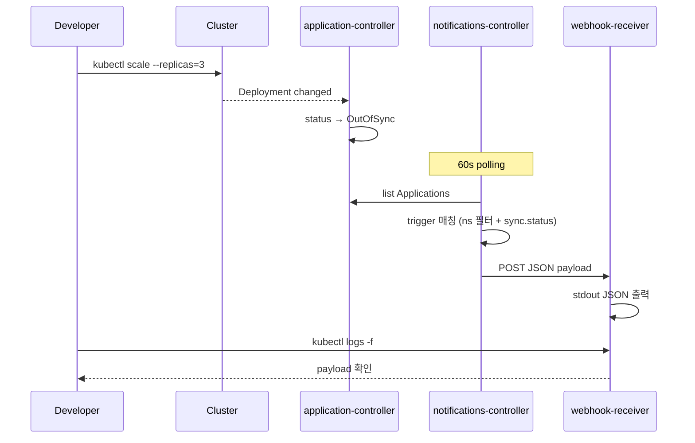

## 1. 개요

`ArgoCD`로 여러 애플리케이션을 GitOps로 관리하다 보면 어느 시점에 이런 요구가 생긴다.

> "git에 변경이 들어왔는데 sync가 안 됐거나, 누가 클러스터를 직접 바꿔서 drift가 생겼을 때 즉시 알림을 받고 싶다."

`ArgoCD`는 이런 알림을 위한 [`ArgoCD Notifications`](https://argo-cd.readthedocs.io/en/stable/operator-manual/notifications/) 기능을 제공한다. 공식 가이드는 보통 "argo-cd `Helm chart`의 `notifications` 섹션을 켜라"식으로 안내한다.

문제는, **이미 운영 중인 `ArgoCD`** 다. `Helm release`를 재배포하는 건 운영팀에게 부담이고, 알림 같은 부가 기능 때문에 controller가 잠깐이라도 재기동되는 건 피하고 싶다.

이 글에서는 `ArgoCD` 자체는 건드리지 않고, 알림 설정만 **별도의 `Helm chart`로 분리**해서 `ArgoCD Application`으로 sync하는 패턴을 다룬다. `OutOfSync`/`Sync Failed`/`Health Degraded` 세 가지 trigger를 webhook으로 받아 `kubectl logs`로 확인하는 로컬 테스트 환경을 구축한다.

전체 구성은 다음과 같다.



전체 코드는 [argocd-charts-sample](https://github.com/kenshin579/argocd-charts-sample) 레포의 [PR #13](https://github.com/kenshin579/argocd-charts-sample/pull/13)에서 확인할 수 있다.

## 2. ArgoCD Notifications 개념

`ArgoCD Notifications`는 별도의 `notifications-controller` Pod이 `Application` 리소스를 60초마다 polling하면서 미리 정의한 조건에 맞으면 외부로 알림을 보내는 구조다. 다음 4가지 빌딩 블록으로 동작한다.

| 빌딩 블록 | 역할 |
| --- | --- |
| **Trigger** | 언제 알림을 보낼지 — `expr-lang` 표현식으로 `Application` 상태를 평가 |
| **Template** | 무엇을 보낼지 — webhook body, Slack message body 등 |
| **Service** | 어디로 보낼지 — webhook URL, Slack token 등 |
| **Subscription** | 누가 받을지 — `Application` annotation 또는 `argocd-notifications-cm`의 default subscription |

기본적으로 [Notifications Catalog](https://argo-cd.readthedocs.io/en/stable/operator-manual/notifications/catalog/)에 다음과 같은 trigger가 미리 정의되어 있다.

| Trigger | 발생 조건 |
| --- | --- |
| `on-sync-succeeded` | Sync 작업 성공 |
| `on-sync-failed` | Sync 작업 실패 (manifest 오류, RBAC 등) |
| `on-sync-running` | Sync 시작 |
| `on-sync-status-unknown` | Sync 상태 판정 불가 |
| `on-deployed` | 성공 sync + Healthy 진입 |
| `on-health-degraded` | Pod 비정상 (CrashLoopBackOff, ImagePullBackOff 등) |
| `on-created` / `on-deleted` | Application CR 생성/삭제 |

여기서 한 가지 중요한 사실: **`OutOfSync` 전용 trigger는 카탈로그에 없다.** 가장 비슷한 게 `on-sync-status-unknown` 정도라서, drift 알림이 필요하면 직접 trigger를 작성해야 한다.

알림이 발생하는 흐름을 정리하면 다음과 같다.



여기서 한 가지 더 주목할 점은 polling 주기다. `notifications-controller`는 60초마다 한 번씩 `Application` 상태를 본다. 즉 알림은 항상 **이벤트 발생 후 ~60초 이내**에 도착한다. 더 자주 보고 싶다면 controller 옵션 변경이 필요하다.

## 3. 운영 환경에서의 문제와 디자인 결정

가장 표준적인 방법은 `argo-cd Helm chart`의 `notifications` subchart를 활용하는 것이다. 보통 이렇게 한다.

```yaml
# argo-cd Helm release values
notifications:
  triggers:
    trigger.on-sync-status-out-of-sync: |
      - when: app.status.sync.status == 'OutOfSync'
        send: [app-out-of-sync]
  templates:
    template.app-out-of-sync: |
      ...
```

문제는 운영 환경이다. 이미 트래픽을 처리 중인 `ArgoCD`를 알림 추가만 하려고 `Helm release` 재배포하는 것은 운영팀에게 부담이고, controller pod이 재기동되는 짧은 순간에 in-flight sync가 영향받을 수 있다.

그래서 알림 설정을 **`ArgoCD` 본체와 분리해서 GitOps로 관리**하는 게 안전하다. 4가지 옵션을 비교했다.

| 옵션 | 설명 | 장단점 |
| --- | --- | --- |
| **A. argo-cd Helm release values 추가** | `notifications` 섹션을 values에 추가 후 `Helm release` 업그레이드 | 표준. 운영 환경에선 재배포 필요 |
| **B. Raw manifest** | `argocd-notifications-cm`을 yaml 파일로 git에 두고 ArgoCD Application으로 sync | Helm escape 불필요, 단순. 단일 환경엔 적합 |
| **C. 별도 Helm chart + ArgoCD Application** | 알림 설정을 자체 chart로 만들고 `ArgoCD Application`으로 sync | environments별 `values` 분리 가능, 가장 유연 |
| **D. App of Apps** | 알림 설정 chart를 root Application이 sync | C와 비슷, 부트스트랩 더 복잡 |

이 글에서는 **옵션 C**(별도 Helm chart)로 갔다. 핵심 트릭은 다음 한 줄이다.

```yaml
syncOptions:
  - ServerSideApply=true
```

`argo-cd Helm chart`가 이미 `argocd-notifications-cm` 과 `argocd-notifications-secret`을 만들어둔 상태에서, `ArgoCD Application`이 같은 이름의 ConfigMap을 sync하면 충돌이 난다. `ServerSideApply=true`는 field-level merge를 활성화해서 **기존 Helm 관리 ConfigMap의 ownership을 우리 Application이 인수**하게 한다. 우리는 trigger/template/service 키만 추가하면 되고, Helm이 만든 빈 키들은 그대로 둔다.

이 디자인의 핵심 결정을 정리하면:

| 결정 | 이유 |
| --- | --- |
| 알림 설정을 별도 Helm chart로 분리 | 운영 중인 `ArgoCD` 재배포 없이 적용 |
| `ServerSideApply=true` syncOption | 기존 ConfigMap의 ownership을 field-level merge로 인수 |
| webhook receiver를 별도 namespace로 격리 | 자기 자신이 알림 대상이 되는 것 방지 + 책임 분리 |
| `OutOfSync` 알림은 커스텀 trigger 작성 | 카탈로그에 없음 (`on-sync-status-unknown` 만 가장 비슷) |
| `automated` 제거 (테스트 대상 ApplicationSet) | manual sync 모드로 OutOfSync가 의미 있게 발생하도록 |

## 4. 알림 설정 chart 작성

알림 설정 `Helm chart`의 디렉토리 구조다.

```
chart/argocd-notifications-config/
├── Chart.yaml
├── values.yaml
└── templates/
    ├── cm.yaml             # argocd-notifications-cm
    └── secret.yaml         # argocd-notifications-secret (빈 secret)
```

`values.yaml`에는 환경에 따라 바뀔 수 있는 3가지 변수만 노출한다.

```yaml
# webhook receiver의 cluster-internal URL
webhookUrl: http://webhook-receiver.argocd-noti-receiver.svc.cluster.local

# 알림 trigger에 적용할 destination namespace 필터
targetNamespace: argocd-noti-test

# template body에 포함되는 ArgoCD UI base URL
argocdUrl: https://argocd-server.argocd.svc.cluster.local
```

핵심은 `templates/cm.yaml`의 trigger 정의다. 3개 trigger를 모두 `targetNamespace` 필터로 격리한다.

```yaml
data:
  trigger.on-sync-status-out-of-sync: |
    - when: |
        app.spec.destination.namespace == '{{ .Values.targetNamespace }}' &&
        app.status.sync.status == 'OutOfSync'
      send: [app-out-of-sync]
      oncePer: app.status.sync.revision

  trigger.on-sync-failed: |
    - when: |
        app.spec.destination.namespace == '{{ .Values.targetNamespace }}' &&
        app.status.operationState.phase in ['Error', 'Failed']
      send: [app-sync-failed]
      oncePer: app.status.operationState.startedAt

  trigger.on-health-degraded: |
    - when: |
        app.spec.destination.namespace == '{{ .Values.targetNamespace }}' &&
        app.status.health.status == 'Degraded'
      send: [app-health-degraded]
```

여기서 `oncePer` 정책을 trigger마다 다르게 설정했다.

- **OutOfSync**: `revision` 단위로 1회 — 같은 drift 상태가 60초 cycle마다 반복 알림되는 것 방지
- **Sync Failed**: `startedAt` 단위로 1회 — 같은 sync 시도 중복 알림 방지
- **Health Degraded**: 별도 `oncePer` 없음 — `Healthy → Degraded` 상태 전이 시점에만 1회

template 중 `app-out-of-sync` 하나만 발췌한다 (나머지 두 template은 동일한 webhook 구조에 강조하는 필드만 다름).

```yaml
template.app-out-of-sync: |
  webhook:
    local-receiver:
      method: POST
      body: |
        {
          "event": "argocd.out-of-sync",
          "severity": "info",
          "timestamp": "{{`{{ (call .time.Now).Format "2006-01-02T15:04:05Z07:00" }}`}}",
          "application": {
            "name": "{{`{{.app.metadata.name}}`}}",
            "namespace": "{{`{{.app.spec.destination.namespace}}`}}"
          },
          "sync": {
            "status": "{{`{{.app.status.sync.status}}`}}",
            "revision": "{{`{{.app.status.sync.revision}}`}}"
          },
          "argocdUrl": "{{ .Values.argocdUrl }}/applications/{{`{{.app.metadata.name}}`}}"
        }
```

여기서 `{{`...`}}` 패턴이 자주 나오는 이유가 중요하다. **`Helm template` 안에 `ArgoCD Notifications template`이 중첩**되어 있다. Helm은 `{{ ... }}`를 자기 변수로 해석하지만, 우리는 `{{.app.metadata.name}}` 같은 표현이 그대로 ConfigMap에 들어가서 런타임에 `notifications-controller`가 처리하기를 원한다. backtick으로 감싸면 (`{{`...`}}`) Helm이 그 부분을 그대로 출력한다. 결과적으로 **3개 변수만 Helm이 치환**하고 나머지는 모두 controller가 처리한다.

마지막으로 service와 default subscription이다.

```yaml
service.webhook.local-receiver: |
  url: {{ .Values.webhookUrl }}
  headers:
  - name: Content-Type
    value: application/json

subscriptions: |
  - recipients:
    - webhook:local-receiver
    triggers:
    - on-sync-status-out-of-sync
    - on-sync-failed
    - on-health-degraded
```

`subscriptions`는 **default subscription**이라 모든 `Application`이 자동으로 구독한다. 다른 namespace의 Application도 구독은 하지만 위 trigger의 `when` 조건이 false라서 알림이 가지 않는다. 즉 **trigger 표현식이 namespace 필터링을 담당**하는 구조다.

`secret.yaml`은 거의 비어 있다.

```yaml
apiVersion: v1
kind: Secret
metadata:
  name: argocd-notifications-secret
  namespace: argocd
type: Opaque
data: {}
```

이 빈 secret이 필요한 이유는 ConfigMap과 동일하게 **`ServerSideApply`로 ownership을 인수**하기 위함이다. 향후 Slack token이나 Email 비밀번호를 추가할 때 이 secret에 키만 넣으면 된다.

전체 chart 코드는 [GitHub에서 확인](https://github.com/kenshin579/argocd-charts-sample/tree/main/chart/argocd-notifications-config)할 수 있다.

## 5. webhook receiver + 부트스트랩

webhook을 받아서 stdout에 JSON으로 출력해주는 단순한 수신 서버가 필요하다. [`mendhak/http-https-echo`](https://github.com/mendhak/docker-http-https-echo) 이미지를 활용하면 별도 코드 작성 없이 `Deployment` + `Service`만으로 끝난다.

```yaml
# chart/webhook-receiver/templates/deployment.yaml (발췌)
spec:
  containers:
    - name: webhook-receiver
      image: "mendhak/http-https-echo:37"
      # mendhak/http-https-echo 환경변수
      # - HTTP_PORT: 컨테이너 listen 포트 (Service targetPort와 일치)
      # - LOG_WITHOUT_NEWLINE=false: 페이로드 사이 개행 유지 → kubectl logs 가독성
      env:
        - name: HTTP_PORT
          value: "8080"
        - name: LOG_WITHOUT_NEWLINE
          value: "false"
      ports:
        - containerPort: 8080
```

이 receiver는 의도적으로 **`argocd-noti-receiver`라는 별도 namespace**에 배포한다. 알림 테스트 대상 앱은 `argocd-noti-test` namespace에 있고, trigger 표현식이 `destination.namespace == 'argocd-noti-test'`로 필터링하기 때문에, receiver를 같은 namespace에 두면 receiver Application 자기 자신도 알림 대상이 되어버린다. namespace를 분리해서 책임을 깔끔히 가른다.

이제 부트스트랩을 한 파일로 묶는다. 두 `Application`(receiver chart sync용 + 알림 설정 chart sync용)을 multi-doc YAML로 한 번에 정의한다.

```yaml
# bootstrap/notifications.yaml
---
apiVersion: argoproj.io/v1alpha1
kind: Application
metadata:
  name: webhook-receiver
  namespace: argocd
spec:
  source:
    repoURL: https://github.com/kenshin579/argocd-charts-sample
    targetRevision: HEAD
    path: chart/webhook-receiver
    helm:
      valueFiles: [values.yaml]
  destination:
    server: https://kubernetes.default.svc
    namespace: argocd-noti-receiver
  syncPolicy:
    automated: { prune: true, selfHeal: true }
    syncOptions:
      - CreateNamespace=true
---
apiVersion: argoproj.io/v1alpha1
kind: Application
metadata:
  name: argocd-notifications-config
  namespace: argocd
spec:
  source:
    repoURL: https://github.com/kenshin579/argocd-charts-sample
    targetRevision: HEAD
    path: chart/argocd-notifications-config
    helm:
      valueFiles: [values.yaml]
  destination:
    server: https://kubernetes.default.svc
    namespace: argocd
  syncPolicy:
    automated: { prune: true, selfHeal: true }
    syncOptions:
      # argo-cd Helm chart가 이미 만든 cm/secret의 ownership을 인수
      - ServerSideApply=true
```

두 `Application`의 `syncOptions` 차이가 핵심이다.
- `webhook-receiver` → `CreateNamespace=true` (새 namespace `argocd-noti-receiver` 생성)
- `argocd-notifications-config` → `ServerSideApply=true` (기존 cm/secret ownership 인수)

테스트 대상 앱(`hello-world-server`)은 별도 `ApplicationSet`으로 배포하는데, `automated`를 의도적으로 제거했다. `automated.selfHeal: true`로 두면 drift가 발생하자마자 `ArgoCD`가 즉시 복구해서 `OutOfSync` 상태가 거의 발생하지 않기 때문이다. 알림을 검증하려면 `OutOfSync` 상태가 어느 정도 유지되어야 한다. ApplicationSet 매니페스트는 [GitHub](https://github.com/kenshin579/argocd-charts-sample/blob/main/bootstrap/application-set/appset-noti-test.yaml)에서 확인할 수 있다.

설치는 두 줄이다.

```bash
kubectl apply -f bootstrap/notifications.yaml
kubectl apply -f bootstrap/application-set/appset-noti-test.yaml
```

`ArgoCD`가 두 chart를 sync하면서 `argocd-noti-receiver`/`argocd-noti-test` namespace를 자동 생성하고 알림 설정도 활성화된다.
