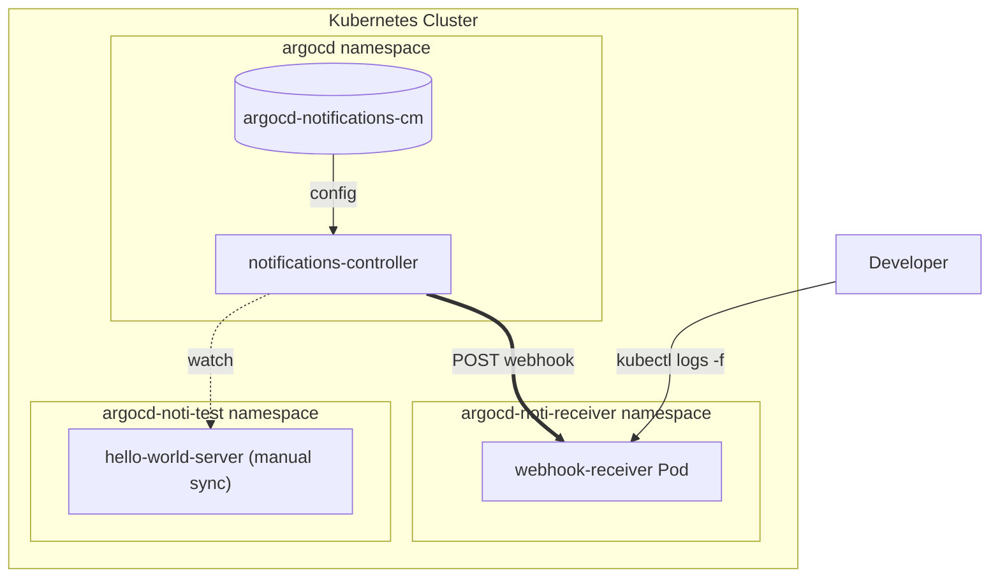
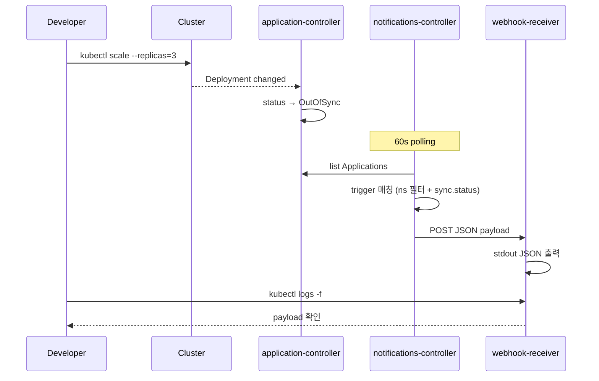

## 1. 개요

`ArgoCD`로 여러 애플리케이션을 GitOps로 관리하다 보면 어느 시점에 이런 요구가 생긴다.

> "git에 변경이 들어왔는데 sync가 안 됐거나, 누가 클러스터를 직접 바꿔서 drift가 생겼을 때 즉시 알림을 받고 싶다."

`ArgoCD`는 이런 알림을 위한 [`ArgoCD Notifications`](https://argo-cd.readthedocs.io/en/stable/operator-manual/notifications/) 기능을 제공한다. 공식 가이드는 보통 "argo-cd `Helm chart`의 `notifications` 섹션을 켜라"식으로 안내한다.

문제는, **이미 운영 중인 `ArgoCD`** 다. `Helm release`를 재배포하는 건 운영팀에게 부담이고, 알림 같은 부가 기능 때문에 controller가 잠깐이라도 재기동되는 건 피하고 싶다.

이 글에서는 `ArgoCD` 자체는 건드리지 않고, 알림 설정만 **별도의 `Helm chart`로 분리**해서 `ArgoCD Application`으로 sync하는 패턴을 다룬다. `OutOfSync`/`Sync Failed`/`Health Degraded` 세 가지 trigger를 webhook으로 받아 `kubectl logs`로 확인하는 로컬 테스트 환경을 구축한다.

전체 구성은 다음과 같다.



전체 코드는 [argocd-charts-sample](https://github.com/kenshin579/argocd-charts-sample) 레포의 [PR #13](https://github.com/kenshin579/argocd-charts-sample/pull/13)에서 확인할 수 있다.

## 2. ArgoCD Notifications 개념

`ArgoCD Notifications`는 별도의 `notifications-controller` Pod이 `Application` 리소스를 60초마다 polling하면서 미리 정의한 조건에 맞으면 외부로 알림을 보내는 구조다. 다음 4가지 빌딩 블록으로 동작한다.

| 빌딩 블록 | 역할 |
| --- | --- |
| **Trigger** | 언제 알림을 보낼지 — `expr-lang` 표현식으로 `Application` 상태를 평가 |
| **Template** | 무엇을 보낼지 — webhook body, Slack message body 등 |
| **Service** | 어디로 보낼지 — webhook URL, Slack token 등 |
| **Subscription** | 누가 받을지 — `Application` annotation 또는 `argocd-notifications-cm`의 default subscription |

기본적으로 [Notifications Catalog](https://argo-cd.readthedocs.io/en/stable/operator-manual/notifications/catalog/)에 다음과 같은 trigger가 미리 정의되어 있다.

| Trigger | 발생 조건 |
| --- | --- |
| `on-sync-succeeded` | Sync 작업 성공 |
| `on-sync-failed` | Sync 작업 실패 (manifest 오류, RBAC 등) |
| `on-sync-running` | Sync 시작 |
| `on-sync-status-unknown` | Sync 상태 판정 불가 |
| `on-deployed` | 성공 sync + Healthy 진입 |
| `on-health-degraded` | Pod 비정상 (CrashLoopBackOff, ImagePullBackOff 등) |
| `on-created` / `on-deleted` | Application CR 생성/삭제 |

여기서 한 가지 중요한 사실: **`OutOfSync` 전용 trigger는 카탈로그에 없다.** 가장 비슷한 게 `on-sync-status-unknown` 정도라서, drift 알림이 필요하면 직접 trigger를 작성해야 한다.

알림이 발생하는 흐름을 정리하면 다음과 같다.



여기서 한 가지 더 주목할 점은 polling 주기다. `notifications-controller`는 60초마다 한 번씩 `Application` 상태를 본다. 즉 알림은 항상 **이벤트 발생 후 ~60초 이내**에 도착한다. 더 자주 보고 싶다면 controller 옵션 변경이 필요하다.

## 3. 운영 환경에서의 문제와 디자인 결정

가장 표준적인 방법은 `argo-cd Helm chart`의 `notifications` subchart를 활용하는 것이다. 보통 이렇게 한다.

```yaml
# argo-cd Helm release values
notifications:
  triggers:
    trigger.on-sync-status-out-of-sync: |
      - when: app.status.sync.status == 'OutOfSync'
        send: [app-out-of-sync]
  templates:
    template.app-out-of-sync: |
      ...
```

문제는 운영 환경이다. 이미 트래픽을 처리 중인 `ArgoCD`를 알림 추가만 하려고 `Helm release` 재배포하는 것은 운영팀에게 부담이고, controller pod이 재기동되는 짧은 순간에 in-flight sync가 영향받을 수 있다.

그래서 알림 설정을 **`ArgoCD` 본체와 분리해서 GitOps로 관리**하는 게 안전하다. 4가지 옵션을 비교했다.

| 옵션 | 설명 | 장단점 |
| --- | --- | --- |
| **A. argo-cd Helm release values 추가** | `notifications` 섹션을 values에 추가 후 `Helm release` 업그레이드 | 표준. 운영 환경에선 재배포 필요 |
| **B. Raw manifest** | `argocd-notifications-cm`을 yaml 파일로 git에 두고 ArgoCD Application으로 sync | Helm escape 불필요, 단순. 단일 환경엔 적합 |
| **C. 별도 Helm chart + ArgoCD Application** | 알림 설정을 자체 chart로 만들고 `ArgoCD Application`으로 sync | environments별 `values` 분리 가능, 가장 유연 |
| **D. App of Apps** | 알림 설정 chart를 root Application이 sync | C와 비슷, 부트스트랩 더 복잡 |

이 글에서는 **옵션 C**(별도 Helm chart)로 갔다. 핵심 트릭은 다음 한 줄이다.

```yaml
syncOptions:
  - ServerSideApply=true
```

`argo-cd Helm chart`가 이미 `argocd-notifications-cm` 과 `argocd-notifications-secret`을 만들어둔 상태에서, `ArgoCD Application`이 같은 이름의 ConfigMap을 sync하면 충돌이 난다. `ServerSideApply=true`는 field-level merge를 활성화해서 **기존 Helm 관리 ConfigMap의 ownership을 우리 Application이 인수**하게 한다. 우리는 trigger/template/service 키만 추가하면 되고, Helm이 만든 빈 키들은 그대로 둔다.

이 디자인의 핵심 결정을 정리하면:

| 결정 | 이유 |
| --- | --- |
| 알림 설정을 별도 Helm chart로 분리 | 운영 중인 `ArgoCD` 재배포 없이 적용 |
| `ServerSideApply=true` syncOption | 기존 ConfigMap의 ownership을 field-level merge로 인수 |
| webhook receiver를 별도 namespace로 격리 | 자기 자신이 알림 대상이 되는 것 방지 + 책임 분리 |
| `OutOfSync` 알림은 커스텀 trigger 작성 | 카탈로그에 없음 (`on-sync-status-unknown` 만 가장 비슷) |
| `automated` 제거 (테스트 대상 ApplicationSet) | manual sync 모드로 OutOfSync가 의미 있게 발생하도록 |
