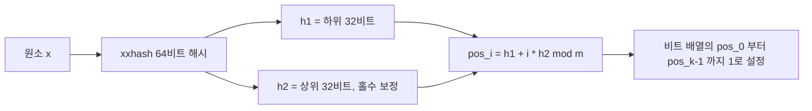
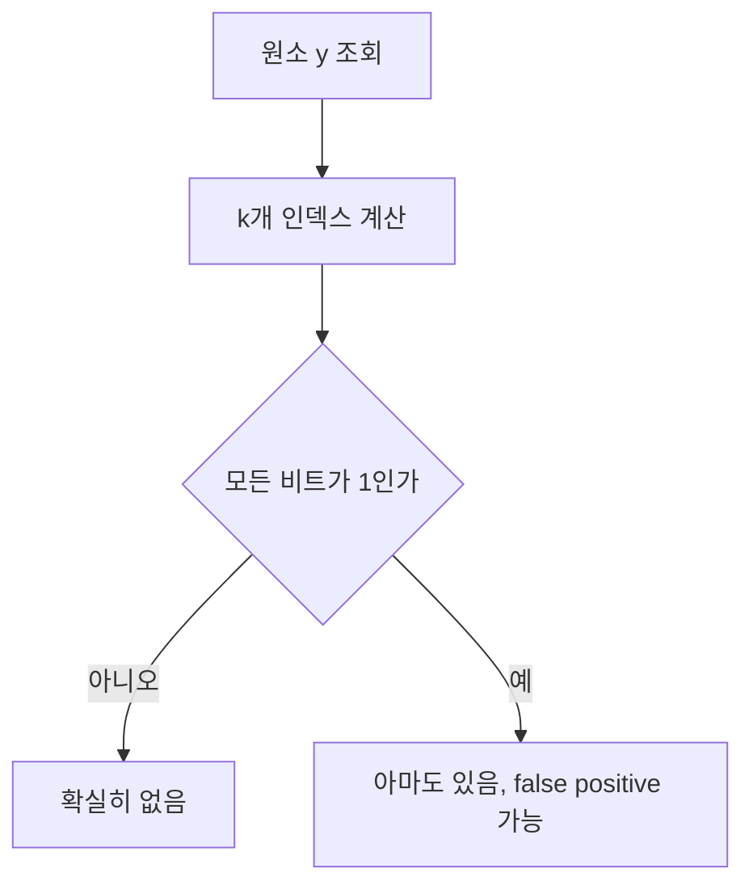

# 1. 개요

## 1.1 Bloom Filter란

Bloom Filter는 "이 원소가 집합에 있는가"라는 질문 하나만 답하는 확률적 자료구조다. 1970년 Burton Bloom이 제안했고, 지금은 데이터베이스와 캐시 계층 곳곳에 들어가 있다.

특징은 원소 자체를 저장하지 않는다는 점이다. 원소를 해시해서 얻은 위치의 비트만 1로 세워 두고, 원소는 버린다. 그래서 필터를 아무리 뒤져도 무엇이 들어 있는지 열거할 수 없고, 넣은 원소를 다시 꺼낼 수도 없다. 남는 것은 비트 배열뿐이다.

지원하는 연산도 두 개다.

| 연산 | 설명 |
|------|------|
| `Add(x)` | 원소 x에 해당하는 비트들을 1로 세운다 |
| `Contains(x)` | x가 있을 수 있는지 판정한다. false면 확실히 없고, true면 있을 수도 있다 |

삭제도, 순회도, 값 조회도 없다. 할 수 있는 것을 이렇게까지 줄인 대가로 메모리를 크게 아낀다.

## 1.2 왜 필요한가

크롤러가 같은 페이지를 두 번 긁지 않으려면 방문한 URL을 기억해야 한다. 가장 먼저 떠오르는 선택은 `map[string]struct{}`다. 정확하고 코드도 짧다.

```go
visited := make(map[string]struct{})
visited[url] = struct{}{}
if _, ok := visited[url]; ok {
    // 이미 방문함
}
```

문제는 이 map이 URL 문자열 전체를 계속 들고 있어야 한다는 것이다. 힙 사용량은 원소 수 × (URL 길이 + map 내부 오버헤드)로 늘어난다. 실제 URL은 쿼리 파라미터까지 붙으면 100자를 넘는 경우가 흔하고, 원소가 수백만 개가 되면 이 비용이 전체 메모리를 지배한다.

Bloom Filter는 "이미 방문했다"는 판정이 가끔 틀려도 되는 상황을 전제로 이 비용을 없앤다. URL 문자열을 보관하지 않고 원소당 10비트 미만만 남긴다. 오차 1%를 허용하면 원소 하나당 9.59비트로 충분하다(3.3절). 이 값이 원소 크기와 무관하게 고정이라는 점이 핵심이다. URL이 20자든 200자든 필터 크기는 같다.

절약폭이 실제로 얼마인지는 3.4절에서 실측으로 확인한다.

## 1.3 확률적 자료구조: false positive는 있고 false negative는 없다

Bloom Filter가 "확률적"인 이유는 판정이 한쪽 방향으로만 틀리기 때문이다.

| 오류 유형 | 의미 | Bloom Filter |
|-----------|------|--------------|
| false positive | 넣지 않은 원소를 있다고 답함 | 발생한다 |
| false negative | 넣은 원소를 없다고 답함 | 발생하지 않는다 |

`Contains`가 false를 반환하면 그 원소는 확실히 넣은 적이 없다. true를 반환하면 두 가지 경우가 섞여 있다. 실제로 넣었거나, 다른 원소들이 우연히 그 자리 비트를 전부 세워 놨거나.

이 비대칭이 Bloom Filter를 쓸 자리를 정한다. "없음"이 확실하다는 것은, 없다고 판정된 요청에 대해 뒤쪽 저장소를 조회할 필요가 없다는 뜻이다. 있다고 나온 요청만 실제 저장소로 넘겨 확인하면 되고, false positive는 헛조회 한 번으로 끝난다. 최종 판정은 뒤쪽 저장소가 내리고, 필터는 그 앞에서 트래픽을 깎는 역할만 맡는다.

반대로 필터의 true를 최종 답으로 삼아야 하는 자리에는 쓸 수 없다. 중복 결제 차단이나 권한 검사처럼 오답의 대가가 헛조회로 끝나지 않는 판정이 여기 해당한다. 뒤에서 확인해 줄 정답 소스가 없다면 Bloom Filter 단독으로는 답을 낼 수 없다.

# 2. 동작 원리

## 2.1 비트 배열과 k개의 해시 함수

구성 요소는 두 개다. m비트짜리 비트 배열 하나, 그리고 원소를 0부터 m-1 사이의 인덱스로 매핑하는 해시 함수 k개.

이후 계속 쓰는 기호를 먼저 정리한다.

| 기호 | 의미 |
|------|------|
| m | 비트 배열의 전체 비트 수 |
| n | 필터에 넣을 원소 개수 |
| k | 해시 함수 개수 |
| p | false positive 확률 |

비트 배열은 전부 0으로 시작한다. 원소가 들어오면 k개 해시를 돌려 k개 인덱스를 얻고, 그 자리의 비트를 다룬다. Add와 Contains 모두 이 k개 인덱스를 계산하는 부분은 같고, 그 다음에 비트를 세우느냐 읽느냐만 다르다.

해시 함수를 실제로 k개 준비할 필요는 없다. 64비트 해시 하나를 계산해 하위 32비트를 h1, 상위 32비트를 h2로 삼고, `h1 + i*h2` 꼴로 k개 인덱스를 뽑아 쓰는 방법이 표준처럼 쓰인다. Kirsch-Mitzenmacher가 제안한 이중 해싱 기법으로, 독립적인 해시 k개를 쓸 때와 false positive 확률이 사실상 같다는 것이 알려져 있다. 해시 계산이 한 번으로 줄어드니 k가 커져도 조회 비용이 거의 늘지 않는다. 구현 코드는 4장에서 본다.

## 2.2 Add - 비트를 세우는 과정

Add는 k개 인덱스를 계산해 해당 비트를 전부 1로 만든다. 이미 1인 자리는 그대로 둔다. 실패하는 경우가 없고 반환값도 없다.



같은 원소를 두 번 넣어도 비트 배열의 상태는 달라지지 않는다. 서로 다른 원소가 같은 비트를 공유하는 것도 정상 동작이다. m이 유한한 이상 원소가 쌓이면 겹치는 자리가 반드시 생기고, 이 공유가 false positive의 원인이자 2.4절에서 볼 삭제 불가의 원인이다.

원소가 늘어날수록 1인 비트의 비율이 올라간다. 배열이 1로 가득 차면 모든 조회가 true를 반환하므로 필터는 아무것도 걸러내지 못하는 상태가 된다. 그래서 예상 원소 수 n을 미리 잡고 m을 그에 맞춰 정해야 한다. 이 계산이 3장의 내용이다.

## 2.3 Contains - "없다"는 확실, "있다"는 아마도

Contains는 Add와 같은 방식으로 k개 인덱스를 구한 다음, 그 자리 비트를 하나씩 확인한다. 0인 자리를 하나라도 만나면 즉시 false를 반환한다.



0을 하나라도 봤다는 것은 y를 넣은 적이 없다는 증거가 된다. y를 넣었다면 Add가 그 자리를 1로 세웠을 것이고, Bloom Filter에는 1을 0으로 되돌리는 연산이 없기 때문이다. 그래서 false는 항상 정확하다.

반대로 k개가 전부 1이어도 y를 넣었다는 증거는 되지 못한다. y와 무관한 다른 원소들이 그 k개 자리를 각각 세워 놨을 수 있다. 이 우연이 일어날 확률이 곧 false positive 확률 p이고, 3장에서 계산한다.

두 연산 모두 원소 수와 무관하게 해시 한 번과 비트 접근 k번으로 끝난다. 필터가 커져도 조회 시간은 그대로다.

## 2.4 왜 원소를 삭제할 수 없는가

원소 x와 y가 인덱스 하나를 공유하고 있다고 하자. x를 지우겠다고 x의 k개 비트를 0으로 되돌리면, 공유하던 그 자리도 함께 0이 된다. 그 순간 `Contains(y)`가 false를 반환한다. 넣은 원소를 없다고 답한 것이니 false negative가 생겼고, "없다는 답은 확실하다"는 성질이 깨진다.

이 성질이 깨지면 Bloom Filter를 쓸 이유가 사라진다. 1.3절에서 본 것처럼 false 판정이 정확하다는 전제 위에서 뒤쪽 저장소 조회를 생략하는 것이기 때문이다.

근본 원인은 비트 하나가 담을 수 있는 정보가 "세워졌다"뿐이라는 데 있다. 몇 개의 원소가 그 자리를 세웠는지 알 방법이 없으니, 마지막 하나가 빠졌는지 판단할 수 없다. 세운 횟수를 기록하려면 비트 대신 카운터를 둬야 하는데, 그러면 메모리 구조가 달라진다. 삭제가 꼭 필요한 경우에 쓰는 변형은 7장에서 다룬다.

# 3. 파라미터 설계 (m, n, k, p)

m, n, k, p 네 값은 하나의 식으로 묶여 있어서 셋을 정하면 나머지 하나가 결정된다. 실무에서는 예상 원소 수 n과 허용할 오차 p를 입력으로 주고 m과 k를 계산하는 방향으로 쓴다.

## 3.1 false positive 확률 공식

```
p = (1 - e^(-kn/m))^k
```

유도 과정은 네 단계다.

1. 해시 한 번이 특정 비트를 세우지 않을 확률은 `1 - 1/m`이다. 인덱스가 균등 분포한다고 가정한 값이다.
2. 원소 n개를 넣으면 비트를 세우는 시도가 총 kn번 일어난다. 특정 비트가 끝까지 0으로 남을 확률은 `(1 - 1/m)^(kn)`이고, m이 크면 `e^(-kn/m)`으로 근사된다.
3. 따라서 임의의 비트가 1일 확률은 `1 - e^(-kn/m)`이다.
4. 넣지 않은 원소를 조회하면 k개 자리를 확인하는데, 그 k개가 모두 1이면 false positive다. 확률은 `(1 - e^(-kn/m))^k`가 된다.

마지막 단계는 k개 위치가 서로 독립이라고 가정한 근사다. 실제 값은 이보다 조금 크지만, m이 충분히 크면 차이는 무시할 수준이다.

이 식에서 p는 m과 n이 각각 얼마인지가 아니라 m/n, 즉 원소당 비트 수와 k에만 의존한다. 원소가 10배로 늘어도 m을 10배로 잡으면 오차율은 그대로다.

## 3.2 최적 m과 k 구하기

k를 늘리면 상반된 두 효과가 생긴다. 확인할 비트가 많아지니 우연히 전부 1일 확률은 낮아지지만, 원소당 세우는 비트도 많아지니 배열이 빨리 채워진다. 그래서 p를 최소로 만드는 k가 중간 어딘가에 존재한다. 위 식을 k에 대해 미분해 최솟값을 구하면 다음과 같다.

```
k = (m/n) * ln2
```

이 k에서 비트 배열은 정확히 절반이 1로 채워진다. 이 값을 원래 식에 대입하고 목표 p에 대해 m을 풀면 필요한 비트 수가 나온다.

```
m = -n * ln(p) / (ln2)^2
```

두 식을 그대로 옮긴 코드가 [tutorials-go의 bloom-filter 예제](https://github.com/kenshin579/tutorials-go/tree/master/golang/data-structure/bloom-filter)에 있다.

```go
// OptimalM은 원소 수 n과 목표 false positive 확률 p에 대해 필요한 비트 수를 계산한다.
// p가 (0, 1) 범위를 벗어나면 유효하지 않은 값으로 간주해 기본값 0.01로 대체한다.
//
//	m = -n * ln(p) / (ln2)^2
func OptimalM(n uint64, p float64) uint64 {
	if n == 0 {
		return 1
	}
	if p <= 0 || p >= 1 {
		p = 0.01
	}
	m := -float64(n) * math.Log(p) / (math.Ln2 * math.Ln2)
	return uint64(math.Ceil(m))
}

// OptimalK는 비트 수 m과 원소 수 n에 대해 최적의 해시 함수 개수를 계산한다.
//
//	k = (m/n) * ln2
func OptimalK(m, n uint64) uint64 {
	if n == 0 {
		return 1
	}
	k := (float64(m) / float64(n)) * math.Ln2
	if k < 1 {
		return 1
	}
	return uint64(math.Round(k))
}
```

m은 올림, k는 반올림해 정수로 만든다. k는 최소 1을 보장한다. m/n이 1.44보다 작으면 계산값이 1 미만으로 떨어지는데, 해시를 0개 쓸 수는 없기 때문이다.

## 3.3 숫자로 감 잡기

원소 100만 개(n = 1,000,000)를 기준으로 목표 p를 바꿔 가며 계산한 결과다.

| 목표 p | m (비트) | 비트 배열 메모리 | k | 원소당 비트 |
|--------|----------|------------------|---|-------------|
| 0.1 | 4792530 | 0.57 MiB | 3 | 4.79 |
| 0.01 | 9585059 | 1.14 MiB | 7 | 9.59 |
| 0.001 | 14377588 | 1.71 MiB | 10 | 14.38 |
| 0.0001 | 19170117 | 2.29 MiB | 13 | 19.17 |

목표 FPR을 10배 낮출 때마다 원소당 약 4.8비트가 더 필요하고, 메모리는 선형으로만 늘어난다.

표의 메모리는 비트 배열(`(m+63)/64` 워드)만 계산한 값이다. 실제 힙은 Go 할당기의 사이즈 클래스 반올림 때문에 수 KB 더 크다. 그래서 3.4절의 실측 힙과 소수점 둘째 자리가 어긋날 수 있다.

## 3.4 map과의 메모리 비교

원소 100만 개를 넣었을 때 실제 힙 사용량을 잰 결과다. Bloom Filter는 p = 0.01로 잡았고, map은 키 크기를 바꿔 가며 측정했다.

| 자료구조 | 힙 사용량 | Bloom 대비 배수 |
|----------|-----------|-----------------|
| Bloom Filter (p=0.01) | 1.15 MiB | 1배 |
| `map[uint64]struct{}` (8바이트 키) | 36.06 MiB | 31.2배 |
| `map[string]struct{}` (15바이트 키) | 68.49 MiB | 59.3배 |
| `map[string]struct{}` (54바이트 키) | 114.29 MiB | 99.0배 |
| `map[string]struct{}` (200바이트 키) | 251.59 MiB | 217.9배 |

숫자만 보면 최대 217.9배지만, 이 배수를 그대로 인용하기 전에 알아 둘 것이 몇 가지 있다.

**배수는 키 크기가 만드는 값이다.** Bloom Filter 쪽은 원소가 무엇이든 1.15 MiB로 고정이다. 그러니 배수는 사실상 `원소 하나의 저장 비용 ÷ 원소당 비트(9.59)`이고, 표는 그 의존성을 그대로 보여준다. 우리 데이터의 키가 얼마나 큰지를 먼저 확인해야 어느 행이 자기 상황에 해당하는지 알 수 있다.

**배수는 세 가지를 포기하고 산 값이다.** `map`은 정확하고, 원소를 다시 꺼낼 수 있고, 삭제할 수 있다. Bloom Filter는 1%를 틀리고, 원소를 꺼낼 수 없고, 삭제할 수 없다. 이 교환이 받아들일 만한지는 6.5절에서 다시 짚는다.

**중간 선택지가 있다.** URL 문자열을 그대로 담는 대신 64비트 해시만 담으면 `map[uint64]struct{}`가 된다. 표의 첫 행이다. 정확도를 사실상 유지하면서 상당량을 아낄 수 있으니, Bloom Filter가 유일한 대안인 것처럼 판단하면 안 된다.

**Bloom Filter도 원소를 만들 때는 메모리를 쓴다.** 측정에서 Bloom 쪽도 URL 100만 개를 실제로 만들었고, 필터에 넣은 뒤 GC가 회수했을 뿐이다. "원소를 메모리에 올리지 않아도 된다"가 아니라 "**보관**하지 않아도 된다"가 정확한 표현이다.

**측정 방법.** `runtime.MemStats.HeapAlloc` 델타를 GC 이후에 읽어 살아 있는 객체만 쟀다. Apple M1 / Go 1.26 기준이며, Go의 map 구현이나 아키텍처가 다르면 `map` 쪽 수치는 달라진다.

# 4. Go로 직접 구현하기

2장의 원리와 3장의 공식을 그대로 코드로 옮긴다. 필요한 것은 비트 배열, 인덱스 계산, 두 개의 연산뿐이라 주석까지 합쳐도 130줄 남짓이다. 외부 의존성은 해시 함수 하나(`cespare/xxhash/v2`)다. 전체 코드는 3.2절에서 링크한 [tutorials-go의 bloom-filter 예제](https://github.com/kenshin579/tutorials-go/tree/master/golang/data-structure/bloom-filter)에 있다.

## 4.1 자료구조 정의

```go
// BloomFilter는 비트 배열 기반의 확률적 집합이다.
// Contains가 false를 반환하면 원소는 확실히 없고,
// true를 반환하면 있을 수도 있다(false positive).
type BloomFilter struct {
	bits []uint64 // 비트 배열을 uint64 워드 단위로 저장
	m    uint64   // 전체 비트 수
	k    uint64   // 해시 함수 개수
	n    uint64   // Add 호출 횟수
}
```

비트 배열을 `[]bool`로 두면 코드는 더 읽기 쉽다. `bits[pos] = true` 한 줄이면 끝이고 비트 마스크를 다룰 일이 없다. 문제는 Go의 `bool`이 원소당 1바이트를 차지한다는 점이다. 비트 하나에 8비트를 쓰니 정확히 8배를 낭비한다. 3.3절의 m = 9,585,059를 대입하면 `[]bool`은 9.14 MiB, `[]uint64`는 1.14 MiB다. 원소당 9.59비트라는 1.2절의 숫자는 비트를 진짜 비트로 저장했을 때만 성립한다.

워드 배열의 길이는 `(m+63)/64`로 잡는다. 정수 나눗셈은 내림이므로 그냥 `m/64`로 두면 64로 나누어떨어지지 않는 m에서 마지막 몇 비트를 담을 자리가 사라진다. 분자에 63을 더해 두면 나머지가 1이라도 있을 때 몫이 1 올라가서 올림 나눗셈이 된다. m = 100이면 `(100+63)/64 = 2`가 되어 워드 2개, 즉 128비트를 확보한다. 남는 28비트는 쓰이지 않고 버려진다.

필드 `n`은 이름과 달리 원소 개수가 아니라 **Add를 호출한 횟수**다. 같은 URL을 두 번 넣으면 2로 센다. 필터는 원소를 저장하지 않으니 중복인지 알 방법이 없고, 알려면 필터 자신에게 물어봐야 하는데 그 답에는 false positive가 섞인다. 그래서 세는 쪽을 포기하고 호출 횟수를 그대로 들고 있다. 이 값은 4.5절에서 이론 FPR을 계산할 때 n 자리에 들어간다. 중복 삽입이 많으면 실제보다 비관적인 추정치가 나온다.

## 4.2 파라미터로부터 필터 만들기

생성자는 두 개다. m과 k를 직접 아는 경우와, n과 p만 아는 경우다.

```go
// New는 비트 수 m과 해시 함수 개수 k를 직접 지정해 생성한다.
func New(m, k uint64) *BloomFilter {
	if m == 0 {
		m = 1
	}
	if k == 0 {
		k = 1
	}
	return &BloomFilter{
		bits: make([]uint64, (m+63)/64), // 올림 나눗셈
		m:    m,
		k:    k,
	}
}

// NewWithEstimates는 예상 원소 수 n과 목표 false positive 확률 p로부터
// m과 k를 자동 계산해 생성한다.
func NewWithEstimates(n uint64, p float64) *BloomFilter {
	m := OptimalM(n, p)
	return New(m, OptimalK(m, n))
}
```

`New`의 방어 분기 두 개는 이후 코드를 단순하게 만들기 위한 것이다. m이 0이면 `pos % f.m`이 0으로 나누기가 되어 패닉이 나고, k가 0이면 세우는 비트가 하나도 없어 모든 조회가 true를 반환하는 필터가 된다. 둘 다 호출자의 실수지만 최솟값으로 끌어올려 두면 뒤쪽 연산에서 검사를 반복할 일이 없다.

`NewWithEstimates`가 부르는 `OptimalM`과 `OptimalK`는 3.2절에서 본 그 함수들이다. m을 먼저 구하고 그 m으로 k를 구하는 순서만 지키면 된다. 실무에서 쓰는 입구는 사실상 이쪽 하나이고, `New`는 기존 필터와 파라미터를 맞춰야 할 때 정도에만 쓰인다.

## 4.3 해시 하나로 k개 인덱스 만들기

2.1절에서 예고한 Kirsch-Mitzenmacher 이중 해싱의 실제 코드다.

```go
// hashes는 xxhash 64비트 결과 하나를 상·하위 32비트로 쪼개
// 이중 해싱(Kirsch-Mitzenmacher)에 쓸 두 값을 만든다.
// 해시 함수를 k개 따로 두지 않아도 통계적으로 동등한 분포를 얻는다.
func (f *BloomFilter) hashes(data []byte) (uint64, uint64) {
	sum := xxhash.Sum64(data)
	h1 := sum & 0xffffffff
	h2 := (sum >> 32) | 1
	return h1, h2
}
```

xxhash를 한 번 돌려 64비트를 얻고, 하위 32비트를 h1, 상위 32비트를 h2로 쓴다. 인덱스는 `h1 + i*h2`로 만든다. 해시 계산은 입력 길이에 비례하는 유일한 비용인데 이 방식이면 k와 무관하게 한 번만 낸다.

눈에 걸리는 것은 `| 1` 한 줄이다. h2를 강제로 홀수로 만드는 이 보정은 여러 구현에 관례처럼 들어가 있고, 대개 "h2가 짝수면 도달할 수 있는 인덱스가 줄어들어 FPR이 나빠진다"고 설명된다. **이 설명은 사실이 아니다.**

**실제로 이 한 줄이 막아주는 것은 `h2 == 0` 하나뿐이다.** h2가 0이면 `h1 + i*h2`가 i와 무관하게 h1이 되어, k개 인덱스가 전부 한 자리로 겹친다. 그 원소에 한해 필터는 k=1로 동작한다. 얼마나 나빠지는지는 계산이 아니라 실측으로 확인할 수 있다. m = 9,585,059 / k = 7 / n = 100만 조건에서 보정을 빼고 h2가 0인 상황을 강제하면 FPR이 **1.0%에서 9.9%로** 무너진다. 이 값은 k=1일 때의 이론값 `1 - e^(-n/m) = 0.0991`과 정확히 맞는다. h2가 0이 될 확률은 2⁻³²라 극히 낮지만, 막는 비용이 OR 연산 한 번이니 그대로 둘 이유가 없다.

**반면 짝수 h2 자체는 해롭지 않다.** `h1 + i*h2 mod m`이 만드는 k개 인덱스가 서로 겹치려면 `m / gcd(h2, m) < k`여야 한다. 즉 등차수열이 k보다 짧은 주기로 순환해야 하는데, m이 수백만이고 k가 한 자릿수인 실제 범위에서는 gcd가 어지간히 커도 이 조건에 닿지 않는다. 더구나 `OptimalM(1_000_000, 0.01) = 9,585,059`는 홀수라 짝수 h2와 인수 2를 공유하지도 않는다. m이 짝수인 경우조차 문제가 되지 않는다. 짝수 m과 짝수 h2가 만나면 인덱스가 h1의 패리티 쪽 절반에만 갇히는데, h1의 패리티는 원소마다 균등하게 갈리므로 원소들이 두 절반에 반씩 나뉜다. 각 절반의 부하율이 전체 부하율과 같아져 FPR은 사실상 동일하다.

말로만 하면 믿기 어려우니 실제로 재 봤다. n = 100만, 목표 p = 0.01, 넣지 않은 키로 100만 회 조회한 결과다.

| m | h2 홀수 보정 | 실측 FPR | 이론 FPR |
|---|-------------|---------|---------|
| 9,585,059 (홀수) | 적용 | 0.01011 | 0.01004 |
| 9,585,059 (홀수) | 없음 | 0.00990 | 0.01004 |
| 9,585,060 (짝수) | 적용 | 0.01020 | 0.01004 |
| 9,585,060 (짝수) | 없음 | 0.01013 | 0.01004 |
| 2^24 | 적용 | 0.00030 | 0.00032 |
| 2^24 | 없음 | 0.00033 | 0.00032 |

m이 홀수든 짝수든, 보정이 있든 없든 여섯 경우 모두 이론값 근처에 모인다. 2의 거듭제곱인 m = 2^24에서도 마찬가지다. 보정을 뺀 쪽이 오히려 조금 낮게 나온 행도 있는데, 이 정도 차이는 통계적 흔들림이다(4.5절 참고).

결론은 코드를 바꾸자는 것이 아니다. **보정은 유지하되 이유를 정확히 알고 쓰자**는 것이다. 관례 자체는 옳고, 관례에 붙어 다니는 설명이 틀렸다. 막는 대상은 "짝수"가 아니라 "0"이다.

이 함수에는 하나 더 밝혀 둘 제약이 있다. h1과 h2를 32비트로 잘라 쓰므로 둘 다 2^32보다 작고, mod를 취하기 전의 `pos = h1 + i*h2`는 `k*(2^32 - 1)`을 넘지 못한다. 따라서 m이 `k*2^32`보다 커지면 비트 배열 뒷부분에는 어떤 입력으로도 도달할 수 없다. m > 2^32는 512 MiB 이상이라 이 예제가 다루는 범위 밖이지만, 코드를 가져다 쓸 사람에게는 알려야 할 한계다. 64비트를 알뜰하게 쪼개 쓴 대가가 여기에 있고, 이 대가가 성능으로 어떻게 돌아오는지는 5.2절에서 다시 본다.

## 4.4 Add와 Contains

인덱스를 만들 수 있으면 나머지는 짧다.

```go
// Add는 원소를 필터에 추가한다.
func (f *BloomFilter) Add(data []byte) {
	h1, h2 := f.hashes(data)
	for i := uint64(0); i < f.k; i++ {
		pos := (h1 + i*h2) % f.m
		f.bits[pos/64] |= 1 << (pos % 64)
	}
	f.n++
}

// Contains는 원소가 있을 수 있는지 확인한다.
// false면 확실히 없고, true면 있을 수도 있다.
func (f *BloomFilter) Contains(data []byte) bool {
	h1, h2 := f.hashes(data)
	for i := uint64(0); i < f.k; i++ {
		pos := (h1 + i*h2) % f.m
		if f.bits[pos/64]&(1<<(pos%64)) == 0 {
			return false
		}
	}
	return true
}
```

비트 하나를 다루는 방법은 두 함수가 같다. `pos/64`로 워드를 고르고 `pos%64`로 워드 안 위치를 고른다. Add는 그 자리에 OR로 1을 씌우고, Contains는 AND로 읽는다. 이미 1인 자리에 다시 OR을 해도 결과가 같으니 Add에는 실패 경로가 없다.

k개 인덱스를 슬라이스에 모았다가 처리하면 코드는 조금 더 정돈되지만 호출마다 슬라이스 하나를 할당하게 된다. 루프 안에서 계산하고 바로 쓰면 지역 변수 `pos` 하나로 끝나고 힙 할당이 0이 된다. 테스트로도 확인해 둔다.

```go
addAllocs := testing.AllocsPerRun(100, func() {
	f.Add(key)
})
assert.Equal(t, 0.0, addAllocs)
```

조회 하나가 수십 나노초인 자료구조에서 할당 한 번은 그대로 지배적인 비용이 된다. 5.2절에서 라이브러리와 나란히 놓고 볼 때 `B/op`가 양쪽 모두 0이어야 순수한 연산 비용을 비교하는 셈이 된다.

`Contains`의 `return false`가 루프 안에 있다는 점도 봐 둘 만하다. 0인 비트를 하나라도 만나면 남은 프로브를 건너뛰고 즉시 빠져나온다. 넣지 않은 원소는 대개 첫 두어 번 안에 0을 만나니 없는 키가 있는 키보다 빨라야 자연스럽다. 실제로 그런지는 5.2.1절에서 확인한다.

## 4.5 false positive rate 실측

3.1절의 공식이 맞는지 직접 재 본다. 설계 용량만큼 채운 뒤 넣지 않은 키로만 100만 번 조회하고, 그중 몇 번이 true로 나오는지 센다.

```go
func TestBloomFilter_실측_FalsePositiveRate(t *testing.T) {
	const (
		n      = 100_000   // 설계 용량
		trials = 1_000_000 // 넣지 않은 원소로 조회할 횟수
		target = 0.01      // 목표 false positive 확률
	)

	f := NewWithEstimates(n, target)
	for i := 0; i < n; i++ {
		f.Add([]byte(fmt.Sprintf("member-%d", i)))
	}

	falsePositives := 0
	for i := 0; i < trials; i++ {
		// "member-" 접두사와 겹치지 않는 키만 조회한다
		if f.Contains([]byte(fmt.Sprintf("stranger-%d", i))) {
			falsePositives++
		}
	}

	actual := float64(falsePositives) / float64(trials)
	t.Logf("m=%d k=%d n=%d", f.Cap(), f.K(), f.Count())
	t.Logf("false positive 건수=%d/%d", falsePositives, trials)
	t.Logf("이론 FPR=%.5f 실측 FPR=%.5f", f.EstimatedFPR(), actual)

	assert.InDelta(t, target, actual, 0.001)
}
```

조회 키에 `stranger-` 접두사를 쓴 것은 넣은 키(`member-`)와 문자열이 겹칠 가능성을 없애기 위해서다. 하나라도 겹치면 그건 false positive가 아니라 진짜 positive라 집계가 오염된다.

결과는 다음과 같다.

| 항목 | 값 |
|------|-----|
| m (비트) | 958506 |
| k | 7 |
| n | 100,000 |
| 조회 횟수 | 1,000,000 |
| false positive 건수 | 10008 |
| 이론 FPR | 0.01004 |
| 실측 FPR | 0.01001 |

두 값의 차이는 0.00003, 건수로는 30건이다. 이 차이가 작다고 말하려면 기준이 필요하다. 조회 100만 회는 성공 확률 0.01인 베르누이 시행 100만 번이므로 false positive 건수는 이항분포를 따르고, 표준편차는 `sqrt(1,000,000 × 0.01 × 0.99) ≈ 99.5`건이다. 30건 차이는 0.3σ에 해당한다. 같은 실험을 반복하면 이 정도 폭은 매번 다르게 나오는 것이 정상이고, 이론값이 이 범위 안에 들어왔다는 것은 3.1절의 근사가 실제 동작과 어긋나지 않는다는 뜻이다.

수치를 소수점 다섯 자리로 적은 이유도 여기에 있다. 네 자리로 반올림하면 둘 다 0.0100이 되어 "정확히 맞았다"처럼 보이지만, 실제로는 우연히 자릿수 안에 들어온 것뿐이라 얼마나 가까운지에 대한 정보가 사라진다. 한 자리를 더 남겨야 30건이라는 차이와 99.5건이라는 오차 폭을 나란히 놓고 볼 수 있다.

# 5. 라이브러리 활용 (bits-and-blooms/bloom)

원리를 알았으니 실무에서 쓸 물건을 본다. Go 진영에서 사실상 표준으로 쓰이는 [bits-and-blooms/bloom](https://github.com/bits-and-blooms/bloom)이다. 4장의 구현과 뼈대는 같고, 없는 것들이 붙어 있다.

## 5.1 기본 사용법

```go
func TestLibrary_기본_사용법(t *testing.T) {
	// 100만 개를 1% false positive 확률로 담는 필터
	filter := bloom.NewWithEstimates(1_000_000, 0.01)

	filter.Add([]byte("hello"))
	filter.AddString("world")

	assert.True(t, filter.Test([]byte("hello")))
	assert.True(t, filter.TestString("world"))
	assert.False(t, filter.TestString("없는-키"))

	// m은 양쪽이 항상 같다. k는 라이브러리가 올림(ceil), 직접 구현이 반올림(round)이라
	// p에 따라 1 차이가 날 수 있고, p=0.01에서는 우연히 일치한다.
	assert.Equal(t, OptimalM(1_000_000, 0.01), uint64(filter.Cap()))
	assert.Equal(t, uint(7), filter.K())
}
```

이름만 다르고 하는 일은 4장과 같다. `Add`/`Test`가 바이트 슬라이스를 받고, `AddString`/`TestString`이 문자열을 받는다. 문자열 버전은 내부에서 바이트로 변환할 뿐이라 편의를 위한 것이다.

**m은 양쪽이 항상 같지만 k는 다를 수 있다.** m 공식은 똑같고 올림 처리까지 같아서 어떤 p를 넣어도 값이 일치한다. k는 정수로 만드는 방법이 갈린다. 라이브러리는 `k = ceil(ln2 * m/n)`으로 올리고, 4장 구현은 `k = round((m/n) * ln2)`로 반올림한다. 그래서 p = 0.1에서는 3과 4로, p = 0.0001에서는 13과 14로 갈린다. p = 0.01에서 둘 다 7이 나온 것은 계산값 6.64가 반올림해도 올림해도 7이 되기 때문이지 두 구현이 같은 규칙을 쓰기 때문이 아니다.

조회와 추가를 한 번에 처리하는 `TestAndAdd` 계열도 있다. 중복 제거에 바로 쓸 수 있는 형태다.

```go
func TestLibrary_TestAndAdd로_중복_제거(t *testing.T) {
	filter := bloom.NewWithEstimates(1000, 0.01)

	urls := []string{"a.com", "b.com", "a.com", "c.com", "b.com"}
	unique := 0
	for _, u := range urls {
		if !filter.TestAndAddString(u) {
			unique++
		}
	}

	assert.Equal(t, 3, unique)
}
```

`TestAndAddString`은 조회 결과를 반환하고 나서 비트를 세운다. false가 나오면 처음 보는 항목이라는 뜻이니 이 자리에서 처리하고, true면 건너뛴다. 편하지만 **false positive가 나면 처음 보는 항목을 이미 본 것으로 착각해 조용히 버린다**는 점을 잊으면 안 된다. 1.3절의 비대칭이 여기서는 유실로 나타난다. 크롤러가 URL 1%를 안 긁고 넘어가는 정도는 대개 감당할 수 있지만, 처리하지 않으면 안 되는 항목이 섞여 있는 큐에는 쓸 수 없다.

직접 구현에 없는 기능도 있다. 필터를 저장했다 복원하는 직렬화다.

```go
func TestLibrary_직렬화_왕복(t *testing.T) {
	original := bloom.NewWithEstimates(1000, 0.01)
	original.AddString("hello")

	var buf bytes.Buffer
	_, err := original.WriteTo(&buf)
	require.NoError(t, err)

	restored := bloom.New(1, 1) // 크기는 ReadFrom이 덮어쓴다
	_, err = restored.ReadFrom(&buf)
	require.NoError(t, err)

	assert.True(t, restored.TestString("hello"))
	assert.Equal(t, original.Cap(), restored.Cap())
	assert.Equal(t, original.K(), restored.K())
}
```

`WriteTo`와 `ReadFrom`은 `io.Writer`/`io.Reader`를 받으므로 파일이든 네트워크든 대상이 무엇이든 상관없다. m과 k도 함께 실려 나가서 복원 쪽에서는 크기를 몰라도 된다. 재시작할 때마다 수백만 건을 다시 넣지 않아도 되고, 배치로 만든 필터를 여러 서버에 배포하는 것도 가능해진다. 4장 구현으로 이걸 하려면 직접 만들어야 한다.

두 구현의 정확도가 같은지도 확인해 둔다.

```go
func TestLibrary_실측FPR은_비슷하지만_오답_대상은_다르다(t *testing.T) {
	const (
		n      = 100_000
		trials = 100_000
	)

	mine := NewWithEstimates(n, 0.01)
	lib := bloom.NewWithEstimates(n, 0.01)
	for i := 0; i < n; i++ {
		key := []byte(fmt.Sprintf("member-%d", i))
		mine.Add(key)
		lib.Add(key)
	}

	var mineFP, libFP, bothFP int
	for i := 0; i < trials; i++ {
		key := []byte(fmt.Sprintf("stranger-%d", i))
		m, l := mine.Contains(key), lib.Test(key)
		if m {
			mineFP++
		}
		if l {
			libFP++
		}
		if m && l {
			bothFP++
		}
	}
	// 이하 로그 출력과 검증은 생략한다
}
```

조회 10만 회에서 **직접 구현 965건, 라이브러리 1016건, 둘 다 틀린 건 7건**이 나왔다. 앞의 두 값은 모두 목표치 1% 근처다. 정확도 면에서 두 구현은 차이가 없다.

흥미로운 것은 세 번째 값이다. 각자 1%씩 틀리는데 같은 키에서 틀리는 경우는 7건뿐이다. 해시 함수가 다르니 어떤 키가 하필 k개 비트를 다 밟는지도 달라진다. 두 오답 집합이 독립이라면 겹칠 기대값은 `100,000 × 0.01 × 0.01 = 10`건이고, 실측 7건은 그 근처다. 정확도가 같다는 말이 "같은 답을 낸다"는 뜻은 아니라는 것을 보여주는 숫자다.

## 5.2 직접 구현과 성능 비교

같은 조건에서 두 구현을 나란히 재 봤다. 양쪽 모두 m = 9,585,059 / k = 7이고, 설계 용량인 100만 개까지 채운 뒤 측정했다. 키는 54바이트짜리 URL이다. 필터가 비어 있으면 없는 키가 첫 프로브에서 곧바로 반환되어 실제보다 빠르게 나오므로 채운 상태로 재야 한다.

```
BenchmarkAdd_직접구현-8                43154478   28.51 ns/op   0 B/op   0 allocs/op
BenchmarkAdd_라이브러리-8              25961148   47.05 ns/op   0 B/op   0 allocs/op
BenchmarkContains_직접구현-8           45509133   26.66 ns/op   0 B/op   0 allocs/op
BenchmarkContains_라이브러리-8         27284404   44.42 ns/op   0 B/op   0 allocs/op
BenchmarkContains_직접구현_없는키-8     51180073   22.87 ns/op   0 B/op   0 allocs/op
BenchmarkContains_라이브러리_없는키-8    23989464   51.02 ns/op   0 B/op   0 allocs/op
```

| 연산 | 직접 구현 | 라이브러리 | 배수 |
|------|-----------|-----------|------|
| Add | 28.51 ns | 47.05 ns | 1.65배 |
| Contains (있는 키) | 26.66 ns | 44.42 ns | 1.67배 |
| Contains (없는 키) | 22.87 ns | 51.02 ns | 2.23배 |

여섯 벤치마크 모두 `0 B/op`, `0 allocs/op`다. 측정 환경은 Apple M1 / Go 1.26이다.

이 표를 "직접 만든 게 유명 라이브러리보다 낫다"로 읽으면 곤란하다. 숫자가 왜 이렇게 나왔는지 네 가지를 함께 봐야 한다.

**빨라진 원인은 알고리즘이 아니라 해시 함수 선택이다.** 비트를 세우고 읽는 부분은 양쪽이 사실상 같은 코드다. 다른 것은 앞단이다. 직접 구현은 xxhash를 한 번 돌려 64비트를 얻고 32비트씩 쪼갠다. 라이브러리는 murmur3 128비트를 두 번 돌려 256비트를 만들고, 그 결과를 `bitset` 타입을 한 겹 거쳐 쓴다. 해시만 따로 재면 54바이트 입력에서 xxhash가 14.2ns, murmur3-128이 30.0ns다. 차이의 대부분이 여기서 나온다.

**덜 만들어서 빠른 부분이 분명히 있다.** 해시 비트를 64개만 쓴 대가로 m이 2^32를 넘을 수 없다. 512 MiB, p = 0.01 기준으로 약 4.5억 개가 상한이다. 4.3절에서 짚은 그 제약이 곧 여기 적힌 속도의 값이다. 라이브러리는 256비트를 쓰므로 이 한계가 없다. 직렬화나 `Merge` 같은 기능도 4장 구현에는 없다.

**정확도를 깎아서 얻은 속도는 아니다.** 5.1절의 오답 비교가 근거다. 실측 FPR이 양쪽 다 목표치 근처였다.

**그리고 이 표로 라이브러리를 버리지는 마라.** 20ns든 50ns든, 실제 서비스에서 Bloom Filter 조회 앞뒤에 놓이는 것은 DB 조회나 네트워크 왕복이고 그쪽은 수십 마이크로초를 쓴다. 1000배 이상 큰 비용에 가려져 계측기에도 잘 잡히지 않는 차이다.

### 5.2.1 없는 키가 더 빠를 것 같지만

표에서 눈에 걸리는 곳이 하나 있다. 직접 구현은 없는 키가 있는 키보다 빠른데(26.66 → 22.87ns) 라이브러리는 오히려 느려진다(44.42 → 51.02ns). 두 구현의 격차도 있는 키에서 1.7배이던 것이 없는 키에서 2.2배로 벌어진다.

없는 키가 빨라야 한다는 기대에는 근거가 있다. 4.4절에서 본 대로 `Contains`는 0인 비트를 만나면 즉시 반환하고, 없는 키는 대개 몇 번 만에 0을 만난다. 실제로 프로브 수를 세어 보면 있는 키가 평균 7.00회, 없는 키가 2.05회다. 설계대로 채운 필터의 비트 밀도는 0.518이고, 이때 기대 프로브 수의 이론값은 2.054다. 실측과 맞는다. 일은 확실히 덜 한다.

그러면 라이브러리는 왜 느려지는가. 가장 먼저 떠오르는 답은 "라이브러리가 조기 반환을 안 하는 것 아닐까"다. **틀렸다.** 소스를 열어 보면 `Test`도 첫 0비트에서 즉시 반환한다. 프로브 수를 실측해도 같은 값이 나온다. 그럴듯하지만 사실이 아닌 설명이라 짚고 넘어간다.

진짜 원인은 조기 반환이 **어디서** 일어나는지가 데이터에 따라 매번 달라진다는 데 있다. 어떤 키는 첫 프로브에서, 어떤 키는 네 번째에서 끝난다. CPU 입장에서 이 분기는 예측할 수 없고, 예측이 빗나가면 파이프라인을 비우고 다시 채워야 한다.

결정적인 증거는 대조 실험에서 나왔다. 벤치마크에 쓰는 키 1000개를 **종료 지점 순으로 정렬만** 했다. 키 집합도, 프로브 수도, 메모리 접근량도 그대로다. 바뀐 것은 분기 패턴이 규칙적으로 늘어섰다는 것뿐이다. 결과는 라이브러리 51.0 → 32.2ns였다. 같은 조작에서 직접 구현은 23.3 → 21.8ns로 거의 움직이지 않았다.

| 없는 키 조회 | 원래 순서 | 종료 지점 순 정렬 |
|--------------|-----------|-------------------|
| 직접 구현 | 23.3 ns | 21.8 ns |
| 라이브러리 | 51.0 ns | 32.2 ns |

남은 질문은 왜 라이브러리만 이렇게 크게 손해를 보는가다. 답은 다시 해시 비용이다. 조기 반환을 없앤 분기 없는 변형으로 재면 양쪽 다 없는 키가 있는 키와 같은 시간이 된다(라이브러리 있는 키 44.7ns, 없는 키 44.5ns). 여기에 해시 함수를 서로 바꿔 끼우면 페널티가 해시를 따라 옮겨 간다. murmur3-128을 4장 프로빙 코드에 붙이면 없는 키 페널티가 +19.8ns로 생기고, xxhash를 라이브러리 프로빙에 붙이면 +0.8ns로 사라진다. 민감도를 정하는 것은 프로빙 코드가 아니라 앞단의 해시다.

계산을 맞춰 보면 이렇다. 라이브러리는 프로브 5회를 아껴 약 2ns를 벌지만 분기 예측 실패로 약 19ns를 잃어 결과적으로 손해다. 직접 구현은 아낀 프로브가 약 11ns인데 페널티가 약 1.5ns라 이득이 남는다. 같은 조기 반환이 한쪽에서는 최적화이고 다른 쪽에서는 비용이다.

정직하게 남길 한계가 하나 있다. 방향과 원인은 위 실험으로 규명됐지만 크기까지 전부 설명되지는 않는다. 예측 가능한 경로에서 비용이 같아지도록 조건을 맞춰도 murmur3 쪽 페널티가 지연 시간 스케일링으로 예상되는 값보다 약 2.5배 크다. 분기 예측 실패 횟수를 직접 세면 확인할 수 있겠지만 macOS에서는 해당 성능 카운터에 접근할 수 없어 이 부분은 확인하지 못했다.

교훈은 하나다. 조기 반환은 공짜가 아니다. 건너뛴 일의 값보다 예측 실패의 값이 크면 손해가 된다. 반복 횟수가 적고 본체가 가벼운 루프일수록 이 역전이 일어나기 쉽다.

## 5.3 직접 구현할 때 vs 라이브러리를 쓸 때

**라이브러리가 실무 기본값이다.** 5.1절에서 본 `WriteTo`/`ReadFrom` 직렬화, 여러 필터를 합치는 `Merge`, 중복 제거용 `TestAndAdd`가 붙어 있고, m이 2^32를 넘어도 되는 여유가 있다. 5.2절의 속도 차이는 4장 구현이 이 기능들을 포기하고 얻은 것이다. 해시 비트를 64개만 쓴 덕에 빨랐고, 그래서 상한이 4.5억 개에서 막힌다. 재시작 후 필터를 다시 채우는 데 드는 시간을 생각하면 직렬화 하나만으로도 20ns를 되사기에 충분하다.

**직접 구현이 맞는 경우도 있다.** 원리를 이해하고 싶을 때, 그리고 필터를 저장하거나 프로세스 밖으로 내보낼 일이 없고 원소 규모가 상한에 한참 못 미칠 때다. 의존성 하나를 줄이는 값어치가 있는 환경이라면 130줄을 직접 들고 가는 것도 선택지다.

성능만 놓고 고르는 상황은 실제로는 거의 없다. 5.2절 끝에서 적은 대로 Bloom Filter 조회는 그 앞뒤에 놓인 DB 조회나 네트워크 왕복에 묻힌다. 고를 때 봐야 할 것은 ns가 아니라 필요한 기능과 규모 쪽이다.
