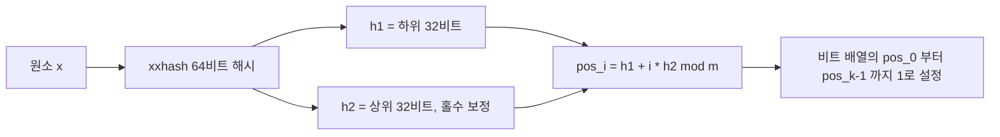
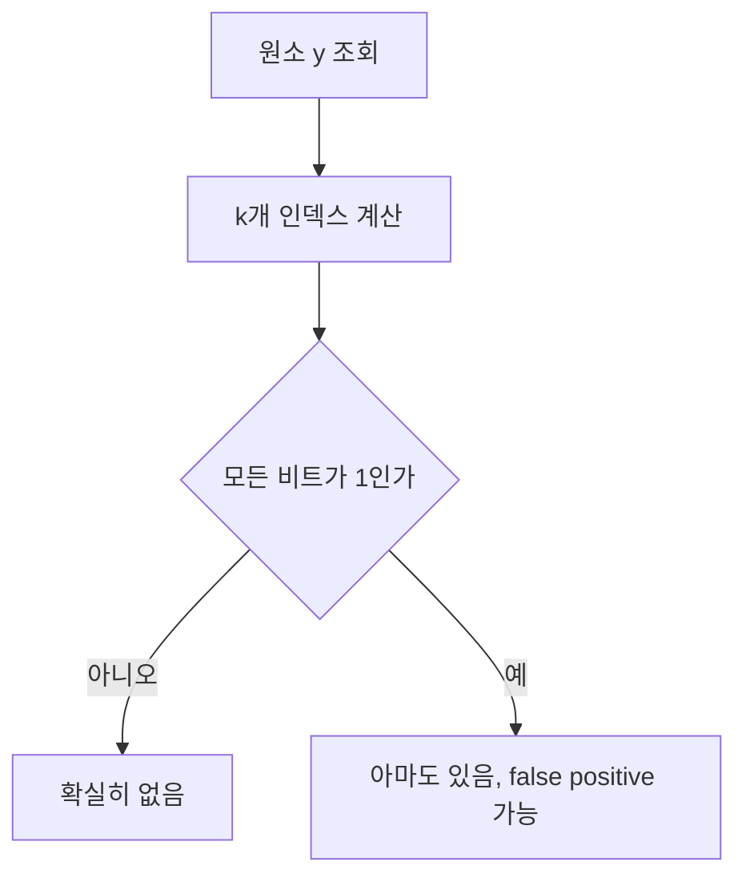

> Bloom Filter의 동작 원리와 파라미터 계산부터 Go 직접 구현, 라이브러리 비교, 실무 사용처까지 한 편에 정리한다.
> 1~3장은 자료구조 자체를, 4장부터는 코드와 실제 사용처를 다룬다.

# 1. 개요

## 1.1 Bloom Filter란

Bloom Filter는 "이 원소가 집합에 있는가"라는 질문 하나만 답하는 확률적 자료구조다. 1970년 Burton Bloom이 제안했고, 지금은 데이터베이스와 캐시 계층 곳곳에 들어가 있다.

특징은 원소 자체를 저장하지 않는다는 점이다. 원소를 해시해서 얻은 위치의 비트만 1로 세워 두고, 원소는 버린다. 그래서 필터를 아무리 뒤져도 무엇이 들어 있는지 열거할 수 없고, 넣은 원소를 다시 꺼낼 수도 없다. 남는 것은 비트 배열뿐이다.

지원하는 연산도 두 개다.

| 연산 | 설명 |
|------|------|
| `Add(x)` | 원소 x에 해당하는 비트들을 1로 세운다 |
| `Contains(x)` | x가 있을 수 있는지 판정한다. false면 확실히 없고, true면 있을 수도 있다 |

삭제도, 순회도, 값 조회도 없다. 할 수 있는 것을 이렇게까지 줄인 대가로 메모리를 크게 아낀다.

## 1.2 왜 필요한가

크롤러가 같은 페이지를 두 번 긁지 않으려면 방문한 URL을 기억해야 한다. 가장 먼저 떠오르는 선택은 `map[string]struct{}`다. 정확하고 코드도 짧다.

```go
visited := make(map[string]struct{})
visited[url] = struct{}{}
if _, ok := visited[url]; ok {
    // 이미 방문함
}
```

문제는 이 map이 URL 문자열 전체를 계속 들고 있어야 한다는 것이다. 힙 사용량은 원소 수 × (URL 길이 + map 내부 오버헤드)로 늘어난다. 실제 URL은 쿼리 파라미터까지 붙으면 100자를 넘는 경우가 흔하고, 원소가 수백만 개가 되면 이 비용이 전체 메모리를 지배한다.

Bloom Filter는 "이미 방문했다"는 판정이 가끔 틀려도 되는 상황을 전제로 이 비용을 없앤다. URL 문자열을 보관하지 않고 원소당 10비트 미만만 남긴다. 오차 1%를 허용하면 원소 하나당 9.59비트로 충분하다(3.3절). 이 값이 원소 크기와 무관하게 고정이라는 점이 핵심이다. URL이 20자든 200자든 필터 크기는 같다.

절약폭이 실제로 얼마인지는 3.4절에서 실측으로 확인한다.

## 1.3 확률적 자료구조: false positive는 있고 false negative는 없다

Bloom Filter가 "확률적"인 이유는 판정이 한쪽 방향으로만 틀리기 때문이다.

| 오류 유형 | 의미 | Bloom Filter |
|-----------|------|--------------|
| false positive | 넣지 않은 원소를 있다고 답함 | 발생한다 |
| false negative | 넣은 원소를 없다고 답함 | 발생하지 않는다 |

`Contains`가 false를 반환하면 그 원소는 확실히 넣은 적이 없다. true를 반환하면 두 가지 경우가 섞여 있다. 실제로 넣었거나, 다른 원소들이 우연히 그 자리 비트를 전부 세워 놨거나.

이 비대칭이 Bloom Filter를 쓸 자리를 정한다. "없음"이 확실하다는 것은, 없다고 판정된 요청에 대해 뒤쪽 저장소를 조회할 필요가 없다는 뜻이다. 있다고 나온 요청만 실제 저장소로 넘겨 확인하면 되고, false positive는 헛조회 한 번으로 끝난다. 최종 판정은 뒤쪽 저장소가 내리고, 필터는 그 앞에서 트래픽을 깎는 역할만 맡는다.

반대로 필터의 true를 최종 답으로 삼아야 하는 자리에는 쓸 수 없다. 중복 결제 차단이나 권한 검사처럼 오답의 대가가 헛조회로 끝나지 않는 판정이 여기 해당한다. 뒤에서 확인해 줄 정답 소스가 없다면 Bloom Filter 단독으로는 답을 낼 수 없다.

# 2. 동작 원리

## 2.1 비트 배열과 k개의 해시 함수

구성 요소는 두 개다. m비트짜리 비트 배열 하나, 그리고 원소를 0부터 m-1 사이의 인덱스로 매핑하는 해시 함수 k개.

이후 계속 쓰는 기호를 먼저 정리한다.

| 기호 | 의미 |
|------|------|
| m | 비트 배열의 전체 비트 수 |
| n | 필터에 넣을 원소 개수 |
| k | 해시 함수 개수 |
| p | false positive 확률 |

비트 배열은 전부 0으로 시작한다. 원소가 들어오면 k개 해시를 돌려 k개 인덱스를 얻고, 그 자리의 비트를 다룬다. Add와 Contains 모두 이 k개 인덱스를 계산하는 부분은 같고, 그 다음에 비트를 세우느냐 읽느냐만 다르다.

해시 함수를 실제로 k개 준비할 필요는 없다. 64비트 해시 하나를 계산해 상위 32비트와 하위 32비트로 쪼개 h1, h2를 만들고, `h1 + i*h2` 꼴로 k개 인덱스를 뽑아 쓰는 방법이 표준처럼 쓰인다. Kirsch-Mitzenmacher가 제안한 이중 해싱 기법으로, 독립적인 해시 k개를 쓸 때와 false positive 확률이 사실상 같다는 것이 알려져 있다. 해시 계산이 한 번으로 줄어드니 k가 커져도 조회 비용이 거의 늘지 않는다. 구현 코드는 4장에서 본다.

## 2.2 Add - 비트를 세우는 과정

Add는 k개 인덱스를 계산해 해당 비트를 전부 1로 만든다. 이미 1인 자리는 그대로 둔다. 실패하는 경우가 없고 반환값도 없다.



같은 원소를 두 번 넣어도 비트 배열의 상태는 달라지지 않는다. 서로 다른 원소가 같은 비트를 공유하는 것도 정상 동작이다. m이 유한한 이상 원소가 쌓이면 겹치는 자리가 반드시 생기고, 이 공유가 false positive의 원인이자 2.4절에서 볼 삭제 불가의 원인이다.

원소가 늘어날수록 1인 비트의 비율이 올라간다. 배열이 1로 가득 차면 모든 조회가 true를 반환하므로 필터는 아무것도 걸러내지 못하는 상태가 된다. 그래서 예상 원소 수 n을 미리 잡고 m을 그에 맞춰 정해야 한다. 이 계산이 3장의 내용이다.

## 2.3 Contains - "없다"는 확실, "있다"는 아마도

Contains는 Add와 같은 방식으로 k개 인덱스를 구한 다음, 그 자리 비트를 하나씩 확인한다. 0인 자리를 하나라도 만나면 즉시 false를 반환한다.



0을 하나라도 봤다는 것은 y를 넣은 적이 없다는 증거가 된다. y를 넣었다면 Add가 그 자리를 1로 세웠을 것이고, Bloom Filter에는 1을 0으로 되돌리는 연산이 없기 때문이다. 그래서 false는 항상 정확하다.

반대로 k개가 전부 1이어도 y를 넣었다는 증거는 되지 못한다. y와 무관한 다른 원소들이 그 k개 자리를 각각 세워 놨을 수 있다. 이 우연이 일어날 확률이 곧 false positive 확률 p이고, 3장에서 계산한다.

두 연산 모두 원소 수와 무관하게 해시 한 번과 비트 접근 k번으로 끝난다. 필터가 커져도 조회 시간은 그대로다.

## 2.4 왜 원소를 삭제할 수 없는가

원소 x와 y가 인덱스 하나를 공유하고 있다고 하자. x를 지우겠다고 x의 k개 비트를 0으로 되돌리면, 공유하던 그 자리도 함께 0이 된다. 그 순간 `Contains(y)`가 false를 반환한다. 넣은 원소를 없다고 답한 것이니 false negative가 생겼고, "없다는 답은 확실하다"는 성질이 깨진다.

이 성질이 깨지면 Bloom Filter를 쓸 이유가 사라진다. 1.3절에서 본 것처럼 false 판정이 정확하다는 전제 위에서 뒤쪽 저장소 조회를 생략하는 것이기 때문이다.

근본 원인은 비트 하나가 담을 수 있는 정보가 "세워졌다"뿐이라는 데 있다. 몇 개의 원소가 그 자리를 세웠는지 알 방법이 없으니, 마지막 하나가 빠졌는지 판단할 수 없다. 세운 횟수를 기록하려면 비트 대신 카운터를 둬야 하는데, 그러면 메모리 구조가 달라진다. 삭제가 꼭 필요한 경우에 쓰는 변형은 7장에서 다룬다.

# 3. 파라미터 설계 (m, n, k, p)

m, n, k, p 네 값은 하나의 식으로 묶여 있어서 셋을 정하면 나머지 하나가 결정된다. 실무에서는 예상 원소 수 n과 허용할 오차 p를 입력으로 주고 m과 k를 계산하는 방향으로 쓴다.

## 3.1 false positive 확률 공식

```
p = (1 - e^(-kn/m))^k
```

유도 과정은 네 단계다.

1. 해시 한 번이 특정 비트를 세우지 않을 확률은 `1 - 1/m`이다. 인덱스가 균등 분포한다고 가정한 값이다.
2. 원소 n개를 넣으면 비트를 세우는 시도가 총 kn번 일어난다. 특정 비트가 끝까지 0으로 남을 확률은 `(1 - 1/m)^(kn)`이고, m이 크면 `e^(-kn/m)`으로 근사된다.
3. 따라서 임의의 비트가 1일 확률은 `1 - e^(-kn/m)`이다.
4. 넣지 않은 원소를 조회하면 k개 자리를 확인하는데, 그 k개가 모두 1이면 false positive다. 확률은 `(1 - e^(-kn/m))^k`가 된다.

마지막 단계는 k개 위치가 서로 독립이라고 가정한 근사다. 실제 값은 이보다 조금 크지만, m이 충분히 크면 차이는 무시할 수준이다.

이 식에서 p는 m과 n이 각각 얼마인지가 아니라 m/n, 즉 원소당 비트 수와 k에만 의존한다. 원소가 10배로 늘어도 m을 10배로 잡으면 오차율은 그대로다.

## 3.2 최적 m과 k 구하기

k를 늘리면 상반된 두 효과가 생긴다. 확인할 비트가 많아지니 우연히 전부 1일 확률은 낮아지지만, 원소당 세우는 비트도 많아지니 배열이 빨리 채워진다. 그래서 p를 최소로 만드는 k가 중간 어딘가에 존재한다. 위 식을 k에 대해 미분해 최솟값을 구하면 다음과 같다.

```
k = (m/n) * ln2
```

이 k에서 비트 배열은 정확히 절반이 1로 채워진다. 이 값을 원래 식에 대입하고 목표 p에 대해 m을 풀면 필요한 비트 수가 나온다.

```
m = -n * ln(p) / (ln2)^2
```

두 식을 그대로 옮긴 코드가 [tutorials-go의 bloom-filter 예제](https://github.com/kenshin579/tutorials-go/tree/master/golang/data-structure/bloom-filter)에 있다.

```go
// OptimalM은 원소 수 n과 목표 false positive 확률 p에 대해 필요한 비트 수를 계산한다.
// p가 (0, 1) 범위를 벗어나면 유효하지 않은 값으로 간주해 기본값 0.01로 대체한다.
//
//	m = -n * ln(p) / (ln2)^2
func OptimalM(n uint64, p float64) uint64 {
	if n == 0 {
		return 1
	}
	if p <= 0 || p >= 1 {
		p = 0.01
	}
	m := -float64(n) * math.Log(p) / (math.Ln2 * math.Ln2)
	return uint64(math.Ceil(m))
}

// OptimalK는 비트 수 m과 원소 수 n에 대해 최적의 해시 함수 개수를 계산한다.
//
//	k = (m/n) * ln2
func OptimalK(m, n uint64) uint64 {
	if n == 0 {
		return 1
	}
	k := (float64(m) / float64(n)) * math.Ln2
	if k < 1 {
		return 1
	}
	return uint64(math.Round(k))
}
```

m은 올림, k는 반올림해 정수로 만든다. k는 최소 1을 보장한다. m/n이 1.44보다 작으면 계산값이 1 미만으로 떨어지는데, 해시를 0개 쓸 수는 없기 때문이다.

## 3.3 숫자로 감 잡기

원소 100만 개(n = 1,000,000)를 기준으로 목표 p를 바꿔 가며 계산한 결과다.

| 목표 p | m (비트) | 비트 배열 메모리 | k | 원소당 비트 |
|--------|----------|------------------|---|-------------|
| 0.1 | 4792530 | 0.57 MiB | 3 | 4.79 |
| 0.01 | 9585059 | 1.14 MiB | 7 | 9.59 |
| 0.001 | 14377588 | 1.71 MiB | 10 | 14.38 |
| 0.0001 | 19170117 | 2.29 MiB | 13 | 19.17 |

목표 FPR을 10배 낮출 때마다 원소당 약 4.8비트가 더 필요하고, 메모리는 선형으로만 늘어난다.

표의 메모리는 비트 배열(`(m+63)/64` 워드)만 계산한 값이다. 실제 힙은 Go 할당기의 사이즈 클래스 반올림 때문에 수 KB 더 크다. 그래서 3.4절의 실측 힙과 소수점 둘째 자리가 어긋날 수 있다.

## 3.4 map과의 메모리 비교

원소 100만 개를 넣었을 때 실제 힙 사용량을 잰 결과다. Bloom Filter는 p = 0.01로 잡았고, map은 키 크기를 바꿔 가며 측정했다.

| 자료구조 | 힙 사용량 | Bloom 대비 배수 |
|----------|-----------|-----------------|
| Bloom Filter (p=0.01) | 1.15 MiB | 1배 |
| `map[uint64]struct{}` (8바이트 키) | 36.06 MiB | 31.2배 |
| `map[string]struct{}` (15바이트 키) | 68.49 MiB | 59.3배 |
| `map[string]struct{}` (54바이트 키) | 114.29 MiB | 99.0배 |
| `map[string]struct{}` (200바이트 키) | 251.59 MiB | 217.9배 |

숫자만 보면 최대 217.9배지만, 이 배수를 그대로 인용하기 전에 알아 둘 것이 몇 가지 있다.

**배수는 키 크기가 만드는 값이다.** Bloom Filter 쪽은 원소가 무엇이든 1.15 MiB로 고정이다. 그러니 배수는 사실상 `원소 하나의 저장 비용 ÷ 원소당 비트(9.59)`이고, 표는 그 의존성을 그대로 보여준다. 우리 데이터의 키가 얼마나 큰지를 먼저 확인해야 어느 행이 자기 상황에 해당하는지 알 수 있다.

**배수는 세 가지를 포기하고 산 값이다.** `map`은 정확하고, 원소를 다시 꺼낼 수 있고, 삭제할 수 있다. Bloom Filter는 1%를 틀리고, 원소를 꺼낼 수 없고, 삭제할 수 없다. 이 교환이 받아들일 만한지는 6.5절에서 다시 짚는다.

**중간 선택지가 있다.** URL 문자열을 그대로 담는 대신 64비트 해시만 담으면 `map[uint64]struct{}`가 된다. 표의 첫 행이다. 정확도를 사실상 유지하면서 상당량을 아낄 수 있으니, Bloom Filter가 유일한 대안인 것처럼 판단하면 안 된다.

**Bloom Filter도 원소를 만들 때는 메모리를 쓴다.** 측정에서 Bloom 쪽도 URL 100만 개를 실제로 만들었고, 필터에 넣은 뒤 GC가 회수했을 뿐이다. "원소를 메모리에 올리지 않아도 된다"가 아니라 "**보관**하지 않아도 된다"가 정확한 표현이다.

**측정 방법.** `runtime.MemStats.HeapAlloc` 델타를 GC 이후에 읽어 살아 있는 객체만 쟀다. Apple M1 / Go 1.26 기준이며, Go의 map 구현이나 아키텍처가 다르면 `map` 쪽 수치는 달라진다.
