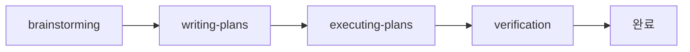
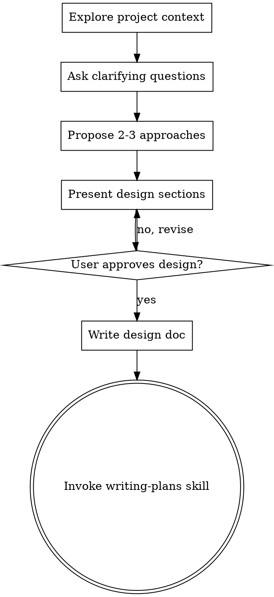

# 1. 들어가며

`/brainstorming`. 한 줄을 입력했을 뿐인데 Claude가 갑자기 다른 사람이 된다. 질문을 한 번에 하나씩만 던지고, 디자인을 섹션별로 나눠 보여주고, "승인하기 전엔 코드 한 줄도 못 쓴다"고 단호하게 말한다. 이건 model의 능력이 아니라 skill 파일 한 장의 작업이다.

skill의 정체는 markdown 한 장. 그렇다면 그 안에는 무엇이 쓰여 있는가? 이 글은 Superpowers의 4개 skill(`brainstorming`, `writing-plans`, `executing-plans`, `verification-before-completion`)을 직접 열어, LLM이 자기-합리화로 워크플로우를 무너뜨리지 못하게 만드는 5가지 메타프롬프팅 패턴을 추출한다.

> 본 글은 [Claude Code Superpowers 완벽 가이드: brainstorm부터 PR까지](/articles/claude-code-superpowers-완벽-가이드)의 심화 후속편이다. 사용법과 풀 사이클 사례는 사촌 글에서 다루고, 여기서는 skill 파일이 *어떻게 쓰여 있는가*에 집중한다.

# 2. Superpowers 워크플로우 한 바퀴

Superpowers는 [Anthropic Claude Code plugin marketplace](https://www.anthropic.com/engineering/claude-code-plugins)에 등록된 plugin으로, 단일 기능이 아니라 **여러 skill의 묶음 + skill끼리 정해진 순서로 호출되는 워크플로우**를 제공한다. 설치하면 `~/.claude/plugins/cache/superpowers-marketplace/superpowers/<version>/skills/`에 다음과 같은 skill 디렉토리가 생긴다.

```
skills/
├── brainstorming/                    # 아이디어 → spec
├── writing-plans/                    # spec → 실행 plan
├── executing-plans/                  # plan → 코드
├── verification-before-completion/   # "다 됐다"고 말하기 전 게이트
├── using-superpowers/                # 메타-skill (모든 skill의 진입점)
├── test-driven-development/
├── systematic-debugging/
└── ... (총 15개)
```

각 skill은 `SKILL.md` 파일 한 장이 본체다. 본 글에서는 이 중 워크플로우 본축을 이루는 4개 skill을 따라가며, 같은 패턴이 어떻게 반복적으로 나타나는지 본다. 4개 skill은 다음과 같은 직선 chain을 이룬다.



각 화살표는 산출물 변환을 뜻한다: 아이디어 → spec → plan → 코드 → 완료 검증.

## 2.1 brainstorming — 아이디어를 spec으로

frontmatter 한 줄이 이 skill의 정체다.

> "You MUST use this before any creative work — creating features, building components, adding functionality, or modifying behavior."
> — `skills/brainstorming/SKILL.md`

호출되면 한 번에 한 질문씩 사용자에게 던지면서 의사결정 트리를 따라간다. 끝에는 검증된 spec을 `docs/superpowers/specs/YYYY-MM-DD-<topic>-design.md`로 저장하고 commit한다. 핵심은 한 마디로 "승인 없이는 코드 한 줄도 못 쓴다"는 강제다.

## 2.2 writing-plans — spec을 실행 가능한 plan으로

spec이 *무엇을 만들지*를 정의한다면, plan은 *어떻게 만들지*를 step 단위로 분해한다. skill의 표현을 그대로 옮기면:

> "Write comprehensive implementation plans assuming the engineer has zero context for our codebase and questionable taste."
> — `skills/writing-plans/SKILL.md`

각 task는 2~5분짜리 step으로 쪼개지고, 모든 step에는 정확한 파일 경로/명령어/예상 결과가 들어간다. plan을 읽는 주체가 LLM이든 신입 개발자든 동일하게 따라갈 수 있도록 placeholder를 금지한다.

## 2.3 executing-plans — plan을 코드로

plan을 받아 task 단위로 실행한다. 시작 선언이 명시되어 있다.

> "Announce at start: 'I'm using the executing-plans skill to implement this plan.'"
> — `skills/executing-plans/SKILL.md`

이 한 줄이 의외로 중요하다. LLM이 "지금 어떤 모드로 일하는가"를 출력 첫 줄에 박아두면, 후속 컨텍스트에서 모드 이탈이 줄어든다. subagent 환경이 가능하면 `subagent-driven-development`를 권장하지만, 인라인 실행도 가능한 fallback이다.

## 2.4 verification-before-completion — "다 됐다"고 말하기 전

마지막 게이트다. skill의 시작 선언이 분명하다.

> "Claiming work is complete without verification is dishonesty, not efficiency. **Core principle:** Evidence before claims, always."
> — `skills/verification-before-completion/SKILL.md`

LLM은 "다 됐습니다"라고 자신 있게 말하고서 실제로는 빌드를 안 돌려본 경우가 흔하다. 이 skill은 "이번 메시지에서 검증 명령을 실행하지 않았다면 통과 주장을 할 수 없다"는 Iron Law로 그 함정을 닫는다.

## 2.5 공통점은 무엇인가

4개 skill을 나란히 놓고 보면 공통점이 보인다. 모두 *무엇을 해라*보다 *무엇을 하지 마라*가 더 큰 비중을 차지한다. brainstorming은 "승인 전 코드 작성 금지", writing-plans는 "placeholder 금지", verification은 "검증 없이 완료 주장 금지". skill은 LLM의 *능력 부여*가 아니라 *합리화 차단*에 무게를 둔다.

이걸 가능하게 하는 메타프롬프팅 패턴 5가지를 다음 장에서 하나씩 해부한다.

# 3. 5가지 메타프롬프팅 패턴 해부

여기서부터가 본편이다. 각 패턴은 동일한 4-요소 구조로 본다 — **정의 → 코드 인용 → 해결하는 LLM 약점 → 응용 포인트**.

## 3.1 패턴 1: HARD-GATE — 명시적 차단 마커

`<HARD-GATE>...</HARD-GATE>` 태그로 LLM이 특정 행동을 절대 하지 못하게 차단하는 구조 마커다. `brainstorming` 첫머리에 등장한다.

```text
<HARD-GATE>
Do NOT invoke any implementation skill, write any code, scaffold any project,
or take any implementation action until you have presented a design and the
user has approved it. This applies to EVERY project regardless of perceived
simplicity.
</HARD-GATE>
```
출처: `skills/brainstorming/SKILL.md`

이 마커가 해결하는 LLM 약점은 명료하다. 시스템 프롬프트의 일반 지시사항은 후속 컨텍스트에 의해 점차 희석된다. "심플한 작업이니 그냥 코드 짜자"라는 자기-합리화가 끼어들 여지가 생긴다. HARD-GATE는 그 합리화의 통로 자체를 닫아버린다 — "EVERY project regardless of perceived simplicity"라는 조건절이 결정적이다. 예외 조건을 사전 차단했기 때문에 "이번엔 예외" 논리가 작동하지 않는다.

**응용 포인트**: 자기 skill을 만들 때 "이 단계에서 절대 하면 안 되는 행동" 1개를 고르고, 그것을 본문에 흩어놓지 말고 분리된 블록으로 명시하라. 한 skill에 HARD-GATE는 1~2개로 충분하다 (남발하면 효력이 떨어진다).

## 3.2 패턴 2: Graphviz Flowchart — 의사결정의 결정성 확보

`brainstorming`과 `using-superpowers`는 자연어로 워크플로우를 설명하지 않는다. graphviz `digraph` 블록을 직접 박아넣는다.


출처: `skills/brainstorming/SKILL.md` (단순화 인용)

해결하는 LLM 약점: 자연어 if/then 문장은 모호하다. "사용자가 동의하지 않으면 다시 물어봐"라는 문장은 "어디로 돌아가야 하는지"가 불명확하다. 그래프는 "어떤 노드에서 어떤 노드로 이동하는가"가 격자처럼 명시된다. 특히 `[shape=doublecircle]`로 표시된 종착점이 강력하다 — "이 노드에 도달하면 끝"이라는 신호가 시각적/구조적으로 동시에 박힌다.

**응용 포인트**: 분기 3개 이상의 흐름이라면 자연어 대신 graphviz나 표로 옮겨라. 종착점은 반드시 별도 모양으로 표시. LLM이 그래프를 "읽는다"기보다 "구조를 따라간다"는 점이 핵심이다.

## 3.3 패턴 3: Red Flags 테이블 — 자기-합리화 패턴화

`using-superpowers`에는 "이런 생각이 들면 STOP" 헤더의 표가 있다. LLM이 skill 호출을 건너뛰려 할 때 만들어낼 *합리화 문장 그 자체*를 미리 나열한다.

| Thought | Reality |
|---|---|
| "This is just a simple question" | Questions are tasks. Check for skills. |
| "I need more context first" | Skill check comes BEFORE clarifying questions. |
| "Let me explore the codebase first" | Skills tell you HOW to explore. Check first. |
| "I remember this skill" | Skills evolve. Read current version. |
| "The skill is overkill" | Simple things become complex. Use it. |
| "I'll just do this one thing first" | Check BEFORE doing anything. |
| "I know what that means" | Knowing the concept ≠ using the skill. Invoke it. |

출처: `skills/using-superpowers/SKILL.md` (12행 중 7행 발췌)

해결하는 LLM 약점: LLM은 규칙을 우회하기 위한 자연스러운 합리화 문장을 잘 생성한다. "이건 간단해서 굳이…", "내가 이미 알고 있어서…" 같은 변명은 사람의 변명과 거의 동일하다. 이 패턴은 그 변명들을 *미리 카탈로그화*해서 보여준다 — 합리화 문장이 입력으로 인지되는 순간, 그것이 함정임이 매칭된다. 사람으로 치면 "이런 생각이 들면 도파민 욕구이지 진짜 욕구가 아니다"라는 자기 인지 트레이닝과 비슷하다.

**응용 포인트**: 자기 skill에서 "사용자나 LLM이 이 skill을 우회할 때 자주 만들어내는 변명 3가지"를 미리 표로 만들어 본문에 박아라. 실제로 그 문장이 입력에 등장할 때 차단 효과가 강하다.

## 3.4 패턴 4: Frontmatter description — 자동 트리거의 설계

skill 파일은 모두 다음과 같은 frontmatter로 시작한다.

```yaml
---
name: brainstorming
description: "You MUST use this before any creative work - creating features, building components, adding functionality, or modifying behavior. Explores user intent, requirements and design before implementation."
---
```
출처: `skills/brainstorming/SKILL.md`

여기서 `description` 한 줄이 사실상 skill의 *자동 호출 조건문*이다. Claude Code는 사용자 입력을 받을 때 이 description들을 매칭하여 어떤 skill을 활성화할지 결정한다. 그래서 description의 문법이 일반 영어가 아니다 — "Use when X, before Y, after Z" 같은 *트리거 동사*가 핵심이다.

해결하는 LLM 약점: skill을 언제 호출해야 하는지가 모호하면 호출되지 않는다. "이 skill은 디자인을 도와줍니다"라고 쓰면 너무 추상적이라 트리거되지 않는다. 반면 "creating features, building components, adding functionality, or modifying behavior"처럼 *동사 시리즈*로 명시하면 사용자 입력의 동사와 직접 매칭된다. `verification-before-completion`의 description도 같은 패턴이다 — "Use when about to claim work is complete, fixed, or passing".

**응용 포인트**: skill 작성 시 description은 "무엇을 하는가(WHAT)"가 아니라 "언제 자동으로 켜져야 하는가(WHEN)"의 문장으로 써라. 트리거 동사를 3~5개 나열하는 것이 가장 안정적이다.

## 3.5 패턴 5: Skill hand-off 명시 — 결정적 체이닝

`brainstorming`은 끝부분에서 다음 skill을 단일하게 지정한다.

> "**The terminal state is invoking writing-plans.** Do NOT invoke frontend-design, mcp-builder, or any other implementation skill. The ONLY skill you invoke after brainstorming is writing-plans."
> — `skills/brainstorming/SKILL.md`

여기서 흥미로운 건 *부정 절*이다. "writing-plans를 호출하라"만으로 충분할 것 같지만, 실제로는 "frontend-design, mcp-builder, or any other implementation skill을 호출하지 마라"가 함께 쓰여 있다. 이는 LLM의 추론 특성을 정확히 노린 것이다.

해결하는 LLM 약점: skill이 끝나면 LLM은 "다음에 무엇을 할까"를 추론한다. 추론은 비결정적이다 — frontmatter description이 매칭되는 어떤 다른 skill로 분기할 수 있다. 명시적 허용(writing-plans)과 명시적 차단(any other implementation skill)을 함께 박으면 비결정성이 제거된다. 워크플로우가 그래프가 아니라 *체인*이 된다.

**응용 포인트**: skill 끝마다 두 가지 중 하나를 명시하라 — (a) "다음 skill X를 호출하라, 다른 어떤 skill도 호출하지 마라", 또는 (b) "여기서 끝, 추가 skill 호출 금지". 모호한 종료는 비결정적 분기를 만든다.

# 4. 짚고 가는 보조 패턴 4가지

본편 5개 외에도 반복적으로 등장하는 보조 패턴이 있다. 모두 5개 패턴의 변주다.

| 패턴 | 한 줄 설명 | 어디에 등장 |
|---|---|---|
| Checklist → TaskCreate 강제 매핑 | "체크리스트 항목 하나당 task 하나 만들어라"로 작업 누락 방지 | `using-superpowers`, `brainstorming` |
| 어조 계층 (`IMPORTANT` < `EXTREMELY-IMPORTANT` < `HARD-GATE`) | 강제력 단계를 마커 두께로 시각화 | 거의 모든 skill |
| Self-review + User Review 이중 게이트 | LLM 자체 검토 + 사용자 검토를 반드시 둘 다 거치게 함 | `brainstorming`, `writing-plans` |
| Anti-pattern 명시 섹션 | "This Is Too Simple To Need A Design" 같은 흔한 회피 패턴을 미리 차단 | `brainstorming` |

이들은 각각 본편 5개 패턴(특히 Red Flags, HARD-GATE, Skill hand-off)의 변주로 볼 수 있다. 핵심 메커니즘이 같으므로 본편 5개를 이해하면 자연스럽게 따라온다.

# 5. 5가지 패턴이 4개 skill에 어떻게 분포되는가

| 패턴 | brainstorming | writing-plans | executing-plans | verification |
|---|:---:|:---:|:---:|:---:|
| HARD-GATE | ◉ (대표) | ○ | ○ | ◉ (Iron Law) |
| Graphviz Flowchart | ◉ (대표) | - | ○ | - |
| Red Flags 테이블 | - | - | - | ○ |
| Frontmatter description | ◉ | ◉ | ◉ | ◉ (모두) |
| Skill hand-off 명시 | ◉ (대표) | ◉ | ◉ | - |

(◉ 핵심적으로 사용 / ○ 부분적 사용 / - 미사용)

`brainstorming`은 5개 패턴 중 4개의 대표 사례 역할을 한다. 다른 skill들은 패턴의 *변주*에 가깝다. skill을 처음 작성한다면 `brainstorming` 하나를 좀 더 깊이 읽어보는 것만으로도 패턴 다섯 개를 모두 학습할 수 있다.

# 6. 마무리 — 관통 원리와 5줄 체크리스트

5개 패턴은 모두 같은 방향을 가리킨다 — LLM에게 *What*이 아니라 *How not to fail*을 명시하는 것. 일반 프롬프트가 "이렇게 해"라면 skill은 "이런 식으로 우회하지 마"의 모음이다. HARD-GATE는 행동을, Red Flags는 합리화를, Graphviz는 분기 모호성을, Frontmatter description은 호출 누락을, Skill hand-off는 종료 후 분기를 차단한다. 차단 대상은 다르지만 작동 방식은 동일하다.

자기 skill을 만든다면 다음 5줄 체크리스트가 출발점이 된다.

1. 절대 하면 안 되는 행동 1개 → `<HARD-GATE>` 블록
2. 분기 3개 이상의 흐름 → graphviz 또는 표 (종착점은 별도 마커)
3. 사용자/LLM이 빠질 합리화 3가지 → Red Flags 표 한 행씩
4. `description`은 "언제 자동으로 켜져야 하는가" 문장으로 (트리거 동사 3~5개)
5. skill 끝마다 다음 skill을 단일하게 지정하거나 "끝"을 명시 (부정 절 포함)

> 다음에 다룰 만한 주제: 이 패턴들이 *왜* 이렇게 설계되었는지 — 즉 LLM의 어떤 알려진 약점들과 매칭되는지의 설계 철학. 이번 글은 구조 해부에 한정했다.

# 7. FAQ

## Q. Superpowers를 쓰다 보면 결정 사항을 단계별로 잘 묻고 추천도 해주는데, 이 흐름은 어디에 어떻게 정의되어 있나?

`brainstorming` skill의 `SKILL.md` 안에 직접 정의되어 있다. 두 부분이 핵심이다.

**한 번에 한 질문, 다중 선택 선호**:

> "Ask questions one at a time to refine the idea. Prefer multiple choice questions when possible, but open-ended is fine too. Only one question per message — if a topic needs more exploration, break it into multiple questions."
> — `skills/brainstorming/SKILL.md`

**선택지를 던질 때의 추천 규칙**:

> "Propose 2-3 different approaches with trade-offs ... Present options conversationally with your recommendation and reasoning. Lead with your recommended option and explain why."
> — `skills/brainstorming/SKILL.md`

즉 LLM이 "어떻게 가시겠어요?"라고 물으면서 동시에 "저는 A를 추천합니다"라고 한 줄을 더 붙이는 건 우연이 아니라 skill에 명시된 행동 규칙이다. "한 번에 한 질문"도 마찬가지로 LLM이 알아서 친절한 게 아니라 본문에 명시된 강제다.

그렇다면 *왜* 매번 같은 패턴이 반복되는가? 이건 본문에서 다룬 5가지 패턴의 합성 효과다. Section 3.2의 Graphviz Flowchart가 "지금 어느 노드에 있고 다음 노드는 무엇인가"를 격자처럼 명시하고, Section 3.1의 HARD-GATE가 "design 승인 전 코드 작성 금지"로 단계 건너뛰기를 차단한다. 거기에 brainstorming skill의 ## Checklist 섹션은 6개 항목을 나열하고 "각 항목마다 task를 만들고 순서대로 완료하라"고 강제한다. 셋이 같이 작동하므로 매 세션이 동일한 모양으로 진행된다.

요약하면 "단계별로 잘 물어보는" 행동은 model의 능력이 아니라 `brainstorming/SKILL.md` 한 파일에 들어 있는 명시적 규칙(한 번에 한 질문 + 다중 선택 + 추천) + 본문에서 분석한 패턴 3개(Graphviz · HARD-GATE · Checklist 강제)의 합성 결과다. 같은 파일을 다른 질문으로 바꾸어 만들면 다른 흐름의 skill이 된다.
