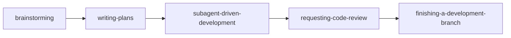
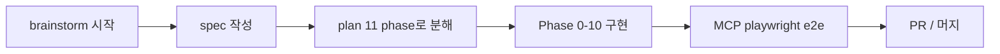
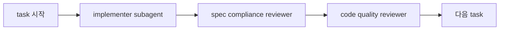
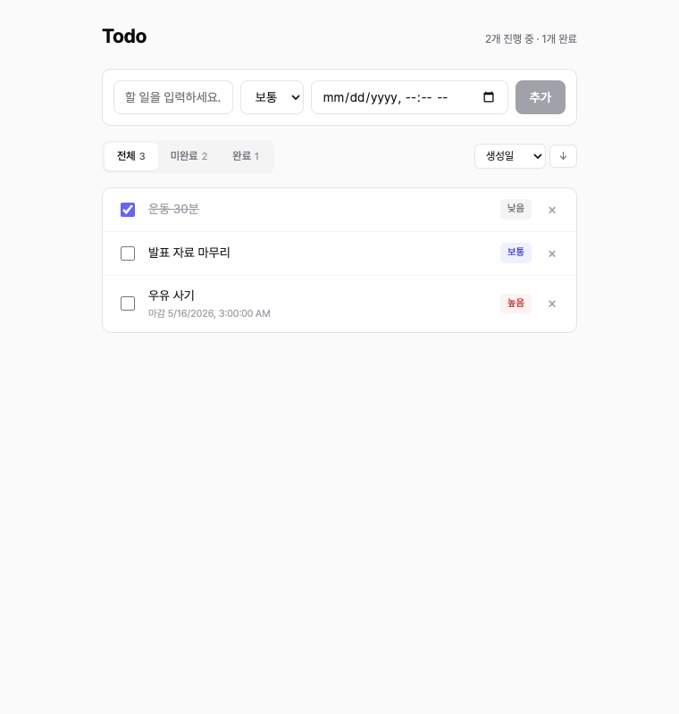

# 1. 개요

Claude Code로 코드를 작성하다 보면 한 가지 답답함이 있다. 처음엔 깔끔하게 시작했는데 어느 순간 컨텍스트가 산만해지고, 어디까지 했는지 헷갈리고, 테스트는 어디서 끊고 다시 시작해야 할지 모호해진다. AI에게 자율성을 주면 즉흥적이 되고, 통제하려 하면 사람이 일일이 끼어들어야 한다.

**Superpowers는 이 흐름을 구조화하는 plugin이다.** brainstorm으로 아이디어를 spec으로 정리하고, writing-plans로 작업 단위 plan으로 분해하고, subagent-driven-development로 phase별 구현 + 자동 리뷰를 거치고, requesting-code-review로 마무리 점검하고, finishing-a-development-branch로 PR/cleanup까지 — 이 5단계가 하나의 완결된 워크플로우로 묶여 있다.

이 글에서는 superpowers 핵심 skill을 한 번에 정리하고, 실제로 Echo + React 기반 Todo 웹앱을 처음부터 PR/머지까지 진행한 사례를 단계별로 따라가본다. 마지막에는 직접 써보고 느낀 솔직한 후기 섹션도 별도로 두어, 도입을 고민하는 동료가 비용 vs 가치를 판단할 수 있게 한다.

> 본 글은 Claude Code 자체와 Skill/Plugin 개념에 어느 정도 익숙한 독자를 가정한다. 처음 듣는 개념이 있다면 [Claude Code 확장 기능 완벽 가이드: Command, Skill, Subagent](/articles/claude-code-확장-기능-완벽-가이드-command-skill-subagent), [Claude Code Plugin Hooks 완벽 가이드](/articles/claude-code-plugin-hooks-완벽-가이드)를 먼저 읽으면 도움이 된다.

# 2. Superpowers란

Superpowers는 [Anthropic이 운영하는 Claude Code plugin marketplace](https://www.anthropic.com/engineering/claude-code-plugins)에 공식 등록된 plugin이다. 단일 기능을 제공하는 보통의 plugin과 달리, **여러 skill의 묶음 + skill끼리 정해진 순서로 호출되는 워크플로우**를 함께 제공한다는 게 특징이다.

기존 [Skill 가이드](/articles/claude-code-확장-기능-완벽-가이드-command-skill-subagent)가 "각 skill이 무엇이고 언제 호출되는가"를 설명한다면, 본 글은 한 단계 위에서 **여러 skill이 어떤 순서로 엮여 한 사이클을 이루는가**를 다룬다.

# 3. 핵심 Skill 카탈로그

Superpowers 안에는 여러 skill이 들어 있지만, 풀 사이클을 이루는 핵심은 8개다. 먼저 한 번에 훑은 뒤 각 skill을 한 단락씩 본다.

| Skill | 역할 | 입력 → 출력 | 본문 깊이 |
|---|---|---|---|
| brainstorming | 아이디어 → spec | 자연어 → spec.md | 깊게 (5장) |
| writing-plans | spec → plan | spec.md → plan.md | 깊게 |
| subagent-driven-development | plan → 코드 (서브에이전트) | plan.md → 커밋 | 깊게 |
| executing-plans | plan → 코드 (인라인) | plan.md → 커밋 | 짧게 (대안) |
| requesting-code-review | 코드 → 리뷰 | 브랜치/커밋 → 리뷰 코멘트 | 중간 |
| test-driven-development | 매 phase TDD 강제 | 명시적 Red→Green | 짧게 |
| using-git-worktrees | 격리 워크트리 | feature 작업 격리 | 짧게 |
| finishing-a-development-branch | 마무리 | 작업 완료 → PR/cleanup | 중간 |

## 3.1 brainstorming

`/superpowers:brainstorming`로 호출하는 skill. 자연어로 표현된 아이디어를 받아 1문항씩 다중선택형으로 사용자에게 질문하며 spec.md로 정리한다. 결정한 내용을 `docs/superpowers/specs/YYYY-MM-DD-<topic>-design.md`에 저장하고 커밋한다.

핵심은 "한 번에 한 질문". 스택, 기능 범위, 라이브러리, 톤 등을 한꺼번에 쏟지 않고 의사결정 트리처럼 진행한다. UI 디자인 같은 시각적 결정에는 visual companion(브라우저 mockup 비교)도 같이 띄울 수 있다.

## 3.2 writing-plans

spec이 완성되면 `superpowers:writing-plans`가 자동 invoke된다. spec을 phase별 task로 분해하고 각 task에 다음 5단계를 명시적으로 적는다.

1. 실패 테스트 작성
2. 테스트 실패 확인 (Red)
3. 최소 구현
4. 테스트 통과 확인 (Green)
5. 커밋

각 task는 한 commit 단위로, 보통 2-5분 작업이다. plan은 `docs/superpowers/plans/YYYY-MM-DD-<topic>-plan.md`에 저장된다.

## 3.3 subagent-driven-development

plan이 준비되면 두 가지 실행 옵션이 제시된다. **subagent-driven**은 매 task마다 새 subagent를 디스패치해 컨텍스트를 격리한다. 한 task는 다음 흐름을 거친다.

1. **Implementer subagent** — task 지시문을 받아 코드 작성, 테스트, self-review, 커밋
2. **Spec compliance reviewer subagent** — 구현이 spec과 정확히 일치하는지 검증
3. **Code quality reviewer subagent** — 코드 품질, 테스트 갭, 함정 검사

세 단계 모두 통과해야 다음 task로 넘어간다. 리뷰가 issue를 발견하면 implementer가 다시 호출되어 fix → 재리뷰. 컨텍스트 오염 없이 한 task에 한 subagent가 책임진다.

## 3.4 executing-plans (대안)

같은 plan을 같은 세션 안에서 인라인으로 실행하는 대안. 매 step마다 plan 파일의 체크박스를 직접 `- [x]`로 갱신해가며 진행한다. subagent 디스패치 비용이 없는 대신 컨텍스트 격리도 없고, 큰 작업에선 컨텍스트 오염이 누적될 수 있다.

선택 기준:
- subagent-driven: 큰 다단계 작업, 많은 task, 리뷰 사이클의 가치 ↑
- executing-plans: 짧고 단순한 작업, plan 파일 자체가 진행 추적 역할

## 3.5 requesting-code-review

전체 사이클이 끝나기 전 한 번 더 종합 리뷰를 받는다. 분기 전체 commit을 묶어 spec 준수, 회귀, 함정, 추가 테스트 필요 항목을 점검한다. critical/important/minor로 분류된 코멘트가 돌아온다.

## 3.6 test-driven-development

writing-plans의 task 골격에 이미 TDD가 내장되어 있어 별도 호출은 드물다. 하지만 implementer subagent가 TDD 사이클을 의식적으로 따르도록 가이드한다. Red 단계에서 테스트가 정말로 실패하는지 확인하는 것이 핵심.

## 3.7 using-git-worktrees

큰 작업을 시작하기 전 격리된 워크트리를 만들어 현재 워킹 디렉토리에 영향을 주지 않게 한다. 학습용 단일 사이클에는 자주 생략되지만, 동시에 여러 기능을 진행하는 실전 환경에서는 권장된다.

## 3.8 finishing-a-development-branch

모든 task가 끝난 뒤 마지막에 호출. 다음을 정형화된 옵션으로 제시한다.
- merge / PR / 별도 브랜치 유지 중 선택
- 자동 push 정책
- 브랜치 cleanup

본 글의 사례에서는 이 skill을 명시적으로 호출하지 않고 사용자 글로벌 정책(임의 push 금지)에 따라 직접 `gh pr create` + `gh pr merge`를 실행했다 — 후기 섹션에서 다시 다룬다.

# 4. 풀 사이클 흐름

핵심 skill들이 어떤 순서로 엮이는지 다이어그램으로 보면 명확하다.



각 화살표는 자동 invoke를 의미한다. brainstorming이 spec 작성을 끝내면 사용자 승인 후 writing-plans를 자동 호출하고, plan이 작성되면 사용자가 실행 방식(subagent-driven 또는 executing-plans)을 고른다. 마지막에 finishing-a-development-branch가 PR/머지 옵션을 제시한다.

## 4.1 사용자 개입 지점

흐름 전체에서 사용자가 결정해야 하는 지점은 다음과 같다.

| 지점 | 무엇 | 자주 받는 질문 |
|---|---|---|
| 1. brainstorm 중 | 스택/기능 범위/라이브러리 | "A/B/C 중 무엇으로?" 식 다중선택 |
| 2. spec 검토 | spec 문서 승인 여부 | "변경할 부분 있는가?" |
| 3. plan 검토 (선택) | plan 문서 승인 | "곧바로 실행할까?" |
| 4. 실행 방식 | subagent-driven vs executing-plans | "어느 쪽으로?" |
| 5. 리뷰 코멘트 반영 | spec/quality 리뷰 issue 처리 | "fixup 진행해도 될까?" |
| 6. 마무리 | PR / push / 머지 승인 | "지금 push할까?" |

이 6개 지점 외엔 거의 자동이다. 인간 시간이 필요한 지점이 명확해 워크플로우 예측 가능성이 높다.

## 4.2 추적 방식 (subagent-driven vs executing-plans)

진행 추적은 두 곳 중 하나에서 일어난다.

- **subagent-driven**: TaskCreate/TaskUpdate를 통한 인-메모리 task list. plan 파일의 `- [ ]` 체크박스는 갱신되지 않는다.
- **executing-plans**: plan 파일을 직접 편집해 `- [x]`로 마킹. plan 파일 자체가 진행 추적기.

같은 결과지만 산출물에 차이가 있다. 본 글의 사례는 subagent-driven을 썼기 때문에 plan 파일이 끝까지 `- [ ]` 그대로 남았다 — 후기 섹션에서 다시 본다.

## 4.3 디렉토리 구조

작업 결과는 다음 형태로 정리된다.

```
프로젝트/
├── docs/superpowers/
│   ├── specs/YYYY-MM-DD-<topic>-design.md   # brainstorming 산출물
│   └── plans/YYYY-MM-DD-<topic>-plan.md     # writing-plans 산출물
├── (실제 코드)
└── (테스트)
```

specs/plans는 PR에 함께 포함되어 영구 레퍼런스가 된다. 작업의 의도와 단계가 코드 옆에 기록되므로, 6개월 후 다시 봤을 때도 "왜 이렇게 했지"를 추적하기 쉽다.

# 5. 사례: Todo 웹앱 처음부터 PR까지 (Echo + React)

이 장은 본 가이드의 핵심이다. `tutorials-go` 저장소의 `ai/superpowers/todo/`에 학습용 Todo 웹앱을 brainstorm부터 PR/머지까지 만든 실제 흐름을 단계별로 따라간다. 결과 PR은 [#701](https://github.com/kenshin579/tutorials-go/pull/701)이다.

전체 흐름을 미리 펼쳐 두면:



각 단계가 어떤 명령으로 시작됐고 어떤 산출물을 남겼는지 본다.

## 5.1 Brainstorming — spec 작성까지

`/superpowers:brainstorming` 한 줄로 시작한다. 인자로 자연어 아이디어를 넘긴다.

```
/superpowers:brainstorming todo web application 샘플 코드를 작성하고 싶다.
- stack: react, golang 1.25, inmemory
- 샘플 코드는 여기에 작성하고 싶다. /Users/user/src/workspace_blog3/tutorials-go/ai/superpowers
참고: 주목적은 superpowers 를 사용법을 익혀 보려고 하는 것이다
```

skill은 곧바로 컨텍스트(go.mod, sibling 디렉토리, 기존 컨벤션)를 점검한 뒤 1문항씩 다중선택을 제시한다. 실제 받은 질문을 발췌하면:

| # | 질문 | 옵션 |
|---|---|---|
| 1 | 기능 범위 | A 미니멀 / B 기본 / C 확장 |
| 2 | 백엔드 프레임워크 | A net/http / B chi / C gin or echo |
| 3 | Go 모듈 구조 | A 루트 모듈 / B sub-module / C 다운그레이드 |
| 4 | 프론트엔드 스택 | Vite + React + TS or JS |
| 5 | BE/FE 통합 방식 | A 분리 + Vite proxy / B CORS / C 정적 서빙 |
| 6 | 테스트 커버리지 | A BE 풀 + FE 스모크 / B 둘 다 풀 / C BE만 |
| 7 | 필터/정렬 위치 | A 서버 사이드 / B 클라이언트 |

각 질문엔 추천(A/B/C 중 하나)이 함께 표시되고 trade-off 설명이 붙는다. 7문항을 통과하면 9개 섹션짜리 spec.md(`2026-04-30-todo-app-design.md`, 600+ 줄)가 자동 생성되고, self-review로 모호성이 인라인 보강된 뒤 사용자 검토 게이트가 열린다.

승인하면 자동으로 다음 skill이 호출된다.

## 5.2 Writing-plans — plan 11 phase 분해

`superpowers:writing-plans`가 spec을 읽고 task 단위 plan을 만든다. Todo 사례에선 다음 11단계로 분해됐다.

| Phase | 내용 | TDD 적용 |
|---|---|---|
| Pre-flight | 피처 브랜치 + spec/plan 커밋 | — |
| 0 | 디렉토리/Makefile/.gitignore + 백엔드 main.go 스텁 + Vite 셋업 | — |
| 1 | 도메인 모델 (Priority/Todo/Validate) | ✅ |
| 2.1 | Store CRUD + 동시성 검증 | ✅ |
| 2.2 | Store List 필터/정렬 | ✅ |
| 3.1~3.3 | Handler Create/Delete/List/Update + writeError | ✅ |
| 4 | Echo 서버 통합 + httptest | ✅ |
| 5 | FE 인프라 (types/api/MSW) | — |
| 6 | useTodos hook | ✅ |
| 7 | TodoForm/FilterBar/TodoItem/TodoList | smoke |
| 8 | App 통합 + e2e | ✅ |
| 9 | README + 수동 검증 | — |
| 10 | code-review skill 호출 + PR 생성 | — |

각 phase는 1 commit 단위, 평균 5-10분 작업. plan은 약 3500줄 분량으로 모든 step의 코드/명령/예상 출력을 명시했다.

## 5.3 Subagent-driven-development — 25 commits, 두 단계 리뷰

본 사이클의 심장이다. 매 phase마다 다음 흐름이 반복된다.



세 subagent 모두 같은 task에 대해 독립 컨텍스트로 동작한다. 실제 사례에서 이 구조가 critical 이슈를 잡아준 두 사례가 있었다.

**사례 ① — Phase 1 한국어 길이 검증 (TDD reviewer가 잡음)**

도메인 모델의 `NewTodo.Validate()`에서 title 길이를 `len()`으로 체크하고 있었는데, code quality reviewer가 다음을 지적했다.

> `todo.go:60` — Title length uses `len()` (bytes), not runes. 한글 100자 제목은 300바이트라 거부됨. 한글 콘텐츠가 first-class concern인 본 프로젝트에선 버그.

implementer를 다시 호출해 `utf8.RuneCountInString` + 한글 boundary 테스트(200자 valid / 201자 invalid)를 추가했다.

**사례 ② — Phase 10 DueDate pointer aliasing (final reviewer가 잡음)**

전체 브랜치 최종 리뷰에서 다음이 발견됐다.

> `store.go:39, 82` — `Add`/`Update`가 caller의 `*time.Time` 포인터를 그대로 저장. 패키지 GoDoc은 "callers cannot mutate stored state through returned references"를 약속하는데, 이 약속이 깨진다.

defensive copy(`copyTimePointer` 헬퍼)를 추가하고 회귀 테스트(`TestStore_Add_DueDateNotAliased`, `TestStore_Update_DueDateNotAliased`)를 같이 넣었다.

대표 commit 흐름을 발췌하면:

| Phase | Commit | 비고 |
|---|---|---|
| Pre-flight | `[feat/todo-app] docs: spec과 implementation plan 추가` | feat/todo-app 브랜치 시작 |
| 0.1 | `chore: 프로젝트 스켈레톤 (README, Makefile)` | — |
| 1 | `feat: 도메인 모델 (Priority, Todo, NewTodo, Patch, Validate)` | TDD Red→Green |
| 1 fixup | `fix: 제목 길이를 byte가 아닌 rune 단위로 카운트 (한글 지원)` | reviewer 코멘트 반영 |
| 2.1 | `feat: in-memory Store CRUD (Add/Get/Update/Delete)` | sync.RWMutex |
| 4 | `feat: Echo 서버 통합 (라우팅/미들웨어/CORS) + httptest 통합 테스트` | 백엔드 완성 |
| 6 | `feat: useTodos hook (useReducer + create/update/remove + 자동 refetch)` | FE 핵심 |
| 8 | `feat: App 조립 + 통합 시나리오 테스트 (MSW 풀 라운드트립)` | FE 통합 |
| 10 fixup | `fix: Store가 DueDate 포인터를 방어적 복사하여 외부 mutation 차단` | final reviewer 코멘트 |

총 25 commits이 feat/todo-app 브랜치에 쌓였다.

## 5.4 PR 생성과 머지

브랜치 push + PR 생성 + 머지까지 명령 한 줄씩이다.

```bash
# push
git push -u origin feat/todo-app

# PR 생성 (CLAUDE.md 정책상 HEREDOC 사용)
gh pr create --title "feat: superpowers todo app (학습 샘플)" \
  --body "$(cat <<'EOF'
## Summary
- Echo + React + in-memory Todo 웹 애플리케이션 (학습용)
- superpowers plugin skill 사이클을 풀로 체험
... (생략)
EOF
)" --assignee kenshin579

# 머지
gh pr merge 701 --merge --delete-branch
```

결과: [PR #701](https://github.com/kenshin579/tutorials-go/pull/701) 머지 완료, master 통합. 작업 시작부터 머지까지 한 세션 안에서 끝났다.



# 6. 시작하기

처음 superpowers를 도입할 때 필요한 절차는 짧다.

## 6.1 Plugin 설치

Claude Code에서 marketplace를 통해 설치한다.

```bash
/plugin install superpowers@anthropic
```

(정확한 명령은 [Anthropic Plugin Marketplace 페이지](https://www.anthropic.com/engineering/claude-code-plugins)에서 확인. 시점에 따라 채널/이름이 다를 수 있음.)

설치 후 새 세션에서 `/superpowers:`로 시작하는 슬래시 커맨드들이 보이면 정상이다.

## 6.2 첫 사이클 시작

```bash
/superpowers:brainstorming <자연어로 아이디어 한두 줄>
```

이후엔 다음 흐름을 그대로 따라가면 된다.

1. 다중선택 7-10개 답변
2. 자동 생성된 spec.md 검토 (1-2회 수정 요청 가능)
3. 자동 호출되는 writing-plans 실행
4. 생성된 plan.md 검토
5. 실행 방식 선택 (subagent-driven 권장)
6. 구현 자동 진행 (가끔 막히면 컨텍스트 추가 입력)
7. 최종 리뷰 코멘트 반영
8. PR 생성 (사용자 승인 후)

## 6.3 권장 사전 준비

- **CLAUDE.md 정책 명시**: push/PR 자동화 정책을 CLAUDE.md에 적어두면 skill이 이를 존중한다 (예: "DO NOT push without explicit consent").
- **코드 컨벤션 룰**: `.claude/rules/*.md`에 코드 스타일/테스트 컨벤션을 적어두면 reviewer subagent가 이를 기준으로 점검한다 (예: `gofmt`, `testify/assert`, `GoDoc` 등).

## 6.4 디렉토리 구조 (재확인)

```
프로젝트/
├── docs/superpowers/
│   ├── specs/   # brainstorming 산출물
│   └── plans/   # writing-plans 산출물
├── 코드/
└── 테스트/
```

specs/plans는 PR과 함께 커밋해 영구 레퍼런스로 남긴다. 6개월 후 다시 봤을 때 "왜 이런 구조로 했지"의 답이 그 자리에 있다.

# 7. 실제 해보고 느낀 점 (honest 후기)

가이드성 정보는 여기까지. 이 섹션은 "직접 한 사이클 돌려본 사람의 관찰"이다. 톤이 약간 informal하더라도 양해 바란다.

## 좋았던 점

- **전체 개발 흐름이 자연스럽게 이어진다**: 기존엔 PRD → implementation plan → todo.md를 따로 수동 작성하고 단계마다 마크다운을 리뷰하는 데 시간이 꽤 들었다. superpowers는 brainstorm → spec → plan → 구현 → 리뷰까지 한 흐름으로 묶여 매 단계 산출물이 자연스럽게 다음 단계의 입력이 되고, 작업자가 들이는 문서 작성·검토 비용이 크게 줄었다
- **컨텍스트 오염이 거의 0**: 한 task가 끝나면 맥락이 implementer subagent와 함께 정리됨 → 큰 PR(25 commits)을 한 세션에서 끝낼 수 있었던 이유
- **두 단계 리뷰가 critical 이슈 발견**: 한국어 rune count, DueDate pointer aliasing은 컴파일/테스트 통과하는 코드였음에도 spec/quality reviewer가 잡음
- **회귀 발견 자연스럽게 유도**: FE 테마 작업의 Vitest e2e config 버그를 implementer가 발견 → 별도 fix-up commit
- **PR 리뷰 비용을 self-review 단계로 내림**: 사람 리뷰어가 잡을 종류의 이슈가 사이클 안에서 처리됨

## 비용과 트레이드오프

- **per-task 3회 subagent 디스패치**: 작은 task엔 과잉. 단순 transcription은 controller-level 처리로 단축 가능
- **plan 파일 체크박스 자동 갱신 X**: subagent-driven은 인-메모리 task list로 추적, plan.md는 끝까지 `- [ ]` 그대로. plan을 영구 추적기로 쓰고 싶다면 executing-plans가 더 맞음
- **시간 비용**: PR #701은 한 세션 90분. 사람 직접: 며칠 / AI 자율: 1시간 미만이지만 품질 비통제. superpowers는 그 사이 절충점

## 함정과 주의

- **subagent에 plan 파일을 직접 읽히지 말 것**: controller가 task 텍스트를 발췌해 prompt에 넣어 전달이 정석
- **한국어 길이는 byte가 아닌 rune count**: Go는 `utf8.RuneCountInString`, JS는 `[..."한글"].length`
- **hidden radio + segmented control e2e 함정**: `getByRole('radio').click()`이 actionable check에 걸려 실패. label 직접 클릭으로 우회
- **finishing-a-development-branch는 정석이지만 스킵 가능**: 자동 push/PR을 원치 않으면 직접 `gh pr create` + `gh pr merge`로 처리

## 권장 적용 시나리오

요약: **다단계 + 다영역 작업에 가장 강력**, 단일 파일 수정엔 일반 슬래시 커맨드가 빠르다.

| 적합도 | 작업 유형 | 이유 |
|---|---|---|
| ✅ 매우 좋음 | 다단계 feature 구현, 도메인 + API + UI를 한 번에 | phase 분리로 컨텍스트가 깔끔, TDD가 자연스럽게 적용 |
| ✅ 좋음 | 리디자인/리팩터링 | 두 단계 리뷰가 회귀 위험을 빠르게 잡음 |
| ✅ 좋음 | 학습/온보딩 자료 | 사이클 자체가 재현 가능한 학습 자료가 됨 |
| 🟡 보통 | 한두 파일짜리 작은 변경 | 디스패치 비용이 가치 대비 큼 — controller-level 처리 충분 |
| ❌ 부적합 | 한 줄 fix, 단순 typo | 형식주의 비용만 발생 |
| ❌ 부적합 | 깊은 디버깅 (디버거 step-through) | superpowers는 디버깅 스킬과 결합되긴 하지만, 사이클 골격 자체가 디버깅엔 어울리지 않음 |

# 8. 마무리

Superpowers를 한 사이클 돌려보면 한 가지가 분명해진다. **AI 코딩의 효율은 개별 prompt의 품질이 아니라 워크플로우 구조에 더 크게 영향받는다.** 같은 모델, 같은 코드 작성 능력이라도 brainstorm → plan → impl → review → finish의 흐름을 강제하면 산출물의 일관성과 회귀 안정성이 크게 올라간다.

핵심 takeaway 세 줄:

1. **다단계 작업에 강력하다.** Domain + API + UI를 한 번에 만드는 시나리오가 sweet spot. 한 줄 fix엔 과하다.
2. **두 단계 리뷰가 보이지 않던 이슈를 잡는다.** 컴파일/테스트가 통과해도 spec과 코드 사이 약속이 깨질 수 있고, reviewer가 그걸 검증한다.
3. **학습/온보딩 자료로 매우 좋다.** 사이클 자체가 재현 가능한 형태로 spec/plan에 남는다.

다음에 시도해 볼 만한 것:

- `using-git-worktrees`로 다중 작업 격리
- `executing-plans`로 인라인 실행 (plan 체크박스 자동 갱신)
- `finishing-a-development-branch` skill을 정식으로 호출해 PR/cleanup 옵션 제시 받기

이 세 가지는 본 사례에서 빠진 부분이라 후속 글에서 따로 다루거나, 직접 시도해본 분들의 경험을 공유받고 싶다.

# 9. 참고

- [Anthropic Claude Code 공식 문서](https://docs.claude.com/en/docs/claude-code)
- [Claude Code Plugin Marketplace 안내](https://www.anthropic.com/engineering/claude-code-plugins)
- 본 사례 PR: [tutorials-go #701 (Todo 풀 구현)](https://github.com/kenshin579/tutorials-go/pull/701), [#702 (FE 테마 리디자인)](https://github.com/kenshin579/tutorials-go/pull/702)
- [Claude Code 확장 기능 완벽 가이드: Command, Skill, Subagent](/articles/claude-code-확장-기능-완벽-가이드-command-skill-subagent)
- [Claude Code Plugin Hooks 완벽 가이드](/articles/claude-code-plugin-hooks-완벽-가이드)
- [Claude Code MCP 추천 가이드](/articles/claude-code-mcp-추천-가이드)
