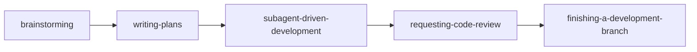

# 1. 개요

Claude Code로 코드를 작성하다 보면 한 가지 답답함이 있다. 처음엔 깔끔하게 시작했는데 어느 순간 컨텍스트가 산만해지고, 어디까지 했는지 헷갈리고, 테스트는 어디서 끊고 다시 시작해야 할지 모호해진다. AI에게 자율성을 주면 즉흥적이 되고, 통제하려 하면 사람이 일일이 끼어들어야 한다.

**Superpowers는 이 흐름을 구조화하는 plugin이다.** brainstorm으로 아이디어를 spec으로 정리하고, writing-plans로 작업 단위 plan으로 분해하고, subagent-driven-development로 phase별 구현 + 자동 리뷰를 거치고, requesting-code-review로 마무리 점검하고, finishing-a-development-branch로 PR/cleanup까지 — 이 5단계가 하나의 완결된 워크플로우로 묶여 있다.

이 글에서는 superpowers 핵심 skill을 한 번에 정리하고, 실제로 Echo + React 기반 Todo 웹앱을 처음부터 PR/머지까지 진행한 사례를 단계별로 따라가본다. 마지막에는 직접 써보고 느낀 솔직한 후기 섹션도 별도로 두어, 도입을 고민하는 동료가 비용 vs 가치를 판단할 수 있게 한다.

> 본 글은 Claude Code 자체와 Skill/Plugin 개념에 어느 정도 익숙한 독자를 가정한다. 처음 듣는 개념이 있다면 [Claude Code 확장 기능 완벽 가이드: Command, Skill, Subagent](/articles/claude-code-확장-기능-완벽-가이드-command-skill-subagent), [Claude Code Plugin Hooks 완벽 가이드](/articles/claude-code-plugin-hooks-완벽-가이드)를 먼저 읽으면 도움이 된다.

# 2. Superpowers란

Superpowers는 [Anthropic이 운영하는 Claude Code plugin marketplace](https://www.anthropic.com/engineering/claude-code-plugins)에 공식 등록된 plugin이다. 단일 기능을 제공하는 보통의 plugin과 달리, **여러 skill의 묶음 + skill끼리 정해진 순서로 호출되는 워크플로우**를 함께 제공한다는 게 특징이다.

## 2.1 Plugin과의 위치 관계

Claude Code의 확장 메커니즘은 크게 세 층으로 나뉜다.

| 층위 | 무엇 | 예시 |
|---|---|---|
| Command | 슬래시로 호출하는 단발 명령 | `/init`, `/fast`, 사용자 정의 `/k:pr-merge` |
| Skill | 특정 상황을 감지해 자동/수동 호출되는 지침 모음 | brainstorming, writing-plans (superpowers 내부의 skill들) |
| Plugin | 위 둘 + 훅 + 자원을 묶은 패키지, marketplace로 배포 | superpowers 자체 |

자세한 차이는 [Claude Code 확장 기능 완벽 가이드](/articles/claude-code-확장-기능-완벽-가이드-command-skill-subagent)에 정리되어 있다.

Superpowers는 이 중 plugin 층에 해당하며, 안에 brainstorming/writing-plans 등 여러 skill이 들어 있다. plugin marketplace를 처음 본다면 [Plugin Hooks 완벽 가이드](/articles/claude-code-plugin-hooks-완벽-가이드)를 참고하자.

## 2.2 다른 Skill 가이드와의 차이

기존 [Skill 가이드](/articles/claude-code-확장-기능-완벽-가이드-command-skill-subagent)가 "각 skill이 무엇이고 언제 호출되는가"를 설명한다면, 본 글은 한 단계 위에서 **여러 skill이 어떤 순서로 엮여 한 사이클을 이루는가**를 다룬다. 즉:

- Skill 가이드: 개별 skill 카탈로그
- Superpowers 가이드 (본 글): 사이클 + 실전 사례 + 후기

## 2.3 왜 이 흐름이 필요한가

AI에게 코드를 시키는 방식은 두 극단 사이에서 흔들린다.

- **자율성 강조**: "todo 앱 만들어줘" → 빠르지만 결과를 통제하기 어렵고, 중간 단계 의사결정이 보이지 않음
- **세부 통제**: 매 단계 사람이 끼어듦 → 안정적이지만 AI를 쓰는 의미가 줄어듦

Superpowers는 그 사이의 균형점을 강제한다. 사람이 결정해야 하는 지점(brainstorm 질문 답변, spec 검토, plan 검토, 머지 승인)은 명시적으로 사람에게 묻고, 그 사이의 기계적 작업(코드 작성, 테스트 실행, 리뷰 디스패치)은 AI가 일관된 패턴으로 처리한다.

# 3. 핵심 Skill 카탈로그

Superpowers 안에는 여러 skill이 들어 있지만, 풀 사이클을 이루는 핵심은 8개다. 먼저 한 번에 훑은 뒤 각 skill을 한 단락씩 본다.

| Skill | 역할 | 입력 → 출력 | 본문 깊이 |
|---|---|---|---|
| brainstorming | 아이디어 → spec | 자연어 → spec.md | 깊게 (5장) |
| writing-plans | spec → plan | spec.md → plan.md | 깊게 |
| subagent-driven-development | plan → 코드 (서브에이전트) | plan.md → 커밋 | 깊게 |
| executing-plans | plan → 코드 (인라인) | plan.md → 커밋 | 짧게 (대안) |
| requesting-code-review | 코드 → 리뷰 | 브랜치/커밋 → 리뷰 코멘트 | 중간 |
| test-driven-development | 매 phase TDD 강제 | 명시적 Red→Green | 짧게 |
| using-git-worktrees | 격리 워크트리 | feature 작업 격리 | 짧게 |
| finishing-a-development-branch | 마무리 | 작업 완료 → PR/cleanup | 중간 |

## 3.1 brainstorming

`/superpowers:brainstorming`로 호출하는 skill. 자연어로 표현된 아이디어를 받아 1문항씩 다중선택형으로 사용자에게 질문하며 spec.md로 정리한다. 결정한 내용을 `docs/superpowers/specs/YYYY-MM-DD-<topic>-design.md`에 저장하고 커밋한다.

핵심은 "한 번에 한 질문". 스택, 기능 범위, 라이브러리, 톤 등을 한꺼번에 쏟지 않고 의사결정 트리처럼 진행한다. UI 디자인 같은 시각적 결정에는 visual companion(브라우저 mockup 비교)도 같이 띄울 수 있다.

## 3.2 writing-plans

spec이 완성되면 `superpowers:writing-plans`가 자동 invoke된다. spec을 phase별 task로 분해하고 각 task에 다음 5단계를 명시적으로 적는다.

1. 실패 테스트 작성
2. 테스트 실패 확인 (Red)
3. 최소 구현
4. 테스트 통과 확인 (Green)
5. 커밋

각 task는 한 commit 단위로, 보통 2-5분 작업이다. plan은 `docs/superpowers/plans/YYYY-MM-DD-<topic>-plan.md`에 저장된다.

## 3.3 subagent-driven-development

plan이 준비되면 두 가지 실행 옵션이 제시된다. **subagent-driven**은 매 task마다 새 subagent를 디스패치해 컨텍스트를 격리한다. 한 task는 다음 흐름을 거친다.

1. **Implementer subagent** — task 지시문을 받아 코드 작성, 테스트, self-review, 커밋
2. **Spec compliance reviewer subagent** — 구현이 spec과 정확히 일치하는지 검증
3. **Code quality reviewer subagent** — 코드 품질, 테스트 갭, 함정 검사

세 단계 모두 통과해야 다음 task로 넘어간다. 리뷰가 issue를 발견하면 implementer가 다시 호출되어 fix → 재리뷰. 컨텍스트 오염 없이 한 task에 한 subagent가 책임진다.

## 3.4 executing-plans (대안)

같은 plan을 같은 세션 안에서 인라인으로 실행하는 대안. 매 step마다 plan 파일의 체크박스를 직접 `- [x]`로 갱신해가며 진행한다. subagent 디스패치 비용이 없는 대신 컨텍스트 격리도 없고, 큰 작업에선 컨텍스트 오염이 누적될 수 있다.

선택 기준:
- subagent-driven: 큰 다단계 작업, 많은 task, 리뷰 사이클의 가치 ↑
- executing-plans: 짧고 단순한 작업, plan 파일 자체가 진행 추적 역할

## 3.5 requesting-code-review

전체 사이클이 끝나기 전 한 번 더 종합 리뷰를 받는다. 분기 전체 commit을 묶어 spec 준수, 회귀, 함정, 추가 테스트 필요 항목을 점검한다. critical/important/minor로 분류된 코멘트가 돌아온다.

## 3.6 test-driven-development

writing-plans의 task 골격에 이미 TDD가 내장되어 있어 별도 호출은 드물다. 하지만 implementer subagent가 TDD 사이클을 의식적으로 따르도록 가이드한다. Red 단계에서 테스트가 정말로 실패하는지 확인하는 것이 핵심.

## 3.7 using-git-worktrees

큰 작업을 시작하기 전 격리된 워크트리를 만들어 현재 워킹 디렉토리에 영향을 주지 않게 한다. 학습용 단일 사이클에는 자주 생략되지만, 동시에 여러 기능을 진행하는 실전 환경에서는 권장된다.

## 3.8 finishing-a-development-branch

모든 task가 끝난 뒤 마지막에 호출. 다음을 정형화된 옵션으로 제시한다.
- merge / PR / 별도 브랜치 유지 중 선택
- 자동 push 정책
- 브랜치 cleanup

본 글의 사례에서는 이 skill을 명시적으로 호출하지 않고 사용자 글로벌 정책(임의 push 금지)에 따라 직접 `gh pr create` + `gh pr merge`를 실행했다 — 후기 섹션에서 다시 다룬다.

# 4. 풀 사이클 흐름

핵심 skill들이 어떤 순서로 엮이는지 다이어그램으로 보면 명확하다.



각 화살표는 자동 invoke를 의미한다. brainstorming이 spec 작성을 끝내면 사용자 승인 후 writing-plans를 자동 호출하고, plan이 작성되면 사용자가 실행 방식(subagent-driven 또는 executing-plans)을 고른다. 마지막에 finishing-a-development-branch가 PR/머지 옵션을 제시한다.

## 4.1 사용자 개입 지점

흐름 전체에서 사용자가 결정해야 하는 지점은 다음과 같다.

| 지점 | 무엇 | 자주 받는 질문 |
|---|---|---|
| 1. brainstorm 중 | 스택/기능 범위/라이브러리 | "A/B/C 중 무엇으로?" 식 다중선택 |
| 2. spec 검토 | spec 문서 승인 여부 | "변경할 부분 있는가?" |
| 3. plan 검토 (선택) | plan 문서 승인 | "곧바로 실행할까?" |
| 4. 실행 방식 | subagent-driven vs executing-plans | "어느 쪽으로?" |
| 5. 리뷰 코멘트 반영 | spec/quality 리뷰 issue 처리 | "fixup 진행해도 될까?" |
| 6. 마무리 | PR / push / 머지 승인 | "지금 push할까?" |

이 6개 지점 외엔 거의 자동이다. 인간 시간이 필요한 지점이 명확해 워크플로우 예측 가능성이 높다.

## 4.2 추적 방식 (subagent-driven vs executing-plans)

진행 추적은 두 곳 중 하나에서 일어난다.

- **subagent-driven**: TaskCreate/TaskUpdate를 통한 인-메모리 task list. plan 파일의 `- [ ]` 체크박스는 갱신되지 않는다.
- **executing-plans**: plan 파일을 직접 편집해 `- [x]`로 마킹. plan 파일 자체가 진행 추적기.

같은 결과지만 산출물에 차이가 있다. 본 글의 사례는 subagent-driven을 썼기 때문에 plan 파일이 끝까지 `- [ ]` 그대로 남았다 — 후기 섹션에서 다시 본다.

## 4.3 디렉토리 구조

작업 결과는 다음 형태로 정리된다.

```
프로젝트/
├── docs/superpowers/
│   ├── specs/YYYY-MM-DD-<topic>-design.md   # brainstorming 산출물
│   └── plans/YYYY-MM-DD-<topic>-plan.md     # writing-plans 산출물
├── (실제 코드)
└── (테스트)
```

specs/plans는 PR에 함께 포함되어 영구 레퍼런스가 된다. 작업의 의도와 단계가 코드 옆에 기록되므로, 6개월 후 다시 봤을 때도 "왜 이렇게 했지"를 추적하기 쉽다.
