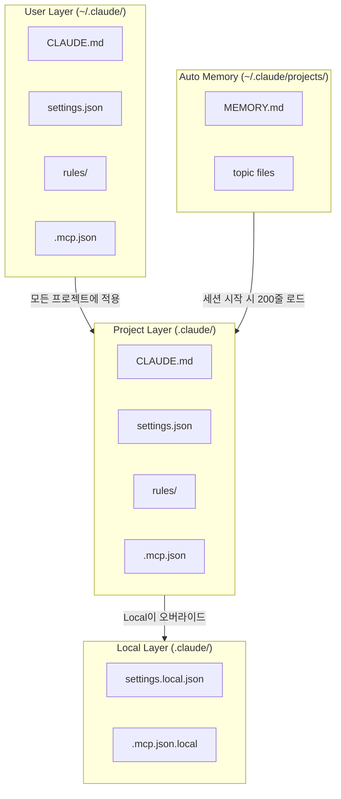
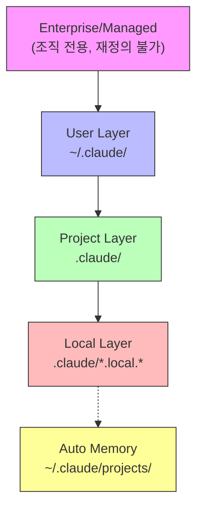

Claude Code를 본격적으로 활용하려면 프로젝트별 설정이 필수다. "빌드 명령이 뭔지", "코딩 컨벤션은 어떤지", "어떤 파일은 읽지 말아야 하는지" 같은 정보를 Claude에게 전달해야 정확한 결과를 얻을 수 있기 때문이다.

이 글에서는 Claude Code의 4가지 핵심 설정 체계를 다룬다:

1. **CLAUDE.md** — 프로젝트 지침 파일 (마크다운)
2. **settings.json** — 시스템 설정 파일 (JSON)
3. **.claude/rules/** — 모듈식 지침 파일 (조건부 로딩)
4. **Auto Memory** — 세션 간 자동 학습 시스템

## 1. 설정 파일 전체 구조 한눈에 보기

Claude Code의 설정은 **User → Project → Local** 계층으로 구성된다. 각 계층의 파일이 어떤 역할을 하는지 먼저 전체 그림을 보자.



| 파일 | 형식 | 역할 | 강제성 |
|------|------|------|--------|
| CLAUDE.md | Markdown | Claude에게 지시/가이드 | 소프트 (따르려 시도) |
| settings.json | JSON | 시스템 동작 설정 (권한, 모델) | 하드 (시스템 강제) |
| rules/ | Markdown | CLAUDE.md를 여러 파일로 분리 | 소프트 |
| MEMORY.md | Markdown | 세션 간 학습 내용 저장 | 소프트 |

---

## 2. CLAUDE.md — 프로젝트 지침 파일

### 2.1 CLAUDE.md란?

CLAUDE.md는 Claude Code에게 **프로젝트별 지시사항을 전달하는 마크다운 파일**이다. 세션 시작 시 자동으로 로드되어 Claude의 컨텍스트에 포함된다.

예를 들어 "이 프로젝트는 Go 1.21을 사용하고, 테스트는 `go test ./...`로 실행하며, Echo v4 프레임워크를 쓴다" 같은 정보를 CLAUDE.md에 적으면 Claude가 매 세션마다 이를 참고한다.

### 2.2 계층 구조

CLAUDE.md는 **4단계 계층**으로 배치할 수 있다:

| 스코프 | 위치 | 대상 | Git 공유 | 로딩 시점 |
|--------|------|------|----------|-----------|
| **User** | `~/.claude/CLAUDE.md` | 개인 전 프로젝트 | 비공유 | 세션 시작 |
| **Project** | `./CLAUDE.md` 또는 `./.claude/CLAUDE.md` | 팀 공유 | Git 커밋 | 세션 시작 |
| **Subdirectory** | `./하위폴더/CLAUDE.md` | 해당 폴더 작업 시 | 선택 | Lazy 로딩 |
| ~~Enterprise~~ | `/Library/Application Support/ClaudeCode/CLAUDE.md` | 조직 전체 | IT 배포 | 항상 |

> **참고**: Enterprise(Managed) 레벨은 Claude for Teams/Enterprise 고객의 IT 관리자가 배포하는 조직 전용 설정이다. 개인 개발자는 **User / Project / Subdirectory** 3단계만 사용하면 된다.

**로딩 우선순위:**
- 디렉토리 트리를 아래에서 위로 탐색 (구체적 → 일반)
- `foo/bar/`에서 실행하면 `foo/bar/CLAUDE.md`와 `foo/CLAUDE.md` **모두** 로드
- 하위 디렉토리 CLAUDE.md는 해당 디렉토리의 파일을 읽을 때 **lazy 로딩**
- 충돌 시 더 구체적인(하위) 설정이 우선

### 2.3 각 레벨에 넣을 내용

| 레벨 | 넣을 내용 | 예시 |
|------|-----------|------|
| **User** | 개인 코딩 스타일, 선호 도구, 워크플로우 | "feature 브랜치 정책, 한국어 커밋" |
| **Project** | 빌드/테스트 명령, 아키텍처, 팀 컨벤션 | "`go test ./...`, 디렉토리 구조" |
| **Subdirectory** | 디렉토리별 언어/프레임워크 규칙 | "Go 컨벤션", "React 컴포넌트 규칙" |

**User CLAUDE.md 예시 (`~/.claude/CLAUDE.md`):**

```markdown
# 개인 설정

## Git 워크플로우
- main/master에 직접 커밋 금지, 항상 feature 브랜치 사용
- 브랜치명: feature/{issue번호}-{기능명}
- 커밋 메시지: 한국어로 작성

## 코딩 스타일
- 기술 용어는 영어, 설명은 한국어
```

**Project CLAUDE.md 예시 (tutorials-go 프로젝트):**

```markdown
# CLAUDE.md

## 프로젝트 개요
Go 언어 튜토리얼 및 예제 코드 모음 (Go 1.21+, Echo v4, GORM, Testify)

## 빌드 & 테스트
go test ./...             # 전체 테스트
go test -v ./golang/...   # 특정 디렉토리
go mod tidy               # 의존성 정리

## 아키텍처
- Clean Architecture: project-layout/go-clean-arch/ (fx DI, Echo, GORM)
- 테스트 패턴: mockery, testcontainers, httpmock
```

### 2.4 Import 구문 (@path)

CLAUDE.md에서 다른 파일의 내용을 참조할 수 있다:

```markdown
# 프로젝트 개요
@README.md 참조

# 빌드 명령
@Makefile 참조

# 개인 설정
@~/.claude/my-preferences.md
```

- 상대 경로는 **CLAUDE.md 파일 기준**으로 해석
- `~` 홈 디렉토리 경로 지원
- 최대 **5단계** 재귀 임포트 가능
- 첫 임포트 시 승인 대화상자 표시 (보안)

### 2.5 Best Practices

- **200줄 이하** 권장 — 파일이 커지면 `.claude/rules/`로 분리
- **구체적으로 작성** — 나쁜 예: "코드를 깔끔하게" / 좋은 예: "gofmt 적용 필수"
- **마크다운 구조화** — 헤더와 불릿으로 섹션 분리
- **충돌 제거** — 여러 CLAUDE.md 간 모순되는 지시가 없는지 확인

### 2.6 실전 예시: 모노레포 구성

아래는 실제 워크스페이스에서 CLAUDE.md를 배치한 구조다:

```
workspace/
├── CLAUDE.md                           # 워크스페이스 전체 (7개 프로젝트 개요)
├── blog-v2.advenoh.pe.kr/
│   └── CLAUDE.md                       # 블로그 (빌드, 라우팅, 콘텐츠 규칙)
├── tutorials-go/
│   └── CLAUDE.md                       # Go 프로젝트 (테스트, 아키텍처)
├── charts/
│   └── CLAUDE.md                       # K8s 인프라 (Terraform, ArgoCD)
└── ...
```

워크스페이스 CLAUDE.md에는 전체 프로젝트 목록과 공통 컨벤션을, 각 서브프로젝트 CLAUDE.md에는 해당 프로젝트의 빌드/테스트/아키텍처를 적는다.

---

## 3. settings.json — 시스템 설정 파일

### 3.1 CLAUDE.md vs settings.json

| 관점 | CLAUDE.md | settings.json |
|------|-----------|---------------|
| **형식** | Markdown | JSON |
| **목적** | Claude에게 지시/가이드 | 시스템 동작 설정 |
| **강제성** | 소프트 (따르려 시도) | 하드 (시스템이 강제) |
| **컨텍스트 비용** | 토큰 소비 | 최소 비용 |
| **용도** | 코딩 표준, 워크플로우 | 권한, 모델, 환경변수 |
| **예시** | "gofmt 적용 필수" | `"model": "opus"` |

**핵심 차이**: CLAUDE.md는 "Claude야, 이렇게 해줘"라는 **요청**이고, settings.json은 "이 도구는 사용 금지"라는 **시스템 제약**이다.

### 3.2 스코프 3단계

| 스코프 | 위치 | Git 공유 | 우선순위 |
|--------|------|----------|----------|
| **User** | `~/.claude/settings.json` | 비공유 | 3순위 |
| **Project** | `.claude/settings.json` | Git 커밋 | 2순위 |
| **Local** | `.claude/settings.local.json` | 비공유 (gitignore) | 1순위 (최우선) |

**우선순위**: Local > Project > User

**deny 규칙 특성**: 어느 레벨에서든 `deny`되면 다른 레벨에서 `allow` 불가. 보안 정책은 항상 우선한다.

> **참고**: Enterprise 환경에서는 Managed 설정이 최상위에 존재하며, 사용자가 재정의할 수 없다.

### 3.3 주요 설정 항목

```json
{
  "model": "opus",
  "defaultMode": "default",
  "effortLevel": "high",
  "alwaysThinkingEnabled": true,

  "permissions": {
    "allow": ["Bash(go test *)", "Bash(make *)"],
    "deny": ["Read(.env)", "Read(.env.*)"],
    "ask": []
  },

  "env": {
    "GO_ENV": "development"
  },

  "autoMemoryEnabled": true,

  "claudeMdExcludes": ["**/other-team/CLAUDE.md"]
}
```

| 설정 | 설명 |
|------|------|
| `model` | 사용할 AI 모델 (opus, sonnet, haiku) |
| `defaultMode` | 권한 모드 (default, acceptEdits, plan 등) |
| `effortLevel` | 추론 깊이 (low, medium, high) |
| `permissions` | 도구별 허용/거부/확인 규칙 |
| `env` | 환경 변수 설정 |
| `autoMemoryEnabled` | Auto Memory 활성화 여부 |
| `claudeMdExcludes` | 특정 CLAUDE.md 파일 제외 |

### 3.4 permissions 설정

permissions는 `allow`, `deny`, `ask` 세 가지로 구성된다:

```json
{
  "permissions": {
    "allow": [
      "Bash(go test *)",
      "Bash(go build *)",
      "Bash(make *)",
      "Read(.)"
    ],
    "deny": [
      "Read(.env)",
      "Read(.env.*)",
      "Read(./secrets/**)",
      "Bash(git push)"
    ],
    "ask": [
      "Bash(docker *)"
    ]
  }
}
```

- **allow**: 자동 허용 (확인 없이 실행)
- **deny**: 완전 차단 (어떤 레벨에서도 재정의 불가)
- **ask**: 매번 사용자에게 확인 요청

### 3.5 .claudeignore 대안

`.claudeignore`는 **공식 미지원**(GitHub Issue #579에서 종료)이다. 민감한 파일을 제외하려면 `permissions.deny`를 사용한다:

```json
{
  "permissions": {
    "deny": [
      "Read(.env)",
      "Read(.env.*)",
      "Read(./secrets/**)",
      "Read(./config/credentials.json)"
    ]
  }
}
```

추가로 `.gitignore`에 포함된 파일은 Claude Code가 코드베이스 탐색 시 자동으로 제외한다.

### 3.6 실전 예시

**tutorials-go 프로젝트의 `.claude/settings.json`:**

```json
{
  "permissions": {
    "allow": [
      "Bash(go test *)",
      "Bash(go build *)",
      "Bash(go mod *)",
      "Bash(make *)"
    ],
    "deny": [
      "Read(.env)",
      "Read(.env.*)"
    ]
  },
  "env": {
    "GO_ENV": "development"
  }
}
```

Go 빌드/테스트 명령은 자동 허용하되, `.env` 파일은 읽지 못하게 차단한다.

---

## 4. .claude/rules/ — 모듈식 지침 파일

### 4.1 rules란?

CLAUDE.md가 200줄을 넘어가면 컨텍스트 효율이 떨어진다. `.claude/rules/` 디렉토리를 사용하면 지침을 **주제별로 분리**할 수 있다.

```
.claude/rules/
├── code-style.md        # 항상 로딩
├── testing.md           # 항상 로딩
└── api/
    └── echo-handler.md  # 조건부 로딩 (특정 파일 작업 시만)
```

`.claude/rules/` 하위의 모든 `.md` 파일이 **재귀적으로** 탐색된다.

### 4.2 무조건 로딩 vs 조건부 로딩

rules 파일에 `paths` YAML 프론트매터를 추가하면 **조건부 로딩**이 된다.

**무조건 로딩 (paths 없음) — 세션 시작 시 항상 로딩:**

```markdown
# Go 코드 스타일

- gofmt/goimports 적용 필수
- 에러는 즉시 처리 (if err != nil 패턴)
- 패키지 export 함수에 GoDoc 주석 작성
```

**조건부 로딩 (paths 있음) — 매칭 파일 작업 시만 로딩:**

```markdown
---
paths:
  - "**/handler*.go"
  - "**/route*.go"
---

# Echo API 핸들러 규칙

- Echo v4 프레임워크 사용
- 핸들러 시그니처: func(c echo.Context) error
- 에러 응답: echo.NewHTTPError(status, message)
```

**동작 방식:**
- `paths` 없는 규칙 → 세션 시작 시 **무조건** 로딩 (CLAUDE.md와 동일)
- `paths` 있는 규칙 → Claude가 매칭 파일을 **읽을 때만** 로딩
- 예: `handler_user.go` 수정 → echo-handler.md **로딩됨**
- 예: `main.go` 수정 → echo-handler.md **로딩 안 됨**

### 4.3 glob 패턴 레퍼런스

| 패턴 | 매칭 대상 |
|------|-----------|
| `**/*.go` | 모든 하위 디렉토리의 Go 파일 |
| `src/**/*` | src/ 하위 전체 |
| `*.md` | 프로젝트 루트의 마크다운만 |
| `src/**/*.{ts,tsx}` | TypeScript + TSX (브레이스 확장) |
| `tests/**/*.test.go` | tests/ 하위의 테스트 파일 |

### 4.4 모노레포 활용 예시

대규모 모노레포에서 팀별로 다른 규칙을 적용하는 예시:

```
.claude/rules/
├── code-style.md              # paths 없음 → 항상 로딩
├── frontend/
│   └── react.md               # paths: ["src/app/**/*.{ts,tsx}"]
├── backend/
│   └── api-design.md          # paths: ["src/api/**/*.go"]
└── testing/
    └── conventions.md         # paths: ["**/*_test.go"]
```

- 프론트엔드 작업 시 → `code-style.md` + `react.md`만 로딩
- 백엔드 작업 시 → `code-style.md` + `api-design.md`만 로딩
- 불필요한 규칙이 컨텍스트를 소비하지 않아 **토큰 절약**

**User-Level Rules** (`~/.claude/rules/`)에 개인 규칙을 배치하면 모든 프로젝트에 적용된다. 프로젝트 rules보다 낮은 우선순위.

> **Tip**: `/memory` 명령으로 현재 로딩된 CLAUDE.md와 rules 파일 목록을 확인할 수 있다.

### 4.5 실전 예시: tutorials-go

```
tutorials-go/
├── CLAUDE.md                           # 프로젝트 지침
└── .claude/
    ├── settings.json                   # 권한, 환경변수
    └── rules/
        ├── code-style.md               # Go 코드 스타일 (항상 로딩)
        ├── testing.md                  # 테스트 컨벤션 (항상 로딩)
        └── api/
            └── echo-handler.md         # Echo 핸들러 규칙 (조건부 로딩)
```

---

## 5. Auto Memory 시스템 — MEMORY.md

### 5.1 Auto Memory란?

Auto Memory는 Claude가 세션 중 학습한 내용을 **파일로 자동 저장**하는 시스템이다.

- 사용자의 역할, 선호도, 피드백을 기억
- 다음 세션에서 이전 학습 내용을 자동으로 활용
- 저장된 파일은 플레인 마크다운이라 직접 편집/삭제 가능

예를 들어 "테스트에서 DB를 목(mock)하지 말아줘"라고 한 번 피드백하면, 이후 세션에서도 Claude가 이를 기억한다.

### 5.2 저장 위치와 디렉토리 구조

```
~/.claude/projects/<project>/memory/
├── MEMORY.md              # 인덱스 (세션 시작 시 자동 로드)
├── user_role.md           # 사용자 정보
├── feedback_testing.md    # 피드백 기록
├── project_auth.md        # 프로젝트 컨텍스트
└── reference_linear.md    # 외부 시스템 참조
```

- `<project>`는 Git 리포지토리 경로에서 자동 파생
- 같은 리포의 모든 worktree가 **하나의 메모리 디렉토리** 공유
- **로컬 머신에만 저장** (다른 머신과 동기화 안 됨)

### 5.3 MEMORY.md 인덱스

MEMORY.md는 메모리 파일들의 **목차(인덱스)** 역할을 한다:

- **처음 200줄만** 세션 시작 시 자동 로드
- 200줄을 넘으면 잘리므로 간결하게 유지
- 상세 내용은 개별 토픽 파일에 저장

```markdown
## User
- [user_role.md](user_role.md) - Go 시니어 개발자, React 초보

## Feedback
- [feedback_testing.md](feedback_testing.md) - DB 목 사용 금지

## Project
- [project_auth.md](project_auth.md) - 인증 시스템 리팩토링 진행 중

## Reference
- [reference_linear.md](reference_linear.md) - 버그 추적은 Linear "INGEST" 프로젝트
```

### 5.4 메모리 타입 4가지

개별 메모리 파일은 YAML 프론트매터로 타입을 지정한다:

```markdown
---
name: 메모리 이름
description: 한줄 설명
type: user | feedback | project | reference
---

메모리 내용
```

| 타입 | 목적 | 저장 시점 | 예시 |
|------|------|-----------|------|
| **user** | 사용자 역할, 선호도 | "나는 백엔드 개발자야" | Go 전문, React 초보 |
| **feedback** | 사용자 교정/가이드 | "이렇게 하지 말고..." | DB 목 사용 금지 |
| **project** | 진행 중인 작업, 마감 | 프로젝트 상황 학습 시 | 인증 리팩토링 진행 중 |
| **reference** | 외부 시스템 위치 | "버그는 Linear에서 추적" | Linear "INGEST" 프로젝트 |

**feedback 메모리 예시:**

```markdown
---
name: 테스트에서 DB 목 사용 금지
description: 통합 테스트는 실제 DB 사용 필수
type: feedback
---

통합 테스트에서 DB를 목(mock)하지 않는다.
**Why:** 지난 분기에 목 테스트는 통과했지만 프로덕션 마이그레이션이 실패
**How to apply:** 통합 테스트 작성 시 항상 실제 데이터베이스 연결 사용
```

### 5.5 메모리에 저장하지 않을 것

- **코드 패턴, 아키텍처** → 코드 자체에서 파악 가능
- **Git 히스토리** → `git log`/`git blame`으로 확인
- **CLAUDE.md에 이미 문서화된 내용** → 중복
- **현재 대화에서만 유용한 임시 정보** → Plan이나 Task 사용

### 5.6 메모리 관리

**활성화/비활성화:**

```bash
# Claude Code 세션 내에서
/memory              # 토글 + 현재 상태 확인

# settings.json에서
{ "autoMemoryEnabled": false }

# 환경 변수로
CLAUDE_CODE_DISABLE_AUTO_MEMORY=1 claude
```

**감사/편집:**
- `/memory` 명령으로 로드된 파일 목록 확인, 편집기에서 열기
- 메모리 파일은 직접 편집/삭제 가능 (플레인 마크다운)

### 5.7 Memory vs Plan vs Task vs CLAUDE.md

| 메커니즘 | 범위 | 용도 |
|---------|------|------|
| **Memory** | 세션 간 지속 | 향후 대화에서 유용한 정보 |
| **Plan** | 현재 세션 | 구현 전략 정렬 |
| **Task** | 현재 세션 | 작업 분해 및 진행 추적 |
| **CLAUDE.md** | 영구 (Git) | 프로젝트 규칙 및 컨벤션 |

---

## 6. 전체 아키텍처 요약

### 6.1 설정 계층 다이어그램



### 6.2 ~/.claude/ 디렉토리 구조

```
~/.claude/
├── CLAUDE.md                   # 개인 지침 (전 프로젝트)
├── settings.json               # 개인 설정
├── keybindings.json            # 키보드 단축키
├── rules/                      # 개인 rules
├── .mcp.json                   # 개인 MCP 서버
└── projects/
    └── <project>/
        └── memory/
            ├── MEMORY.md       # 메모리 인덱스
            └── *.md            # 토픽별 메모리 파일
```

### 6.3 프로젝트 .claude/ 디렉토리 구조

```
your-project/
├── CLAUDE.md                   # 프로젝트 지침 (또는 .claude/CLAUDE.md)
└── .claude/
    ├── settings.json           # 팀 공유 설정
    ├── settings.local.json     # 머신별 오버라이드 (gitignore)
    ├── .mcp.json               # MCP 서버 설정
    ├── .mcp.json.local         # 로컬 MCP 설정
    └── rules/                  # 모듈식 지침
        ├── code-style.md
        ├── testing.md
        └── api/
            └── handler.md
```

---

## 7. 마무리

Claude Code를 효과적으로 활용하려면 설정 파일 체계를 이해하는 것이 첫걸음이다:

- **CLAUDE.md**로 프로젝트 지침을 전달하고
- **settings.json**으로 권한과 시스템 설정을 관리하고
- **rules/**로 지침을 모듈화하고
- **Auto Memory**로 세션 간 학습을 자동화한다

이 4가지를 잘 구성하면 Claude가 프로젝트 맥락을 정확히 이해하고, 매번 같은 설명을 반복하지 않아도 된다.

### 관련 글

Claude Code의 다른 기능들도 함께 활용하면 더 효과적이다:

- **확장 기능**: Command, Skill, Subagent로 워크플로우 자동화 → [Claude Code 확장 기능 완벽 가이드](/article/claude-code-확장-기능-완벽-가이드-command-skill-subagent)
- **Plugin & Hooks**: 이벤트 기반 자동화와 플러그인 패키징 → [Claude Code Plugin & Hooks 완벽 가이드](/article/claude-code-plugin-hooks-완벽-가이드)
- **MCP 서버**: 외부 도구 연결로 기능 확장 → [Claude Code MCP 추천 가이드](/article/claude-code-mcp-추천-가이드)
- **멀티 계정**: Rate limit 대응 전략 → [Claude Code 멀티 계정 전환 가이드](/article/claude-code-멀티-계정-전환-가이드)
