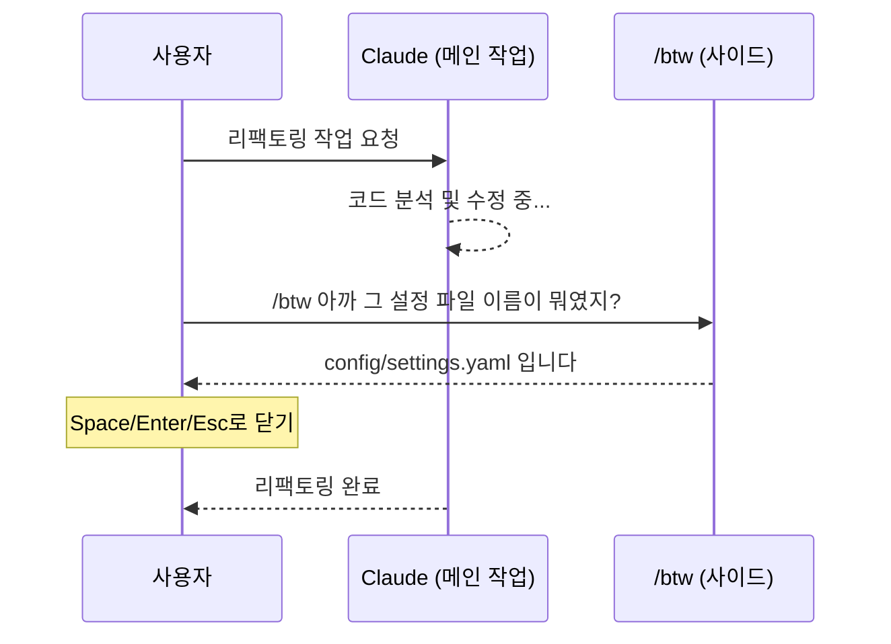
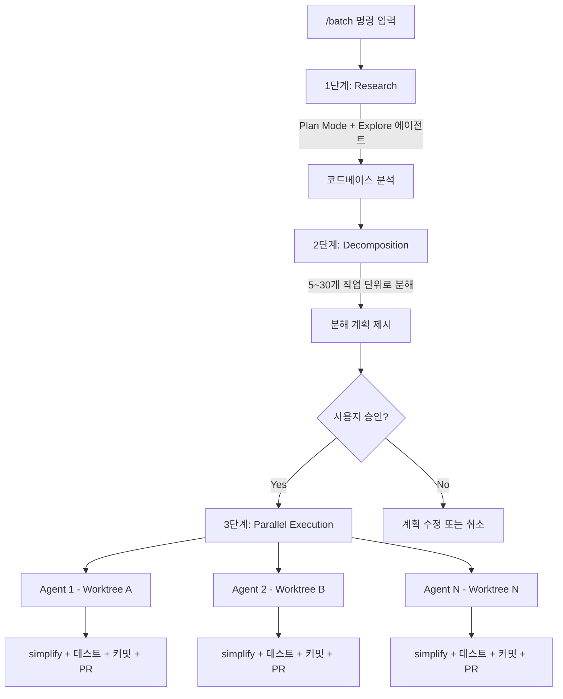
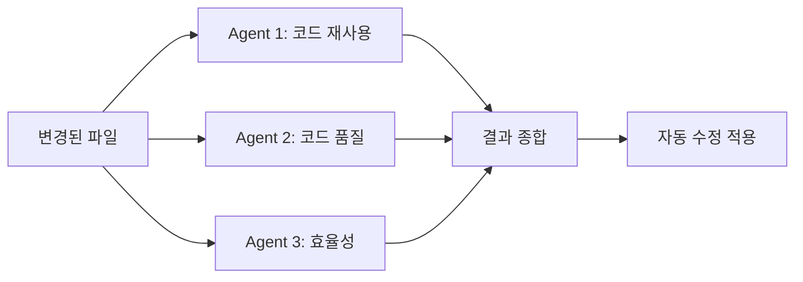
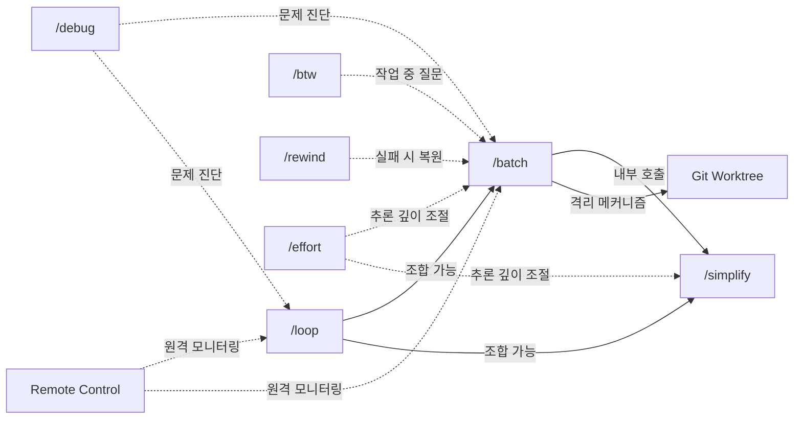

# 1. 개요

Claude Code는 빠른 속도로 새로운 기능을 추가하고 있다. 이전 글에서 [Command, Skill, Subagent](../claude-code-확장-기능-완벽-가이드-command-skill-subagent)를 다뤘다면, 이번 글에서는 그 이후에 추가된 **9가지 최신 기능**을 정리한다.

| 기능 | 한줄 설명 | 핵심 키워드 |
|------|----------|------------|
| `/btw` | 작업 중단 없이 사이드 질문 | 컨텍스트 유지, 비용 절약 |
| `/voice` | 음성으로 명령 입력 | Push-to-talk, 핸즈프리 |
| `/batch` | 대규모 코드 변경 병렬 처리 | 5~30 에이전트, Worktree |
| `/simplify` | 병렬 코드 리뷰 & 자동 수정 | 3 에이전트, 품질 개선 |
| `/loop` | 반복 작업 자동 스케줄링 | 모니터링, 폴링 |
| `/rewind` | 체크포인트로 되돌리기 | Undo, 복원 |
| `/effort` | 추론 깊이 조절 | low/medium/high/max, 비용 최적화 |
| `/debug` | 세션 문제 진단 및 트러블슈팅 | 디버그 로그, 진단 |
| Remote Control | 어디서든 로컬 세션 원격 제어 | 모바일, 웹, QR 코드 |

각 기능이 **무엇이고**, **어떻게 쓰고**, **언제 쓰면 좋은지**를 중심으로 살펴본다.

# 2. /btw — 작업 흐름을 끊지 않는 사이드 질문

## 2.1 개념과 동작 방식

`/btw`는 "By The Way"의 약자로, Claude가 작업 중일 때 **대화 기록을 오염시키지 않고** 빠르게 질문하는 기능이다.

핵심 특징:
- Claude가 응답을 생성하는 **도중에도 병렬로 질문** 가능
- 현재 대화의 **전체 컨텍스트에 접근** (이미 읽은 코드, 이전 결정 사항 등)
- 질문과 답변이 **ephemeral(일시적)** — dismissible overlay로 표시되며 대화 기록에 남지 않음
- **도구 접근 불가** — 파일 읽기, 명령어 실행, 웹 검색 없이 기존 컨텍스트만으로 답변
- **단발성** — 후속 대화 턴 없음



## 2.2 사용 예시

```bash
# 작업 중에 간단한 확인
/btw 아까 그 설정 파일 이름이 뭐였지?

# 코드 구조 질문
/btw 이 함수가 어떤 인터페이스를 구현하는 거야?

# 이전 결정 사항 확인
/btw 아까 왜 싱글톤 대신 팩토리 패턴을 선택했지?

# 변수명이나 경로 확인
/btw 테스트 파일이 어디 있었지?
```

답변을 확인한 뒤 **Space**, **Enter**, 또는 **Escape** 키를 누르면 overlay가 닫히고 원래 작업으로 돌아간다.

## 2.3 비용 절약 원리

`/btw`는 부모 대화의 **프롬프트 캐시를 재사용**한다. 일반 프롬프트는 매번 전체 컨텍스트를 새로 처리하지만, `/btw`는 이미 캐시된 컨텍스트 위에서 질문만 추가하기 때문에 최대 **50% 토큰 절약** 효과가 있다.

또한 대화 기록에 남지 않기 때문에 이후 턴에서의 컨텍스트 크기 증가도 없다.

## 2.4 언제 /btw vs 서브에이전트 vs 일반 프롬프트?

| 상황 | 추천 방법 | 이유 |
|------|----------|------|
| 작업 중 간단한 확인 질문 | `/btw` | 작업 중단 없음, 기록 안 남음 |
| 파일 탐색이나 검색이 필요한 질문 | 서브에이전트 | 도구 접근 가능 |
| 방향을 바꿔야 하는 중요한 질문 | 일반 프롬프트 | 후속 대화 가능, 기록 유지 |
| "이 변수 이름이 뭐였지?" 수준 | `/btw` | 가장 빠르고 저렴 |
| "이 패턴을 전체 코드베이스에서 찾아줘" | 서브에이전트 | Grep/Glob 도구 필요 |

# 3. /voice — 음성으로 코딩하기

## 3.1 활성화 및 사용법

`/voice`는 키보드 대신 **음성으로 Claude Code에 명령을 내리는** 기능이다. 2026년 3월 3일에 출시되었다.

```bash
/voice    # 음성 모드 ON/OFF 토글
```

음성 모드가 활성화되면 터미널에 **음성 인디케이터**가 표시된다.

요구사항:
- **플랫폼**: macOS, Linux, Windows 지원
- **하드웨어**: 마이크 연결 필요
- **플랜**: 모든 유료 플랜에 추가 비용 없이 포함
- **롤아웃**: 점진적 롤아웃 중 (전체 사용자로 확대 예정)

기본값 설정:
- `/config`에서 "Enable voice mode for all sessions"를 활성화하면 매 세션마다 자동으로 음성 모드가 켜진다

## 3.2 Push-to-talk 동작 방식

`/voice`는 **Push-to-talk** 방식으로 동작한다.

1. **스페이스바를 누르고 있는 동안** 음성 입력 시작
2. **자연스럽게 말하기** — 음성이 실시간으로 텍스트로 변환(STT)
3. **스페이스바를 놓으면** 변환된 텍스트가 Claude에 제출
4. Claude는 **텍스트로 응답** (음성 출력은 미지원)

세션의 컨텍스트와 프로젝트 인식이 그대로 유지되므로 키보드로 입력하는 것과 동일하게 동작한다.

## 3.3 실전 활용 시나리오

**핸즈프리 코드 리뷰:**
모니터에서 코드를 보면서 "이 함수의 에러 처리가 빠져있어. try-catch로 감싸고 로그를 추가해줘"라고 음성으로 지시할 수 있다.

**아키텍처 설계:**
복잡한 설계를 구두로 빠르게 설명하면서 프로토타이핑. "사용자 인증 모듈을 만들어줘. JWT 토큰 기반으로 하고, refresh token은 Redis에 저장하는 구조로"처럼 긴 설명을 타이핑 없이 전달할 수 있다.

**영상 튜토리얼 녹화:**
코딩 과정을 녹화할 때 음성으로 Claude를 제어하면 시청자에게 자연스러운 워크플로우를 보여줄 수 있다.

**멀티태스킹:**
다른 작업을 하면서 한 손만으로 스페이스바를 누르고 빠르게 지시를 내릴 수 있다.

## 3.4 한계점과 팁

- **음성 출력 미지원**: Claude의 응답은 터미널에 텍스트로만 표시된다
- **배경 소음**: 시끄러운 환경에서는 인식 정확도가 떨어질 수 있다
- **Push-to-talk 키 고정**: 현재 스페이스바만 지원 (변경 불가)
- **팁**: 명확하고 구체적으로 말할수록 인식 정확도가 높아진다

# 4. /batch — 대규모 변경의 병렬 처리

## 4.1 동작 흐름

`/batch`는 코드베이스 전체에 걸친 대규모 변경을 **5~30개 에이전트가 병렬로 처리**하고 각각 자동으로 PR을 생성하는 기능이다.



전체 흐름은 **Research → Decompose → Execute** 3단계로 진행된다.

**1단계 - Research**: 오케스트레이터가 Plan Mode에 진입하여 Explore 에이전트들로 코드베이스를 분석한다. 변경이 필요한 범위와 영향도를 파악하는 단계이다.

**2단계 - Decomposition**: 분석 결과를 바탕으로 작업을 **5~30개의 독립적인 단위**로 분해한다. 코드베이스 크기와 변경 복잡도에 따라 에이전트 수가 자동 결정된다. 이 계획은 사용자에게 제시되며 승인 후 실행으로 넘어간다.

**3단계 - Parallel Execution**: 승인 후 각 작업 단위마다 하나의 에이전트가 **독립된 Git worktree**에서 병렬로 작업한다. 완료 후 각 에이전트가 자동으로 `/simplify` 실행, 테스트, 커밋, PR 생성까지 처리한다.

## 4.2 Git Worktree 격리 원리

`/batch`의 병렬 처리가 가능한 핵심 메커니즘은 **Git worktree**이다.

Git worktree는 하나의 Git 저장소에서 **여러 개의 작업 디렉토리를 동시에** 유지하는 기능이다. 각 worktree는 독립된 브랜치와 파일 시스템을 갖기 때문에 에이전트들이 서로의 변경을 간섭하지 않는다.

```
.claude/worktrees/
├── batch-unit-1/    # Agent 1의 작업 공간 (branch: worktree-batch-1)
├── batch-unit-2/    # Agent 2의 작업 공간 (branch: worktree-batch-2)
└── batch-unit-n/    # Agent N의 작업 공간 (branch: worktree-batch-n)
```

## 4.3 사용법과 실전 예시

```bash
# import 경로 일괄 변경
/batch 모든 TypeScript 파일에서 '@utils/old' import를 '@utils/new'로 변경

# 코드 스타일 일괄 적용
/batch var를 모두 const로 교체

# 기능 일괄 추가
/batch 모든 API 엔드포인트에 rate limiting 미들웨어 추가

# 설정 마이그레이션
/batch 모든 YAML 설정 파일을 TOML 형식으로 변환
```

## 4.4 적합/부적합 작업 구분

| 적합한 작업 | 부적합한 작업 |
|------------|-------------|
| 라이브러리 버전 업데이트 (50+ 파일) | 파일 간 의존성이 있는 복잡한 리팩토링 |
| 함수/클래스 이름 일괄 변경 | 소규모 코드베이스 (100개 미만 파일) |
| 린트 규칙 일괄 적용 | 수동 QA가 필요한 변경 |
| 설정 포맷 마이그레이션 | DB 마이그레이션 (상호 의존성) |
| API 엔드포인트 일괄 수정 | 동일 파일을 여러 에이전트가 수정해야 하는 경우 |

핵심 원칙: **각 작업 단위가 독립적이어야 한다.** 여러 에이전트가 같은 파일을 수정하면 충돌이 발생한다.

## 4.5 비용 및 성능 고려사항

- **비용**: 에이전트 수에 비례하여 스케일링. 10개 에이전트면 단일 세션의 약 10배 토큰 사용
- **시간**: 모든 에이전트가 **동시에 병렬 실행**되므로 wall-clock time은 순차 처리 대비 훨씬 빠름
- **요구사항**:
  - Git 저장소 + 원격(remote) 설정
  - GitHub CLI (`gh`) 설치 및 인증
  - 충분한 디스크 공간 (worktree 여러 개 생성)

# 5. /simplify — 병렬 코드 리뷰 & 자동 수정

## 5.1 3개 에이전트 병렬 리뷰 구조

`/simplify`는 최근 변경된 파일을 대상으로 **3개의 리뷰 에이전트가 동시에 코드를 분석**하고 자동으로 개선하는 기능이다.

각 에이전트는 서로 다른 관점에서 코드를 검토한다.



| 에이전트 | 검토 관점 | 찾는 것 |
|---------|----------|--------|
| Agent 1 | 코드 재사용 | 중복 코드, DRY 위반, 공통 로직 추출 기회 |
| Agent 2 | 코드 품질 | 코드 스멜, 가독성, 유지보수성, 베스트 프랙티스 |
| Agent 3 | 효율성 | 성능 병목, 메모리 낭비, 알고리즘 개선점 |

3개 에이전트의 결과를 종합한 뒤 **자동으로 코드에 수정을 적용**한다.

## 5.2 focus 파라미터 활용

`/simplify`는 선택적으로 **focus 파라미터**를 전달하여 리뷰 방향을 조정할 수 있다.

```bash
/simplify                              # 전체 관점 리뷰 (기본)
/simplify focus on performance         # 성능에 집중
/simplify focus on code reuse          # 코드 재사용에 집중
/simplify focus on memory efficiency   # 메모리 효율에 집중
/simplify focus on readability         # 가독성에 집중
/simplify focus on security            # 보안에 집중
/simplify focus on type safety         # 타입 안전성에 집중
```

상황별 추천:
- 기능 구현 직후 → `/simplify` (전체 관점)
- 성능 이슈가 예상되는 코드 → `/simplify focus on performance`
- PR 생성 전 최종 정리 → `/simplify focus on readability`

## 5.3 /batch와의 연동

`/simplify`와 `/batch`는 **상호 보완적인 관계**이다.

| 구분 | `/simplify` | `/batch` |
|------|------------|---------|
| 범위 | 최근 변경 파일 | 프로젝트 전체 |
| 에이전트 수 | 3개 (고정) | 5~30개 (자동 결정) |
| 실행 방식 | 직접 수정 적용 | 각 에이전트가 PR 생성 |
| 용도 | 코드 품질 개선 | 대규모 일괄 변경 |

`/batch`는 각 에이전트가 작업을 완료한 뒤 내부적으로 `/simplify`를 자동 실행한다. 즉, `/batch`의 결과물은 이미 `/simplify`를 통해 한 번 정리된 상태이다.

**추천 워크플로우:**
```bash
# 1. 기능 구현
# ... 코드 작성 ...

# 2. 코드 정리
/simplify

# 3. 변경 확인
git diff

# 4. 커밋
/commit
```

# 6. /loop — 반복 작업 자동 스케줄링

## 6.1 간격 문법과 사용법

`/loop`은 지정한 간격으로 프롬프트를 **반복 실행**하는 기능이다. 배포 모니터링, PR 체크, 빌드 확인 등을 자동화할 수 있다.

```bash
# 기본 문법: /loop [간격] [프롬프트]
/loop 5m 배포가 완료되었는지 확인해줘          # 5분 간격
/loop 빌드 상태 체크해줘                       # 기본 10분 간격
/loop 빌드 상태 체크해줘 every 2 hours        # trailing 문법
```

**간격 단위:**

| 단위 | 의미 | 예시 |
|------|------|------|
| `s` | 초 (분 단위로 올림) | `30s` → 1분 |
| `m` | 분 | `5m` → 5분 |
| `h` | 시간 | `2h` → 2시간 |
| `d` | 일 | `1d` → 24시간 |

간격을 지정하지 않으면 **기본 10분**으로 실행된다.

동작 방식:
- 세션이 열려 있는 동안 **백그라운드에서 주기적으로 실행**
- Claude가 응답 중이면 대기했다가 **유휴 상태에서 실행**
- 놓친 실행은 1번만 보충 (연속 catch-up 없음)

## 6.2 다른 스킬과 조합

`/loop`의 강점은 **다른 스킬이나 커맨드와 조합**할 수 있다는 것이다.

```bash
# PR 리뷰 상태 주기적 체크
/loop 20m /review-pr 1234

# CI/CD 빌드 결과 폴링
/loop 3m gh run view --json status 결과를 확인하고 실패하면 알려줘

# 배포 모니터링
/loop 5m curl -s https://api.example.com/health 상태를 확인해줘
```

## 6.3 일회성 리마인더

반복이 아닌 **일회성 리마인더**도 자연어로 설정할 수 있다.

```bash
# 시간 기반
45분 후에 통합 테스트 결과 확인해줘
2시간 뒤에 릴리스 브랜치 푸시 상태 알려줘

# 특정 시각
오후 3시에 릴리스 브랜치 푸시 알려줘
```

**태스크 관리:**
```bash
# 등록된 태스크 목록 조회
현재 예약된 태스크 뭐가 있어?

# 특정 태스크 취소
deploy check 태스크 취소해줘
```

최대 **50개**까지 태스크를 등록할 수 있다.

## 6.4 제한사항

- **세션 종속**: 터미널을 닫으면 모든 예약 태스크가 취소된다
- **3일 자동 만료**: 잊힌 루프가 무한히 실행되지 않도록 3일 후 자동 삭제
- **비영속적**: 세션을 재시작하면 태스크가 초기화된다
- **Catch-up 없음**: Claude가 바쁜 동안 놓친 실행은 1번만 보충

영속적인 스케줄링이 필요하면 **GitHub Actions의 `schedule` 트리거**를 사용하는 것이 적합하다.

# 7. /rewind — 체크포인트 & 실행 취소

## 7.1 자동 체크포인트 생성 원리

Claude Code는 **모든 사용자 프롬프트마다 자동으로 체크포인트를 생성**한다. 별도 설정 없이 작동하며, 체크포인트는 세션을 재개(resume)해도 유지된다.

핵심 동작:
- Claude의 파일 도구(Write, Edit)로 수행한 **모든 파일 변경을 추적**
- 체크포인트는 **30일 후 자동 정리** (설정 가능)
- bash 명령(`rm`, `mv`, `cp`)으로 한 변경은 **추적되지 않음**

## 7.2 5가지 복원 옵션 상세

`Esc` + `Esc` 또는 `/rewind`를 입력하면 **세션의 모든 프롬프트 목록**이 표시된다. 원하는 시점을 선택하면 5가지 옵션이 나타난다.

| 옵션 | 동작 | 활용 시나리오 |
|------|------|-------------|
| **Restore code and conversation** | 코드 + 대화 모두 해당 시점으로 복원 | 완전히 다른 방향으로 다시 시작하고 싶을 때 |
| **Restore conversation** | 대화만 되돌리고 코드는 현재 상태 유지 | 코드는 괜찮은데 대화 컨텍스트를 정리하고 싶을 때 |
| **Restore code** | 코드만 되돌리고 대화 기록은 유지 | 코드 변경이 마음에 안 들지만 대화 맥락은 유지하고 싶을 때 |
| **Summarize from here** | 선택 시점 이후 대화를 요약으로 압축 | 긴 디버깅 후 컨텍스트 공간을 확보하고 싶을 때 |
| **Never mind** | 취소 | — |

복원 후에는 해당 시점의 **원래 프롬프트가 입력창에 복원**되어 수정 후 다시 보낼 수 있다.

## 7.3 Summarize from here 활용

"Summarize from here"는 다른 옵션들과 성격이 다르다. 코드를 변경하지 않고 **대화만 압축**한다.

동작 방식:
- 선택한 시점 **이전** 메시지는 그대로 유지
- 선택한 시점 **이후** 메시지 → AI가 생성한 요약으로 대체
- 원본 메시지는 트랜스크립트에 보존되어 Claude가 필요시 참조 가능

**활용 예시:**
1. 긴 디버깅 세션 후 → 디버깅 과정을 요약하고 실제 수정 작업에 컨텍스트 할당
2. 탐색적 코드 분석 후 → 분석 과정을 압축하고 구현에 집중
3. `/compact`와 유사하지만 **대화의 특정 구간만 선택적으로 압축** 가능

## 7.4 추적 범위와 제한사항

**추적되는 변경:**
- Claude의 파일 도구(Write, Edit)를 통한 모든 파일 변경
- 파일 생성, 수정, 삭제

**추적되지 않는 변경:**
- bash 명령으로 한 파일 변경 (`rm`, `mv`, `cp` 등)
- Claude 외부에서 수동으로 편집한 파일
- 환경 변수, 실행 중인 프로세스 상태

**Git과의 역할 구분:**

| 구분 | /rewind | Git |
|------|---------|-----|
| 목적 | 세션 내 빠른 되돌리기 | 영구적인 버전 관리 |
| 범위 | 현재 세션 | 프로젝트 전체 이력 |
| 보존 기간 | 30일 | 영구 |
| 협업 | 개인 사용 | 팀 공유 |

`/rewind`는 Git을 대체하는 것이 아니라 **세션 수준의 빠른 undo**를 제공하는 보완적 도구이다.

# 8. /effort — 추론 깊이 조절

## 8.1 개념과 동작 방식

`/effort`는 Claude가 응답에 투입하는 **추론(thinking) 깊이를 조절**하는 기능이다. 작업 복잡도에 따라 적절한 수준을 선택하면 속도, 비용, 품질 사이의 균형을 최적화할 수 있다.

핵심 원리:
- Effort 수준이 높을수록 **더 많은 thinking 토큰**을 사용하여 깊이 추론
- 낮은 수준은 **빠르고 저렴**하지만 복잡한 문제에서는 정확도가 떨어질 수 있음
- 설정은 **세션 간 유지** (`max` 제외)

## 8.2 사용법

**세션 내에서 변경:**
```bash
/effort low        # 빠르고 간결한 응답
/effort medium     # 균형 잡힌 기본값
/effort high       # 깊은 추론
/effort max        # 최대 추론 (Opus 4.6 전용)
/effort auto       # 모델 기본값으로 리셋
```

**CLI 플래그로 시작:**
```bash
claude --effort low
claude --effort high
```

**환경 변수:**
```bash
export CLAUDE_CODE_EFFORT_LEVEL=high
```

**settings.json 설정:**
```json
{
  "effortLevel": "low"
}
```

**모델 피커에서 조절:**
`/model` 명령으로 모델 선택 화면에 진입하면 **좌우 화살표 키**로 effort 슬라이더를 조절할 수 있다. 현재 설정된 effort 수준은 UI의 로고와 스피너 옆에 표시된다.

**우선순위:** 환경 변수 > settings.json > 모델 기본값

## 8.3 Effort 수준별 비교

| 수준 | 추론 깊이 | 속도 | 비용 | 세션 간 유지 |
|------|----------|------|------|-------------|
| `low` | 최소한의 추론 | 가장 빠름 | 가장 저렴 | O |
| `medium` | 균형 잡힌 추론 | 보통 | 보통 | O |
| `high` | 깊은 추론 | 느림 | 높음 | O |
| `max` | 토큰 제한 없는 최대 추론 | 가장 느림 | 가장 높음 | X (현재 세션만) |

`max` 수준은 **Opus 4.6에서만** 사용 가능하며, 현재 세션에만 적용되고 다음 세션에서는 기본값으로 돌아간다.

**지원 모델:** Opus 4.6, Sonnet 4.6

## 8.4 상황별 추천 수준

| 상황 | 추천 수준 | 이유 |
|------|----------|------|
| 변수명 변경, 오타 수정 | `low` | 단순 작업에 깊은 추론 불필요 |
| 일반적인 코드 작성 | `medium` | 대부분의 작업에 적합한 균형점 |
| 복잡한 리팩토링, 아키텍처 설계 | `high` | 여러 파일 간 영향 분석 필요 |
| 난해한 버그 추적, 핵심 알고리즘 설계 | `max` | 비용보다 정확도가 중요한 경우 |
| 빠른 질문 ("이 함수 뭐하는 거야?") | `low` | 설명 수준의 작업 |
| PR 리뷰, 코드 분석 | `high` | 꼼꼼한 검토 필요 |

**실전 워크플로우 예시:**
```bash
# 1. 탐색 단계 — 빠르게 코드 파악
/effort low
이 프로젝트의 인증 흐름을 설명해줘

# 2. 구현 단계 — 일반적인 코딩
/effort medium
JWT 미들웨어를 추가해줘

# 3. 디버깅 단계 — 깊은 분석 필요
/effort high
토큰 갱신 시 race condition이 의심돼. 분석해줘
```

## 8.5 기본값과 비활성화

- **Opus 4.6** (Max, Team 구독): 기본값 `medium`
- **adaptive reasoning 비활성화**: 환경 변수 `CLAUDE_CODE_DISABLE_ADAPTIVE_THINKING=1`을 설정하면 고정 thinking budget(`MAX_THINKING_TOKENS`)으로 전환

# 9. /debug — 세션 문제 진단 및 트러블슈팅

## 9.1 개념과 동작 방식

`/debug`는 현재 Claude Code 세션의 **디버그 로그를 분석하여 문제를 진단**하는 기능이다. 도구가 제대로 동작하지 않거나, 세션이 느려지거나, 예상과 다른 동작이 발생했을 때 원인을 파악하는 데 사용한다.

핵심 동작:
- 세션의 **내부 디버그 로그를 자동으로 읽고 분석**
- 문제 설명을 함께 전달하면 **해당 증상에 초점을 맞춰 분석**
- 코드나 설정을 변경하지 않는 **순수 진단 도구**


## 9.2 사용법

```bash
# 일반 진단 — 세션 전체 로그를 분석
/debug

# 특정 증상에 초점을 맞춘 진단
/debug 파일 읽기가 갑자기 안 돼
/debug MCP 서버 연결이 자꾸 끊겨
/debug 도구 실행이 비정상적으로 느려
```

문제 설명을 함께 전달하면 Claude가 해당 증상과 관련된 로그를 **우선적으로 분석**하여 더 정확한 진단 결과를 제공한다.

## 9.3 진단 가능한 문제 유형

| 문제 유형 | 증상 예시 | `/debug`가 확인하는 것 |
|----------|----------|---------------------|
| 도구 실행 오류 | 파일 읽기/편집 실패 | 도구 호출 로그, 권한 오류 |
| 세션 성능 저하 | 응답이 비정상적으로 느림 | 컨텍스트 크기, 토큰 사용량 |
| MCP 서버 문제 | MCP 도구 호출 실패 | 연결 상태, 타임아웃 로그 |
| 권한 프롬프트 이상 | 예상치 못한 권한 요청 반복 | 권한 설정, Hook 실행 로그 |
| 세션 행(hang) | Claude가 멈춘 것처럼 보임 | 대기 중인 작업, 블로킹 요인 |

## 9.4 CLI --debug 플래그와의 차이

`/debug` 스킬과 CLI의 `--debug` 플래그는 목적이 다르다.

| 구분 | `/debug` (스킬) | `--debug` (CLI 플래그) |
|------|----------------|---------------------|
| 시점 | 문제 발생 **후** 진단 | 세션 시작 **시** 활성화 |
| 동작 | 기존 로그를 AI가 분석 | 상세 디버그 로그를 실시간 출력 |
| 출력 | 문제 원인과 해결 방안 | 원시(raw) 디버그 메시지 |
| 대상 | 모든 사용자 | 개발자/고급 사용자 |

```bash
# CLI --debug 플래그 사용법
claude --debug                # 전체 디버그 로그 활성화
claude --debug "api,mcp"      # 특정 카테고리만 필터링
```

**추천 워크플로우:**
1. 문제 발생 → `/debug`로 빠른 진단
2. `/debug`로 원인을 좁힌 뒤 → `--debug` 플래그로 세션을 재시작하여 상세 로그 확인
3. 문제가 지속되면 → `/bug` 또는 `/feedback`으로 리포트

## 9.5 관련 진단 도구 비교

Claude Code에는 `/debug` 외에도 여러 진단 도구가 있다. 상황에 맞게 선택하면 된다.

| 도구 | 목적 | 언제 사용하는가 |
|------|------|---------------|
| `/debug` | 세션 로그 기반 문제 진단 | 도구 오류, 세션 행, 예상 외 동작 |
| `/doctor` | 설치 및 설정 검증 | 설치 직후, 설정 변경 후, 환경 문제 의심 시 |
| `/status` | 버전, 모델, 계정, 연결 상태 확인 | 현재 세션 정보를 빠르게 확인할 때 |
| `/context` | 컨텍스트 사용량 시각화 | 컨텍스트 부족, 성능 저하 의심 시 |

# 10. Remote Control — 어디서든 로컬 세션 제어

## 10.1 아키텍처와 보안 모델

Remote Control은 로컬에서 실행 중인 Claude Code 세션을 **웹 브라우저나 모바일 앱에서 원격으로 제어**하는 기능이다.

핵심 원리:
- 코드는 **로컬 머신에서만 실행** — 원격 기기는 제어/모니터링만 수행
- **인바운드 포트를 열지 않음** — 아웃바운드 HTTPS 폴링 방식
- 모든 트래픽이 **Anthropic API를 통해 TLS 암호화**
- 짧은 수명의 단목적 자격증명 사용


일반적인 원격 접속 도구와 달리 **로컬 머신을 인터넷에 노출하지 않아** 보안을 유지한다.

## 10.2 서버 모드 vs 인터랙티브 모드

Remote Control을 시작하는 **3가지 방법**이 있다.

**방법 1: 서버 모드 (다중 동시 세션)**
```bash
claude remote-control
claude remote-control --name "My Project" --spawn worktree --capacity 10
```

| 옵션 | 설명 |
|------|------|
| `--name "이름"` | 세션 목록에 표시될 이름 |
| `--spawn same-dir` | 동일 디렉토리에서 세션 생성 (기본값) |
| `--spawn worktree` | 각 세션마다 독립 Git worktree 생성 |
| `--capacity N` | 최대 동시 세션 수 (기본 32) |
| `--verbose` | 상세 연결 로그 출력 |

**방법 2: 인터랙티브 세션에 원격 접근 추가**
```bash
claude --remote-control "My Project"
```

로컬에서도 사용하면서 동시에 원격 접근을 활성화한다.

**방법 3: 기존 세션에서 활성화**
```bash
/remote-control My Project
```

이미 진행 중인 세션에 즉시 원격 접근을 추가한다.

## 10.3 연결 방법

Remote Control이 활성화되면 **3가지 방법**으로 원격 기기에서 접속할 수 있다.

**URL 직접 접속**: 터미널에 표시되는 URL을 브라우저에서 열면 claude.ai/code에서 세션에 접근할 수 있다.

**QR 코드 스캔**: 서버 모드에서 스페이스바를 누르면 QR 코드가 표시된다. Claude 모바일 앱으로 스캔하면 바로 연결된다.

**세션 목록**: claude.ai/code 또는 Claude 앱에서 세션 이름으로 찾을 수 있다. Remote Control 세션은 컴퓨터 아이콘에 녹색 상태 점으로 구분된다.

## 10.4 Remote Control vs Claude Code on the Web

| 구분 | Remote Control | Claude Code on the Web |
|------|---------------|----------------------|
| 코드 실행 위치 | **로컬 머신** | Anthropic 클라우드 |
| 로컬 파일 접근 | O | X |
| 로컬 MCP 서버 | O | X |
| 환경 설정 필요 | X (기존 환경 그대로) | X (클라우드 환경) |
| 터미널 유지 필요 | **O** | X |
| 오프라인 대응 | ~10분 이상 끊기면 타임아웃 | 클라우드에서 독립 실행 |

**Remote Control이 적합한 경우:**
- 로컬 환경(파일, MCP 서버, 도구)을 그대로 사용해야 할 때
- 데스크탑에서 시작한 작업을 이동 중에 모니터링하고 싶을 때
- 팀원에게 세션을 공유하여 실시간 협업할 때

**Claude Code on the Web이 적합한 경우:**
- 로컬 환경 없이 빠르게 작업을 시작하고 싶을 때
- 터미널을 닫아도 작업이 계속 진행되어야 할 때

요구사항:
- Claude Code v2.1.51+
- Pro, Max, Team, Enterprise 플랜 (API Key 미지원)

# 11. 9가지 기능 비교 정리

| 기능 | 목적 | 실행 방식 | 비용 영향 | 주요 제한사항 |
|------|------|----------|----------|-------------|
| `/btw` | 사이드 질문 | 메인 작업과 병렬, ephemeral | 매우 낮음 (캐시 재사용) | 도구 불가, 단발성 |
| `/voice` | 음성 입력 | Push-to-talk STT | 일반 프롬프트와 동일 | 음성 출력 미지원, 점진 롤아웃 |
| `/batch` | 대규모 병렬 변경 | 5~30 에이전트 × Worktree | 높음 (에이전트 수 비례) | 독립적 작업만 가능 |
| `/simplify` | 코드 리뷰 & 수정 | 3 에이전트 병렬 | 중간 | 최근 변경 파일만 대상 |
| `/loop` | 반복 스케줄링 | 백그라운드 주기 실행 | 실행 횟수 비례 | 세션 종속, 3일 만료 |
| `/rewind` | 체크포인트 복원 | 즉시 (체크포인트 기반) | 없음 | bash 변경 미추적 |
| `/effort` | 추론 깊이 조절 | 즉시 (설정 변경) | 수준에 비례 | max는 Opus 4.6 전용 |
| `/debug` | 세션 문제 진단 | 디버그 로그 분석 | 낮음 | 현재 세션만 진단 |
| Remote Control | 원격 세션 제어 | HTTPS 폴링 | 없음 (추가 비용 없음) | 터미널 유지 필요 |

**기능 간 연결 관계:**



# 12. 마무리

이번 글에서 다룬 9가지 기능은 Claude Code의 활용 범위를 크게 넓혀준다.

- **작업 흐름 개선**: `/btw`로 끊김 없이 질문하고, `/voice`로 핸즈프리 작업하고, `/rewind`로 안전하게 실험할 수 있다
- **대규모 자동화**: `/batch`와 `/simplify`의 조합으로 코드베이스 전체에 걸친 변경을 병렬로 처리할 수 있다
- **지속적 모니터링**: `/loop`으로 반복 작업을 자동화하고, Remote Control로 어디서든 세션을 관리할 수 있다
- **비용 최적화**: `/effort`로 작업 복잡도에 맞게 추론 깊이를 조절하여 속도와 비용을 최적화할 수 있다
- **트러블슈팅**: `/debug`로 세션 문제를 빠르게 진단하고 원인을 파악할 수 있다

각 기능은 독립적으로도 유용하지만, 조합하면 더 강력해진다. `/effort high`로 추론 깊이를 올린 뒤 `/batch`로 대규모 변경을 시작하고, `/loop`으로 CI 결과를 모니터링하면서, Remote Control로 모바일에서 진행 상황을 확인하는 워크플로우가 가능하다. 문제가 발생하면 `/debug`로 즉시 원인을 파악할 수 있다.

> 이 글에서 다루지 않은 Hooks, MCP 서버 연동 등은 별도 포스트에서 다룰 예정이다.
