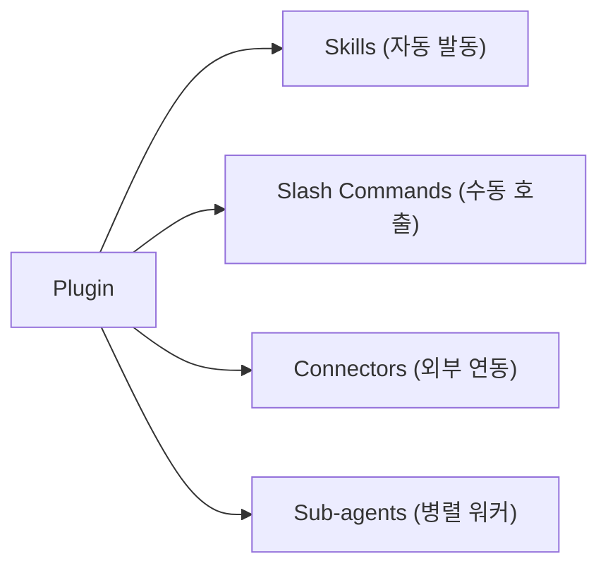

Claude에게 작업을 맡기고 커피 한 잔 하고 오면 끝나 있다. 과장이 아니다. Anthropic이 2026년 1월에 출시한 **Claude Cowork**는 Claude Desktop에 내장된 에이전틱 작업 실행 환경이다. 기존 AI 챗봇처럼 질문하고 답을 받는 방식이 아니라, 동료에게 업무를 맡기듯 작업을 위임하면 알아서 처리한다.

Anthropic의 표현을 빌리자면:

> "less like a back-and-forth and more like leaving messages for a coworker"

이 글에서는 Cowork가 뭔지 설명하는 대신, **"이런 것도 된다고?"** 하는 실전 활용 사례에 집중한다. 프롬프트 예시를 함께 제공하니 바로 따라해 볼 수 있다.

# 1. Cowork, 30초 요약

자세한 설명에 들어가기 전에 Cowork가 뭔지 빠르게 짚고 넘어가자.

- Claude Desktop에서 사용하는 **에이전틱 작업 실행 모드**
- 지정한 폴더의 파일을 읽고, 편집하고, 새로 만들 수 있다
- 복잡한 작업은 **서브에이전트**가 병렬로 나눠서 처리한다
- 작업을 시작하고 자리를 비워도 된다 — 사이드바에서 진행 상황을 추적할 수 있다
- **유료 플랜** 필요 (Pro $20/월, Max $100~200/월, Team $30/user/월, Enterprise)
- macOS / Windows 지원 (Web/Mobile 미지원)

# 2. 이런 것도 된다고? — 활용 사례 모음

## 2.1 파일 정리의 끝판왕

**다운로드 폴더 자동 정리**

```
"Downloads 폴더를 정리해줘.
파일 타입(PDF, 이미지, 문서, 압축)과 날짜(월별)로 분류하고,
중복 파일은 별도 리스트로 만들어줘."
```

수백 개 파일을 몇 분 만에 폴더 구조화하고, 중복 파일 리포트까지 생성한다. 한 사용자는 369개 이미지를 4분 만에 10개 하위 폴더(썸네일, 사진, 스크린샷, GIF 등)로 자동 분류했다.

**반려동물 사진 자동 분류**

```
"이 폴더의 사진들을 분석해서, 어떤 반려동물이 찍혀 있는지 구분하고,
반려동물 이름별 폴더로 분류해줘."
```

AI가 사진 속 반려동물을 인식하여 정확하게 분류하고, 파일 이름까지 깔끔하게 정리한다.

## 2.2 영수증/재무 자동화

**영수증 스캔 → Excel 경비 보고서**

```
"이 폴더의 영수증 이미지와 PDF를 분석해서
Excel 경비 보고서를 만들어줘. 날짜, 금액, 카테고리, 가맹점명으로 정리하고
VLOOKUP과 조건부 서식도 넣어줘."
```

이미지 OCR로 데이터를 추출한 뒤, **진짜 수식이 들어간** Excel 파일을 생성한다. CSV가 아니라 `.xlsx`이다.

**은행 거래 내역 + 인보이스 매칭**

```
"은행 거래 내역(bank_statement.pdf)과 invoices 폴더의 청구서를 대조해서
매칭 결과를 정리하고, 매칭 안 되는 항목을 플래그해줘."
```

자동 대조 후 누락 인보이스를 플래그하고, 인보이스 파일명까지 깔끔하게 리네이밍한다. 실제 사용자 후기: **"이것만으로 매월 오후 반나절을 아낀다."**

**구독료 감사 — 연간 $16,000 지출 적발**

```
"신용카드 명세서(discover.pdf, visa.pdf, amex.pdf)를 분석해서
모든 반복 구독 서비스, 월간 비용, 취소 방법을 정리해줘."
```

30초 만에 구독 서비스 전체 목록을 생성한다. 한 사용자는 이걸로 **연간 $16,000 구독료 지출**을 발견했다. 중복 구독, 안 쓰는 서비스까지 자동으로 플래그해준다.

## 2.3 프레젠테이션 & 문서 자동 생성

**노트 → 브랜디드 슬라이드 덱**

```
"meeting_notes.md와 brand_assets 폴더를 참고해서
다음 주 경영진 보고용 7분 분량 프레젠테이션을 만들어줘."
```

노트에서 핵심 메시지를 추출하고, 슬라이드 구조를 설계한 뒤, **열 수 있는 실제 PPT 파일**을 생성한다. 브랜드 에셋 폴더가 있으면 로고와 색상도 자동 적용된다.

**14페이지 미디어킷 — 10초 프롬프트로 2시간 절약**

```
"Ship It Weekly 뉴스레터(4만 구독자)의 미디어킷을 만들어줘.
구독자 수, 개방률, 클릭률, 광고 제안 티어를 포함해서."
```

10초 프롬프트 하나로 14페이지짜리 미디어킷이 만들어진다. 정확한 메트릭(구독자 40K, 개방률 45%, 클릭률 8%)과 광고 티어 제안까지 포함된다.

## 2.4 리서치 & 분석

**320개 팟캐스트 에피소드 분석**

팟캐스트 호스트 Lenny Rachitsky의 실제 사례다.

```
"이 폴더의 320개 팟캐스트 트랜스크립트를 분석해서
가장 중요한 10가지 테마와 10가지 반직관적 진실을 추출해줘."
```

서브에이전트가 각 트랜스크립트를 병렬로 분석하여 **15분** 만에 종합 결과를 도출했다.

**고객 이탈률 & LTV 분석**

```
"customer_transactions.csv를 분석해줘.
고객 이탈률, LTV(생애가치), 코호트별 분석, 세그먼트별 매출을 정리하고
개선 전략도 제안해줘."
```

수천 건 트랜잭션을 자동 분석한다. "1,600명 가입 중 53%가 전환 안 함, 전환자의 37%가 1주 내 이탈" 같은 구체적 인사이트와 함께 데이터 기반 최적화 전략까지 제안한다.

**앱 아이디어 검증 → 14페이지 PRD**

```
"3D AI 에이전트 매니저 게임 아이디어를 검증해줘.
경쟁사 분석, 시장 분석, SWOT 분석 포함해서 PRD를 만들어줘."
```

웹 검색으로 시장 조사를 한 뒤 경쟁사 분석, SWOT까지 포함한 **14페이지 PRD**를 생성한다. 바로 Claude Code에서 쓸 수 있는 시작 프롬프트까지 포함되어 있다.

## 2.5 콘텐츠 리퍼포징

**블로그 글 → 소셜 미디어 콘텐츠 60개**

```
"articles 폴더의 블로그 글 20개를 읽고,
각 글에서 Substack 노트 3개씩 뽑아줘. 톤은 캐주얼하게."
```

20개 글 x 3개 = **60개 소셜 콘텐츠**가 자동으로 생성된다.

**영상 → 숏폼 클립**

```
"이 긴 영상에서 LinkedIn에 올릴 수 있는 짧은 하이라이트 클립 3개를 만들어줘."
```

긴 영상을 분석하여 핵심 구간을 추출하고 숏폼 클립을 생성한다.

## 2.6 웹앱 & 대시보드 자동 생성

**인플루언서 마케팅 ROI 예측 웹앱**

```
"influencer_data.csv를 기반으로 인플루언서 마케팅 ROI를 예측하는
인터랙티브 웹앱을 만들어줘. 제품 단가는 $500이고, 5배 수익 달성 가능성을 계산해."
```

CSV 데이터를 분석하여 **작동하는 웹앱**을 생성한다. 팔로워 수, 조회수, 비용을 입력하면 ROI를 예측하고, 리스크 평가와 효율 점수까지 제공한다.

**321개 팟캐스트 → 인터랙티브 대시보드**

```
"321개 팟캐스트 트랜스크립트를 분석해서 인터랙티브 대시보드를 만들어줘.
게스트를 직업(CEO, PM 등)과 말투 스타일로 분류하고, 핵심 인용문을 표시해."
```

40명 리더 프로필이 포함된 대시보드가 생성된다. 직업/성향별 필터링, 동적 인용문 선택이 가능하고 공유 링크로 바로 배포할 수 있다.

**24/7 SEO 전략 자동 실행**

```
"내 웹사이트를 분석하고 상위 노출 키워드 25개를 찾아줘.
30일 SEO 구현 전략을 만들고, 첫 번째 단계를 바로 실행해."
```

웹 검색으로 키워드를 리서치하고, 9페이지 실행 계획을 생성한 뒤, 첫 블로그 글 작성을 바로 시작한다. 이후 매일 "다음 단계 진행해" 한 마디면 자율적으로 실행된다.

## 2.7 브라우저 자동화 (Claude in Chrome)

```
"팟캐스트 스튜디오 예약 페이지를 찾아서 Chrome으로 열고,
예약 양식을 작성해줘."
```

Claude in Chrome 확장 프로그램과 연동하면 실제 웹 브라우저에서 양식을 작성하고 예약까지 진행한다. 다른 Cowork 작업과 **병렬로 동시 실행**할 수 있다.

## 2.8 아침 루틴 자동화

실제 사용자가 매일 아침 6:15에 5개 작업을 5분 내에 지시하는 사례다.

| 작업 | 프롬프트 요약 | 결과물 |
|------|-------------|--------|
| 이메일 정리 | "이메일 정렬 + 우선순위 + 회신 초안" | 중요도별 분류 + 복사 가능한 회신 |
| 프레젠테이션 | "7분짜리 강의 발표자료 작성" | 구조화된 PPT 파일 |
| 콘텐츠 기획 | "월간 Substack 콘텐츠 일정" | 브랜드 HTML 캘린더 |
| 폴더 정리 | "다운로드 폴더 정리 + 고객별 분류" | 자동 폴더 구조화 |
| 심층 리포트 | "의료기술 성과기반 가격 정책 분석" | 인터랙티브 HTML 보고서 |

5개 작업을 던져놓고 아침식사를 하고 돌아오면 전부 완료되어 있다.

# 3. 플러그인으로 전문가 모드 ON

플러그인은 Claude를 업종별 전문가로 변신시키는 확장팩이다. Skills, Slash Commands, Connectors, Sub-agents를 하나의 번들로 묶어 제공한다.



## 3.1 플러그인은 어떻게 동작하나?

핵심은 **두 가지 트리거 방식**이다.

| 컴포넌트 | 트리거 | 설명 |
|---------|--------|------|
| **Skills** | **자동** — 관련 작업 시 Claude가 알아서 사용 | Sales 플러그인 설치 후 "이 회사 분석해줘" → Sales skill 자동 발동 |
| **Slash Commands** | **수동** — `/` 입력으로 명시적 호출 | `/sales:call-prep`, `/legal:review-nda` |
| **Connectors** | 설정 시 자동 연동 | Notion, Gmail, Slack 등 외부 도구 (MCP 기반) |
| **Sub-agents** | 자동 — 복잡한 작업 시 병렬 생성 | 10개 문서를 동시에 분석 |

**설치**: claude.com/plugins에서 클릭 한 번, 앱 내 사이드바 Plugins, 또는 터미널에서 `claude plugins add knowledge-work-plugins/sales`로 가능하다.

**사용**: 그냥 쓰면 된다. Skills는 설치만 하면 관련 작업 시 자동 발동되고, Slash Commands는 `/`를 입력하면 목록이 표시된다.

## 3.2 11개 공식 플러그인

모두 오픈소스로 공개되어 있다 ([GitHub](https://github.com/anthropics/knowledge-work-plugins)).

| 플러그인 | 활용 사례 |
|---------|---------|
| **Productivity** | "오늘 할 일 정리하고 캘린더 최적화해줘" |
| **Enterprise Search** | "사내 문서에서 OKR 관련 내용 전부 찾아줘" |
| **Sales** | "이 회사 투자 실사 분석 + 경쟁사 비교 보고서" |
| **Finance** | "분기별 재무 모델 만들고 핵심 지표 대시보드" |
| **Data** | "49,000개 설문 응답을 분석해서 인사이트 보고서" |
| **Legal** | "NDA 계약서 검토 + 리스크 항목 하이라이트 + 수정 제안" |
| **Marketing** | "블로그 20개 → SEO 분석 + 소셜 미디어 콘텐츠 생성" |
| **Customer Support** | "지난 주 티켓 분류 + 응답 초안 + FAQ 업데이트" |
| **Product Management** | "사용자 인터뷰 5개 → PRD 초안 + 로드맵" |
| **Biology Research** | "논문 20개 분석 → 핵심 발견 종합 + 실험 계획" |
| **Plugin Creator** | "우리 팀 전용 플러그인 만들어줘" |

## 3.3 커스텀 플러그인 만들기

코드 없이 만들 수 있다. Plugin Creator에게 요청하면 대화형으로 플러그인 구조를 설계해준다.

```
"프리랜서 클라이언트 관리용 플러그인을 만들어줘.
매주 5명 클라이언트에게 상태 리포트를 자동 생성하는 기능이 필요해."
```

**플러그인 적용 전후 비교:**

| 단계 | 플러그인 없이 | 플러그인 사용 |
|------|------------|------------|
| 1 | Notion에서 진행 상황 확인 | `/client-updates` 한 번 실행 |
| 2 | Claude에게 각 클라이언트별 질문 (x5) | — |
| 3 | 이메일 수동 복사 & 전송 | — |
| 소요 시간 | ~30분 | ~3분 |

# 4. 200% 활용을 위한 팁

## 4.1 결과 중심 프롬프트 작성

```
# Bad — 과정을 지시
"파일을 읽고, 내용을 분석하고, 표를 만들고, 파일로 저장해."

# Good — 결과를 지시
"이 폴더의 문서를 읽고, 중복 내용을 합쳐 하나의 요약 보고서를 만들어줘.
Excel 형식으로 저장하고, 각 항목에 원본 문서 출처를 표시해."
```

과정이 아닌 최종 산출물을 명확히 지정하면 Claude가 알아서 최적의 경로를 찾는다.

## 4.2 전용 작업 폴더를 만들어라

```
~/Cowork/
  ├── input/       # Claude에게 줄 자료
  ├── output/      # Claude가 만든 결과물
  └── instructions/ # 폴더별 지시사항
```

Documents 전체를 넘기지 말 것. 전용 폴더에 input/output을 분리하면 결과 확인이 쉽고, 불필요한 파일 접근도 방지된다.

## 4.3 폴더별 지시사항(Instructions) 활용

- **글로벌 지시사항**: 모든 세션에 적용 (문체, 언어, 포맷 등)
- **폴더별 지시사항**: 특정 프로젝트 컨텍스트 유지

예: "이 폴더의 문서는 모두 한국어로 작성하고, 표는 마크다운 형식을 사용해."

## 4.4 병렬 작업을 적극 활용

Cowork는 여러 작업을 동시에 실행할 수 있다. 각 작업 간 이동해도 진행 상태가 유지되므로, 아침에 여러 작업을 한꺼번에 던져놓는 "배치 위임" 패턴이 효과적이다.

## 4.5 사용량 관리

Cowork는 일반 채팅보다 토큰 소비가 크다. 단순 질문은 일반 채팅, 멀티스텝 파일 작업은 Cowork로 분리하는 것이 좋다. Pro 플랜에서는 사용량이 빠르게 소진될 수 있으므로 주의하자.

# 5. Cowork가 잘하는 것 vs 아직 아쉬운 것

| 잘하는 것 | 아직 아쉬운 것 |
|----------|-------------|
| 파일 일괄 처리/정리 | Desktop 전용 (Web/Mobile 미지원) |
| Excel/PPT/Word **실제 파일** 생성 | 세션 공유 불가 (혼자만 볼 수 있음) |
| 병렬 서브에이전트로 대량 분석 | 30분+ 집중 사용 시 가끔 응답 불가 |
| 비동기 작업 (맡기고 돌아오기) | Projects, Memory 미지원 |
| 플러그인으로 업종별 전문화 | Cowork ↔ 일반 채팅 전환 불가 |
| MCP로 외부 서비스 연동 | 에러 메시지가 불친절한 경우 있음 |
| 폴더/글로벌 Instructions 설정 | 민감한 파일 접근 시 보안 주의 필요 |

# 6. Claude Code와 뭐가 다른가?

개발자라면 궁금할 수 있다.

| 항목 | Claude Cowork | Claude Code |
|------|--------------|-------------|
| **인터페이스** | GUI (Claude Desktop) | 터미널 (CLI) |
| **실행 환경** | 격리된 Linux VM | 로컬 터미널 (직접 접근) |
| **에이전트 모델** | 서브에이전트 (계층적) | Agent Teams (협업 네트워크, 실험적) |
| **파일 접근** | 승인된 폴더만 마운트 | 시스템 전체 접근 |
| **주요 용도** | 문서/데이터/파일 작업 | 코드 작성/디버깅 |
| **확장** | 플러그인 (11개 공식) | Skills, Hooks, MCP |
| **보안** | VM 샌드박스 격리 | 사용자 권한 레벨 |

핵심 차이: Cowork = "파일 작업의 Claude Code", Code = "코드 작업의 Cowork". 둘은 대체 관계가 아니라 **보완 관계**다.

# 7. 시작하기 (5분 셋업)

1. **Claude Desktop** 최신 버전 설치 (macOS/Windows)
2. Settings → Features → **Cowork 토글 ON** → VM 다운로드 (~2GB)
3. **작업 폴더 추가**: Cowork Settings → "Add Folder" → 전용 폴더 선택
4. (선택) **플러그인 설치**: claude.com/plugins에서 필요한 플러그인 선택
5. (선택) **MCP 커넥터**: 외부 서비스 연동 설정
6. (선택) **글로벌 Instructions**: 기본 지시사항 설정

# 8. 마무리

Cowork의 핵심 가치는 **"맡기고 돌아오면 끝나 있다"**에 있다. 파일 정리부터 재무 분석, 프레젠테이션 생성, 대량 리서치, 웹앱 생성까지 — 이전에는 반나절이 걸리던 작업을 몇 분 만에 처리한다.

아직 Research Preview 단계이므로 제한사항은 있다. 하지만 플러그인 생태계가 확장되고 있고, 이미 실무에서 충분히 활용 가능한 수준이다.

Claude를 대하는 마인드셋을 바꿔보자. "질문하는 대상"이 아닌 **"일을 맡기는 동료"**로.

## 참고 자료

- [Introducing Cowork | Claude](https://claude.com/blog/cowork-research-preview)
- [Cowork Tutorial | Claude](https://claude.com/resources/tutorials/claude-cowork-a-research-preview)
- [Customize Cowork with Plugins | Claude](https://claude.com/blog/cowork-plugins)
- [Getting Started with Cowork | Help Center](https://support.claude.com/en/articles/13345190-getting-started-with-cowork)
- [Using Cowork Safely | Help Center](https://support.claude.com/en/articles/13364135-using-cowork-safely)
- [Plugins GitHub Repo](https://github.com/anthropics/knowledge-work-plugins)
- [10 Use Cases Tested | Substack](https://aiblewmymind.substack.com/p/claude-cowork-use-cases-guide)
- [10 Workflows That Actually Work | The AI Corner](https://www.the-ai-corner.com/p/10-claude-cowork-workflows-that-actually)
- [5 Parallel Workflows Before Breakfast | Substack](https://techysurgeon.substack.com/p/the-6-am-dispatch-how-i-use-claude)
- [7 MIND-BLOWING Use Cases (YouTube)](https://www.youtube.com/watch?v=NZlblvXPJmI)
