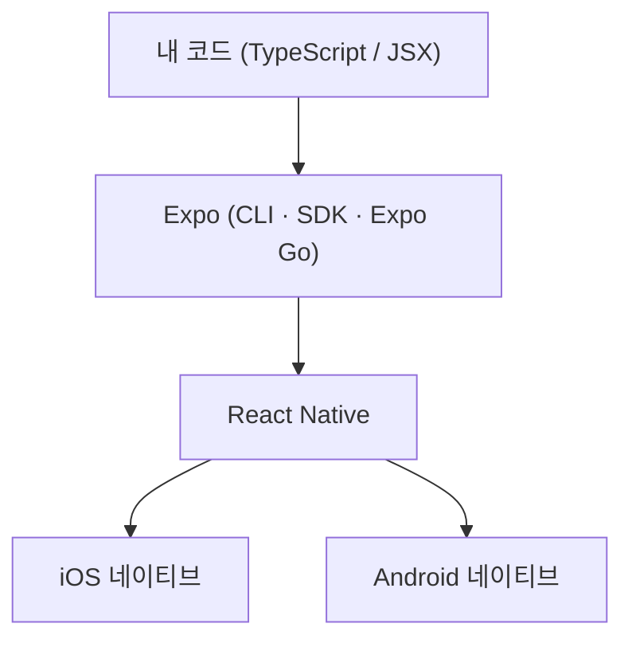

# 1. 들어가며

React로 웹은 만들어봤는데 모바일 앱은 어디서부터 시작해야 할지 막막했던 적이 있나요? React Native를 쓰면 우리가 이미 아는 React 문법으로 iOS/Android 앱을 만들 수 있습니다. 그런데 막상 시작하려고 하면 Xcode, Android Studio, 네이티브 빌드 설정 같은 장벽에 부딪힙니다.

이 장벽을 거의 없애주는 것이 바로 **Expo**입니다. 이 글에서는 Expo로 개발 환경을 만들고, 간단한 **Todo 앱**을 처음부터 끝까지 만들어 봅니다. 만들 기능은 다음과 같습니다.

- 할 일 추가 / 완료 토글 / 삭제
- 앱을 껐다 켜도 목록이 유지되도록 데이터 저장

이 글은 React(컴포넌트, JSX, `useState`)에 익숙한 분을 대상으로 하며, React 문법보다는 **"Expo로 어떻게 개발하는가"**에 초점을 맞춥니다. 완성된 전체 코드는 [GitHub 저장소](https://github.com/kenshin579/tutorials-go/tree/master/web/expo-todo-app)에서 볼 수 있습니다.

> 환경은 macOS 기준이며, [Node.js](https://nodejs.org/) LTS 버전이 설치되어 있다고 가정합니다.

# 2. Expo란? 왜 Expo인가

**React Native**는 JavaScript/TypeScript로 작성한 코드를 실제 네이티브 UI로 렌더링해주는 프레임워크입니다. 즉, 웹뷰로 흉내 낸 앱이 아니라 진짜 네이티브 앱이 만들어집니다.

문제는 순수 React Native만으로 시작하려면 Xcode와 Android Studio를 설치하고 네이티브 빌드 환경을 직접 구성해야 한다는 점입니다. 입문자에게는 이 초기 설정 자체가 가장 큰 벽입니다.

**Expo**는 React Native 위에 얹힌 도구와 서비스 모음으로, 이 벽을 크게 낮춰줍니다.

- **네이티브 빌드 환경 없이 시작**: 명령어 하나로 프로젝트를 만들고 바로 실행할 수 있습니다.
- **Expo Go**: 앱스토어/플레이스토어에 있는 Expo Go 앱을 설치하면, QR 코드만 찍어서 내 폰에서 즉시 앱을 띄워볼 수 있습니다. 별도 빌드가 필요 없습니다.
- **풍부한 SDK**: 카메라, 위치, 알림, 로컬 저장소 같은 네이티브 기능을 패키지 설치만으로 사용할 수 있습니다.
- **EAS Build**: 나중에 실제 앱을 빌드하고 스토어에 배포할 때는 클라우드 빌드 서비스를 이용할 수 있습니다.

코드와 실행 환경의 관계를 그림으로 보면 다음과 같습니다.



우리는 `App.tsx`에 코드를 작성하고, Expo가 이를 React Native로 연결해 각 플랫폼의 네이티브 화면으로 그려주는 구조입니다.

# 3. 시작하기: 프로젝트 생성부터 실행까지

먼저 Node가 설치되어 있는지 확인합니다.

```bash
node -v
```

이제 `create-expo-app`으로 프로젝트를 생성합니다. 여기서는 **blank TypeScript 템플릿**을 사용합니다.

```bash
npx create-expo-app@latest my-todo-app --template blank-typescript
```

> Expo의 기본 템플릿은 파일 기반 라우팅(Expo Router)과 탭 네비게이션이 포함되어 있어 입문용으로는 다소 무겁습니다. 그래서 빈 화면 하나로 시작하는 `blank-typescript` 템플릿을 골랐습니다. Expo Router는 7장에서 키워드만 짚고 넘어갑니다.

생성이 끝나면 프로젝트 폴더로 이동해 개발 서버를 띄웁니다.

```bash
cd my-todo-app
npx expo start
```

터미널에 QR 코드와 함께 실행 옵션 메뉴가 나타납니다. 상황에 맞게 하나를 고르면 됩니다.

- **Expo Go (가장 간편)**: 폰에 [Expo Go](https://expo.dev/go) 앱을 설치하고 터미널의 QR 코드를 스캔합니다.
- `i`: iOS 시뮬레이터에서 실행 (macOS + Xcode 필요)
- `a`: Android 에뮬레이터에서 실행 (Android Studio 필요)
- `w`: 웹 브라우저에서 실행

실행하면 "Open up App.tsx to start working on your app!"이라는 기본 화면이 보입니다. 여기까지 왔다면 개발 환경 준비는 끝났습니다.

> 📸 **[스크린샷 TODO]** `expo start` 실행 시 터미널에 나타나는 QR 코드 + 실행 옵션 메뉴, 그리고 시뮬레이터/Expo Go에 뜬 기본 앱 화면.

## iOS 시뮬레이터가 없다면?

iOS 시뮬레이터는 **macOS + Xcode**가 있어야만 동작합니다. Xcode가 없거나, Windows/Linux를 쓰거나, 설치가 부담스럽다면 시뮬레이터 없이도 충분히 실행할 수 있습니다.

- **실기기 + Expo Go (가장 추천)**: 폰에 Expo Go 앱을 설치하고 `npx expo start`의 QR 코드를 스캔하면 됩니다. iOS는 기본 카메라 앱으로, Android는 Expo Go 안의 스캐너로 찍습니다. 이때 **PC와 폰이 같은 Wi-Fi**에 있어야 하며, 회사망 등으로 연결이 안 되면 `npx expo start --tunnel`로 우회할 수 있습니다.
- **웹 브라우저**: `npx expo start --web`(또는 `w` 키)로 아무 설치 없이 바로 확인할 수 있습니다. 우리가 만들 Todo 앱은 웹에서도 동작하며, AsyncStorage가 웹에서는 브라우저 `localStorage`로 처리되어 새로고침 후에도 목록이 유지됩니다. 다만 실제 모바일과 미세한 차이는 있을 수 있습니다.
- **Android 에뮬레이터**: Android Studio가 있다면 AVD를 만들어 `a` 키로 실행할 수 있습니다.

iOS 시뮬레이터를 꼭 쓰고 싶다면 Mac 앱스토어에서 Xcode를 설치한 뒤, **Xcode → Settings → Components(또는 Platforms)**에서 iOS 시뮬레이터 런타임을 내려받고 `npx expo start`에서 `i` 키를 누르면 됩니다.

> 빠르게 화면만 확인하려면 **웹**, 진짜 모바일 감각이 필요하면 **실기기 + Expo Go**를 추천합니다. iOS 시뮬레이터 설치는 선택 사항입니다.

# 4. 프로젝트 구조 살펴보기

생성된 프로젝트의 핵심 파일만 살펴보겠습니다.

```
my-todo-app/
├── App.tsx          # 앱의 진입점. 화면을 그리는 곳
├── app.json         # 앱 이름, 아이콘, 스플래시 등 Expo 설정
├── package.json     # 의존성 목록
├── tsconfig.json    # TypeScript 설정 (expo/tsconfig.base 확장)
└── assets/          # 아이콘, 스플래시 이미지 등 리소스
```

우리가 거의 모든 시간을 보낼 곳은 **`App.tsx`** 한 파일입니다. 웹의 `index.html`이나 루트 컴포넌트처럼, 앱을 열면 가장 먼저 이 컴포넌트가 화면에 그려집니다.

한 가지 더, Expo는 **Fast Refresh**를 지원합니다. `App.tsx`를 수정하고 저장하면 앱을 다시 시작할 필요 없이 변경 사항이 화면에 즉시 반영됩니다. 웹 개발의 HMR(Hot Module Replacement)과 같은 경험이라고 보면 됩니다.

이제 본격적으로 Todo 앱을 만들어 보겠습니다.

# 5. Todo 앱 만들기

이제 `App.tsx`에 Todo 앱을 구현합니다. 화면 구성과 상태 관리는 우리가 아는 React와 거의 같으니, 여기서는 **웹과 다른 부분과 Expo다운 부분**만 짚겠습니다. 전체 코드는 [GitHub](https://github.com/kenshin579/tutorials-go/tree/master/web/expo-todo-app)에서 볼 수 있습니다.

React Native에서는 웹 태그 대신 전용 컴포넌트를 사용합니다.

- `View` / `Text`: `<div>` / `<p>`에 해당. 모든 텍스트는 반드시 `Text` 안에 넣습니다.
- `TextInput`: 입력창. `onChange`가 아니라 `onChangeText`로 값을 받습니다.
- `FlatList`: 목록 렌더링. 화면에 보이는 항목만 그리는 가상화 리스트입니다.
- `TouchableOpacity`: 버튼 역할의 터치 영역.
- 스타일은 CSS 파일이 아니라 `StyleSheet.create`로 만든 객체로 작성합니다(속성은 카멜케이스, 레이아웃은 Flexbox가 기본).

상태와 핵심 로직(추가/완료/삭제)은 평범한 React 코드입니다.

```tsx
type Todo = { id: string; text: string; done: boolean };

const [todos, setTodos] = useState<Todo[]>([]);
const [text, setText] = useState('');

const addTodo = () => {
  const trimmed = text.trim();
  if (!trimmed) return;
  setTodos((prev) => [
    { id: Date.now().toString(), text: trimmed, done: false },
    ...prev,
  ]);
  setText('');
};

const toggleTodo = (id: string) => {
  setTodos((prev) =>
    prev.map((t) => (t.id === id ? { ...t, done: !t.done } : t)),
  );
};

const deleteTodo = (id: string) => {
  setTodos((prev) => prev.filter((t) => t.id !== id));
};
```

화면은 입력창(`TextInput` + 추가 버튼)과 목록(`FlatList`)으로 구성하고, 항목을 탭하면 완료를 토글, "삭제"를 누르면 제거합니다. 전체 JSX와 스타일(`StyleSheet`)은 분량이 있으니 [GitHub 소스](https://github.com/kenshin579/tutorials-go/tree/master/web/expo-todo-app)를 참고하세요. 여기까지면 메모리상에서 동작하는 Todo 앱이 완성됩니다.

> 📸 **[스크린샷 TODO]** 할 일을 몇 개 추가하고 일부를 완료(취소선) 처리한 Todo 앱 화면. 이 글에서 가장 중요한 스크린샷.

## 데이터 유지하기 (AsyncStorage)

지금 앱은 껐다 켜면 할 일이 모두 사라집니다. 모든 상태가 메모리에만 있기 때문입니다. 기기에 데이터를 저장하려면 **AsyncStorage**(키-값 형태의 비동기 로컬 저장소)를 사용합니다.

여기서 Expo의 진짜 강점이 드러납니다. 네이티브 모듈을 추가할 때 `npm install` 대신 **`npx expo install`**을 사용합니다.

```bash
npx expo install @react-native-async-storage/async-storage
```

`expo install`은 현재 프로젝트의 Expo SDK 버전과 **호환되는 버전**을 자동으로 골라 설치해줍니다. 네이티브 모듈은 SDK 버전에 따라 호환성이 민감한데, 이를 Expo가 알아서 맞춰주는 것입니다. 게다가 네이티브 코드를 직접 건드리거나 프로젝트를 eject할 필요도 없습니다.

이제 `useEffect`로 (1) 앱이 시작될 때 저장된 목록을 불러오고, (2) 목록이 바뀔 때마다 저장합니다.

```tsx
const STORAGE_KEY = '@expo_todo_app/todos';

const [loaded, setLoaded] = useState(false);

// 앱 시작 시 저장된 todo 불러오기
useEffect(() => {
  (async () => {
    const raw = await AsyncStorage.getItem(STORAGE_KEY);
    if (raw) setTodos(JSON.parse(raw));
    setLoaded(true);
  })();
}, []);

// todos가 바뀔 때마다 저장 (최초 로드 완료 후)
useEffect(() => {
  if (!loaded) return;
  AsyncStorage.setItem(STORAGE_KEY, JSON.stringify(todos));
}, [todos, loaded]);
```

`loaded` 플래그가 있는 이유는, 최초 불러오기가 끝나기 전에 저장 effect가 실행되어 빈 배열로 기존 데이터를 덮어쓰는 것을 막기 위해서입니다. 이제 항목을 추가한 뒤 앱을 완전히 종료했다 다시 열어도 목록이 그대로 유지됩니다.

> 📸 **[스크린샷 TODO]** (선택) 앱을 종료했다 다시 실행해도 목록이 유지되는 모습. 재시작 전/후 두 장 또는 GIF면 더 좋음.

# 6. Expo의 한계와 고려사항

Expo는 시작을 쉽게 해주지만 만능은 아닙니다. 실무에 적용하기 전에 알아두면 좋은 한계점들이 있습니다.

- **Expo Go에서는 SDK에 포함된 네이티브 모듈만 쓸 수 있다.** 임의의 서드파티 네이티브 라이브러리(예: 특정 결제 SDK, 블루투스 라이브러리)는 Expo Go 앱에서 바로 동작하지 않습니다. 이때는 **development build**(직접 빌드한 개발용 앱)를 만들어야 합니다. 즉 "Expo Go로 QR 찍어 바로 실행"의 편리함은 순수 JS와 내장 모듈 범위에서만 유효합니다.
- **최신 네이티브 기능 반영이 늦을 수 있다.** 새 OS 기능이나 특정 네이티브 SDK는 Expo SDK에 포함되기까지 시간이 걸리거나, **config plugin**을 직접 작성해야 할 수도 있습니다.
- **버전이 Expo SDK에 묶인다.** React Native나 일부 라이브러리 버전을 마음대로 올리기 어렵고, Expo SDK 업그레이드 주기를 따라가야 합니다. `expo install`이 호환 버전을 강제하는 것은 편리함인 동시에 제약이기도 합니다.
- **빌드·배포는 결국 네이티브 영역이다.** 스토어에 올리려면 EAS Build(클라우드 빌드, 무료 한도 있음) 또는 로컬 네이티브 빌드가 필요합니다. 개발은 쉬워도 배포 단계에서는 네이티브 빌드의 현실을 마주하게 됩니다.
- **앱 용량과 저수준 제어.** Expo 런타임이 포함되어 바이너리 크기가 다소 커질 수 있고, 고성능 그래픽이나 특수 하드웨어 제어처럼 네이티브를 세밀하게 다뤄야 하는 앱에는 제약이 있을 수 있습니다.

> 참고로 예전의 "eject"(Expo를 떼어내 순수 네이티브 프로젝트로 전환) 개념은 현재 **prebuild**와 development build로 대체되었습니다. 이제는 Expo를 유지하면서도 필요한 네이티브 코드를 추가하는 방식이 일반적이라, "Expo로 시작하면 나중에 막힌다"는 과거의 우려는 많이 해소되었습니다.

정리하면 **대부분의 일반적인 앱은 Expo로 충분**하며, 위 한계들은 주로 깊은 네이티브 커스터마이징이 필요한 경우에 해당합니다.

# 7. 마무리

Expo로 React Native 앱을 시작하는 흐름을 정리하면 다음과 같습니다.

1. `create-expo-app`으로 프로젝트 생성
2. `expo start`로 Expo Go·시뮬레이터에서 즉시 실행
3. `App.tsx`에 화면과 로직 작성 (Fast Refresh로 바로 확인)
4. `View`/`Text`/`TextInput`/`FlatList` 같은 RN 컴포넌트로 UI 구성
5. `expo install`로 네이티브 모듈(AsyncStorage)을 손쉽게 추가

복잡한 네이티브 설정 없이 React 지식만으로 동작하는 앱을 만들 수 있다는 점이 Expo의 핵심 매력입니다.

다음 단계로 살펴보면 좋은 주제는 다음과 같습니다.

- **Expo Router**: 파일 기반 라우팅으로 여러 화면과 탭 네비게이션 구성
- **EAS Build**: 클라우드에서 앱을 빌드하고 앱스토어/플레이스토어에 배포
- 다양한 **Expo SDK**(카메라, 위치, 알림 등) 활용

# 8. 참고

- [Expo 공식 문서](https://docs.expo.dev/)
- [create-expo-app 문서](https://docs.expo.dev/more/create-expo/)
- [AsyncStorage 문서](https://react-native-async-storage.github.io/async-storage/)
- [전체 소스 코드 (GitHub)](https://github.com/kenshin579/tutorials-go/tree/master/web/expo-todo-app)
