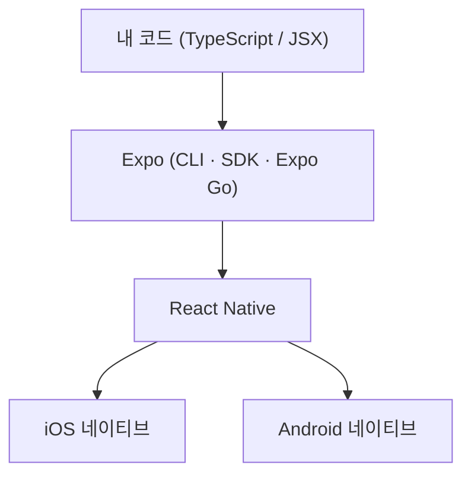

# 1. 들어가며

React로 웹은 만들어봤는데 모바일 앱은 어디서부터 시작해야 할지 막막했던 적이 있나요? React Native를 쓰면 우리가 이미 아는 React 문법으로 iOS/Android 앱을 만들 수 있습니다. 그런데 막상 시작하려고 하면 Xcode, Android Studio, 네이티브 빌드 설정 같은 장벽에 부딪힙니다.

이 장벽을 거의 없애주는 것이 바로 **Expo**입니다. 이 글에서는 Expo로 개발 환경을 만들고, 간단한 **Todo 앱**을 처음부터 끝까지 만들어 봅니다. 만들 기능은 다음과 같습니다.

- 할 일 추가 / 완료 토글 / 삭제
- 앱을 껐다 켜도 목록이 유지되도록 데이터 저장

이 글은 React(컴포넌트, JSX, `useState`)에 익숙한 분을 대상으로 하며, React 문법보다는 **"Expo로 어떻게 개발하는가"**에 초점을 맞춥니다. 완성된 전체 코드는 [GitHub 저장소](https://github.com/kenshin579/tutorials-go/tree/master/web/expo-todo-app)에서 볼 수 있습니다.

> 환경은 macOS 기준이며, [Node.js](https://nodejs.org/) LTS 버전이 설치되어 있다고 가정합니다.

# 2. Expo란? 왜 Expo인가

**React Native**는 JavaScript/TypeScript로 작성한 코드를 실제 네이티브 UI로 렌더링해주는 프레임워크입니다. 즉, 웹뷰로 흉내 낸 앱이 아니라 진짜 네이티브 앱이 만들어집니다.

문제는 순수 React Native만으로 시작하려면 Xcode와 Android Studio를 설치하고 네이티브 빌드 환경을 직접 구성해야 한다는 점입니다. 입문자에게는 이 초기 설정 자체가 가장 큰 벽입니다.

**Expo**는 React Native 위에 얹힌 도구와 서비스 모음으로, 이 벽을 크게 낮춰줍니다.

- **네이티브 빌드 환경 없이 시작**: 명령어 하나로 프로젝트를 만들고 바로 실행할 수 있습니다.
- **Expo Go**: 앱스토어/플레이스토어에 있는 Expo Go 앱을 설치하면, QR 코드만 찍어서 내 폰에서 즉시 앱을 띄워볼 수 있습니다. 별도 빌드가 필요 없습니다.
- **풍부한 SDK**: 카메라, 위치, 알림, 로컬 저장소 같은 네이티브 기능을 패키지 설치만으로 사용할 수 있습니다.
- **EAS Build**: 나중에 실제 앱을 빌드하고 스토어에 배포할 때는 클라우드 빌드 서비스를 이용할 수 있습니다.

코드와 실행 환경의 관계를 그림으로 보면 다음과 같습니다.



우리는 `App.tsx`에 코드를 작성하고, Expo가 이를 React Native로 연결해 각 플랫폼의 네이티브 화면으로 그려주는 구조입니다.

# 3. 시작하기: 프로젝트 생성부터 실행까지

먼저 Node가 설치되어 있는지 확인합니다.

```bash
node -v
```

이제 `create-expo-app`으로 프로젝트를 생성합니다. 여기서는 **blank TypeScript 템플릿**을 사용합니다.

```bash
npx create-expo-app@latest my-todo-app --template blank-typescript
```

> Expo의 기본 템플릿은 파일 기반 라우팅(Expo Router)과 탭 네비게이션이 포함되어 있어 입문용으로는 다소 무겁습니다. 그래서 빈 화면 하나로 시작하는 `blank-typescript` 템플릿을 골랐습니다. Expo Router는 7장에서 키워드만 짚고 넘어갑니다.

생성이 끝나면 프로젝트 폴더로 이동해 개발 서버를 띄웁니다.

```bash
cd my-todo-app
npx expo start
```

터미널에 QR 코드와 함께 실행 옵션 메뉴가 나타납니다. 상황에 맞게 하나를 고르면 됩니다.

- **Expo Go (가장 간편)**: 폰에 [Expo Go](https://expo.dev/go) 앱을 설치하고 터미널의 QR 코드를 스캔합니다.
- `i`: iOS 시뮬레이터에서 실행 (macOS + Xcode 필요)
- `a`: Android 에뮬레이터에서 실행 (Android Studio 필요)
- `w`: 웹 브라우저에서 실행

실행하면 "Open up App.tsx to start working on your app!"이라는 기본 화면이 보입니다. 여기까지 왔다면 개발 환경 준비는 끝났습니다.

# 4. 프로젝트 구조 살펴보기

생성된 프로젝트의 핵심 파일만 살펴보겠습니다.

```
my-todo-app/
├── App.tsx          # 앱의 진입점. 화면을 그리는 곳
├── app.json         # 앱 이름, 아이콘, 스플래시 등 Expo 설정
├── package.json     # 의존성 목록
├── tsconfig.json    # TypeScript 설정 (expo/tsconfig.base 확장)
└── assets/          # 아이콘, 스플래시 이미지 등 리소스
```

우리가 거의 모든 시간을 보낼 곳은 **`App.tsx`** 한 파일입니다. 웹의 `index.html`이나 루트 컴포넌트처럼, 앱을 열면 가장 먼저 이 컴포넌트가 화면에 그려집니다.

한 가지 더, Expo는 **Fast Refresh**를 지원합니다. `App.tsx`를 수정하고 저장하면 앱을 다시 시작할 필요 없이 변경 사항이 화면에 즉시 반영됩니다. 웹 개발의 HMR(Hot Module Replacement)과 같은 경험이라고 보면 됩니다.

이제 본격적으로 Todo 앱을 만들어 보겠습니다.

# 5. Todo 앱 만들기

`App.tsx`를 단계별로 채워 나가겠습니다. 코드는 조금씩 쌓아가지만, 최종 전체 코드는 [GitHub](https://github.com/kenshin579/tutorials-go/tree/master/web/expo-todo-app)에서 한 번에 볼 수 있습니다.

## 5.1 화면 골격

React Native에서는 웹의 `<div>`, `<p>` 대신 **`View`**(레이아웃 컨테이너)와 **`Text`**(텍스트)를 사용합니다. 모든 텍스트는 반드시 `Text` 안에 들어가야 한다는 점이 웹과 다릅니다.

스타일은 CSS 파일이 아니라 `StyleSheet.create`로 만든 **객체**로 작성하고 `style` prop에 넘깁니다. 속성 이름은 `background-color`가 아니라 `backgroundColor`처럼 카멜케이스입니다.

```tsx
import {
  SafeAreaView,
  StyleSheet,
  Text,
  View,
} from 'react-native';
import { StatusBar } from 'expo-status-bar';

export default function App() {
  return (
    <SafeAreaView style={styles.container}>
      <StatusBar style="auto" />
      <Text style={styles.title}>할 일 목록</Text>
    </SafeAreaView>
  );
}

const styles = StyleSheet.create({
  container: {
    flex: 1,
    backgroundColor: '#fff',
    paddingHorizontal: 20,
  },
  title: {
    fontSize: 28,
    fontWeight: 'bold',
    marginVertical: 16,
  },
});
```

`SafeAreaView`는 노치나 상태 표시줄에 콘텐츠가 가려지지 않도록 안전 영역 안에 화면을 그려줍니다.

## 5.2 입력 받기

이제 할 일을 입력받을 차례입니다. 먼저 할 일 하나의 형태를 타입으로 정의합니다.

```tsx
type Todo = {
  id: string;
  text: string;
  done: boolean;
};
```

입력값과 할 일 목록은 `useState`로 관리합니다. 텍스트 입력은 **`TextInput`** 컴포넌트를 쓰며, 웹의 `<input>`과 달리 `onChange`가 아니라 **`onChangeText`**로 값이 바로 문자열로 넘어옵니다.

```tsx
import { useState } from 'react';

export default function App() {
  const [todos, setTodos] = useState<Todo[]>([]);
  const [text, setText] = useState('');

  const addTodo = () => {
    const trimmed = text.trim();
    if (!trimmed) return;
    setTodos((prev) => [
      { id: Date.now().toString(), text: trimmed, done: false },
      ...prev,
    ]);
    setText('');
  };

  // ... return 안에 입력 영역 추가
}
```

입력창과 추가 버튼은 `View`로 가로 배치합니다. 버튼 역할은 **`TouchableOpacity`**(누르면 살짝 흐려지는 터치 영역)로 만듭니다.

```tsx
<View style={styles.inputRow}>
  <TextInput
    style={styles.input}
    placeholder="무엇을 해야 하나요?"
    value={text}
    onChangeText={setText}
    onSubmitEditing={addTodo}
    returnKeyType="done"
  />
  <TouchableOpacity style={styles.addButton} onPress={addTodo}>
    <Text style={styles.addButtonText}>추가</Text>
  </TouchableOpacity>
</View>
```

## 5.3 목록 렌더링

목록은 웹에서처럼 `.map()`으로 그릴 수도 있지만, React Native에서는 **`FlatList`**를 권장합니다. 화면에 보이는 항목만 렌더링하는 가상화 리스트라 항목이 많아져도 성능이 좋습니다.

```tsx
<FlatList
  data={todos}
  keyExtractor={(item) => item.id}
  ListEmptyComponent={
    <Text style={styles.empty}>아직 할 일이 없어요 🎉</Text>
  }
  renderItem={({ item }) => (
    // 각 할 일 항목 (5.4에서 구현)
  )}
/>
```

- `data`: 렌더링할 배열
- `keyExtractor`: 각 항목의 고유 key
- `renderItem`: 항목 하나를 그리는 함수
- `ListEmptyComponent`: 목록이 비었을 때 보여줄 컴포넌트

## 5.4 추가 / 완료 / 삭제

항목을 탭하면 완료 상태를 토글하고, "삭제"를 누르면 목록에서 제거합니다.

```tsx
const toggleTodo = (id: string) => {
  setTodos((prev) =>
    prev.map((t) => (t.id === id ? { ...t, done: !t.done } : t)),
  );
};

const deleteTodo = (id: string) => {
  setTodos((prev) => prev.filter((t) => t.id !== id));
};
```

`renderItem`은 다음과 같이 채웁니다. 완료된 항목은 취소선을 넣어 구분합니다.

```tsx
renderItem={({ item }) => (
  <View style={styles.item}>
    <TouchableOpacity
      style={styles.itemTextWrap}
      onPress={() => toggleTodo(item.id)}
    >
      <Text style={[styles.itemText, item.done && styles.itemTextDone]}>
        {item.done ? '✅ ' : '⬜️ '}
        {item.text}
      </Text>
    </TouchableOpacity>
    <TouchableOpacity onPress={() => deleteTodo(item.id)}>
      <Text style={styles.delete}>삭제</Text>
    </TouchableOpacity>
  </View>
)}
```

`style`에 배열을 넘기면 여러 스타일을 합칠 수 있고, `item.done && styles.itemTextDone`처럼 조건부로 스타일을 적용할 수 있습니다.

## 5.5 스타일링

마지막으로 지금까지 사용한 스타일을 모두 모은 `StyleSheet`입니다.

```tsx
const styles = StyleSheet.create({
  container: { flex: 1, backgroundColor: '#fff', paddingHorizontal: 20 },
  title: { fontSize: 28, fontWeight: 'bold', marginVertical: 16 },
  inputRow: { flexDirection: 'row', marginBottom: 16 },
  input: {
    flex: 1,
    borderWidth: 1,
    borderColor: '#ddd',
    borderRadius: 8,
    paddingHorizontal: 12,
    paddingVertical: 10,
    fontSize: 16,
    marginRight: 8,
  },
  addButton: {
    backgroundColor: '#2f6feb',
    borderRadius: 8,
    paddingHorizontal: 16,
    justifyContent: 'center',
  },
  addButtonText: { color: '#fff', fontSize: 16, fontWeight: '600' },
  item: {
    flexDirection: 'row',
    alignItems: 'center',
    justifyContent: 'space-between',
    paddingVertical: 12,
    borderBottomWidth: 1,
    borderBottomColor: '#f0f0f0',
  },
  itemTextWrap: { flex: 1 },
  itemText: { fontSize: 16 },
  itemTextDone: { textDecorationLine: 'line-through', color: '#aaa' },
  delete: { color: '#e5484d', fontSize: 14, marginLeft: 12 },
  empty: { textAlign: 'center', color: '#999', marginTop: 40, fontSize: 16 },
});
```

React Native의 레이아웃은 기본이 **Flexbox**입니다. 웹과 달리 `flexDirection`의 기본값이 `column`(세로)이라는 점만 기억하면, 나머지는 익숙한 CSS Flexbox와 거의 같습니다.

여기까지가 메모리상에서 동작하는 Todo 앱입니다. 항목을 추가하고, 탭해서 완료하고, 삭제할 수 있습니다. 전체 코드는 [GitHub](https://github.com/kenshin579/tutorials-go/tree/master/web/expo-todo-app)에서 확인할 수 있습니다.
