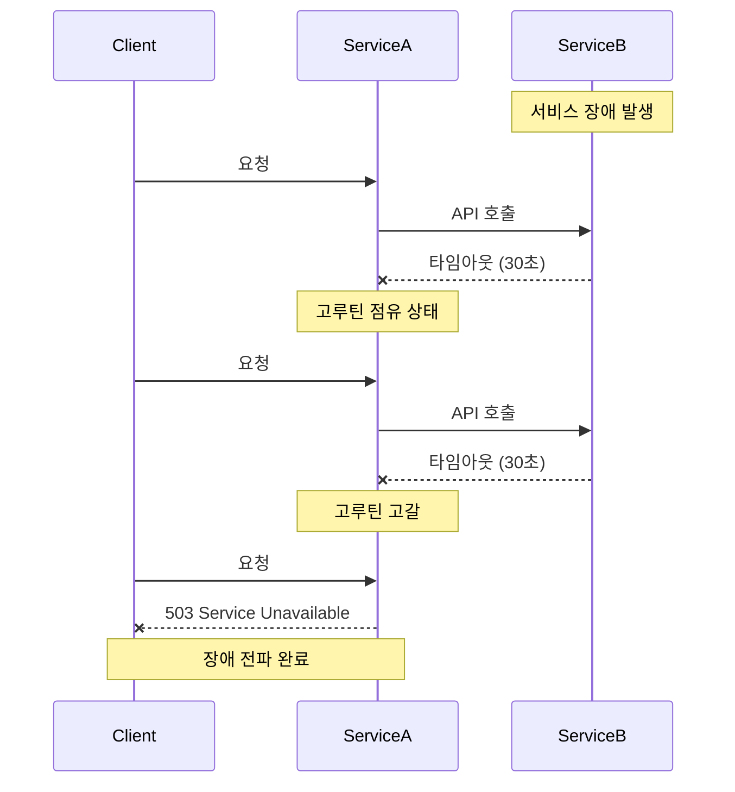
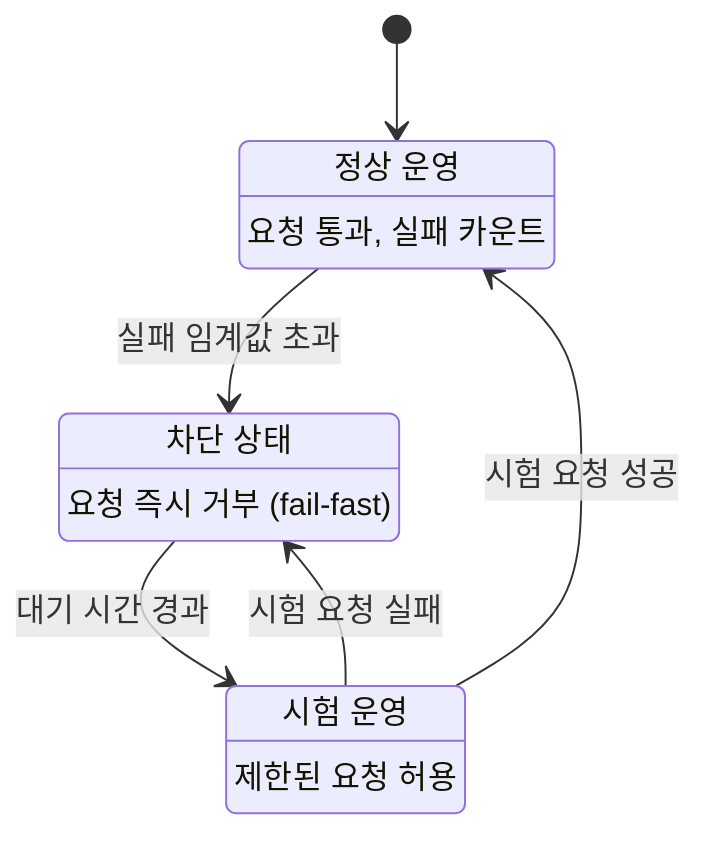
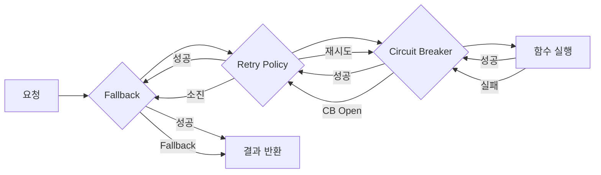

# 1. Circuit Breaker란?

마이크로서비스 환경에서 서비스 A가 서비스 B를 호출할 때, 서비스 B에 장애가 발생하면 어떻게 될까? 서비스 A는 응답을 기다리며 타임아웃이 발생할 때까지 고루틴을 점유하게 된다. 이런 요청이 쌓이면 서비스 A도 응답 불능 상태에 빠지고, 서비스 A를 호출하는 다른 서비스들까지 연쇄적으로 장애가 전파된다. 이를 **Cascading Failure**(연쇄 장애)라고 한다.



**Circuit Breaker**(서킷 브레이커)는 전기 회로의 차단기에서 이름을 따온 패턴이다. 과전류가 흐르면 차단기가 회로를 끊어 화재를 방지하듯, 소프트웨어에서도 외부 서비스 호출이 반복적으로 실패하면 해당 호출을 차단하여 장애 전파를 막는다.

핵심 아이디어는 단순하다:

- 실패가 일정 횟수 이상 누적되면 **호출 자체를 차단**한다 (fail-fast)
- 일정 시간 후 **시험 요청**을 보내 서비스 복구 여부를 확인한다
- 복구가 확인되면 **정상 운영**으로 돌아간다

# 2. Circuit Breaker 상태 머신

Circuit Breaker는 3가지 상태를 가진 상태 머신(State Machine)으로 동작한다.

## 2.1 3가지 상태



| 상태 | 설명 | 동작 |
|---|---|---|
| **Closed** (닫힘) | 정상 운영 상태 | 모든 요청이 통과하며 실패 횟수를 카운트한다 |
| **Open** (열림) | 차단 상태 | 모든 요청을 즉시 거부하여 불필요한 대기를 방지한다 |
| **Half-Open** (반열림) | 시험 운영 상태 | 제한된 수의 요청만 허용하여 서비스 복구 여부를 확인한다 |

## 2.2 상태 전이 조건

- **Closed → Open**: 실패율이 설정한 임계값을 초과하면 회로를 연다
- **Open → Half-Open**: 설정한 대기 시간(timeout)이 경과하면 시험 모드로 전환한다
- **Half-Open → Closed**: 시험 요청이 성공하면 정상 운영으로 복귀한다
- **Half-Open → Open**: 시험 요청이 실패하면 다시 차단 상태로 돌아간다

## 2.3 Count-based vs Time-based Thresholding

Circuit Breaker가 언제 Open으로 전환할지 판단하는 기준은 두 가지 방식이 있다.

| 기준 | Count-based | Time-based |
|---|---|---|
| **방식** | 연속 N회 실패 시 Open | 시간 윈도우 내 실패율 기준 |
| **장점** | 구현이 간단하고 직관적 | 트래픽 변동에 유연하게 대응 |
| **단점** | 트래픽이 적을 때 과민 반응 가능 | 구현이 복잡하고 메모리 사용 증가 |
| **적합한 경우** | 일정한 트래픽, 간단한 구성 | 트래픽 변동이 큰 환경, 정밀 제어 |
| **예시** | 5회 연속 실패 → Open | 1분간 실패율 60% 초과 → Open |

# 3. Go 구현 - sony/gobreaker

[sony/gobreaker](https://github.com/sony/gobreaker)는 Go에서 가장 널리 사용되는 Circuit Breaker 라이브러리다. Sony에서 개발했으며 3.5k+ 스타를 보유하고 있다. v2에서 Go 제네릭을 지원하여 타입 안전한 사용이 가능해졌다.

## 3.1 기본 사용법

```bash
go get github.com/sony/gobreaker/v2
```

Circuit Breaker 생성 시 `Settings` 구조체로 동작을 설정한다.

```go
func NewBreaker(name string) *gobreaker.CircuitBreaker[[]byte] {
    settings := gobreaker.Settings{
        Name:        name,
        MaxRequests: 3,                // Half-Open 상태에서 허용할 요청 수
        Interval:    10 * time.Second, // Closed 상태 카운터 초기화 주기
        Timeout:     30 * time.Second, // Open → Half-Open 전환 대기 시간
        ReadyToTrip: func(counts gobreaker.Counts) bool {
            return counts.ConsecutiveFailures > 5
        },
        OnStateChange: func(name string, from, to gobreaker.State) {
            log.Printf("Circuit Breaker %s: %s → %s", name, from, to)
        },
    }
    return gobreaker.NewCircuitBreaker[[]byte](settings)
}
```

주요 설정 필드:

| 필드 | 타입 | 기본값 | 설명 |
|---|---|---|---|
| `MaxRequests` | `uint32` | `1` | Half-Open에서 허용할 최대 요청 수 |
| `Interval` | `time.Duration` | `0` | Closed 상태에서 카운터 초기화 주기 (0이면 초기화 안 함) |
| `Timeout` | `time.Duration` | `60s` | Open → Half-Open 전환 대기 시간 |
| `ReadyToTrip` | `func(Counts) bool` | 연속 5회 실패 | Open 전환 조건 |
| `OnStateChange` | `func(name, from, to)` | `nil` | 상태 전이 콜백 |

`Execute` 메서드로 보호할 함수를 실행한다. Circuit Breaker가 Open이면 `gobreaker.ErrOpenState`를 즉시 반환한다.

```go
result, err := cb.Execute(func() ([]byte, error) {
    // 외부 서비스 호출
    return callExternalAPI()
})
if errors.Is(err, gobreaker.ErrOpenState) {
    // Circuit이 열려있어 요청이 차단됨
}
```

## 3.2 HTTP 클라이언트에 적용

실무에서 가장 흔한 사용 사례는 HTTP 클라이언트를 Circuit Breaker로 래핑하는 것이다. 5xx 서버 오류를 실패로 처리하여 Circuit Breaker에 반영한다.

```go
type ProtectedHTTPClient struct {
    client  *http.Client
    breaker *gobreaker.CircuitBreaker[*http.Response]
}

func (c *ProtectedHTTPClient) Do(req *http.Request) (*http.Response, error) {
    return c.breaker.Execute(func() (*http.Response, error) {
        resp, err := c.client.Do(req)
        if err != nil {
            return nil, err
        }
        if resp.StatusCode >= 500 {
            return resp, fmt.Errorf("server error: %d", resp.StatusCode)
        }
        return resp, nil
    })
}
```

테스트에서 상태 전이를 검증하는 예제다:

```go
func TestHTTP_RecoveryAfterServerFix(t *testing.T) {
    var shouldFail atomic.Bool
    shouldFail.Store(true)

    server := httptest.NewServer(http.HandlerFunc(func(w http.ResponseWriter, r *http.Request) {
        if shouldFail.Load() {
            w.WriteHeader(http.StatusInternalServerError)
            return
        }
        w.WriteHeader(http.StatusOK)
    }))
    defer server.Close()

    client := newTestHTTPClient()

    // 서버 장애로 Circuit Open
    for i := 0; i < 3; i++ {
        req, _ := http.NewRequest(http.MethodGet, server.URL, nil)
        client.Do(req)
    }
    assert.Equal(t, gobreaker.StateOpen, client.State())

    // 서버 복구 후 Half-Open → Closed 복귀
    shouldFail.Store(false)
    time.Sleep(1200 * time.Millisecond)

    req, _ := http.NewRequest(http.MethodGet, server.URL, nil)
    resp, err := client.Do(req)
    require.NoError(t, err)
    assert.Equal(t, http.StatusOK, resp.StatusCode)
    assert.Equal(t, gobreaker.StateClosed, client.State())
}
```

# 4. Go 구현 - failsafe-go

## 4.1 failsafe-go 소개

[failsafe-go](https://github.com/failsafe-go/failsafe-go)는 Java의 [Failsafe](https://github.com/failsafe-lib/failsafe) 라이브러리를 Go로 포팅한 통합 Resilience 라이브러리다 (2.2k+ stars, 2026년 2월 기준 최신 업데이트). gobreaker가 Circuit Breaker만 제공하는 반면, failsafe-go는 다음 정책들을 **조합 가능한 아키텍처**로 제공한다:

- **Circuit Breaker**: Count-based + Time-based 모두 지원
- **Retry**: 지수 백오프, 지터 등 다양한 재시도 전략
- **Fallback**: 실패 시 대체값 반환
- **Timeout**: 실행 시간 제한
- **Hedge**: 지연 시 병렬 요청 전송

## 4.2 Circuit Breaker

```bash
go get github.com/failsafe-go/failsafe-go
```

**Count-based Circuit Breaker**:

```go
cb := circuitbreaker.NewBuilder[any]().
    HandleErrors(ErrExternal).
    WithFailureThreshold(5).       // 5회 연속 실패 시 Open
    WithSuccessThreshold(2).       // Half-Open에서 2회 연속 성공 시 Closed
    WithDelay(30 * time.Second).   // Open → Half-Open 전환 대기
    Build()
```

**Time-based Circuit Breaker** (gobreaker 대비 장점):

```go
cb := circuitbreaker.NewBuilder[any]().
    HandleErrors(ErrExternal).
    WithFailureThresholdPeriod(3, 1*time.Minute).  // 1분간 3회 실패 시 Open
    WithSuccessThreshold(2).
    WithDelay(30 * time.Second).
    Build()
```

`failsafe.With()`를 사용하여 Circuit Breaker로 보호된 함수를 실행한다:

```go
result, err := failsafe.With(cb).Get(func() (string, error) {
    return callExternalService()
})
```

상태 확인 메서드:

```go
cb.IsOpen()     // Circuit이 열려있는지
cb.IsClosed()   // 정상 운영 중인지
cb.IsHalfOpen() // 시험 운영 중인지
```

## 4.3 정책 조합 패턴

failsafe-go의 핵심 강점은 여러 정책을 **조합**할 수 있다는 점이다. `failsafe.With()` 에 정책을 나열하면 왼쪽에서 오른쪽 순서로 바깥 → 안쪽 정책이 된다.



**Fallback + Retry + Circuit Breaker 조합 코드**:

```go
// 1. Fallback: 모든 정책 실패 시 대체값 반환
fb := fallback.NewBuilderWithResult("cached-data").
    HandleErrors(ErrExternal, circuitbreaker.ErrOpen).
    Build()

// 2. Retry: 일시적 실패 시 재시도
rt := retrypolicy.NewBuilder[string]().
    HandleErrors(ErrExternal).
    WithMaxRetries(3).
    WithBackoff(100*time.Millisecond, 1*time.Second).
    Build()

// 3. Circuit Breaker: 반복 실패 시 호출 차단
cb := circuitbreaker.NewBuilder[string]().
    HandleErrors(ErrExternal).
    WithFailureThreshold(5).
    WithSuccessThreshold(2).
    WithDelay(30 * time.Second).
    Build()

// 조합 실행: Fallback → Retry → Circuit Breaker → fn
result, err := failsafe.With(fb, rt, cb).Get(func() (string, error) {
    return callExternalService()
})
```

**정책 순서에 따른 동작**:

1. **Circuit Breaker**가 먼저 요청 허용 여부를 결정한다
2. 함수 실행이 실패하면 **Retry**가 재시도한다
3. Retry가 소진되면 **Fallback**이 대체값을 반환한다

## 4.4 sony/gobreaker vs failsafe-go 비교

| 기능 | sony/gobreaker | failsafe-go |
|---|---|---|
| **GitHub Stars** | 3.5k+ | 2.2k+ |
| **Thresholding** | Count-based only | Count-based + Time-based |
| **정책 조합** | 불가 (CB만 제공) | 가능 (CB + Retry + Fallback + Timeout 등) |
| **제네릭 지원** | v2에서 지원 | 처음부터 지원 |
| **분산 환경** | Redis 기반 분산 CB 지원 | 미지원 |
| **학습 곡선** | 낮음 | 중간 |
| **추천 시나리오** | 단순 Circuit Breaker만 필요 | 복합 Resilience 전략 필요 |

- **gobreaker**: 단순한 Circuit Breaker만 필요하거나, 분산 환경에서 Redis 기반 공유 상태가 필요한 경우 적합
- **failsafe-go**: Retry, Fallback 등 여러 정책을 조합하거나, Time-based thresholding이 필요한 경우 적합

# 5. 실전 적용

## 5.1 Fallback 전략

Circuit Breaker가 Open이 되어 요청이 차단되었을 때, 사용자에게 에러만 보여주는 것은 좋지 않다. 상황에 맞는 Fallback 전략을 적용하면 사용자 경험을 개선할 수 있다.

| 전략 | 설명 | 적합한 경우 |
|---|---|---|
| **캐시 데이터 반환** | 마지막으로 성공한 응답을 캐시해두고 반환 | 실시간성이 낮은 데이터 (상품 목록, 설정값) |
| **기본값 사용** | 미리 정의된 기본값을 반환 | 추천 시스템, 설정 조회 |
| **대체 서비스 호출** | 백업 서비스나 다른 경로로 요청 | 결제 게이트웨이, CDN |
| **우아한 성능 저하** | 일부 기능만 제공하거나 간소화된 응답 반환 | 검색, 피드 서비스 |

```go
// 캐시 데이터를 활용한 Fallback 예시
fb := fallback.NewBuilderWithFunc(
    func(exec failsafe.Execution[ProductList]) (ProductList, error) {
        // 캐시에서 마지막 성공 데이터 반환
        cached, err := cache.Get("products")
        if err != nil {
            return ProductList{}, err
        }
        return cached, nil
    },
).Build()
```

## 5.2 테스트 전략

Circuit Breaker의 핵심은 **상태 전이**가 올바르게 동작하는지 검증하는 것이다.

**상태 전이 검증**: Closed → Open → Half-Open → Closed 전체 사이클을 테스트한다.

```go
func TestFullCycle(t *testing.T) {
    cb := newTestBreaker() // Timeout: 1초

    // 1. Closed → Open (연속 실패)
    for i := 0; i < 3; i++ {
        cb.Execute(func() ([]byte, error) {
            return nil, errService
        })
    }
    assert.Equal(t, gobreaker.StateOpen, cb.State())

    // 2. Open → Half-Open (Timeout 경과)
    time.Sleep(1200 * time.Millisecond)
    assert.Equal(t, gobreaker.StateHalfOpen, cb.State())

    // 3. Half-Open → Closed (성공)
    cb.Execute(func() ([]byte, error) {
        return []byte("ok"), nil
    })
    assert.Equal(t, gobreaker.StateClosed, cb.State())
}
```

**Mock 서버 활용**: `httptest.NewServer`로 실패/성공 시나리오를 시뮬레이션한다. `atomic.Bool`을 사용하면 테스트 도중 서버 동작을 동적으로 변경할 수 있다.

```go
var shouldFail atomic.Bool
shouldFail.Store(true)

server := httptest.NewServer(http.HandlerFunc(func(w http.ResponseWriter, r *http.Request) {
    if shouldFail.Load() {
        w.WriteHeader(http.StatusInternalServerError)
        return
    }
    w.WriteHeader(http.StatusOK)
}))
```

# 마무리

Circuit Breaker 패턴은 마이크로서비스 환경에서 서비스 안정성을 확보하기 위한 핵심 패턴이다. 정리하면:

- **Circuit Breaker**는 Closed → Open → Half-Open 3가지 상태로 동작하는 상태 머신이다
- **sony/gobreaker**는 가볍고 직관적인 Circuit Breaker 구현이다. 단독 CB만 필요하거나 분산 환경(Redis)이 필요하면 적합하다
- **failsafe-go**는 CB + Retry + Fallback 등을 조합할 수 있는 통합 Resilience 라이브러리다. Time-based thresholding이나 정책 조합이 필요하면 적합하다
- 실전에서는 **Fallback 전략**을 반드시 함께 적용하여 사용자 경험을 보장해야 한다

> 전체 샘플 코드는 [GitHub - tutorials-go/golang/resilience/circuitbreaker](https://github.com/kenshin579/tutorials-go/tree/master/golang/resilience/circuitbreaker)에서 확인할 수 있다.

# 참고

- [sony/gobreaker GitHub](https://github.com/sony/gobreaker)
- [failsafe-go GitHub](https://github.com/failsafe-go/failsafe-go)
- [failsafe-go Circuit Breaker 문서](https://failsafe-go.dev/circuit-breaker/)
- [Martin Fowler - Circuit Breaker](https://martinfowler.com/bliki/CircuitBreaker.html)
- [Microsoft - Circuit Breaker Pattern](https://learn.microsoft.com/en-us/azure/architecture/patterns/circuit-breaker)
