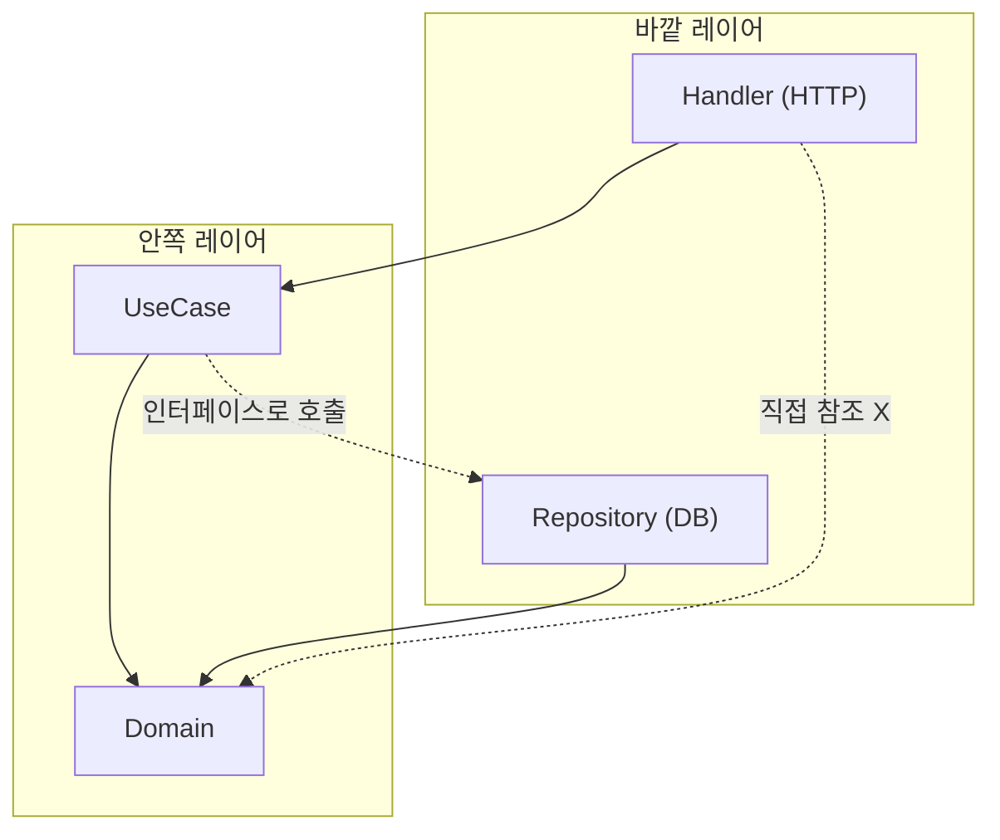
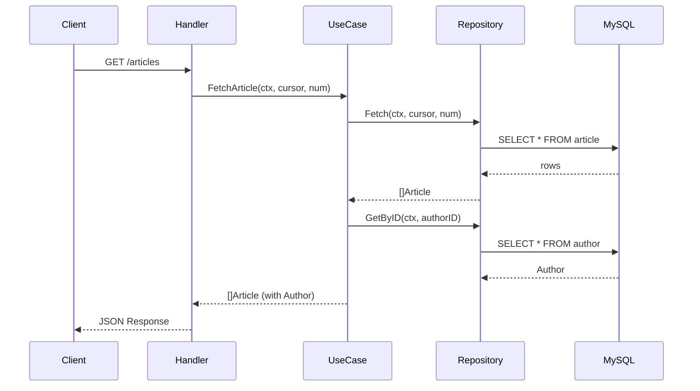
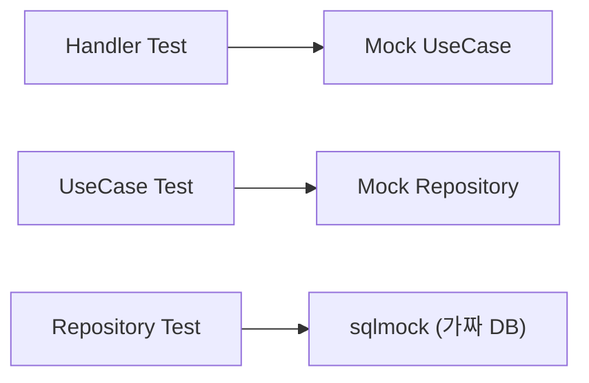

Go로 작은 CLI 도구나 간단한 API 서버를 만들 때는 파일 몇 개로 충분하다. 하지만 프로젝트가 커지면 "이 코드는 어디에 두어야 하지?"라는 질문이 반복된다. 비즈니스 로직이 HTTP 핸들러에 섞이고, 데이터베이스 쿼리가 여기저기 흩어지면 유지보수가 어려워진다.

이 글에서는 Go 프로젝트의 **디렉토리 구조 설계**와 **Clean Architecture** 적용 방법을 다룬다. Article CRUD API를 예제로, Domain → Repository → UseCase → Handler 레이어를 구현하고, V1(중첩형)과 V2(플랫형) 구조를 비교하며 프로젝트 레이아웃의 발전 과정을 살펴본다.

> 전체 예제 코드는 GitHub에서 확인할 수 있다: [V1](https://github.com/kenshin579/tutorials-go/tree/master/project-layout/go-clean-arch-v1) | [V2](https://github.com/kenshin579/tutorials-go/tree/master/project-layout/go-clean-arch-v2)

## 1. 들어가며

Go 프로젝트 구조에 대한 공식 표준은 없다. Go 팀은 "표준 레이아웃은 없다"고 명시하고 있다. 그러나 커뮤니티에서 널리 사용되는 관례가 있으며, 대표적인 것이 [golang-standards/project-layout](https://github.com/golang-standards/project-layout)이다.

이 레포지토리가 제안하는 핵심 디렉토리는 다음과 같다:

| 디렉토리 | 역할 |
|---|---|
| `cmd/` | 앱 진입점 (`main.go`) |
| `internal/` | 외부에 공개하지 않는 내부 패키지 |
| `pkg/` | 외부에서도 사용할 수 있는 공유 라이브러리 |
| `domain/` | 핵심 비즈니스 엔티티와 인터페이스 |

소규모 프로젝트에서는 플랫한 구조로 충분하지만, 프로젝트가 커질수록 레이어 분리가 필요해진다. 이때 **Clean Architecture**가 유용한 가이드라인이 된다.

## 2. Clean Architecture 개요

Uncle Bob(Robert C. Martin)이 제안한 Clean Architecture의 핵심 원칙은 **의존성 규칙(Dependency Rule)**이다:

> 소스 코드의 의존성은 반드시 **안쪽(고수준)**을 향해야 한다.



- **안쪽 레이어**(Domain)는 바깥 레이어를 알지 못한다
- **바깥 레이어**(Handler, Repository)는 안쪽 레이어에 의존한다
- **UseCase**는 Repository를 **인터페이스**로 참조하여 의존성을 역전한다

Go에서는 **인터페이스를 Domain 레이어에 정의**하고, 구현체는 바깥 레이어에 두는 방식으로 의존성 역전을 구현한다. 이 방식의 장점은:

- **테스트 용이**: Mock을 주입하여 각 레이어를 독립적으로 테스트
- **교체 용이**: MySQL → PostgreSQL 전환 시 Repository만 교체
- **관심사 분리**: 비즈니스 로직이 프레임워크나 DB에 종속되지 않음

각 레이어의 역할을 정리하면:

| 레이어 | 역할 | 의존 대상 |
|---|---|---|
| **Domain** | 엔티티, 인터페이스 정의 (비즈니스 규칙) | 없음 (최상위) |
| **Repository** | 데이터 접근 구현 (MySQL, Redis 등) | Domain |
| **UseCase** | 비즈니스 로직 오케스트레이션 | Domain, Repository (인터페이스) |
| **Handler** | HTTP 핸들러, 요청/응답 처리 | Domain, UseCase (인터페이스) |

## 3. 실전 예제: Article CRUD API

Article과 Author를 다루는 CRUD API를 Clean Architecture로 구현한다. 요청이 들어오면 각 레이어를 다음과 같이 거친다:



### 3.1 Domain 레이어

Domain은 Clean Architecture의 **핵심**이다. 외부 의존성 없이 엔티티와 인터페이스만 정의한다.

```go
// domain/article.go
type Article struct {
    ID        int64     `json:"id"`
    Title     string    `json:"title" validate:"required"`
    Content   string    `json:"content" validate:"required"`
    Author    Author    `json:"author"`
    UpdatedAt time.Time `json:"updated_at"`
    CreatedAt time.Time `json:"created_at"`
}

// UseCase 인터페이스 — 비즈니스 로직 계약
type ArticleUsecase interface {
    FetchArticle(ctx context.Context, cursor string, num int64) ([]Article, string, error)
    GetArticleByID(ctx context.Context, id int64) (Article, error)
    UpdateArticle(ctx context.Context, ar *Article) error
    GetArticleByTitle(ctx context.Context, title string) (Article, error)
    StoreArticle(context.Context, *Article) error
    DeleteArticleByID(ctx context.Context, id int64) error
}

// Repository 인터페이스 — 데이터 접근 계약
type ArticleRepository interface {
    Fetch(ctx context.Context, cursor string, num int64) (res []Article, nextCursor string, err error)
    GetByID(ctx context.Context, id int64) (Article, error)
    GetByTitle(ctx context.Context, title string) (Article, error)
    Update(ctx context.Context, ar *Article) error
    Store(ctx context.Context, a *Article) error
    Delete(ctx context.Context, id int64) error
}
```

```go
// domain/author.go
type Author struct {
    ID        int64  `json:"id"`
    Name      string `json:"name"`
    CreatedAt string `json:"created_at"`
    UpdatedAt string `json:"updated_at"`
}

type AuthorRepository interface {
    GetByID(ctx context.Context, id int64) (Author, error)
}
```

```go
// domain/errors.go
var (
    ErrInternalServerError = errors.New("Internal Server Error")
    ErrNotFound            = errors.New("Your requested Item is not found")
    ErrConflict            = errors.New("Your Item already exist")
    ErrBadParamInput       = errors.New("Given Param is not valid")
)
```

**포인트**: `ArticleRepository`와 `ArticleUsecase` 인터페이스가 Domain에 정의되어 있다. 구현체는 바깥 레이어에서 만들고, Domain은 이를 모른다.

### 3.2 Repository 레이어

Domain 인터페이스를 구현하는 MySQL Repository다. 핵심인 `Fetch` 메서드를 살펴본다.

```go
// article/repository.go (V2)
type mysqlArticleRepository struct {
    Conn *sql.DB
}

func NewMysqlArticleRepository(Conn *sql.DB) domain.ArticleRepository {
    return &mysqlArticleRepository{Conn}
}

func (m *mysqlArticleRepository) Fetch(ctx context.Context, cursor string, num int64) (
    res []domain.Article, nextCursor string, err error) {

    query := `SELECT id, title, content, author_id, updated_at, created_at
              FROM article WHERE created_at > ? ORDER BY created_at LIMIT ?`

    decodedCursor, err := DecodeCursor(cursor)
    if err != nil && cursor != "" {
        return nil, "", domain.ErrBadParamInput
    }

    res, err = m.fetch(ctx, query, decodedCursor, num)
    if err != nil {
        return nil, "", err
    }

    if len(res) == int(num) {
        nextCursor = EncodeCursor(res[len(res)-1].CreatedAt)
    }
    return
}
```

페이지네이션에 **Cursor 기반** 방식을 사용한다. Offset/Limit 방식보다 대용량 데이터에서 효율적이다.

```go
// article/helper.go — Cursor 인코딩/디코딩
func DecodeCursor(encodedTime string) (time.Time, error) {
    byt, err := base64.StdEncoding.DecodeString(encodedTime)
    if err != nil {
        return time.Time{}, err
    }
    timeString := string(byt)
    return time.Parse(timeFormat, timeString)
}

func EncodeCursor(t time.Time) string {
    timeString := t.Format(timeFormat)
    return base64.StdEncoding.EncodeToString([]byte(timeString))
}
```

Cursor는 `CreatedAt` 시간값을 Base64로 인코딩한 문자열이다. 클라이언트가 다음 페이지를 요청할 때 이 cursor를 전달하면, `WHERE created_at > ?`로 이전 페이지 이후의 데이터를 가져온다.

### 3.3 UseCase 레이어

비즈니스 로직을 담당한다. Repository 인터페이스를 통해 데이터에 접근하므로 DB 구현에 의존하지 않는다.

```go
// article/usecase.go (V2)
type articleUsecase struct {
    articleRepo    domain.ArticleRepository
    authorRepo     domain.AuthorRepository
    contextTimeout time.Duration
}

func NewArticleUsecase(a domain.ArticleRepository, ar domain.AuthorRepository,
    timeout time.Duration) domain.ArticleUsecase {
    return &articleUsecase{
        articleRepo:    a,
        authorRepo:     ar,
        contextTimeout: timeout,
    }
}
```

**주목할 패턴**: `fillAuthorDetails`에서 `errgroup`을 사용하여 여러 Author를 **동시에** 조회한다.

```go
func (a *articleUsecase) fillAuthorDetails(c context.Context, data []domain.Article) ([]domain.Article, error) {
    g, ctx := errgroup.WithContext(c)

    // 중복 제거: 유니크한 authorID만 수집
    mapAuthors := map[int64]domain.Author{}
    for _, article := range data {
        mapAuthors[article.Author.ID] = domain.Author{}
    }

    // 각 authorID에 대해 goroutine으로 동시 조회
    chanAuthor := make(chan domain.Author)
    for authorID := range mapAuthors {
        authorID := authorID
        g.Go(func() error {
            res, err := a.authorRepo.GetByID(ctx, authorID)
            if err != nil {
                return err
            }
            chanAuthor <- res
            return nil
        })
    }

    go func() {
        err := g.Wait()
        if err != nil {
            logrus.Error(err)
            return
        }
        close(chanAuthor)
    }()

    for author := range chanAuthor {
        if author != (domain.Author{}) {
            mapAuthors[author.ID] = author
        }
    }

    if err := g.Wait(); err != nil {
        return nil, err
    }

    // Author 정보를 Article에 병합
    for index, item := range data {
        if a, ok := mapAuthors[item.Author.ID]; ok {
            data[index].Author = a
        }
    }
    return data, nil
}
```

이 패턴의 핵심:
1. `errgroup.WithContext`로 goroutine 그룹 생성
2. 각 Author를 별도 goroutine에서 동시 조회
3. Channel로 결과를 수집하고 Map에 저장
4. 하나라도 에러가 발생하면 전체를 취소

`FetchArticle`에서는 **Context 타임아웃**을 적용하여, 지정된 시간 내에 완료되지 않으면 취소한다.

```go
func (a *articleUsecase) FetchArticle(c context.Context, cursor string, num int64) (
    res []domain.Article, nextCursor string, err error) {
    if num == 0 {
        num = 10
    }

    ctx, cancel := context.WithTimeout(c, a.contextTimeout)
    defer cancel()

    res, nextCursor, err = a.articleRepo.Fetch(ctx, cursor, num)
    if err != nil {
        return nil, "", err
    }

    res, err = a.fillAuthorDetails(ctx, res)
    if err != nil {
        nextCursor = ""
    }
    return
}
```

### 3.4 Handler 레이어

HTTP 요청을 받아 UseCase에 전달하고, 응답을 반환하는 역할이다. Echo 프레임워크를 사용한다.

```go
// article/handler.go (V2)
type ArticleHandler struct {
    AUsecase domain.ArticleUsecase
}

func NewArticleHandler(e *echo.Echo, us domain.ArticleUsecase) *ArticleHandler {
    handler := &ArticleHandler{
        AUsecase: us,
    }
    e.GET("/articles", handler.FetchArticle)
    e.POST("/articles", handler.StoreArticle)
    e.GET("/articles/:id", handler.GetArticle)
    e.DELETE("/articles/:id", handler.DeleteArticle)
    return handler
}
```

요청 검증에는 `go-playground/validator`를 사용한다.

```go
func isRequestValid(m *domain.Article) (bool, error) {
    validate := validator.New()
    err := validate.Struct(m)
    if err != nil {
        return false, err
    }
    return true, nil
}
```

도메인 에러를 HTTP 상태 코드로 매핑하는 함수가 핵심이다. 비즈니스 로직의 에러를 HTTP 레이어에서 적절한 상태 코드로 변환한다.

```go
func getStatusCode(err error) int {
    if err == nil {
        return http.StatusOK
    }
    switch err {
    case domain.ErrInternalServerError:
        return http.StatusInternalServerError
    case domain.ErrNotFound:
        return http.StatusNotFound
    case domain.ErrConflict:
        return http.StatusConflict
    default:
        return http.StatusInternalServerError
    }
}
```

## 4. 프로젝트 구조 비교: V1 vs V2

같은 Clean Architecture를 **두 가지 디렉토리 구조**로 구현한 V1과 V2를 비교한다.

### V1: 중첩형 구조

```
go-clean-arch-v1/
├── main.go                           # 루트에 진입점
├── common/                           # 공통 유틸리티
│   ├── config/
│   │   └── config.go
│   └── database/
│       └── db.go
├── domain/                           # 엔티티 + 인터페이스
│   ├── article.go
│   ├── author.go
│   ├── errors.go
│   └── mocks/
├── article/
│   ├── http/                         # 전송 방식별 분리
│   │   ├── article_handler.go
│   │   └── middleware/
│   │       └── middleware.go
│   ├── repository/                   # 저장소별 분리
│   │   ├── helper.go
│   │   └── mysql/
│   │       └── mysql_article.go
│   └── usecase/
│       └── article_ucase.go
└── author/
    └── repository/
        └── mysql/
            └── mysql_repository.go
```

### V2: 플랫형 구조

```
go-clean-arch-v2/
├── cmd/
│   └── main.go                       # cmd/ 아래로 이동
├── pkg/                              # 공유 인프라
│   ├── config/
│   │   └── config.go
│   ├── database/
│   │   └── db.go
│   └── middleware/
│       └── middleware.go
├── domain/                           # 엔티티 + 인터페이스 (동일)
│   ├── article.go
│   ├── author.go
│   ├── errors.go
│   └── mocks/
├── article/                          # 한 패키지에 모두 포함
│   ├── handler.go
│   ├── helper.go
│   ├── repository.go
│   └── usecase.go
└── author/
    └── repository.go
```

### 비교표

| 관점 | V1 (중첩형) | V2 (플랫형) |
|---|---|---|
| 디렉토리 구조 | 깊은 중첩 (`article/repository/mysql/`) | 한 레벨 (`article/`) |
| 공통 코드 | `common/` | `pkg/` |
| main 위치 | 루트 `main.go` | `cmd/main.go` |
| 미들웨어 | `article/http/middleware/` | `pkg/middleware/` |
| Import 방식 | 언더스코어 별칭 필요 | 깔끔한 패키지명 |
| 파일 수 | 27개 (14 디렉토리) | 20개 (10 디렉토리) |

V1의 `main.go`에서는 깊은 경로 때문에 import에 별칭이 필요하다:

```go
// V1 main.go — 언더스코어 별칭이 많아 가독성이 떨어진다
import (
    _articleHttp  "github.com/.../article/http"
    _articleRepo  "github.com/.../article/repository/mysql"
    _articleUcase "github.com/.../article/usecase"
    _authorRepo   "github.com/.../author/repository/mysql"
)
```

V2에서는 플랫한 구조 덕분에 import가 깔끔하다:

```go
// V2 cmd/main.go — 별칭 없이 깔끔한 import
import (
    "github.com/.../article"
    "github.com/.../author"
    "github.com/.../pkg/config"
    "github.com/.../pkg/database"
    "github.com/.../pkg/middleware"
)
```

**비즈니스 로직은 동일**하다. 차이는 디렉토리 구조뿐이며, V2가 Go 커뮤니티의 관례(`cmd/`, `pkg/`)에 더 부합하고 탐색이 쉽다.

### DI (의존성 주입)

두 버전 모두 `go.uber.org/fx`로 의존성을 주입한다. `fx.Provide`에 생성자를 등록하면, 파라미터 타입을 보고 자동으로 의존성을 연결한다.

```go
// V2 cmd/main.go
app := fx.New(
    fx.Provide(
        config.New,
        database.New,
        NewEcho,
        ProvideBasicConfig,
        article.NewArticleHandler,
        article.NewArticleUsecase,
        article.NewMysqlArticleRepository,
        author.NewMysqlAuthorRepository,
    ),
    fx.Invoke(registerHooks),
)
```

DI 컨테이너에 대한 자세한 내용은 별도 글에서 다룬다.

## 5. 테스트 전략

Clean Architecture의 큰 장점 중 하나는 **레이어별 독립 테스트**가 가능하다는 것이다. 각 레이어의 의존성을 Mock으로 교체하여 테스트한다.



### Handler 테스트

Mock UseCase를 주입하여 HTTP 핸들러만 테스트한다.

```go
func TestHandler_Fetch(t *testing.T) {
    var mockArticle domain.Article
    err := faker.FakeData(&mockArticle)
    assert.NoError(t, err)

    // Mock UseCase 생성
    mockUCase := new(mocks.ArticleUsecase)
    mockListArticle := []domain.Article{mockArticle}
    mockUCase.On("FetchArticle", mock.Anything, "2", int64(1)).
        Return(mockListArticle, "10", nil)

    // HTTP 요청 시뮬레이션
    e := echo.New()
    req, _ := http.NewRequest(echo.GET, "/article?num=1&cursor=2", strings.NewReader(""))
    rec := httptest.NewRecorder()
    c := e.NewContext(req, rec)

    handler := article.ArticleHandler{AUsecase: mockUCase}
    err = handler.FetchArticle(c)
    require.NoError(t, err)

    assert.Equal(t, "10", rec.Header().Get("X-Cursor"))
    assert.Equal(t, http.StatusOK, rec.Code)
    mockUCase.AssertExpectations(t)
}
```

### UseCase 테스트

Mock Repository를 주입하여 비즈니스 로직만 테스트한다.

```go
func TestUsecase_Fetch(t *testing.T) {
    mockArticleRepo := new(mocks.ArticleRepository)
    mockArticleRepo.On("Fetch", mock.Anything, mock.AnythingOfType("string"),
        mock.AnythingOfType("int64")).Return(mockListArticle, "next-cursor", nil).Once()

    mockAuthorRepo := new(mocks.AuthorRepository)
    mockAuthorRepo.On("GetByID", mock.Anything, mock.AnythingOfType("int64")).
        Return(mockAuthor, nil)

    u := article.NewArticleUsecase(mockArticleRepo, mockAuthorRepo, time.Second*2)

    list, nextCursor, err := u.FetchArticle(context.TODO(), "12", int64(1))
    assert.NoError(t, err)
    assert.NotEmpty(t, nextCursor)
    assert.Len(t, list, len(mockListArticle))
}
```

### Repository 테스트

`sqlmock`으로 실제 DB 없이 Repository를 테스트한다.

```go
func TestRepository_Fetch(t *testing.T) {
    db, mock, err := sqlmock.New()
    if err != nil {
        t.Fatalf("an error '%s' was not expected", err)
    }

    rows := sqlmock.NewRows([]string{"id", "title", "content", "author_id", "updated_at", "created_at"}).
        AddRow(1, "title 1", "content 1", 1, time.Now(), time.Now()).
        AddRow(2, "title 2", "content 2", 1, time.Now(), time.Now())

    query := "SELECT id,title,content, author_id, updated_at, created_at FROM article WHERE created_at > \\? ORDER BY created_at LIMIT \\?"
    mock.ExpectQuery(query).WillReturnRows(rows)

    a := article.NewMysqlArticleRepository(db)
    cursor := article.EncodeCursor(time.Now())
    list, nextCursor, err := a.Fetch(context.TODO(), cursor, int64(2))

    assert.NotEmpty(t, nextCursor)
    assert.NoError(t, err)
    assert.Len(t, list, 2)
}
```

Mock은 [mockery](https://github.com/vektra/mockery)로 자동 생성한다:

```bash
mockery --name=ArticleRepository --dir=domain --output=domain/mocks
mockery --name=ArticleUsecase --dir=domain --output=domain/mocks
mockery --name=AuthorRepository --dir=domain --output=domain/mocks
```

## 6. 마무리

이 글에서 다룬 핵심을 정리하면:

| 항목 | 내용 |
|---|---|
| 의존성 규칙 | 바깥 → 안쪽만 허용. Domain이 최상위 |
| Domain 레이어 | 엔티티 + 인터페이스 정의. 외부 의존성 없음 |
| Repository 패턴 | 인터페이스로 추상화하여 DB 구현 교체 용이 |
| UseCase 패턴 | errgroup으로 동시 조회, context 타임아웃 전파 |
| Handler 패턴 | 도메인 에러 → HTTP 상태 코드 매핑 |
| V1 vs V2 | 중첩형 → 플랫형으로 개선. 로직 동일, 구조만 변경 |
| 테스트 전략 | 레이어별 Mock 주입으로 독립 테스트 |

Clean Architecture는 만능이 아니다. 소규모 프로젝트에서는 오버엔지니어링이 될 수 있다. 그러나 프로젝트가 성장하면서 여러 팀원이 협업하고, DB 교체나 프레임워크 변경이 예상된다면, 미리 레이어를 분리해 두는 것이 장기적으로 유지보수 비용을 줄여준다.

## 참고

- [golang-standards/project-layout](https://github.com/golang-standards/project-layout)
- [The Clean Architecture - Robert C. Martin](https://blog.cleancoder.com/uncle-bob/2012/08/13/the-clean-architecture.html)
- [go-clean-arch - Iman Tumorang](https://github.com/bxcodec/go-clean-arch)
- [전체 예제 코드 V1](https://github.com/kenshin579/tutorials-go/tree/master/project-layout/go-clean-arch-v1)
- [전체 예제 코드 V2](https://github.com/kenshin579/tutorials-go/tree/master/project-layout/go-clean-arch-v2)
