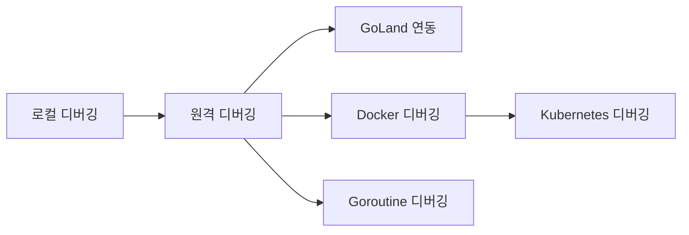
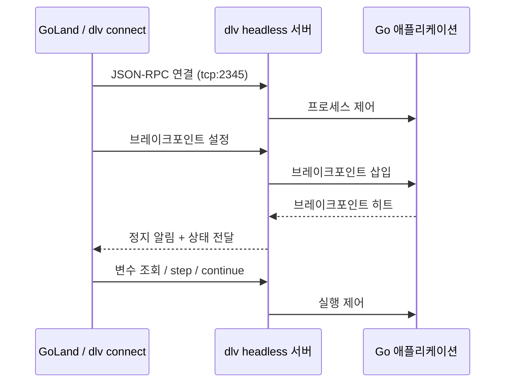
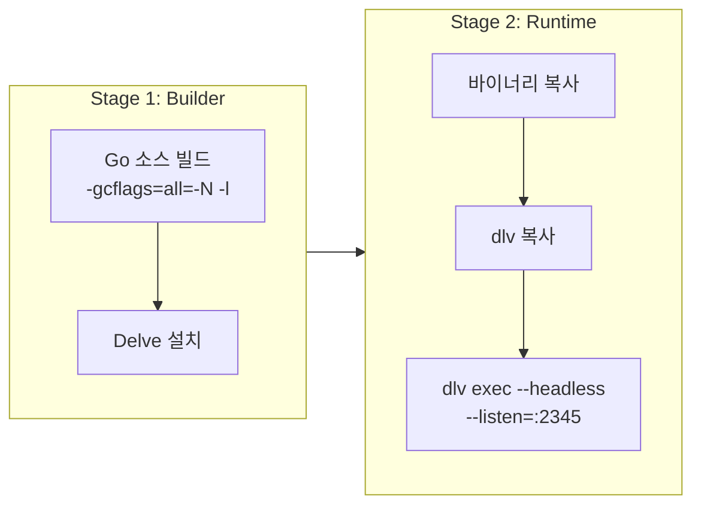
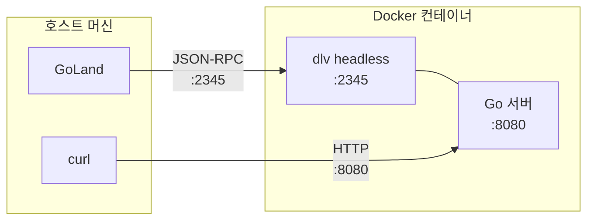
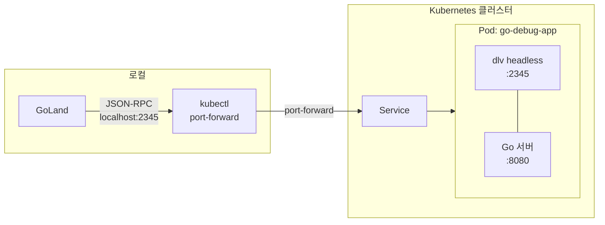

Go로 개발하다 보면 `fmt.Println`을 곳곳에 넣어 변수를 확인하는 소위 "프린트 디버깅"에 의존하게 되는 경우가 많다. 간단한 버그라면 이 방법도 충분하지만, goroutine 간 경쟁 조건이나 복잡한 상태 변화를 추적해야 할 때는 한계가 명확하다. 이 글에서는 Go 전용 디버거 **Delve(dlv)**를 활용하여 로컬부터 Docker, Kubernetes 환경까지 원격 디버깅하는 방법을 다룬다.

> 참고 자료
> - [Delve GitHub](https://github.com/go-delve/delve)
> - [Delve CLI Reference](https://github.com/go-delve/delve/blob/master/Documentation/cli/README.md)
> - [GoLand Remote Debugging](https://www.jetbrains.com/help/go/go-remote.html)

# 1. 개요 - 왜 Delve인가

## 1.1 fmt.Println 디버깅의 한계

프린트 디버깅은 가장 직관적인 방법이지만 몇 가지 근본적인 한계가 있다.

- **재컴파일 필수**: 디버그 출력을 추가할 때마다 코드 수정 → 빌드 → 실행을 반복해야 한다
- **실행 흐름 변경**: `fmt.Println` 자체가 I/O를 발생시켜 goroutine 스케줄링 타이밍이 변한다. 특히 동시성 버그 재현 시 문제가 된다
- **상태 추적 어려움**: 콜스택, goroutine 전환, 채널 상태 등을 한눈에 파악하기 어렵다
- **임시 코드 잔여**: 디버그 후 `fmt.Println`을 제거하지 않아 코드에 남는 경우가 많다

## 1.2 Delve vs GDB

GDB도 Go를 지원하지만, Go 런타임에 대한 이해가 부족하다. Delve는 Go 전용으로 설계되어 다음을 네이티브로 지원한다.

| 기능 | Delve | GDB |
|------|-------|-----|
| goroutine 전환/조회 | `goroutines`, `goroutine <id>` | 제한적 |
| channel 상태 확인 | `print ch` | 지원 안 됨 |
| defer 스택 추적 | `deferred` 명령어 | 지원 안 됨 |
| Go 런타임 인식 | 완벽 | 부분적 |
| 원격 디버깅 | headless 모드 내장 | gdbserver 필요 |

## 1.3 이 글에서 다루는 범위



# 2. Delve 설치 및 기본 사용법

## 2.1 설치

Go 1.21 이상 환경에서 다음 명령어로 설치한다.

```bash
go install github.com/go-delve/delve/cmd/dlv@latest
```

설치 확인:

```bash
$ dlv version
Delve Debugger
Version: 1.26.0
Build: $Id: 7fd7302eab8b16d715a94af1b5dfbffc2e1359bc $
```

**macOS 참고**: macOS에서는 처음 실행 시 "개발자 도구 접근" 허용 팝업이 나타날 수 있다. 허용해야 디버거가 정상 동작한다.

## 2.2 dlv 서브커맨드

| 서브커맨드 | 설명 |
|-----------|------|
| `dlv debug` | 현재 디렉토리(또는 지정 패키지)를 빌드 후 디버깅 시작 |
| `dlv exec` | 미리 컴파일된 바이너리를 디버깅 |
| `dlv attach <pid>` | 실행 중인 프로세스에 연결 |
| `dlv test` | 테스트 바이너리를 빌드 후 디버깅 |
| `dlv connect <addr>` | headless 디버그 서버에 연결 |
| `dlv core <binary> <core>` | 코어 덤프 분석 |
| `dlv trace` | 프로그램 트레이싱 |

가장 많이 사용하는 것은 `dlv debug`와 `dlv exec`이다.

```bash
# 소스 디렉토리에서 바로 디버깅
dlv debug ./golang/debugging/remote-debugging/

# 미리 빌드한 바이너리 디버깅 (디버그 플래그 필수)
go build -gcflags="all=-N -l" -o server ./golang/debugging/remote-debugging/
dlv exec ./server
```

> **중요**: `go build` 시 `-gcflags="all=-N -l"` 플래그를 반드시 추가해야 한다. `-N`은 최적화 비활성화, `-l`은 인라이닝 비활성화를 의미한다. 이 플래그 없이 빌드하면 변수 값이 `<optimized out>`으로 표시되거나 브레이크포인트가 원하는 위치에 걸리지 않는다.

## 2.3 디버거 내부 명령어

`dlv debug`로 디버깅 세션에 진입하면 대화형 프롬프트에서 다음 명령어를 사용할 수 있다.

**실행 제어:**

| 명령어 | 단축키 | 설명 |
|--------|--------|------|
| `continue` | `c` | 다음 브레이크포인트까지 실행 |
| `next` | `n` | 다음 라인으로 이동 (함수 내부 진입 안 함) |
| `step` | `s` | 다음 라인으로 이동 (함수 내부 진입) |
| `stepout` | `so` | 현재 함수에서 빠져나옴 |
| `restart` | `r` | 프로그램 재시작 |

**브레이크포인트 관리:**

| 명령어 | 단축키 | 설명 |
|--------|--------|------|
| `break` | `b` | 브레이크포인트 설정 |
| `breakpoints` | `bp` | 활성 브레이크포인트 목록 |
| `clear` | | 특정 브레이크포인트 삭제 |
| `clearall` | | 모든 브레이크포인트 삭제 |
| `condition` | `cond` | 조건부 브레이크포인트 설정 |
| `toggle` | | 브레이크포인트 활성화/비활성화 |

**변수 조회:**

| 명령어 | 단축키 | 설명 |
|--------|--------|------|
| `print` | `p` | 표현식 평가 및 출력 |
| `locals` | | 지역 변수 출력 |
| `args` | | 함수 인자 출력 |
| `whatis` | | 표현식의 타입 출력 |
| `set` | | 변수 값 변경 |
| `display` | | 매 정지 시 자동 출력할 표현식 등록 |

**goroutine 및 스택:**

| 명령어 | 단축키 | 설명 |
|--------|--------|------|
| `goroutines` | `grs` | 전체 goroutine 목록 |
| `goroutine` | `gr` | 현재 goroutine 확인 또는 전환 |
| `stack` | `bt` | 콜스택 출력 |
| `frame` | | 특정 스택 프레임으로 이동 |
| `up` | | 상위 프레임으로 이동 |
| `down` | | 하위 프레임으로 이동 |

**실습 예제:**

```bash
$ dlv debug ./golang/debugging/remote-debugging/
Type 'help' for list of commands.
(dlv) break main.go:97
Breakpoint 1 set at 0x1234567 for main.(*Server).healthHandler() ./main.go:97
(dlv) break main.go:107
Breakpoint 2 set at 0x1234568 for main.(*Server).processHandler() ./main.go:107
(dlv) condition 2 id > 5
(dlv) continue
```

위 예제에서는 `healthHandler`에 무조건 브레이크포인트를, `processHandler`에는 `id > 5`일 때만 정지하는 조건부 브레이크포인트를 설정했다.

# 3. 원격 디버깅 (Remote Debugging)

## 3.1 원격 디버깅 개념

원격 디버깅은 **디버그 서버**(dlv)와 **클라이언트**(IDE 또는 터미널)를 분리하여, 네트워크를 통해 디버깅하는 방식이다. 서버가 대상 프로세스를 제어하고, 클라이언트가 원격으로 명령을 보내는 구조다.



이 구조 덕분에 다음과 같은 시나리오가 가능하다:
- **원격 서버 디버깅**: 서버 머신에서 dlv headless 실행 → 로컬 IDE에서 연결
- **Docker 컨테이너 디버깅**: 컨테이너 내부에서 dlv 실행 → 호스트 IDE에서 연결
- **Kubernetes Pod 디버깅**: Pod 내부 dlv → port-forward → 로컬 IDE 연결

## 3.2 headless 모드와 주요 플래그

원격 디버깅의 핵심은 `--headless` 플래그다. 이 플래그를 사용하면 dlv가 대화형 프롬프트 없이 TCP 서버로 동작한다.

```bash
dlv debug ./golang/debugging/remote-debugging/ \
  --headless \
  --listen=:2345 \
  --api-version=2 \
  --accept-multiclient
```

| 플래그 | 설명 |
|--------|------|
| `--headless` | UI 없이 디버그 서버만 실행 |
| `--listen=:2345` | 수신 대기 주소와 포트 지정 |
| `--api-version=2` | JSON-RPC API v2 사용 (GoLand 호환) |
| `--accept-multiclient` | 여러 클라이언트 동시 연결 허용 |
| `--continue` | 서버 시작 즉시 프로그램 실행 (클라이언트 연결 전에도) |

## 3.3 원격 디버깅 실습

**터미널 1 - 디버그 서버 시작:**

```bash
$ dlv debug ./golang/debugging/remote-debugging/ \
    --headless --listen=:2345 --api-version=2 --accept-multiclient
API server listening at: [::]:2345
```

**터미널 2 - 클라이언트 연결:**

```bash
$ dlv connect localhost:2345
Type 'help' for list of commands.
(dlv) break main.go:97
Breakpoint 1 set at 0x100abcdef for main.(*Server).healthHandler() ./main.go:97
(dlv) continue
```

**터미널 3 - HTTP 요청 전송:**

```bash
$ curl localhost:8080/health
# → 터미널 2에서 브레이크포인트 히트
```

이 방식으로 실행 중인 서버에 외부 요청을 보내면서 브레이크포인트에서 정지된 상태를 확인할 수 있다.

# 4. GoLand 연동

## 4.1 GoLand 원격 디버깅 설정

GoLand는 Delve의 JSON-RPC 프로토콜을 기본 지원한다. 원격 디버그 서버에 연결하는 설정은 다음과 같다.

**Step 1: 디버그 서버 실행**

```bash
dlv debug ./golang/debugging/remote-debugging/ \
  --headless --listen=:2345 --api-version=2 --accept-multiclient
```

**Step 2: GoLand Run/Debug Configuration 설정**

1. `Run` → `Edit Configurations...` → `+` → `Go Remote` 선택
2. 설정 입력:
   - **Name**: `Delve Remote Debug`
   - **Host**: `localhost` (Docker/K8s의 경우에도 port-forward 후 localhost)
   - **Port**: `2345`
3. `OK`로 저장

**Step 3: 디버깅 시작**

1. 소스 코드에서 원하는 라인 클릭하여 브레이크포인트 설정
2. `Debug` 버튼 클릭 (벌레 아이콘)
3. 브레이크포인트에서 정지되면 Variables 패널에서 변수 값 확인

**Path Mappings (원격 경로 매핑):**

Docker나 원격 서버에서 소스 코드 경로가 다를 경우, Path Mappings를 설정해야 한다.

| Local Path | Remote Path |
|-----------|-------------|
| `/Users/user/src/tutorials-go` | `/app` |

GoLand의 Go Remote 설정에서 `Path mappings`에 위 매핑을 추가하면, 로컬 소스 파일의 브레이크포인트가 원격 바이너리의 올바른 위치에 매핑된다.

# 5. Docker 환경 원격 디버깅

## 5.1 디버그용 Docker 이미지 빌드

프로덕션 이미지와 별도로 **디버그 전용 이미지**를 만든다. 핵심은 두 가지다:
1. 빌드 시 최적화 비활성화 (`-gcflags="all=-N -l"`)
2. Delve를 이미지에 포함



**Dockerfile.debug:**

```dockerfile
# Stage 1: Build the Go binary with debug flags
FROM golang:1.26-alpine AS builder

WORKDIR /app

COPY go.mod go.sum ./
RUN go mod download

COPY . .

# Build with optimizations disabled for debugging
RUN CGO_ENABLED=0 go build -gcflags="all=-N -l" -o /app/server \
    ./golang/debugging/remote-debugging/

# Install Delve
RUN go install github.com/go-delve/delve/cmd/dlv@latest

# Stage 2: Runtime image with Delve
FROM alpine:3.21

RUN apk add --no-cache libc6-compat

WORKDIR /app

COPY --from=builder /app/server ./server
COPY --from=builder /go/bin/dlv /usr/local/bin/dlv

EXPOSE 8080 2345

CMD ["dlv", "exec", "./server", \
     "--headless", \
     "--listen=:2345", \
     "--api-version=2", \
     "--accept-multiclient", \
     "--continue"]
```

`--continue` 플래그는 클라이언트 연결을 기다리지 않고 즉시 프로그램을 시작한다. 이렇게 하면 서버가 바로 요청을 받을 수 있고, IDE에서 연결한 후 브레이크포인트를 설정할 수 있다.

## 5.2 docker-compose 구성

```yaml
services:
  app-debug:
    build:
      context: ../../../..
      dockerfile: golang/debugging/remote-debugging/Dockerfile.debug
    ports:
      - "8080:8080"   # Application port
      - "2345:2345"   # Delve debug port
    cap_add:
      - SYS_PTRACE
    security_opt:
      - apparmor:unconfined
    environment:
      - PORT=8080
```

**핵심 설정 설명:**

| 설정 | 설명 |
|------|------|
| `cap_add: SYS_PTRACE` | Delve가 `ptrace` 시스템콜을 사용해 프로세스를 제어하기 위해 필요 |
| `security_opt: apparmor:unconfined` | AppArmor가 ptrace를 차단하지 않도록 비활성화 |
| `ports: 2345:2345` | 호스트에서 컨테이너의 Delve 포트로 접근 |

> **보안 주의**: `SYS_PTRACE`와 `apparmor:unconfined`는 디버그 환경에서만 사용해야 한다. 프로덕션 환경에서는 절대 사용하지 않는다.

## 5.3 Docker 디버깅 워크플로우

```bash
# 1. 빌드 및 실행
cd golang/debugging/remote-debugging/
docker compose -f docker-compose.debug.yml up --build

# 2. GoLand에서 Go Remote로 localhost:2345 연결

# 3. 브레이크포인트 설정 후 요청 전송
curl -X POST localhost:8080/process
```



GoLand의 Path Mappings에 로컬 소스 경로와 컨테이너 내부 경로(`/app`)를 매핑한다.

# 6. Kubernetes 환경 원격 디버깅

## 6.1 디버그용 Pod 배포

Docker 디버그 이미지를 그대로 Kubernetes에 배포한다. 주의할 점은 **SecurityContext**와 **Probe 설정**이다.

**deployment.yaml:**

```yaml
apiVersion: apps/v1
kind: Deployment
metadata:
  name: go-debug-app
  labels:
    app: go-debug-app
spec:
  replicas: 1
  selector:
    matchLabels:
      app: go-debug-app
  template:
    metadata:
      labels:
        app: go-debug-app
    spec:
      containers:
        - name: app
          image: go-debug-app:latest
          imagePullPolicy: IfNotPresent
          ports:
            - name: http
              containerPort: 8080
            - name: debug
              containerPort: 2345
          securityContext:
            capabilities:
              add:
                - SYS_PTRACE
```

**중요 설정:**
- `SYS_PTRACE` capability: Docker와 마찬가지로 ptrace 허용 필수
- **readinessProbe / livenessProbe 비활성화**: 디버깅 중 브레이크포인트에서 정지하면 프로브가 실패하여 Pod가 재시작될 수 있다. 디버깅 시에는 프로브를 주석 처리한다

**service.yaml:**

```yaml
apiVersion: v1
kind: Service
metadata:
  name: go-debug-app
spec:
  type: ClusterIP
  selector:
    app: go-debug-app
  ports:
    - name: http
      port: 8080
      targetPort: 8080
    - name: debug
      port: 2345
      targetPort: 2345
```

## 6.2 포트 포워딩

클러스터 내부의 Delve 포트를 로컬로 포워딩한다.

```bash
# Pod 이름으로 직접 포워딩
kubectl port-forward pod/go-debug-app-xxxxx 2345:2345 8080:8080

# 또는 Service를 통해 포워딩
kubectl port-forward svc/go-debug-app 2345:2345 8080:8080
```

## 6.3 K8s 디버깅 워크플로우

전체 흐름은 다음과 같다:



**단계별 실행:**

```bash
# 1. 디버그 이미지 빌드 (레포 루트에서)
docker build -f golang/debugging/remote-debugging/Dockerfile.debug \
  -t go-debug-app:latest .

# 2. K8s 배포
kubectl apply -f golang/debugging/remote-debugging/k8s/

# 3. Pod 확인
kubectl get pods -l app=go-debug-app

# 4. 포트 포워딩
kubectl port-forward svc/go-debug-app 2345:2345 8080:8080

# 5. GoLand에서 Go Remote → localhost:2345 연결

# 6. 테스트 요청
curl -X POST localhost:8080/process
```

# 7. Goroutine 디버깅 테크닉

Go의 동시성 모델인 goroutine은 Delve에서 네이티브로 지원된다. 이 기능이 GDB 대비 Delve의 가장 큰 장점이다.

## 7.1 goroutine 목록 조회

```bash
(dlv) goroutines
* Goroutine 1 - User: ./main.go:155 main.main (0x100abc123) (thread 12345)
  Goroutine 2 - User: runtime/proc.go:402 runtime.gopark (0x100def456) [force gc (idle)]
  Goroutine 3 - User: runtime/proc.go:402 runtime.gopark (0x100def456) [GC sweep wait]
  Goroutine 18 - User: ./main.go:50 main.(*Worker).Run (0x100abc789) [select]
  Goroutine 19 - User: net/http.(*conn).serve (0x100ccc012) [IO wait]
```

`*`는 현재 활성 goroutine을 나타낸다. 각 goroutine의 상태(`select`, `IO wait`, `idle` 등)도 확인할 수 있다.

특정 goroutine으로 전환:

```bash
(dlv) goroutine 18
Switched from 1 to 18 (thread 12345)
(dlv) stack
0  0x100abc789 in main.(*Worker).Run
   at ./main.go:50
1  0x100abc890 in runtime.goexit
   at runtime/asm_arm64.s:1223
```

## 7.2 goroutine별 조건부 브레이크포인트

특정 goroutine에서만 브레이크포인트를 트리거하려면 `condition`을 사용한다.

```bash
# 브레이크포인트 설정
(dlv) break main.go:63
Breakpoint 1 set at 0x100abc123 for main.(*Worker).processJob() ./main.go:63

# goroutine ID 18에서만 정지
(dlv) condition 1 runtime.curg.goid == 18
```

`runtime.curg.goid`는 현재 goroutine의 ID를 반환하는 Delve 내장 표현식이다.

## 7.3 채널 및 뮤텍스 상태 확인

**채널 상태 확인:**

```bash
(dlv) print w.jobs
chan main.Job {
    qcount: 2,
    dataqsiz: 10,
    buf: *[10]main.Job [...],
    ...
}
```

`qcount`는 현재 버퍼에 있는 요소 수, `dataqsiz`는 버퍼 크기다.

**뮤텍스 상태 확인:**

```bash
(dlv) print w.mu
sync.Mutex {
    state: 0,    # 0 = unlocked, 1 = locked
    sema: 0,
}
```

`state`가 0이면 unlock 상태, 1 이상이면 lock 상태다. 데드락이 의심되면 여러 goroutine의 뮤텍스 상태를 확인하여 서로 lock을 기다리는지 파악한다.

# 8. 실전 팁 & 트러블슈팅

## 8.1 빌드 플래그 상세

```bash
# 전체 패키지에 적용 (권장)
go build -gcflags="all=-N -l" -o server ./cmd/server/

# 현재 패키지만 적용
go build -gcflags="-N -l" -o server ./cmd/server/
```

| 플래그 | 의미 |
|--------|------|
| `-N` | 최적화 비활성화 (disable optimizations) |
| `-l` | 인라이닝 비활성화 (disable inlining) |
| `all=` | 현재 모듈뿐 아니라 의존성 패키지에도 적용 |

`all=` 접두어를 붙이지 않으면 현재 패키지에만 적용되어, 의존성 패키지의 코드를 디버깅할 때 변수 값이 보이지 않을 수 있다.

**프로덕션/디버그 빌드 분리:**

```makefile
.PHONY: build build-debug

build:
	go build -o server ./cmd/server/

build-debug:
	go build -gcflags="all=-N -l" -o server-debug ./cmd/server/
```

## 8.2 자주 발생하는 문제

### could not attach to pid: 권한 문제

**macOS:**

```bash
# 개발자 도구 접근 허용
sudo DevToolsSecurity -enable
```

**Linux:**

```bash
# ptrace 범위 확인 (0=제한 없음, 1=자식만, 2=관리자만)
cat /proc/sys/kernel/yama/ptrace_scope

# 일시적으로 허용
echo 0 | sudo tee /proc/sys/kernel/yama/ptrace_scope
```

### connection refused

- dlv 서버가 실행 중인지 확인
- `--listen` 주소를 확인: `:2345` (모든 인터페이스) vs `127.0.0.1:2345` (로컬만)
- 방화벽/보안 그룹에서 포트가 열려 있는지 확인
- Docker의 경우 포트 매핑 확인 (`-p 2345:2345`)

### 변수가 \<optimized out\>으로 표시

```bash
# 원인: 빌드 시 최적화 플래그 미적용
go build -o server ./cmd/server/          # ❌ 최적화 활성화
go build -gcflags="all=-N -l" -o server . # ✅ 최적화 비활성화
```

### Docker에서 operation not permitted

```yaml
# docker-compose.yml에 추가
cap_add:
  - SYS_PTRACE
security_opt:
  - apparmor:unconfined
```

또는 `docker run` 시:

```bash
docker run --cap-add=SYS_PTRACE --security-opt=apparmor:unconfined ...
```

## 8.3 유용한 디버깅 옵션

```bash
# Go 버전 체크 생략 (dlv와 Go 버전 불일치 시)
dlv exec --check-go-version=false ./server

# RPC 통신 로그 출력 (연결 문제 진단)
dlv debug --headless --listen=:2345 --log --log-output=rpc

# 특정 함수에만 트레이스 설정
dlv trace --headless --listen=:2345 ./main.go 'main.(*Server).*'
```

# 9. 마무리

## 환경별 디버깅 방법 요약

| 환경 | dlv 실행 위치 | 연결 방식 | 필수 설정 |
|------|-------------|-----------|-----------|
| 로컬 | 로컬 터미널 | 직접 (`dlv debug`) | `-gcflags="all=-N -l"` |
| 원격 서버 | 원격 머신 | `dlv connect <host>:2345` | 방화벽 포트 개방 |
| Docker | 컨테이너 내부 | `localhost:2345` (포트 매핑) | `SYS_PTRACE`, `apparmor:unconfined` |
| Kubernetes | Pod 내부 | `kubectl port-forward` → `localhost:2345` | `SYS_PTRACE`, Probe 비활성화 |

## 핵심 체크리스트

- [ ] `-gcflags="all=-N -l"` 빌드 플래그 적용
- [ ] `--headless --listen=:2345 --api-version=2` 원격 디버깅 서버 실행
- [ ] Docker: `SYS_PTRACE` capability + `apparmor:unconfined`
- [ ] K8s: SecurityContext에 `SYS_PTRACE` + Probe 비활성화
- [ ] GoLand: Go Remote 설정 + Path Mappings 확인

본 포스팅에서 작성한 코드는 [GitHub](https://github.com/kenshin579/tutorials-go/tree/master/golang/debugging/remote-debugging)에서 확인할 수 있다.

# 참고

- [Delve GitHub Repository](https://github.com/go-delve/delve)
- [Delve CLI Reference](https://github.com/go-delve/delve/blob/master/Documentation/cli/README.md)
- [GoLand Remote Debugging Guide](https://www.jetbrains.com/help/go/go-remote.html)
- [Kubernetes Application Debugging](https://kubernetes.io/docs/tasks/debug/debug-application/)
