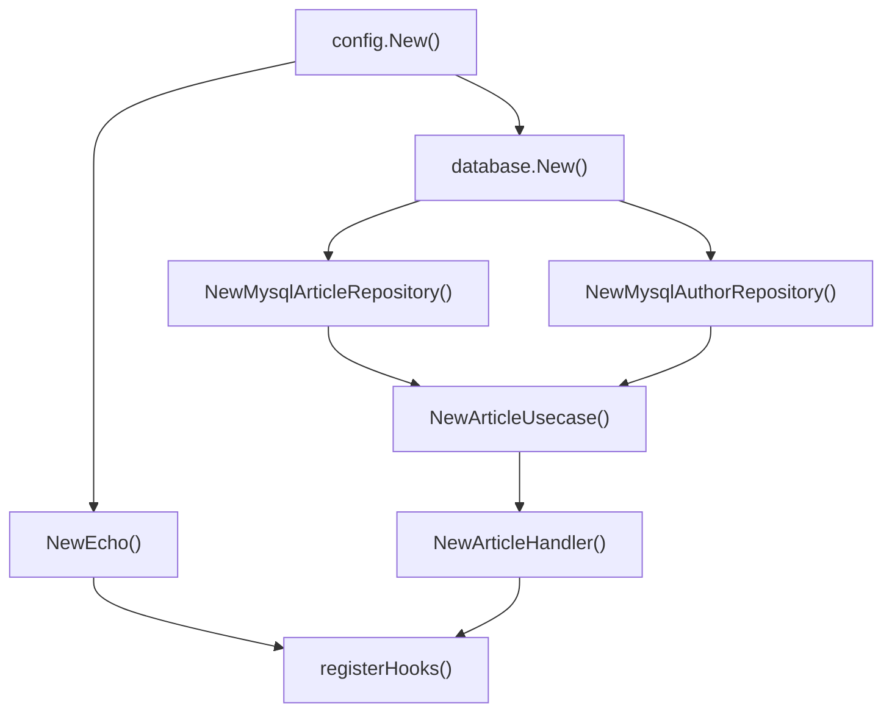

# 1. 들어가며

Go 애플리케이션이 커지면 의존성 조립이 복잡해진다. `main()`에서 생성자를 하나하나 호출하고, 매개변수 순서를 맞추고, 수명주기를 직접 관리해야 한다. uber/fx는 이 문제를 해결하는 Go용 DI(Dependency Injection) 프레임워크다.

이 글에서는 이전 글([Go Clean Architecture]())의 프로젝트에 fx가 어떻게 적용되는지를 중심으로, 기본 개념부터 fx.Module, fx.Decorate 등 고급 패턴, 그리고 fxtest를 활용한 테스트 전략까지 다룬다.

# 2. uber/fx로 의존성 주입 구현하기

## 2.1 Go에서 DI가 필요한 이유

Clean Architecture에서는 레이어 간 의존성이 많다. 예를 들어 Article API를 구성하려면 다음 의존성을 순서대로 조립해야 한다.

```go
// 수동 DI: main()에서 직접 조립
v := config.New()
db, _ := database.New(v)

authorRepo := author.NewMysqlAuthorRepository(db)
articleRepo := article.NewMysqlArticleRepository(db)

timeout := time.Duration(v.GetInt("context.timeout")) * time.Second
articleUsecase := article.NewArticleUsecase(articleRepo, authorRepo, timeout)

e := NewEcho()
article.NewArticleHandler(e, articleUsecase)

e.Start(v.GetString("server.address"))
```

의존성이 늘어날수록 이 코드는 급격히 복잡해진다. 순서를 틀리면 컴파일 에러가 나고, 새로운 서비스를 추가할 때마다 main()을 수정해야 한다.

uber/fx는 이 문제를 해결한다. 생성자 함수의 **매개변수와 반환 타입**을 분석하여 의존성 그래프를 자동으로 구성하고, 올바른 순서로 생성한다.

```bash
go get go.uber.org/fx
```

## 2.2 fx 기본 개념

fx의 핵심 API는 4가지다.

| API | 역할 | 설명 |
|-----|------|------|
| `fx.Provide()` | 생성자 등록 | 반환 타입을 기준으로 의존성 그래프에 등록 |
| `fx.Invoke()` | 부수 효과 실행 | 서버 시작 등 실행이 필요한 함수 호출 |
| `fx.Supply()` | 값 직접 제공 | 이미 생성된 인스턴스를 그대로 등록 |
| `fx.New()` | 앱 생성 | 위 요소들을 조합하여 앱 컨테이너 생성 |

`fx.Provide()`에 등록된 생성자는 즉시 실행되지 않는다. 다른 곳에서 해당 타입이 필요할 때 **lazy**하게 생성된다.

```go
// fx_test.go
func TestFx_Provide_Invoke(t *testing.T) {
    var svc *UserService

    app := fxtest.New(t,
        fx.Provide(
            NewLogger,       // Logger 인터페이스 반환
            NewMysqlUserRepo, // UserRepository 인터페이스 반환 (Logger 필요)
            NewUserService,   // *UserService 반환 (UserRepository 필요)
        ),
        fx.Invoke(func(s *UserService) {
            svc = s
        }),
    )
    defer app.RequireStop()
    app.RequireStart()

    assert.Equal(t, "user-1", svc.repo.FindByID(1))
}
```

`fx.Supply()`는 생성자 없이 이미 만들어진 값을 직접 제공한다.

```go
// fx_test.go
type Config struct {
    DBHost string
    DBPort int
}

cfg := &Config{DBHost: "localhost", DBPort: 3306}

app := fxtest.New(t,
    fx.Supply(cfg), // 생성자 없이 값 직접 등록
    fx.Invoke(func(c *Config) {
        // c.DBHost == "localhost"
    }),
)
```

## 2.3 Clean Architecture에서의 fx 적용

수동 DI 코드를 fx로 변환하면 다음과 같다.

```go
// cmd/main.go
app := fx.New(
    fx.Provide(
        config.New,              // *viper.Viper
        database.New,            // *sql.DB (viper 필요)
        NewEcho,                 // *echo.Echo
        ProvideBasicConfig,      // time.Duration

        article.NewArticleHandler,         // Handler (Echo, UseCase 필요)
        article.NewArticleUsecase,         // UseCase (Repo, AuthorRepo, Duration 필요)
        article.NewMysqlArticleRepository, // Repository (DB 필요)

        author.NewMysqlAuthorRepository,   // AuthorRepo (DB 필요)
    ),
    fx.Invoke(registerHooks),  // 서버 시작
)
```

fx는 각 생성자의 매개변수 타입을 보고 의존성 순서를 자동으로 결정한다. 예를 들어 `database.New(v *viper.Viper)`는 `*viper.Viper`가 필요하므로 `config.New()`가 먼저 호출된다.

각 생성자의 시그니처를 보면 의존성 관계가 명확하다.

```go
// pkg/config/config.go
func New() *viper.Viper { ... }

// pkg/database/db.go
func New(v *viper.Viper) (*sql.DB, error) { ... }

// article/usecase.go
func NewArticleUsecase(
    a domain.ArticleRepository,
    ar domain.AuthorRepository,
    timeout time.Duration,
) domain.ArticleUsecase { ... }

// article/handler.go
func NewArticleHandler(e *echo.Echo, us domain.ArticleUsecase) *ArticleHandler { ... }
```

## 2.4 Lifecycle 관리

`fx.Lifecycle`은 앱의 시작과 종료를 관리한다. `OnStart`에서 서버를 시작하고, `OnStop`에서 Graceful Shutdown을 처리한다.

```go
// cmd/main.go
func registerHooks(lifecycle fx.Lifecycle, e *echo.Echo, v *viper.Viper) {
    lifecycle.Append(
        fx.Hook{
            OnStart: func(context.Context) error {
                fmt.Println("Starting server")
                go e.Start(v.GetString("server.address"))
                return nil
            },
            OnStop: func(context.Context) error {
                fmt.Println("Stopping server")
                return nil
            },
        },
    )
}
```

`registerHooks`는 `fx.Invoke()`로 등록한다. `fx.Invoke()`는 앱 시작 시 즉시 호출되는 함수로, 주로 Lifecycle 등록이나 라우터 설정에 사용된다.

```go
// fx_test.go
func TestFx_Lifecycle(t *testing.T) {
    var startCalled, stopCalled bool

    app := fxtest.New(t,
        fx.Invoke(func(lc fx.Lifecycle) {
            lc.Append(fx.Hook{
                OnStart: func(context.Context) error {
                    startCalled = true
                    return nil
                },
                OnStop: func(context.Context) error {
                    stopCalled = true
                    return nil
                },
            })
        }),
    )

    app.RequireStart()
    assert.True(t, startCalled)

    app.RequireStop()
    assert.True(t, stopCalled)
}
```

## 2.5 fx.Module 패턴

`fx.Module()`은 관련 의존성을 도메인별로 그룹화한다. 앱이 커질수록 `fx.Provide()`에 생성자가 한꺼번에 나열되면 가독성이 떨어진다. Module로 분리하면 관심사가 명확해진다.

```go
// fx_test.go
var UserModule = fx.Module("user",
    fx.Provide(
        NewMysqlUserRepo,
        NewUserService,
    ),
)

var OrderModule = fx.Module("order",
    fx.Provide(
        NewMysqlOrderRepo,
        NewOrderService,
    ),
)

app := fxtest.New(t,
    fx.Provide(NewLogger), // 공통 의존성
    UserModule,
    OrderModule,
    fx.Invoke(func(u *UserService, o *OrderService) {
        // 모든 의존성이 자동으로 연결됨
    }),
)
```

실제 프로젝트에서는 각 도메인 패키지에 Module 변수를 정의하고, main()에서 조합하는 패턴이 일반적이다.

```go
// 실전 적용 예시
app := fx.New(
    fx.Provide(config.New, database.New, NewEcho),
    article.Module,   // article 도메인 모듈
    author.Module,    // author 도메인 모듈
    payment.Module,   // payment 도메인 모듈
    fx.Invoke(registerHooks),
)
```

> **fx.Module은 v1.17.0+부터 사용 가능**하다. 이전 버전에서는 `fx.Options()`로 유사한 그룹화가 가능하지만, 모듈 이름과 스코프 격리는 지원하지 않는다.

## 2.6 fx.Decorate 패턴

`fx.Decorate()`는 기존 의존성을 래핑하여 동작을 추가한다. 데코레이터 패턴과 동일한 개념으로, 로깅, 캐싱, 메트릭 수집 등에 활용된다.

```go
// fx_test.go
// 로깅 데코레이터: 기존 UserRepository를 래핑
type loggingUserRepo struct {
    inner  UserRepository
    logger Logger
    calls  []string
}

func (r *loggingUserRepo) FindByID(id int) string {
    r.calls = append(r.calls, fmt.Sprintf("FindByID(%d)", id))
    return r.inner.FindByID(id) // 원본 호출
}

app := fxtest.New(t,
    fx.Provide(NewLogger, NewMysqlUserRepo, NewUserService),
    // 기존 UserRepository를 로깅 래퍼로 교체
    fx.Decorate(func(repo UserRepository, logger Logger) UserRepository {
        return &loggingUserRepo{inner: repo, logger: logger}
    }),
    fx.Invoke(func(svc *UserService) {
        svc.repo.FindByID(1) // 로깅 래퍼를 통해 호출됨
    }),
)
```

`fx.Decorate()`는 원본 의존성을 매개변수로 받아 래핑된 새 인스턴스를 반환한다. UserService는 변경 없이 자동으로 래핑된 Repository를 주입받는다.

> **fx.Decorate는 v1.18.0+부터 사용 가능**하다.

## 2.7 고급 패턴

### 2.7.1 fx.Annotate + Named 의존성

동일 타입의 여러 인스턴스를 구분해야 할 때 `fx.Annotate()`와 `name` 태그를 사용한다. 예를 들어 Read/Write DB를 분리하는 경우다.

```go
// fx_test.go
type DBConnection struct {
    Name string
    DSN  string
}

func NewReadDB() *DBConnection {
    return &DBConnection{Name: "read", DSN: "read-replica:3306"}
}

func NewWriteDB() *DBConnection {
    return &DBConnection{Name: "write", DSN: "primary:3306"}
}
```

`fx.Annotate()`로 각 생성자에 이름을 부여한다.

```go
// fx_test.go
fx.Provide(
    fx.Annotate(NewReadDB, fx.ResultTags(`name:"readDB"`)),
    fx.Annotate(NewWriteDB, fx.ResultTags(`name:"writeDB"`)),
    NewDBService,
)
```

수신 측에서는 `fx.In` 구조체에 `name` 태그로 매칭한다.

```go
// fx_test.go
type DBParams struct {
    fx.In
    ReadDB  *DBConnection `name:"readDB"`
    WriteDB *DBConnection `name:"writeDB"`
}

func NewDBService(params DBParams) *DBService {
    return &DBService{
        readDB:  params.ReadDB,  // read-replica:3306
        writeDB: params.WriteDB, // primary:3306
    }
}
```

## 2.8 테스트에서의 fx

### 2.8.1 fxtest.New

`fxtest.New()`는 테스트 전용 앱을 생성한다. 테스트 실패 시 자동으로 정리되고, fx 로그가 테스트 출력에 포함된다.

```go
// fx_test.go
app := fxtest.New(t,
    fx.Provide(NewLogger, NewMysqlUserRepo, NewUserService),
    fx.Invoke(func(svc *UserService) { ... }),
)
defer app.RequireStop()
app.RequireStart()
```

### 2.8.2 fx.Replace로 Mock 주입

`fx.Replace()`는 기존 Provide를 완전히 교체한다. 테스트에서 실제 구현 대신 Mock을 주입할 때 유용하다.

```go
// fx_test.go
type mockUserRepo struct{}

func (r *mockUserRepo) FindByID(id int) string {
    return fmt.Sprintf("mock-user-%d", id) // Mock 응답
}

app := fxtest.New(t,
    fx.Provide(NewLogger, NewMysqlUserRepo, NewUserService),
    // 실제 UserRepository를 Mock으로 교체
    fx.Replace(fx.Annotate(&mockUserRepo{}, fx.As(new(UserRepository)))),
    fx.Invoke(func(svc *UserService) {
        result := svc.repo.FindByID(1)
        // result == "mock-user-1"
    }),
)
```

`fx.As(new(UserRepository))`는 `*mockUserRepo`를 `UserRepository` 인터페이스로 타입 변환하여 등록한다.

## 2.9 의존성 그래프 시각화

Clean Architecture 프로젝트에서 fx가 구성하는 의존성 그래프를 시각화하면 다음과 같다.



fx는 이 그래프를 생성자의 매개변수와 반환 타입만으로 자동 구성한다. 순환 의존성이 있으면 앱 시작 시 명확한 에러 메시지를 출력한다.

## 2.10 실전 팁

**순환 의존성 디버깅**: fx는 순환 의존성을 감지하면 상세한 에러 메시지를 출력한다. 기본 로거를 사용하면 의존성 해결 과정을 추적할 수 있다.

```go
// 디버깅용: fx 로그 활성화 (기본)
app := fx.New(
    fx.Provide(...),
    // fx.NopLogger, // 로그를 끄고 싶을 때만 사용
)
```

**과도한 DI 주의**: 모든 의존성을 fx로 관리할 필요는 없다. 단순한 유틸리티 함수나 값 객체는 직접 생성하는 것이 더 명확하다. fx는 **수명주기 관리가 필요한 컴포넌트**(DB 연결, HTTP 서버, 외부 클라이언트 등)에 집중하는 것이 좋다.

**fx.Provide vs fx.Invoke 구분**:
- `fx.Provide()`: 나중에 쓸 수 있도록 등록만 (lazy)
- `fx.Invoke()`: 즉시 실행이 필요한 부수 효과 (서버 시작, 라우터 등록)

# 3. 마무리

이 글에서는 uber/fx를 활용한 Go 애플리케이션의 의존성 주입 패턴을 살펴봤다.

- **기본 개념**: Provide, Invoke, Supply로 의존성 그래프 구성
- **Clean Architecture 적용**: 생성자 시그니처만으로 자동 의존성 해결
- **Lifecycle**: OnStart/OnStop으로 서버 수명주기 관리
- **fx.Module**: 도메인별 의존성 그룹화로 가독성 향상
- **fx.Decorate**: 기존 의존성을 래핑하여 로깅/캐싱 추가
- **고급 패턴**: Annotate + Named로 동일 타입 여러 인스턴스 관리
- **테스트**: fxtest.New + fx.Replace로 Mock 주입

fx는 수동 DI의 복잡도를 해결하면서도, 리플렉션 기반이기 때문에 컴파일 타임 타입 안전성은 다소 포기한다. 하지만 런타임 에러 메시지가 충분히 상세하고, 실전 프로젝트에서의 생산성 향상이 이를 상쇄한다.

## 3.1 프로젝트 소스

전체 소스 코드는 GitHub에서 확인할 수 있다:
- https://github.com/kenshin579/tutorials-go/tree/master/project-layout/go-clean-arch-v2

# 4. 참고

- [uber/fx 공식 문서](https://uber-go.github.io/fx/)
- [uber/fx GitHub](https://github.com/uber-go/fx)
- [uber/dig GitHub](https://github.com/uber-go/dig)
- [fx.Module 도입 (v1.17)](https://github.com/uber-go/fx/releases/tag/v1.17.0)
- [fx.Decorate 도입 (v1.18)](https://github.com/uber-go/fx/releases/tag/v1.18.0)
- [Go Dependency Injection - uber/fx](https://pkg.go.dev/go.uber.org/fx)
