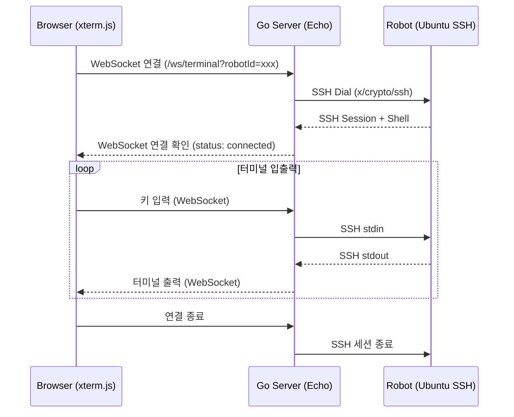

로봇이나 서버를 원격으로 관리할 때 보통 터미널에서 `ssh user@host`로 접속한다. 1~2대면 문제없지만, 여러 대를 관리해야 하는 환경에서는 매번 IP와 인증 정보를 찾아야 하고, 여러 터미널 창을 오가야 하며, 비개발자에게는 접근 장벽이 높다.

이 글에서는 **웹 브라우저에서 로봇 목록을 보고 클릭 한 번으로 SSH 터미널을 열어 명령어를 실행**할 수 있는 시스템을 Go와 React로 구축해 본다.

> 전체 소스 코드는 GitHub에서 확인할 수 있다: [web-ssh-terminal](https://github.com/kenshin579/tutorials-go/tree/master/web-ssh-terminal)

## 1. 아키텍처

### 1.1 전체 데이터 흐름

시스템은 세 개의 계층으로 구성된다.



**핵심 아이디어**: Go 서버가 브라우저와 로봇 사이의 **브릿지** 역할을 한다. 브라우저는 WebSocket으로 Go 서버와 통신하고, Go 서버는 SSH로 로봇과 통신한다.

### 1.2 기술 스택

| 계층 | 기술 | 역할 |
|------|------|------|
| 프론트엔드 | React 19 + Vite + xterm.js | 터미널 UI 렌더링, WebSocket 통신 |
| 백엔드 | Go 1.25 + Echo v4 | REST API, WebSocket ↔ SSH 브릿지 |
| WebSocket | gorilla/websocket | 브라우저 ↔ 서버 실시간 양방향 통신 |
| SSH | golang.org/x/crypto/ssh | 서버 → 로봇 SSH 연결 |

### 1.3 왜 WebSocket인가?

터미널은 키 하나를 누를 때마다 서버로 전송하고, 서버의 응답을 즉시 화면에 표시해야 한다. HTTP 요청/응답 모델로는 이런 실시간 양방향 스트림을 구현할 수 없다. WebSocket은 한 번 연결하면 양쪽에서 자유롭게 데이터를 주고받을 수 있어 터미널 입출력에 적합하다.

## 2. 프로젝트 구조

```
web-ssh-terminal/
├── backend/                        # Go 백엔드
│   ├── go.mod
│   ├── main.go                     # Echo 서버 엔트리포인트
│   ├── config.yaml                 # 로봇 목록 설정
│   └── internal/
│       ├── config/config.go        # YAML 설정 로더
│       ├── handler/
│       │   ├── robot.go            # GET /api/robots
│       │   └── terminal.go         # GET /ws/terminal (WebSocket + SSH)
│       └── model/robot.go          # Robot 구조체
├── frontend/                       # React 프론트엔드
│   ├── package.json
│   ├── vite.config.ts              # 프록시 설정 포함
│   └── src/
│       ├── App.tsx                 # React Router
│       ├── api/robots.ts           # API 유틸리티
│       ├── components/
│       │   ├── Terminal.tsx        # xterm.js 래퍼
│       │   ├── RobotCard.tsx       # 로봇 카드
│       │   └── ...
│       └── pages/
│           ├── HomePage.tsx        # 로봇 목록
│           └── TerminalPage.tsx    # 터미널 페이지
└── docker-compose.yaml             # 테스트용 SSH 서버
```

## 3. Go 백엔드 구현

### 3.1 로봇 모델과 설정

먼저 로봇을 표현하는 구조체를 정의한다.

```go
// internal/model/robot.go
package model

type AuthType string

const (
    AuthPassword   AuthType = "password"
    AuthPrivateKey AuthType = "privateKey"
)

type Robot struct {
    ID          string   `json:"id" yaml:"id"`
    Name        string   `json:"name" yaml:"name"`
    Host        string   `json:"host" yaml:"host"`
    Port        int      `json:"port" yaml:"port"`
    Username    string   `json:"username" yaml:"username"`
    AuthType    AuthType `json:"authType" yaml:"authType"`
    Description string   `json:"description,omitempty" yaml:"description"`
    IsOnline    bool     `json:"isOnline" yaml:"-"`
}
```

로봇 목록은 `config.yaml`에서 관리한다.

```yaml
# config.yaml
server:
  port: 8090

ssh:
  privateKeyPath: ~/.ssh/id_rsa

robots:
  - id: robot-1
    name: Assembly Robot A
    host: 192.168.1.101
    port: 22
    username: ubuntu
    authType: password
    description: 조립 라인 1번 로봇

  - id: robot-2
    name: Inspection Robot B
    host: 192.168.1.102
    port: 22
    username: ubuntu
    authType: privateKey
    description: 품질 검사 로봇
```

설정 로더는 YAML 파일을 읽어 `Config` 구조체로 변환한다.

```go
// internal/config/config.go
func Load(path string) (*Config, error) {
    data, err := os.ReadFile(path)
    if err != nil {
        return nil, err
    }

    var cfg Config
    if err := yaml.Unmarshal(data, &cfg); err != nil {
        return nil, err
    }

    if cfg.Server.Port == 0 {
        cfg.Server.Port = 8080
    }
    return &cfg, nil
}
```

### 3.2 로봇 목록 API

로봇 목록을 반환할 때 각 로봇의 SSH 포트에 TCP 연결을 시도하여 **온라인 상태**를 확인한다.

```go
// internal/handler/robot.go

// ListRobots handles GET /api/robots
func (h *RobotHandler) ListRobots(c echo.Context) error {
    robots := make([]model.Robot, len(h.cfg.Robots))
    copy(robots, h.cfg.Robots)

    for i := range robots {
        robots[i].IsOnline = checkSSHPort(robots[i].Host, robots[i].Port)
    }

    return c.JSON(http.StatusOK, robots)
}

func checkSSHPort(host string, port int) bool {
    addr := fmt.Sprintf("%s:%d", host, port)
    conn, err := net.DialTimeout("tcp", addr, 2*time.Second)
    if err != nil {
        return false
    }
    conn.Close()
    return true
}
```

`net.DialTimeout`으로 2초 내에 TCP 연결이 되면 Online, 실패하면 Offline으로 판단한다.

### 3.3 WebSocket + SSH 브릿지 (핵심)

이 핸들러가 시스템의 핵심이다. WebSocket 연결을 받아서 SSH 세션과 양방향으로 파이프하는 역할을 한다.

```go
// internal/handler/terminal.go

var upgrader = websocket.Upgrader{
    CheckOrigin: func(r *http.Request) bool { return true },
}

// HandleTerminal handles GET /ws/terminal?robotId=xxx
func (h *TerminalHandler) HandleTerminal(c echo.Context) error {
    robotID := c.QueryParam("robotId")

    // 1. 로봇 설정 조회
    var robot *model.Robot
    for i := range h.cfg.Robots {
        if h.cfg.Robots[i].ID == robotID {
            robot = &h.cfg.Robots[i]
            break
        }
    }
    if robot == nil {
        return echo.NewHTTPError(http.StatusNotFound, "robot not found")
    }

    // 2. HTTP → WebSocket 업그레이드
    ws, err := upgrader.Upgrade(c.Response(), c.Request(), nil)
    if err != nil {
        return err
    }
    defer ws.Close()

    // 3. SSH 연결
    sshConfig, err := h.buildSSHConfig(robot)
    if err != nil {
        ws.WriteJSON(map[string]string{"type": "error", "message": err.Error()})
        return nil
    }

    addr := fmt.Sprintf("%s:%d", robot.Host, robot.Port)
    conn, err := ssh.Dial("tcp", addr, sshConfig)
    if err != nil {
        ws.WriteJSON(map[string]string{
            "type": "error",
            "message": "SSH connection failed: " + err.Error(),
        })
        return nil
    }
    defer conn.Close()

    // 4. SSH 세션 + PTY + Shell
    session, err := conn.NewSession()
    if err != nil {
        ws.WriteJSON(map[string]string{"type": "error", "message": err.Error()})
        return nil
    }
    defer session.Close()

    modes := ssh.TerminalModes{
        ssh.ECHO:          1,
        ssh.TTY_OP_ISPEED: 14400,
        ssh.TTY_OP_OSPEED: 14400,
    }
    if err := session.RequestPty("xterm-256color", 24, 80, modes); err != nil {
        ws.WriteJSON(map[string]string{"type": "error", "message": err.Error()})
        return nil
    }

    sshIn, _ := session.StdinPipe()
    sshOut, _ := session.StdoutPipe()

    if err := session.Shell(); err != nil {
        ws.WriteJSON(map[string]string{"type": "error", "message": err.Error()})
        return nil
    }

    ws.WriteJSON(map[string]string{"type": "status", "message": "connected"})

    // 5. 양방향 파이프
    done := make(chan struct{})

    // SSH stdout → WebSocket (Browser)
    go func() {
        defer close(done)
        buf := make([]byte, 4096)
        for {
            n, err := sshOut.Read(buf)
            if err != nil {
                return
            }
            if err := ws.WriteMessage(websocket.TextMessage, buf[:n]); err != nil {
                return
            }
        }
    }()

    // WebSocket (Browser) → SSH stdin
    go func() {
        for {
            _, msg, err := ws.ReadMessage()
            if err != nil {
                session.Close()
                return
            }

            // 리사이즈 메시지 처리
            var resize resizeMessage
            if json.Unmarshal(msg, &resize) == nil && resize.Type == "resize" {
                session.WindowChange(resize.Rows, resize.Cols)
                continue
            }

            sshIn.Write(msg)
        }
    }()

    <-done
    return nil
}
```

처리 흐름을 단계별로 정리하면:

1. **로봇 조회**: `robotId` 쿼리 파라미터로 설정에서 로봇 정보를 찾는다
2. **WebSocket 업그레이드**: HTTP 연결을 WebSocket으로 업그레이드한다
3. **SSH 연결**: `ssh.Dial`로 로봇에 SSH 연결을 생성한다
4. **PTY + Shell**: `RequestPty`로 가상 터미널을 요청하고 `Shell`로 셸을 시작한다
5. **양방향 파이프**: 2개의 goroutine으로 SSH ↔ WebSocket 데이터를 양방향으로 전달한다

### 3.4 SSH 인증 설정

비밀번호와 공개키, 두 가지 인증 방식을 지원한다. 일부 SSH 서버는 `password` 대신 `keyboard-interactive` 방식을 요구하므로 두 방식을 모두 제공한다.

```go
func (h *TerminalHandler) buildSSHConfig(robot *model.Robot) (*ssh.ClientConfig, error) {
    sshCfg := &ssh.ClientConfig{
        User:            robot.Username,
        HostKeyCallback: ssh.InsecureIgnoreHostKey(), // 개발용
        Timeout:         10 * time.Second,
    }

    switch robot.AuthType {
    case model.AuthPassword:
        // 환경변수에서 비밀번호 로드: ROBOT_ROBOT_1_PASSWORD
        normalizedID := strings.ToUpper(strings.ReplaceAll(robot.ID, "-", "_"))
        envKey := fmt.Sprintf("ROBOT_%s_PASSWORD", normalizedID)
        password := os.Getenv(envKey)
        sshCfg.Auth = []ssh.AuthMethod{
            ssh.Password(password),
            ssh.KeyboardInteractive(func(user, instruction string,
                questions []string, echos []bool) ([]string, error) {
                answers := make([]string, len(questions))
                for i := range answers {
                    answers[i] = password
                }
                return answers, nil
            }),
        }

    case model.AuthPrivateKey:
        key, err := os.ReadFile(h.cfg.SSH.PrivateKeyPath)
        if err != nil {
            return nil, fmt.Errorf("failed to read private key: %w", err)
        }
        signer, err := ssh.ParsePrivateKey(key)
        if err != nil {
            return nil, fmt.Errorf("failed to parse private key: %w", err)
        }
        sshCfg.Auth = []ssh.AuthMethod{ssh.PublicKeys(signer)}
    }

    return sshCfg, nil
}
```

> **주의**: `ssh.InsecureIgnoreHostKey()`는 개발 편의를 위한 설정이다. 프로덕션에서는 반드시 `known_hosts` 파일을 검증하는 콜백을 사용해야 한다.

### 3.5 서버 엔트리포인트

```go
// main.go
func main() {
    _ = godotenv.Load()

    cfg, err := config.Load("config.yaml")
    if err != nil {
        log.Fatalf("Failed to load config: %v", err)
    }

    e := echo.New()

    e.Use(middleware.Logger())
    e.Use(middleware.Recover())
    e.Use(middleware.CORSWithConfig(middleware.CORSConfig{
        AllowOrigins: []string{"http://localhost:5173"},
    }))

    robotHandler := handler.NewRobotHandler(cfg)
    terminalHandler := handler.NewTerminalHandler(cfg)

    e.GET("/api/robots", robotHandler.ListRobots)
    e.GET("/ws/terminal", terminalHandler.HandleTerminal)

    // 프로덕션: React 빌드 정적 파일 서빙
    e.Static("/", "../frontend/dist")

    addr := fmt.Sprintf(":%d", cfg.Server.Port)
    e.Logger.Fatal(e.Start(addr))
}
```

`godotenv.Load()`로 `.env` 파일에서 SSH 비밀번호를 로드하고, Echo 서버에 REST API와 WebSocket 핸들러를 등록한다.

## 4. React 프론트엔드 구현

### 4.1 xterm.js 터미널 컴포넌트

프론트엔드의 핵심은 xterm.js를 감싼 `Terminal` 컴포넌트다.

```tsx
// src/components/Terminal.tsx
import { useEffect, useRef, useCallback } from 'react';
import { Terminal as XTerm } from '@xterm/xterm';
import { FitAddon } from '@xterm/addon-fit';
import '@xterm/xterm/css/xterm.css';

export default function Terminal({ robotId, onDisconnect }: TerminalProps) {
  const terminalRef = useRef<HTMLDivElement>(null);
  const cleanupRef = useRef<(() => void) | null>(null);

  const connect = useCallback(() => {
    if (!terminalRef.current) return;

    // 1. xterm.js 초기화
    const term = new XTerm({
      cursorBlink: true,
      fontSize: 14,
      fontFamily: 'Menlo, Monaco, "Courier New", monospace',
      theme: {
        background: '#1e1e2e',
        foreground: '#cdd6f4',
        cursor: '#f5e0dc',
      },
    });

    const fitAddon = new FitAddon();
    term.loadAddon(fitAddon);
    term.open(terminalRef.current);
    fitAddon.fit();

    // 2. WebSocket 연결 (Vite 프록시 경유)
    const protocol = window.location.protocol === 'https:' ? 'wss:' : 'ws:';
    const ws = new WebSocket(
      `${protocol}//${window.location.host}/ws/terminal?robotId=${robotId}`
    );

    // 3. 서버 → 브라우저: 터미널 출력
    ws.onmessage = (event) => {
      const data = event.data;
      try {
        const parsed = JSON.parse(data);
        if (parsed.type === 'status' || parsed.type === 'error') {
          term.writeln(`${parsed.type}: ${parsed.message}`);
          return;
        }
      } catch { /* 일반 터미널 출력 */ }
      term.write(data);
    };

    // 4. 브라우저 → 서버: 키 입력
    term.onData((data) => {
      if (ws.readyState === WebSocket.OPEN) ws.send(data);
    });

    // 5. 리사이즈 처리
    const handleResize = () => {
      fitAddon.fit();
      if (ws.readyState === WebSocket.OPEN) {
        ws.send(JSON.stringify({
          type: 'resize', cols: term.cols, rows: term.rows
        }));
      }
    };
    window.addEventListener('resize', handleResize);

    cleanupRef.current = () => {
      window.removeEventListener('resize', handleResize);
      ws.close();
      term.dispose();
    };
  }, [robotId, onDisconnect]);

  useEffect(() => {
    connect();
    return () => cleanupRef.current?.();
  }, [connect]);

  return (
    <div ref={terminalRef}
      className="w-full h-full min-h-[400px] bg-[#1e1e2e] rounded-lg p-1" />
  );
}
```

**xterm.js 핵심 포인트:**
- `FitAddon`이 컨테이너 크기에 맞춰 터미널 행/열을 자동 계산한다
- 브라우저 창 리사이즈 시 `fitAddon.fit()`으로 터미널을 다시 맞추고, resize 메시지를 서버에 보내 SSH PTY 크기도 함께 조정한다
- `term.onData`로 키 입력을 받아 WebSocket으로 전송한다
- 언마운트 시 WebSocket과 xterm 인스턴스를 정리한다

### 4.2 로봇 카드 컴포넌트

각 로봇을 카드 형태로 표시하고, 온라인 상태에 따라 Connect 버튼을 활성화/비활성화한다.

```tsx
// src/components/RobotCard.tsx
import { Link } from 'react-router-dom';
import StatusBadge from './StatusBadge';

export default function RobotCard({ id, name, host, port, description, isOnline }) {
  return (
    <div className="border rounded-xl p-6 bg-white shadow-sm hover:shadow-md transition-shadow">
      <div className="flex items-center justify-between mb-3">
        <h3 className="text-lg font-semibold">{name}</h3>
        <StatusBadge isOnline={isOnline} />
      </div>
      <p className="text-sm text-gray-500 font-mono">{host}:{port}</p>
      {description && <p className="text-sm text-gray-600 mt-2">{description}</p>}
      <div className="mt-4">
        {isOnline ? (
          <Link to={`/terminal/${id}`}
            className="px-4 py-2 bg-blue-600 text-white rounded-lg hover:bg-blue-700">
            Connect
          </Link>
        ) : (
          <span className="px-4 py-2 bg-gray-200 text-gray-400 rounded-lg cursor-not-allowed">
            Offline
          </span>
        )}
      </div>
    </div>
  );
}
```

### 4.3 Vite 프록시 설정

개발 환경에서 프론트엔드(포트 5173)가 Go 백엔드(포트 8090)에 접근할 수 있도록 Vite 프록시를 설정한다.

```typescript
// vite.config.ts
export default defineConfig({
  plugins: [react(), tailwindcss()],
  server: {
    proxy: {
      '/api': 'http://localhost:8090',
      '/ws': {
        target: 'http://localhost:8090',
        ws: true,  // WebSocket 프록시 활성화
      },
    },
  },
});
```

이렇게 하면 프론트엔드에서 `/api/robots`나 `/ws/terminal`을 호출할 때 자동으로 Go 서버로 프록시된다. 프로덕션에서는 Go 서버가 `frontend/dist/`의 정적 파일을 직접 서빙하므로 프록시가 필요 없다.

## 5. 실행 및 테스트

### 5.1 테스트 환경: Docker Compose

실제 로봇이 없어도 Docker로 SSH 서버를 띄워서 테스트할 수 있다.

```yaml
# docker-compose.yaml
services:
  robot-1:
    image: lscr.io/linuxserver/openssh-server:latest
    container_name: test-robot-1
    ports:
      - "2222:2222"   # 내부 포트가 2222
    environment:
      - PASSWORD_ACCESS=true
      - USER_PASSWORD=testpass
      - USER_NAME=ubuntu

  robot-2:
    image: lscr.io/linuxserver/openssh-server:latest
    container_name: test-robot-2
    ports:
      - "2223:2222"
    environment:
      - PASSWORD_ACCESS=true
      - USER_PASSWORD=testpass
      - USER_NAME=ubuntu
```

> **주의**: `linuxserver/openssh-server` 이미지는 SSH 기본 포트가 **2222**이다(22가 아님). 포트 매핑 시 `2222:2222`로 설정해야 한다.

### 5.2 실행 순서

```bash
# 1. 테스트 SSH 서버 실행
cd web-ssh-terminal
docker compose up -d

# 2. Go 백엔드 실행
cd backend
go run main.go
# > Server starting on :8090

# 3. React 프론트엔드 실행 (별도 터미널)
cd frontend
npm install
npm run dev
# > http://localhost:5173

# 4. 브라우저에서 http://localhost:5173 접속
```

### 5.3 동작 확인

브라우저에서 `http://localhost:5173`에 접속하면 로봇 목록이 표시된다.

**로봇 목록 페이지**: 각 로봇의 이름, IP, 온라인 상태, Connect 버튼이 카드 형태로 표시된다.

**터미널 페이지**: Connect를 클릭하면 SSH 터미널이 열리고, 실제 명령어를 입력하고 결과를 확인할 수 있다.

## 6. 대안 기술 비교

웹 기반 SSH 터미널을 구현하는 방법은 여러 가지가 있다.

| 기술 | 장점 | 단점 |
|------|------|------|
| **xterm.js + Go (이 글)** | 커스터마이징 자유도 높음, 단일 바이너리, 고성능 | 직접 구현 필요 |
| [Apache Guacamole](https://guacamole.apache.org/) | SSH/VNC/RDP 통합, 완성도 높음 | Java 기반, 무거움 |
| [Wetty](https://github.com/butlerx/wetty) | 설치 간단, 즉시 사용 가능 | 커스터마이징 제한적 |
| [ttyd](https://github.com/tsl0922/ttyd) | C 기반 경량, 빠름 | 웹 UI 커스터마이징 어려움 |

단일 서버에 빠르게 SSH를 열고 싶다면 Wetty나 ttyd가 적합하다. 하지만 **여러 로봇을 관리하는 대시보드**를 만들려면 직접 구현하는 것이 자유도가 높다.

## 7. 개선 아이디어

이 샘플 코드는 MVP 수준이다. 프로덕션 적용 시 고려할 사항:

- **사용자 인증**: JWT 기반 로그인, WebSocket 연결 시 토큰 검증
- **다중 터미널 탭**: 여러 로봇에 동시 접속, 탭으로 전환
- **세션 녹화**: 터미널 입출력을 저장하여 나중에 재생
- **파일 전송**: SCP/SFTP 기능 추가
- **SSH Host Key 검증**: `known_hosts` 파일 기반 검증
- **동시 접속 제한**: 로봇당 최대 세션 수 관리
- **로봇 CRUD**: 웹 UI에서 로봇 등록/수정/삭제

## 8. 정리

이 글에서는 Go 백엔드와 React 프론트엔드로 웹 기반 SSH 터미널 시스템을 구축해 보았다. 핵심은 **Go 서버가 WebSocket과 SSH 사이의 브릿지** 역할을 하는 것이다.

| 기술 | 용도 |
|------|------|
| `golang.org/x/crypto/ssh` | SSH 연결, PTY 요청, Shell 시작 |
| `gorilla/websocket` | 브라우저 ↔ 서버 실시간 통신 |
| `xterm.js` | 브라우저에서 터미널 에뮬레이션 |
| `Echo v4` | REST API + WebSocket 핸들러 |

## 참고 자료

- [전체 소스 코드 - GitHub](https://github.com/kenshin579/tutorials-go/tree/master/web-ssh-terminal)
- [xterm.js 공식 문서](https://xtermjs.org/)
- [golang.org/x/crypto/ssh](https://pkg.go.dev/golang.org/x/crypto/ssh)
- [gorilla/websocket](https://github.com/gorilla/websocket)
- [Echo v4 공식 문서](https://echo.labstack.com/)
