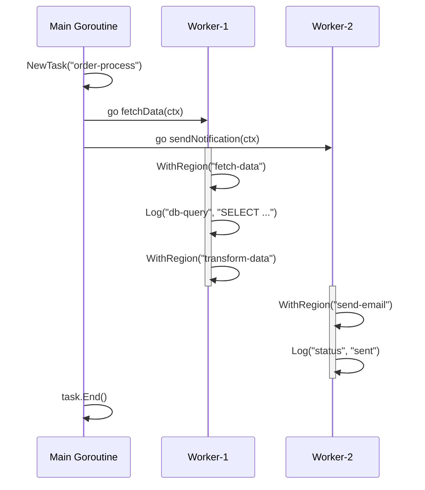
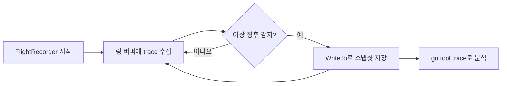
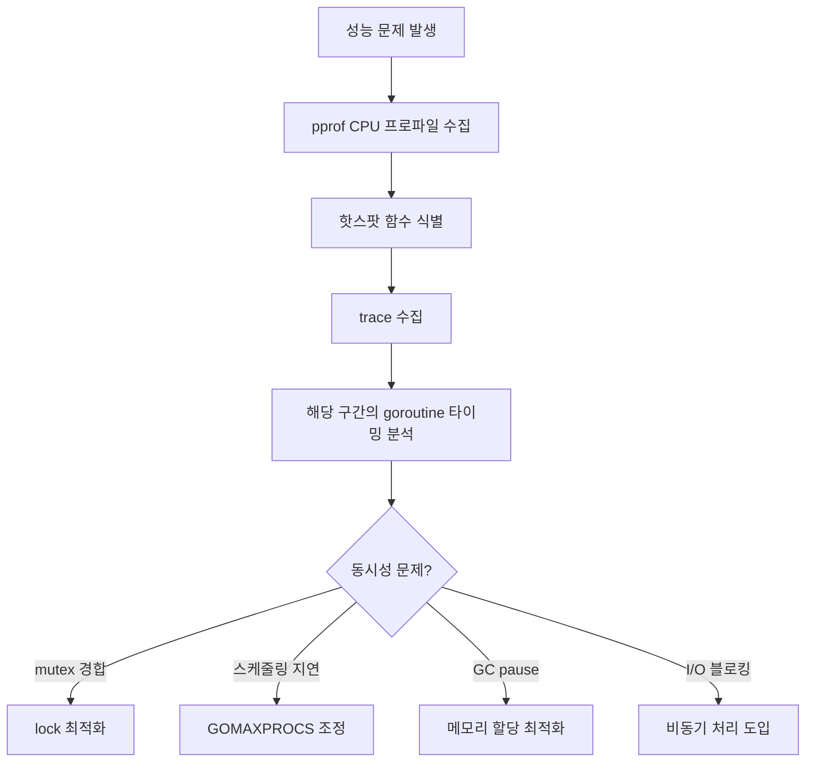
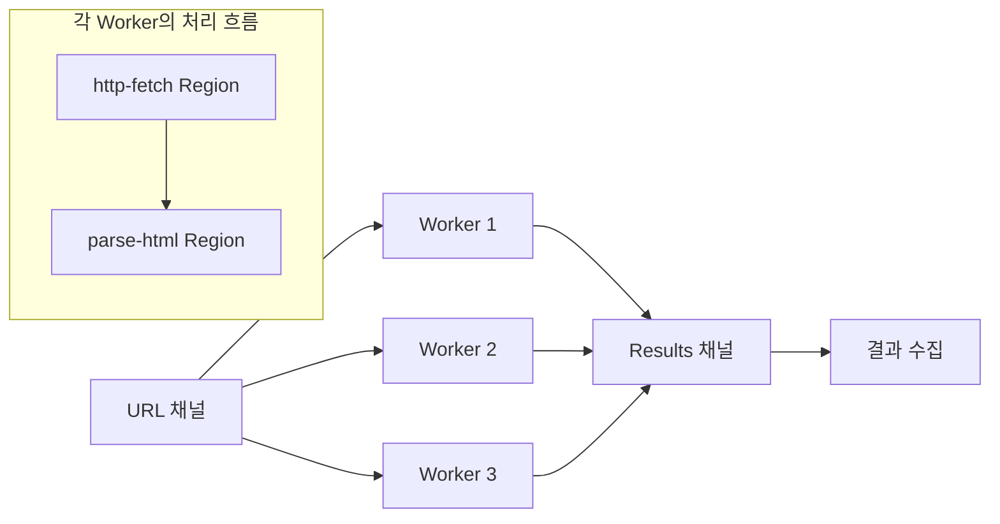

동시성 버그는 `fmt.Println`만으로는 원인을 찾기 어렵다. goroutine이 언제 실행되고 언제 블로킹되는지, 채널을 통해 데이터가 어떤 순서로 흐르는지를 **눈으로 확인**할 수 있다면 디버깅이 훨씬 쉬워진다. 이 글에서는 Go가 제공하는 동시성 시각화/분석 도구들을 실습과 함께 정리한다.

# 1. 왜 동시성 코드를 시각화해야 하는가

## 1.1 fmt.Println 디버깅의 한계

순차 코드에서는 로그를 한 줄씩 추가하면 실행 흐름을 추적할 수 있다. 하지만 동시성 코드에서는 이 방법이 통하지 않는 경우가 많다.

- **출력 순서가 보장되지 않는다**: goroutine의 실행 순서는 런타임 스케줄러에 의해 결정되므로, 로그 출력 순서가 실제 발생 순서와 다를 수 있다.
- **Heisenbug**: `fmt.Println`을 추가하면 내부적으로 동기화가 일어나 실행 타이밍이 바뀌면서 버그가 사라지는 현상(하이젠버그)이 발생할 수 있다.
- **인과관계 파악 불가**: 로그만으로는 "goroutine A가 채널에 값을 보낸 뒤 goroutine B가 받았다"는 인과관계를 정확히 파악하기 어렵다.

## 1.2 도구별 역할 비교

| 도구 | 유형 | 용도 | 오버헤드 |
|------|------|------|---------|
| `go tool trace` | 내장 | 전체 타임라인, GC, blocking 분석 | 1-2% CPU (Go 1.21+) |
| `GODEBUG=schedtrace` | 내장 | 스케줄러 상태 빠른 확인 | 거의 없음 |
| `gotraceui` | 서드파티 | 대용량 trace, 상세 goroutine 분석 | 없음 (뷰어) |
| `divan/gotrace` | 서드파티 | 교육용 3D 시각화 | 높음 |
| Flight Recorder | 내장 (Go 1.25) | 프로덕션 이상 징후 캡처 | 메모리 2-10 MB/s |

# 2. go tool trace 기본 사용법

`runtime/trace` 패키지는 Go 프로그램의 실행 이벤트(goroutine 생성/종료, 스케줄링, GC, syscall 등)를 수집한다. 수집된 데이터는 `go tool trace`로 브라우저에서 시각화할 수 있다.

## 2.1 trace 수집 3가지 방법

**방법 1: 코드에 직접 삽입**

`trace.Start`와 `trace.Stop`을 사용하여 원하는 구간만 정밀하게 수집한다.

```go
func TestBasicTrace_Start_Stop(t *testing.T) {
    f, err := os.CreateTemp(t.TempDir(), "trace_basic_*.out")
    assert.NoError(t, err)
    defer f.Close()

    // trace 수집 시작
    err = rttrace.Start(f)
    assert.NoError(t, err)

    // 여러 goroutine에서 동시 작업 수행
    var wg sync.WaitGroup
    for i := range 5 {
        wg.Add(1)
        go func() {
            defer wg.Done()
            sum := 0
            for range 1_000_000 {
                sum++
            }
            t.Logf("goroutine %d: sum=%d", i, sum)
        }()
    }
    wg.Wait()

    // trace 수집 중지
    rttrace.Stop()

    // trace 파일이 생성되었는지 검증
    info, err := f.Stat()
    assert.NoError(t, err)
    assert.Positive(t, info.Size(), "trace 파일이 비어있지 않아야 한다")
}
```

> `import rttrace "runtime/trace"`로 alias를 사용하면 표준 라이브러리의 `runtime/trace`와 패키지명 충돌을 피할 수 있다.

**방법 2: go test -trace 플래그**

코드를 수정하지 않고 테스트 실행 중 trace를 수집할 수 있다.

```bash
go test -v -trace=trace.out ./golang/concurrency/trace/...
go tool trace trace.out
```

**방법 3: HTTP endpoint (net/http/pprof)**

운영 중인 서버에서 HTTP 요청으로 trace를 수집한다.

```go
import _ "net/http/pprof"

// 기본 HTTP 서버에 pprof 핸들러가 자동 등록됨
// curl -o trace.out http://localhost:6060/debug/pprof/trace?seconds=5
```

## 2.2 trace 분석

수집된 trace 파일은 다음 명령으로 브라우저에서 열 수 있다.

```bash
go tool trace trace.out
```

브라우저에 여러 분석 뷰 링크가 표시된다. 각 뷰가 제공하는 정보는 다음 섹션에서 설명한다.

# 3. go tool trace 핵심 뷰 해석

## 3.1 View Trace (타임라인)

타임라인 뷰는 시간 축을 따라 프로그램의 모든 이벤트를 보여주는 핵심 뷰다.

- **Heap**: 메모리 할당 패턴. GC 후 힙이 줄어드는 패턴이 보인다
- **Goroutines**: running(실행 중) vs runnable(실행 가능하지만 대기 중) 개수. runnable이 높으면 P가 부족하거나 스케줄링 경합이 있다는 의미
- **OS Threads**: 활성 스레드 수. syscall로 블로킹된 스레드가 많으면 네트워크/디스크 I/O 병목 가능
- **PROCS**: 각 P(Processor)별 goroutine 실행 상황. GC STW(Stop-The-World) 이벤트도 여기서 확인 가능

## 3.2 Goroutine Analysis

goroutine을 유형별로 그룹화하여 시간 분포를 보여준다.

- **Execution**: 실제 CPU 실행 시간
- **Network wait**: 네트워크 I/O 대기
- **Sync block**: 뮤텍스, 채널 등 동기화 대기
- **Blocking syscall**: 시스템 콜 블로킹
- **Scheduler wait**: 실행 가능하지만 P를 기다리는 시간

goroutine 유형별로 어디서 시간을 가장 많이 소비하는지 파악할 수 있어, 병목 원인을 빠르게 식별할 수 있다.

## 3.3 Blocking Profiles

Network / Synchronization / Syscall 별 blocking 프로파일을 pprof 스타일 그래프로 보여준다. 어떤 함수에서 블로킹이 가장 많이 발생하는지 콜 그래프 형태로 확인할 수 있다.

## 3.4 Scheduler Latency Profile

goroutine이 runnable 상태가 된 후 실제로 P에서 실행될 때까지의 대기 시간 분포를 보여준다. 스케줄러 latency가 높다면 GOMAXPROCS를 늘리거나 goroutine 수를 줄이는 것을 고려해야 한다.

# 4. User-Defined Tasks와 Regions

기본 trace만으로도 goroutine 수준의 분석이 가능하지만, 비즈니스 로직 수준의 분석을 위해서는 **Task**, **Region**, **Log**를 활용해야 한다.

## 4.1 Task: 논리적 작업 단위

Task는 여러 goroutine에 걸친 논리적 작업을 하나로 묶어준다. 예를 들어 "주문 처리"라는 Task 안에 DB 조회, 결제, 알림 전송이 각각 다른 goroutine에서 실행되더라도 하나의 Task로 추적할 수 있다.

```go
ctx, task := rttrace.NewTask(ctx, "order-process")
defer task.End()
rttrace.Log(ctx, "orderID", "ORD-0001")
```

`go tool trace`에서 Task별 latency 히스토그램을 확인할 수 있어, 어떤 종류의 작업이 느린지 쉽게 파악할 수 있다.

## 4.2 Region: 구간 측정

Region은 단일 goroutine 내에서 특정 구간의 시간을 측정한다. 두 가지 방식으로 사용할 수 있다.

**WithRegion (클로저 방식)**

```go
rttrace.WithRegion(ctx, "fetch-data", func() {
    // 이 구간의 실행 시간이 trace에 기록된다
    time.Sleep(2 * time.Millisecond)
    result = 42
})
```

**StartRegion/End (수동 방식)**

클로저 바깥에서도 Region을 제어할 수 있고, 중첩(nested)도 가능하다.

```go
region := rttrace.StartRegion(ctx, "validation")
// 작업 수행
region.End()
```

## 4.3 Log: 이벤트 마킹

`trace.Log`는 trace 타임라인에 특정 시점의 상태를 기록한다.

```go
rttrace.Log(ctx, "request", "GET /api/users")
rttrace.Log(ctx, "cache", "HIT user-list")
```

## 4.4 Task/Region/Log 동작 흐름



# 5. GODEBUG 스케줄러 트레이싱

`go tool trace`는 정밀한 분석이 가능하지만, 때로는 **스케줄러의 매크로 상태**를 빠르게 확인하고 싶을 때가 있다. 이때 `GODEBUG=schedtrace`를 사용한다.

## 5.1 기본 사용법

```bash
GODEBUG=schedtrace=1000 ./myapp
```

1초(1000ms)마다 스케줄러 상태가 stderr로 출력된다.

```
SCHED 0ms: gomaxprocs=12 idleprocs=10 threads=3 spinningthreads=1
  needspinning=0 idlethreads=0 runqueue=0
  [0 0 0 0 0 0 0 0 0 0 0 0]
```

## 5.2 출력 필드 해석

| 필드 | 의미 |
|------|------|
| `gomaxprocs` | GOMAXPROCS 값 (P의 수) |
| `idleprocs` | 유휴 P의 수 |
| `threads` | OS 스레드(M) 수 |
| `spinningthreads` | 실행할 goroutine을 찾고 있는 M 수 |
| `runqueue` | 글로벌 실행 큐의 goroutine 수 |
| `[...]` | 각 P의 로컬 실행 큐 goroutine 수 |

## 5.3 scheddetail=1 상세 출력

```bash
GODEBUG=schedtrace=1000,scheddetail=1 ./myapp
```

P, M, G 각각의 상세 상태가 출력된다.

- **P 라인**: `status`(idle/running/syscall), `schedtick`, `syscalltick`, 로컬 큐 크기
- **M 라인**: P 바인딩 상태, spinning 여부, blocked 여부
- **G 라인**: goroutine 상태, 대기 이유

## 5.4 Goroutine 상태 코드

| 코드 | 이름 | 의미 |
|------|------|------|
| 0 | `_Gidle` | 생성 직후, 아직 초기화 안 됨 |
| 1 | `_Grunnable` | 실행 가능, 큐에서 대기 중 |
| 2 | `_Grunning` | M에서 실행 중 |
| 3 | `_Gsyscall` | 시스템 콜 실행 중 |
| 4 | `_Gwaiting` | 채널, 뮤텍스 등에서 블로킹 |

## 5.5 subprocess를 이용한 테스트

`GODEBUG` 환경변수는 프로세스 시작 시에만 적용되므로, 테스트에서는 `os/exec`로 subprocess를 실행하여 검증한다.

```go
func TestSchedtrace_GODEBUG_출력_파싱(t *testing.T) {
    if os.Getenv("SCHEDTRACE_HELPER") == "1" {
        // helper 프로세스: goroutine을 생성하여 스케줄러 활동 유발
        var wg sync.WaitGroup
        for range 50 {
            wg.Add(1)
            go func() {
                defer wg.Done()
                sum := 0
                for range 100_000 {
                    sum++
                }
            }()
        }
        wg.Wait()
        return
    }

    // 메인 테스트: subprocess로 helper 실행
    cmd := exec.Command(os.Args[0],
        "-test.run=TestSchedtrace_GODEBUG_출력_파싱",
        "-test.v",
    )
    cmd.Env = append(os.Environ(),
        "SCHEDTRACE_HELPER=1",
        "GODEBUG=schedtrace=100",
    )

    output, err := cmd.CombinedOutput()
    outputStr := string(output)

    assert.NoError(t, err, "subprocess 실행 실패")
    assert.Contains(t, outputStr, "SCHED", "schedtrace 출력이 있어야 한다")
    assert.Contains(t, outputStr, "gomaxprocs=", "gomaxprocs 필드가 있어야 한다")
}
```

`SCHEDTRACE_HELPER=1` 환경변수가 없으면 `t.Skip()` 대신 자연스럽게 subprocess 실행 경로로 분기하는 패턴이다. helper 프로세스는 `SCHEDTRACE_HELPER=1`이 설정되어 있을 때만 실제 워크로드를 수행한다.

# 6. Flight Recorder (Go 1.25)

## 6.1 Go trace 발전사

Go의 execution trace는 지속적으로 개선되어 왔다.

| 버전 | 변경사항 |
|------|---------|
| Go 1.21 | trace 오버헤드 10-20% → **1-2%**로 대폭 감소 |
| Go 1.22 | 새 trace 포맷 도입 (파티셔닝, 스트리밍, per-M 배치) |
| Go 1.25 | `runtime/trace.FlightRecorder` **정식 포함** |

## 6.2 FlightRecorder란

FlightRecorder는 **링 버퍼 방식**으로 항상 trace를 수집하다가, 이상 징후 발생 시 스냅샷을 저장하는 "블랙박스 레코더"다. 비행기의 블랙박스처럼, 문제가 발생한 **직전** 상황을 사후에 분석할 수 있다.



## 6.3 기본 API

```go
fr := rttrace.NewFlightRecorder(rttrace.FlightRecorderConfig{
    MinAge:   200 * time.Millisecond,  // 최소 보관 시간
    MaxBytes: 1 << 20,                 // 최대 1 MiB
})

fr.Start()
defer fr.Stop()

// 이상 징후 발생 시 스냅샷 저장
if latency > threshold {
    var buf bytes.Buffer
    fr.WriteTo(&buf)
}
```

- `MinAge`: 링 버퍼에 최소 이 시간만큼의 trace 데이터를 유지
- `MaxBytes`: 링 버퍼의 최대 크기. 초과 시 오래된 데이터부터 삭제

## 6.4 실전 예제: HTTP 서버 latency 감지

다음은 HTTP 서버에서 응답 시간이 threshold를 초과할 때 자동으로 FlightRecorder 스냅샷을 캡처하는 예제다.

```go
func TestFlightRecorder_HTTP서버_Latency_감지(t *testing.T) {
    const latencyThreshold = 50 * time.Millisecond

    fr := rttrace.NewFlightRecorder(rttrace.FlightRecorderConfig{
        MinAge:   200 * time.Millisecond,
        MaxBytes: 1 << 20,
    })

    err := fr.Start()
    assert.NoError(t, err)
    defer fr.Stop()

    // 가변 응답 시간 서버
    requestCount := 0
    var mu sync.Mutex
    server := httptest.NewServer(http.HandlerFunc(func(w http.ResponseWriter, r *http.Request) {
        mu.Lock()
        count := requestCount
        requestCount++
        mu.Unlock()

        // 5번째 요청마다 느린 응답 시뮬레이션
        if count%5 == 4 {
            time.Sleep(80 * time.Millisecond)
        } else {
            time.Sleep(5 * time.Millisecond)
        }
        fmt.Fprintf(w, "request-%d", count)
    }))
    defer server.Close()

    // 클라이언트: latency 초과 시 스냅샷 캡처
    var snapshots []int64
    client := server.Client()

    for i := range 10 {
        start := time.Now()
        resp, err := client.Get(server.URL)
        assert.NoError(t, err)
        io.Copy(io.Discard, resp.Body)
        resp.Body.Close()

        elapsed := time.Since(start)
        if elapsed > latencyThreshold {
            var buf bytes.Buffer
            n, _ := fr.WriteTo(&buf)
            snapshots = append(snapshots, n)
            t.Logf("스냅샷 캡처\! (크기: %d bytes, latency: %v)", n, elapsed)
        }
    }

    assert.NotEmpty(t, snapshots, "latency 초과 시 스냅샷이 캡처되어야 한다")
}
```

프로덕션 환경에서는 `fr.WriteTo`의 결과를 파일로 저장하거나 객체 스토리지에 업로드하여, 나중에 `go tool trace`로 분석할 수 있다.

## 6.5 MinAge/MaxBytes 설정 가이드

| 시나리오 | MinAge | MaxBytes | 설명 |
|---------|--------|----------|------|
| 빠른 요청 분석 | 200ms | 1 MiB | 단일 요청의 상세 trace |
| 배치 작업 분석 | 5s | 10 MiB | 긴 작업의 전체 흐름 추적 |
| 메모리 제한 환경 | 100ms | 512 KiB | 최소한의 메모리 사용 |

# 7. 서드파티 시각화 도구

## 7.1 gotraceui (dominikh/gotraceui)

`go tool trace`의 웹 기반 뷰어는 Chrome 의존성이 있고, 대용량 trace에서 느릴 수 있다. `gotraceui`는 이를 대체하는 네이티브 GUI 뷰어다.

**장점:**
- Chrome 의존성 없음 (Gio 프레임워크 기반 네이티브 앱)
- 대용량 trace 효율적 처리
- per-goroutine 타임라인, 히트맵, 플레임 그래프
- CPU 샘플 오버레이

**설치 및 사용:**

```bash
go install honnef.co/go/gotraceui/cmd/gotraceui@latest
gotraceui trace.out
```

> 메모리 요구사항: trace 파일 크기의 약 30배. 100MB trace → 약 3GB RAM 필요.

## 7.2 divan/gotrace (교육용 3D 시각화)

WebGL 기반 3D 애니메이션으로 goroutine과 채널 통신을 시각화한다.

- 파란 선 = goroutine 생명주기
- 빨간 화살표 = 채널을 통한 메시지 전달

fan-in, fan-out, worker pool 같은 동시성 패턴을 직관적으로 이해할 수 있어 **교육 목적**에 적합하다. 다만 짧은 프로그램만 시각화할 수 있고, 현재는 유지보수가 중단된 상태이므로 프로덕션 분석에는 적합하지 않다.

# 8. pprof와 trace 조합 활용

## 8.1 pprof vs trace

| 관점 | pprof | trace |
|------|-------|-------|
| 질문 | "무엇이 리소스를 소비하는가?" | "무슨 일이 어떤 순서로 일어났는가?" |
| 방식 | 샘플링 (통계적) | 전수 기록 (정밀) |
| 오버헤드 | CPU 프로파일 ~5% | 1-2% (Go 1.21+) |
| 출력 | 플레임 그래프, top N | 타임라인, goroutine 분석 |
| 강점 | CPU/메모리 핫스팟 식별 | 인과관계, 타이밍, 동시성 분석 |

## 8.2 조합 워크플로우



## 8.3 trace가 pprof보다 유리한 경우

- **goroutine 간 mutex 경합**: pprof의 mutex 프로파일은 전체 경합 시간만 보여주지만, trace는 어떤 goroutine이 어떤 시점에 lock을 대기했는지 정확히 보여준다
- **스케줄링 latency**: runnable이지만 P를 기다리는 시간은 pprof에서 보이지 않는다
- **GC pause 영향**: GC STW가 어떤 goroutine의 실행을 중단시켰는지 trace에서 확인 가능
- **채널 통신 패턴**: 채널을 통한 데이터 흐름과 deadlock 가능성은 trace에서만 분석 가능

## 8.4 동시 수집 예제

pprof CPU 프로파일과 trace를 동시에 수집할 수 있다.

```go
func TestPprof_Trace_동시수집(t *testing.T) {
    traceFile, _ := os.CreateTemp(t.TempDir(), "trace_combo_*.out")
    defer traceFile.Close()

    cpuFile, _ := os.CreateTemp(t.TempDir(), "cpu_combo_*.prof")
    defer cpuFile.Close()

    // trace + CPU 프로파일 동시 시작
    rttrace.Start(traceFile)
    pprof.StartCPUProfile(cpuFile)

    // 워크로드 실행...

    // 수집 중지
    rttrace.Stop()
    pprof.StopCPUProfile()

    // 분석:
    // go tool trace trace_combo.out
    // go tool pprof cpu_combo.prof
}
```

## 8.5 HTTP pprof 엔드포인트

`import _ "net/http/pprof"`를 추가하면 기본 HTTP 서버에 프로파일링 엔드포인트가 자동 등록된다.

| 엔드포인트 | 설명 |
|-----------|------|
| `/debug/pprof/` | 인덱스 (사용 가능한 프로파일 목록) |
| `/debug/pprof/profile` | CPU 프로파일 (기본 30초) |
| `/debug/pprof/trace` | execution trace (기본 1초) |
| `/debug/pprof/heap` | 메모리 할당 프로파일 |
| `/debug/pprof/goroutine` | goroutine 스택 덤프 |
| `/debug/pprof/block` | blocking 프로파일 |
| `/debug/pprof/mutex` | mutex 경합 프로파일 |

# 9. 실전 예제: Concurrent Web Crawler 트레이싱

마지막으로 Worker Pool 패턴 기반의 간단한 웹 크롤러에 Task/Region/Log 계측을 적용하여, trace에서 어떤 정보를 얻을 수 있는지 살펴본다.

## 9.1 크롤러 구조



## 9.2 계측 코드

```go
func TestCrawler_Task_Region_계측(t *testing.T) {
    f, _ := os.CreateTemp(t.TempDir(), "trace_crawler_*.out")
    defer f.Close()

    rttrace.Start(f)
    defer rttrace.Stop()

    // httptest 서버로 외부 의존성 없는 테스트 구성
    pages := map[string]string{
        "/":        `<a href="/about">About</a><a href="/blog">Blog</a>`,
        "/about":   `<h1>About Us</h1><a href="/contact">Contact</a>`,
        "/blog":    `<h1>Blog</h1><a href="/blog/post1">Post 1</a>`,
        "/contact": `<h1>Contact</h1>`,
    }
    server := httptest.NewServer(http.HandlerFunc(func(w http.ResponseWriter, r *http.Request) {
        time.Sleep(time.Duration(len(r.URL.Path)) * time.Millisecond)
        if body, ok := pages[r.URL.Path]; ok {
            fmt.Fprint(w, body)
        } else {
            http.NotFound(w, r)
        }
    }))
    defer server.Close()

    ctx := context.Background()
    ctx, mainTask := rttrace.NewTask(ctx, "web-crawler")
    defer mainTask.End()

    results := crawl(ctx, server.URL, server.Client(), 3)
    assert.NotEmpty(t, results, "크롤링 결과가 있어야 한다")
}
```

각 Worker는 URL을 받을 때마다 Task를 생성하고, HTTP 요청과 파싱을 각각 Region으로 감싼다.

```go
for url := range urls {
    taskCtx, task := rttrace.NewTask(ctx, "crawl-page")
    rttrace.Log(taskCtx, "url", url)
    rttrace.Log(taskCtx, "worker", workerName)

    // Region으로 각 단계 계측
    rttrace.WithRegion(taskCtx, "http-fetch", func() {
        // HTTP 요청...
    })
    rttrace.WithRegion(taskCtx, "parse-html", func() {
        // HTML 파싱...
    })

    task.End()
}
```

## 9.3 trace 분석 포인트

수집된 trace를 `go tool trace`로 열면 다음을 확인할 수 있다.

1. **Task별 latency**: "crawl-page" Task의 latency 히스토그램으로 각 URL 크롤링에 걸린 시간 분포를 확인
2. **Region별 시간 비교**: "http-fetch" vs "parse-html" 구간의 시간 비교로 네트워크 I/O와 파싱 중 어느 쪽이 병목인지 파악
3. **Worker 활용률**: Goroutine Analysis에서 Worker goroutine이 실행 중인 시간 대비 채널 대기 시간의 비율 확인
4. **스케줄링 효율**: Scheduler Latency Profile에서 Worker가 runnable이지만 P를 기다리는 시간 확인

# 10. 정리

| 도구/기법 | 핵심 | 사용 시점 |
|-----------|------|----------|
| `trace.Start/Stop` | 코드 삽입으로 정밀 구간 수집 | 개발/테스트 시 특정 구간 분석 |
| `go test -trace` | 코드 수정 없이 테스트 trace 수집 | 기존 테스트에서 빠르게 trace 확인 |
| `net/http/pprof` | HTTP로 런타임 trace 수집 | 운영 중인 서버 분석 |
| Task/Region/Log | 비즈니스 로직 수준 계측 | 논리적 작업의 latency 분석 |
| `GODEBUG=schedtrace` | 스케줄러 매크로 상태 출력 | 빠른 스케줄러 상태 확인 |
| Flight Recorder | 이상 징후 시 자동 스냅샷 | 프로덕션 tail latency 디버깅 |
| gotraceui | 대용량 trace 분석 GUI | Chrome 없이 대용량 trace 분석 |
| pprof + trace 조합 | CPU 핫스팟 + 동시성 인과관계 | 복합적 성능 문제 분석 |

동시성 코드의 성능 문제와 버그는 로그와 추측만으로는 해결하기 어렵다. `go tool trace`와 FlightRecorder를 적극 활용하여 **데이터 기반**으로 분석하는 습관을 들이자. 특히 Go 1.21 이후 trace 오버헤드가 1-2%로 크게 줄었으므로, 테스트 환경에서는 항상 trace를 수집하는 것을 권장한다.

> 예제 코드는 [GitHub](https://github.com/kenshin579/tutorials-go/tree/master/golang/concurrency/trace)에서 확인할 수 있다.

# 11. 참고

- [More powerful Go execution traces (Go Blog, 2024)](https://go.dev/blog/execution-traces-2024)
- [Flight Recorder in Go 1.25 (Go Blog)](https://go.dev/blog/flight-recorder)
- [runtime/trace 공식 문서](https://pkg.go.dev/runtime/trace)
- [Execution tracer overhaul design proposal (#60773)](https://go.googlesource.com/proposal/+/ac09a140c3d26f8bb62cbad8969c8b154f93ead6/design/60773-execution-tracer-overhaul.md)
- [Scheduler Tracing In Go (Ardan Labs)](https://www.ardanlabs.com/blog/2015/02/scheduler-tracing-in-go.html)
- [gotraceui (GitHub)](https://github.com/dominikh/gotraceui)
- [divan/gotrace (GitHub)](https://github.com/divan/gotrace)
- [Visualizing Concurrency in Go (divan blog)](https://divan.dev/posts/go_concurrency_visualize/)
