# 1. 방향 그래프 기초

## 1.1 그래프란

그래프(Graph)는 **정점(Vertex)**과 **간선(Edge)**의 집합으로 구성된 자료구조다. 수학적으로 `G = (V, E)`로 표현하며, 정점 간의 관계를 모델링하는 데 사용한다.

- **정점(Vertex, Node)**: 개체를 나타내는 점
- **간선(Edge)**: 정점 간의 연결 관계

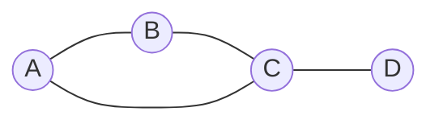

그래프는 소셜 네트워크, 도로망, 의존성 관리 등 다양한 분야에서 활용된다.

## 1.2 방향 vs 무방향 그래프

| 구분 | 방향 그래프 (Directed Graph) | 무방향 그래프 (Undirected Graph) |
|------|------|------|
| 간선 표현 | `u → v` (단방향) | `u — v` (양방향) |
| 순서 | (u, v) ≠ (v, u) | {u, v} = {v, u} |
| 예시 | 웹 하이퍼링크, 선수과목 | 친구 관계, 도로망 |
| 간선 수 | 최대 V(V-1) | 최대 V(V-1)/2 |

**방향 그래프**는 간선에 방향이 있어 `u → v`가 `v → u`를 의미하지 않는다. 이 글에서는 방향 그래프를 중심으로 다룬다.

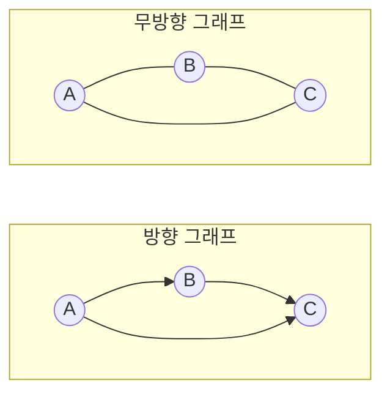

## 1.3 그래프 표현

그래프를 코드로 표현하는 대표적인 방법은 **인접 리스트(Adjacency List)**와 **인접 행렬(Adjacency Matrix)**이다.

### 1.3.1 인접 리스트 (Adjacency List)

각 정점마다 연결된 정점의 리스트를 저장한다. 희소 그래프(간선이 적은 그래프)에 적합하다.

```
0: [1, 2]
1: [3]
2: [3]
3: []
```

### 1.3.2 인접 행렬 (Adjacency Matrix)

V×V 크기의 2차원 배열로, `matrix[u][v] = 1`이면 `u → v` 간선이 존재한다. 밀집 그래프(간선이 많은 그래프)에 적합하다.

```
    0  1  2  3
0 [ 0, 1, 1, 0 ]
1 [ 0, 0, 0, 1 ]
2 [ 0, 0, 0, 1 ]
3 [ 0, 0, 0, 0 ]
```

### 1.3.3 비교

| 항목 | 인접 리스트 | 인접 행렬 |
|------|------|------|
| 공간복잡도 | O(V + E) | O(V²) |
| 간선 존재 확인 | O(degree) | O(1) |
| 모든 이웃 순회 | O(degree) | O(V) |
| 간선 추가 | O(1) | O(1) |
| 적합한 경우 | 희소 그래프 | 밀집 그래프 |

대부분의 실제 그래프는 희소하므로, **인접 리스트**를 더 자주 사용한다.

## 1.4 Go 인접 리스트 구현

```go
package graph

import "sort"

// Graph는 방향 그래프를 인접 리스트로 표현한다.
type Graph struct {
    adj map[int][]int // 정점 → 이웃 정점 리스트
}

func NewGraph() *Graph {
    return &Graph{adj: make(map[int][]int)}
}

// AddEdge는 u → v 간선을 추가한다.
func (g *Graph) AddEdge(u, v int) {
    g.adj[u] = append(g.adj[u], v)
    // v가 맵에 없으면 빈 슬라이스로 초기화
    if _, ok := g.adj[v]; !ok {
        g.adj[v] = []int{}
    }
}

// Vertices는 모든 정점을 정렬된 순서로 반환한다.
func (g *Graph) Vertices() []int {
    verts := make([]int, 0, len(g.adj))
    for v := range g.adj {
        verts = append(verts, v)
    }
    sort.Ints(verts)
    return verts
}
```

---

# 2. DFS (깊이 우선 탐색)

DFS(Depth-First Search)는 그래프 탐색 알고리즘으로, 한 경로를 끝까지 탐색한 후 되돌아와 다음 경로를 탐색하는 방식이다. 시간복잡도는 **O(V + E)**이다.

## 2.1 DFS 기본 동작

DFS는 각 정점을 세 가지 상태로 관리한다.

| 상태 | 의미 | 색상 관례 |
|------|------|------|
| 미방문 (White) | 아직 발견되지 않음 | 흰색 |
| 진행 중 (Gray) | 발견됨, 이웃 탐색 중 | 회색 |
| 완료 (Black) | 모든 이웃 탐색 완료 | 검정 |

다음 그래프에서 정점 0부터 DFS를 수행하는 과정을 살펴보자.

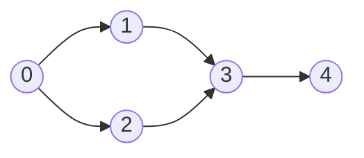

**탐색 순서**: 0 → 1 → 3 → 4 → (되돌아감) → 2

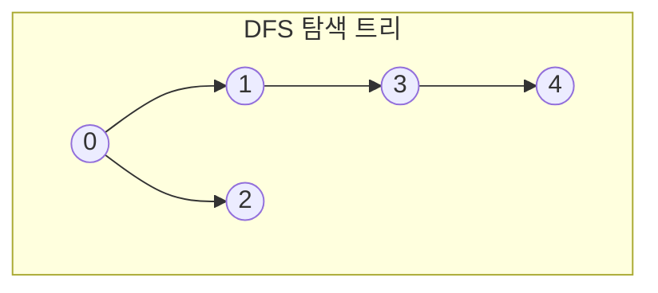

재귀 기반 DFS의 기본 구조는 다음과 같다.

```go
const (
    White = iota // 미방문
    Gray         // 진행 중
    Black        // 완료
)

func (g *Graph) dfs(u int, color map[int]int) {
    color[u] = Gray  // 발견: 진행 중으로 변경
    for _, v := range g.adj[u] {
        if color[v] == White {
            g.dfs(v, color) // 미방문 이웃 재귀 탐색
        }
    }
    color[u] = Black // 완료: 모든 이웃 탐색 끝
}
```

## 2.2 Discovery Time과 Finish Time

DFS에서 각 정점의 **발견 시점(Discovery Time)**과 **완료 시점(Finish Time)**을 기록하면, 그래프의 구조적 성질을 파악할 수 있다.

- **Discovery Time `d[u]`**: 정점 u를 처음 발견한 시점 (White → Gray)
- **Finish Time `f[u]`**: 정점 u의 탐색이 완료된 시점 (Gray → Black)

**괄호 정리(Parenthesis Theorem)**: 임의의 두 정점 u, v에 대해 `[d[u], f[u]]` 구간과 `[d[v], f[v]]` 구간은 완전히 포함되거나 완전히 분리된다.

다음 예시로 타임스탬프 추적 과정을 살펴보자.

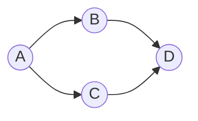

| 정점 | Discovery `d` | Finish `f` | 순서 |
|------|------|------|------|
| A | 1 | 8 | 가장 먼저 발견, 가장 나중에 완료 |
| B | 2 | 5 | A의 첫 번째 이웃 |
| D | 3 | 4 | B의 이웃, 리프 노드 |
| C | 6 | 7 | A의 두 번째 이웃 |

**Finish Order(후위 순서)**는 탐색이 완료되는 순서로 정점을 나열한 것이다: `D → B → C → A`

Finish Order는 **Kosaraju SCC 알고리즘**의 핵심 입력으로 사용된다. 첫 번째 DFS의 Finish Order 역순으로 두 번째 DFS를 수행하면 SCC를 찾을 수 있다.

## 2.3 간선 분류 (Edge Classification)

DFS를 수행하면 그래프의 모든 간선을 4가지로 분류할 수 있다. 이 분류는 순환 감지와 DAG 판별에 핵심적인 역할을 한다.

| 간선 종류 | 설명 | 발견 조건 (u → v) |
|------|------|------|
| Tree Edge | DFS 트리의 간선 | v가 미방문(White) |
| Back Edge | 조상 노드로 돌아가는 간선 | v가 진행 중(Gray) |
| Forward Edge | 자손 노드로 가는 비트리 간선 | v가 완료(Black), `d[u] < d[v]` |
| Cross Edge | 다른 서브트리로 가는 간선 | v가 완료(Black), `d[u] > d[v]` |

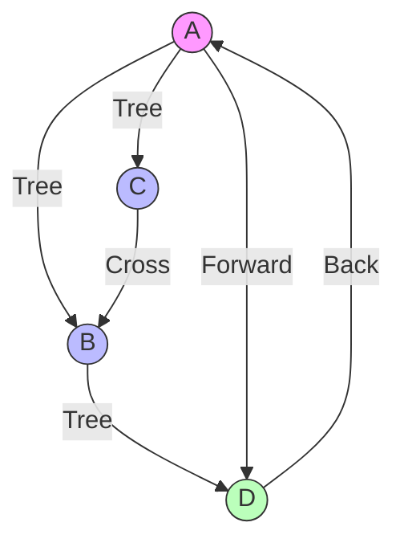

> **Back Edge가 존재하면 순환(Cycle)이 있다.** 이것이 순환 감지의 핵심 원리이며, Back Edge가 없으면 그래프는 DAG이다.

## 2.4 그래프 전치 (Transpose Graph)

**전치 그래프(Transpose Graph)** `G^T`는 원본 그래프 G의 모든 간선 방향을 뒤집은 그래프다. 즉, G에서 `u → v` 간선이 있으면 `G^T`에서는 `v → u` 간선이 존재한다.

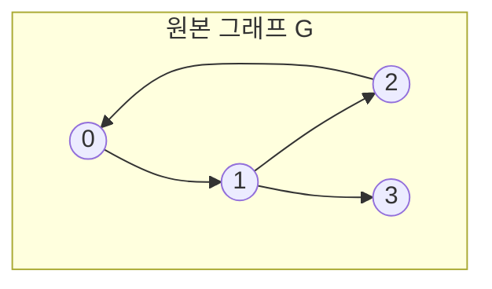

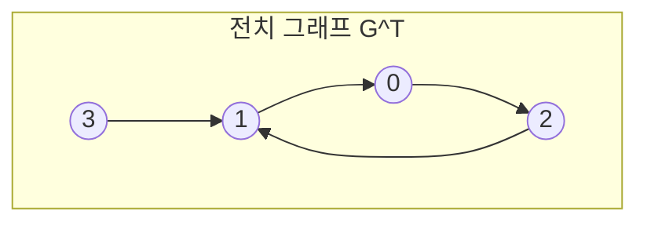

전치 그래프의 핵심 성질:
- 원본과 전치 그래프의 **SCC는 동일**하다
- **Kosaraju 알고리즘**의 2단계에서 전치 그래프 위에 DFS를 수행한다
- 구현은 인접 리스트에서 모든 간선 `u → v`를 `v → u`로 변환하면 된다

```go
// Transpose는 모든 간선의 방향을 뒤집은 전치 그래프를 반환한다.
func (g *Graph) Transpose() *Graph {
    gt := NewGraph()
    for u, neighbors := range g.adj {
        // u 정점이 전치 그래프에도 존재하도록 보장
        if _, ok := gt.adj[u]; !ok {
            gt.adj[u] = []int{}
        }
        for _, v := range neighbors {
            gt.adj[v] = append(gt.adj[v], u)
        }
    }
    return gt
}
```

---

# 3. DAG (Directed Acyclic Graph)

**DAG(Directed Acyclic Graph)**는 순환이 없는 방향 그래프다. DFS에서 **Back Edge가 하나도 없으면** 그 그래프는 DAG이다.

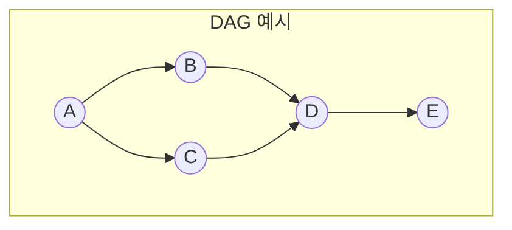

DAG가 중요한 이유:

- **위상정렬이 가능한 유일한 조건**: 방향 그래프에서 위상정렬은 DAG일 때만 존재한다
- **의존성 관계 표현**: 빌드 시스템(Makefile, Gradle), 작업 스케줄링, 대학 선수과목 등의 의존성을 모델링한다
- **SCC 축약 결과**: 방향 그래프의 SCC를 하나의 노드로 축약하면 항상 DAG가 된다

DAG 판별은 DFS로 간단하게 수행할 수 있다.

```go
// IsDAG는 그래프에 순환이 없는지(DAG인지) 확인한다.
func (g *Graph) IsDAG() bool {
    color := make(map[int]int) // 기본값 0 = White
    for _, v := range g.Vertices() {
        if color[v] == White {
            if g.hasCycle(v, color) {
                return false
            }
        }
    }
    return true
}

func (g *Graph) hasCycle(u int, color map[int]int) bool {
    color[u] = Gray
    for _, v := range g.adj[u] {
        if color[v] == Gray {
            return true // Back Edge 발견 → 순환 존재
        }
        if color[v] == White && g.hasCycle(v, color) {
            return true
        }
    }
    color[u] = Black
    return false
}
```

---

# 4. 위상정렬 (Topological Sort)

## 4.1 위상정렬이란

위상정렬(Topological Sort)은 DAG에서 모든 간선 `u → v`에 대해 **u가 v보다 앞에 오는 선형 순서**를 구하는 것이다. 위상정렬은 **DAG일 때만 가능**하며, 결과가 유일하지 않을 수 있다.

실생활 예시로 대학 선수과목 관계를 생각해보자.

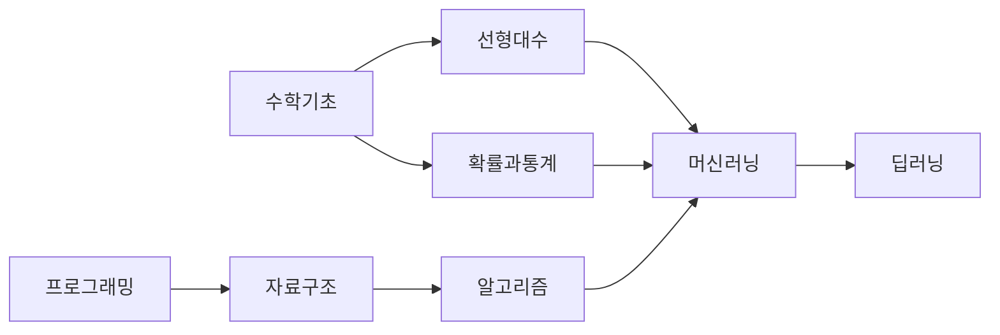

위 과목 의존성의 위상정렬 결과 중 하나: `수학기초 → 프로그래밍 → 선형대수 → 확률과통계 → 자료구조 → 알고리즘 → 머신러닝 → 딥러닝`

## 4.2 Kahn 알고리즘 (BFS 기반)

Kahn 알고리즘은 **진입차수(In-degree)**가 0인 정점부터 제거하는 방식으로 위상정렬을 수행한다.

**동작 과정**:
1. 모든 정점의 진입차수를 계산한다
2. 진입차수가 0인 정점을 큐에 넣는다
3. 큐에서 정점을 꺼내 결과에 추가하고, 해당 정점의 이웃 진입차수를 1 감소시킨다
4. 진입차수가 0이 된 정점을 큐에 넣는다
5. 큐가 빌 때까지 반복한다

**순환 감지**: 처리된 정점 수가 전체 정점 수보다 적으면 순환이 존재한다.

다음 그래프로 Kahn 알고리즘의 단계별 동작을 살펴보자.


**단계별 실행**:

| 단계 | 큐 | 꺼낸 정점 | 진입차수 변화 | 결과 |
|------|------|------|------|------|
| 초기 | [0] | - | 0:0, 1:1, 2:1, 3:2, 4:1 | [] |
| 1 | [] | 0 | 1:0, 2:0 | [0] |
| 2 | [1, 2] | 1 | 3:1 | [0, 1] |
| 3 | [2] | 2 | 3:0 | [0, 1, 2] |
| 4 | [3] | 3 | 4:0 | [0, 1, 2, 3] |
| 5 | [4] | 4 | - | [0, 1, 2, 3, 4] |

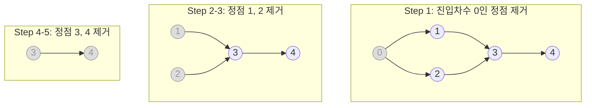

## 4.3 DFS 기반 위상정렬

DFS 기반 위상정렬은 **Finish Order의 역순**이 위상정렬 결과라는 성질을 이용한다.

DFS에서 정점의 탐색이 완료(Black)될 때마다 스택에 push하면, 스택의 pop 순서가 위상정렬 결과가 된다.

```go
func (g *Graph) TopologicalSortDFS() []int {
    color := make(map[int]int)
    stack := []int{}

    var dfs func(u int)
    dfs = func(u int) {
        color[u] = Gray
        for _, v := range g.adj[u] {
            if color[v] == White {
                dfs(v)
            }
        }
        color[u] = Black
        stack = append(stack, u) // Finish 시점에 스택에 추가
    }

    for _, v := range g.Vertices() {
        if color[v] == White {
            dfs(v)
        }
    }

    // 역순으로 뒤집기
    result := make([]int, len(stack))
    for i, v := range stack {
        result[len(stack)-1-i] = v
    }
    return result
}
```

## 4.4 Kahn vs DFS 비교

| 항목 | Kahn (BFS) | DFS 기반 |
|------|------|------|
| 접근 방식 | 진입차수 0인 정점부터 제거 | Finish Order의 역순 |
| 순환 감지 | 처리 정점 수 < 전체 정점 수 | Back Edge 존재 여부 |
| 자료구조 | 큐 + 진입차수 배열 | 재귀 스택 + 색상 배열 |
| 시간복잡도 | O(V + E) | O(V + E) |
| 주 용도 | 일반적인 위상정렬 | SCC 전처리 (Kosaraju) |
| 특징 | 사전순 정렬 등 변형이 쉬움 | 구현이 간결함 |

---

# 5. Go 구현 예제

위에서 설명한 개념들을 하나의 완성된 Go 코드로 정리한다.

## 5.1 그래프 구조체와 기본 연산

```go
package graph

import "sort"

const (
    White = iota
    Gray
    Black
)

// Graph는 방향 그래프를 인접 리스트로 표현한다.
type Graph struct {
    adj map[int][]int
}

func NewGraph() *Graph {
    return &Graph{adj: make(map[int][]int)}
}

func (g *Graph) AddEdge(u, v int) {
    g.adj[u] = append(g.adj[u], v)
    if _, ok := g.adj[v]; !ok {
        g.adj[v] = []int{}
    }
}

func (g *Graph) Vertices() []int {
    verts := make([]int, 0, len(g.adj))
    for v := range g.adj {
        verts = append(verts, v)
    }
    sort.Ints(verts)
    return verts
}
```

## 5.2 DFS with Timestamp

```go
// DFSResult는 DFS 수행 결과를 담는다.
type DFSResult struct {
    Discovery  map[int]int    // 발견 시점
    Finish     map[int]int    // 완료 시점
    FinishOrder []int         // 완료 순서
    EdgeType   map[[2]int]string // 간선 분류
}

func (g *Graph) DFS() *DFSResult {
    result := &DFSResult{
        Discovery: make(map[int]int),
        Finish:    make(map[int]int),
        EdgeType:  make(map[[2]int]string),
    }
    color := make(map[int]int)
    time := 0

    var visit func(u int)
    visit = func(u int) {
        time++
        result.Discovery[u] = time
        color[u] = Gray

        for _, v := range g.adj[u] {
            edge := [2]int{u, v}
            switch color[v] {
            case White:
                result.EdgeType[edge] = "tree"
                visit(v)
            case Gray:
                result.EdgeType[edge] = "back"
            case Black:
                if result.Discovery[u] < result.Discovery[v] {
                    result.EdgeType[edge] = "forward"
                } else {
                    result.EdgeType[edge] = "cross"
                }
            }
        }

        color[u] = Black
        time++
        result.Finish[u] = time
        result.FinishOrder = append(result.FinishOrder, u)
    }

    for _, v := range g.Vertices() {
        if color[v] == White {
            visit(v)
        }
    }
    return result
}
```

## 5.3 그래프 전치

```go
func (g *Graph) Transpose() *Graph {
    gt := NewGraph()
    for u, neighbors := range g.adj {
        if _, ok := gt.adj[u]; !ok {
            gt.adj[u] = []int{}
        }
        for _, v := range neighbors {
            gt.adj[v] = append(gt.adj[v], u)
        }
    }
    return gt
}
```

## 5.4 Kahn 위상정렬

```go
// KahnTopologicalSort는 BFS 기반 위상정렬을 수행한다.
// 순환이 있으면 nil을 반환한다.
func (g *Graph) KahnTopologicalSort() []int {
    inDegree := make(map[int]int)
    for _, v := range g.Vertices() {
        inDegree[v] = 0
    }
    for _, neighbors := range g.adj {
        for _, v := range neighbors {
            inDegree[v]++
        }
    }

    // 진입차수 0인 정점을 큐에 삽입
    queue := []int{}
    for _, v := range g.Vertices() {
        if inDegree[v] == 0 {
            queue = append(queue, v)
        }
    }

    result := []int{}
    for len(queue) > 0 {
        u := queue[0]
        queue = queue[1:]
        result = append(result, u)

        for _, v := range g.adj[u] {
            inDegree[v]--
            if inDegree[v] == 0 {
                queue = append(queue, v)
            }
        }
    }

    // 순환 감지: 처리 정점 수 < 전체 정점 수
    if len(result) != len(g.adj) {
        return nil
    }
    return result
}
```

## 5.5 DAG 판별

```go
func (g *Graph) IsDAG() bool {
    color := make(map[int]int)
    for _, v := range g.Vertices() {
        if color[v] == White {
            if g.hasCycle(v, color) {
                return false
            }
        }
    }
    return true
}

func (g *Graph) hasCycle(u int, color map[int]int) bool {
    color[u] = Gray
    for _, v := range g.adj[u] {
        if color[v] == Gray {
            return true
        }
        if color[v] == White && g.hasCycle(v, color) {
            return true
        }
    }
    color[u] = Black
    return false
}
```

## 5.6 테스트

```go
package graph

import (
    "testing"
)

func TestDFS(t *testing.T) {
    g := NewGraph()
    g.AddEdge(0, 1)
    g.AddEdge(0, 2)
    g.AddEdge(1, 3)
    g.AddEdge(2, 3)
    g.AddEdge(3, 4)

    result := g.DFS()

    // Discovery와 Finish가 모든 정점에 대해 기록되었는지 확인
    for _, v := range g.Vertices() {
        if _, ok := result.Discovery[v]; !ok {
            t.Errorf("Discovery time not recorded for vertex %d", v)
        }
        if _, ok := result.Finish[v]; !ok {
            t.Errorf("Finish time not recorded for vertex %d", v)
        }
    }

    // Tree Edge 확인
    if result.EdgeType[[2]int{0, 1}] != "tree" {
        t.Errorf("Edge 0→1 should be tree edge")
    }
}

func TestTranspose(t *testing.T) {
    g := NewGraph()
    g.AddEdge(0, 1)
    g.AddEdge(1, 2)
    g.AddEdge(2, 0)

    gt := g.Transpose()

    // 전치 그래프에서 1→0 간선이 있어야 한다
    found := false
    for _, v := range gt.adj[1] {
        if v == 0 {
            found = true
        }
    }
    if !found {
        t.Errorf("Transpose should have edge 1→0")
    }
}

func TestIsDAG(t *testing.T) {
    // DAG
    dag := NewGraph()
    dag.AddEdge(0, 1)
    dag.AddEdge(0, 2)
    dag.AddEdge(1, 3)
    dag.AddEdge(2, 3)
    if !dag.IsDAG() {
        t.Error("Expected DAG")
    }

    // 순환 그래프
    cyclic := NewGraph()
    cyclic.AddEdge(0, 1)
    cyclic.AddEdge(1, 2)
    cyclic.AddEdge(2, 0)
    if cyclic.IsDAG() {
        t.Error("Expected cyclic graph")
    }
}

func TestKahnTopologicalSort(t *testing.T) {
    g := NewGraph()
    g.AddEdge(0, 1)
    g.AddEdge(0, 2)
    g.AddEdge(1, 3)
    g.AddEdge(2, 3)
    g.AddEdge(3, 4)

    result := g.KahnTopologicalSort()
    if result == nil {
        t.Fatal("Expected non-nil result for DAG")
    }
    if len(result) != 5 {
        t.Fatalf("Expected 5 vertices, got %d", len(result))
    }

    // 위상 순서 검증: 모든 간선 u→v에 대해 u가 v보다 앞에 있어야 한다
    pos := make(map[int]int)
    for i, v := range result {
        pos[v] = i
    }
    edges := [][2]int{{0, 1}, {0, 2}, {1, 3}, {2, 3}, {3, 4}}
    for _, e := range edges {
        if pos[e[0]] >= pos[e[1]] {
            t.Errorf("Topological order violated: %d should come before %d", e[0], e[1])
        }
    }
}

func TestTopologicalSortDFS(t *testing.T) {
    g := NewGraph()
    g.AddEdge(0, 1)
    g.AddEdge(0, 2)
    g.AddEdge(1, 3)
    g.AddEdge(2, 3)
    g.AddEdge(3, 4)

    result := g.TopologicalSortDFS()
    if len(result) != 5 {
        t.Fatalf("Expected 5 vertices, got %d", len(result))
    }

    pos := make(map[int]int)
    for i, v := range result {
        pos[v] = i
    }
    edges := [][2]int{{0, 1}, {0, 2}, {1, 3}, {2, 3}, {3, 4}}
    for _, e := range edges {
        if pos[e[0]] >= pos[e[1]] {
            t.Errorf("Topological order violated: %d should come before %d", e[0], e[1])
        }
    }
}

func TestKahnTopologicalSort_Cycle(t *testing.T) {
    g := NewGraph()
    g.AddEdge(0, 1)
    g.AddEdge(1, 2)
    g.AddEdge(2, 0)

    result := g.KahnTopologicalSort()
    if result != nil {
        t.Error("Expected nil for cyclic graph")
    }
}
```

---

# 6. 정리

이 글에서 다룬 핵심 개념을 정리하면 다음과 같다.

| 개념 | 핵심 내용 | SCC와의 관계 |
|------|------|------|
| 인접 리스트 | O(V+E) 공간, 희소 그래프에 적합 | SCC 알고리즘의 기본 그래프 표현 |
| DFS | O(V+E) 탐색, 3가지 색상 관리 | SCC 탐색의 기반 알고리즘 |
| Discovery/Finish Time | 정점의 발견/완료 시점 기록 | Kosaraju의 Finish Order 입력 |
| 간선 분류 | Tree, Back, Forward, Cross | Back Edge = 순환 존재 |
| 그래프 전치 | 모든 간선 방향 뒤집기 | Kosaraju 2단계에서 사용 |
| DAG | Back Edge 없는 방향 그래프 | SCC 축약 결과는 항상 DAG |
| 위상정렬 (Kahn) | 진입차수 0부터 BFS 제거 | DAG 위의 순서 결정 |
| 위상정렬 (DFS) | Finish Order 역순 | Kosaraju 전처리 |

다음 글에서는 이 기초 개념을 바탕으로 **SCC(강연결 요소) 알고리즘과 도달 가능성 판정**을 다룬다.

---

# 7. 참고

- Introduction to Algorithms (CLRS) — Chapter 22: Elementary Graph Algorithms
- [Wikipedia: Depth-First Search](https://en.wikipedia.org/wiki/Depth-first_search)
- [Wikipedia: Topological Sorting](https://en.wikipedia.org/wiki/Topological_sorting)
- [Wikipedia: Directed Acyclic Graph](https://en.wikipedia.org/wiki/Directed_acyclic_graph)
